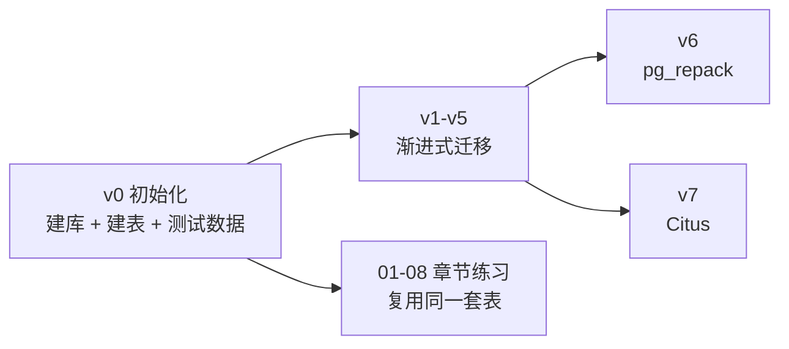

## 前置知识：为什么需要统一初始化

> [!important] 本脚本是所有毕业项目和章节练习的公共基座
> • v1-v7 毕业项目和 01-08 章节练习中引用的表结构和测试数据全部在此统一定义
> • 执行任何毕业项目前，先运行 `init.sql` 完成建库建表 + 数据填充
> • 技术报告 M-5 修复：解决了 08 业务场景和 v1-v5 缺少统一初始化脚本的问题



---

## 一、环境前置（postgresql.conf 配置）

```sql
-- ============================================
-- postgresql.conf 需要配置的参数（修改后重启 PG）
-- ============================================
-- shared_preload_libraries = 'pg_stat_statements,pg_cron'  -- 预加载扩展
-- max_connections = 100
-- shared_buffers = 256MB
-- work_mem = 4MB
-- maintenance_work_mem = 128MB
-- autovacuum = on
-- log_min_duration_statement = 100  -- 记录 >100ms 的慢查询

-- 版本声明：本路径基于 PostgreSQL 14+ / MySQL 8.0+
SELECT version();
```

---

## 二、扩展安装

> [!warning] 先建库、再装扩展
> 扩展是安装到「当前连接的数据库」里的。本节必须放在「三、建库与角色」之后执行：先 `CREATE DATABASE learn_pg`，再在 psql 中执行 `\c learn_pg` 连接到该库，然后回到本节执行 CREATE EXTENSION。否则扩展会被装进默认库（如 postgres），learn_pg 中依然不可用。

```sql
-- ============================================
-- 扩展安装（所有练习和毕业项目共用）
-- 对比 MySQL：PG 的扩展需显式 CREATE EXTENSION，MySQL 的插件在服务端配置
-- ============================================
CREATE EXTENSION IF NOT EXISTS pg_stat_statements;  -- 慢查询统计（04 篇练习 6/v3）
CREATE EXTENSION IF NOT EXISTS pg_trgm;              -- 模糊搜索 trigram（04 篇/06 篇练习 5）
CREATE EXTENSION IF NOT EXISTS pgcrypto;            -- 加密函数（06 篇）
CREATE EXTENSION IF NOT EXISTS citext;               -- 大小写不敏感文本（08 篇场景 2）
CREATE EXTENSION IF NOT EXISTS btree_gist;          -- GiST 支持 B-tree 操作符（02 篇练习 4）
CREATE EXTENSION IF NOT EXISTS pg_cron;             -- 定时任务（07 篇/08 篇场景 5）
-- CREATE EXTENSION IF NOT EXISTS postgis;          -- 空间数据（按需安装）
-- CREATE EXTENSION IF NOT EXISTS pg_repack;        -- 在线表重组（v6；扩展+外部命令行工具，无需 preload）
```

---

## 三、建库与角色

```sql
-- ============================================
-- 创建学习专用数据库和角色
-- 对比 MySQL：CREATE DATABASE + CREATE USER vs PG 的 CREATE ROLE
-- ============================================

-- 创建学习数据库
CREATE DATABASE learn_pg
  ENCODING 'UTF8'
  LC_COLLATE 'en_US.utf8'
  LC_CTYPE 'en_US.utf8';

-- 创建应用角色（PG 14+ 推荐用 CREATE ROLE + LOGIN）
CREATE ROLE app_user WITH LOGIN PASSWORD 'learn_pg_2026';
GRANT ALL PRIVILEGES ON DATABASE learn_pg TO app_user;

-- 创建只读角色（RLS 练习用）
CREATE ROLE readonly_user;
GRANT CONNECT ON DATABASE learn_pg TO readonly_user;

-- 连接到学习数据库（psql 中执行 \c learn_pg）
-- \c learn_pg
```

---

## 四、Schema 与表结构（全部练习/毕业项目共用）

> [!note] 以下表结构覆盖 01-08 章节练习和 v1-v7 毕业项目的全部需求

### 4.1 电商核心表（v1-v3, 01-04 练习）

```sql
-- ============================================
-- 电商核心表：users / products / orders / order_items
-- 对比 MySQL：用 GENERATED AS IDENTITY 替代 AUTO_INCREMENT（PG 10+ 推荐）
-- ============================================
CREATE SCHEMA IF NOT EXISTS shop;
SET search_path TO shop, public;

-- 用户表
CREATE TABLE users (
    id          BIGINT GENERATED ALWAYS AS IDENTITY PRIMARY KEY,
    email       VARCHAR(255) NOT NULL UNIQUE,
    name        VARCHAR(100) NOT NULL,
    is_active   BOOLEAN NOT NULL DEFAULT true,
    created_at  TIMESTAMPTZ NOT NULL DEFAULT NOW(),
    updated_at  TIMESTAMPTZ NOT NULL DEFAULT NOW()
);
-- 索引
CREATE INDEX idx_users_email_lower ON users (LOWER(email));      -- 表达式索引（04 练习）
CREATE INDEX idx_users_active     ON users (email) WHERE is_active = true;  -- 部分索引（04 练习）

-- 商品表（含 JSONB 属性，02/04 练习用）
CREATE TABLE products (
    id          BIGINT GENERATED ALWAYS AS IDENTITY PRIMARY KEY,
    name        VARCHAR(200) NOT NULL,
    price       NUMERIC(10,2) NOT NULL CHECK (price >= 0),
    stock       INT NOT NULL DEFAULT 0 CHECK (stock >= 0),
    attributes  JSONB NOT NULL DEFAULT '{}'::jsonb,  -- JSONB（02/04 练习）
    tags        TEXT[] NOT NULL DEFAULT '{}',         -- 数组类型（02 练习）
    created_at  TIMESTAMPTZ NOT NULL DEFAULT NOW()
);
-- GIN 索引（04 练习 3）
CREATE INDEX idx_products_attrs ON products USING GIN (attributes);
CREATE INDEX idx_products_tags ON products USING GIN (tags);

-- 订单表
CREATE TABLE orders (
    id          BIGINT GENERATED ALWAYS AS IDENTITY PRIMARY KEY,
    user_id     BIGINT NOT NULL REFERENCES users(id),
    total_amount NUMERIC(10,2) NOT NULL CHECK (total_amount >= 0),
    status      VARCHAR(20) NOT NULL DEFAULT 'pending'
                  CHECK (status IN ('pending','paid','shipped','delivered','cancelled')),
    created_at  TIMESTAMPTZ NOT NULL DEFAULT NOW()
);
-- 复合索引（04 练习 2）
CREATE INDEX idx_orders_status_created ON orders (status, created_at DESC);
-- 部分索引（04 练习 2）
CREATE INDEX idx_orders_paid_recent ON orders (created_at DESC) WHERE status = 'paid';

-- 订单明细表
CREATE TABLE order_items (
    id          BIGINT GENERATED ALWAYS AS IDENTITY PRIMARY KEY,
    order_id    BIGINT NOT NULL REFERENCES orders(id) ON DELETE CASCADE,
    product_id  BIGINT NOT NULL REFERENCES products(id),
    quantity    INT NOT NULL CHECK (quantity > 0),
    unit_price  NUMERIC(10,2) NOT NULL CHECK (unit_price >= 0)
);
```

### 4.2 日志/时序表（04 练习 4 BRIN, v6 pg_repack）

```sql
-- ============================================
-- 时序日志表：BRIN 索引和 pg_repack 练习用
-- ============================================
CREATE TABLE server_logs (
    id          BIGSERIAL,  -- 分区父表在 PG 17 前不支持 IDENTITY，基线 postgres:16 用 BIGSERIAL
    log_time    TIMESTAMPTZ NOT NULL,
    level       VARCHAR(10) NOT NULL,
    message     TEXT,
    payload     JSONB
) PARTITION BY RANGE (log_time);

-- 分区（06 练习 6 / v6 / v7）
CREATE TABLE server_logs_2026_07 PARTITION OF server_logs
  FOR VALUES FROM ('2026-07-01') TO ('2026-08-01');
CREATE TABLE server_logs_2026_08 PARTITION OF server_logs
  FOR VALUES FROM ('2026-08-01') TO ('2026-09-01');

-- BRIN 索引（04 练习 4：对比 B-tree）
CREATE INDEX idx_logs_brin  ON server_logs USING BRIN (log_time);
CREATE INDEX idx_logs_btree ON server_logs (log_time);
```

### 4.3 事件/行为表（04 练习 5 覆盖索引, 03 练习 4 窗口函数）

```sql
-- ============================================
-- 用户行为事件表
-- ============================================
CREATE TABLE events (
    id          BIGINT GENERATED ALWAYS AS IDENTITY PRIMARY KEY,
    user_id     INT NOT NULL,
    event_type  VARCHAR(50) NOT NULL,
    amount      NUMERIC(10,2),
    created_at  TIMESTAMPTZ NOT NULL DEFAULT NOW()
);
-- 覆盖索引（04 练习 5）
CREATE INDEX idx_events_user_covering ON events (user_id) INCLUDE (amount, created_at);
```

### 4.4 JSONB 事件表（04 练习 3 GIN 索引）

```sql
-- ============================================
-- JSONB 事件表
-- ============================================
CREATE TABLE events_gin (
    id      SERIAL PRIMARY KEY,
    payload JSONB NOT NULL
);
CREATE INDEX idx_events_payload ON events_gin USING GIN (payload);
```

### 4.5 预订表（02 练习 4 EXCLUDE 约束）

```sql
-- ============================================
-- 预订表：GiST 排除约束
-- ============================================
CREATE TABLE bookings (
    room_id     INT NOT NULL,
    time_range  TSTZRANGE NOT NULL,
    EXCLUDE USING GIST (room_id WITH =, time_range WITH &&)
);
```

### 4.6 审计日志表（06 练习 3 审计触发器）

```sql
-- ============================================
-- 审计日志表（触发器记录 DML 前后数据）
-- ============================================
CREATE TABLE audit_log (
    id          BIGINT GENERATED ALWAYS AS IDENTITY PRIMARY KEY,
    table_name  VARCHAR(100) NOT NULL,
    operation   CHAR(1) NOT NULL CHECK (operation IN ('I','U','D')),
    record_id   BIGINT,
    old_data    JSONB,
    new_data    JSONB,
    changed_by  VARCHAR(100) DEFAULT current_user,
    changed_at TIMESTAMPTZ DEFAULT NOW()
);
```

### 4.7 消息队列表（05 练习 3 SKIP LOCKED）

```sql
-- ============================================
-- 消息队列表（SKIP LOCKED 练习）
-- ============================================
CREATE TABLE job_queue (
    id          BIGINT GENERATED ALWAYS AS IDENTITY PRIMARY KEY,
    payload     TEXT NOT NULL,
    status      VARCHAR(20) NOT NULL DEFAULT 'pending'
                  CHECK (status IN ('pending','processing','done','failed')),
    worker_id   VARCHAR(50),
    created_at  TIMESTAMPTZ NOT NULL DEFAULT NOW(),
    processed_at TIMESTAMPTZ
);
CREATE INDEX idx_queue_pending ON job_queue (created_at) WHERE status = 'pending';
```

---

## 五、测试数据生成

```sql
-- ============================================
-- 测试数据生成（使用 generate_series）
-- 对比 MySQL：PG 的 generate_series 是批量造数据的核心工具，MySQL 需用存储过程或 CROSS JOIN
-- ⚠️ 幂等性说明：除 users(email) 有唯一约束外，其余表没有业务唯一约束，
--    ON CONFLICT DO NOTHING 并不会去重——重跑本节会让数据翻倍，重跑前请先清空相关表
-- ============================================

-- 用户：1000 条
INSERT INTO users (email, name, is_active)
SELECT
    'user' || n || '@test.com',
    'User ' || n,
    (n % 10 <> 0)  -- 90% 活跃
FROM generate_series(1, 1000) AS n
ON CONFLICT DO NOTHING;

-- 商品：500 条（含 JSONB 属性和数组标签）
INSERT INTO products (name, price, stock, attributes, tags)
SELECT
    'Product ' || n,
    ROUND((random() * 1000)::numeric, 2),
    (random() * 1000)::int,
    jsonb_build_object(
        'brand', CASE WHEN n % 3 = 0 THEN 'Apple' WHEN n % 3 = 1 THEN 'Samsung' ELSE 'Xiaomi' END,
        'color', CASE WHEN n % 2 = 0 THEN 'black' ELSE 'white' END,
        'weight', (random() * 5)::numeric
    ),
    ARRAY[CASE WHEN n % 2 = 0 THEN 'electronics' ELSE 'accessory' END,
          CASE WHEN n % 3 = 0 THEN 'sale' ELSE 'new' END]
FROM generate_series(1, 500) AS n
ON CONFLICT DO NOTHING;

-- 订单：10 万条
INSERT INTO orders (user_id, total_amount, status, created_at)
SELECT
    (random() * 999 + 1)::int,
    ROUND((random() * 500)::numeric, 2),
    CASE WHEN n % 5 = 0 THEN 'pending'
         WHEN n % 5 = 1 THEN 'paid'
         WHEN n % 5 = 2 THEN 'shipped'
         WHEN n % 5 = 3 THEN 'delivered'
         ELSE 'cancelled' END,
    NOW() - (random() * 365)::int * INTERVAL '1 day'
FROM generate_series(1, 100000) AS n
ON CONFLICT DO NOTHING;

-- 订单明细：20 万条
INSERT INTO order_items (order_id, product_id, quantity, unit_price)
SELECT
    (random() * 99999 + 1)::int,
    (random() * 499 + 1)::int,
    (random() * 5 + 1)::int,
    ROUND((random() * 500)::numeric, 2)
FROM generate_series(1, 200000) AS n
ON CONFLICT DO NOTHING;

-- 事件：10 万条
INSERT INTO events (user_id, event_type, amount, created_at)
SELECT
    (random() * 1000)::int,
    CASE WHEN n % 3 = 0 THEN 'purchase' WHEN n % 3 = 1 THEN 'view' ELSE 'click' END,
    CASE WHEN n % 3 = 0 THEN (random() * 1000)::numeric(10,2) ELSE NULL END,
    NOW() - (n || ' second')::interval
FROM generate_series(1, 100000) AS n
ON CONFLICT DO NOTHING;

-- JSONB 事件：5 万条
INSERT INTO events_gin (payload)
SELECT jsonb_build_object(
    'user_id', n,
    'event_type', CASE WHEN n % 2 = 0 THEN 'click' ELSE 'view' END,
    'metadata', jsonb_build_object('ip', '192.168.1.' || (n % 255))
)
FROM generate_series(1, 50000) AS n
ON CONFLICT DO NOTHING;

-- 日志：100 万条（按时间顺序，物理有序 → BRIN 索引有效）
INSERT INTO server_logs (log_time, level, message, payload)
SELECT
    NOW() - (n / 100000.0) * INTERVAL '30 days',
    CASE WHEN n % 100 = 0 THEN 'ERROR' WHEN n % 10 = 0 THEN 'WARN' ELSE 'INFO' END,
    'log message ' || n,
    jsonb_build_object('request_id', n, 'duration_ms', (random() * 1000)::int)
FROM generate_series(1, 1000000) AS n
ON CONFLICT DO NOTHING;

-- 队列消息：1000 条
INSERT INTO job_queue (payload, status)
SELECT
    'job-' || n,
    'pending'
FROM generate_series(1, 1000) AS n
ON CONFLICT DO NOTHING;

-- 更新统计信息（大批量写入后必须 ANALYZE）
ANALYZE;
```

---

## 六、触发器（06 练习共用）

```sql
-- ============================================
-- 自动更新 updated_at 触发器（02/06 练习共用）
-- 对比 MySQL：MySQL 用 ON UPDATE CURRENT_TIMESTAMP，PG 需写触发器
-- ============================================
CREATE OR REPLACE FUNCTION update_updated_at()
RETURNS TRIGGER AS $$
BEGIN
    NEW.updated_at = NOW();
    RETURN NEW;
END;
$$ LANGUAGE plpgsql;

CREATE TRIGGER trg_users_updated_at
    BEFORE UPDATE ON users
    FOR EACH ROW EXECUTE FUNCTION update_updated_at();

-- ============================================
-- 审计触发器（06 练习 3）
-- ============================================
CREATE OR REPLACE FUNCTION audit_trigger_fn()
RETURNS TRIGGER AS $$
BEGIN
    IF TG_OP = 'INSERT' THEN
        INSERT INTO audit_log (table_name, operation, record_id, new_data)
        VALUES (TG_TABLE_NAME, 'I', NEW.id, to_jsonb(NEW));
        RETURN NEW;
    ELSIF TG_OP = 'UPDATE' THEN
        INSERT INTO audit_log (table_name, operation, record_id, old_data, new_data)
        VALUES (TG_TABLE_NAME, 'U', NEW.id, to_jsonb(OLD), to_jsonb(NEW));
        RETURN NEW;
    ELSIF TG_OP = 'DELETE' THEN
        INSERT INTO audit_log (table_name, operation, record_id, old_data)
        VALUES (TG_TABLE_NAME, 'D', OLD.id, to_jsonb(OLD));
        RETURN OLD;
    END IF;
    RETURN NULL;
END;
$$ LANGUAGE plpgsql;

-- 在 products 表上挂审计触发器
CREATE TRIGGER trg_products_audit
    AFTER INSERT OR UPDATE OR DELETE ON products
    FOR EACH ROW EXECUTE FUNCTION audit_trigger_fn();
```

---

## 七、RLS 行级安全（08 场景 / 09 Q22 系统设计）

```sql
-- ============================================
-- RLS 行级安全：多租户隔离
-- 对比 MySQL：PG 在数据库层实现行级隔离，MySQL 需应用层 WHERE
-- ============================================
ALTER TABLE orders ENABLE ROW LEVEL SECURITY;

-- 策略：用户只能看到自己的订单
CREATE POLICY orders_isolation ON orders
    USING (user_id = current_setting('app.current_user_id')::bigint);

-- 让 app_user 绕过 RLS（注意：这里操作的是应用角色 app_user，不是 DBA；
-- 授予后 app_user 将不再受上面 orders_isolation 策略的限制）
ALTER ROLE app_user BYPASSRLS;
```

---

## 八、物化视图（08 场景 6）

```sql
-- ============================================
-- 物化视图：每日销售汇总
-- 对比 MySQL：PG 原生物化视图，MySQL 需用汇总表 + 定时刷新
-- ============================================
CREATE MATERIALIZED VIEW mv_daily_sales AS
SELECT
    DATE(created_at) AS sale_date,
    status,
    COUNT(*) AS order_count,
    SUM(total_amount) AS total_revenue
FROM orders
WHERE status IN ('paid', 'shipped', 'delivered')
GROUP BY DATE(created_at), status
WITH DATA;

-- 唯一索引（支持并发刷新）
CREATE UNIQUE INDEX idx_mv_daily_sales_date_status
ON mv_daily_sales (sale_date, status);

-- 刷新函数
CREATE OR REPLACE FUNCTION refresh_daily_sales()
RETURNS VOID AS $$
BEGIN
    REFRESH MATERIALIZED VIEW CONCURRENTLY mv_daily_sales;
END;
$$ LANGUAGE plpgsql;

-- 用 pg_cron 每天凌晨刷新
-- SELECT cron.schedule('refresh_sales', '0 1 * * *', 'SELECT refresh_daily_sales()');
```

---

## 九、验证清单

```sql
-- ============================================
-- 初始化完成后验证（逐项执行确认）
-- ============================================

-- 1. 扩展已安装
SELECT extname FROM pg_extension ORDER BY extname;
-- 预期：citext, btree_gist, pg_stat_statements, pg_trgm, pgcrypto, pg_cron

-- 2. 表已创建
SELECT tablename FROM pg_tables WHERE schemaname = 'shop' ORDER BY tablename;
-- 预期：audit_log, bookings, events, events_gin, job_queue, order_items, orders, products, server_logs, users

-- 3. 数据行数
SELECT 'users' AS tbl, COUNT(*) FROM users
UNION ALL SELECT 'products', COUNT(*) FROM products
UNION ALL SELECT 'orders', COUNT(*) FROM orders
UNION ALL SELECT 'order_items', COUNT(*) FROM order_items
UNION ALL SELECT 'events', COUNT(*) FROM events
UNION ALL SELECT 'events_gin', COUNT(*) FROM events_gin
UNION ALL SELECT 'server_logs', COUNT(*) FROM server_logs
UNION ALL SELECT 'job_queue', COUNT(*) FROM job_queue;
-- 预期：users=1000, products=500, orders=100000, order_items=200000,
--       events=100000, events_gin=50000, server_logs=1000000, job_queue=1000

-- 4. 索引已创建
SELECT indexname FROM pg_indexes WHERE schemaname = 'shop' ORDER BY indexname;
-- 预期：idx_events_payload, idx_events_user_covering, idx_logs_brin, idx_logs_btree,
--       idx_orders_paid_recent, idx_orders_status_created, idx_products_attrs,
--       idx_products_tags, idx_users_active, idx_users_email_lower, mv_daily_sales...

-- 5. 触发器已挂载
SELECT tgname FROM pg_trigger WHERE tgname LIKE 'trg_%' ORDER BY tgname;
-- 预期：trg_products_audit, trg_users_updated_at

-- 6. RLS 已启用
SELECT relname, relrowsecurity FROM pg_class WHERE relname = 'orders';
-- 预期：orders | t

-- 7. 物化视图已创建
SELECT relname FROM pg_class WHERE relkind = 'm';
-- 预期：mv_daily_sales
```

---

## 🎯 本文学完自检

| 层次 | 检查项 |
|------|--------|
| 🟢 基础 | 能执行 init.sql 并通过全部 7 项验证 |
| 🟡 进阶 | 能解释每个表设计的 MySQL 对比差异（IDENTITY vs AUTO_INCREMENT 等） |
| 🔴 挑战 | 能根据 v0 基座，自行扩展新的业务表并生成测试数据 |

---

## 相关笔记

- ➡️ 后续：[[v1-环境搭建与基础查询迁移]]
- 🔗 关联：[[01-安装与基础概念对比]]（角色/权限）
- 🔗 关联：[[02-数据类型与DDL对比]]（表结构设计）
- 🔗 关联：[[04-索引与查询优化]]（索引创建）
- 🔗 关联：[[06-存储过程与函数对比]]（触发器/函数）
- 🔗 审查来源：[[reviews/02-技术校验报告]]（M-5）

---
*最后更新：2026-07-24*