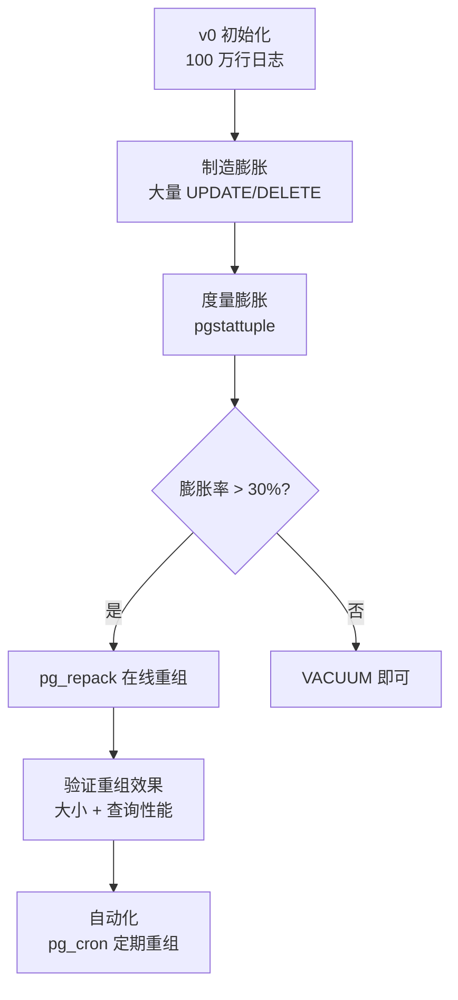

## 前置知识：本版本的定位

> [!important] v6 只改一个维度：运维——表膨胀治理
> • 基座：[[v0-数据库初始化]]（先执行 init.sql 生成 100 万行日志 + 10 万订单）
> • 知识来源：[[10-扩展与运维实战-pg_repack与Citus]]（原理 + 命令速查）
> • 对比 MySQL：pt-osc 是触发器同步方案，gh-ost 是 binlog 解析方案；pg_repack ≈ 影子表 + 触发器方案（不需 binlog 解析）



---

## 任务 1：安装 pg_repack 并制造表膨胀 🟢 基础

```sql
-- ============================================
-- 1.1 安装 pg_repack 扩展
-- 注意：pg_repack = 扩展 + 外部命令行工具，无需加入 shared_preload_libraries；
-- 需要 preload 的是 pg_stat_statements / pg_cron（见 v0 的 postgresql.conf 配置）
-- ============================================
CREATE EXTENSION IF NOT EXISTS pg_repack;

-- 验证安装
SELECT extname, extversion FROM pg_extension WHERE extname = 'pg_repack';
-- 预期：pg_repack | 1.5.x
```

```sql
-- ============================================
-- 1.2 制造表膨胀（在 server_logs 和 orders 上大量 UPDATE/DELETE）
-- 目的：模拟生产环境长时间运行后的 MVCC 死元组积累
-- ============================================

-- 对 orders 表：批量更新状态（每次 UPDATE 产生死元组）
UPDATE orders SET status = 'paid' WHERE status = 'pending' AND id % 10 = 0;
UPDATE orders SET status = 'shipped' WHERE status = 'paid' AND id % 10 = 0;
UPDATE orders SET status = 'delivered' WHERE status = 'shipped' AND id % 10 = 0;

-- 删除部分订单明细（产生死元组）
DELETE FROM order_items WHERE id % 7 = 0;

-- 对 server_logs 表：批量更新 payload
UPDATE server_logs SET payload = jsonb_build_object('updated', true, 'ts', NOW())
WHERE id % 100 = 0;

-- 再次大批量更新（加剧膨胀）
UPDATE server_logs SET level = 'DEBUG' WHERE id % 50 = 0;
DELETE FROM server_logs WHERE id % 200 = 0;

-- 注意：此处故意不执行 VACUUM，以观察膨胀效果
```

**验收标准**：
- ✅ pg_repack 扩展安装成功，`SELECT extname` 返回 `pg_repack`
- ✅ orders 和 server_logs 表上执行了 UPDATE/DELETE，产生死元组
- **预期输出**：`UPDATE 10000`（约 1 万行受影响）
- **自测方法**：`SELECT n_dead_tup FROM pg_stat_user_tables WHERE relname = 'orders'` 应显示 >0 死元组

---

## 任务 2：度量表膨胀（pgstattuple）🟡 进阶

```sql
-- ============================================
-- 2.1 安装 pgstattuple 精确度量膨胀
-- ============================================
CREATE EXTENSION IF NOT EXISTS pgstattuple;

-- ⚠️ 注意：pgstattuple / pgstatindex 不能作用于分区父表（父表本身无存储），
--    必须逐分区执行；分区名可通过 pg_inherits 查询
-- 精确度量 server_logs 各分区的膨胀
SELECT * FROM pgstattuple('server_logs_2026_07');
SELECT * FROM pgstattuple('server_logs_2026_08');
-- 关键字段：tuple_len / dead_tuple_len / free_space / table_len
-- 膨胀率 = (dead_tuple_len + free_space) / table_len

-- 对比度量 orders 表（普通表，可直接执行）
SELECT * FROM pgstattuple('orders');

-- 对比索引膨胀（idx_logs_btree 建在父表上、实体索引在各分区且与父索引同名，
-- 不能直接对父索引执行 pgstatindex；这里用 orders 的普通索引演示）
SELECT * FROM pgstatindex('idx_orders_status_created');
```

```sql
-- ============================================
-- 2.2 估算膨胀率（不装 pgstattuple 也能粗估）
-- ============================================

-- 方法 1：用 pg_stat_user_tables 查死元组比例
SELECT
    relname,
    n_live_tup,
    n_dead_tup,
    ROUND((n_dead_tup::numeric / NULLIF(n_live_tup + n_dead_tup, 0) * 100), 2) AS dead_ratio_pct,
    last_vacuum,
    last_autovacuum,
    pg_size_pretty(pg_relation_size(relid)) AS table_size
FROM pg_stat_user_tables
WHERE relname IN ('orders', 'server_logs', 'order_items')
ORDER BY dead_ratio_pct DESC;

-- 方法 2：对比 pg_relation_size 和 pgstattuple 的实际数据量
SELECT
    relname,
    pg_size_pretty(pg_relation_size(relid)) AS physical_size,
    pg_size_pretty(pg_total_relation_size(relid)) AS total_size
FROM pg_stat_user_tables
WHERE relname IN ('orders', 'server_logs');
```

**验收标准**：
- ✅ 能用 `pgstattuple` 和 `pg_stat_user_tables` 两种方式度量膨胀
- ✅ 能计算膨胀率 = `(dead_tuple_len + free_space) / table_len × 100%`
- **预期输出**：server_logs 表膨胀率 > 20%，n_dead_tup > 0
- **自测方法**：`SELECT * FROM pgstattuple('server_logs_2026_07')` 返回的 `dead_tuple_percent` > 0.1

---

## 任务 3：pg_repack 在线重组 🔴 挑战

```sql
-- ============================================
-- 3.1 使用 pg_repack 重组 server_logs 表
-- 命令行执行（非 SQL）：
-- 注意：server_logs 是分区表，-t 不能用于分区父表，需改用 --parent-table
-- （pg_repack 会按分区逐个重组）
-- pg_repack -h localhost -U postgres -d learn_pg --parent-table=shop.server_logs
-- ============================================

-- 重组前记录状态
SELECT
    relname,
    pg_size_pretty(pg_relation_size(relid)) AS before_size,
    n_dead_tup AS before_dead
FROM pg_stat_user_tables
WHERE relname = 'server_logs';

-- 执行 pg_repack（在 shell 中运行）：
-- pg_repack -h localhost -U postgres -d learn_pg --parent-table=shop.server_logs -j 2
-- -j 2：使用 2 个并行 worker

-- 重组后记录状态
SELECT
    relname,
    pg_size_pretty(pg_relation_size(relid)) AS after_size,
    n_dead_tup AS after_dead
FROM pg_stat_user_tables
WHERE relname = 'server_logs';
```

```sql
-- ============================================
-- 3.2 对比 VACUUM FULL 和 pg_repack
-- ============================================

-- VACUUM FULL：锁表（生产禁用），但能回收空间
-- VACUUM FULL server_logs;  -- ⚠️ 会锁表！仅在维护窗口执行

-- pg_repack：不锁表（仅极短锁），在线重组
-- 原理：创建影子表 → COPY 数据 → 建索引 → 用触发器同步增量 → 重命名表

-- 重组 orders 表（含索引）
-- pg_repack -h localhost -U postgres -d learn_pg -t shop.orders

-- 重组指定索引
-- pg_repack -h localhost -U postgres -d learn_pg -t shop.orders --index=idx_orders_status_created
```

**验收标准**：
- ✅ pg_repack 成功执行，无报错退出（exit code 0）
- ✅ 重组后 `pg_relation_size` 减小，`n_dead_tup` 归零或接近 0
- ✅ 重组过程中表可正常读写（不阻塞业务）
- **预期输出**：重组后表大小减少 > 15%，死元组降至 0
- **自测方法**：
  ```sql
  -- 重组前后对比
  SELECT pg_size_pretty(pg_relation_size('server_logs')) AS now_size;
  -- 同时在另一个 psql 会话执行 SELECT COUNT(*) FROM server_logs; 应无阻塞
  ```

---

## 任务 4：自动化调度 pg_repack 🔴 挑战

```sql
-- ============================================
-- 4.1 创建膨胀检测函数
-- ============================================
CREATE OR REPLACE FUNCTION check_bloat(threshold_pct NUMERIC DEFAULT 30)
RETURNS TABLE (relname text, dead_ratio_pct NUMERIC, table_size text)
AS $$
BEGIN
    RETURN QUERY
    SELECT
        t.relname,
        ROUND((t.n_dead_tup::numeric / NULLIF(t.n_live_tup + t.n_dead_tup, 0) * 100), 2),
        pg_size_pretty(pg_relation_size(t.relid))
    FROM pg_stat_user_tables t
    WHERE t.n_dead_tup > 0
      AND ROUND((t.n_dead_tup::numeric / NULLIF(t.n_live_tup + t.n_dead_tup, 0) * 100), 2) > threshold_pct
    ORDER BY dead_ratio_pct DESC;
END;
$$ LANGUAGE plpgsql;

-- 测试函数
SELECT * FROM check_bloat(10);  -- 膨胀率 > 10% 的表
```

```sql
-- ============================================
-- 4.2 用 pg_cron 定期检测 + 重组
-- ============================================

-- 每天凌晨 2 点检测膨胀（超过 30% 的表记录到日志）
SELECT cron.schedule(
    'check_bloat_daily',
    '0 2 * * *',
    $$SELECT relname, dead_ratio_pct FROM check_bloat(30)$$
);

-- 每周日凌晨 3 点重组 server_logs（写最频繁的表）
-- 注意：pg_repack 是外部命令，需用 shell 调用
-- SELECT cron.schedule(
--     'repack_logs_weekly',
--     '0 3 * * 0',
--     $$SELECT pg_repack('server_logs')$$  -- 需自定义 wrapper 函数
-- );

-- 查看已调度的任务
SELECT jobid, schedule, command FROM cron.job;
```

**验收标准**：
- ✅ `check_bloat()` 函数能正确返回膨胀率超阈值的表
- ✅ pg_cron 任务调度成功，`cron.job` 表中有记录
- **预期输出**：`check_bloat(10)` 返回至少 1 行（server_logs 被制造了膨胀）
- **自测方法**：`SELECT * FROM check_bloat(0)` 应返回所有有死元组的表

---

## 任务 5：生产故障处理 🔴 挑战

```sql
-- ============================================
-- 5.1 模拟 pg_repack 失败后的残留清理
-- 场景：pg_repack 执行中途被 kill，留下影子表和触发器
-- ============================================

-- 查找 pg_repack 残留：pg_repack 在独立的 repack schema 中工作，
-- 影子表命名为 repack.table_<oid>（oid 为原表 OID），同步触发器名为 z_repack_trigger
SELECT n.nspname AS schema_name, c.relname AS object_name, c.relkind
FROM pg_class c
JOIN pg_namespace n ON n.oid = c.relnamespace
WHERE n.nspname = 'repack'
ORDER BY c.relname;

-- 查找残留的触发器（挂在原表上）
SELECT tgname, tgrelid::regclass AS on_table
FROM pg_trigger
WHERE tgname = 'z_repack_trigger';

-- 清理残留（安全操作，不影响原表数据；删除 repack schema 会级联清掉影子表和触发器）
-- DROP SCHEMA IF EXISTS repack CASCADE;
```

```sql
-- ============================================
-- 5.2 pg_repack 常见错误处理速查
-- ============================================

-- 错误 1：ERROR: pg_repack failed with error: You need to be a superuser
-- 原因：pg_repack 需要 superuser 权限
-- 解决：用 postgres 超级用户执行，或授予 pg_repack 角色给 app_user

-- 错误 2：ERROR: relation "repack.table_xxx" already exists
-- 原因：上次 pg_repack 失败在 repack schema 留下了残留
-- 解决：DROP SCHEMA repack CASCADE; 然后重试

-- 错误 3：pg_repack hangs during index creation
-- 原因：表有长事务持有锁，pg_repack 等待锁超时
-- 解决：
-- 1. 查看长事务：SELECT pid, state, query, xact_start FROM pg_stat_activity WHERE state = 'active';
-- 2. 终止长事务：SELECT pg_terminate_backend(pid);
-- 3. 重试 pg_repack，加 --wait-timeout=60 参数

-- 错误 4：disk full during pg_repack
-- 原因：pg_repack 创建影子表需要约 2x 空间
-- 解决：先 VACUUM 回收部分空间，或清理旧分区，再 pg_repack
```

**验收标准**：
- ✅ 能识别 pg_repack 失败后的残留表和触发器
- ✅ 能正确清理残留并重试
- ✅ 能处理 4 种常见错误（权限/残留/锁等待/磁盘满）
- **预期输出**：清理残留后 `SELECT * FROM pg_class c JOIN pg_namespace n ON n.oid = c.relnamespace WHERE n.nspname = 'repack'` 返回 0 行
- **自测方法**：手动中断一次 pg_repack（Ctrl+C），然后用上述方法清理残留

---

## 🎯 本文学完自检

| 层次 | 检查项 |
|------|--------|
| 🟢 基础 | 能安装 pg_repack 并对单表执行在线重组 |
| 🟡 进阶 | 能用 pgstattuple 精确度量膨胀率，判断何时需要 repack |
| 🔴 挑战 | 能搭建自动化膨胀检测 + 定期重组 + 故障处理完整流程 |

---

## 相关笔记

- ⬅️ 前置：[[v5-存储过程与触发器迁移]]
- 🔗 知识来源：[[10-扩展与运维实战-pg_repack与Citus]]
- 🔗 关联：[[05-事务与并发控制]]（MVCC 死元组原理）
- 🔗 基座：[[v0-数据库初始化]]

---
*最后更新：2026-07-24*