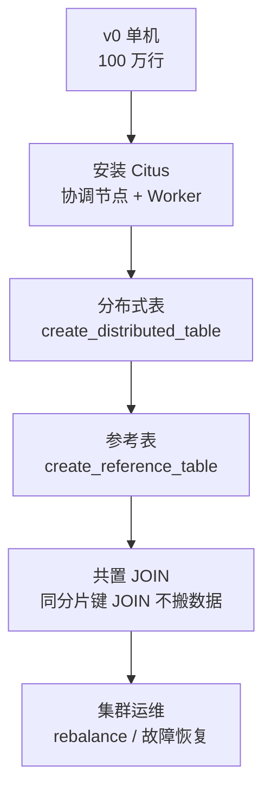

## 前置知识：本版本的定位

> [!important] v7 只改一个维度：架构——从单机到分布式
> • 基座：[[v0-数据库初始化]]（先执行 init.sql 建好表结构和数据）
> • 知识来源：[[10-扩展与运维实战-pg_repack与Citus]]（Citus 架构 + 命令速查）
> • 对比 MySQL：Citus ≈ MySQL Sharding / Vitess，但 Citus 在 PG 层原生集成，无需中间件



---

## 任务 1：Citus 集群搭建 🟢 基础

```bash
# ============================================
# 1.1 Docker Compose 搭建 Citus 集群（1 协调节点 + 2 Worker）
# 文件：docker-compose-citus.yml
# ============================================
```

```yaml
# docker-compose-citus.yml
version: '3.8'
services:
  coordinator:
    image: citusdata/citus:12.1
    ports: ["5432:5432"]
    environment:
      POSTGRES_PASSWORD: learn_pg_2026
      POSTGRES_DB: learn_pg
    volumes:
      - pg_coordinator:/var/lib/postgresql/data
    command: ["postgres", "-c", "shared_preload_libraries=citus,pg_stat_statements"]

  worker_1:
    image: citusdata/citus:12.1
    ports: ["5433:5432"]
    environment:
      POSTGRES_PASSWORD: learn_pg_2026
      POSTGRES_DB: learn_pg
    volumes:
      - pg_worker1:/var/lib/postgresql/data
    command: ["postgres", "-c", "shared_preload_libraries=citus"]

  worker_2:
    image: citusdata/citus:12.1
    ports: ["5434:5432"]
    environment:
      POSTGRES_PASSWORD: learn_pg_2026
      POSTGRES_DB: learn_pg
    volumes:
      - pg_worker2:/var/lib/postgresql/data
    command: ["postgres", "-c", "shared_preload_libraries=citus"]

volumes:
  pg_coordinator:
  pg_worker1:
  pg_worker2:
```

```sql
-- ============================================
-- 1.2 在协调节点上安装 Citus 扩展并注册 Worker
-- 连接到 coordinator: psql -h localhost -p 5432 -U postgres -d learn_pg
-- ============================================
CREATE EXTENSION IF NOT EXISTS citus;

-- 注册 Worker 节点（citus_add_node：节点名 + 端口）
SELECT citus_add_node('worker_1', 5433);
SELECT citus_add_node('worker_2', 5434);

-- 验证集群状态
SELECT * FROM citus_get_active_worker_nodes();
-- 预期输出：2 行（worker_1:5433, worker_2:5434）

-- 查看集群信息
SELECT * FROM pg_dist_node;
```

**验收标准**：
- ✅ Docker Compose 启动 3 个容器（coordinator + 2 worker）
- ✅ `citus_get_active_worker_nodes()` 返回 2 行
- **预期输出**：`node_name | node_port | isactive` 两行均为 true
- **自测方法**：`docker ps` 应显示 3 个 citusdata/citus 容器

---

## 任务 2：创建分布式表和参考表 🟡 进阶

```sql
-- ============================================
-- 2.1 将 orders / order_items 转为分布式表
-- 分片键：user_id（按用户分片，同一用户的订单和明细落在同一分片，实现共置）
-- ============================================

-- 先执行 v0 的建表和数据（在 coordinator 上）
-- \i init.sql

-- ⚠️ Citus 硬性约束，直接转换会报错：
--   1) 分布式表的主键/唯一约束必须包含分布列（orders 的主键是 (id)，不含 user_id）；
--   2) 分布式表之间的外键必须包含分布列（order_items.order_id → orders.id 不满足，会被拒绝）；
--   3) 两表要共置（colocate），必须使用同一个分布列。
-- 因此先调整键结构：order_items 冗余 user_id 列，两表主键/外键都纳入 user_id：

-- 先拆旧的外键/主键（orders 的主键被 order_items 外键引用，需先拆外键）
ALTER TABLE order_items DROP CONSTRAINT order_items_order_id_fkey;
ALTER TABLE order_items DROP CONSTRAINT order_items_pkey;

ALTER TABLE orders DROP CONSTRAINT orders_pkey;
ALTER TABLE orders ADD PRIMARY KEY (user_id, id);

ALTER TABLE order_items ADD COLUMN user_id BIGINT;
UPDATE order_items oi SET user_id = o.user_id FROM orders o WHERE o.id = oi.order_id;
ALTER TABLE order_items ALTER COLUMN user_id SET NOT NULL;

-- v0 数据中同一 order_id 可能有多行明细，(user_id, order_id) 做主键前先去重（每单保留一行）
DELETE FROM order_items a
USING order_items b
WHERE a.order_id = b.order_id AND a.id > b.id;

ALTER TABLE order_items ADD PRIMARY KEY (user_id, order_id);

-- ============================================
-- 2.2 将 users / products 设为参考表（全量复制到每个节点）
-- ============================================
-- 顺序：被外键引用的表要先转为参考表，再分布 orders / order_items
SELECT create_reference_table('users');
SELECT create_reference_table('products');

-- 两表都按 user_id 分布（同分布列，共置才成立）
SELECT create_distributed_table('orders', 'user_id');
SELECT create_distributed_table('order_items', 'user_id', colocate_with => 'orders');

-- 分布式表之间的外键需包含分布列，分布后再补建
ALTER TABLE order_items ADD CONSTRAINT order_items_order_fk
    FOREIGN KEY (user_id, order_id) REFERENCES orders (user_id, id) ON DELETE CASCADE;

-- 查看分片分布（citus_shards 视图用 table_name 过滤，没有 logicalrelid 列）
SELECT * FROM citus_shards WHERE table_name = 'orders';
-- 预期：每个 Worker 上有若干分片，shard_count 默认 32

-- 验证参考表（citus_tables 视图的列名是 citus_table_type，不是 table_type）
SELECT * FROM citus_tables WHERE citus_table_type = 'reference';
-- 预期：products, users

-- 验证分布式表
SELECT * FROM citus_tables WHERE citus_table_type = 'distributed';
-- 预期：orders, order_items
```

```sql
-- ============================================
-- 2.3 查询验证数据分布
-- ============================================

-- 在协调节点查询，Citus 自动路由到 Worker
SELECT COUNT(*) FROM orders;
-- 预期：100000（与 v0 一致）

-- 按分片键过滤（单分片查询，最高效）
EXPLAIN (COSTS OFF)
SELECT * FROM orders WHERE user_id = 42;
-- 预期：Distributed Query → 只扫描 1 个分片（router executor）

-- 跨分片聚合（协调节点合并结果）
SELECT status, COUNT(*) FROM orders GROUP BY status ORDER BY status;
-- 预期：各状态行数，Citus 自动分布式聚合
```

**验收标准**：
- ✅ orders 和 order_items 成功转为分布式表
- ✅ products 和 users 成功转为参考表
- ✅ `EXPLAIN` 显示分片键过滤走单分片路由
- **预期输出**：`citus_tables` 返回 4 行（2 distributed + 2 reference）
- **自测方法**：
  ```sql
  -- 跨分片查询和单分片查询都能返回正确结果
  SELECT COUNT(*) FROM orders WHERE user_id = 42;
  SELECT COUNT(*) FROM orders;
  -- 两者都应返回非零值
  ```

---

## 任务 3：共置 JOIN 与跨分片查询 🟡 进阶

```sql
-- ============================================
-- 3.1 共置 JOIN（orders JOIN order_items，同分片键 user_id）
-- ============================================

-- 两表都按 user_id 分布（共置）。注意：只有当 JOIN 条件包含两表分布列的等值比较
-- （o.user_id = oi.user_id）时，共置 JOIN 才生效；仅按 order_id 关联无法利用共置

-- 共置 JOIN（分布列等值 + 分片键过滤，不搬数据）
EXPLAIN (COSTS OFF)
SELECT o.user_id, o.status, oi.product_id, oi.quantity
FROM orders o
JOIN order_items oi ON oi.user_id = o.user_id AND oi.order_id = o.id
WHERE o.user_id = 42;
-- 预期：Distributed Query → 单分片执行（router executor）

-- 共置 JOIN（含分布列等值、无分片键过滤：各分片本地 JOIN，协调节点合并结果）
EXPLAIN (COSTS OFF)
SELECT o.user_id, o.status, oi.product_id
FROM orders o
JOIN order_items oi ON oi.user_id = o.user_id AND oi.order_id = o.id;
-- 预期：Distributed Query → 多分片并行执行（每个分片本地 JOIN）

-- 反例：JOIN 条件不含分布列等值（只按 order_id 关联）→ 共置失效，需 repartition
EXPLAIN (COSTS OFF)
SELECT o.user_id, oi.product_id
FROM orders o
JOIN order_items oi ON oi.order_id = o.id
WHERE o.user_id = 42;
-- 预期：Distributed Query → repartition join（order_items 数据按订单所在分片重新分发）
```

```sql
-- ============================================
-- 3.2 分布式表 JOIN 参考表（广播 + 本地 JOIN）
-- ============================================

-- orders（分布式）JOIN products（参考表）
EXPLAIN (COSTS OFF)
SELECT o.id, p.name AS product_name, oi.quantity
FROM orders o
JOIN order_items oi ON oi.user_id = o.user_id AND oi.order_id = o.id
JOIN products p ON oi.product_id = p.id
WHERE o.user_id = 42;
-- 预期：products 被广播到 Worker 节点，本地 JOIN 执行

-- 跨分片聚合 + 参考表 JOIN
SELECT p.name, COUNT(*) AS order_count, SUM(oi.quantity) AS total_qty
FROM orders o
JOIN order_items oi ON oi.user_id = o.user_id AND oi.order_id = o.id
JOIN products p ON oi.product_id = p.id
GROUP BY p.name
ORDER BY total_qty DESC
LIMIT 10;
-- 预期：各商品名称 + 订单数 + 总量，Citus 分布式聚合
```

**验收标准**：
- ✅ 能用 `EXPLAIN` 区分共置 JOIN（单分片）和跨分片 JOIN（repartition）
- ✅ 分布式表 JOIN 参考表能正确返回结果
- **预期输出**：共置 JOIN 的 EXPLAIN 显示 `Task Count: 1`，跨分片 JOIN 显示 `Task Count: >1`
- **自测方法**：
  ```sql
  -- 共置 JOIN 结果与单机一致
  SELECT COUNT(*) FROM orders o JOIN order_items oi ON oi.user_id = o.user_id AND oi.order_id = o.id WHERE o.user_id = 42;
  -- 应返回与 v0 单机相同的行数
  ```

---

## 任务 4：数据写入与分片管理 🔴 挑战

```sql
-- ============================================
-- 4.1 分布式写入验证
-- ============================================

-- 插入新订单（自动路由到对应分片）
-- 注意：users 是参考表且只有 user_id 1~1000 的数据，超出范围会违反外键
INSERT INTO orders (user_id, total_amount, status)
VALUES (999, 99.99, 'pending');
-- 预期：INSERT 成功，数据被路由到 user_id=999 对应的分片

-- 批量插入（Citus 自动分片路由；user_id 同样限定在 1~1000 内以满足外键）
INSERT INTO orders (user_id, total_amount, status, created_at)
SELECT n, (random() * 500)::numeric(10,2),
       CASE WHEN n % 2 = 0 THEN 'paid' ELSE 'pending' END,
       NOW()
FROM generate_series(1, 1000) AS n;
-- 预期：1000 行按 user_id 哈希路由到各分片

-- 验证各分片行数（shardid/logicalrelid 在 pg_dist_shard 上；pg_dist_partition
-- 每表只有 1 行元数据且没有 shardid 列，分片计数应基于 pg_dist_shard）
SELECT s.shardid, p.placementid, p.nodename, p.nodeport,
       (SELECT COUNT(*) FROM pg_dist_shard WHERE logicalrelid = 'orders'::regclass) AS shard_count
FROM pg_dist_shard s
JOIN pg_dist_placement p ON p.shardid = s.shardid
WHERE s.logicalrelid = 'orders'::regclass
LIMIT 5;
```

```sql
-- ============================================
-- 4.2 分片再平衡（模拟新节点加入）
-- ============================================

-- 查看当前分片分布（每个 Worker 上有多少分片）
SELECT nodename, nodeport, COUNT(*) AS shard_count
FROM pg_dist_placement
GROUP BY nodename, nodeport;
-- 预期：worker_1 和 worker_2 各约 16 个分片（32 总分片）

-- 假设新增 worker_3（端口 5435）
-- SELECT citus_add_node('worker_3', 5435);

-- 触发再平衡（将部分分片迁移到新节点）
-- SELECT rebalance_table_shards();

-- 查看再平衡后分布
-- SELECT nodename, nodeport, COUNT(*) AS shard_count
-- FROM pg_dist_placement GROUP BY nodename, nodeport;
-- 预期：3 个 Worker 各约 10-11 个分片
```

**验收标准**：
- ✅ 分布式 INSERT 成功，数据按分片键自动路由
- ✅ 能查看各 Worker 的分片分布，理解再平衡过程
- **预期输出**：2 个 Worker 各约 16 个分片（shard_count 总和 = 32）
- **自测方法**：
  ```sql
  -- 插入后查询验证（v0 已有 user_id 1~1000 的订单，用插入时间过滤验证本任务新写入的行）
  SELECT COUNT(*) FROM orders WHERE created_at >= NOW() - INTERVAL '5 minutes';
  -- 应返回 1001（单条 1 行 + 批量 1000 行）
  ```

---

## 任务 5：集群运维与故障处理 🔴 挑战

```sql
-- ============================================
-- 5.1 集群健康检查
-- ============================================

-- 查看所有表的分片状态（shardid/logicalrelid 在 pg_dist_shard 上，
-- pg_dist_partition 没有 shardid 列，需与 pg_dist_shard join）
SELECT
    s.logicalrelid::text AS table_name,
    s.shardid,
    p.nodename,
    p.nodeport,
    p.shardstate
FROM pg_dist_shard s
JOIN pg_dist_placement p ON p.shardid = s.shardid
ORDER BY s.logicalrelid, s.shardid;

-- shardstate: 1=正常, 3=invalid（失效）；完整枚举以 Citus 官方文档为准

-- 查看查询执行统计
SELECT * FROM citus_stat_activity;
-- 类似 pg_stat_activity 但显示分布式查询

-- 查看各节点磁盘使用
SELECT * FROM citus_remote_disk_usage;
```

```sql
-- ============================================
-- 5.2 模拟 Worker 故障与恢复
-- ============================================

-- 场景 1：Worker 节点失联
-- 模拟：docker stop citus-worker_1-1
-- 检查：SELECT * FROM citus_get_active_worker_nodes();
-- 恢复：docker start citus-worker_1-1

-- 场景 2：分片数据损坏，需从副本恢复
-- Citus 默认无副本（单副本），生产环境建议：
-- 1. 配置流复制到 Standby Worker
-- 2. 或使用 Citus MX 多租户副本

-- 场景 3：移除故障节点（需先转移分片）
-- SELECT citus_remove_node('worker_2', 5434);
-- 此操作会先将 worker_2 上的分片转移到其他节点，然后移除

-- 场景 4：查询超时处理
SET citus.task_execution_timeout TO '30s';  -- 单分片查询超时
SET citus.operation_timeout TO '10s';       -- 连接超时
```

```sql
-- ============================================
-- 5.3 Citus 常见错误速查
-- ============================================

-- 错误 1：ERROR: cannot execute INSERT ... SELECT on a distributed table
-- 原因：某些复杂 INSERT...SELECT 在分布式表上不支持
-- 解决：拆分为 INSERT VALUES 批量，或用中间临时表

-- 错误 2：ERROR: the query contains a join between a distributed table and a reference table but the join condition is not supported
-- 原因：JOIN 条件不包含分片键
-- 解决：确保 JOIN 条件包含分片键，或用参考表 JOIN（全量广播）

-- 错误 3：ERROR: modifying distributed tables is not allowed in a transaction block when the modifications are not colocated
-- 原因：跨分片事务不支持（分布式事务需 2PC）
-- 解决：拆分事务，或确保修改操作在共置分片上

-- 错误 4：INSERT ... ON CONFLICT on distributed table
-- 原因：分布式表的 UPSERT 需包含分片键在冲突列中
-- 解决：ON CONFLICT (user_id, ...) 确保包含分片键
```

**验收标准**：
- ✅ 能查看集群健康状态，识别 shardstate 异常
- ✅ 能处理 4 种常见 Citus 错误
- ✅ 理解 Worker 故障后的恢复流程
- **预期输出**：`citus_get_active_worker_nodes()` 返回 2 行 active=true
- **自测方法**：
  ```sql
  -- 停止一个 Worker 后查询应报错或降级
  -- 恢复后查询应正常返回
  SELECT COUNT(*) FROM orders;
  ```

---

## 🎯 本文学完自检

| 层次 | 检查项 |
|------|--------|
| 🟢 基础 | 能搭建 Citus 集群并注册 Worker 节点 |
| 🟡 进阶 | 能创建分布式表和参考表，理解分片路由 |
| 🔴 挑战 | 能处理共置 JOIN、分片再平衡、集群故障恢复 |

---

## 相关笔记

- ⬅️ 前置：[[v6-pg_repack在线表重组]]
- 🔗 知识来源：[[10-扩展与运维实战-pg_repack与Citus]]
- 🔗 关联：[[05-事务与并发控制]]（分布式事务 vs 单机事务）
- 🔗 基座：[[v0-数据库初始化]]

---
*最后更新：2026-07-24*