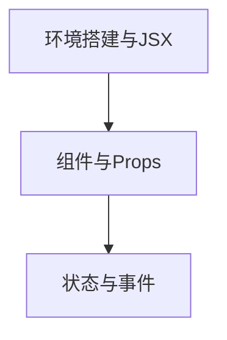

## ⬅️ 前置知识
- [[01-环境搭建与JSX]]
- [[02-组件与Props]]
- [[03-状态与事件]]

## ➡️ 后续笔记
- [[../阶段二-Hooks与状态管理/01-Hooks深度解析]] — 进入下一阶段

## 🔗 关联笔记
- [[../00-React学习路径总索引]] — 返回总索引

---

## 📋 阶段1 知识图谱

---

## ✅ 综合练习

### 练习 1：知识点串联
结合本阶段 3 篇笔记，绘制一张知识图谱并解释它们的关系。

### 练习 2：场景应用
用 React 解决一个贴近实际的小问题。

### 练习 3：错题回顾
回顾本阶段练习中的错误，整理成「易错点清单」。

---

## 🎯 阶段1 毕业自检

| 层次 | 检查项 | 是否通过 |
|------|--------|----------|
| 🟢 基础 | 能独立复述本阶段所有核心概念 | [ ] |
| 🟡 进阶 | 能不看参考完成阶段综合练习 | [ ] |
| 🔴 挑战 | 能将本阶段知识迁移到毕业项目中 | [ ] |

---

## 📊 通过标准

- 🟢 全部通过 → 可进入下一阶段
- 🟡 有未通过项 → 回顾对应笔记后重试
- 🔴 未通过 → 回到本阶段首篇巩固

---

*最后更新：2026-07-19*
