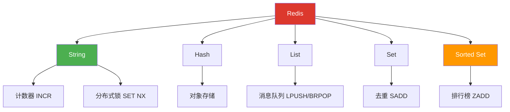

# 🔴 阶段一：数据结构与命令

> 📍 **预计学时**：10-14h | **难度**：⭐ | **前置**：无
> 📚 **深度参考**：[[阶段一-数据结构与命令/02-五大基础数据结构]]

## 🧱 Redis 数据结构全景

## 📚 笔记列表

| 序号 | 笔记 | 核心内容 | 预计学时 |
|------|------|---------|---------|
| 01 | [[01-Redis基础与字符串命令]] | 安装、redis-cli、单线程模型、String 命令 | 3-4h |
| 02 | [[02-五大基础数据结构]] | Hash/List/Set/ZSet + 应用场景 | 4-5h |
| 03 | [[03-Pub-Sub与Stream消息]] | PUBLISH/SUBSCRIBE、XADD/XREAD | 3-4h |
| 99 | [[01-学习/Redis学习路径/阶段一-数据结构与命令/99-阶段1复习检查点|99-阶段1复习检查点]] | 🟢/🟡/🔴 三级验收 | 1-2h |

## 🎯 阶段目标

学完本阶段后，你应该能：

1. 独立安装 Redis 并用 redis-cli 操作
2. 根据业务场景选择合适的数据结构
3. 使用 Pipeline 降低 RTT
4. 设计 Pub/Sub 或 Stream 消息模型

## 🛠️ 配套代码

| 代码 | 对应笔记 | 状态 |
|------|---------|------|
| `code/01-string/` | 01 | ✅ 已有 |
| `../code/02-data-structures/` | 02 | 待补充 |
| `../code/03-pubsub/` | 03 | 待补充 |

## 🔗 导航

- ⬅️ [[../00-Redis学习路径总索引]] — 总索引
- 📚 [[00-Redis学习路径总索引]] — 深度参考资料
- ➡️ [[../阶段二-持久化与高可用/README]] — 下一阶段

---

*最后更新：2026-07-20*
