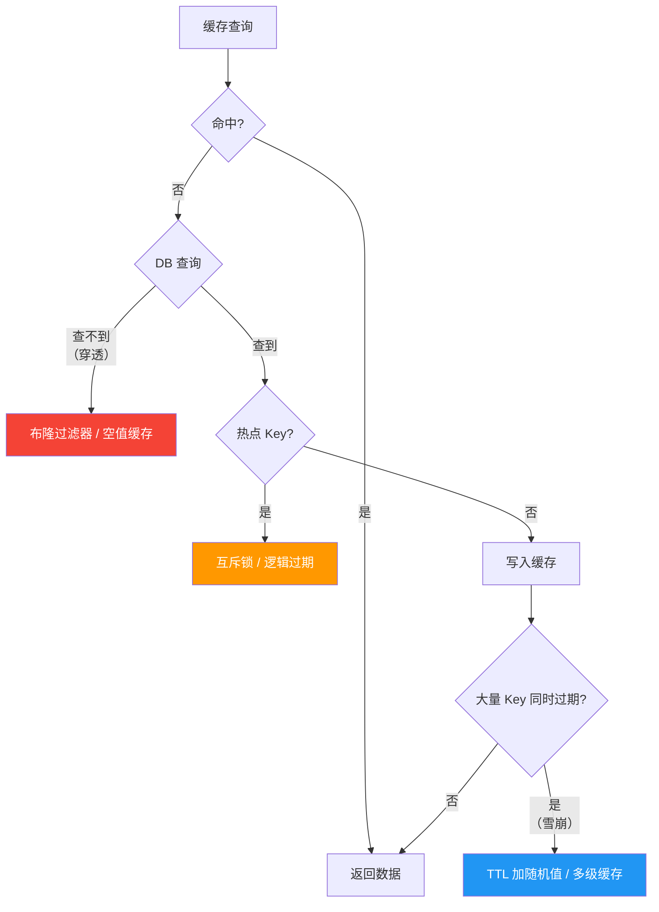

# 🔴 阶段三：高级特性与性能优化

> 📍 **预计学时**：12-16h | **难度**：⭐⭐⭐⭐ | **前置**：[[../阶段二-持久化与高可用/README]]
> 📚 **深度参考**：[[阶段三-高级特性与性能优化/02-内存管理与性能调优]]、[[阶段三-高级特性与性能优化/03-缓存三大问题与分布式锁]]、[[阶段三-高级特性与性能优化/03-缓存三大问题与分布式锁]]

## 🧱 缓存三大问题决策树

## 📚 笔记列表

| 序号 | 笔记 | 核心内容 | 预计学时 |
|------|------|---------|---------|
| 01 | [[01-事务与Lua脚本]] | MULTI/EXEC/WATCH、EVAL、原子操作 | 3-4h |
| 02 | [[02-内存管理与性能调优]] | maxmemory、淘汰策略、Pipeline、SLOWLOG | 4-5h |
| 03 | [[03-缓存三大问题与分布式锁]] | 穿透/击穿/雪崩、SETNX/Redlock | 4-5h |
| 99 | [[01-学习/Redis学习路径/阶段三-高级特性与性能优化/99-阶段3复习检查点|99-阶段3复习检查点]] | 🟢/🟡/🔴 三级验收 | 1-2h |

## 🎯 阶段目标

学完本阶段后，你应该能：

1. 用 Lua 脚本实现原子操作
2. 配置 maxmemory 与淘汰策略并分析影响
3. 设计缓存-数据库一致性方案
4. 实现分布式锁并评估 Redlock 适用场景

## 🛠️ 配套代码

| 代码 | 对应笔记 | 状态 |
|------|---------|------|
| `../code/07-lua/` | 01 | 待补充 |
| `../code/08-cache-penetration/` | 03 | 待补充 |

## 🔗 导航

- ⬅️ [[../阶段二-持久化与高可用/README]] — 上一阶段
- ➡️ [[../毕业项目-分布式缓存网关/README]] — 毕业项目
- 🔗 [[../../DockerNew/00-Docker 总览索引]] — 配合 Docker 容器化 Redis

---

*最后更新：2026-07-20*
