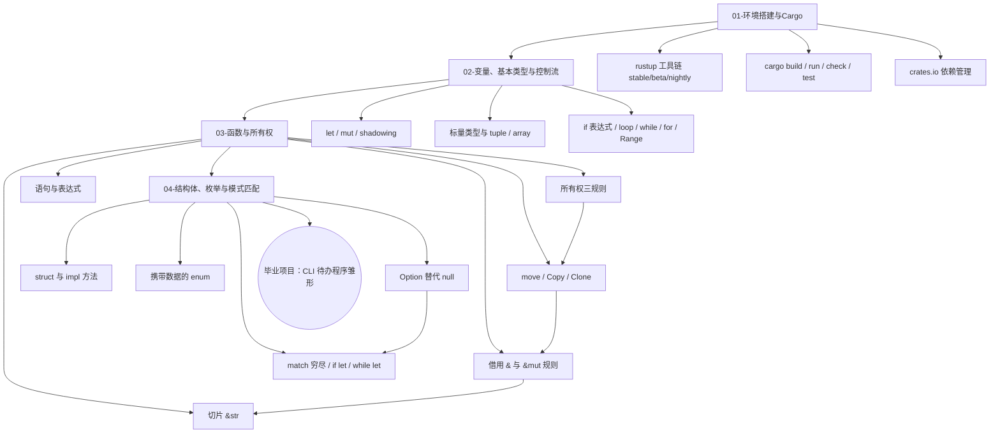

## ⬅️ 前置知识
- [[01-环境搭建与Cargo]]
- [[02-变量、基本类型与控制流]]
- [[03-函数与所有权]]
- [[04-结构体、枚举与模式匹配]]

## ➡️ 后续笔记
- [[../阶段二-核心机制与标准库/01-泛型与Trait]] — 进入下一阶段

## 🔗 关联笔记
- [[../00-Rust学习路径总索引]] — 返回总索引

---

## 📋 阶段1 知识图谱

---

## ✅ 综合练习

### 练习 1：知识点串联

不看笔记，按顺序回答以下问题（每题 1-2 句即可）：
1. 为什么日常开发用 `cargo check` 而不是 `cargo run`？
2. `let` 默认不可变，Rust 这样设计的两个好处是什么？
3. `let s2 = s1;`（String）之后 s1 为什么失效？整数为什么不受影响？
4. 「同一时刻要么多个 `&`，要么一个 `&mut`」这条规则防止了哪两类问题？
5. `Option<T>` 相比 null 的核心优势是什么？
6. match 处理 `Option` 时漏写 `None` 分支，编译器会怎么反应？

### 练习 2：场景应用

在 `code/` 目录新建项目 `grade_manager`，实现一个**学生成绩管理小程序**，要求覆盖本阶段全部核心知识：

1. **struct**：定义 `Student`（姓名 `String`、成绩列表 `Vec<u16>`）与 `Course` 或你认为合适的辅助结构
2. **方法**：为 `Student` 实现 `new`（关联函数）、`add_score(&mut self, score: u16)`、`average(&self) -> f64`、`summary(&self) -> String`
3. **enum + match**：定义 `Command` 枚举（如 `Add { name: String }`、`Score { name: String, score: u16 }`、`Report`、`Quit`），用 `dispatch(students: &mut Vec<Student>, cmd: Command)` 做命令分发
4. **所有权与借用**：查找学生时返回 `Option<usize>` 或借用，体会「查询用 `&`，修改用 `&mut`」
5. **控制流**：用 `for` 遍历学生输出报告，用 `if let` 处理查找结果
6. 在 `main` 中模拟一串命令执行并打印结果，确保 `cargo build` 零警告

加分项：为 `average` 处理「没有成绩」的情况——返回 `Option<f64>` 而不是 0。

### 练习 3：错题回顾

回看 01-04 各课的「常见陷阱」表格，完成：
1. 挑出自己在练习中**实际踩过**的 2-3 个陷阱，写下当时的错误信息（编译器报错原文）与解决过程
2. 对每个陷阱补一句「下次如何避免」的行动提示
3. 把仍未理解的概念记录到笔记末尾，标注需要回顾的课节链接

---

## 🎯 阶段1 毕业自检

| 层次 | 检查项 | 是否通过 |
|------|--------|----------|
| 🟢 基础 | 能独立复述本阶段所有核心概念 | [ ] |
| 🟡 进阶 | 能不看参考完成阶段综合练习 | [ ] |
| 🔴 挑战 | 能将本阶段知识迁移到毕业项目中 | [ ] |

---

## 📊 通过标准

- 🟢 全部通过 → 可进入下一阶段
- 🟡 有未通过项 → 回顾对应笔记后重试
- 🔴 未通过 → 回到本阶段首篇巩固

---

*最后更新：2026-08-07*
