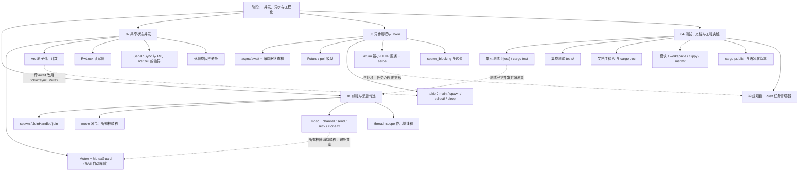

## ⬅️ 前置知识
- [[01-线程与消息传递]]
- [[02-共享状态并发]]
- [[03-异步编程与Tokio]]
- [[04-测试、文档与工程实践]]

## ➡️ 后续笔记
- [[../毕业项目-Rust任务管理器/v1-CLI骨架版]] — 进入毕业项目

## 🔗 关联笔记
- [[../00-Rust学习路径总索引]] — 返回总索引

---

## 📋 阶段3 知识图谱

---

## ✅ 综合练习

### 练习 1：知识点串联
不看笔记，回答下面这条链路上的问题（每题一两句话即可）：
1. `std::thread::spawn` 的闭包为什么常常要加 `move`？这与「数据竞争在编译期被阻止」有什么关系？
2. 多个线程要共同修改一个 `Vec`，标准组合是什么？为什么每一层（Arc、Mutex）都不可少？
3. OS 线程、tokio::spawn 的异步任务、spawn_blocking 三者分别适合什么负载？
4. 你写的并发代码如何用测试保证正确性？（提示：确定性输入 + 断言 + 必要时串行运行）

### 练习 2：场景应用
任选其一（推荐做完 A 再做 B），代码存到 `code/` 目录：

**A. 线程 + 通道并发统计**：写一个程序，用 `std::fs::read_dir` 收集一个目录下所有 `.txt` 文件，开 4 个工作线程，每个线程从 mpsc 通道领取文件路径、统计行数并回传 `(文件名, 行数)`，主线程汇总打印总行数与最大的文件。要求处理「目录为空」「文件不存在」等边界。

**B. 最小 axum 服务**：写一个 `GET /tasks` 返回 JSON 任务列表、`GET /health` 返回 `{"ok": true}` 的服务，并补充 `GET /tasks/:id`（不存在时返回 404 状态码）。用 curl 验证三个路由。

### 练习 3：错题回顾
翻出本阶段练习中编译失败/运行出错的记录，整理成一张表：

| 当时的错误信息 | 根因 | 一句话教训 |
|----------------|------|------------|
| （示例）closure may outlive the current function | spawn 闭包借用了局部变量 | 跨线程要么 move 所有权，要么用 scope |
| | | |

至少补全 3 行。如果本阶段没有犯错记录，去故意触发一次「跨 await 持 std Mutex」的编译错误并记录它。

---

## 🎯 阶段3 毕业自检

| 层次 | 检查项 | 是否通过 |
|------|--------|----------|
| 🟢 基础 | 能独立复述本阶段所有核心概念 | [ ] |
| 🟡 进阶 | 能不看参考完成阶段综合练习 | [ ] |
| 🔴 挑战 | 能将本阶段知识迁移到毕业项目中 | [ ] |

---

## 📊 通过标准

- 🟢 全部通过 → 可进入下一阶段
- 🟡 有未通过项 → 回顾对应笔记后重试
- 🔴 未通过 → 回到本阶段首篇巩固

---

*最后更新：2026-08-07*
