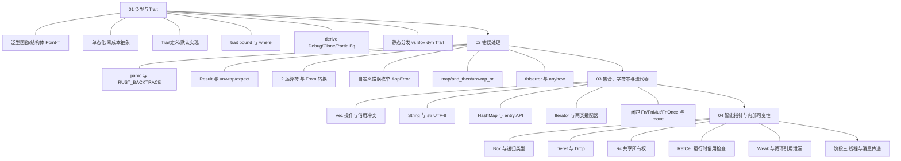

## ⬅️ 前置知识
- [[01-泛型与Trait]]
- [[02-错误处理]]
- [[03-集合、字符串与迭代器]]
- [[04-智能指针与内部可变性]]

## ➡️ 后续笔记
- [[../阶段三-并发、异步与工程化/01-线程与消息传递]] — 进入下一阶段

## 🔗 关联笔记
- [[../00-Rust学习路径总索引]] — 返回总索引

---

## 📋 阶段2 知识图谱



---

## ✅ 综合练习

### 练习 1：知识点串联

不查笔记，口头/文字回答以下串联问题：

1. 迭代器链里 `.collect()` 需要类型标注，这与第 1 课的「单态化」有什么关系？编译器要为它生成什么？
2. 第 2 课给 `AppError` 实现 `From<io::Error>`，这用的是第 1 课的什么机制？`?` 运算符如何依赖它？
3. `Vec<Box<dyn Printable>>` 同时用到了哪两课的知识？如果把它改成 `Vec<Rc<RefCell<Task>>>`，语义发生了什么变化（共享？可变？）？
4. `HashMap::entry(...).or_insert(0)` 返回可变引用；如果想让「值」是 `Rc<RefCell<Task>>`，应该怎么写？

### 练习 2：场景应用

**综合小任务：为任务管理器实现带自定义错误的 `TaskStore`**（在 `code/stage2-review/` 新建 cargo 项目）：

1. 定义 `trait TaskStore`（抽象存储后端），至少包含：

```rust
// trait 设计示例，字段可自定
trait TaskStore {
    fn add(&mut self, title: &str, priority: u32) -> Result<usize, AppError>;
    fn complete(&mut self, id: usize) -> Result<(), AppError>;
    fn find(&self, id: usize) -> Result<&Task, AppError>;
    fn pending_count(&self) -> usize;
}
```

2. 用第 2 课的 `AppError`（至少 `NotFound(String)` 变体）表达「任务不存在」；
3. 实现 `MemoryStore`（内部用 `Vec<Task>`）实现该 trait，`find` 找不到时返回 `Err(AppError::NotFound(...))`；
4. 用第 3 课的迭代器链完成 `pending_count` 与「拼接所有未完成任务标题」；
5. 用第 1 课的泛型函数 `fn print_store<S: TaskStore>(store: &S)` 打印统计信息；
6. 思考题（选做）：如果要让多个视图共享同一份 store 并都能修改，第 4 课的哪些类型能用？哪些不能（提示：单线程场景）？

### 练习 3：错题回顾

整理本阶段学习过程中遇到的报错，按下表复盘（至少 3 条）：

| 报错信息 | 当时写的代码 | 根因 | 修复方式 | 属于哪一课的知识 |
|----------|--------------|------|----------|------------------|
|  |  |  |  |  |
|  |  |  |  |  |
|  |  |  |  |  |

> 💡 重点关注这三类高频错误：借用冲突（`cannot borrow ... as mutable`）、`?` 类型不匹配、`collect` 类型推断失败。

---

## 🎯 阶段2 毕业自检

| 层次 | 检查项 | 是否通过 |
|------|--------|----------|
| 🟢 基础 | 能独立复述本阶段所有核心概念 | [ ] |
| 🟡 进阶 | 能不看参考完成阶段综合练习 | [ ] |
| 🔴 挑战 | 能将本阶段知识迁移到毕业项目中 | [ ] |

---

## 📊 通过标准

- 🟢 全部通过 → 可进入下一阶段
- 🟡 有未通过项 → 回顾对应笔记后重试
- 🔴 未通过 → 回到本阶段首篇巩固

---

*最后更新：2026-08-07*
