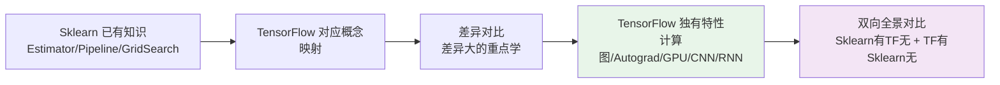
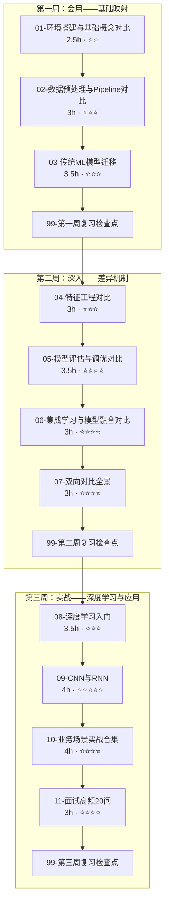
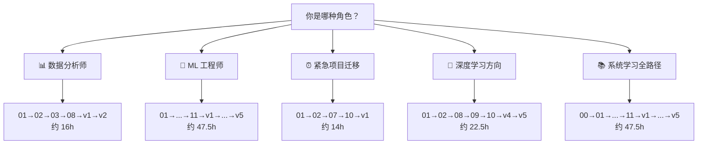
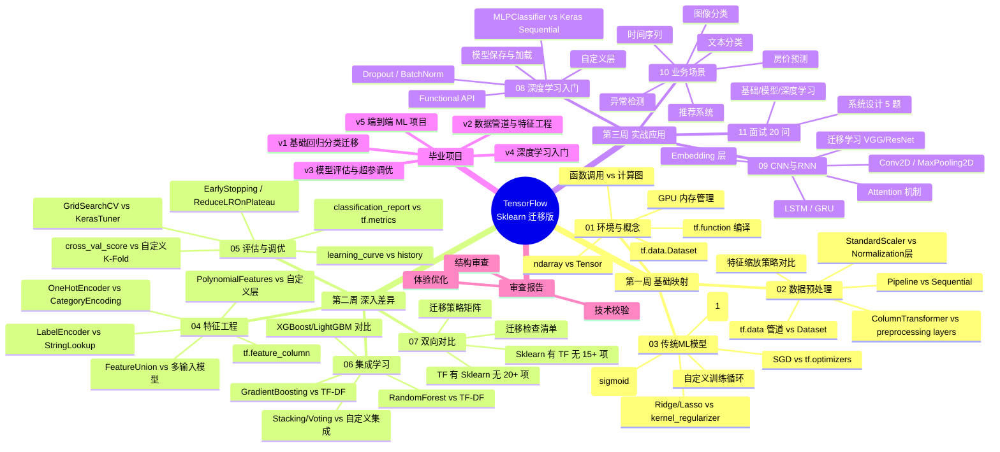

> [!important] 版本基线（阅读前必看）
> 本系列代码以 **TF 2.15+ / Keras 2** 语义为主；若你使用 **TF 2.16+ / Keras 3**，差异点已在各篇标注，主要有：
> - 指标重置 `reset_states()` 改名为 `reset_state()`（03 篇）
> - `model.save('目录')` 保存 SavedModel 在 Keras 3 不可用，改用 `model.export('目录')`；日常推荐 `.keras` 单文件（08 篇）
> - `tf.keras.preprocessing.sequence.pad_sequences` 移至 `tf.keras.utils.pad_sequences`（09 篇）
> - Windows 原生不支持 TF GPU：需 WSL2 + `tensorflow[and-cuda]`（01 篇）
> - HuggingFace `transformers` 与 TF 兼容需 `transformers<5`（Transformer 路径）
>
> 🔄 **2026-09 版本口径**：TensorFlow 当前已到 **2.21**，Keras 主线为 **Keras 3**（多后端 TF/JAX/PyTorch，import 从 `tf.keras` 变为 `keras`；上方差异标注已覆盖主要迁移点）。本系列 TF 2.15/Keras 2 语义定位为 **Legacy 教学线**——张量、训练循环、回调、SavedModel 等核心概念全部可迁移。新开环境建议 TF 2.21 + Python 3.10–3.13；HuggingFace 的现代主路线是 PyTorch，本库 Transformer 专题的 TF 路线属于迁移视角（详见 T0）。

## 前置知识：为什么用迁移式学习

你已掌握 Sklearn，想学 TensorFlow。传统路径从零讲"什么是机器学习""什么是特征"——对你来说太慢。迁移式学习以 **Sklearn 为认知锚点**，逐篇映射已知概念到 TensorFlow 等价物，差异大的重点讲，差异小的快速跳过。



> [!important] 迁移式学习的三类内容
> • **🔄 共有概念**（快速映射）：回归、分类、交叉验证、标准化——理念一致，API 不同
> • **⚡ TF 独有特性**（深入学习）：计算图、自动微分、GPU 加速、分布式训练、CNN/RNN/Transformer、TensorBoard、SavedModel、TF Serving
> • **🔀 双向对比**（系统梳理）：Sklearn 有 TF 无的特性 + TF 有 Sklearn 无的特性——这是迁移路径的核心差异化价值

---

## 一、课程清单

| # | 笔记 | Sklearn 锚点 | 差异等级 | 建议学时 |
|---|------|-------------|---------|---------|
| 00 | [[00-TensorFlow 总览索引（Sklearn 迁移版）]] | — | — | 0.5h |
| 01 | [[01-环境搭建与基础概念对比]] | numpy ndarray → tf.Tensor / 函数调用 → 计算图 | ⭐⭐ 中 | 2.5h |
| 02 | [[02-数据预处理与Pipeline对比]] | StandardScaler/Pipeline → tf.data / preprocessing layers | ⭐⭐⭐ 高 | 3h |
| 03 | [[03-传统ML模型迁移]] | LinearRegression/LogisticRegression → tf.keras.layers.Dense | ⭐⭐⭐ 高 | 3.5h |
| 04 | [[04-特征工程对比]] | ColumnTransformer/OneHotEncoder → tf.feature_column / Keras preprocessing | ⭐⭐⭐ 高 | 3h |
| 05 | [[05-模型评估与调优对比]] | cross_val_score/GridSearchCV → KerasTuner / 自定义训练循环 | ⭐⭐⭐⭐ 高 | 3.5h |
| 06 | [[06-集成学习与模型融合对比]] | RandomForest/GradientBoosting → TF-DF / 自定义集成 | ⭐⭐⭐⭐ 高 | 3h |
| 07 | [[07-双向对比-Sklearn有TF无与TF有Sklearn无]] | 全景差异矩阵 + 迁移策略 | ⭐⭐⭐⭐ 高 | 3h |
| 08 | [[08-深度学习入门-从MLP到Keras]] | MLPClassifier/MLPRegressor → Keras Sequential / Functional | ⭐⭐⭐ 高 | 3.5h |
| 09 | [[09-CNN与RNN-TF独有领域]] | Sklearn 无对应 → Conv2D/LSTM/GRU | ⭐⭐⭐⭐⭐ 高 | 4h |
| 10 | [[01-学习/TensorflowLearningBySklearn/10-业务场景实战合集]] | 10 大生产场景完整迁移代码 | ⭐⭐⭐⭐ 高 | 4h |
| 11 | [[11-面试高频20问-Sklearn背景版]] | 每题带 Sklearn 对比 + 系统设计 | ⭐⭐⭐⭐ 高 | 3h |
| v1 | [[v1-基础回归分类迁移]] | Sklearn 回归/分类 → TF Dense | ⭐⭐ | 1.5h |
| v2 | [[v2-数据管道与特征工程]] | Pipeline → tf.data + preprocessing layers | ⭐⭐⭐ | 2h |
| v3 | [[v3-模型评估与超参调优]] | GridSearchCV → KerasTuner | ⭐⭐⭐ | 2h |
| v4 | [[v4-深度学习入门]] | MLPClassifier → Keras CNN | ⭐⭐⭐⭐ | 2.5h |
| v5 | [[v5-端到端ML项目]] | 完整项目从数据到部署 | ⭐⭐⭐⭐⭐ | 3h |
| 审查 | reviews/（结构/技术/体验） | 三份审查报告（目录暂空，待补） | — | 1h |

**总学时：约 48.5 小时（三周递进 36h + 00 索引 0.5h + v1-v5 毕业项目 11h + 审查报告 1h）**

---

## 二、三周学习路线图



### 阶段检验标准

| 阶段 | 目标 | 检验标准 |
|------|------|---------|
| **第一周** | 能用 TF 完成日常 ML 任务 | 独立完成数据加载 → 预处理 → 线性/逻辑回归 |
| **第二周** | 理解 TF 的特征工程、评估调优、集成差异 | 能解释计算图原理 + 画出特征工程决策图 |
| **第三周** | 能用 TF 做深度学习，应对生产场景和面试 | 完成毕业项目 v5 + 模拟面试全部答出 |

---

## 三、角色导航表（按角色选择学习路线）



| 角色 | 推荐路线 | 预计学时 | 核心目标 |
|------|---------|---------|----------|
| 📊 **数据分析师**（偏分析 + 可视化） | 01→02→03→08→v1→v2 | ~16h | 能用 TF 替代 Sklearn 做回归/分类/可视化 |
| 🔬 **ML 工程师** | 全路径 00→…→11→v1→…→v5 | ~47.5h | 从基础到深度学习，全面掌握 TF + 面试 + 部署 |
| ⏰ **紧急项目迁移**（下周要迁移） | 01→02→07→10→v1 | ~14h | 快速完成 Sklearn→TF 的代码迁移 |
| 🧠 **深度学习方向** | 01→02→08→09→10→v4→v5 | ~22.5h | 从 MLP 到 CNN/RNN，掌握深度学习全流程 |
| 📚 **系统学习全路径** | 00→01→…→11→v1→…→v5 | ~47.5h | 从基础到部署，全面掌握 TF 生态 |

> [!tip] 能力评估矩阵
> 完成 70% 的练习和毕业项目 = **中级**（能用 TF 独立完成 ML 任务）
> 完成 85% = **高级**（能处理模型调优、特征工程、深度学习任务）
> 完成 95% = **专家级**（能设计端到端 ML 系统、部署推理服务、面试全部答出）

---

## 四、核心概念对照表

### 数据与计算层

| Sklearn | TensorFlow | 差异说明 |
|---------|-----------|---------|
| `numpy.ndarray` | `tf.Tensor` | TF 张量支持 GPU 计算和自动微分 |
| 函数即时执行（eager） | 默认即时执行 + `@tf.function` 编译 | TF 可编译为计算图获得高性能 |
| `sklearn.datasets.load_*` | `tf.data.Dataset` | TF 数据管道支持流式加载和 GPU 预取 |
| `train_test_split` | `tf.data.Dataset.shuffle().take().skip()` | TF 用 Dataset 链式操作拆分 |

### 预处理层

| Sklearn | TensorFlow | 差异说明 |
|---------|-----------|---------|
| `StandardScaler` | `tf.keras.layers.Normalization` | TF 预处理层可嵌入模型 |
| `OneHotEncoder` | `tf.keras.layers.CategoryEncoding` | TF 层内置 hash/one-hot |
| `Pipeline` | `tf.keras.Sequential` / `tf.data` pipeline | TF 预处理 + 模型一体化 |
| `ColumnTransformer` | Keras Preprocessing Layers / `tf.feature_column` | TF 按列处理特征 |
| `MinMaxScaler` | `tf.keras.layers.Rescaling` | TF 用 Rescaling 层替代 |

### 模型层

| Sklearn | TensorFlow | 差异说明 |
|---------|-----------|---------|
| `LinearRegression` | `tf.keras.layers.Dense(units=1, activation=None)` | TF 用 Dense 层替代 |
| `LogisticRegression` | `Dense(1, activation='sigmoid')` | TF 用 Dense + sigmoid |
| `Ridge/Lasso` | `kernel_regularizer=l1/l2` | TF 在层内指定正则化 |
| `MLPClassifier` | `tf.keras.Sequential([Dense(...), ...])` | TF Keras 更灵活 |
| `RandomForestClassifier` | `tensorflow_decision_forests` | TF-DF 扩展库 |
| `SVM (SVC/SVR)` | 无直接等价 | TF 不适合做 SVM |

### 评估与调优层

| Sklearn | TensorFlow | 差异说明 |
|---------|-----------|---------|
| `cross_val_score` | 自定义训练循环 + `tf.data` | TF 需手写 K-Fold |
| `GridSearchCV` | `KerasTuner` | TF 专用超参搜索库 |
| `RandomizedSearchCV` | `KerasTuner.RandomSearch` | KerasTuner 支持更多策略 |
| `learning_curve` | `history.history` 字典 + matplotlib | TF 训练历史自带 |
| `classification_report` | `tf.metrics.*` / 自定义 | TF 需手动计算 |

### 部署与工具层

| Sklearn | TensorFlow | 差异说明 |
|---------|-----------|---------|
| `joblib.dump/model.pkl` | `model.save() / SavedModel` | TF 有专用模型格式 |
| Flask/FastAPI 部署 | `TF Serving` / `TFLite` / `TF.js` | TF 有完整部署生态 |
| 无内置可视化 | `TensorBoard` | TF 独有训练可视化工具 |
| 无 GPU 加速 | 原生 GPU 支持 | TF 核心优势 |

---

## 五、环境准备

### 推荐安装方式

| 方式 | 命令 | 适用场景 |
|------|------|---------|
| pip | `pip install tensorflow` | 标准安装 |
| GPU 版本 | `pip install tensorflow[and-cuda]` | 有 NVIDIA GPU |
| conda | `conda install -c conda-forge tensorflow` | Conda 环境 |
| Google Colab | 浏览器打开 colab.research.google.com | 免费 GPU，推荐初学 |
| Kaggle Notebook | 浏览器打开 kaggle.com/notebooks | 免费 GPU + 数据集 |

### 验证安装

```python
import tensorflow as tf

# 查看版本
print(tf.__version__)  # 期望 2.15+

# 检查 GPU
print(tf.config.list_physical_devices('GPU'))
# 有 GPU: [PhysicalDevice(name='/physical_device:GPU:0', device_type='GPU')]
# 无 GPU: []

# 快速测试
x = tf.constant([[1.0, 2.0], [3.0, 4.0]])
print(tf.matmul(x, x))
```

### 推荐工具链

| 工具 | 用途 | 推荐度 |
|------|------|--------|
| Jupyter Notebook / Lab | 交互式开发 | ⭐⭐⭐ 推荐 |
| Google Colab | 免费 GPU 训练 | ⭐⭐⭐ 推荐 |
| TensorBoard | 训练可视化 | ⭐⭐⭐ 必装 |
| VS Code + Jupyter 插件 | 日常开发 | ⭐⭐ |
| PyCharm Professional | 专业 IDE | ⭐⭐ |

---

## 六、面试急救速查树



---

## 七、常见易错点

> [!warning] **易错 1：把 Sklearn 的 fit/predict 思维带到 TF**
> Sklearn 所有模型都是 `fit(X, y)` → `predict(X)`。TF Keras 是 `compile()` → `fit(X, y, epochs, batch_size)` → `predict(X)`。TF 需要额外指定 epochs 和 batch_size。
> **解决方案**：理解 TF 训练是一个迭代过程，不是一次性拟合。

> [!warning] **易错 2：忘记 compile() 就 fit()**
> TF Keras 模型必须先 compile 指定 optimizer 和 loss，否则会报 `RuntimeError: You must compile a model before training/testing`。
> **解决方案**：养成 `build → compile → fit` 的三步习惯。

> [!warning] **易错 3：用 numpy 数组做 GPU 计算时不转换**
> 传入 numpy 数组时 TF 会自动转换，但在 `@tf.function` 中可能出现类型不匹配。
> **解决方案**：在性能关键路径使用 `tf.constant()` 或 `tf.convert_to_tensor()`。

> [!warning] **易错 4：混淆 Keras 和 TensorFlow 的版本关系**
> Keras 现在是 TF 的高级 API（`tf.keras`），但 Keras 3.x 也可以独立使用。初学者容易混淆 import 路径。
> **解决方案**：统一使用 `from tensorflow import keras` 或 `import tensorflow.keras`。

> [!warning] **易错 5：期望 TF 有 Sklearn 的全部算法**
> TF 专注于深度学习，不包含 SVM、KNN、决策树（除 TF-DF）、DBSCAN 等传统 ML 算法。
> **解决方案**：传统 ML 用 Sklearn，深度学习用 TF，混合使用是常态。

> [!warning] **易错 6：忽略 GPU 内存管理**
> TF 默认会占用全部 GPU 显存，导致 OOM 或其他程序无法使用 GPU。
> **解决方案**：设置 `tf.config.experimental.set_memory_growth(gpu, True)` 启用按需分配。

> [!warning] **易错 7：不理解 eager execution 和 graph mode 的区别**
> TF 默认即时执行（eager），但 `@tf.function` 会编译为计算图（graph mode）。在 graph mode 中不能用 Python 原生控制流。
> **解决方案**：初学阶段用 eager mode，性能优化时再引入 `@tf.function`。

---

## 🎯 本文学完自检

| 层次 | 检查项 |
|------|--------|
| 🟢 基础 | 能说出 TensorFlow 与 Sklearn 在编程模型上的 3 个核心差异 |
| 🟡 进阶 | 能画出 Sklearn Pipeline 到 TensorFlow 数据管道 + Keras 模型的映射关系 |
| 🔴 挑战 | 能根据团队背景（分析师/工程师/研究员）设计一条合理的 TensorFlow 学习路线 |

---

## ⚡ 30 秒速记卡片

| # | 正面（问题） | 背面（答案） |
|---|-------------|-------------|
| F1 | TF 的核心数据类型？ | `tf.Tensor`（替代 numpy ndarray，支持 GPU + 自动微分） |
| F2 | Sklearn 的 fit → TF 对应？ | `compile()` → `fit(X, y, epochs, batch_size)` |
| F3 | Sklearn Pipeline → TF 对应？ | `tf.data.Dataset` + Keras Preprocessing Layers |
| F4 | GridSearchCV → TF 对应？ | `KerasTuner`（第三方库） |
| F5 | TF 独有能力（Sklearn 没有）？ | 自动微分 / GPU 加速 / CNN/RNN / SavedModel / TensorBoard |
| F6 | Sklearn 独有能力（TF 没有）？ | SVM / KNN / RandomForest / DBSCAN / 完整特征工程工具链 |
| F7 | TF 模型保存格式？ | SavedModel（部署）/ .keras（Keras 原生）/ HDF5（旧格式） |

---

## 相关笔记

- ➡️ 后续：[[01-环境搭建与基础概念对比]]
- 🔗 关联：[[01-学习/TensorflowLearningBySklearn/README]]
- 🔗 关联：[[07-双向对比-Sklearn有TF无与TF有Sklearn无]]
- 🔗 毕业项目：[[v1-基础回归分类迁移]] · [[v2-数据管道与特征工程]] · [[v3-模型评估与超参调优]] · [[v4-深度学习入门]] · [[v5-端到端ML项目]]
- 🔗 审查：reviews/ 三份审查报告（结构/技术/体验，目录暂空待补）
- 🔗 长期路线：[[Transformer/T0-Transformer 路径总览]] · [[分布式训练/D0-分布式训练 路径总览]] · [[TFX/X0-TFX 路径总览]]

---
*最后更新：2026-07-25*
