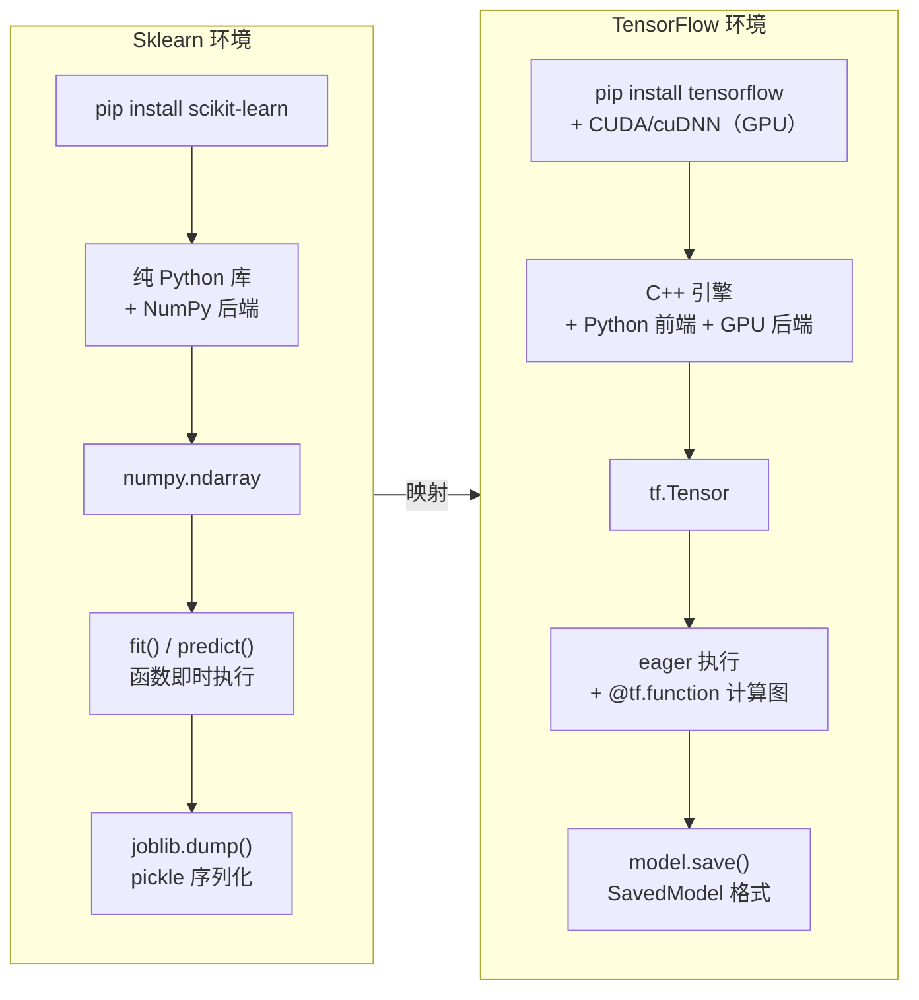
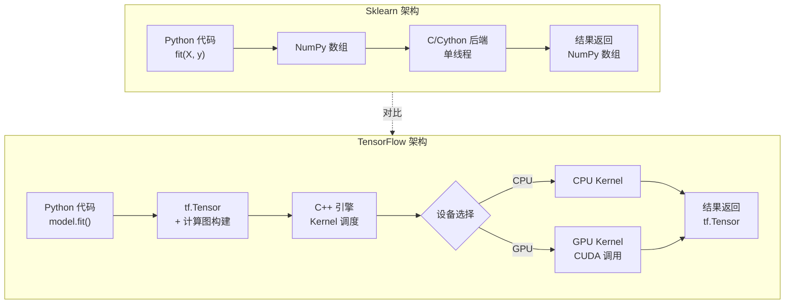
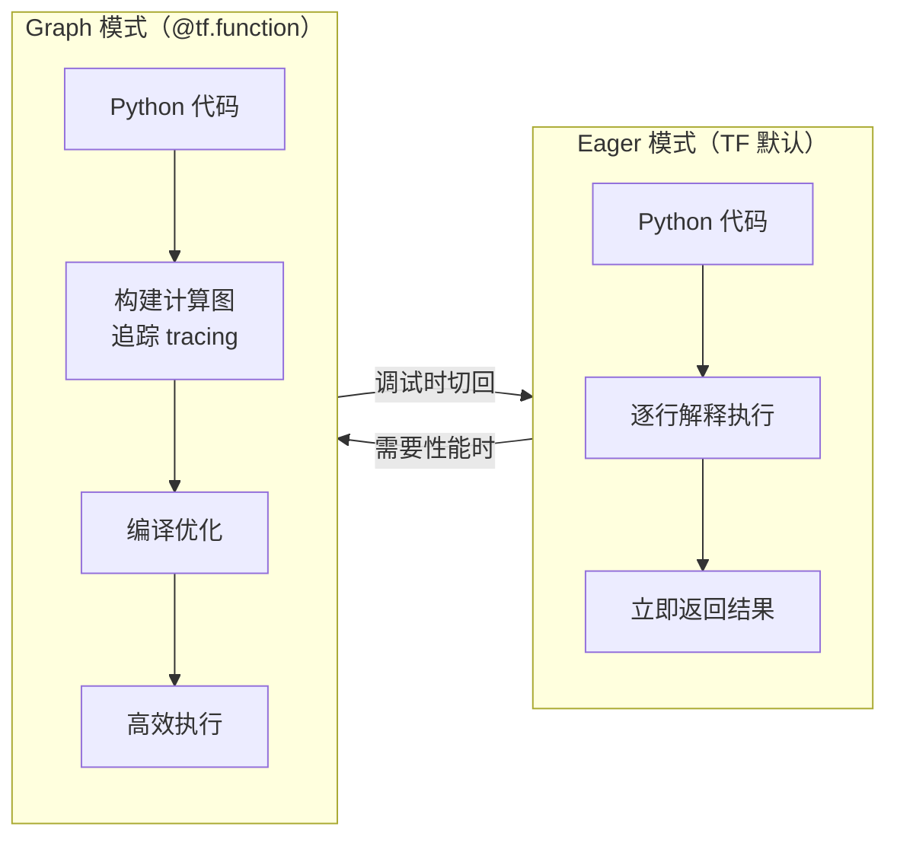
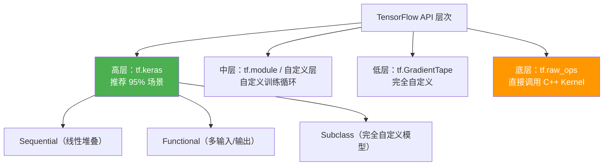

## 前置知识：从 Sklearn 到 TensorFlow 的第一道门槛

Sklearn 开发者切入 TensorFlow 时，第一个困惑不是模型怎么搭，而是**编程范式**：怎么安装？数据类型变了？为什么还要编译？GPU 怎么管？本文以 Sklearn 为锚点，逐项映射 TensorFlow 的等价操作，帮你快速搭建熟练的工作环境。



> [!important] 核心差异：库 vs 引擎
> Sklearn 是一个**纯 Python 库**（底层调用 NumPy/SciPy），装好 pip 包就能跑。TensorFlow 是一个**计算引擎**（C++ 后端 + Python 前端 + 可选 GPU 后端），安装只是第一步，理解它的运行模型才是关键。

---

## 一、安装方式对比

### 1.1 pip 安装（推荐本地开发）

```bash
# ============================================
# Sklearn 安装（你熟悉的）
# ============================================
pip install scikit-learn

# 验证
python -c "import sklearn; print(sklearn.__version__)"
# 期望输出: 1.5+

# ============================================
# TensorFlow CPU 版安装
# ============================================
pip install tensorflow

# ============================================
# TensorFlow GPU 版安装（Linux 或 Windows WSL2 + NVIDIA GPU）
# 注意：TF 2.11 起放弃原生 Windows GPU 支持——
# 原生 Windows 下 pip install tensorflow 只有 CPU；
# Windows 上用 GPU 需先装 WSL2（Ubuntu），在 WSL2 内执行：
# ============================================
pip install tensorflow[and-cuda]

# 验证
python -c "import tensorflow as tf; print(tf.__version__)"
# 期望输出: 2.15+

python -c "import tensorflow as tf; print(tf.config.list_physical_devices('GPU'))"
# 有 GPU: [PhysicalDevice(name='/physical_device:GPU:0', device_type='GPU')]
# 无 GPU: []
```

> [!tip] 安装对照表
> | 操作 | Sklearn | TensorFlow |
> |------|---------|-----------|
> | 标准安装 | `pip install scikit-learn` | `pip install tensorflow` |
> | GPU 支持 | ❌ 不需要 | `pip install tensorflow[and-cuda]` + NVIDIA 驱动（仅 Linux/WSL2；原生 Windows 只能 CPU） |
> | 依赖体积 | ~30MB | ~500MB（CPU 版）/ ~5GB（含 CUDA） |
> | 版本检查 | `sklearn.__version__` | `tf.__version__` |
> | Conda 安装 | `conda install -c conda-forge scikit-learn` | `conda install -c conda-forge tensorflow` |

### 1.2 云端环境（推荐初学，免去本地配置）

| 环境 | Sklearn 友好度 | TF 友好度 | 推荐理由 |
|------|:---:|:---:|------|
| Google Colab | ⭐⭐⭐ | ⭐⭐⭐⭐⭐ | **强烈推荐初学**：免费 GPU、TF 预装、无需配置环境 |
| Kaggle Notebook | ⭐⭐⭐ | ⭐⭐⭐⭐ | 免费 GPU + 数据集，适合竞赛选手 |
| Jupyter Notebook 本地 | ⭐⭐⭐ | ⭐⭐⭐ | 适合已有本地环境的中级用户 |
| VS Code + Jupyter 插件 | ⭐⭐⭐ | ⭐⭐⭐ | 日常开发利器 |

> [!warning] 常见安装陷阱
> **陷阱 1**：TF 2.11 起原生 Windows 不再支持 GPU（`pip install tensorflow` 只含 CPU）；Windows 上用 GPU 必须走 WSL2 + `pip install tensorflow[and-cuda]`（CUDA/cuDNN 随 pip 自动安装，但仍需匹配的 NVIDIA 驱动）
> **陷阱 2**：`pip install tensorflow-gpu` 是 TF 2.x 之前的旧方式，现在统一用 `pip install tensorflow[and-cuda]`
> **陷阱 3**：conda 安装的 TF 可能与 pip 安装的 CUDA 库冲突，建议二选一
> **解决方案**：初学优先用 Colab/Kaggle，本地开发先用 CPU 版，GPU 需求明确后再配置

---

## 二、进程架构与后端对比

### 2.1 Sklearn：纯 Python 库 + NumPy 后端

```python
# ============================================
# Sklearn 的运行模型：函数调用 + NumPy 后端
# ============================================
import numpy as np
from sklearn.linear_model import LogisticRegression

# 1. 数据准备（NumPy 数组）
X = np.array([[1.0, 2.0], [3.0, 4.0], [5.0, 6.0]])
y = np.array([0, 1, 0])

# 2. 模型实例化
model = LogisticRegression()

# 3. 训练（内部调用 C 实现的 liblinear 或 lbfgs）
model.fit(X, y)

# 4. 预测（返回 NumPy 数组）
pred = model.predict(X)
print(pred)           # [0 1 0]
print(type(pred))     # <class 'numpy.ndarray'>

# 特征：无状态函数调用，无 GPU，无计算图
```

### 2.2 TensorFlow：C++ 引擎 + Python 前端 + GPU 后端

```python
# ============================================
# TensorFlow 的运行模型：计算图 + 引擎执行
# ============================================
import tensorflow as tf

# 1. 数据准备（tf.Tensor，可放 GPU）
X = tf.constant([[1.0, 2.0], [3.0, 4.0], [5.0, 6.0]])
y = tf.constant([0, 1, 0])

# 2. 模型实例化（Keras 高层 API）
model = tf.keras.Sequential([
    tf.keras.layers.Dense(16, activation='relu', input_shape=(2,)),
    tf.keras.layers.Dense(2, activation='softmax')
])

# 3. 编译（指定优化器、损失、指标）—— Sklearn 没有这步！
model.compile(optimizer='adam',
              loss='sparse_categorical_crossentropy',
              metrics=['accuracy'])

# 4. 训练（底层调用 C++ 引擎 + GPU）
history = model.fit(X, y, epochs=5, verbose=1)

# 5. 预测（predict() 默认返回 numpy，直接调用返回 Tensor）
pred = model.predict(X)
print(type(pred))       # <class 'numpy.ndarray'>
print(type(model(X)))   # <class 'tensorflow...Tensor'>
```



> [!important] 核心差异：单线程 CPU vs 多设备并行
> Sklearn 的计算全部在 CPU 单线程上完成（`n_jobs` 参数可用多进程并行搜索，但单模型训练是单线程）。TensorFlow 的计算可以自动分配到 GPU、多 GPU、甚至 TPU，并支持分布式训练。这是 TF 的核心性能优势。

---

## 三、核心数据结构对比：ndarray vs tf.Tensor

### 3.1 基本创建与运算

```python
import numpy as np
import tensorflow as tf

# ============================================
# 创建方式对比
# ============================================
# --- Sklearn / NumPy ---
np_arr = np.array([1.0, 2.0, 3.0])
np_ones = np.ones((2, 3))
np_zeros = np.zeros((2, 3))
np_random = np.random.randn(2, 3)

# --- TensorFlow ---
tf_tensor = tf.constant([1.0, 2.0, 3.0])      # 不可变张量
tf_var = tf.Variable([1.0, 2.0, 3.0])          # 可变张量（模型参数）
tf_ones = tf.ones((2, 3))
tf_zeros = tf.zeros((2, 3))
tf_random = tf.random.normal((2, 3))

# ============================================
# 常用操作对照表（实操）
# ============================================
# --- NumPy ---
c = np_arr + np_arr          # 逐元素加
e = np.dot(np_arr, np_arr)   # 点积
s = np.sum(np_arr)           # 求和

# --- TensorFlow ---
c_tf = tf_tensor + tf_tensor  # 逐元素加
e_tf = tf.tensordot(tf_tensor, tf_tensor, axes=1)  # 点积
s_tf = tf.reduce_sum(tf_tensor)  # 求和（注意 reduce_ 前缀）

# ============================================
# numpy ↔ TensorFlow 自动转换（最实用特性）
# ============================================
# numpy → TF（自动转换）
X_np = np.array([[1.0, 2.0], [3.0, 4.0]])
result = tf.matmul(X_np, X_np)  # ← 自动将 numpy 转为 tf.Tensor 计算

# TF → numpy（显式转换）
X_tf = tf.constant([[1.0, 2.0], [3.0, 4.0]])
X_back = X_tf.numpy()  # ← .numpy() 方法
print(type(X_back))    # <class 'numpy.ndarray'>
```

### 3.2 关键差异表

| 特性 | NumPy ndarray | tf.Tensor |
|------|--------------|-----------|
| 可变性 | 可原地修改 `arr[0] = 5` | 不可变（`tf.Variable` 才可变） |
| 设备 | 只在 CPU | 可在 CPU/GPU/TPU |
| 自动微分 | ❌ 不支持 | ✅ `tf.GradientTape` |
| 计算图 | ❌ 即时执行 | ✅ `@tf.function` 可编译 |
| GPU 加速 | ❌ | ✅ 原生支持 |
| 分布式 | ❌ | ✅ 跨设备/跨机器 |
| 与 Sklearn 集成 | ✅ 原生 | 需 `.numpy()` 转换 |

> [!tip] 什么时候用 tf.Variable？
> `tf.Variable` 是 TF 中**可变张量**，专门用于表示模型参数（权重、偏置）。Sklearn 没有等价概念——Sklearn 的模型参数是内部 NumPy 数组，对外不可见。TF 把参数暴露为 `tf.Variable`，便于自动微分和手动修改。
> ```python
> w = tf.Variable(tf.random.normal((3, 1)))  # 可训练参数
> w.assign_add(tf.ones((3, 1)))              # 原地修改
> ```

### 3.3 常用操作速查表

| 操作 | numpy | TensorFlow | 备注 |
|------|-------|-----------|------|
| 创建常量 | `np.array([1,2,3])` | `tf.constant([1,2,3])` | 语法一致 |
| 全零矩阵 | `np.zeros((3,4))` | `tf.zeros((3,4))` | 语法一致 |
| 随机正态 | `np.random.randn(3,3)` | `tf.random.normal((3,3))` | 方法名不同 |
| 矩阵乘法 | `A @ B` | `A @ B` 或 `tf.matmul(A,B)` | `@` 通用 |
| 转置 | `X.T` | `tf.transpose(X)` | tf.Tensor 无 `.T` 属性（AttributeError），只能 `tf.transpose(X)` 或先 `X.numpy().T` |
| 维度重排 | `X.reshape(3,4)` | `tf.reshape(X, (3,4))` | 语法类似 |
| 类型转换 | `X.astype(np.float32)` | `tf.cast(X, tf.float32)` | 方法名不同 |
| 沿轴求和 | `np.sum(X, axis=0)` | `tf.reduce_sum(X, axis=0)` | `reduce_` 前缀 |

---

## 四、自动微分：TensorFlow 的杀手锏

这是 Sklearn 与 TF 最根本的能力差异——Sklearn 模型是"封装好的黑盒"，你无法轻易改损失函数；TF 的 `GradientTape` 让你**一行代码拿到任意函数的梯度**。

```python
import tensorflow as tf

# ============================================
# Sklearn：无自动微分，底层手写梯度
# （你在 Sklearn 中不需要写，但底层 liblinear/lbfgs 就是这么做的）
# ============================================
# def manual_grad(X, y, w, b, lr=0.01):
#     z = X @ w + b
#     p = 1 / (1 + np.exp(-z))
#     grad_w = X.T @ (p - y) / len(y)   # 手动推导梯度公式
#     grad_b = np.mean(p - y)
#     ...

# ============================================
# TensorFlow：自动微分
# ============================================
w = tf.Variable(tf.random.normal((2, 1)))
b = tf.Variable(tf.zeros((1,)))

X = tf.constant([[1.0, 2.0], [3.0, 4.0], [5.0, 6.0]])
y = tf.constant([[0.0], [1.0], [0.0]])

with tf.GradientTape() as tape:
    z = tf.matmul(X, w) + b
    loss = tf.reduce_mean(
        tf.nn.sigmoid_cross_entropy_with_logits(labels=y, logits=z)
    )

# 一行代码获取梯度！
grads = tape.gradient(loss, [w, b])
print(grads[0])  # dw
print(grads[1])  # db
```

> [!important] 为什么自动微分是 TF 的核心优势
> Sklearn 的模型算法是"封装好的黑盒"——你调用 `fit()`，它内部用 C 实现的优化器训练。你无法轻易改损失函数、改优化过程。TF 的 `GradientTape` 让你可以自由定义任何损失函数、任何模型结构，TF 自动帮你算梯度。这是深度学习灵活性的基石。

---

## 五、编程模型对比：即时执行 vs 计算图

### 5.1 类比理解



```python
import tensorflow as tf

# ============================================
# Eager 模式（默认，和 Sklearn 体验一样直观）
# ============================================
x = tf.constant([1.0, 2.0, 3.0])
y = x * 2.0 + 1.0  # 立即执行
print(y)  # tf.Tensor([3. 5. 7.], shape=(3,), dtype=float32)

# ============================================
# Graph 模式（@tf.function 编译为计算图）
# ============================================
@tf.function
def compute(x):
    y = x * 2.0 + 1.0
    z = tf.reduce_sum(y)
    return z

# 第一次调用：构建计算图（慢）
result1 = compute(tf.constant([1.0, 2.0, 3.0]))
# 第二次调用：复用计算图（快）
result2 = compute(tf.constant([4.0, 5.0, 6.0]))
```

> [!important] 什么时候用 `@tf.function`？
> | 场景 | 用 Eager | 用 Graph |
> |------|:---:|:---:|
> | 调试代码、打印中间值 | ✅ | ❌ |
> | 数据探索、交互式分析 | ✅ | ❌ |
> | 训练循环（多 epoch） | ❌ | ✅ |
> | 模型推理（生产环境） | ❌ | ✅ |
> | 自定义训练循环 | ❌ | ✅ |
>
> **新手建议**：前两周全部用 Eager 模式，第三周再引入 `@tf.function`。Keras 的 `model.fit()` 内部已自动使用计算图优化。

### 5.2 Graph 模式的注意事项

```python
import tensorflow as tf

# ============================================
# ❌ 错误示范：在 @tf.function 中使用 Python 原生 print
# ============================================
@tf.function
def bad_trace():
    a = tf.constant([1, 2, 3])
    print("Tracing!")   # ← 只在首次编译时执行一次！
    return a + 1

bad_trace()  # 输出：Tracing!
bad_trace()  # 什么都不输出！

# ============================================
# ✅ 正确做法：用 tf.print 替代 print
# ============================================
@tf.function
def good_trace():
    a = tf.constant([1, 2, 3])
    tf.print(a)         # ← 每次调用都执行
    return a + 1

good_trace()  # 每次调用都输出 [1 2 3]
```

> [!warning] Graph Mode 常见陷阱
> 1. **不能调用 `.numpy()`**：Graph mode 中张量没有具体值
> 2. **不能用 Python if/for**：需要用 `tf.cond` / `tf.while_loop`
> 3. **不能用 Python print**：需要用 `tf.print`
> **解决方案**：初学阶段用 eager mode，性能优化时再引入 `@tf.function`

---

## 六、Keras API 四层对比

TensorFlow 提供了多层 API，从高到低依次是：



```python
import tensorflow as tf
import numpy as np

# 准备数据
X = np.random.randn(100, 10).astype(np.float32)
y = np.random.randint(0, 2, (100, 1)).astype(np.float32)

# ============================================
# 层次 1：Sequential（最常用，最像 Sklearn）
# 类比：LogisticRegression / MLPClassifier
# 适合：标准前馈网络、快速原型
# ============================================
model = tf.keras.Sequential([
    tf.keras.layers.Dense(64, activation='relu', input_shape=(10,)),
    tf.keras.layers.Dense(32, activation='relu'),
    tf.keras.layers.Dense(1, activation='sigmoid')
])
model.compile(optimizer='adam', loss='binary_crossentropy', metrics=['accuracy'])
model.fit(X, y, epochs=10, batch_size=32, verbose=0)

# ============================================
# 层次 2：Functional API（灵活的模型拓扑）
# 类比：Pipeline + ColumnTransformer（多输入）
# 适合：多输入多输出、残差连接、共享层
# ============================================
input_a = tf.keras.Input(shape=(10,), name='text_features')
input_b = tf.keras.Input(shape=(5,), name='numeric_features')

x1 = tf.keras.layers.Dense(32, activation='relu')(input_a)
x2 = tf.keras.layers.Dense(16, activation='relu')(input_b)
concat = tf.keras.layers.Concatenate()([x1, x2])
output = tf.keras.layers.Dense(1, activation='sigmoid')(concat)

model = tf.keras.Model(inputs=[input_a, input_b], outputs=output)
model.compile(optimizer='adam', loss='binary_crossentropy')

# ============================================
# 层次 3：Subclass（完全自定义模型结构）
# 类比：继承 BaseEstimator
# ============================================
class MyModel(tf.keras.Model):
    def __init__(self):
        super().__init__()
        self.dense1 = tf.keras.layers.Dense(64, activation='relu')
        self.dense2 = tf.keras.layers.Dense(1, activation='sigmoid')

    def call(self, inputs):
        x = self.dense1(inputs)
        return self.dense2(x)

model = MyModel()
model.compile(optimizer='adam', loss='binary_crossentropy')

# ============================================
# 层次 4：纯 GradientTape（完全手动）
# 类比：NumPy 手写训练（Sklearn 无法做到）
# 适合：研究、对抗训练、自定义训练逻辑
# ============================================
w = tf.Variable(tf.random.normal((10, 1)))
b = tf.Variable(tf.zeros((1,)))
optimizer = tf.keras.optimizers.Adam(learning_rate=0.01)
loss_fn = tf.keras.losses.BinaryCrossentropy(from_logits=True)

for epoch in range(10):
    with tf.GradientTape() as tape:
        logits = tf.matmul(X, w) + b
        loss = loss_fn(y, logits)
    grads = tape.gradient(loss, [w, b])
    optimizer.apply_gradients(zip(grads, [w, b]))
```

> [!tip] 选哪层 API？
> | 场景 | 推荐 API | 对应 Sklearn |
> |------|---------|-------------|
> | 标准 ML 模型 | Sequential | `LogisticRegression` / `MLPClassifier` |
> | 多输入/输出 | Functional | `Pipeline` + `ColumnTransformer` |
> | 自定义模型结构 | Subclass | 继承 `BaseEstimator` |
> | 研究级自定义 | GradientTape | 无对应（Sklearn 无法做到） |
>
> **迁移建议**：从 Keras Sequential 开始，90% 的场景够用。

---

## 七、模型保存与加载对比

### 7.1 Sklearn：joblib/pickle

```python
import joblib
from sklearn.linear_model import LogisticRegression

model = LogisticRegression()
model.fit(X, y)

# 保存
joblib.dump(model, 'model.pkl')

# 加载
model = joblib.load('model.pkl')
model.predict(X_new)
```

### 7.2 TensorFlow：多种格式

```python
import tensorflow as tf

# ============================================
# 方式 1：.keras 格式（推荐，Keras 原生）
# ============================================
model.save('my_model.keras')
loaded = tf.keras.models.load_model('my_model.keras')

# ============================================
# 方式 2：SavedModel 格式（用于部署）
# ============================================
model.save('my_model')                              # 保存为目录
loaded = tf.keras.models.load_model('my_model')      # 加载

# ============================================
# 方式 3：仅保存权重
# ============================================
model.save_weights('weights.weights.h5')
model.load_weights('weights.weights.h5')

# ============================================
# 方式 4：checkpoint（训练中断恢复）
# ============================================
checkpoint = tf.keras.callbacks.ModelCheckpoint(
    'ckpt/epoch-{epoch:02d}.keras',
    save_best_only=True,
    monitor='val_loss'
)
model.fit(X, y, epochs=10, callbacks=[checkpoint])
```

> [!important] 保存格式对照
> | 操作 | Sklearn | TensorFlow |
> |------|---------|-----------|
> | 标准保存 | `joblib.dump(model, 'model.pkl')` | `model.save('model.keras')` |
> | 部署格式 | ❌ 无专用格式 | `SavedModel`（目录格式，用于 TF Serving） |
> | 仅权重 | ❌ 不分离 | `model.save_weights('w.weights.h5')` |
> | 训练恢复 | ❌ 无内置 | `ModelCheckpoint` callback |
> | 跨语言 | ❌ Python only | ✅ SavedModel 可被 C++/Java/Go 加载 |

---

## 八、GPU 内存管理（Sklearn 没有，TF 独有）

```python
import tensorflow as tf

# ============================================
# 1. 检查 GPU 是否可用
# ============================================
gpus = tf.config.list_physical_devices('GPU')
print("GPU 列表:", gpus)

# ============================================
# 2. 启用 GPU 按需增长（推荐，防止 OOM）
# 默认行为：TF 会一次性占满全部 GPU 显存
# ============================================
if gpus:
    for gpu in gpus:
        tf.config.experimental.set_memory_growth(gpu, True)
    print("✓ GPU 按需增长已启用")

# ============================================
# 3. 限制 GPU 显存使用量（需要和其他程序共享时）
# ============================================
# tf.config.set_logical_device_configuration(
#     gpus[0],
#     [tf.config.LogicalDeviceConfiguration(memory_limit=2048)]  # 2GB
# )

# ============================================
# 4. 指定 CPU 运行（调试时用）
# ============================================
# tf.config.set_visible_devices([], 'GPU')
```

> [!warning] GPU 内存陷阱
> TF 默认会占用**全部 GPU 显存**，导致：
> 1. 其他程序无法使用 GPU
> 2. 多个 TF 进程无法共享 GPU
> 3. 大模型 OOM
> **解决方案**：在脚本开头加上 `set_memory_growth`。

---

## 九、关键工具路径对照

| 目的 | Sklearn | TensorFlow |
|------|---------|-----------|
| 保存模型 | `joblib.dump(model, 'model.pkl')` | `model.save('model.keras')` 或 SavedModel |
| 加载模型 | `joblib.load('model.pkl')` | `tf.keras.models.load_model(...)` |
| 查看训练曲线 | 手动 matplotlib | `TensorBoard`（`tf.keras.callbacks.TensorBoard`） |
| 提前停止 | 无内建 | `tf.keras.callbacks.EarlyStopping` |
| 学习率衰减 | 无内建 | `tf.keras.callbacks.ReduceLROnPlateau` |
| 模型检查点 | 手动 joblib | `tf.keras.callbacks.ModelCheckpoint` |
| 导出为轻量模型 | 无 | `TFLiteConverter` → `.tflite` |
| 浏览器部署 | 无 | `tfjs.converters` → TF.js |

---

## 🧪 本章练习

每个练习包含：题目描述、关键提示、验收标准。建议先自己尝试 10 分钟，卡住再看折叠答案。

---

### 🟢 练习 1：环境搭建验收（10 分钟）

**题目**：在你选择的开发环境（推荐 Google Colab 或本地 Jupyter）中完成以下任务：

1. 导入 TensorFlow 并打印版本号
2. 检查 GPU 是否可用
3. 创建形状为 `(3, 4)` 的 `tf.Tensor`，值全为 1，打印 shape 和 dtype
4. 将上述 Tensor 转换为 numpy 数组，打印类型确认

<details>
<summary>💡 参考答案</summary>

```python
import tensorflow as tf

print("TF 版本:", tf.__version__)
print("GPU:", tf.config.list_physical_devices('GPU'))

t = tf.ones((3, 4))
print("shape:", t.shape, "dtype:", t.dtype)

n = t.numpy()
print("转 numpy 类型:", type(n))
```
</details>

**验收标准**：
- [ ] 能成功导入 TensorFlow（无报错）
- [ ] 版本号 ≥ 2.10
- [ ] 能正确创建和转换张量

---

### 🟢 练习 2：ndarray vs Tensor 互转（10 分钟）

**题目**：完成以下转换并验证结果一致性：

1. 创建 NumPy 数组 `np_arr = np.random.randn(3, 4)`
2. 转为 `tf.Tensor`
3. 执行转置乘法 `(4,3) @ (3,4) = (4,4)`
4. 结果转回 NumPy
5. 用 `np.allclose` 验证与纯 NumPy 计算结果一致

<details>
<summary>💡 参考答案</summary>

```python
import numpy as np
import tensorflow as tf

np_arr = np.random.randn(3, 4)
tf_arr = tf.convert_to_tensor(np_arr)

# 转置乘法：(4,3) @ (3,4) = (4,4)
tf_result = tf.matmul(tf_arr, tf_arr, transpose_a=True, transpose_b=False)
result_np = tf_result.numpy()

# 纯 NumPy 对比
np_result = np_arr.T @ np_arr
print(f"结果一致: {np.allclose(result_np, np_result)}")  # True
```
</details>

**验收标准**：
- [ ] 转换无误
- [ ] `np.allclose` 返回 `True`

---

### 🟡 练习 3：GradientTape 入门（15 分钟）

**题目**：用 `tf.GradientTape` 计算以下函数在 `x=1.0, y=2.0` 处的梯度，并验证与手算结果一致。

$$f(x, y) = x^2 + 3xy + y^2$$

手算验证：$\frac{\partial f}{\partial x} = 2x + 3y = 8$，$\frac{\partial f}{\partial y} = 3x + 2y = 7$

<details>
<summary>💡 参考答案</summary>

```python
import tensorflow as tf

x = tf.Variable(1.0)
y = tf.Variable(2.0)

with tf.GradientTape() as tape:
    f = x**2 + 3*x*y + y**2

grads = tape.gradient(f, [x, y])
print(f"df/dx = {grads[0].numpy()}")  # 8.0
print(f"df/dy = {grads[1].numpy()}")  # 7.0
```
</details>

**验收标准**：
- [ ] `df/dx = 8.0`，`df/dy = 7.0`
- [ ] 能用自己的话解释 GradientTape 的工作原理

---

### 🟡 练习 4：用 TF 复现 Sklearn 线性回归（20 分钟）

**题目**：将以下 Sklearn 线性回归代码用 TensorFlow Keras 重写，要求 TF 预测值与 Sklearn 预测值的均方误差 < 0.05。

```python
# 原 Sklearn 代码（你已熟悉的）
import numpy as np
from sklearn.linear_model import LinearRegression

np.random.seed(42)
X = np.random.randn(100, 2).astype(np.float32)
y = 3 * X[:, 0] + 2 * X[:, 1] + 1 + np.random.randn(100) * 0.1

model = LinearRegression()
model.fit(X, y)
print("Sklearn 系数:", model.coef_, "截距:", model.intercept_)
```

<details>
<summary>💡 参考答案</summary>

```python
import tensorflow as tf

model = tf.keras.Sequential([
    tf.keras.layers.Dense(units=1, input_shape=(2,))  # 不加激活函数 = 线性回归
])
model.compile(optimizer='sgd', loss='mse')
history = model.fit(X, y, epochs=200, verbose=0)

weights, bias = model.layers[0].get_weights()
print("TF 权重:", weights.flatten(), "TF 偏置:", bias)
print("最终损失:", history.history['loss'][-1])
```
</details>

**验收标准**：
- [ ] TF 预测值与 Sklearn 预测值的均方误差 < 0.05
- [ ] 能解释为什么 TF 需要 `epochs=200` 而 Sklearn `fit` 一次就够（TF 用梯度下降迭代，Sklearn 用解析解）

---

### 🔴 练习 5：探索 @tf.function 的性能差异（20 分钟）

**题目**：编写一个矩阵乘法函数，对比 Eager 模式和 Graph 模式（`@tf.function`）的执行速度差异。

1. 创建两个 1000×1000 的随机矩阵
2. 定义一个做矩阵乘法 100 次的函数
3. 分别用 Eager 和 `@tf.function` 执行，记录总耗时
4. 解释为什么第二次调用 `@tf.function` 比第一次快很多

<details>
<summary>💡 参考答案</summary>

```python
import tensorflow as tf
import time

A = tf.random.normal((1000, 1000))
B = tf.random.normal((1000, 1000))

def matmul_eager(A, B):
    return tf.matmul(A, B)

@tf.function
def matmul_graph(A, B):
    return tf.matmul(A, B)

# 预热（触发图编译）
_ = matmul_graph(A, B)

# 计时 Eager
start = time.time()
for _ in range(100):
    matmul_eager(A, B)
print(f"Eager 100 次耗时: {time.time() - start:.3f}s")

# 计时 Graph
start = time.time()
for _ in range(100):
    matmul_graph(A, B)
print(f"Graph 100 次耗时: {time.time() - start:.3f}s")
```
</details>

**验收标准**：
- [ ] Graph 模式耗时显著低于 Eager 模式（通常快 2-5 倍）
- [ ] 能用自己的话解释"计算图编译"做了什么（融合操作、优化内存分配、消除 Python 开销）

---

## 🎯 本文学完自检

| 层次 | 检查项 |
|------|--------|
| 🟢 基础 | 能说出 `tf.Tensor` 和 `numpy.ndarray` 的 3 个区别；能写出 Sequential 模型的最小 3 步（build → compile → fit） |
| 🟡 进阶 | 能解释即时执行（Eager）和计算图（Graph）的区别，并说出 `@tf.function` 的适用场景 |
| 🔴 挑战 | 能写出一个完整的 `GradientTape` 自定义训练循环，替代 `model.fit()` |

---

## ⚡ 30 秒速记卡片

| # | 正面（问题） | 背面（答案） |
|---|-------------|-------------|
| F1 | TF 核心数据类型？ | `tf.Tensor`（不可变）+ `tf.Variable`（可变，模型参数） |
| F2 | Sklearn 的 fit → TF 对应？ | `compile()` → `fit(X, y, epochs, batch_size)` → `predict(X)` |
| F3 | 自动微分用什么？ | `tf.GradientTape()` |
| F4 | numpy → TF？ | 自动转换（`tf.matmul(np_array, np_array)` 可行） |
| F5 | TF → numpy？ | `tensor.numpy()` |
| F6 | Eager vs Graph？ | Eager 逐行执行（调试友好），Graph 先编译再执行（高性能） |
| F7 | `@tf.function` 作用？ | 把 Python 函数编译为计算图，大幅提升性能 |
| F8 | TF 的 API 四层（高→低）？ | Sequential → Functional → Subclass → GradientTape |
| F9 | Sklearn 的 joblib.dump → TF？ | `model.save('model.keras')` 或 SavedModel 格式 |
| F10 | GPU 内存最佳实践？ | `set_memory_growth(gpu, True)` 启用按需分配 |

---

## 相关笔记

- ⬅️ 前置：[[00-TensorFlow 总览索引（Sklearn 迁移版）]]
- ➡️ 后续：[[02-数据预处理与Pipeline对比]]
- 🔗 关联：[[07-双向对比-Sklearn有TF无与TF有Sklearn无]]
- 🔗 练习：[[v1-基础回归分类迁移]]

---
*创建时间：2026-07-25*
