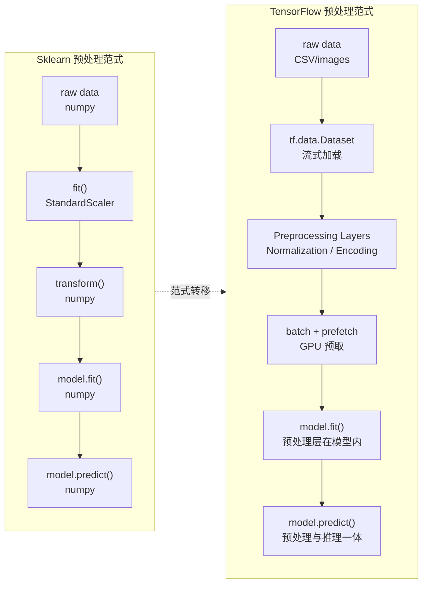

## 前置知识：预处理的范式转移

Sklearn 的预处理是**离线、独立、串行**的：先 fit scaler，再 transform 数据，再喂给模型。TensorFlow 的预处理是**在线、融合、并行**的：预处理层直接嵌入模型，数据管道流式加载，预处理在 GPU 上和训练同步进行。



> [!important] 核心差异：离线预处理 vs 在线预处理
> • **Sklearn**：预处理是独立步骤，产出 numpy 数组，再喂给模型。部署时要分别保存 Scaler 和模型，容易遗漏。
> • **TensorFlow**：预处理层嵌入模型，训练和推理时预处理自动执行，部署时预处理与模型一起导出。
>
> 这个差异意味着：TF 的模型在生产环境中不需要单独维护预处理代码——**模型自带预处理**。

---

## 一、特征缩放对比

### 1.1 StandardScaler vs Normalization 层

```python
import numpy as np
from sklearn.preprocessing import StandardScaler
import tensorflow as tf

# 准备数据
np.random.seed(42)
X_train = np.random.randn(100, 5).astype(np.float32) * 10 + 3
X_test = np.random.randn(20, 5).astype(np.float32) * 10 + 3

# ============================================
# Sklearn 方式（你熟悉的）
# ============================================
scaler = StandardScaler()
X_train_scaled = scaler.fit_transform(X_train)  # fit + transform
X_test_scaled = scaler.transform(X_test)        # 仅 transform（用训练集参数）

print("均值:", scaler.mean_)
print("标准差:", scaler.scale_)

# 保存 scaler（部署时需要）
import joblib
joblib.dump(scaler, 'scaler.pkl')

# ============================================
# TensorFlow 方式：Normalization 预处理层（推荐）
# ============================================
normalizer = tf.keras.layers.Normalization(axis=-1)
normalizer.adapt(X_train)  # ← 等价于 fit，学习 mean 和 variance

X_train_tf = normalizer(X_train).numpy()  # 调用即 transform
X_test_tf = normalizer(X_test).numpy()

print("TF 均值:", normalizer.mean.numpy())
print("TF 方差:", normalizer.variance.numpy())

# 关键区别：Normalization 层可以嵌入模型！
model = tf.keras.Sequential([
    normalizer,                                    # ← 预处理层
    tf.keras.layers.Dense(64, activation='relu'),
    tf.keras.layers.Dense(1)
])
model.compile(optimizer='adam', loss='mse')
model.fit(X_train, y_train, epochs=10)  # 训练时自动应用标准化
# model.save() 时预处理层随模型一起保存！
```

> [!tip] adapt() vs fit()
> Sklearn 的 `fit()` 收集统计量（均值、方差），`transform()` 应用缩放。TF 的 `adapt()` 做同样的事——遍历数据收集统计量。区别是 TF 的统计量存在层内，**随模型一起保存和部署**。

### 1.2 缩放方式对照表

| 缩放方式 | Sklearn | TensorFlow | 能否嵌入模型 |
|---------|---------|-----------|:---:|
| 标准化 (Z-score) | `StandardScaler` | `tf.keras.layers.Normalization` | ✅ |
| Min-Max 归一化 | `MinMaxScaler` | `tf.keras.layers.Rescaling(scale=1/255)` | ✅ |
| 最大绝对值 | `MaxAbsScaler` | 自定义：`Lambda(lambda x: x / tf.reduce_max(tf.abs(x)))` | ✅ |
| 鲁棒缩放 | `RobustScaler` | 自定义：`Lambda(lambda x: (x - median) / IQR)` | ✅ |
| 对数变换 | `FunctionTransformer(np.log1p)` | `tf.keras.layers.Lambda(lambda x: tf.math.log1p(x))` | ✅ |

> [!warning] Rescaling 层的局限
> `tf.keras.layers.Rescaling` 是固定缩放因子（如 `1/255`），不能像 `MinMaxScaler` 那样自动学习数据的 min/max。需要自适应 MinMax 时，用自定义 `Normalization` 子类或 `Lambda` 层。

---

## 二、类别编码对比

### 2.1 OneHotEncoder vs CategoryEncoding / StringLookup

```python
import numpy as np
from sklearn.preprocessing import OneHotEncoder, LabelEncoder
import tensorflow as tf

# 数据
colors = np.array(['red', 'green', 'blue', 'red', 'green']).reshape(-1, 1)

# ============================================
# Sklearn 方式
# ============================================
encoder = OneHotEncoder(sparse_output=False, handle_unknown='ignore')
encoded = encoder.fit_transform(colors)
print(encoder.categories_)  # [array(['blue', 'green', 'red'], dtype='<U5')]

# 未知类别 → 全零向量（设了 handle_unknown='ignore'）
print(encoder.transform([['unknown']]))  # [[0. 0. 0.]]

# ============================================
# TensorFlow 方式：StringLookup（一步到位）
# ============================================
lookup = tf.keras.layers.StringLookup(
    vocabulary=['red', 'green', 'blue'],
    output_mode='one_hot',
    num_oov_indices=1  # 保留 1 个 OOV 槽位
)
encoded_tf = lookup(tf.constant(['red', 'green', 'blue', 'red', 'unknown']))
print(encoded_tf.numpy())
# red   → [0. 1. 0. 0.]  （索引 1）
# green → [0. 0. 1. 0.]  （索引 2）
# blue  → [0. 0. 0. 1.]  （索引 3）
# unknown → [1. 0. 0. 0.]（OOV 索引 0）
```

> [!important] 处理未知类别的差异
> Sklearn 的 `OneHotEncoder` 遇到训练时没见过的类别会**报错**（除非设 `handle_unknown='ignore'`，此时输出全零向量）。TF 的 `StringLookup` 内置 OOV 机制，自动把未知类别映射到指定索引，无需额外配置。

### 2.2 LabelEncoder vs StringLookup / IntegerLookup

```python
# ============================================
# Sklearn：LabelEncoder（从 0 开始）
# ============================================
le = LabelEncoder()
labels_int = le.fit_transform(['cat', 'dog', 'bird', 'cat'])
print(labels_int)  # [1 2 0 1]  ← 从 0 开始，按字母序编码：bird=0, cat=1, dog=2

# ============================================
# TensorFlow：StringLookup（默认从 1 开始，0 留给 OOV）
# ============================================
string_lookup = tf.keras.layers.StringLookup(
    vocabulary=['bird', 'cat', 'dog']  # 词汇表
)
int_ids = string_lookup(tf.constant(['cat', 'dog', 'bird', 'cat']))
print(int_ids.numpy())  # [2 3 1 2]  ← 从 1 开始，0 = OOV
```

> [!warning] TF 的 StringLookup 从 1 开始计数
> TF 的 `StringLookup` 默认从 1 开始编码，0 保留给 out-of-vocabulary（OOV）词。这与 Sklearn 的 `LabelEncoder`（从 0 开始）不同。
> **解决方案**：如果需要从 0 开始，设 `num_oov_indices=0`（但会失去 OOV 检测能力）。

### 2.3 编码方式对照表

| 编码方式 | Sklearn | TensorFlow | 备注 |
|---------|---------|-----------|------|
| One-Hot | `OneHotEncoder` | `StringLookup(output_mode='one_hot')` | TF 一步到位 |
| Label | `LabelEncoder` | `StringLookup` / `IntegerLookup` | TF 从 1 开始 |
| Target | `TargetEncoder` | 需自定义 | TF 需手动实现 |
| Hash | 无内建 | `tf.keras.layers.Hashing` | TF 独有 |
| Embedding | 无内建 | `tf.keras.layers.Embedding` | TF 独有，深度学习核心 |

---

## 三、文本预处理对比

### 3.1 CountVectorizer vs TextVectorization

```python
from sklearn.feature_extraction.text import CountVectorizer
import tensorflow as tf

texts = ["hello world", "tensorflow is great", "hello tensorflow"]

# ============================================
# Sklearn：词袋模型 → 固定维度稀疏向量
# ============================================
vectorizer = CountVectorizer()
X_bow = vectorizer.fit_transform(texts)  # 稀疏矩阵
print(vectorizer.get_feature_names_out())
# ['great' 'hello' 'is' 'tensorflow' 'world']
print(X_bow.toarray())
# [[0 1 0 0 1]   hello world
#  [1 0 1 1 0]   tensorflow is great
#  [0 1 0 1 0]]  hello tensorflow

# ============================================
# TensorFlow：整数序列 → 可接 Embedding 层
# ============================================
text_vectorizer = tf.keras.layers.TextVectorization(
    max_tokens=1000,
    output_mode='int',
    output_sequence_length=10  # 固定序列长度
)
text_vectorizer.adapt(texts)
X_int = text_vectorizer(tf.constant(texts))
print(X_int.numpy())
# 每行是整数序列，可直接喂给 Embedding 层

# Embedding 层（TF 独有，Sklearn 无对应）
model = tf.keras.Sequential([
    tf.keras.Input(shape=(1,), dtype=tf.string),
    text_vectorizer,
    tf.keras.layers.Embedding(input_dim=1000, output_dim=16),
    tf.keras.layers.GlobalAveragePooling1D(),
    tf.keras.layers.Dense(1, activation='sigmoid')
])
```

> [!important] 文本处理的关键差异
> Sklearn 的文本向量化产出的是**固定维度的词袋向量**（稀疏矩阵），适合传统 ML。TF 的 `TextVectorization` 产出的是**整数序列**，适合接 `Embedding` 层做深度学习。这是深度学习 NLP 的核心范式。

---

## 四、Pipeline 对比：Sklearn Pipeline vs tf.data + Keras

### 4.1 Sklearn Pipeline（你熟悉的）

```python
from sklearn.pipeline import Pipeline
from sklearn.compose import ColumnTransformer
from sklearn.preprocessing import StandardScaler, OneHotEncoder
from sklearn.linear_model import LogisticRegression

# 数值列 + 类别列分别处理
preprocessor = ColumnTransformer([
    ('num', StandardScaler(), ['age', 'income']),
    ('cat', OneHotEncoder(handle_unknown='ignore'), ['city'])
])

pipe = Pipeline([
    ('preprocessor', preprocessor),
    ('classifier', LogisticRegression())
])

pipe.fit(X_train_df, y_train)
pred = pipe.predict(X_test_df)

# 保存：整个 Pipeline 一起保存
joblib.dump(pipe, 'pipeline.pkl')
```

### 4.2 TensorFlow：预处理层 + Functional API（多输入）

```python
import tensorflow as tf

# 数值输入
numeric_input = tf.keras.Input(shape=(2,), name='numeric')
normalizer = tf.keras.layers.Normalization()
normalizer.adapt(X_train_num)
x_num = normalizer(numeric_input)

# 类别输入
categorical_input = tf.keras.Input(shape=(1,), dtype=tf.string, name='categorical')
lookup = tf.keras.layers.StringLookup(
    vocabulary=X_train_cat_vocab,
    output_mode='one_hot'
)
x_cat = lookup(categorical_input)

# 拼接
concat = tf.keras.layers.Concatenate()([x_num, x_cat])
x = tf.keras.layers.Dense(64, activation='relu')(concat)
output = tf.keras.layers.Dense(1, activation='sigmoid')(x)

model = tf.keras.Model(inputs=[numeric_input, categorical_input], outputs=output)
model.compile(optimizer='adam', loss='binary_crossentropy', metrics=['accuracy'])

model.fit(
    {'numeric': X_train_num, 'categorical': X_train_cat},
    y_train, epochs=10, batch_size=32
)

# 保存：预处理层随模型一起保存
model.save('model_with_preprocessing.keras')
```

### 4.3 三种方式对照表

| 特性 | Sklearn Pipeline | Keras Sequential | tf.data.Dataset |
|------|:---:|:---:|:---:|
| 预处理与模型一体化 | ✅ | ✅ | ❌（外部管道） |
| 防 data leakage | ✅ | ✅ | 需手动注意 |
| 支持流式加载大文件 | ❌ | ❌ | ✅ |
| GPU 预取加速 | ❌ | ❌ | ✅ |
| 支持图片/文本加载 | ❌ | 部分 | ✅ |
| 多输入处理 | `ColumnTransformer` | Functional API | `map` + 多输入 |

> [!important] 什么时候用 tf.data？
> | 场景 | 推荐方式 |
> |------|---------|
> | 数据量 < 1GB | NumPy 数组直接 `model.fit(X, y)` |
> | 数据量 1GB-10GB | `tf.data.Dataset.from_tensor_slices` |
> | 数据量 > 10GB | `make_csv_dataset` 或 TFRecord 流式加载 |
> | 图片数据集 | `image_dataset_from_directory` |
> | 需要复杂预处理（增强、token化） | `tf.data + map` |

---

## 五、tf.data：TensorFlow 的流式数据管道（Sklearn 无对应）

`tf.data.Dataset` 是 TF 独有的高性能数据管道，Sklearn 没有等价概念——Sklearn 必须把整个数据集加载到内存。

### 5.1 基础构建与链式操作

```python
import tensorflow as tf
import numpy as np

X = np.random.randn(1000, 10).astype(np.float32)
y = np.random.randint(0, 2, 1000).astype(np.float32)

# ============================================
# tf.data.Dataset 五步操作链
# ============================================
dataset = (
    tf.data.Dataset.from_tensor_slices((X, y))     # 1. 创建数据集
    .shuffle(buffer_size=1000)                      # 2. 打乱数据
    .batch(32)                                      # 3. 分批
    .map(lambda x, y: (x * 2.0, y),               # 4. 变换（可选）
          num_parallel_calls=tf.data.AUTOTUNE)
    .prefetch(tf.data.AUTOTUNE)                     # 5. 预取（GPU 管道并行）
)

# 遍历查看
for batch_x, batch_y in dataset.take(1):
    print(f"batch_x shape: {batch_x.shape}")  # (32, 10)
    print(f"batch_y shape: {batch_y.shape}")  # (32,)
```

| 操作 | 作用 | 对应 Sklearn 类比 |
|------|------|------------------|
| `from_tensor_slices` | 从 NumPy 创建 Dataset | 传入 `X, y` 数组 |
| `.shuffle(N)` | 打乱数据，buffer_size=N | `train_test_split(shuffle=True)` |
| `.batch(32)` | 按 batch_size 分组 | Sklearn 无 batch 概念 |
| `.map(fn)` | 对每个样本应用变换 | `Pipeline` 中的 transformer |
| `.prefetch()` | 预取数据到 GPU | 无对应（Sklearn 无 GPU 概念） |
| `.cache()` | 缓存到内存/磁盘 | 无对应（Sklearn 默认全在内存） |
| `.repeat(N)` | 重复数据集 N 个 epoch | 无对应 |

### 5.2 从文件加载数据

```python
# ============================================
# 从 CSV 流式加载（Sklearn 需先全部加载到内存）
# ============================================
dataset = tf.data.experimental.make_csv_dataset(
    'data.csv',
    batch_size=32,
    label_name='target',
    num_epochs=1,
    shuffle=True,
    shuffle_buffer_size=1000
)

# ============================================
# 从图片文件夹加载
# ============================================
image_ds = tf.keras.utils.image_dataset_from_directory(
    'images/',
    image_size=(224, 224),
    batch_size=32,
    label_mode='categorical'
)
```

### 5.3 性能优化最佳实践

```python
# ============================================
# 生产级管道模板
# ============================================
dataset = (
    tf.data.Dataset.from_tensor_slices((X, y))
    .cache()                    # 缓存到内存（小数据集）
    # .cache('/path/to/cache')  # 或缓存到文件（大数据集）
    .shuffle(buffer_size=10000)
    .batch(batch_size=32)
    .map(preprocess_fn, num_parallel_calls=tf.data.AUTOTUNE)  # 并行预处理
    .prefetch(buffer_size=tf.data.AUTOTUNE)                   # 预取
)
# AUTOTUNE 让 TF 自动选择最优并行度
```

> [!tip] tf.data 的缓存策略
> | 操作 | 效果 | 适用场景 |
> |------|------|---------|
> | `.cache()` | 缓存到内存 | 数据集小（< 1GB） |
> | `.cache('/path/file')` | 缓存到文件 | 数据集中等、反复训练 |
> | 不用 cache | 每次重新加载 | 数据集大、只训练一次 |

---

## 六、训练-推理数据一致性（Sklearn 常见坑 vs TF 解决方案）

### 6.1 Sklearn 的常见陷阱

```python
# ============================================
# Sklearn：训练时忘记 transform 测试集（常见错误）
# ============================================
scaler = StandardScaler()
X_train_scaled = scaler.fit_transform(X_train)

# ❌ 错误：直接用原始测试集预测
model = LogisticRegression()
model.fit(X_train_scaled, y_train)
pred_wrong = model.predict(X_test)  # ← 测试集没缩放！

# ✅ 正确：测试集也要 transform
X_test_scaled = scaler.transform(X_test)
pred_correct = model.predict(X_test_scaled)

# 部署时的坑：
# 1. 忘记保存 scaler.pkl → 部署环境无法复现预处理
# 2. scaler.pkl 版本与模型不匹配
```

### 6.2 TensorFlow 的解决方案：预处理内嵌模型

```python
# ============================================
# TensorFlow：预处理嵌入模型，避免不一致
# ============================================
norm_layer = tf.keras.layers.Normalization()
norm_layer.adapt(X_train)

model = tf.keras.Sequential([
    norm_layer,  # ← 预处理层在模型内部
    tf.keras.layers.Dense(16, activation='relu'),
    tf.keras.layers.Dense(1, activation='sigmoid')
])
model.compile(optimizer='adam', loss='binary_crossentropy')
model.fit(X_train, y_train, epochs=10, verbose=0)

# 预测时直接喂原始数据（无需手动缩放）
pred = model.predict(X_test)  # ← 自动经过 Normalization 层

# 保存时连同预处理一起保存
model.save('model_with_preprocessing.keras')

# 部署时只需加载模型（预处理已内嵌）
loaded_model = tf.keras.models.load_model('model_with_preprocessing.keras')
pred_deploy = loaded_model.predict(X_test)  # ← 自动缩放
```

> [!tip] 核心优势：预处理随模型一起走
> TF 的 Keras Preprocessing Layers 可以嵌入模型内部，预处理逻辑随模型一起保存、一起部署。这解决了 Sklearn 常见的"忘记保存 scaler"或"scaler 版本不匹配"的坑。

---

## 七、数据增强（TF 独有，Sklearn 没有）

### 7.1 图像数据增强层

```python
import tensorflow as tf

# ============================================
# TF：Keras 数据增强层（推荐）
# ============================================
data_augmentation = tf.keras.Sequential([
    tf.keras.layers.RandomFlip('horizontal'),      # 随机水平翻转
    tf.keras.layers.RandomRotation(0.1),           # 随机旋转 ±10%
    tf.keras.layers.RandomZoom(0.1),               # 随机缩放 ±10%
    tf.keras.layers.RandomContrast(0.1),           # 随机对比度调整
])

# 嵌入模型（训练时自动增强，推理时自动跳过）
model = tf.keras.Sequential([
    data_augmentation,                              # ← 只在训练时生效
    tf.keras.layers.Rescaling(1./255),             # 归一化到 [0,1]
    tf.keras.layers.Conv2D(32, 3, activation='relu'),
    tf.keras.layers.GlobalAveragePooling2D(),
    tf.keras.layers.Dense(10, activation='softmax')
])
```

> [!important] 数据增强层只在训练时激活
> `RandomFlip`、`RandomRotation` 等层在 `model.fit()` 时自动激活，在 `model.predict()` 时自动禁用。不需要手动切换模式。

---

## 八、完整迁移示例：Sklearn Pipeline → TF 模型

```python
import numpy as np
import tensorflow as tf
from sklearn.pipeline import Pipeline
from sklearn.preprocessing import StandardScaler
from sklearn.linear_model import LogisticRegression
from sklearn.datasets import make_classification
from sklearn.model_selection import train_test_split

# 准备数据
X, y = make_classification(n_samples=1000, n_features=10, n_informative=5, random_state=42)
X_train, X_test, y_train, y_test = train_test_split(X, y, test_size=0.2, random_state=42)

# ============================================
# 原 Sklearn 代码
# ============================================
sk_pipe = Pipeline([
    ('scaler', StandardScaler()),
    ('model', LogisticRegression(max_iter=1000))
])
sk_pipe.fit(X_train, y_train)
print("Sklearn 准确率:", sk_pipe.score(X_test, y_test))

# ============================================
# TF 迁移代码
# ============================================
X_train = X_train.astype(np.float32)
X_test = X_test.astype(np.float32)

# 1. 预处理层
normalizer = tf.keras.layers.Normalization()
normalizer.adapt(X_train)

# 2. 模型（预处理层嵌入）
tf_model = tf.keras.Sequential([
    normalizer,
    tf.keras.layers.Dense(1, activation='sigmoid')  # 逻辑回归 = Dense(1, sigmoid)
])
tf_model.compile(optimizer='adam', loss='binary_crossentropy', metrics=['accuracy'])

# 3. 训练
tf_model.fit(X_train, y_train, epochs=50, batch_size=32, verbose=0)

# 4. 评估
loss, acc = tf_model.evaluate(X_test, y_test, verbose=0)
print("TF 准确率:", acc)
```

---

## 🧪 本章练习

每个练习包含：题目描述、关键提示、验收标准。建议先自己尝试 10 分钟，卡住再看折叠答案。

---

### 🟢 练习 1：Normalization 层基础（15 分钟）

**题目**：用 TF 的 `Normalization` 层标准化数据，验证结果与 `StandardScaler` 一致（误差 < 1e-5）。

```python
import numpy as np
X = np.random.randn(500, 4).astype(np.float32) * 10 + 5
```

<details>
<summary>💡 参考答案</summary>

```python
from sklearn.preprocessing import StandardScaler
import tensorflow as tf

# Sklearn
sk_scaler = StandardScaler()
X_sk = sk_scaler.fit_transform(X)

# TF
normalizer = tf.keras.layers.Normalization()
normalizer.adapt(X)
X_tf = normalizer(X).numpy()

print("均值一致:", np.allclose(sk_scaler.mean_, normalizer.mean.numpy(), atol=1e-5))
print("结果一致:", np.allclose(X_sk, X_tf, atol=1e-5))
```
</details>

**验收标准**：
- [ ] 均值和标准差一致（`atol=1e-5`）
- [ ] 理解 `adapt()` 等价于 `fit()`

---

### 🟢 练习 2：tf.data 基础管道（15 分钟）

**题目**：创建一个 `tf.data.Dataset`，完成 `shuffle → batch → prefetch` 链式操作，并用 `model.fit()` 训练。

<details>
<summary>💡 参考答案</summary>

```python
import tensorflow as tf
import numpy as np

X = np.random.randn(500, 5).astype(np.float32)
y = np.random.randint(0, 2, (500, 1)).astype(np.float32)

dataset = (
    tf.data.Dataset.from_tensor_slices((X, y))
    .shuffle(500)
    .batch(32)
    .prefetch(tf.data.AUTOTUNE)
)

model = tf.keras.Sequential([
    tf.keras.layers.Dense(16, activation='relu', input_shape=(5,)),
    tf.keras.layers.Dense(1, activation='sigmoid')
])
model.compile(optimizer='adam', loss='binary_crossentropy')
model.fit(dataset, epochs=5)
```
</details>

**验收标准**：
- [ ] 数据管道正常运行
- [ ] 训练过程无报错
- [ ] 能解释 `.prefetch(tf.data.AUTOTUNE)` 的作用

---

### 🟡 练习 3：嵌入预处理层的模型（20 分钟）

**题目**：构建一个包含 `Normalization` 层的 Keras Sequential 模型，训练后保存，重新加载后预测，验证预处理层随模型一起保存。

<details>
<summary>💡 参考答案</summary>

```python
import tensorflow as tf
import numpy as np

X_train = np.random.randn(200, 3).astype(np.float32) * 10
y_train = (X_train[:, 0] > 5).astype(np.float32)

normalizer = tf.keras.layers.Normalization()
normalizer.adapt(X_train)

model = tf.keras.Sequential([
    normalizer,
    tf.keras.layers.Dense(16, activation='relu'),
    tf.keras.layers.Dense(1, activation='sigmoid')
])
model.compile(optimizer='adam', loss='binary_crossentropy', metrics=['accuracy'])
model.fit(X_train, y_train, epochs=10, verbose=0)

# 保存
model.save('test_model.keras')

# 加载
loaded = tf.keras.models.load_model('test_model.keras')

# 验证预处理层仍在
print("预处理层均值:", loaded.layers[0].mean.numpy())
pred = loaded.predict(X_train[:5])
print("加载后预测:", pred.flatten())
```
</details>

**验收标准**：
- [ ] 保存和加载无报错
- [ ] 加载后的模型包含 Normalization 层（均值非空）
- [ ] 预测结果正常

---

### 🟡 练习 4：混合类型数据多输入模型（25 分钟）

**题目**：创建包含数值特征和类别特征的 Keras 模型，预处理层嵌入模型。

```python
X_num = np.random.randn(500, 3).astype(np.float32)
X_cat = np.random.choice(['low', 'mid', 'high'], size=(500, 1)).astype(str)
y = np.random.randint(0, 2, 500).astype(np.float32)
```

要求：
1. 数值特征用 `Normalization` 标准化
2. 类别特征用 `StringLookup` 做 one-hot
3. 用 Functional API 拼接两个输入
4. 最终输出为二分类 sigmoid

<details>
<summary>💡 参考答案</summary>

```python
import tensorflow as tf

# 预处理层
normalizer = tf.keras.layers.Normalization(axis=None)
normalizer.adapt(X_num)

encoder = tf.keras.layers.StringLookup(
    vocabulary=['low', 'mid', 'high'],
    output_mode='one_hot'
)

# 模型输入
input_num = tf.keras.Input(shape=(3,), name='numeric')
input_cat = tf.keras.Input(shape=(1,), dtype=tf.string, name='categorical')

x_num = normalizer(input_num)
x_cat = encoder(input_cat)

concat = tf.keras.layers.Concatenate()([x_num, x_cat])
output = tf.keras.layers.Dense(1, activation='sigmoid')(concat)

model = tf.keras.Model(inputs=[input_num, input_cat], outputs=output)
model.compile(optimizer='adam', loss='binary_crossentropy', metrics=['accuracy'])

model.fit(
    {'numeric': X_num, 'categorical': X_cat},
    y, epochs=10, batch_size=32, verbose=1
)
```
</details>

**验收标准**：
- [ ] 模型能正常训练（无报错）
- [ ] 能画出模型结构图（`tf.keras.utils.plot_model`）
- [ ] 理解 `model.save()` 后预处理层已包含在内

---

### 🔴 练习 5：完整迁移——Sklearn Pipeline → TF（30 分钟）

**题目**：将以下 Sklearn 代码完整迁移到 TF，要求 TF 模型准确率不低于 Sklearn - 5%。

```python
from sklearn.pipeline import Pipeline
from sklearn.preprocessing import StandardScaler
from sklearn.linear_model import LogisticRegression
from sklearn.datasets import make_classification
from sklearn.model_selection import train_test_split

X, y = make_classification(n_samples=1000, n_features=10, n_informative=5, random_state=42)
X_train, X_test, y_train, y_test = train_test_split(X, y, test_size=0.2, random_state=42)

sk_pipe = Pipeline([
    ('scaler', StandardScaler()),
    ('model', LogisticRegression())
])
sk_pipe.fit(X_train, y_train)
print("Sklearn 准确率:", sk_pipe.score(X_test, y_test))
```

<details>
<summary>💡 参考答案</summary>

```python
import tensorflow as tf

X_train = X_train.astype(np.float32)
X_test = X_test.astype(np.float32)
y_train = y_train.astype(np.float32)
y_test = y_test.astype(np.float32)

normalizer = tf.keras.layers.Normalization()
normalizer.adapt(X_train)

model = tf.keras.Sequential([
    normalizer,
    tf.keras.layers.Dense(1, activation='sigmoid')  # 逻辑回归 = Dense(1, sigmoid)
])
model.compile(optimizer='adam', loss='binary_crossentropy', metrics=['accuracy'])
model.fit(X_train, y_train, epochs=50, batch_size=32, verbose=0)

loss, acc = model.evaluate(X_test, y_test, verbose=0)
print("TF 准确率:", acc)
```
</details>

**验收标准**：
- [ ] TF 准确率 ≥ Sklearn 准确率 - 5%
- [ ] 能解释 TF 的预处理层如何替代 Sklearn Pipeline
- [ ] 能说出 `adapt()` 和 `fit()` 的调用时机区别

---

## 🎯 本文学完自检

| 层次 | 检查项 |
|------|--------|
| 🟢 基础 | 能说出 `StandardScaler` 与 `Normalization` 的 3 个关键差异；能用 `adapt()` 拟合训练集 |
| 🟡 进阶 | 能将 Sklearn 的 `StandardScaler` + `LogisticRegression` Pipeline 改写为 TF 预处理层 + Dense 一体化模型 |
| 🔴 挑战 | 能用 Functional API 构建多输入模型（数值 + 类别特征），并解释为什么 TF 的预处理一体化解决了 Sklearn 的训练-推理数据不一致问题 |

---

## ⚡ 30 秒速记卡片

| # | 正面（问题） | 背面（答案） |
|---|-------------|-------------|
| F1 | `StandardScaler` → TF？ | `tf.keras.layers.Normalization` + `adapt()` |
| F2 | `OneHotEncoder` → TF？ | `StringLookup(output_mode='one_hot')` 一步到位 |
| F3 | `LabelEncoder` → TF？ | `StringLookup`（注意从 1 开始，0 = OOV） |
| F4 | `CountVectorizer` → TF？ | `TextVectorization`，产出整数序列（非词袋） |
| F5 | `Pipeline` → TF？ | `tf.data.Dataset`（数据管道）+ Keras Preprocessing Layers（预处理层嵌入模型） |
| F6 | `ColumnTransformer` → TF？ | Functional API 多输入 + Concatenate |
| F7 | 预处理最大优势？ | 预处理层嵌入模型，随 `model.save()` 一起保存/部署 |
| F8 | `tf.data` 三大优化？ | `.cache()` / `.prefetch(AUTOTUNE)` / `num_parallel_calls` |
| F9 | 训练集 vs 测试集 Dataset？ | 训练集 `shuffle + repeat`；测试集不 shuffle |
| F10 | TF 独有的编码方式？ | `Embedding`（深度学习核心）和 `Hashing` |

---

## 相关笔记

- ⬅️ 前置：[[01-环境搭建与基础概念对比]]
- ➡️ 后续：[[03-传统ML模型迁移]]
- 🔗 关联：[[04-特征工程对比]]
- 🔗 关联：[[07-双向对比-Sklearn有TF无与TF有Sklearn无]]
- 🔗 练习：[[v1-基础回归分类迁移]] · [[v2-数据管道与特征工程]]

---
*创建时间：2026-07-25*
