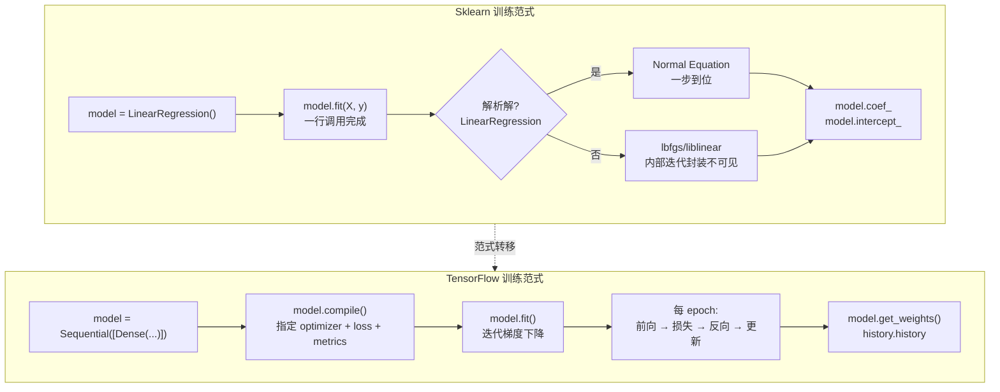

## 前置知识：从"一次性拟合"到"迭代式训练"

Sklearn 的模型使用是**无状态训练**：实例化 → `fit(X, y)` → `predict(X)`，一次性完成。TensorFlow 的模型使用是**声明式训练**：定义模型 → `compile()` 声明训练配置 → `fit()` 迭代训练 → `evaluate()` 评估。多出来的 `compile()` 是因为 TF 允许你自由指定优化器、损失函数、评估指标、回调函数。



> [!important] 核心差异：解析解 vs 迭代优化
> • **Sklearn LinearRegression**：解析解（Normal Equation $w = (X^T X)^{-1} X^T y$），一步到位，无需 `epochs`
> • **TF Dense(1)**：梯度下降，需要 `epochs` 迭代收敛
> • **Sklearn LogisticRegression**：lbfgs 优化器，内部迭代但封装不可见
> • **TF Dense(1, sigmoid)**：Adam/SGD 优化器，用户控制迭代过程
>
> 这意味着 TF 的训练**需要调参**（epochs、batch_size、learning_rate），而 Sklearn 的传统模型几乎不需要。代价是灵活性——TF 可以改损失函数、改优化器、加正则化、加自定义约束。

---

## 一、线性回归迁移：LinearRegression → Dense(1, activation=None)

### 1.1 数学等价关系

线性回归的数学模型：$\hat{y} = Xw + b$

- **Sklearn**：`LinearRegression()` 用解析解（最小二乘法）一次性求出最优 $w, b$
- **TensorFlow**：`Dense(units=1, activation=None)` 用梯度下降迭代逼近最优 $w, b$

### 1.2 完整对比代码

```python
import numpy as np
from sklearn.linear_model import LinearRegression
from sklearn.datasets import make_regression
from sklearn.model_selection import train_test_split
from sklearn.metrics import mean_squared_error
import tensorflow as tf

# 准备数据
np.random.seed(42)
X, y, true_coef = make_regression(
    n_samples=500, n_features=3,
    noise=10, random_state=42, coef=True
)
X_train, X_test, y_train, y_test = train_test_split(X, y, test_size=0.2, random_state=42)

# ============================================
# Sklearn 版本（你熟悉的）
# ============================================
sk_model = LinearRegression()
sk_model.fit(X_train, y_train)
sk_pred = sk_model.predict(X_test)
print(f"Sklearn R²: {sk_model.score(X_test, y_test):.4f}")
print(f"Sklearn 系数: {sk_model.coef_}")
print(f"Sklearn 截距: {sk_model.intercept_:.4f}")
print(f"Sklearn MSE: {mean_squared_error(y_test, sk_pred):.4f}")

# ============================================
# TensorFlow 版本 1：Keras Sequential（推荐）
# ============================================
X_train_f = X_train.astype(np.float32)
X_test_f = X_test.astype(np.float32)
y_train_f = y_train.astype(np.float32).reshape(-1, 1)
y_test_f = y_test.astype(np.float32).reshape(-1, 1)

tf_model = tf.keras.Sequential([
    tf.keras.layers.Dense(units=1, input_shape=(3,))  # 无激活函数 = 线性回归
])
tf_model.compile(
    optimizer=tf.keras.optimizers.SGD(learning_rate=0.01),
    loss='mse',
    metrics=['mae']
)

# 训练（需要多轮迭代）
history = tf_model.fit(
    X_train_f, y_train_f,
    epochs=100, batch_size=32,
    validation_split=0.2, verbose=0
)

# 评估
tf_loss, tf_mae = tf_model.evaluate(X_test_f, y_test_f, verbose=0)
weights, bias = tf_model.layers[0].get_weights()
tf_pred = tf_model.predict(X_test_f, verbose=0).flatten()
tf_r2 = 1 - np.var(y_test - tf_pred) / np.var(y_test)

print(f"\nTF R²: {tf_r2:.4f}")
print(f"TF 权重: {weights.flatten()}")
print(f"TF 偏置: {bias}")
print(f"TF MSE: {tf_loss:.4f}")

# ============================================
# 对比：结果应该非常接近
# ============================================
print(f"\n权重差异: {np.max(np.abs(sk_model.coef_ - weights.flatten())):.6f}")
```

### 1.3 逐行映射对照

| 步骤 | Sklearn | TensorFlow | 说明 |
|------|---------|-----------|------|
| 模型定义 | `LinearRegression()` | `Sequential([Dense(1)])` | 无激活 = 线性 |
| 训练 | `model.fit(X, y)` 一步 | `model.fit(X, y, epochs=100, batch_size=32)` | 需指定迭代参数 |
| 预测 | `model.predict(X)` | `model.predict(X)` | 语法一致 |
| 评估 | `model.score(X, y)` | `model.evaluate(X, y)` | 返回 [loss, metrics] |
| 参数 | `model.coef_ / intercept_` | `model.layers[0].get_weights()` | 返回 [weights, bias] |
| 训练曲线 | ❌ 无 | `history.history['loss']` | TF 独有 |

> [!tip] 为什么 TF 需要 epochs=100 而 Sklearn 一步就够？
> Sklearn 的 `LinearRegression` 用 Normal Equation 解析解 $w = (X^T X)^{-1} X^T y$，一步到位。TF 用梯度下降迭代逼近最优解。
>
> | 特性 | Sklearn 解析解 | TF 梯度下降 |
> |------|:---:|:---:|
> | 训练速度 | 一次性完成 | 需要多 epoch |
> | 大数据集 ($n > 10^5$) | $O(n \cdot d^2)$，可能慢 | $O(\text{batch\_size} \cdot d)$，可扩展 |
> | 非凸问题 | 不适用 | 可以处理 |
> | GPU 加速 | ❌ | ✅ |
> | 扩展性 | 固定 | 可叠加更多层 → MLP/CNN/RNN |
>
> **核心洞察**：TF 的线性回归是"最简单的神经网络"——它教会你 TF 的编程范式，为后续深度学习铺路。

---

## 二、逻辑回归迁移：LogisticRegression → Dense(1, activation='sigmoid')

### 2.1 数学等价关系

逻辑回归的数学模型：$\hat{y} = \sigma(Xw + b)$，其中 $\sigma(z) = \frac{1}{1 + e^{-z}}$

- **Sklearn**：`LogisticRegression()` 内部用 liblinear 或 lbfgs 求解
- **TensorFlow**：`Dense(units=1, activation='sigmoid')` + `binary_crossentropy` 损失

### 2.2 完整对比代码

```python
import numpy as np
from sklearn.linear_model import LogisticRegression
from sklearn.datasets import make_classification
from sklearn.model_selection import train_test_split
from sklearn.metrics import accuracy_score, roc_auc_score
import tensorflow as tf

# 准备数据
X, y = make_classification(
    n_samples=1000, n_features=5, n_informative=3,
    n_redundant=0, random_state=42
)
X_train, X_test, y_train, y_test = train_test_split(X, y, test_size=0.2, random_state=42)
X_train_f = X_train.astype(np.float32)
X_test_f = X_test.astype(np.float32)
y_train_f = y_train.astype(np.float32).reshape(-1, 1)
y_test_f = y_test.astype(np.float32).reshape(-1, 1)

# ============================================
# Sklearn 逻辑回归
# ============================================
sk_lr = LogisticRegression(max_iter=1000)
sk_lr.fit(X_train, y_train)
sk_acc = sk_lr.score(X_test, y_test)
sk_proba = sk_lr.predict_proba(X_test)[:, 1]
print(f"Sklearn 准确率: {sk_acc:.4f}")
print(f"Sklearn AUC: {roc_auc_score(y_test, sk_proba):.4f}")

# ============================================
# TensorFlow 逻辑回归（等价实现）
# ============================================
tf_lr = tf.keras.Sequential([
    tf.keras.layers.Dense(units=1, activation='sigmoid', input_shape=(5,))
])
tf_lr.compile(
    optimizer=tf.keras.optimizers.Adam(learning_rate=0.01),
    loss='binary_crossentropy',
    metrics=['accuracy']
)

history = tf_lr.fit(X_train_f, y_train_f, epochs=50, batch_size=32, verbose=0)
tf_loss, tf_acc = tf_lr.evaluate(X_test_f, y_test_f, verbose=0)
tf_proba = tf_lr.predict(X_test_f, verbose=0).flatten()
print(f"TF 准确率: {tf_acc:.4f}")
print(f"TF AUC: {roc_auc_score(y_test, tf_proba):.4f}")
```

### 2.3 多分类逻辑回归

```python
# ============================================
# Sklearn 多分类
# ============================================
y_multi = np.random.randint(0, 3, len(X_train))  # 长度须与 X_train 一致（800）
sk_mc = LogisticRegression(max_iter=1000, multi_class='multinomial')
sk_mc.fit(X_train, y_multi)

# ============================================
# TF 多分类（关键差异：输出层用 softmax）
# ============================================
tf_mc = tf.keras.Sequential([
    tf.keras.layers.Dense(3, activation='softmax', input_shape=(5,))
])
tf_mc.compile(
    optimizer='adam',
    loss='sparse_categorical_crossentropy',  # 整数标签
    metrics=['accuracy']
)
tf_mc.fit(X_train_f, y_multi, epochs=50, batch_size=32, verbose=0)
```

> [!warning] 标签形式决定 loss 函数
> - **`sparse_categorical_crossentropy`**：整数标签 `[0, 1, 2]`
> - **`categorical_crossentropy`**：one-hot 标签 `[[1,0,0], [0,1,0], [0,0,1]]`
> 初学者常见错误：整数标签用 `categorical_crossentropy` → 会报错或结果异常。

### 2.4 激活函数与损失函数速查

| 任务 | Sklearn | TF 激活函数 | TF 损失函数 | TF 输出层 |
|------|---------|-----------|-----------|---------|
| 线性回归 | `LinearRegression` | 无 (linear) | `'mse'` | `Dense(1)` |
| 二分类 | `LogisticRegression` | `sigmoid` | `'binary_crossentropy'` | `Dense(1, 'sigmoid')` |
| 多分类 | `LogisticRegression(multi_class='multinomial')` | `softmax` | `'sparse_categorical_crossentropy'` | `Dense(N, 'softmax')` |

### 2.5 超参数映射表

| Sklearn 参数 | TensorFlow 等价 | 说明 |
|-------------|----------------|------|
| `penalty='l2'` | `kernel_regularizer=l2(λ)` | TF 在层内指定 |
| `penalty='l1'` | `kernel_regularizer=l1(λ)` | 稀疏特征选择 |
| `penalty='elasticnet'` | `kernel_regularizer=l1_l2(l1=λ1, l2=λ2)` | ElasticNet 等价 |
| `C=1.0` | 正则化系数的倒数 | C 越大 → 正则化越弱 → `l2(1/C)` |
| `solver='lbfgs'` | `optimizer='adam'` 或 `'sgd'` | TF 没有 lbfgs |
| `max_iter=100` | `epochs=100` | 概念一致 |
| `class_weight='balanced'` | `class_weight={0: w0, 1: w1}` | 传入 `model.fit()` |
| `predict_proba()` | `model.predict()` | sigmoid 输出就是概率 |

---

## 三、正则化迁移：Ridge / Lasso / ElasticNet

### 3.1 三种正则化对比代码

```python
import tensorflow as tf
from sklearn.linear_model import Ridge, Lasso, ElasticNet

# ============================================
# Sklearn Ridge（L2 正则化）
# ============================================
sk_ridge = Ridge(alpha=0.1)
sk_ridge.fit(X_train, y_train)

# ============================================
# TF Ridge 等价：kernel_regularizer=l2(0.1)
# ============================================
tf_ridge = tf.keras.Sequential([
    tf.keras.layers.Dense(
        units=1, input_shape=(5,),
        kernel_regularizer=tf.keras.regularizers.l2(0.1)
    )
])
tf_ridge.compile(optimizer='adam', loss='mse')
tf_ridge.fit(X_train_f, y_train_f, epochs=100, verbose=0)

# ============================================
# Sklearn Lasso（L1 正则化 → 稀疏权重）
# ============================================
sk_lasso = Lasso(alpha=0.01)
sk_lasso.fit(X_train, y_train)
print("Lasso 稀疏权重比例:", (np.abs(sk_lasso.coef_) < 0.01).mean())

# ============================================
# TF Lasso 等价
# ============================================
tf_lasso = tf.keras.Sequential([
    tf.keras.layers.Dense(
        units=1, input_shape=(5,),
        kernel_regularizer=tf.keras.regularizers.l1(0.01)
    )
])
tf_lasso.compile(optimizer='adam', loss='mse')
tf_lasso.fit(X_train_f, y_train_f, epochs=100, verbose=0)
w_lasso = tf_lasso.layers[0].get_weights()[0]
print("TF Lasso 稀疏权重比例:", (np.abs(w_lasso) < 0.01).mean())

# ============================================
# ElasticNet（L1 + L2）
# ============================================
# Sklearn
sk_en = ElasticNet(alpha=0.1, l1_ratio=0.5)
sk_en.fit(X_train, y_train)

# TF
tf_en = tf.keras.Sequential([
    tf.keras.layers.Dense(
        units=1, input_shape=(5,),
        kernel_regularizer=tf.keras.regularizers.l1_l2(l1=0.05, l2=0.05)
    )
])
```

### 3.2 正则化对照表

| 正则化类型 | Sklearn | TensorFlow | 数学公式 | 效果 |
|-----------|---------|-----------|---------|------|
| L2 (Ridge) | `Ridge(alpha=λ)` | `l2(λ)` | $\lambda \sum w_i^2$ | 权重变小但不稀疏 |
| L1 (Lasso) | `Lasso(alpha=λ)` | `l1(λ)` | $\lambda \sum \|w_i\|$ | 部分权重变 0（稀疏） |
| L1+L2 (ElasticNet) | `ElasticNet(alpha, l1_ratio)` | `l1_l2(l1, l2)` | $\lambda_1 \sum\|w_i\| + \lambda_2 \sum w_i^2$ | 组合效果 |
| 偏置正则化 | — | `bias_regularizer` | TF 额外支持 | — |

> [!important] 正则化位置差异
> Sklearn 把正则化作为**模型级别**的参数（`alpha`）。TF 把正则化作为**层级别**的参数（`kernel_regularizer`），可以给不同层指定不同正则化策略。例如：第一层用 L1（特征选择），第二层用 L2（防止过拟合）。
>
> > [!tip] alpha 与 lambda 的换算
> > Sklearn 的 Ridge 损失是 $\frac{1}{2n}\|y - Xw\|^2 + \alpha \|w\|^2$，TF 的 l2 正则化在 batch loss 上加 $\lambda \sum w_i^2$。两者不完全等价，迁移时建议重新调参。

---

## 四、SGDClassifier：最佳迁移桥梁

Sklearn 的 `SGDClassifier` 是最接近 TF 训练范式的模型——两者都是"指定学习率 → 迭代更新"。

```python
# ============================================
# Sklearn SGDClassifier
# ============================================
from sklearn.linear_model import SGDClassifier
sk_sgd = SGDClassifier(
    loss='log_loss',           # 逻辑回归损失
    max_iter=100,
    learning_rate='constant',
    eta0=0.01                  # 学习率
)
sk_sgd.fit(X_train, y_train)

# ============================================
# TF 等价（几乎一一对应）
# ============================================
tf_sgd = tf.keras.Sequential([
    tf.keras.layers.Dense(1, activation='sigmoid', input_shape=(5,))
])
tf_sgd.compile(
    optimizer=tf.keras.optimizers.SGD(learning_rate=0.01),  # ← eta0
    loss='binary_crossentropy',                              # ← loss='log_loss'
    metrics=['accuracy']
)
tf_sgd.fit(X_train_f, y_train_f, epochs=100, batch_size=32, verbose=0)
```

> [!tip] 为什么 SGDClassifier 是最佳桥梁？
> 如果你在 Sklearn 中用过 `SGDClassifier`，那 TF 的训练范式对你来说就不陌生——两者都是"指定学习率 → 迭代更新"。唯一区别是 TF 用 `batch_size` 分批，而 Sklearn 的 SGDClassifier 默认逐样本更新（`partial_fit` 也支持批次）。从这里切入 TF 是最平滑的路径。

---

## 五、MLPClassifier 迁移：从 Sklearn 到 Keras Sequential

### 5.1 Sklearn MLPClassifier（你熟悉的）

```python
from sklearn.neural_network import MLPClassifier

sk_mlp = MLPClassifier(
    hidden_layer_sizes=(64, 32),  # 两个隐藏层
    activation='relu',
    solver='adam',
    alpha=0.001,                  # L2 正则化
    batch_size=32,
    max_iter=200,
    early_stopping=True,
    validation_fraction=0.1,
    random_state=42
)
sk_mlp.fit(X_train, y_train)
print("Sklearn MLP 准确率:", sk_mlp.score(X_test, y_test))
```

### 5.2 TF Keras 等价实现

```python
import tensorflow as tf
from tensorflow.keras import regularizers

tf.random.set_seed(42)  # ← random_state=42

tf_mlp = tf.keras.Sequential([
    tf.keras.layers.Dense(64, activation='relu', input_shape=(5,),
                          kernel_regularizer=regularizers.l2(0.001)),
    tf.keras.layers.Dense(32, activation='relu',
                          kernel_regularizer=regularizers.l2(0.001)),
    tf.keras.layers.Dense(1, activation='sigmoid')
])

# EarlyStopping（等价于 Sklearn 的 early_stopping=True）
early_stop = tf.keras.callbacks.EarlyStopping(
    monitor='val_loss', patience=10, restore_best_weights=True
)

tf_mlp.compile(optimizer='adam', loss='binary_crossentropy', metrics=['accuracy'])

history = tf_mlp.fit(
    X_train_f, y_train_f,
    epochs=200, batch_size=32,
    validation_split=0.1,       # ← validation_fraction=0.1
    callbacks=[early_stop],
    verbose=0
)
print(f"TF MLP 准确率: {tf_mlp.evaluate(X_test_f, y_test_f, verbose=0)[1]:.4f}")
print(f"实际训练 epoch 数: {len(history.history['loss'])}")  # 早停 < 200
```

### 5.3 MLPClassifier 参数 ↔ TF 参数完整对照表

| Sklearn MLPClassifier 参数 | TF Keras 等价 | 说明 |
|---------------------------|--------------|------|
| `hidden_layer_sizes=(64,32)` | `Dense(64) + Dense(32)` | 每个 Dense 层 = 一个隐藏层 |
| `activation='relu'` | `activation='relu'` | 一致 |
| `solver='adam'` | `optimizer='adam'` | 一致 |
| `alpha=0.001` | `kernel_regularizer=l2(0.001)` | 等价 L2 正则化 |
| `batch_size=32` | `batch_size=32` | 一致 |
| `max_iter=200` | `epochs=200` | 迭代次数 |
| `learning_rate_init=0.001` | `Adam(learning_rate=0.001)` | 自定义优化器 |
| `early_stopping=True` | `callbacks=[EarlyStopping()]` | TF 通过 callback 实现 |
| `validation_fraction=0.1` | `validation_split=0.1` | TF 在 fit() 参数中 |
| `random_state=42` | `tf.random.set_seed(42)` | 全局设置 |

> [!tip] MLP 迁移的关键差异
> 1. **初始化**：Sklearn 内部有默认初始化，TF 默认用 `glorot_uniform`（Xavier 初始化）
> 2. **Early Stopping**：Sklearn 自带参数，TF 需显式 `EarlyStopping()` callback
> 3. **训练监控**：TF 的 `history` 能记录每个 epoch 的 loss/accuracy，Sklearn 只记录最终结果
> 4. **随机种子**：Sklearn 用 `random_state` 参数，TF 需全局 `tf.random.set_seed()`

---

## 六、优化器对比

### 6.1 Sklearn 的优化器（内置、不可选）

| Sklearn 模型 | 内部优化器 | 可选？ |
|-------------|-----------|:---:|
| LinearRegression | 解析解（Normal Equation） | ❌ |
| LogisticRegression | lbfgs / liblinear / saga | ✅ 3 选 1 |
| Ridge | 最小二乘 + 正则 | ❌ |
| SGDClassifier | SGD | ✅ 学习率策略可选 |

### 6.2 TensorFlow 的优化器（自由选择）

```python
import tensorflow as tf

# SGD（等价 Sklearn SGDClassifier）
optimizer = tf.keras.optimizers.SGD(learning_rate=0.01)

# Momentum（SGD + 动量加速）
optimizer = tf.keras.optimizers.SGD(learning_rate=0.01, momentum=0.9)

# Adam（推荐默认，自适应学习率）
optimizer = tf.keras.optimizers.Adam(learning_rate=0.001)

# RMSprop（适合 RNN）
optimizer = tf.keras.optimizers.RMSprop(learning_rate=0.001)

# AdamW（Adam + 权重衰减，推荐用于 Transformer）
optimizer = tf.keras.optimizers.AdamW(learning_rate=0.001, weight_decay=0.01)
```

| 优化器 | 特点 | 对应 Sklearn | 推荐场景 |
|--------|------|-------------|---------|
| SGD | 基础梯度下降 | `SGDClassifier` | 简单模型、凸优化 |
| SGD+Momentum | 动量加速 | 无对应 | CNN |
| Adam | 自适应学习率 | 无对应 | **默认推荐** |
| RMSprop | 对梯度平方加权平均 | 无对应 | RNN |
| AdamW | Adam + 权重衰减 | 无对应 | Transformer |

> [!important] Sklearn 没有 Adam
> Sklearn 的传统 ML 模型不需要 Adam——解析解或 lbfgs 足够。Adam 是深度学习的标准优化器，因为神经网络是非凸的、参数量巨大，需要自适应学习率。**迁移建议**：TF 默认用 Adam，学习率 0.001 起步。

---

## 七、损失函数对照表

| 任务类型 | Sklearn（metrics 模块） | TF（losses 模块） | 备注 |
|---------|------------------------|-------------------|------|
| 回归 MSE | `mean_squared_error` | `'mse'` 或 `MeanSquaredError()` | 一致 |
| 回归 MAE | `mean_absolute_error` | `'mae'` 或 `MeanAbsoluteError()` | 一致 |
| 回归 Huber | 无独立函数（`SGDRegressor(loss='huber')` / `HuberRegressor`） | `Huber()` | sklearn.metrics 无 huber_loss |
| 二分类 | `log_loss` | `BinaryCrossentropy()` | 一致 |
| 多分类（整数标签） | `log_loss` | `SparseCategoricalCrossentropy()` | TF 分稀疏/密集 |
| 多分类（one-hot） | `log_loss` | `CategoricalCrossentropy()` | TF 标签需 one-hot |
| 类别不均衡 | `f1_score` / `balanced_accuracy` | `F1Score()` / `Precision()` / `Recall()` | TF 需手动组合 |

> [!tip] Sparse vs Dense 标签
> - **Sparse**：标签是整数 `[0, 1, 2]` → `SparseCategoricalCrossentropy`
> - **Dense**：标签是 one-hot `[[1,0,0], [0,1,0]]` → `CategoricalCrossentropy`
> Sklearn 不区分这两种情况，TF 区分是因为 GPU 计算优化。

---

## 八、回调函数：TF 独有的训练控制

Sklearn 的训练是"一锤子买卖"，训练过程中很难干预。TF 的 callbacks 让你可以在每个 epoch 结束时执行自定义逻辑。

```python
import tensorflow as tf

callbacks = [
    # 早停（防止过拟合）
    tf.keras.callbacks.EarlyStopping(
        monitor='val_loss',
        patience=10,
        restore_best_weights=True  # 恢复最佳权重，不是最后权重
    ),

    # 学习率衰减（验证指标不提升时降低 lr）
    tf.keras.callbacks.ReduceLROnPlateau(
        monitor='val_loss',
        factor=0.5,      # lr *= 0.5
        patience=5,
        min_lr=1e-6
    ),

    # 模型检查点（保存最佳模型）
    tf.keras.callbacks.ModelCheckpoint(
        'best_model.keras',
        monitor='val_accuracy',
        save_best_only=True,
        mode='max'
    ),

    # TensorBoard 训练可视化
    tf.keras.callbacks.TensorBoard(log_dir='./logs')
]

model.fit(X_train_f, y_train_f, epochs=100, callbacks=callbacks, validation_split=0.2)
```

> [!important] 回调函数是 TF 训练的灵魂
> | Callback | 功能 | Sklearn 对应 |
> |----------|------|-------------|
> | `EarlyStopping` | 验证指标不提升时停止训练 | `MLPClassifier(early_stopping=True)` |
> | `ReduceLROnPlateau` | 动态降低学习率 | ❌ 无 |
> | `ModelCheckpoint` | 保存最佳模型 | ❌ 无（需手动 joblib） |
> | `TensorBoard` | 训练可视化 | ❌ 无 |
> | `LearningRateScheduler` | 自定义学习率调度 | ❌ 无 |

---

## 九、模型评估指标对比

```python
# ============================================
# 方式 1：在 compile 中指定 metrics（训练时实时计算）
# ============================================
model = tf.keras.Sequential([
    tf.keras.layers.Dense(64, activation='relu', input_shape=(5,)),
    tf.keras.layers.Dense(1, activation='sigmoid')
])
model.compile(
    optimizer='adam',
    loss='binary_crossentropy',
    metrics=[
        'accuracy',
        tf.keras.metrics.Precision(name='precision'),
        tf.keras.metrics.Recall(name='recall'),
        tf.keras.metrics.AUC(name='auc')
    ]
)
model.fit(X_train_f, y_train_f, epochs=10, validation_data=(X_test_f, y_test_f))

loss, acc, prec, rec, auc = model.evaluate(X_test_f, y_test_f, verbose=0)
print(f"loss={loss:.4f}, acc={acc:.4f}, prec={prec:.4f}, rec={rec:.4f}, auc={auc:.4f}")

# ============================================
# 方式 2：用 Sklearn metrics 做最终报告（更全面）
# ============================================
y_pred = (model.predict(X_test_f, verbose=0) > 0.5).astype(int).flatten()
from sklearn.metrics import classification_report
print(classification_report(y_test, y_pred))
```

> [!tip] 推荐做法
> 训练过程中用 TF metrics（快），最终报告用 Sklearn metrics（全）。二者可以混用，不冲突——TF 的 `predict()` 返回 numpy 数组，可直接喂给 Sklearn 的 metrics 函数。

---

## 十、自定义训练循环（TF 独有，Sklearn 做不到）

当 `model.fit()` 不够灵活时（如对抗训练、元学习、自定义损失），可以用 `GradientTape` 手写训练循环。

```python
import tensorflow as tf

# 数据管道
train_ds = tf.data.Dataset.from_tensor_slices((X_train_f, y_train_f)).shuffle(1000).batch(32)
val_ds = tf.data.Dataset.from_tensor_slices((X_test_f, y_test_f)).batch(32)

# 模型
model = tf.keras.Sequential([
    tf.keras.layers.Dense(64, activation='relu', input_shape=(5,)),
    tf.keras.layers.Dense(1, activation='sigmoid')
])

# 优化器 + 损失 + 指标
optimizer = tf.keras.optimizers.Adam(learning_rate=0.001)
loss_fn = tf.keras.losses.BinaryCrossentropy()
train_acc = tf.keras.metrics.BinaryAccuracy()
val_acc = tf.keras.metrics.BinaryAccuracy()

for epoch in range(10):
    # 训练阶段
    for xb, yb in train_ds:
        with tf.GradientTape() as tape:
            y_pred = model(xb, training=True)
            loss = loss_fn(yb, y_pred)
        grads = tape.gradient(loss, model.trainable_variables)
        optimizer.apply_gradients(zip(grads, model.trainable_variables))
        train_acc.update_state(yb, y_pred)

    # 验证阶段
    for xb, yb in val_ds:
        y_pred = model(xb, training=False)
        val_acc.update_state(yb, y_pred)

    print(f"Epoch {epoch+1}: train_acc={train_acc.result():.4f}, val_acc={val_acc.result():.4f}")
    # 注意：Keras 3（TF ≥ 2.16）中 reset_states() 已改名为 reset_state()
    train_acc.reset_state()
    val_acc.reset_state()
```

### 什么时候用自定义循环？

| 场景 | 用 model.fit() | 用自定义循环 |
|------|:---:|:---:|
| 标准分类/回归 | ✅ | ❌ |
| 需要自定义损失 | ✅（compile 指定） | ✅ |
| 对抗训练（GAN） | ❌ | ✅ |
| 多模型联合训练 | ❌ | ✅ |
| Meta-learning | ❌ | ✅ |
| 打印中间梯度 | ❌ | ✅ |

> [!warning] 自定义循环的代价
> 代码量大、容易出错。**新手建议**：前两周全部用 `model.fit()` + callbacks，等理解了 TF 的训练机制后再尝试自定义循环。80% 的场景 `model.fit()` 够用。

---

## 十一、Sklearn 有但 TF 没有的模型（本章速览）

以下模型在 TF 中**没有直接等价实现**，迁移策略见 [[07-双向对比-Sklearn有TF无与TF有Sklearn无]]：

| Sklearn 模型 | TF 状态 | 建议策略 |
|-------------|---------|---------|
| `SVM (SVC/SVR)` | ❌ 无 | 用 Sklearn 做 SVM，TF 做深度学习，混合使用 |
| `KNN` | ❌ 无 | 场景简单、数据量小 → Sklearn 即可 |
| `DecisionTree` | ⚠️ TF-DF 扩展 | 需安装 `tensorflow_decision_forests` |
| `RandomForest` | ⚠️ TF-DF 扩展 | 见 [[06-集成学习与模型融合对比]] |
| `GradientBoosting` | ⚠️ TF-DF 扩展 | 见 [[06-集成学习与模型融合对比]] |
| `DBSCAN` | ❌ 无 | 聚类任务用 Sklearn 更合适 |
| `IsolationForest` | ❌ 无 | 异常检测用 Sklearn 更合适 |
| `NaiveBayes` | ❌ 无 | 文本分类小数据集用 Sklearn 更合适 |

> [!important] 正确的心态：不是"迁移"所有模型，而是"选择"合适的工具
> TF 的强项是**深度学习**（自动微分 + GPU 加速 + CNN/RNN/Transformer）。传统 ML 的 SVM、KNN、聚类等算法，用 Sklearn 更高效。**混合使用是常态**：Sklearn 做传统 ML + 特征工程，TF 做深度学习 + 模型部署。

---

## 🧪 本章练习

每个练习包含：题目描述、关键提示、验收标准。建议先自己尝试 10 分钟，卡住再看折叠答案。

---

### 🟢 练习 1：线性回归迁移（15 分钟）

**题目**：用 `make_regression` 生成数据，分别用 Sklearn `LinearRegression` 和 TF Keras 实现，对比系数和 R²。

```python
from sklearn.datasets import make_regression
X, y = make_regression(n_samples=500, n_features=3, noise=10, random_state=42)
```

<details>
<summary>💡 参考答案</summary>

```python
import numpy as np
import tensorflow as tf
from sklearn.linear_model import LinearRegression
from sklearn.model_selection import train_test_split

X_train, X_test, y_train, y_test = train_test_split(X, y, test_size=0.2, random_state=42)

# Sklearn
sk_model = LinearRegression()
sk_model.fit(X_train, y_train)
print("Sklearn R²:", sk_model.score(X_test, y_test))
print("Sklearn 系数:", sk_model.coef_)

# TF
X_train_f = X_train.astype(np.float32)
X_test_f = X_test.astype(np.float32)
y_train_f = y_train.astype(np.float32).reshape(-1, 1)
y_test_f = y_test.astype(np.float32).reshape(-1, 1)

tf_model = tf.keras.Sequential([tf.keras.layers.Dense(1, input_shape=(3,))])
tf_model.compile(optimizer=tf.keras.optimizers.SGD(0.01), loss='mse')
tf_model.fit(X_train_f, y_train_f, epochs=100, verbose=0)

w, b = tf_model.layers[0].get_weights()
tf_pred = tf_model.predict(X_test_f, verbose=0).flatten()
tf_r2 = 1 - np.var(y_test - tf_pred) / np.var(y_test)
print("TF R²:", tf_r2)
print("TF 权重:", w.flatten())
```
</details>

**验收标准**：
- [ ] 两种方法的 R² 差距 < 0.05
- [ ] TF 权重接近 Sklearn 系数
- [ ] 能解释为什么 TF 需要 `epochs=100`（梯度下降迭代 vs 解析解一步到位）

---

### 🟢 练习 2：逻辑回归迁移（15 分钟）

**题目**：将 Sklearn `LogisticRegression` 迁移到 TF Keras，分别输出准确率和 AUC，要求准确率差距 < 5%。

<details>
<summary>💡 参考答案</summary>

```python
import tensorflow as tf
from sklearn.linear_model import LogisticRegression
from sklearn.datasets import make_classification
from sklearn.model_selection import train_test_split
from sklearn.metrics import accuracy_score, roc_auc_score

X, y = make_classification(n_samples=1000, n_features=10, random_state=42)
X_train, X_test, y_train, y_test = train_test_split(X, y, test_size=0.2, random_state=42)

# Sklearn
sk_clf = LogisticRegression(max_iter=1000)
sk_clf.fit(X_train, y_train)
print("Sklearn acc:", sk_clf.score(X_test, y_test))
print("Sklearn AUC:", roc_auc_score(y_test, sk_clf.predict_proba(X_test)[:, 1]))

# TF
X_train_f = X_train.astype(np.float32)
X_test_f = X_test.astype(np.float32)

tf_clf = tf.keras.Sequential([
    tf.keras.layers.Dense(1, activation='sigmoid', input_shape=(10,))
])
tf_clf.compile(optimizer='adam', loss='binary_crossentropy', metrics=['accuracy'])
tf_clf.fit(X_train_f, y_train, epochs=50, batch_size=32, verbose=0)
_, acc = tf_clf.evaluate(X_test_f, y_test, verbose=0)
tf_proba = tf_clf.predict(X_test_f, verbose=0).flatten()
print("TF acc:", acc)
print("TF AUC:", roc_auc_score(y_test, tf_proba))
```
</details>

**验收标准**：
- [ ] TF 准确率 ≥ Sklearn 准确率 - 5%
- [ ] 能解释 `epochs` 与 `max_iter` 的对应关系

---

### 🟡 练习 3：Ridge 与 Lasso 迁移（20 分钟）

**题目**：对比 Sklearn 和 TF 在 Ridge/Lasso 上的正则化效果，验证 L1 产生稀疏权重。

<details>
<summary>💡 参考答案</summary>

```python
import numpy as np
import tensorflow as tf
from sklearn.linear_model import Ridge, Lasso

# Sklearn Lasso
lasso_sk = Lasso(alpha=0.1)
lasso_sk.fit(X_train, y_train)
print("Sklearn Lasso 稀疏权重比例:", (np.abs(lasso_sk.coef_) < 0.01).mean())

# TF Lasso
tf_lasso = tf.keras.Sequential([
    tf.keras.layers.Dense(1, input_shape=(10,),
        kernel_regularizer=tf.keras.regularizers.l1(0.01))
])
tf_lasso.compile(optimizer='adam', loss='mse')
tf_lasso.fit(X_train.astype(np.float32), y_train.astype(np.float32).reshape(-1,1),
             epochs=100, verbose=0)
w_tf = tf_lasso.layers[0].get_weights()[0]
print("TF Lasso 稀疏权重比例:", (np.abs(w_tf) < 0.01).mean())
```
</details>

**验收标准**：
- [ ] L1 正则化后权重明显比 L2 稀疏
- [ ] 能解释为什么 L1 会产生稀疏权重（L1 梯度为常数，直接将权重压到 0）

---

### 🟡 练习 4：MLPClassifier 迁移（25 分钟）

**题目**：将 Sklearn 的 `MLPClassifier(hidden_layer_sizes=(64, 32))` 迁移到 TF Keras，加入早停和学习率衰减回调。

<details>
<summary>💡 参考答案</summary>

```python
import tensorflow as tf
from tensorflow.keras import regularizers

tf.random.set_seed(42)

model = tf.keras.Sequential([
    tf.keras.layers.Dense(64, activation='relu', input_shape=(10,),
                          kernel_regularizer=regularizers.l2(0.001)),
    tf.keras.layers.Dense(32, activation='relu',
                          kernel_regularizer=regularizers.l2(0.001)),
    tf.keras.layers.Dense(1, activation='sigmoid')
])
model.compile(optimizer='adam', loss='binary_crossentropy', metrics=['accuracy'])

callbacks = [
    tf.keras.callbacks.EarlyStopping(monitor='val_loss', patience=10,
                                      restore_best_weights=True),
    tf.keras.callbacks.ReduceLROnPlateau(monitor='val_loss', factor=0.5, patience=5)
]

history = model.fit(X_train_f, y_train, epochs=200, validation_split=0.1,
                    callbacks=callbacks, verbose=0)
print(f"TF MLP acc: {model.evaluate(X_test_f, y_test, verbose=0)[1]:.4f}")
print(f"实际训练 epoch 数: {len(history.history['loss'])}")
```
</details>

**验收标准**：
- [ ] 模型训练正常，无报错
- [ ] `EarlyStopping` 在某 epoch 后停止训练（实际 epoch < 200）
- [ ] 能解释 `restore_best_weights=True` 的作用（恢复最佳权重，不是最后权重）

---

### 🔴 练习 5：自定义训练循环实现逻辑回归（30 分钟）

**题目**：不调用 `model.fit()`，用 `GradientTape` 从头实现逻辑回归训练，输出训练过程的损失曲线。

<details>
<summary>💡 参考答案</summary>

```python
import tensorflow as tf
import numpy as np
import matplotlib.pyplot as plt

X_train_f = X_train.astype(np.float32)
y_train_f = y_train.astype(np.float32).reshape(-1, 1)

w = tf.Variable(tf.random.normal((10, 1)))
b = tf.Variable(tf.zeros((1,)))
optimizer = tf.keras.optimizers.Adam(learning_rate=0.01)

losses = []
for epoch in range(100):
    with tf.GradientTape() as tape:
        z = tf.matmul(X_train_f, w) + b
        # 使用 logits 形式更稳定
        loss = tf.reduce_mean(
            tf.nn.sigmoid_cross_entropy_with_logits(labels=y_train_f, logits=z)
        )
    grads = tape.gradient(loss, [w, b])
    optimizer.apply_gradients(zip(grads, [w, b]))
    losses.append(loss.numpy())
    if epoch % 10 == 0:
        print(f"Epoch {epoch}: loss={loss.numpy():.4f}")

plt.plot(losses)
plt.title("Training Loss")
plt.xlabel("Epoch")
plt.ylabel("Loss")
plt.show()
```
</details>

**验收标准**：
- [ ] 损失随 epoch 下降
- [ ] 能解释 `GradientTape` 在其中的作用（自动微分，计算 loss 对 w/b 的梯度）
- [ ] 能解释为什么用 `sigmoid_cross_entropy_with_logits` 而不是先 sigmoid 再 cross_entropy（数值稳定性更好）

---

## 🎯 本文学完自检

| 层次 | 检查项 |
|------|--------|
| 🟢 基础 | 能写出 TF 的线性/逻辑回归代码；知道 `Dense(1, activation='sigmoid')` 对应逻辑回归 |
| 🟡 进阶 | 能正确配置 L1/L2 正则化；能使用 EarlyStopping / ReduceLROnPlateau / ModelCheckpoint 回调 |
| 🔴 挑战 | 能不依赖 `model.fit()`，用 `GradientTape` 自定义训练循环 |

---

## ⚡ 30 秒速记卡片

| # | 正面（问题） | 背面（答案） |
|---|-------------|-------------|
| F1 | `LinearRegression` → TF？ | `Dense(1, activation=None)` + `loss='mse'` |
| F2 | `LogisticRegression` → TF？ | `Dense(1, activation='sigmoid')` + `loss='binary_crossentropy'` |
| F3 | `Ridge` → TF？ | `kernel_regularizer=l2(λ)` |
| F4 | `Lasso` → TF？ | `kernel_regularizer=l1(λ)` |
| F5 | `MLPClassifier` → TF？ | `Sequential([Dense(64, relu), Dense(32, relu), Dense(1, sigmoid)])` |
| F6 | `max_iter` → TF？ | `epochs` |
| F7 | `validation_fraction` → TF？ | `validation_split` |
| F8 | `predict(X)` → TF？ | `model.predict(X)` |
| F9 | `score(X, y)` → TF？ | `model.evaluate(X, y)` |
| F10 | 早停怎么写？ | `EarlyStopping(monitor='val_loss', patience=10, restore_best_weights=True)` |
| F11 | `GradientTape` 用途？ | 自动微分，自定义训练循环 |
| F12 | 多分类用哪个 loss？ | `sparse_categorical_crossentropy`（整数标签）/ `categorical_crossentropy`（one-hot） |

---

## 相关笔记

- ⬅️ 前置：[[02-数据预处理与Pipeline对比]]
- ➡️ 后续：[[04-特征工程对比]]
- 🔗 关联：[[05-模型评估与调优对比]]
- 🔗 关联：[[07-双向对比-Sklearn有TF无与TF有Sklearn无]]
- 🔗 练习：[[v1-基础回归分类迁移]]

---
*创建时间：2026-07-25*
