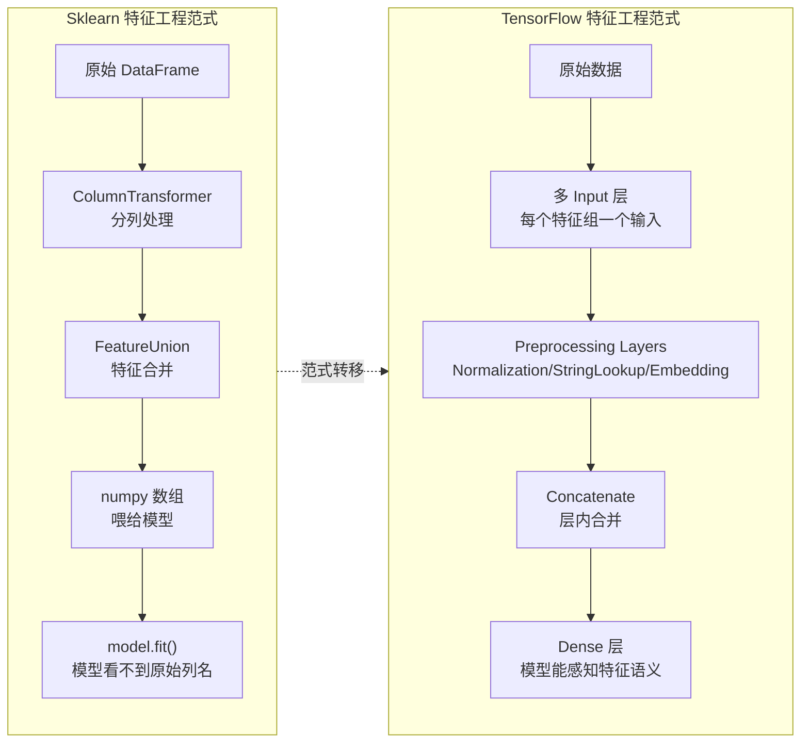
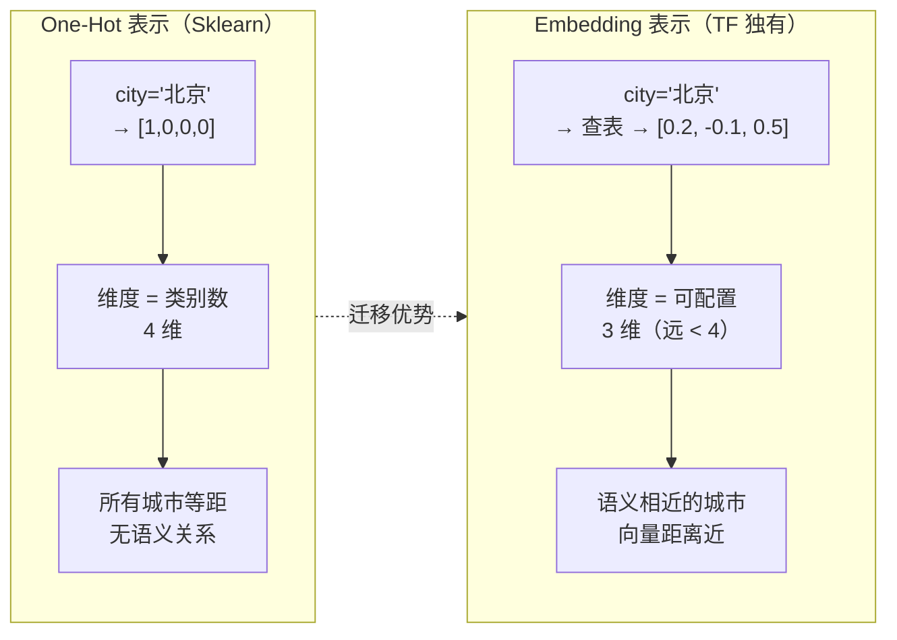
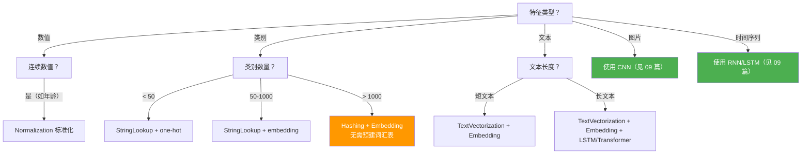

## 前置知识：特征工程的范式转移

Sklearn 的特征工程是**离线、独立、基于列**的：用 `ColumnTransformer` 分别处理数值列和类别列，输出 numpy 数组，再喂给模型。TensorFlow 的特征工程是**在线、融合、基于层**的：预处理层直接嵌入模型，多输入通过 Functional API 拼接，特征表示可以用 `Embedding` 层学习。



> [!important] 核心差异：基于列 vs 基于层
> • **Sklearn**：`ColumnTransformer` 按列名分组，每组用不同 transformer，输出合并的 numpy 数组。模型只看到数值，不知道特征语义。
> • **TensorFlow**：每个特征组是一个 `Input` 层，各自接预处理层，用 `Concatenate` 合并后送入 Dense。模型能感知特征来源，还可以用 `Embedding` 层学习类别特征的稠密表示——这是 Sklearn 做不到的。

---

## 一、ColumnTransformer 迁移：多列分别处理

### 1.1 Sklearn ColumnTransformer（你熟悉的）

```python
import numpy as np
import pandas as pd
from sklearn.compose import ColumnTransformer
from sklearn.preprocessing import StandardScaler, OneHotEncoder
from sklearn.pipeline import Pipeline
from sklearn.linear_model import LogisticRegression

# 示例数据
np.random.seed(42)
n = 1000
df = pd.DataFrame({
    'age': np.random.randint(18, 70, n),
    'income': np.random.exponential(50000, n),
    'city': np.random.choice(['北京', '上海', '广州', '深圳'], n),
    'device': np.random.choice(['iOS', 'Android', 'Web'], n),
    'clicked': np.random.randint(0, 2, n)
})

# 列分组
numeric_features = ['age', 'income']
categorical_features = ['city', 'device']

# ColumnTransformer 分列处理
preprocessor = ColumnTransformer([
    ('num', StandardScaler(), numeric_features),
    ('cat', OneHotEncoder(handle_unknown='ignore'), categorical_features)
])

# 完整 Pipeline
pipe = Pipeline([
    ('preprocessor', preprocessor),
    ('classifier', LogisticRegression(max_iter=1000))
])

X = df[['age', 'income', 'city', 'device']]
y = df['clicked']
pipe.fit(X, y)
print("Sklearn 处理后特征数:", pipe.named_steps['preprocessor'].transform(X).shape[1])
```

### 1.2 TensorFlow Functional API 等价实现

```python
import tensorflow as tf

# --- 数值输入 ---
input_num = tf.keras.Input(shape=(len(numeric_features),), name='numeric')
normalizer = tf.keras.layers.Normalization()
normalizer.adapt(df[numeric_features].values.astype(np.float32))
x_num = normalizer(input_num)

# --- 类别输入（每个类别列独立输入，便于分别 Embedding） ---
# city
input_city = tf.keras.Input(shape=(1,), dtype=tf.string, name='city')
city_lookup = tf.keras.layers.StringLookup(
    vocabulary=df['city'].unique(),
    output_mode='one_hot'
)
x_city = city_lookup(input_city)

# device
input_device = tf.keras.Input(shape=(1,), dtype=tf.string, name='device')
device_lookup = tf.keras.layers.StringLookup(
    vocabulary=df['device'].unique(),
    output_mode='one_hot'
)
x_device = device_lookup(input_device)

# --- 拼接所有特征 ---
concat = tf.keras.layers.Concatenate()([x_num, x_city, x_device])

# --- Dense 层 ---
x = tf.keras.layers.Dense(32, activation='relu')(concat)
output = tf.keras.layers.Dense(1, activation='sigmoid')(x)

# --- 构建模型 ---
model = tf.keras.Model(
    inputs=[input_num, input_city, input_device],
    outputs=output
)
model.compile(optimizer='adam', loss='binary_crossentropy', metrics=['accuracy'])

# 训练
model.fit(
    {
        'numeric': df[numeric_features].values.astype(np.float32),
        'city': df[['city']].values,
        'device': df[['device']].values
    },
    df['clicked'].values,
    epochs=10, batch_size=32, verbose=1
)
```

### 1.3 对照表

| 特性 | Sklearn `ColumnTransformer` | TF Functional API |
|------|:---:|:---:|
| 分列处理 | ✅ 按列名分组 | ✅ 每个 Input 对应一组特征 |
| 预处理与模型一体 | ❌ 需 Pipeline 组合 | ✅ 预处理层在模型内 |
| 部署时保存 | 需分别保存 transformer 和模型 | `model.save()` 一体保存 |
| 类别特征表示 | One-Hot（固定维度） | One-Hot **或 Embedding**（可学习） |
| 特征语义 | 模型看不到原始列名 | 模型通过 Input name 感知来源 |
| 灵活性 | 固定 transformer 组合 | 任意层组合，可加自定义层 |

> [!tip] 什么时候用 Functional API 而不是 Sequential？
> 当有多种不同类型的特征（数值 + 类别 + 文本），需要分别预处理再合并时，用 Functional API。如果只有同质特征（全是数值），Sequential + Normalization 足够。

---

## 二、类别特征的高级表示：Embedding 层（TF 独有）

### 2.1 为什么 Embedding 比 One-Hot 好？



```python
import tensorflow as tf

# ============================================
# One-Hot 方式（Sklearn 思维）
# ============================================
# city 有 4 个类别 → 4 维向量
city_lookup_oh = tf.keras.layers.StringLookup(
    vocabulary=['北京', '上海', '广州', '深圳'],
    output_mode='one_hot'
)
# '北京' → [0, 1, 0, 0, 0]  （5 维，含 OOV）

# ============================================
# Embedding 方式（TF 推荐，类别多时优势明显）
# ============================================
# 步骤 1：StringLookup 输出整数 ID
city_lookup_int = tf.keras.layers.StringLookup(
    vocabulary=['北京', '上海', '广州', '深圳'],
    output_mode='int'  # ← 输出整数 ID
)
# '北京' → 2

# 步骤 2：Embedding 层将整数 ID 映射为低维稠密向量
embedding_layer = tf.keras.layers.Embedding(
    input_dim=len(city_lookup_int.get_vocabulary()),  # 5（含 OOV）
    output_dim=3  # ← 3 维向量（远 < one-hot 的 5 维）
)
# '北京' → [0.21, -0.14, 0.57]  （可学习的稠密向量）

# 嵌入模型
input_city = tf.keras.Input(shape=(1,), dtype=tf.string, name='city')
x = city_lookup_int(input_city)           # string → int
x = embedding_layer(x)                    # int → dense vector
x = tf.keras.layers.Flatten()(x)          # 展平
output = tf.keras.layers.Dense(1, activation='sigmoid')(x)

model = tf.keras.Model(inputs=input_city, outputs=output)
```

### 2.2 Embedding vs One-Hot 对照

| 特性 | One-Hot（Sklearn） | Embedding（TF） |
|------|:---:|:---:|
| 输出维度 | = 类别数 N | 可配置（通常 $\sqrt[4]{N}$ 或 8-256） |
| 语义 | 所有类别等距 | 语义相近 → 向量距离近 |
| 可学习 | ❌ 固定 | ✅ 随模型训练优化 |
| 稀疏性 | 极稀疏 | 稠密 |
| 适用类别数 | < 50 | > 50 时优势明显 |
| 推荐场景 | 传统 ML | 深度学习 NLP/推荐系统 |

> [!important] Embedding 是深度学习的核心创新
> Sklearn 的 `OneHotEncoder` 只做机械映射。TF 的 `Embedding` 层是一个**可学习层**，向量在训练中不断调整，让语义相近的类别在向量空间中距离也相近。这是 NLP（Word2Vec、BERT）和推荐系统的基石。

> [!tip] Embedding 维度经验法则
> • 类别数 < 50：用 One-Hot（简单够用）
> • 类别数 50-10000：Embedding 维度 8-64
> • 类别数 > 10000（词汇表）：Embedding 维度 64-300
> • 经验公式：$d = \min(50, \sqrt[4]{N})$，N 为类别数

### 2.3 实战：文本分类用 Embedding

```python
import tensorflow as tf
import numpy as np

# 文本数据
texts = ["good movie", "bad film", "great story", "terrible acting"]
labels = np.array([1, 0, 1, 0])

# 文本向量化
vectorizer = tf.keras.layers.TextVectorization(
    max_tokens=100, output_sequence_length=10
)
vectorizer.adapt(texts)

# 模型：TextVectorization → Embedding → LSTM → Dense
model = tf.keras.Sequential([
    tf.keras.Input(shape=(1,), dtype=tf.string),
    vectorizer,
    tf.keras.layers.Embedding(input_dim=100, output_dim=16),  # ← Embedding 层
    tf.keras.layers.LSTM(32),
    tf.keras.layers.Dense(1, activation='sigmoid')
])
model.compile(optimizer='adam', loss='binary_crossentropy', metrics=['accuracy'])
model.fit(np.array(texts), labels, epochs=50, verbose=0)
print(f"训练准确率: {model.evaluate(np.array(texts), labels, verbose=0)[1]:.4f}")
```

> [!important] Embedding 是深度学习 NLP/推荐系统的基石
> - **NLP**：词嵌入（Word Embedding）把每个词映射为稠密向量，捕捉语义关系
> - **推荐系统**：用户/物品嵌入（User/Item Embedding）捕捉协同过滤关系
> - **传统 ML 无法做到**：Sklearn 的 OneHotEncoder 产出稀疏向量，无法学习类别间关系

---

## 三、FunctionTransformer → Lambda 层

### 3.1 自定义变换对比

```python
import numpy as np
from sklearn.preprocessing import FunctionTransformer
import tensorflow as tf

X = np.array([1.0, 10.0, 100.0, 1000.0])

# ============================================
# Sklearn：log 变换
# ============================================
log_transformer = FunctionTransformer(np.log1p)
X_log_sk = log_transformer.fit_transform(X.reshape(-1, 1))
print("Sklearn log1p:", X_log_sk.flatten())

# ============================================
# TF：Lambda 层
# ============================================
log_layer = tf.keras.layers.Lambda(lambda x: tf.math.log1p(x))
X_tf = tf.constant(X, dtype=tf.float32)
X_log_tf = log_layer(X_tf)
print("TF log1p:", X_log_tf.numpy())

# 嵌入模型
model = tf.keras.Sequential([
    tf.keras.layers.Lambda(lambda x: tf.math.log1p(x), input_shape=(5,)),
    tf.keras.layers.Dense(64, activation='relu'),
    tf.keras.layers.Dense(1)
])
```

### 3.2 自定义 Layer（推荐，可序列化）

```python
class LogTransform(tf.keras.layers.Layer):
    def __init__(self, **kwargs):
        super().__init__(**kwargs)

    def call(self, inputs):
        return tf.math.log1p(inputs)

    def get_config(self):
        return super().get_config()

# 现在 model.save() 可以正确序列化
model = tf.keras.Sequential([
    LogTransform(),
    tf.keras.layers.Dense(64, activation='relu'),
    tf.keras.layers.Dense(1)
])
```

> [!warning] Lambda 层的坑：不能保存模型
> `Lambda` 层用 Python lambda 函数，`model.save()` 可能无法序列化。**解决方案**：
> 1. 简单变换用 Lambda（快速原型）
> 2. 复杂变换定义为 `tf.keras.layers.Layer` 子类（可保存，可调参）
> 3. 生产环境一律用自定义层

---

## 四、PolynomialFeatures → 自定义交互层

### 4.1 多项式特征对比

```python
from sklearn.preprocessing import PolynomialFeatures
import tensorflow as tf

X = np.array([[1.0, 2.0], [3.0, 4.0], [5.0, 6.0]])

# ============================================
# Sklearn：自动生成 2 阶多项式
# ============================================
poly = PolynomialFeatures(degree=2, include_bias=False)
X_poly_sk = poly.fit_transform(X)
# [[1. 2. 1. 2. 4.]
#  [3. 4. 9. 12. 16.]
#  [5. 6. 25. 30. 36.]]

# ============================================
# TF：自定义层生成多项式
# ============================================
class PolynomialFeatures(tf.keras.layers.Layer):
    def __init__(self, degree=2, **kwargs):
        super().__init__(**kwargs)
        self.degree = degree

    def call(self, inputs):
        features = [inputs]
        if self.degree >= 2:
            features.append(inputs ** 2)
            n_features = inputs.shape[-1]
            for i in range(n_features):
                for j in range(i+1, n_features):
                    features.append(
                        tf.expand_dims(inputs[:, i] * inputs[:, j], axis=1)
                    )
        return tf.concat(features, axis=-1)

    def get_config(self):
        config = super().get_config()
        config.update({'degree': self.degree})
        return config

poly_layer = PolynomialFeatures(degree=2)
X_poly_tf = poly_layer(X.astype(np.float32))
print(X_poly_tf.numpy())
```

> [!tip] 多项式特征的替代方案
> 在深度学习中，多项式特征往往不需要——**隐藏层本身就能学习非线性关系**。如果你用 DNN 模型，通常不需要多项式特征。多项式特征更适合线性模型（如线性回归），用自定义层实现。

---

## 五、FeatureHasher → Hashing 层

### 5.1 特征哈希对比

```python
from sklearn.feature_extraction import FeatureHasher
import tensorflow as tf

# ============================================
# Sklearn FeatureHasher
# ============================================
# 字典输入用默认 input_type='dict'（value 作为权重参与哈希累加）
hasher = FeatureHasher(n_features=100)
hashed = hasher.transform([{'北京': 1, '上海': 2}])

# 若 input_type='string'，输入应为字符串迭代（如 [['北京', '上海']]），
# 只统计出现次数——传字典会导致权重丢失/解析异常，勿混用

# ============================================
# TensorFlow Hashing 层
# ============================================
hashing = tf.keras.layers.Hashing(num_bins=100)
hashed = hashing(tf.constant(['北京', '上海', '广州']))
# → [34, 72, 18]  （哈希到 0-99 的整数 ID）

# 配合 Embedding 使用
model = tf.keras.Sequential([
    tf.keras.layers.Hashing(num_bins=100),
    tf.keras.layers.Embedding(input_dim=100, output_dim=8),
    tf.keras.layers.GlobalAveragePooling1D(),
    tf.keras.layers.Dense(1, activation='sigmoid')
])
```

| 特性 | Sklearn `FeatureHasher` | TF `Hashing` 层 |
|------|:---:|:---:|
| 输入类型 | 字典/列表 | 字符串/整数张量 |
| 输出 | 稀疏矩阵 | 整数 ID 张量 |
| 哈希冲突 | 可能 | 可能 |
| 配合 Embedding | ❌ 不支持 | ✅ 无缝衔接 |
| 适用场景 | 传统 ML + 稀疏特征 | 深度学习 + 高基数类别 |

> [!tip] 哈希法的核心优势
> 无需预建词汇表，内存固定（`num_bins` 决定），适合类别数极多且无法穷举的场景（如用户 ID、URL、标签）。代价是哈希冲突——不同类别可能映射到同一桶。

---

## 六、FeatureUnion → 多输入 Concatenate

### 6.1 多路并行处理

```python
from sklearn.pipeline import FeatureUnion
from sklearn.preprocessing import StandardScaler, PolynomialFeatures

# ============================================
# Sklearn：多路并行特征工程
# ============================================
combined = FeatureUnion([
    ('standard', StandardScaler()),
    ('polynomial', Pipeline([
        ('poly', PolynomialFeatures(degree=2, include_bias=False)),
        ('scaler', StandardScaler())
    ]))
])
X_combined = combined.fit_transform(X_train)

# ============================================
# TF：Functional API 分支
# 注意：Normalization 是"有状态"预处理层，必须先 adapt(训练数据)
# 再接入分支，否则均值/方差为默认值，不起标准化作用
# ============================================
inputs = tf.keras.Input(shape=(2,))

# 分支 1：标准化（先 adapt 训练数据，再接入模型）
norm1 = tf.keras.layers.Normalization()
norm1.adapt(X_train)                     # ← 等价 StandardScaler().fit(X_train)
branch1 = norm1(inputs)

# 分支 2：多项式 + 标准化
poly_fn = lambda x: tf.concat([x, x[:, 0:1]**2, x[:, 1:2]**2], axis=1)
norm2 = tf.keras.layers.Normalization()
norm2.adapt(poly_fn(X_train))            # ← 对多项式扩展后的特征 adapt
branch2 = tf.keras.layers.Lambda(poly_fn)(inputs)
branch2 = norm2(branch2)

# 融合
concat = tf.keras.layers.Concatenate()([branch1, branch2])

# 后续层
x = tf.keras.layers.Dense(32, activation='relu')(concat)
output = tf.keras.layers.Dense(1)(x)

model = tf.keras.Model(inputs=inputs, outputs=output)
```

> [!tip] FeatureUnion 的 TF 模式
> 任何 Sklearn FeatureUnion 的多路特征处理，在 TF 中用 Functional API 的多分支 + Concatenate 实现。这比 Sklearn 更灵活——分支可以包含可训练层（如 Embedding），实现端到端学习。

---

## 七、tf.feature_column：TensorFlow 的 ColumnTransformer 风格（已不推荐）

`tf.feature_column` 是 TF 1.x 时代的配置式 API，类似 Sklearn ColumnTransformer。在 TF 2.x 中已被 Keras Preprocessing Layers 取代。

### 7.1 feature_column 类型速查

| feature_column 类型 | 说明 | 对应 Sklearn |
|--------------------|------|-------------|
| `numeric_column` | 数值特征 | `StandardScaler` 的输入 |
| `bucketized_column` | 数值分桶（离散化） | `KBinsDiscretizer` |
| `categorical_column_with_vocabulary_list` | 已知词汇表 | `OneHotEncoder` |
| `categorical_column_with_hash_bucket` | 哈希分桶 | `FeatureHasher` |
| `crossed_column` | 特征交叉 | `PolynomialFeatures` |
| `embedding_column` | 类别嵌入 | ❌ Sklearn 无 |
| `indicator_column` | one-hot 包装器 | `OneHotEncoder` 输出 |

> [!warning] tf.feature_column 已过时
> `tf.feature_column` 是 TF 1.x 时代的 API，在 TF 2.x 中虽然兼容但不推荐：
> 1. 无法与 Eager 模式良好配合
> 2. 保存/加载时容易出问题
> 3. 官方已推荐用 Keras Preprocessing Layers 替代
>
> **建议**：新项目全部用 Keras Preprocessing Layers，不要用 `tf.feature_column`。

---

## 八、特征工程决策树



---

## 九、完整迁移示例

```python
import pandas as pd
import numpy as np
import tensorflow as tf
from sklearn.compose import ColumnTransformer
from sklearn.pipeline import Pipeline
from sklearn.preprocessing import StandardScaler, OneHotEncoder
from sklearn.linear_model import LogisticRegression
from sklearn.model_selection import train_test_split

# ============================================
# 数据准备
# ============================================
np.random.seed(42)
n = 1000
df = pd.DataFrame({
    'age': np.random.randint(18, 70, n),
    'income': np.random.exponential(50000, n),
    'city': np.random.choice(['北京', '上海', '广州', '深圳'], n),
    'device': np.random.choice(['iOS', 'Android', 'Web'], n),
    'clicked': np.random.randint(0, 2, n)
})
X_train, X_test, y_train, y_test = train_test_split(
    df[['age', 'income', 'city', 'device']], df['clicked'], test_size=0.2, random_state=42
)

# ============================================
# Sklearn Pipeline
# ============================================
preprocessor = ColumnTransformer([
    ('num', StandardScaler(), ['age', 'income']),
    ('cat', OneHotEncoder(handle_unknown='ignore'), ['city', 'device'])
])
sk_pipe = Pipeline([
    ('preprocessor', preprocessor),
    ('classifier', LogisticRegression(max_iter=1000))
])
sk_pipe.fit(X_train, y_train)
print("Sklearn 准确率:", sk_pipe.score(X_test, y_test))

# ============================================
# TF Functional API 等价实现（Embedding 替代 One-Hot）
# ============================================
# 数值输入
input_num = tf.keras.Input(shape=(2,), name='numeric')
normalizer = tf.keras.layers.Normalization()
normalizer.adapt(X_train[['age', 'income']].values.astype(np.float32))
x_num = normalizer(input_num)

# city → Embedding
input_city = tf.keras.Input(shape=(1,), dtype=tf.string, name='city')
city_lookup = tf.keras.layers.StringLookup(
    vocabulary=X_train['city'].unique(), output_mode='int')
city_emb = tf.keras.layers.Embedding(len(city_lookup.get_vocabulary()), 4)
x_city = tf.keras.layers.Flatten()(city_emb(city_lookup(input_city)))

# device → Embedding
input_dev = tf.keras.Input(shape=(1,), dtype=tf.string, name='device')
dev_lookup = tf.keras.layers.StringLookup(
    vocabulary=X_train['device'].unique(), output_mode='int')
dev_emb = tf.keras.layers.Embedding(len(dev_lookup.get_vocabulary()), 4)
x_dev = tf.keras.layers.Flatten()(dev_emb(dev_lookup(input_dev)))

# 合并
concat = tf.keras.layers.Concatenate()([x_num, x_city, x_dev])
x = tf.keras.layers.Dense(16, activation='relu')(concat)
output = tf.keras.layers.Dense(1, activation='sigmoid')(x)

model = tf.keras.Model(inputs=[input_num, input_city, input_dev], outputs=output)
model.compile(optimizer='adam', loss='binary_crossentropy', metrics=['accuracy'])

# 训练
model.fit(
    {
        'numeric': X_train[['age', 'income']].values.astype(np.float32),
        'city': X_train[['city']].values,
        'device': X_train[['device']].values
    },
    y_train.values, epochs=10, batch_size=32, verbose=0
)

# 评估
loss, acc = model.evaluate(
    {
        'numeric': X_test[['age', 'income']].values.astype(np.float32),
        'city': X_test[['city']].values,
        'device': X_test[['device']].values
    },
    y_test.values, verbose=0
)
print(f"TF 准确率: {acc:.4f}")

# 保存（预处理 + Embedding 随模型一起保存）
model.save('feature_model.keras')
```

---

## 十、特征工程对照总表

| 特征工程操作 | Sklearn | TensorFlow | 差异说明 |
|-------------|---------|-----------|---------|
| 标准化 | `StandardScaler` | `Normalization` 层 | TF 嵌入模型 |
| Min-Max | `MinMaxScaler` | `Rescaling` 层 | TF 固定缩放因子 |
| One-Hot | `OneHotEncoder` | `StringLookup(one_hot)` | TF 一步到位 |
| Label | `LabelEncoder` | `StringLookup(int)` | TF 从 1 开始 |
| 多项式 | `PolynomialFeatures` | `Lambda` / 自定义层 | TF 无内置 |
| 对数变换 | `FunctionTransformer` | `Lambda` 层 / 自定义层 | TF 无内置 |
| 特征哈希 | `FeatureHasher` | `Hashing` 层 | TF 配合 Embedding |
| 多列分别处理 | `ColumnTransformer` | Functional API + Concatenate | TF 用 Input 分组 |
| 特征合并 | `FeatureUnion` | `Concatenate` 层 | TF 用层合并 |
| **稠密表示** | ❌ 无 | **`Embedding` 层** | **TF 独有，可学习** |
| 文本向量化 | `CountVectorizer` / `TfidfVectorizer` | `TextVectorization` | TF 输出序列（非词袋） |

> [!important] 迁移策略总结
> 1. **简单特征工程**（标准化、One-Hot）：直接用 TF 预处理层替代
> 2. **复杂特征工程**（多项式、自定义变换）：TF 用 Lambda 层或自定义层实现
> 3. **高基数类别**（用户 ID、URL）：TF 用 `Hashing` + `Embedding`（Sklearn 无法做到）
> 4. **混合类型**：TF 用 Functional API 多输入 + Concatenate（等价 ColumnTransformer）
> 5. **文本特征**：TF 用 `TextVectorization` + `Embedding`（深度学习范式）

---

## 🧪 本章练习

每个练习包含：题目描述、关键提示、验收标准。建议先自己尝试 10 分钟，卡住再看折叠答案。

---

### 🟢 练习 1：多输入模型基础（15 分钟）

**题目**：用 Functional API 构建一个包含数值和类别输入的模型，使用 `Normalization` 和 `StringLookup`。

```python
import numpy as np
X_num = np.random.randn(500, 3).astype(np.float32)
X_cat = np.random.choice(['A', 'B', 'C'], size=(500, 1)).astype(str)
y = np.random.randint(0, 2, 500).astype(np.float32)
```

<details>
<summary>💡 参考答案</summary>

```python
import tensorflow as tf

input_num = tf.keras.Input(shape=(3,), name='num')
normalizer = tf.keras.layers.Normalization()
normalizer.adapt(X_num)
x_num = normalizer(input_num)

input_cat = tf.keras.Input(shape=(1,), dtype=tf.string, name='cat')
lookup = tf.keras.layers.StringLookup(
    vocabulary=['A', 'B', 'C'], output_mode='one_hot'
)
x_cat = lookup(input_cat)

concat = tf.keras.layers.Concatenate()([x_num, x_cat])
output = tf.keras.layers.Dense(1, activation='sigmoid')(concat)

model = tf.keras.Model(inputs=[input_num, input_cat], outputs=output)
model.compile(optimizer='adam', loss='binary_crossentropy', metrics=['accuracy'])
model.fit({'num': X_num, 'cat': X_cat}, y, epochs=10, verbose=1)
```
</details>

**验收标准**：
- [ ] 模型训练无报错
- [ ] 能用 `model.summary()` 查看多输入结构

---

### 🟡 练习 2：Embedding vs One-Hot 对比（25 分钟）

**题目**：用同一个数据集，分别用 One-Hot 和 Embedding 表示 50 个类别，对比模型参数量。

<details>
<summary>💡 参考答案</summary>

```python
import numpy as np
import tensorflow as tf

n = 1000
X_cat = np.random.choice([f'cat_{i}' for i in range(50)], size=(n, 1)).astype(str)
y = np.random.randint(0, 2, n).astype(np.float32)

# --- One-Hot 版本 ---
input_oh = tf.keras.Input(shape=(1,), dtype=tf.string)
lookup_oh = tf.keras.layers.StringLookup(
    vocabulary=[f'cat_{i}' for i in range(50)], output_mode='one_hot'
)
x_oh = lookup_oh(input_oh)
x_oh = tf.keras.layers.Dense(16, activation='relu')(x_oh)
out_oh = tf.keras.layers.Dense(1, activation='sigmoid')(x_oh)
model_oh = tf.keras.Model(inputs=input_oh, outputs=out_oh)
model_oh.compile(optimizer='adam', loss='binary_crossentropy')
print("One-Hot 模型参数量:", model_oh.count_params())

# --- Embedding 版本 ---
input_emb = tf.keras.Input(shape=(1,), dtype=tf.string)
lookup_int = tf.keras.layers.StringLookup(
    vocabulary=[f'cat_{i}' for i in range(50)], output_mode='int'
)
x_int = lookup_int(input_emb)
x_emb = tf.keras.layers.Embedding(51, 8)(x_int)  # 8 维 Embedding
x_emb = tf.keras.layers.Flatten()(x_emb)
x_emb = tf.keras.layers.Dense(16, activation='relu')(x_emb)
out_emb = tf.keras.layers.Dense(1, activation='sigmoid')(x_emb)
model_emb = tf.keras.Model(inputs=input_emb, outputs=out_emb)
model_emb.compile(optimizer='adam', loss='binary_crossentropy')
print("Embedding 模型参数量:", model_emb.count_params())
```
</details>

**验收标准**：
- [ ] Embedding 模型参数量 < One-Hot 模型参数量
- [ ] 能解释为什么 Embedding 在高基数时更优（参数量少 + 语义可学习）

---

### 🟡 练习 3：自定义 FunctionTransformer 迁移（20 分钟）

**题目**：将以下 Sklearn 自定义转换用 TF 自定义 Layer 实现，确保可序列化。

```python
from sklearn.preprocessing import FunctionTransformer
import numpy as np

def ratio_features(X):
    return np.column_stack([X, X[:, 0] / (X[:, 1] + 1e-8)])
transformer = FunctionTransformer(ratio_features)
```

<details>
<summary>💡 参考答案</summary>

```python
class RatioFeatures(tf.keras.layers.Layer):
    def __init__(self, **kwargs):
        super().__init__(**kwargs)

    def call(self, inputs):
        ratio = inputs[:, 0:1] / (inputs[:, 1:2] + 1e-8)
        return tf.concat([inputs, ratio], axis=1)

    def get_config(self):
        return super().get_config()

# 使用（可保存）
model = tf.keras.Sequential([
    tf.keras.layers.Input(shape=(2,)),
    RatioFeatures(),
    tf.keras.layers.Dense(1)
])
```
</details>

**验收标准**：
- [ ] 自定义 Layer 能嵌入模型
- [ ] `get_config()` 实现正确，模型可序列化保存

---

### 🟡 练习 4：文本分类完整流程（30 分钟）

**题目**：用 `TextVectorization` + `Embedding` + `LSTM` 实现文本二分类，理解数据流。

<details>
<summary>💡 参考答案</summary>

```python
import tensorflow as tf
import numpy as np

texts = ["good movie", "bad film", "great story", "terrible acting"]
labels = np.array([1, 0, 1, 0])

vectorizer = tf.keras.layers.TextVectorization(
    max_tokens=100, output_sequence_length=10
)
vectorizer.adapt(texts)

model = tf.keras.Sequential([
    tf.keras.Input(shape=(1,), dtype=tf.string),
    vectorizer,
    tf.keras.layers.Embedding(input_dim=100, output_dim=16),
    tf.keras.layers.LSTM(32),
    tf.keras.layers.Dense(1, activation='sigmoid')
])
model.compile(optimizer='adam', loss='binary_crossentropy', metrics=['accuracy'])
model.fit(np.array(texts), labels, epochs=50, verbose=0)
print(f"准确率: {model.evaluate(np.array(texts), labels, verbose=0)[1]:.4f}")
```
</details>

**验收标准**：
- [ ] 模型能正常训练
- [ ] 能解释 `TextVectorization → Embedding → LSTM` 的数据流

---

### 🔴 练习 5：完整迁移——ColumnTransformer → TF 多输入模型（40 分钟）

**题目**：将以下 Sklearn 代码完整迁移到 TF，使用 Embedding 替代 One-Hot，要求 TF 准确率不低于 Sklearn - 5%。

```python
from sklearn.compose import ColumnTransformer
from sklearn.pipeline import Pipeline
from sklearn.preprocessing import StandardScaler, OneHotEncoder
from sklearn.linear_model import LogisticRegression
import pandas as pd, numpy as np

np.random.seed(42)
n = 1000
df = pd.DataFrame({
    'age': np.random.randint(18, 70, n),
    'income': np.random.exponential(50000, n),
    'city': np.random.choice(['北京', '上海', '广州', '深圳'], n),
    'device': np.random.choice(['iOS', 'Android', 'Web'], n),
    'clicked': np.random.randint(0, 2, n)
})

preprocessor = ColumnTransformer([
    ('num', StandardScaler(), ['age', 'income']),
    ('cat', OneHotEncoder(handle_unknown='ignore'), ['city', 'device'])
])
pipe = Pipeline([('preprocessor', preprocessor),
                 ('classifier', LogisticRegression(max_iter=1000))])
pipe.fit(df[['age','income','city','device']], df['clicked'])
print("Sklearn 准确率:", pipe.score(df[['age','income','city','device']], df['clicked']))
```

<details>
<summary>💡 参考答案</summary>

参见"九、完整迁移示例"章节。关键点：
1. 数值特征用 `Normalization` 层
2. 类别特征用 `StringLookup(int)` + `Embedding`
3. Functional API 多输入 + Concatenate
4. `model.save()` 后预处理层自动包含
</details>

**验收标准**：
- [ ] TF 准确率 ≥ Sklearn 准确率 - 5%
- [ ] 使用 Embedding 替代 One-Hot
- [ ] 保存后加载正常，预处理层随模型一起保存

---

## 🎯 本文学完自检

| 层次 | 检查项 |
|------|--------|
| 🟢 基础 | 能用 Functional API 构建多输入模型（数值 + 类别特征） |
| 🟡 进阶 | 能使用 Embedding 层替代 One-Hot，并解释其优势；能自定义 Layer 替代 FunctionTransformer |
| 🔴 挑战 | 能将 Sklearn 的 ColumnTransformer Pipeline 完整迁移到 TF 多输入模型 + Embedding |

---

## ⚡ 30 秒速记卡片

| # | 正面（问题） | 背面（答案） |
|---|-------------|-------------|
| F1 | `ColumnTransformer` → TF？ | Functional API 多 Input + Concatenate |
| F2 | `FunctionTransformer` → TF？ | `Lambda` 层（简单）或自定义 `Layer`（可序列化） |
| F3 | `PolynomialFeatures` → TF？ | 自定义层（深度学习通常不需要，隐藏层能学非线性） |
| F4 | `FeatureHasher` → TF？ | `Hashing` 层 |
| F5 | `FeatureUnion` → TF？ | `Concatenate` 层 |
| F6 | Embedding 是什么？ | 可训练层，把类别索引映射为稠密向量（Sklearn 无对应） |
| F7 | Embedding vs One-Hot？ | 稠密 vs 稀疏，可训练 vs 固定，可学习相似性 vs 距离相等 |
| F8 | Embedding 维度经验？ | $\min(50, \sqrt[4]{N})$，N = 类别数 |
| F9 | `tf.feature_column` 推荐吗？ | ❌ 不推荐，用 Keras Preprocessing Layers 替代 |
| F10 | 高基数类别怎么处理？ | `Hashing` + `Embedding`（无需预建词汇表） |

---

## 相关笔记

- ⬅️ 前置：[[03-传统ML模型迁移]]
- ➡️ 后续：[[05-模型评估与调优对比]]
- 🔗 关联：[[02-数据预处理与Pipeline对比]]
- 🔗 关联：[[07-双向对比-Sklearn有TF无与TF有Sklearn无]]
- 🔗 练习：[[v2-数据管道与特征工程]]

---
*创建时间：2026-07-25*
