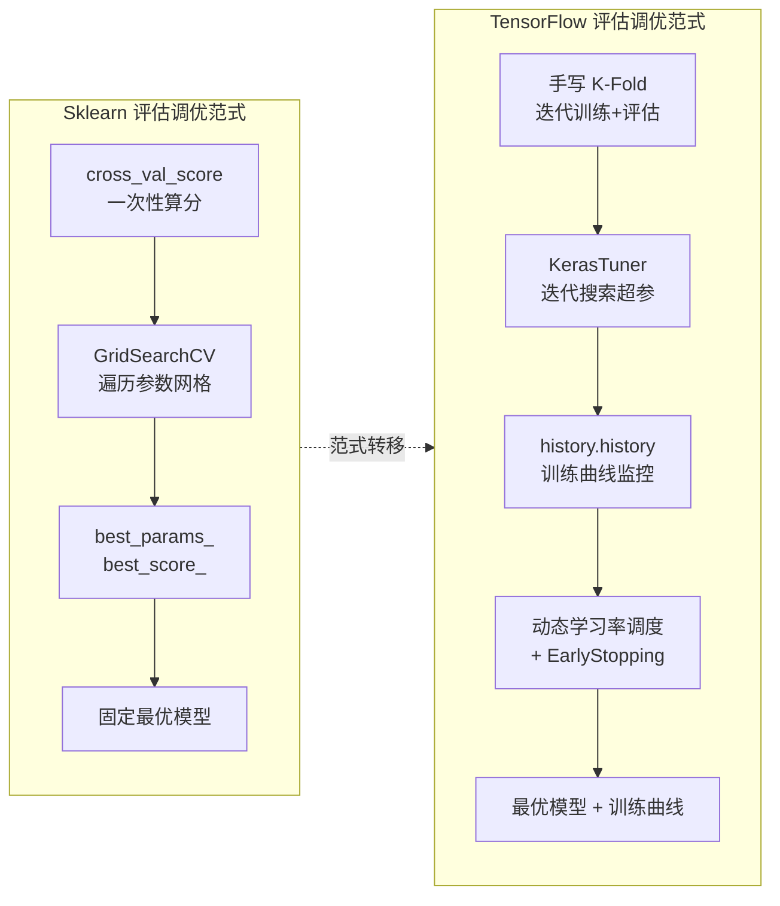
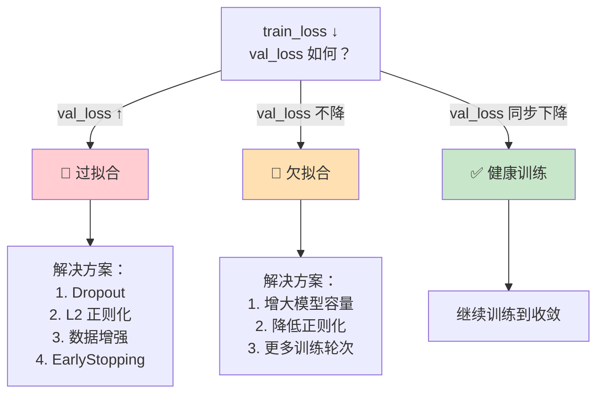

## 前置知识：评估与调优的范式转移

Sklearn 的评估与调优是**一次性、网格化、高度封装**的：`cross_val_score` 一行算出分数，`GridSearchCV` 遍历参数网格找最优。TensorFlow 的评估与调优是**迭代式、训练态、动态调度**的：交叉验证需手写 K-Fold，调优用 KerasTuner 迭代搜索，学习率在训练中动态衰减，过拟合诊断靠训练曲线。



> [!important] 核心差异：一次性搜索 vs 迭代搜索
> • **Sklearn GridSearchCV**：把所有参数组合算一遍，选最优。计算量 $O(\text{grid\_size})$，但每个点训练快（解析解/收敛快）。
> • **TF KerasTuner**：每次评估一个参数组合需要训练完整模型（几十到几百 epoch），网格搜索代价极高。因此 TF 倾向用 RandomSearch/Hyperband/Bayesian 等高效搜索策略。
> • **TF 独有**：训练过程中的学习率动态调度（`ReduceLROnPlateau` / `LearningRateScheduler`），Sklearn 没有等价功能。

---

## 一、交叉验证：cross_val_score → 手动 K-Fold

### 1.1 Hold-out 验证（两者都有）

```python
import numpy as np
from sklearn.model_selection import train_test_split
from sklearn.datasets import make_classification
import tensorflow as tf

# 数据
X, y = make_classification(n_samples=1000, n_features=10, n_informative=5, random_state=42)
X_train, X_test, y_train, y_test = train_test_split(X, y, test_size=0.2, random_state=42)

# TF 需要 float32
X_train_f = X_train.astype(np.float32)
X_test_f = X_test.astype(np.float32)
y_train_f = y_train.astype(np.float32).reshape(-1, 1)
y_test_f = y_test.astype(np.float32).reshape(-1, 1)
```

### 1.2 Sklearn cross_val_score（一行搞定）

```python
from sklearn.model_selection import cross_val_score, StratifiedKFold
from sklearn.linear_model import LogisticRegression

model = LogisticRegression(max_iter=1000)
scores = cross_val_score(model, X, y, cv=5, scoring='accuracy')
print(f"Sklearn 5-Fold: {scores.mean():.4f} ± {scores.std():.4f}")
```

### 1.3 TF 手动 K-Fold（必须掌握）

```python
from sklearn.model_selection import StratifiedKFold

def build_model(input_dim=10):
    """每 fold 重新构建模型"""
    model = tf.keras.Sequential([
        tf.keras.layers.Dense(32, activation='relu', input_shape=(input_dim,)),
        tf.keras.layers.Dense(1, activation='sigmoid')
    ])
    model.compile(optimizer='adam', loss='binary_crossentropy', metrics=['accuracy'])
    return model

skf = StratifiedKFold(n_splits=5, shuffle=True, random_state=42)
cv_scores = []

for fold, (train_idx, val_idx) in enumerate(skf.split(X_train, y_train)):
    X_tr, X_va = X_train_f[train_idx], X_train_f[val_idx]
    y_tr, y_va = y_train_f[train_idx], y_train_f[val_idx]

    # 每个 fold 重新构建模型（关键！）
    model = build_model()
    model.fit(
        X_tr, y_tr, epochs=50, batch_size=32, verbose=0,
        validation_data=(X_va, y_va),
        callbacks=[tf.keras.callbacks.EarlyStopping(
            monitor='val_loss', patience=10, restore_best_weights=True
        )]
    )
    _, score = model.evaluate(X_va, y_va, verbose=0)
    cv_scores.append(score)
    print(f"Fold {fold+1}: accuracy={score:.4f}")

print(f"\nTF 5-Fold: {np.mean(cv_scores):.4f} ± {np.std(cv_scores):.4f}")
```

### 1.4 封装为复用函数

```python
def tf_cross_val_score(model_fn, X, y, cv=5, epochs=50, batch_size=32):
    """TF 版 cross_val_score 等价封装"""
    kfold = StratifiedKFold(n_splits=cv, shuffle=True, random_state=42)
    scores = []
    for train_idx, val_idx in kfold.split(X, y):
        model = model_fn()
        model.fit(
            X[train_idx], y[train_idx], epochs=epochs, batch_size=batch_size, verbose=0,
            validation_data=(X[val_idx], y[val_idx]),
            callbacks=[tf.keras.callbacks.EarlyStopping(
                monitor='val_loss', patience=10, restore_best_weights=True)]
        )
        _, score = model.evaluate(X[val_idx], y[val_idx], verbose=0)
        scores.append(score)
    return np.array(scores)

# 使用
scores = tf_cross_val_score(build_model, X_train_f, y_train_f, cv=5)
print(f"TF 5-Fold: {scores.mean():.4f} ± {scores.std():.4f}")
```

> [!important] 为什么 TF 没有 cross_val_score？
> Sklearn 的 `cross_val_score` 对每个 fold 训练一个模型，但传统 ML 模型训练快（秒级），可以接受 5-10 倍计算开销。TF 模型训练慢（分钟到小时级），5-Fold CV 意味着 5 倍训练时间。**生产实践中 TF 常用 hold-out 验证（80/20 或 70/15/15）**，K-Fold 主要用于研究和小数据集。

> [!warning] 每个 fold 必须重置模型
> TF 模型训练后会保留权重。如果不重置模型，第二次 fold 会在第一次 fold 的权重基础上继续训练，导致交叉验证结果虚高。常见做法：在循环内调用 `build_model()` 重新创建模型。

### 1.5 交叉验证方式对照

| 方式 | Sklearn | TF 等价 | 适用场景 |
|------|---------|---------|---------|
| Hold-out | `train_test_split` | 同上（共用 Sklearn） | 大数据集 |
| K-Fold | `cross_val_score(cv=5)` | 手写循环 + `StratifiedKFold` | 小数据集 |
| 分层 K-Fold | `StratifiedKFold` | 同上 + 手写循环 | 不平衡数据 |
| 时间序列 | `TimeSeriesSplit` | 同上 + 手写循环 | 时序数据 |

---

## 二、过拟合诊断：learning_curve vs history

### 2.1 Sklearn learning_curve

```python
from sklearn.model_selection import learning_curve
import matplotlib.pyplot as plt

train_sizes, train_scores, val_scores = learning_curve(
    LogisticRegression(max_iter=1000), X, y,
    train_sizes=np.linspace(0.1, 1.0, 10), cv=5
)
plt.plot(train_sizes, train_scores.mean(axis=1), label='Train')
plt.plot(train_sizes, val_scores.mean(axis=1), label='CV')
plt.xlabel('Training samples'); plt.ylabel('Accuracy'); plt.legend()
```

### 2.2 TF history（训练曲线，每 epoch 记录）

```python
model = tf.keras.Sequential([
    tf.keras.layers.Dense(64, activation='relu', input_shape=(10,)),
    tf.keras.layers.Dense(32, activation='relu'),
    tf.keras.layers.Dense(1, activation='sigmoid')
])
model.compile(optimizer='adam', loss='binary_crossentropy', metrics=['accuracy'])

history = model.fit(X_train_f, y_train_f, epochs=100,
                     validation_split=0.2, verbose=0)

# 绘制训练曲线
fig, (ax1, ax2) = plt.subplots(1, 2, figsize=(12, 4))
ax1.plot(history.history['loss'], label='train_loss')
ax1.plot(history.history['val_loss'], label='val_loss')
ax1.set_title('Loss'); ax1.legend()
ax2.plot(history.history['accuracy'], label='train_acc')
ax2.plot(history.history['val_accuracy'], label='val_acc')
ax2.set_title('Accuracy'); ax2.legend()
plt.show()
```

### 2.3 过拟合诊断决策树



### 2.4 学习曲线对照

| 特性 | Sklearn `learning_curve` | TF `history` |
|------|:---:|:---:|
| 横轴 | 样本量 | Epoch |
| 用途 | 诊断数据量是否足够 | 诊断过拟合/欠拟合 |
| 实现 | 一行函数 | `history.history` 字典 |
| 训练过程可见 | ❌（模型一次拟合） | ✅ 每 epoch 记录 |
| 过拟合信号 | val_score 远低于 train_score | val_loss 开始上升 |
| 欠拟合信号 | train_score 和 val_score 都低 | train_loss 不下降 |

> [!important] TF 训练曲线是诊断利器
> Sklearn 的传统 ML 模型训练是一次性的（解析解或内部迭代），没有训练过程曲线。TF 的 `history` 记录了每个 epoch 的 loss 和 metric，让你能看到：
> 1. **过拟合**：train_loss↓ 但 val_loss↑ → 加正则化、Dropout、EarlyStopping
> 2. **欠拟合**：train_loss 不降 → 加层、加神经元、降低正则化
> 3. **学习率不合适**：loss 震荡 → 降学习率
> 4. **收敛太慢**：loss 下降极慢 → 升学习率或换优化器

### 2.5 过拟合对策对照表

| 策略 | Sklearn | TF |
|------|---------|-----|
| L1/L2 正则化 | `Ridge/Lasso(alpha)` | `kernel_regularizer=l1/l2(λ)` |
| 早停 | `MLPClassifier(early_stopping=True)` | `EarlyStopping(monitor='val_loss', patience=10)` |
| Dropout | ❌ 无 | `tf.keras.layers.Dropout(rate=0.5)` |
| BatchNorm | ❌ 无 | `tf.keras.layers.BatchNormalization()` |
| 数据增强 | 手动 | `RandomFlip/Rotation/Zoom` 层 |
| 减小模型 | 调 `hidden_layer_sizes` | 减少 Dense 层数/神经元数 |
| 学习率衰减 | ❌ 无 | `ReduceLROnPlateau` |

---

## 三、超参搜索：GridSearchCV → KerasTuner

### 3.1 安装

```bash
pip install keras-tuner
```

### 3.2 Sklearn GridSearchCV（你熟悉的）

```python
from sklearn.model_selection import GridSearchCV
from sklearn.ensemble import RandomForestClassifier

param_grid = {
    'n_estimators': [50, 100, 200],
    'max_depth': [3, 5, 10, None]
}
grid = GridSearchCV(RandomForestClassifier(random_state=42), param_grid, cv=5, scoring='accuracy')
grid.fit(X_train, y_train)
print(f"最优参数: {grid.best_params_}")
print(f"最优分数: {grid.best_score_:.4f}")
```

### 3.3 KerasTuner 等价实现

```python
import keras_tuner as kt
import tensorflow as tf

def build_model(hp):
    """定义超参搜索空间"""
    model = tf.keras.Sequential()
    model.add(tf.keras.layers.Input(shape=(10,)))

    # 搜索层数（1-3 层）+ 每层神经元
    for i in range(hp.Int('num_layers', 1, 3)):
        model.add(tf.keras.layers.Dense(
            units=hp.Int(f'units_{i}', min_value=32, max_value=256, step=32),
            activation='relu'
        ))
        model.add(tf.keras.layers.Dropout(
            rate=hp.Float(f'dropout_{i}', 0.0, 0.5, step=0.1)
        ))

    model.add(tf.keras.layers.Dense(1, activation='sigmoid'))

    # 搜索学习率（对数空间）
    lr = hp.Float('learning_rate', min_value=1e-4, max_value=1e-2, sampling='log')
    model.compile(
        optimizer=tf.keras.optimizers.Adam(learning_rate=lr),
        loss='binary_crossentropy',
        metrics=['accuracy']
    )
    return model

# 选择搜索策略
tuner = kt.Hyperband(
    build_model,
    objective='val_accuracy',
    max_epochs=50,
    factor=3,
    directory='kt_logs',
    project_name='classification_tuning'
)

# 搜索
tuner.search(
    X_train_f, y_train_f,
    epochs=50, validation_split=0.2,
    callbacks=[tf.keras.callbacks.EarlyStopping(patience=5, monitor='val_loss')],
    verbose=1
)

# 获取最佳超参
best_hp = tuner.get_best_hyperparameters(num_trials=1)[0]
print("最佳超参:", best_hp.values)

# 用最佳超参重新训练完整模型
best_model = tuner.hypermodel.build(best_hp)
best_model.fit(X_train_f, y_train_f, epochs=100, validation_split=0.2, verbose=0)
```

### 3.4 KerasTuner 三种搜索器

```python
# 1. RandomSearch（随机搜索，最简单）
tuner_rs = kt.RandomSearch(
    build_model, objective='val_accuracy',
    max_trials=20, directory='kt_logs', project_name='random'
)

# 2. Hyperband（自适应淘汰，推荐默认）
tuner_hb = kt.Hyperband(
    build_model, objective='val_accuracy',
    max_epochs=50, factor=3, directory='kt_logs', project_name='hyperband'
)

# 3. BayesianOptimization（贝叶斯优化，最智能）
tuner_bo = kt.BayesianOptimization(
    build_model, objective='val_accuracy',
    max_trials=20, directory='kt_logs', project_name='bayesian'
)
```

| 搜索器 | 策略 | 对应 Sklearn | 计算量 | 推荐场景 |
|--------|------|:---:|:---:|---------|
| `RandomSearch` | 随机采样 | `RandomizedSearchCV` | 中 | 快速探索 |
| `Hyperband` | 自适应提前终止 | ❌ 无 | **低（推荐）** | 大搜索空间 |
| `BayesianOptimization` | 贝叶斯建模 | ❌ 无 | 低 | 精细搜索 |

> [!important] 为什么 TF 不用 GridSearch？
> 1. **计算量爆炸**：4 个超参各 5 个值 → 625 组 × 50 epoch = 31250 epoch
> 2. **训练慢**：每组参数需训练完整模型（分钟到小时级）
> 3. **解空间大**：TF 超参更多（层数、神经元、dropout、lr、batch_size…）
> **解决方案**：用 Hyperband（自适应淘汰差劲的 trial）或 BayesianOptimization（基于历史结果智能选择下一组）

### 3.5 超参空间定义速查

| 类型 | `hp` 方法 | 对应 Sklearn | 示例 |
|------|----------|-------------|------|
| 整数 | `hp.Int('units', 32, 256, step=32)` | `np.arange(32, 257, 32)` | 32, 64, 96, ... |
| 浮点 | `hp.Float('lr', 1e-4, 1e-2, sampling='log')` | `scipy.stats.loguniform` | 学习率 |
| 选择 | `hp.Choice('act', ['relu', 'tanh'])` | `['relu', 'tanh']` | 激活函数 |
| 布尔 | `hp.Boolean('use_bn')` | `[True, False]` | 是否用 BN |
| 固定 | `hp.Fixed('units', 64)` | `64` | 不搜索 |

> [!tip] KerasTuner 使用心得
> 1. **先小范围搜索**：`max_trials=10` 初筛，再聚焦细化
> 2. **早停节省资源**：`EarlyStopping(patience=5)` 防止每个 trial 训练太久
> 3. **最佳超参要重新训练**：`tuner.search()` 只是找超参，最终模型需要 `tuner.hypermodel.build(best_hp)` 重新训练
> 4. **Hyperband 最高效**：优先用 Hyperband，比 RandomSearch 快 3-5 倍

---

## 四、学习率调度（TF 独有，Sklearn 无对应）

学习率调度是 TF 的核心调参手段，Sklearn 的传统 ML 模型完全没有这个概念——`LogisticRegression` 内部 lbfgs 优化器有自己的 line search，但用户无法控制。

### 4.1 ReduceLROnPlateau（推荐默认）

```python
# 验证损失不下降时自动降低学习率
reduce_lr = tf.keras.callbacks.ReduceLROnPlateau(
    monitor='val_loss',
    factor=0.5,      # lr *= 0.5
    patience=5,      # 5 个 epoch 无改善才降
    min_lr=1e-6,     # 最低学习率
    verbose=1
)
model.fit(X_train_f, y_train_f, epochs=100,
          validation_split=0.2, callbacks=[reduce_lr])
```

### 4.2 LearningRateScheduler（自定义调度）

```python
# 自定义学习率调度函数
def lr_scheduler(epoch, lr):
    if epoch < 10:
        return 0.001
    elif epoch < 30:
        return 0.0005
    else:
        return 0.0001

scheduler = tf.keras.callbacks.LearningRateScheduler(lr_scheduler, verbose=1)
model.fit(X_train_f, y_train_f, epochs=50, callbacks=[scheduler])
```

### 4.3 内置调度器（tf.keras.optimizers.schedules）

```python
# 余弦退火
lr_schedule = tf.keras.optimizers.schedules.CosineDecay(
    initial_learning_rate=0.001, decay_steps=1000
)

# 指数衰减
lr_schedule = tf.keras.optimizers.schedules.ExponentialDecay(
    initial_learning_rate=0.001, decay_steps=1000, decay_rate=0.96
)

# 使用
optimizer = tf.keras.optimizers.Adam(learning_rate=lr_schedule)
model.compile(optimizer=optimizer, loss='binary_crossentropy')
```

| 策略 | TF 实现 | 适用场景 | Sklearn 对应 |
|------|---------|---------|:---:|
| 阶梯衰减 | `ReduceLROnPlateau` | 通用（推荐默认） | ❌ |
| 自定义调度 | `LearningRateScheduler` | 研究级控制 | ❌ |
| 余弦退火 | `CosineDecay` | 大模型训练 | ❌ |
| 指数衰减 | `ExponentialDecay` | 深度学习标准 | ❌ |
| 分段常数 | `PiecewiseConstantDecay` | Transformer | ❌ |

> [!important] 学习率调度是 TF 的核心优势
> Sklearn 的传统 ML 模型没有学习率调度的概念——`LogisticRegression` 内部 lbfgs 优化器有自己的 line search 策略，但用户无法控制。TF 让你完全掌控学习率的衰减节奏，这是深度学习训练的核心调参手段。

---

## 五、评估指标对比

### 5.1 训练时指标 vs 训练后指标

```python
from sklearn.metrics import classification_report, confusion_matrix, roc_auc_score

# ============================================
# 方式 1：TF compile 时指定指标（训练时实时计算）
# ============================================
model = tf.keras.Sequential([
    tf.keras.layers.Dense(64, activation='relu', input_shape=(10,)),
    tf.keras.layers.Dense(1, activation='sigmoid')
])
model.compile(
    optimizer='adam',
    loss='binary_crossentropy',
    metrics=[
        'accuracy',
        tf.keras.metrics.Precision(name='precision'),
        tf.keras.metrics.Recall(name='recall'),
        tf.keras.metrics.AUC(name='auc')
    ]
)
history = model.fit(X_train_f, y_train_f, epochs=50, validation_split=0.2, verbose=0)

# 训练后评估
results = model.evaluate(X_test_f, y_test_f, verbose=0)
metrics_dict = dict(zip(model.metrics_names, results))
print(f"acc={metrics_dict['accuracy']:.4f}, prec={metrics_dict['precision']:.4f}, "
      f"rec={metrics_dict['recall']:.4f}, auc={metrics_dict['auc']:.4f}")

# ============================================
# 方式 2：用 Sklearn metrics 做最终报告（更全面）
# ============================================
y_pred_prob = model.predict(X_test_f, verbose=0).flatten()
y_pred = (y_pred_prob > 0.5).astype(int)

print("\n--- Sklearn 最终报告 ---")
print(classification_report(y_test, y_pred))
print("混淆矩阵:\n", confusion_matrix(y_test, y_pred))
print(f"AUC: {roc_auc_score(y_test, y_pred_prob):.4f}")
```

### 5.2 评估指标对照表

| 指标 | Sklearn | TF Keras metrics | 适用 |
|------|---------|-----------------|------|
| 准确率 | `accuracy_score` | `'accuracy'` | 平衡数据集 |
| 精确率 | `precision_score` | `metrics.Precision` | 假阳性代价高 |
| 召回率 | `recall_score` | `metrics.Recall` | 假阴性代价高 |
| F1 | `f1_score` | `metrics.F1Score` | 综合精确率+召回率 |
| AUC | `roc_auc_score` | `metrics.AUC` | 排序质量 |
| MSE | `mean_squared_error` | `'mse'` | 回归 |
| MAE | `mean_absolute_error` | `'mae'` | 回归（鲁棒） |
| R² | `r2_score` | `metrics.R2Score` | 回归拟合度 |
| 混淆矩阵 | `confusion_matrix` | `tf.math.confusion_matrix` | 分类诊断 |
| 分类报告 | `classification_report` | ❌ 无内置 | 用 Sklearn |

> [!tip] 推荐混合使用
> **训练时用 TF metrics**（实时监控），**最终报告用 Sklearn metrics**（功能全、格式好）。两者不冲突——TF 的 `predict()` 返回 numpy 数组，直接喂给 Sklearn 的 metrics 函数。

---

## 六、类别不均衡处理（TF 独有 Focal Loss）

### 6.1 Sklearn：class_weight

```python
from sklearn.utils.class_weight import compute_class_weight
from sklearn.ensemble import RandomForestClassifier

classes = np.unique(y_train)
weights = compute_class_weight('balanced', classes=classes, y=y_train)
class_weight = dict(zip(classes, weights))
print(class_weight)  # {0: 0.8, 1: 1.3}

model = RandomForestClassifier(class_weight='balanced')
model.fit(X_train, y_train)
```

### 6.2 TF：class_weight + sample_weight + Focal Loss

```python
# 方式 1：class_weight（与 Sklearn 用法一致）
class_weight = dict(enumerate(weights))
model.fit(X_train_f, y_train_f, class_weight=class_weight, epochs=50, verbose=0)

# 方式 2：sample_weight（更灵活，按样本加权）
sample_weights = np.ones(len(y_train))
sample_weights[y_train == 1] = 2.0  # 给少数类更高权重
model.fit(X_train_f, y_train_f, sample_weight=sample_weights, epochs=50, verbose=0)

# 方式 3：Focal Loss（进阶，处理极端不平衡）
def focal_loss(gamma=2.0, alpha=0.25):
    def loss_fn(y_true, y_pred):
        bce = tf.keras.losses.binary_crossentropy(y_true, y_pred)
        p_t = (y_true * y_pred) + ((1 - y_true) * (1 - y_pred))
        alpha_t = y_true * alpha + (1 - y_true) * (1 - alpha)
        return tf.reduce_mean(alpha_t * tf.pow(1. - p_t, gamma) * bce)
    return loss_fn

model.compile(optimizer='adam', loss=focal_loss(), metrics=['accuracy'])
```

| 方法 | Sklearn | TF |
|------|:---:|:---:|
| 类别权重 | `class_weight='balanced'` | `class_weight` 参数 |
| 样本权重 | 有限支持 | `sample_weight` 参数 |
| Focal Loss | ❌ 无 | ✅ 自定义损失 |
| 阈值调整 | `predict_proba` + threshold | 模型输出概率 + 阈值 |
| 过采样 | `imblearn.SMOTE` | 手动用 tf.data 实现 |

> [!important] Focal Loss 是 TF 处理类别不均衡的利器
> Focal Loss 通过降低"容易分类的样本"的权重，让模型聚焦于"难分类的样本"。这在极端不平衡数据集（如欺诈检测、异常检测）中效果显著。Sklearn 没有内置 Focal Loss。

---

## 七、回调函数：TF 独有的训练控制体系

TF 的 callbacks 是 Sklearn 完全不具备的训练控制体系，可以在每个 epoch/批次结束时插入自定义逻辑。

```python
callbacks = [
    tf.keras.callbacks.EarlyStopping(
        monitor='val_loss', patience=10, restore_best_weights=True
    ),
    tf.keras.callbacks.ReduceLROnPlateau(
        monitor='val_loss', factor=0.5, patience=5, min_lr=1e-6
    ),
    tf.keras.callbacks.ModelCheckpoint(
        'best_model.keras', monitor='val_accuracy',
        save_best_only=True, mode='max'
    ),
    tf.keras.callbacks.CSVLogger('training_log.csv'),
    tf.keras.callbacks.TensorBoard(log_dir='./logs'),
    tf.keras.callbacks.TerminateOnNaN()
]
```

| Callback | 功能 | Sklearn 对应 |
|----------|------|:---:|
| `EarlyStopping` | 验证指标不提升时停止 | `MLPClassifier(early_stopping=True)` |
| `ReduceLROnPlateau` | 动态降低学习率 | ❌ 无 |
| `ModelCheckpoint` | 保存最佳模型 | ❌ 无（需手动 joblib） |
| `CSVLogger` | 训练日志到 CSV | ❌ 无 |
| `TensorBoard` | 训练可视化 | ❌ 无 |
| `TerminateOnNaN` | 遇到 NaN 停止 | ❌ 无 |

> [!important] 回调是 TF 训练的核心控制力
> Sklearn 的训练是"一锤子买卖"，TF 的 callbacks 让你在每个 epoch 结束时注入逻辑。**迁移建议**：训练时至少配置 `EarlyStopping` + `ModelCheckpoint`，这是 TF 训练的最佳实践。

---

## 八、TensorBoard：TF 独有的训练可视化

```python
# 在模型中配置
tensorboard_cb = tf.keras.callbacks.TensorBoard(
    log_dir='./logs',
    histogram_freq=1,    # 每 epoch 记录权重直方图
    write_graph=True     # 记录模型图
)
model.fit(X_train_f, y_train_f, epochs=100,
          validation_split=0.2, callbacks=[tensorboard_cb])
```

```bash
# 启动 TensorBoard（终端运行）
tensorboard --logdir=./logs
# 浏览器打开 http://localhost:6006
```

| TensorBoard 功能 | 用途 |
|------------------|------|
| Scalars | 查看 loss/accuracy 随 epoch 变化 |
| Histograms | 查看权重分布变化 |
| Graphs | 查看计算图结构 |
| Hparams | KerasTuner 超参对比 |
| Profiling | 训练性能分析 |

---

## 九、完整调优流程对比

### 9.1 Sklearn 完整调优流程

```python
from sklearn.model_selection import GridSearchCV
from sklearn.ensemble import RandomForestClassifier

param_grid = {'n_estimators': [50, 100, 200], 'max_depth': [3, 5, 10, None]}
grid = GridSearchCV(RandomForestClassifier(random_state=42), param_grid, cv=5, scoring='f1', n_jobs=-1)
grid.fit(X_train, y_train)
best_model = grid.best_estimator_
y_pred = best_model.predict(X_test)
print(classification_report(y_test, y_pred))
print(f"最优参数: {grid.best_params_}")
```

### 9.2 TF 完整调优流程

```python
import keras_tuner as kt
import tensorflow as tf
from sklearn.metrics import classification_report

# 1. 定义搜索空间
def build_model(hp):
    model = tf.keras.Sequential([tf.keras.layers.Input(shape=(10,))])
    for i in range(hp.Int('num_layers', 1, 3)):
        model.add(tf.keras.layers.Dense(
            hp.Int(f'units_{i}', 32, 256, step=32),
            activation=hp.Choice('activation', ['relu', 'elu'])
        ))
        model.add(tf.keras.layers.Dropout(hp.Float('dropout', 0.1, 0.5, step=0.1)))
    model.add(tf.keras.layers.Dense(1, activation='sigmoid'))
    model.compile(
        optimizer=tf.keras.optimizers.Adam(
            hp.Float('lr', 1e-4, 1e-2, sampling='log')),
        loss='binary_crossentropy', metrics=['accuracy']
    )
    return model

# 2. 搜索（Hyperband + EarlyStopping）
tuner = kt.Hyperband(build_model, objective='val_accuracy',
                     max_epochs=50, directory='kt_logs', project_name='full_tuning')
tuner.search(X_train_f, y_train_f, validation_split=0.2,
             callbacks=[tf.keras.callbacks.EarlyStopping(patience=5, monitor='val_loss')])

# 3. 重新训练最佳模型
best_hp = tuner.get_best_hyperparameters(1)[0]
best_model = tuner.hypermodel.build(best_hp)
history = best_model.fit(X_train_f, y_train_f, epochs=100, validation_split=0.2, verbose=0,
    callbacks=[tf.keras.callbacks.EarlyStopping(monitor='val_loss', patience=10,
                                                 restore_best_weights=True)])

# 4. 评估
y_pred = (best_model.predict(X_test_f, verbose=0) > 0.5).astype(int).flatten()
print(classification_report(y_test, y_pred))
print(f"最优超参: {best_hp.values}")
```

---

## 🧪 本章练习

每个练习包含：题目描述、关键提示、验收标准。建议先自己尝试 10 分钟，卡住再看折叠答案。

---

### 🟢 练习 1：手写 K-Fold 交叉验证（20 分钟）

**题目**：用 `StratifiedKFold` + TF Keras 实现 5-Fold 交叉验证，输出每折的准确率和平均 ± 标准差。

<details>
<summary>💡 参考答案</summary>

```python
import numpy as np
import tensorflow as tf
from sklearn.model_selection import StratifiedKFold
from sklearn.datasets import make_classification

X, y = make_classification(n_samples=500, n_features=10, random_state=42)
X = X.astype(np.float32)

skf = StratifiedKFold(n_splits=5, shuffle=True, random_state=42)
scores = []
for fold, (train_idx, val_idx) in enumerate(skf.split(X, y)):
    model = tf.keras.Sequential([
        tf.keras.layers.Dense(32, activation='relu', input_shape=(10,)),
        tf.keras.layers.Dense(1, activation='sigmoid')
    ])
    model.compile(optimizer='adam', loss='binary_crossentropy', metrics=['accuracy'])
    model.fit(X[train_idx], y[train_idx], epochs=30, verbose=0)
    _, acc = model.evaluate(X[val_idx], y[val_idx], verbose=0)
    scores.append(acc)
    print(f"Fold {fold+1}: {acc:.4f}")
print(f"平均: {np.mean(scores):.4f} ± {np.std(scores):.4f}")
```
</details>

**验收标准**：
- [ ] 5 折结果输出正常
- [ ] 每 fold 模型重新创建
- [ ] 能解释为什么 TF 需要手写 K-Fold

---

### 🟢 练习 2：训练曲线可视化（15 分钟）

**题目**：训练一个模型，绘制 loss 和 accuracy 的训练曲线，标出过拟合开始的 epoch。

<details>
<summary>💡 参考答案</summary>

```python
import tensorflow as tf
import matplotlib.pyplot as plt

model = tf.keras.Sequential([
    tf.keras.layers.Dense(128, activation='relu', input_shape=(10,)),
    tf.keras.layers.Dense(64, activation='relu'),
    tf.keras.layers.Dense(1, activation='sigmoid')
])
model.compile(optimizer='adam', loss='binary_crossentropy', metrics=['accuracy'])
history = model.fit(X_train_f, y_train_f, epochs=100, validation_split=0.2, verbose=0)

fig, axes = plt.subplots(1, 2, figsize=(12, 4))
axes[0].plot(history.history['loss'], label='train')
axes[0].plot(history.history['val_loss'], label='val')
axes[0].axvline(x=np.argmin(history.history['val_loss']), color='r', linestyle='--', label='overfit start')
axes[0].set_title('Loss'); axes[0].legend()
axes[1].plot(history.history['accuracy'], label='train')
axes[1].plot(history.history['val_accuracy'], label='val')
axes[1].set_title('Accuracy'); axes[1].legend()
plt.show()
print(f"过拟合开始的 epoch: {np.argmin(history.history['val_loss'])}")
```
</details>

**验收标准**：
- [ ] 曲线图正常显示
- [ ] 能指出过拟合开始的 epoch（val_loss 最低点之后）

---

### 🟡 练习 3：KerasTuner 超参搜索（25 分钟）

**题目**：用 KerasTuner Hyperband 搜索：层数（1-3）、每层神经元（32-256）、学习率（1e-4 到 1e-2），输出最佳超参。

<details>
<summary>💡 参考答案</summary>

```python
import keras_tuner as kt
import tensorflow as tf

def build_model(hp):
    model = tf.keras.Sequential([tf.keras.layers.Input(shape=(10,))])
    for i in range(hp.Int('num_layers', 1, 3)):
        model.add(tf.keras.layers.Dense(
            hp.Int(f'units_{i}', 32, 256, step=32), activation='relu'))
    model.add(tf.keras.layers.Dense(1, activation='sigmoid'))
    model.compile(
        optimizer=tf.keras.optimizers.Adam(
            hp.Float('lr', 1e-4, 1e-2, sampling='log')),
        loss='binary_crossentropy', metrics=['accuracy'])
    return model

tuner = kt.Hyperband(build_model, objective='val_accuracy',
                     max_epochs=30, factor=3, directory='kt_test', project_name='exercise')
tuner.search(X_train_f, y_train_f, validation_split=0.2,
             callbacks=[tf.keras.callbacks.EarlyStopping(patience=5)])
print(tuner.get_best_hyperparameters(1)[0].values)
```
</details>

**验收标准**：
- [ ] 成功运行至少 3 个 trial
- [ ] 能输出最佳超参
- [ ] 理解为什么 `tuner.search()` 后需要重新训练最佳模型

---

### 🟡 练习 4：类别不均衡处理（20 分钟）

**题目**：生成一个类别比例 9:1 的数据集，用 `class_weight` 训练 TF 模型，计算 F1 分数。

<details>
<summary>💡 参考答案</summary>

```python
from sklearn.utils.class_weight import compute_class_weight
from sklearn.metrics import f1_score
import numpy as np, tensorflow as tf

n0, n1 = 900, 100
X = np.vstack([np.random.randn(n0, 5), np.random.randn(n1, 5) + 1.0]).astype(np.float32)
y = np.array([0]*n0 + [1]*n1, dtype=np.float32)

weights = compute_class_weight('balanced', classes=np.unique(y), y=y)
class_weight = dict(enumerate(weights))

model = tf.keras.Sequential([
    tf.keras.layers.Dense(16, activation='relu', input_shape=(5,)),
    tf.keras.layers.Dense(1, activation='sigmoid')
])
model.compile(optimizer='adam', loss='binary_crossentropy')
model.fit(X, y, class_weight=class_weight, epochs=30, batch_size=32, verbose=0)
pred = (model.predict(X, verbose=0) > 0.5).astype(int).flatten()
print(f"F1: {f1_score(y, pred):.4f}")
```
</details>

**验收标准**：
- [ ] 使用 `class_weight` 成功训练
- [ ] 计算 F1 分数
- [ ] 能解释 `class_weight='balanced'` 的作用

---

### 🔴 练习 5：完整调优 Pipeline（40 分钟）

**题目**：综合 KerasTuner + EarlyStopping + TensorBoard + ModelCheckpoint，对同一数据集完成调优，最终加载最佳模型并评估。

<details>
<summary>💡 参考答案</summary>

```python
import keras_tuner as kt
import tensorflow as tf
from sklearn.metrics import classification_report

def build_model(hp):
    model = tf.keras.Sequential([tf.keras.layers.Input(shape=(10,))])
    for i in range(hp.Int('num_layers', 1, 3)):
        model.add(tf.keras.layers.Dense(
            hp.Int(f'units_{i}', 32, 128, step=32), activation='relu'))
    model.add(tf.keras.layers.Dense(1, activation='sigmoid'))
    model.compile(optimizer=tf.keras.optimizers.Adam(
        hp.Float('lr', 1e-4, 1e-2, sampling='log')),
        loss='binary_crossentropy', metrics=['accuracy'])
    return model

tuner = kt.Hyperband(build_model, objective='val_accuracy',
                     max_epochs=50, directory='kt_full', project_name='pipeline')
tuner.search(X_train_f, y_train_f, validation_split=0.2,
             callbacks=[tf.keras.callbacks.EarlyStopping(patience=5, monitor='val_loss')])

best_hp = tuner.get_best_hyperparameters(1)[0]
best_model = tuner.hypermodel.build(best_hp)
best_model.fit(X_train_f, y_train_f, epochs=100, validation_split=0.2, verbose=0,
    callbacks=[
        tf.keras.callbacks.EarlyStopping(monitor='val_loss', patience=10, restore_best_weights=True),
        tf.keras.callbacks.ModelCheckpoint('best.keras', save_best_only=True, monitor='val_accuracy', mode='max'),
        tf.keras.callbacks.TensorBoard(log_dir='./logs/full')
    ])

loaded = tf.keras.models.load_model('best.keras')
y_pred = (loaded.predict(X_test_f, verbose=0) > 0.5).astype(int).flatten()
print(classification_report(y_test, y_pred))
print(f"最优超参: {best_hp.values}")
```
</details>

**验收标准**：
- [ ] 完整流程运行正常
- [ ] 输出交叉验证结果、最佳超参、测试集准确率
- [ ] 能加载保存的最佳模型

---

## 🎯 本文学完自检

| 层次 | 检查项 |
|------|--------|
| 🟢 基础 | 能用 `history.history` 绘制学习曲线；能配置 `EarlyStopping` + `ModelCheckpoint` |
| 🟡 进阶 | 能实现 TF 的 K-Fold 交叉验证；能使用 KerasTuner 做超参搜索 |
| 🔴 挑战 | 能完成完整调优流程（KerasTuner → 早停 → 学习率调度 → 测试评估），并用 Focal Loss 处理类别不均衡 |

---

## ⚡ 30 秒速记卡片

| # | 正面（问题） | 背面（答案） |
|---|-------------|-------------|
| F1 | `cross_val_score` → TF？ | 手动 KFold 循环 + 每 fold 重建模型 |
| F2 | `GridSearchCV` → TF？ | `KerasTuner`（Hyperband 推荐） |
| F3 | `learning_curve` → TF？ | `history.history['loss']` + matplotlib |
| F4 | `classification_report` → TF？ | 直接用 Sklearn 的，`model.predict()` 返回 numpy |
| F5 | 早停怎么写？ | `EarlyStopping(monitor='val_loss', patience=10, restore_best_weights=True)` |
| F6 | 学习率衰减怎么写？ | `ReduceLROnPlateau(monitor='val_loss', factor=0.5, patience=5)` |
| F7 | TensorBoard 启动？ | `tensorboard --logdir=./logs` |
| F8 | KerasTuner 推荐策略？ | `Hyperband`（自适应淘汰，效率最高） |
| F9 | 过拟合怎么判断？ | train_loss↓ 但 val_loss↑ |
| F10 | 类别不均衡怎么处理？ | `class_weight` / `sample_weight` / Focal Loss（自定义） |
| F11 | 学习率搜索用哪种采样？ | `hp.Float('lr', 1e-4, 1e-2, sampling='log')` |

---

## 相关笔记

- ⬅️ 前置：[[04-特征工程对比]]
- ➡️ 后续：[[06-集成学习与模型融合对比]]
- 🔗 关联：[[03-传统ML模型迁移]]
- 🔗 关联：[[07-双向对比-Sklearn有TF无与TF有Sklearn无]]
- 🔗 练习：[[v3-模型评估与超参调优]]

---
*创建时间：2026-07-25*
