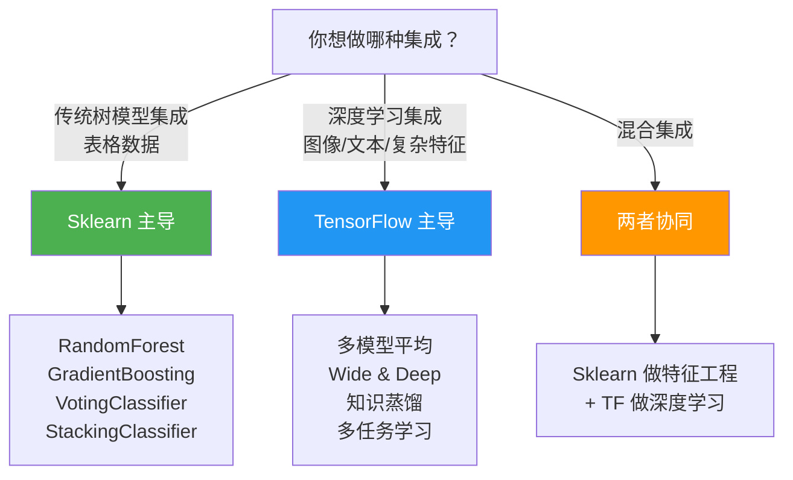
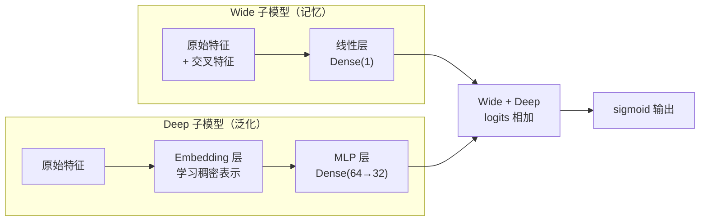

## 前置知识：集成学习的范式转移

Sklearn 是**集成学习的天堂**：`RandomForest`、`GradientBoosting`、`Voting`、`Stacking`、`Bagging` 应有尽有，以树模型为核心，适合表格数据。TensorFlow 的集成学习以**深度学习模型融合**为核心：多模型平均、知识蒸馏、Wide & Deep 联合训练、多任务学习。而且神经网络本身就具有**隐式集成**能力——Dropout 近似 Bagging，残差连接近似 Boosting。



> [!important] 核心差异：算法级集成 vs 架构级集成
> • **Sklearn**：多个模型各自独立训练，最后投票/加权/堆叠。模型间独立，不共享特征学习。
> • **TensorFlow**：Wide & Deep 架构把 Wide 子模型（线性记忆）和 Deep 子模型（Embedding 泛化）融合在一个模型中联合训练，共享损失函数。这比 Voting/Stacking（独立训练后合并）更深入——特征表示在训练中互相影响。
> • **隐式集成**：单个大神经网络通过 Dropout、BatchNorm、大量参数，隐式模拟了集成效果——Dropout 近似 Bagging，残差连接近似 Boosting。

---

## 一、决策树与随机森林：TF-DF

### 1.1 TensorFlow Decision Forests 安装

```bash
pip install tensorflow-decision-forests
```

> [!warning] TF-DF 平台限制
> `tensorflow_decision_forests` 目前仅支持 Linux 和 macOS，**Windows 原生不支持**（可用 WSL2）。这是 TF 生态的一个坑——Sklearn 跨平台，TF-DF 不跨平台。Windows 用户建议用 WSL2 或 Google Colab。

### 1.2 Sklearn vs TF-DF 对比

```python
import numpy as np
from sklearn.datasets import make_classification
from sklearn.model_selection import train_test_split
from sklearn.ensemble import RandomForestClassifier
from sklearn.metrics import accuracy_score

X, y = make_classification(n_samples=5000, n_features=20, n_informative=10, random_state=42)
X_train, X_test, y_train, y_test = train_test_split(X, y, test_size=0.2, random_state=42)

# ============================================
# Sklearn RandomForest
# ============================================
sk_rf = RandomForestClassifier(n_estimators=100, max_depth=10, random_state=42, n_jobs=-1)
sk_rf.fit(X_train, y_train)
print(f"Sklearn RF 准确率: {sk_rf.score(X_test, y_test):.4f}")
print(f"特征重要性: {sk_rf.feature_importances_}")

# ============================================
# TF-DF RandomForest
# ============================================
import tensorflow_decision_forests as tfdf
import pandas as pd

train_df = pd.DataFrame(X_train, columns=[f'f{i}' for i in range(20)])
train_df['label'] = y_train
test_df = pd.DataFrame(X_test, columns=[f'f{i}' for i in range(20)])
test_df['label'] = y_test

tf_rf = tfdf.keras.RandomForestModel(num_trees=100, max_depth=10, verbose=0)
tf_rf.fit(train_df, label='label')
tf_rf.compile(metrics=['accuracy'])
_, acc = tf_rf.evaluate(test_df, verbose=0)
print(f"TF-DF RF 准确率: {acc:.4f}")

# TF-DF 独有：模型结构可视化
tf_rf.summary()
```

### 1.3 对照表

| 特性 | Sklearn RandomForest | TF-DF RandomForestModel |
|------|:---:|:---:|
| 训练 API | `fit(X, y)` | `fit(df, label='col')` 或 `fit(dataset)` |
| 并行训练 | `n_jobs=-1`（多进程） | 内部自动并行（仅 CPU） |
| 原生 DataFrame 输入 | ❌ 需先编码类别/缺失值 | ✅ 原生支持（含类别、缺失值） |
| 模型保存 | `joblib.dump` | `model.save()` SavedModel（可接 TFX） |
| 跨平台 | ✅ | ❌ Windows 不支持 |
| 模型可视化 | `plot_tree` | `tfdf.model_plotter` + `model.summary()` |

> [!important] TF-DF 不是主流方向
> TensorFlow 的核心优势是**深度学习**（CNN/RNN/Transformer），TF-DF 是社区贡献的扩展库。**生产实践中**：表格数据 + 树模型 → 用 XGBoost/LightGBM/CatBoost；非结构化数据 + 深度学习 → 用 TF Keras；混合数据 → 两者协同。

### 1.4 GradientBoosting 对比

```python
from sklearn.ensemble import GradientBoostingClassifier, HistGradientBoostingClassifier

# Sklearn GBT
sk_gb = GradientBoostingClassifier(n_estimators=100, max_depth=5, learning_rate=0.1)
sk_gb.fit(X_train, y_train)
print(f"Sklearn GBT: {sk_gb.score(X_test, y_test):.4f}")

# Sklearn HistGradientBoosting（大数据集推荐，比 GB 快 10 倍）
sk_hgb = HistGradientBoostingClassifier(max_iter=100, max_depth=5)
sk_hgb.fit(X_train, y_train)
print(f"Sklearn HistGB: {sk_hgb.score(X_test, y_test):.4f}")

# TF-DF GBT
tf_gb = tfdf.keras.GradientBoostedTreesModel(num_trees=100)
tf_gb.fit(train_df, label='label')
tf_gb.compile(metrics=['accuracy'])
_, acc = tf_gb.evaluate(test_df, verbose=0)
print(f"TF-DF GBT: {acc:.4f}")
```

> [!warning] TF-DF 不需要 compile
> TF-DF 的 `RandomForestModel` 和 `GradientBoostedTreesModel` 训练时不需要 `compile()`——它们不是基于梯度的优化，直接 `fit` 即可。`compile` 仅在评估时指定 metrics。

---

## 二、VotingClassifier → 手动模型融合

### 2.1 Sklearn VotingClassifier

```python
from sklearn.ensemble import VotingClassifier
from sklearn.linear_model import LogisticRegression
from sklearn.svm import SVC
from sklearn.tree import DecisionTreeClassifier

voting = VotingClassifier(
    estimators=[
        ('lr', LogisticRegression(max_iter=1000)),
        ('svm', SVC(probability=True)),
        ('dt', DecisionTreeClassifier(max_depth=5))
    ],
    voting='soft',
    weights=[1, 2, 1]
)
voting.fit(X_train, y_train)
print(f"Sklearn Voting 准确率: {voting.score(X_test, y_test):.4f}")
```

### 2.2 TF 等价：多模型平均

```python
import tensorflow as tf
import numpy as np

X_train_f = X_train.astype(np.float32)
X_test_f = X_test.astype(np.float32)

# 训练多个不同结构的 Keras 模型
def build_shallow():
    return tf.keras.Sequential([
        tf.keras.layers.Dense(16, activation='relu', input_shape=(20,)),
        tf.keras.layers.Dense(1, activation='sigmoid')
    ])

def build_deep():
    return tf.keras.Sequential([
        tf.keras.layers.Dense(128, activation='relu', input_shape=(20,)),
        tf.keras.layers.Dropout(0.3),
        tf.keras.layers.Dense(64, activation='relu'),
        tf.keras.layers.Dense(1, activation='sigmoid')
    ])

def build_regularized():
    return tf.keras.Sequential([
        tf.keras.layers.Dense(32, activation='relu', input_shape=(20,),
                              kernel_regularizer=tf.keras.regularizers.l2(0.01)),
        tf.keras.layers.Dense(1, activation='sigmoid')
    ])

models = [build_shallow(), build_deep(), build_regularized()]
for m in models:
    m.compile(optimizer='adam', loss='binary_crossentropy', metrics=['accuracy'])
    m.fit(X_train_f, y_train, epochs=30, verbose=0)

# 软投票（概率平均，通常优于硬投票）
probas = [m.predict(X_test_f, verbose=0).flatten() for m in models]
avg_proba = np.mean(probas, axis=0)
soft_pred = (avg_proba > 0.5).astype(int)
print(f"TF 软投票准确率: {accuracy_score(y_test, soft_pred):.4f}")

# 加权软投票
weighted = np.average(probas, axis=0, weights=[0.2, 0.5, 0.3])
weighted_pred = (weighted > 0.5).astype(int)
print(f"TF 加权投票准确率: {accuracy_score(y_test, weighted_pred):.4f}")

# 硬投票（多数表决）
hard_preds = [(p > 0.5).astype(int) for p in probas]
hard_vote = np.round(np.mean(hard_preds, axis=0)).astype(int)
print(f"TF 硬投票准确率: {accuracy_score(y_test, hard_vote):.4f}")
```

### 2.3 对照表

| 投票方式 | Sklearn | TF 实现 |
|----------|---------|---------|
| 硬投票 | `voting='hard'` | `np.round(np.mean([preds], axis=0))` |
| 软投票 | `voting='soft'` | `np.mean([probas], axis=0)` |
| 加权 | `weights=[1,2,1]` | `np.average(probas, weights=..., axis=0)` |

> [!tip] 软投票通常优于硬投票
> 软投票保留了概率信息，对概率校准更敏感。神经网络经 sigmoid 输出的概率通常校准良好，软投票效果更佳。

---

## 三、StackingClassifier → 手动堆叠

### 3.1 Sklearn StackingClassifier

```python
from sklearn.ensemble import StackingClassifier

stacking = StackingClassifier(
    estimators=[
        ('lr', LogisticRegression(max_iter=1000)),
        ('rf', RandomForestClassifier(n_estimators=100, random_state=42))
    ],
    final_estimator=LogisticRegression(),
    cv=5  # 内部自动用 5-Fold 生成元特征
)
stacking.fit(X_train, y_train)
print(f"Sklearn Stacking 准确率: {stacking.score(X_test, y_test):.4f}")
```

### 3.2 TF 手动实现 Stacking

```python
from sklearn.model_selection import StratifiedKFold

n_folds = 5
skf = StratifiedKFold(n_splits=n_folds, shuffle=True, random_state=42)

# 元特征存储
meta_train = np.zeros((len(X_train_f), 2))  # 2 个基模型
meta_test = np.zeros((len(X_test_f), 2))

for model_idx, build_fn in enumerate([build_shallow, build_deep]):
    test_preds = np.zeros((len(X_test_f), 1))
    for fold, (tr_idx, va_idx) in enumerate(skf.split(X_train_f, y_train)):
        model = build_fn()
        model.compile(optimizer='adam', loss='binary_crossentropy')
        model.fit(X_train_f[tr_idx], y_train[tr_idx], epochs=30, verbose=0)
        # 验证集预测 → 元特征
        meta_train[va_idx, model_idx] = model.predict(
            X_train_f[va_idx], verbose=0).flatten()
        # 测试集预测（最终取 K 折平均）
        test_preds += model.predict(X_test_f, verbose=0) / n_folds
    meta_test[:, model_idx] = test_preds.flatten()

# 元模型
meta_model = tf.keras.Sequential([
    tf.keras.layers.Dense(8, activation='relu', input_shape=(2,)),
    tf.keras.layers.Dense(1, activation='sigmoid')
])
meta_model.compile(optimizer='adam', loss='binary_crossentropy')
meta_model.fit(meta_train.astype(np.float32), y_train, epochs=50, verbose=0)

final_pred = (meta_model.predict(meta_test.astype(np.float32), verbose=0) > 0.5).astype(int).flatten()
print(f"TF Stacking 准确率: {accuracy_score(y_test, final_pred):.4f}")
```

> [!warning] 元特征生成的过拟合风险
> 直接用训练集预测结果作为元特征会导致元模型过拟合。必须用 **K-Fold 交叉验证**生成元特征——每个 fold 的模型预测另一个 fold，确保元模型训练时看到的是"未参与训练"的预测。Sklearn 的 `StackingClassifier` 内部自动做这件事，TF 需要手写。

---

## 四、神经网络的隐式集成（TF 独有视角）

### 4.1 Dropout ≈ Bagging


```python
# Dropout 在每次前向传播时随机禁用一部分神经元
# 相当于训练了指数级数量的"子网络"，推理时取平均
model = tf.keras.Sequential([
    tf.keras.layers.Dense(256, activation='relu', input_shape=(20,)),
    tf.keras.layers.Dropout(0.5),      # ← 近似 Bagging
    tf.keras.layers.Dense(128, activation='relu'),
    tf.keras.layers.Dropout(0.3),
    tf.keras.layers.Dense(1, activation='sigmoid')
])
```

### 4.2 残差连接 ≈ Boosting

```python
# GBDT 中每棵树拟合前一轮残差
# 残差连接（Residual Connection）让每层学习前一层输出与目标之间的"残差"
inputs = tf.keras.Input(shape=(20,))
x = tf.keras.layers.Dense(64, activation='relu')(inputs)
residual = tf.keras.layers.Dense(64)(x)     # 残差分支
x = tf.keras.layers.Add()([x, residual])    # 学习残差
output = tf.keras.layers.Dense(1, activation='sigmoid')(x)
```

### 4.3 隐式集成对照表

| 机制 | 作用 | 等价集成方法 |
|------|------|-------------|
| Dropout | 随机禁用神经元 | Bagging |
| BatchNorm | 稳定训练 + 正则化 | 标准化 + 平滑 |
| 数据增强 | 扩充样本 | 隐式模型平均 |
| 残差连接 | 学习残差 | Boosting |
| 大模型 + 早停 | 多个局部最优平均 | Ensemble |

> [!important] 神经网络本身就是集成学习
> 一个带 Dropout + BatchNorm + 残差连接的大神经网络，隐式包含了 Bagging + Boosting + 数据增强的效果。这是为什么深度学习模型即使单个也比 Sklearn 的 Voting 集成更强——它内部已经集成了。

---

## 五、Wide & Deep（TF 独有，Sklearn 完全没有）

Wide & Deep 是 Google 提出的混合架构，把**记忆能力**（Wide）和**泛化能力**（Deep）融合在一个模型中联合训练。这是推荐系统的核心架构，Sklearn 完全无法实现。



```python
import tensorflow as tf
import numpy as np

# 模拟推荐系统数据
n = 1000
X_num = np.random.randn(n, 5).astype(np.float32)
X_cat = np.random.choice(['A', 'B', 'C', 'D'], size=(n, 1)).astype(str)
y = np.random.randint(0, 2, n).astype(np.float32)

# --- Wide 部分：原始特征 + 交叉特征 ---
input_wide = tf.keras.Input(shape=(5,), name='wide')
# Wide 部分直接连到输出（线性模型，等价 LogisticRegression）

# --- Deep 部分：类别 Embedding + MLP ---
input_deep_num = tf.keras.Input(shape=(5,), name='deep_num')
input_deep_cat = tf.keras.Input(shape=(1,), dtype=tf.string, name='deep_cat')

lookup = tf.keras.layers.StringLookup(
    vocabulary=['A', 'B', 'C', 'D'], output_mode='int')
cat_int = lookup(input_deep_cat)
emb = tf.keras.layers.Embedding(5, 4)(cat_int)
cat_flat = tf.keras.layers.Flatten()(emb)

deep_concat = tf.keras.layers.Concatenate()([input_deep_num, cat_flat])
x_deep = tf.keras.layers.Dense(64, activation='relu')(deep_concat)
x_deep = tf.keras.layers.Dense(32, activation='relu')(x_deep)

# --- Wide + Deep 融合 ---
both = tf.keras.layers.Concatenate()([input_wide, x_deep])
output = tf.keras.layers.Dense(1, activation='sigmoid')(both)

model = tf.keras.Model(
    inputs=[input_wide, input_deep_num, input_deep_cat],
    outputs=output
)
model.compile(optimizer='adam', loss='binary_crossentropy', metrics=['accuracy'])
model.fit(
    {'wide': X_num, 'deep_num': X_num, 'deep_cat': X_cat},
    y, epochs=20, batch_size=32, verbose=1
)
```

| 子模型 | 能力 | 类比 Sklearn |
|--------|------|-------------|
| **Wide** | 记忆特征交叉（如"啤酒 AND 尿布"） | `PolynomialFeatures` + 线性回归 |
| **Deep** | 泛化到没见过的特征组合 | `MLPClassifier` + `Embedding` |
| **联合训练** | 两者共享损失，互相增强 | ❌ Sklearn 无法做到 |

> [!important] Wide & Deep 是推荐系统的核心架构
> - **Wide 部分**：学习频繁出现的特征交叉（记忆能力）
> - **Deep 部分**：通过 Embedding 泛化到没见过的特征组合（泛化能力）
> - **联合训练**：两者共享损失函数，在训练中互相增强——这比 Sklearn 的 Voting/Stacking（独立训练后合并）更深入
>
> 这是 Google Play 商店和 Google App 推荐的核心架构，Sklearn 无法实现。

---

## 六、知识蒸馏（TF 独有，Sklearn 无对应）

知识蒸馏是把大模型（Teacher）的知识迁移到小模型（Student），在 TF 中通过自定义训练循环实现。

```python
import tensorflow as tf

# 1. Teacher 模型（大）——末层不设激活，输出 logits
teacher = tf.keras.Sequential([
    tf.keras.layers.Dense(128, activation='relu', input_shape=(20,)),
    tf.keras.layers.Dense(64, activation='relu'),
    tf.keras.layers.Dense(32, activation='relu'),
    tf.keras.layers.Dense(1)  # ← logits（不设 sigmoid）
])
teacher.compile(optimizer='adam',
                loss=tf.keras.losses.BinaryCrossentropy(from_logits=True),
                metrics=['accuracy'])
teacher.fit(X_train_f, y_train, epochs=50, verbose=0)
print(f"Teacher 参数量: {teacher.count_params()}")

# 2. 生成 Teacher 软标签（保存 logits，蒸馏损失内部除以 T 后再过 sigmoid，
#    避免对概率二次 sigmoid）
T = 5  # 温度系数
teacher_logits = teacher.predict(X_train_f, verbose=0)  # ← logits，不是概率

# 3. Student 模型（小）——末层同样输出 logits
student = tf.keras.Sequential([
    tf.keras.layers.Dense(32, activation='relu', input_shape=(20,)),
    tf.keras.layers.Dense(16, activation='relu'),
    tf.keras.layers.Dense(1)  # ← logits
])

def distillation_loss(y_true, student_logits, teacher_logits, temperature=5.0, alpha=0.7):
    """软标签损失 + 硬标签损失（全程基于 logits，数值稳定）"""
    # 软损失：Teacher 的 logits/T 过 sigmoid 作为软标签，
    # 与 Student 的 logits/T 做交叉熵
    soft_loss = tf.reduce_mean(
        tf.nn.sigmoid_cross_entropy_with_logits(
            labels=tf.nn.sigmoid(teacher_logits / temperature),
            logits=student_logits / temperature
        )
    )
    # 硬损失：与真实标签的交叉熵（同样用 logits 形式）
    hard_loss = tf.reduce_mean(
        tf.nn.sigmoid_cross_entropy_with_logits(
            labels=y_true, logits=student_logits
        )
    )
    return alpha * soft_loss + (1 - alpha) * hard_loss

# 4. 蒸馏训练（自定义训练循环）
optimizer = tf.keras.optimizers.Adam(0.001)
for epoch in range(50):
    with tf.GradientTape() as tape:
        s_logits = student(X_train_f, training=True)
        loss = distillation_loss(
            y_train.astype(np.float32).reshape(-1, 1),
            s_logits, teacher_logits
        )
    grads = tape.gradient(loss, student.trainable_variables)
    optimizer.apply_gradients(zip(grads, student.trainable_variables))

print(f"Student 参数量: {student.count_params()}")
student_pred = (tf.nn.sigmoid(student.predict(X_test_f, verbose=0)) > 0.5).astype(int).flatten()
print(f"Student 准确率: {accuracy_score(y_test, student_pred):.4f}")
print(f"Teacher 准确率: {teacher.evaluate(X_test_f, y_test, verbose=0)[1]:.4f}")
```

> [!tip] 知识蒸馏的价值
> - **模型压缩**：大模型 → 小模型，部署到手机/嵌入式设备
> - **性能接近**：Student 学习 Teacher 的软标签（包含"暗知识"），性能接近 Teacher
> - **Sklearn 无对应**：Sklearn 模型通常不需要蒸馏（本身不大）

---

## 七、多任务学习（TF 独有）

一个模型同时学习多个相关任务，共享底层特征表示。

```python
# 共享层 + 多输出
input_layer = tf.keras.Input(shape=(20,))
shared = tf.keras.layers.Dense(64, activation='relu')(input_layer)
shared = tf.keras.layers.Dense(32, activation='relu')(shared)

# 任务 1：二分类
output1 = tf.keras.layers.Dense(1, activation='sigmoid', name='task1')(shared)
# 任务 2：回归
output2 = tf.keras.layers.Dense(1, activation='linear', name='task2')(shared)

model = tf.keras.Model(inputs=input_layer, outputs=[output1, output2])
model.compile(
    optimizer='adam',
    loss={'task1': 'binary_crossentropy', 'task2': 'mse'},
    loss_weights={'task1': 1.0, 'task2': 0.5},
    metrics={'task1': 'accuracy', 'task2': 'mae'}
)

# 训练（需要两个标签）
y_task1 = y_train
y_task2 = np.random.randn(len(y_train)).astype(np.float32)
model.fit(X_train_f, {'task1': y_task1, 'task2': y_task2},
          epochs=50, validation_split=0.2, verbose=0)
```

> [!tip] 多任务学习的优势
> - **共享特征**：多个任务共享底层表示，提高泛化能力
> - **数据效率**：小任务可以从大任务"借用"数据
> - **推理效率**：一次推理完成多个任务

---

## 八、混合集成：Sklearn + TF 协同

```python
from sklearn.ensemble import GradientBoostingClassifier

# 1. Sklearn 基模型
gb = GradientBoostingClassifier(n_estimators=100, random_state=42)
gb.fit(X_train, y_train)
gb_proba = gb.predict_proba(X_test)[:, 1]

# 2. TF 神经网络
tf_model = tf.keras.Sequential([
    tf.keras.layers.Dense(64, activation='relu', input_shape=(20,)),
    tf.keras.layers.Dense(1, activation='sigmoid')
])
tf_model.compile(optimizer='adam', loss='binary_crossentropy')
tf_model.fit(X_train_f, y_train, epochs=30, verbose=0)
nn_proba = tf_model.predict(X_test_f, verbose=0).flatten()

# 3. 融合（概率平均）
avg = (gb_proba + nn_proba) / 2
ensemble_pred = (avg > 0.5).astype(int)
print(f"混合集成准确率: {accuracy_score(y_test, ensemble_pred):.4f}")
```

---

## 九、集成学习全景对照表

| 集成方式 | Sklearn | TensorFlow | 适用场景 |
|----------|---------|-----------|---------|
| **RandomForest** | `RandomForestClassifier` | `tfdf.keras.RandomForestModel` | 表格数据 |
| **GradientBoosting** | `GradientBoostingClassifier` | `tfdf.keras.GradientBoostedTreesModel` | 表格数据 |
| **Voting** | `VotingClassifier` | 手动 `np.mean([probas])` | 模型差异大 |
| **Stacking** | `StackingClassifier` | 手动 K-Fold + 元模型 | 模型差异大 |
| **Bagging** | `BaggingClassifier` | `Dropout`（隐式 Bagging） | 降低方差 |
| **Boosting** | `AdaBoost` / `GradientBoosting` | 残差连接（隐式 Boosting） | 降低偏差 |
| **Wide & Deep** | ❌ 无 | **Functional API** | **推荐系统** |
| **知识蒸馏** | ❌ 无 | **Teacher→Student** | **模型压缩部署** |
| **多任务学习** | ❌ 无 | **共享层 + 多输出** | **相关任务** |

> [!important] 迁移策略总结
> 1. **RandomForest/GBT**：用 TF-DF 替代，或继续用 Sklearn（完全够用）
> 2. **Voting/Stacking**：TF 手动实现（`predict` + `average`）
> 3. **Wide & Deep**：TF Functional API（推荐系统核心，Sklearn 做不到）
> 4. **知识蒸馏**：TF 自定义训练循环（部署优化）
> 5. **实践建议**：表格数据用 Sklearn 集成更方便；推荐系统/NLP/CV 用 TF 架构级集成更强大

---

## 🧪 本章练习

每个练习包含：题目描述、关键提示、验收标准。建议先自己尝试 10 分钟，卡住再看折叠答案。

---

### 🟢 练习 1：TF-DF RandomForest（15 分钟）

**题目**：安装 `tensorflow_decision_forests`，用 TF-DF 训练 RandomForest，对比 Sklearn RF 准确率。

<details>
<summary>💡 参考答案</summary>

参见"一、决策树与随机森林"章节完整代码。关键点：TF-DF 需要 DataFrame，`fit(df, label='label')`。
</details>

**验收标准**：
- [ ] 两者准确率差距 < 5%
- [ ] 能说出 TF-DF 的一个独有优势（原生 DataFrame 输入含类别/缺失值、模型可视化、SavedModel/TFX 集成；注意 TF-DF 不支持 GPU，全 CPU 运算）

---

### 🟢 练习 2：手动软投票集成（20 分钟）

**题目**：训练 3 个结构不同的 Keras 模型（浅层 MLP、深层 MLP、L2 正则化 MLP），用软投票集成，对比单模型和集成的准确率。

<details>
<summary>💡 参考答案</summary>

参见"二、VotingClassifier → 手动模型融合"章节完整代码。关键点：`np.mean([probas], axis=0)`。
</details>

**验收标准**：
- [ ] 集成准确率 ≥ 单个模型最高准确率
- [ ] 理解软投票（概率平均）vs 硬投票（多数投票）的区别

---

### 🟡 练习 3：Wide & Deep 模型（30 分钟）

**题目**：用 Functional API 实现 Wide & Deep 模型，理解记忆 + 泛化的融合机制。

<details>
<summary>💡 参考答案</summary>

参见"五、Wide & Deep"章节完整代码。关键点：Wide 部分直接连输出，Deep 部分 Embedding + MLP，Concatenate 合并。
</details>

**验收标准**：
- [ ] 模型能正常训练
- [ ] 能解释 Wide 和 Deep 各自的作用
- [ ] 理解为什么 Wide & Deep 比 Voting 更深入（联合训练 vs 独立训练）

---

### 🟡 练习 4：手动 Stacking（35 分钟）

**题目**：用 2 个基模型 + 5-Fold 交叉验证 + 元模型，实现 Stacking 集成。

<details>
<summary>💡 参考答案</summary>

参见"三、StackingClassifier → 手动堆叠"章节完整代码。关键点：K-Fold 生成元特征防过拟合。
</details>

**验收标准**：
- [ ] Stacking 流程完整运行
- [ ] 能解释元特征的生成过程
- [ ] 理解为什么 Stacking 需要交叉验证（防止数据泄露）

---

### 🔴 练习 5：知识蒸馏（30 分钟）

**题目**：训练一个大 Teacher 模型（参数量 > 10000），用蒸馏训练一个小 Student 模型（参数量 < 2000），要求 Student 准确率 ≥ Teacher - 10%。

<details>
<summary>💡 参考答案</summary>

参见"六、知识蒸馏"章节完整代码。关键点：Teacher 软标签 + Student 自定义损失。
</details>

**验收标准**：
- [ ] Student 参数量 < Teacher 的 1/5
- [ ] Student 准确率 ≥ Teacher - 10%
- [ ] 能解释知识蒸馏的原理（大模型软标签包含暗知识）

---

## 🎯 本文学完自检

| 层次 | 检查项 |
|------|--------|
| 🟢 基础 | 能用 TF-DF 训练 RandomForest；能用 `predict` + `average` 实现投票集成 |
| 🟡 进阶 | 能手动实现 Stacking（K-Fold + 元模型）；理解 Wide & Deep 的核心思想；理解 Dropout ≈ Bagging |
| 🔴 挑战 | 能实现 Wide & Deep 模型；能用自定义训练循环实现知识蒸馏 |

---

## ⚡ 30 秒速记卡片

| # | 正面（问题） | 背面（答案） |
|---|-------------|-------------|
| F1 | `RandomForestClassifier` → TF？ | `tfdf.keras.RandomForestModel`（需 `pip install tensorflow_decision_forests`） |
| F2 | `GradientBoostingClassifier` → TF？ | `tfdf.keras.GradientBoostedTreesModel` |
| F3 | `VotingClassifier` → TF？ | 手动 `np.mean([probas], axis=0)` |
| F4 | `StackingClassifier` → TF？ | 手动 K-Fold 生成元特征 + 元模型 |
| F5 | TF 独有的集成方式？ | Wide & Deep / 知识蒸馏 / 多任务学习 |
| F6 | Dropout ≈ 什么集成？ | Bagging（随机失活 = 子网络平均） |
| F7 | 残差连接 ≈ 什么集成？ | Boosting（每层学习残差） |
| F8 | Wide & Deep 的 Wide 部分？ | 线性模型，学习特征交叉（记忆） |
| F9 | 知识蒸馏原理？ | 大模型软标签包含暗知识，迁移到小模型 |
| F10 | 表格数据优先用什么？ | GBDT（XGBoost/LightGBM）或 TF-DF |

---

## 相关笔记

- ⬅️ 前置：[[05-模型评估与调优对比]]
- ➡️ 后续：[[07-双向对比-Sklearn有TF无与TF有Sklearn无]]
- 🔗 关联：[[04-特征工程对比]]
- 🔗 关联：[[01-学习/TensorflowLearningBySklearn/10-业务场景实战合集]]
- 🔗 练习：[[v3-模型评估与超参调优]]

---
*创建时间：2026-07-25*
