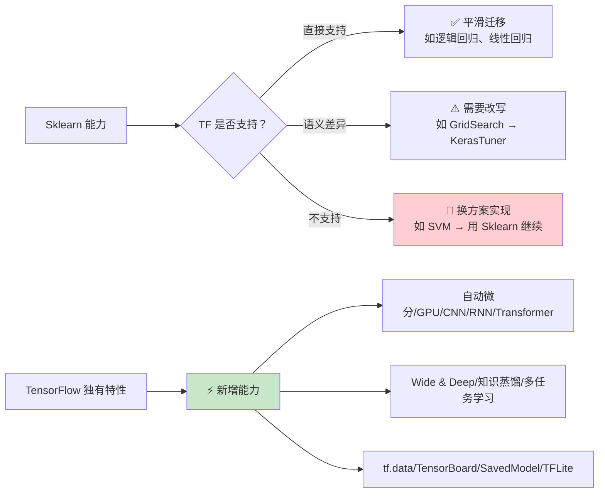
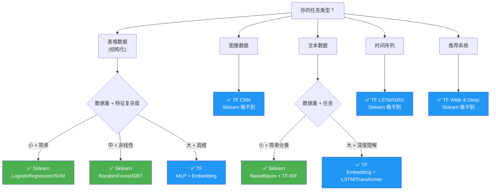

## 前置知识：为什么需要双向对比

迁移学习不能只学"TensorFlow 有什么"，还要清楚"Sklearn 有哪些东西带不过来"。双向对比能帮你建立完整的认知地图：哪些能力要重新学习、哪些能力可以直接迁移、哪些场景需要换一种实现思路。



> [!important] 迁移心态：不是"替换"而是"选择"
> TF 的强项是**深度学习**（自动微分 + GPU 加速 + CNN/RNN/Transformer）。传统 ML 的 SVM、KNN、聚类等算法，用 Sklearn 更高效。**混合使用是常态**：Sklearn 做传统 ML + 特征工程，TF 做深度学习 + 模型部署。迁移不是"用 TF 替代 Sklearn"，而是"在 Sklearn 基础上，用 TF 拓展深度学习能力"。

---

## 一、Sklearn 有，TensorFlow 没有（迁移注意事项）

### 1.1 传统 ML 算法

| Sklearn 特性 | TF 状态 | 替代方案 | 建议 |
|-------------|:---:|---------|------|
| `SVC / SVR` | ❌ 无 | 无等价 | 用 Sklearn |
| `KNeighborsClassifier` | ❌ 无 | 无等价 | 用 Sklearn |
| `DecisionTreeClassifier` | ⚠️ TF-DF | 需安装扩展 | 用 Sklearn 更方便 |
| `RandomForestClassifier` | ⚠️ TF-DF | 仅 Linux/macOS | 用 Sklearn 更方便 |
| `GradientBoostingClassifier` | ⚠️ TF-DF | 仅 Linux/macOS | 用 Sklearn 更方便 |
| `AdaBoostClassifier` | ❌ 无 | 用 Sklearn 或 TF-DF GBT | 用 Sklearn |
| `GaussianNB / MultinomialNB` | ❌ 无 | 无等价 | 用 Sklearn |
| `KMeans` | ❌ 无 | 无等价 | 用 Sklearn |
| `DBSCAN` | ❌ 无 | 无等价 | 用 Sklearn |
| `IsolationForest` | ❌ 无 | 无等价 | 用 Sklearn |
| `OneClassSVM` | ❌ 无 | 无等价 | 用 Sklearn |
| `PCA` | ⚠️ `tf.linalg.svd` | 无高层 API | 用 Sklearn 更方便 |
| `TSNE / UMAP` | ❌ 无 | 无等价 | 用 Sklearn |
| `NMF` | ❌ 无 | 无等价 | 用 Sklearn |

> [!warning] TF-DF 平台限制
> `tensorflow_decision_forests` 目前**仅支持 Linux 和 macOS**，Windows 原生不支持（可用 WSL2）。Sklearn 跨平台，TF-DF 不跨平台。

### 1.2 特征工程工具链

| Sklearn 特性 | TF 状态 | 替代方案 |
|-------------|:---:|---------|
| `PolynomialFeatures` | ❌ 无内置 | `Lambda` 层或自定义层（深度学习通常不需要） |
| `KBinsDiscretizer` | ❌ 无内置 | 自定义分桶层 |
| `FunctionTransformer` | ❌ 无内置 | `Lambda` 层或自定义层 |
| `PowerTransformer` | ❌ 无内置 | `Lambda(lambda x: tf.pow(x, 0.5))` |
| `QuantileTransformer` | ❌ 无内置 | 需自定义实现 |
| `TargetEncoder` | ❌ 无内置 | 自定义实现（需防泄露） |
| `SelectKBest` | ❌ 无内置 | 用 Sklearn 预处理后喂给 TF |
| `RFE` (递归特征消除) | ❌ 无 | 用 Sklearn |
| `VarianceThreshold` | ❌ 无 | 用 Sklearn 或手动 `tf.math.reduce_variance(x, axis)` |

### 1.3 评估与调优工具

| Sklearn 特性 | TF 状态 | 替代方案 |
|-------------|:---:|---------|
| `cross_val_score` | ❌ 无一行版本 | 手动 K-Fold 循环 |
| `GridSearchCV` | ❌ 无 | `KerasTuner`（推荐 Hyperband） |
| `RandomizedSearchCV` | ❌ 无 | `KerasTuner.RandomSearch` |
| `validation_curve` | ❌ 无 | 手动遍历参数 + `history` |
| `learning_curve` | ❌ 无 | `history.history` + matplotlib |
| `classification_report` | ❌ 无 | 直接用 Sklearn 的 |
| `confusion_matrix` | ⚠️ `tf.math.confusion_matrix` | Sklearn 版更友好 |
| `roc_curve` / `precision_recall_curve` | ❌ 无 | 直接用 Sklearn |
| `calibration_curve` | ❌ 无 | 用 Sklearn |
| `silhouette_score` | ❌ 无 | 用 Sklearn |

### 1.4 工具与便利函数

| Sklearn 特性 | TF 状态 | 替代方案 |
|-------------|:---:|---------|
| `train_test_split` | ❌ 无 | 用 Sklearn 的 |
| `StratifiedKFold / KFold` | ❌ 无 | 用 Sklearn 的 |
| `TimeSeriesSplit` | ❌ 无 | 用 Sklearn 的 |
| `make_classification / make_regression` | ❌ 无 | 用 Sklearn 或手动生成 |
| `Pipeline` | ⚠️ 部分等价 | `tf.data` + Keras 预处理层 |
| `ColumnTransformer` | ⚠️ 部分等价 | Functional API 多输入 |
| `FeatureUnion` | ⚠️ 部分等价 | `Concatenate` 层 |

> [!important] Sklearn 的核心不可替代价值
> 1. **传统 ML 算法全覆盖**：SVM、KNN、聚类、降维、异常检测——TF 都没有
> 2. **特征工程工具链**：`PolynomialFeatures`、`SelectKBest`、`RFE` 等高层 API
> 3. **交叉验证一行化**：`cross_val_score` 简单易用
> 4. **跨平台 + 轻量**：30MB vs TF 500MB+，全平台支持
> 5. **训练快**：传统 ML 模型秒级训练，不需 epochs

---

## 二、TensorFlow 有，Sklearn 没有（TF 独有优势）

### 2.1 核心计算能力

| TF 特性 | 说明 | Sklearn 状态 |
|---------|------|:---:|
| **自动微分** (`GradientTape`) | 任意函数的梯度计算 | ❌ 无 |
| **GPU/TPU 加速** | 原生 GPU/TPU 支持 | ❌ 无 |
| **计算图** (`@tf.function`) | 编译优化，提升性能 | ❌ 无 |
| **分布式训练** | 多 GPU/多机器分布式 | ❌ 无 |
| **混合精度** (`mixed_float16`) | 显存减半，速度加倍 | ❌ 无 |
| **`tf.data` 流式管道** | 大于内存数据集加载 | ❌ 无 |

### 2.2 深度学习架构

| TF 特性 | 说明 | Sklearn 状态 |
|---------|------|:---:|
| **CNN** (`Conv2D`) | 图像分类/检测/分割 | ❌ 无 |
| **RNN** (`LSTM` / `GRU`) | 时间序列/NLP | ❌ 无 |
| **Transformer** (`MultiHeadAttention`) | 大语言模型/序列建模 | ❌ 无 |
| **GAN** | 生成对抗网络 | ❌ 无 |
| **Autoencoder** | 无监督特征学习 | ❌ 无 |
| **Embedding 层**（可学习） | 类别稠密表示 | ❌ 无 |
| **预训练模型** (TF Hub) | VGG/ResNet/BERT 迁移学习 | ❌ 无 |
| **数据增强层** (`RandomFlip` 等) | 图像增强嵌入模型 | ❌ 无 |

### 2.3 模型架构级集成

| TF 特性 | 说明 | Sklearn 状态 |
|---------|------|:---:|
| **Wide & Deep** | 记忆 + 泛化联合训练 | ❌ 无 |
| **知识蒸馏** | 大模型 → 小模型压缩 | ❌ 无 |
| **多任务学习** | 共享层 + 多输出 | ❌ 无 |
| **残差连接** | 学习残差（≈ Boosting） | ❌ 无 |
| **Dropout** | 随机失活（≈ Bagging） | ❌ 无 |
| **BatchNormalization** | 稳定训练 + 正则化 | ❌ 无 |

### 2.4 训练控制体系

| TF 特性 | 说明 | Sklearn 状态 |
|---------|------|:---:|
| **学习率调度** | `ReduceLROnPlateau` / `CosineDecay` | ❌ 无 |
| **TensorBoard** | 训练可视化、权重分布 | ❌ 无 |
| **EarlyStopping** | 验证指标不提升时停止 | 仅 `MLPClassifier` 有 |
| **ModelCheckpoint** | 保存最佳模型 | ❌ 需手动 |
| **自定义训练循环** | `GradientTape` 完全控制 | ❌ 无 |
| **Focal Loss** | 处理类别不均衡 | ❌ 无 |
| **梯度裁剪** | `clipvalue` / `clipnorm` | ❌ 无 |

### 2.5 部署与生态

| TF 特性 | 说明 | Sklearn 状态 |
|---------|------|:---:|
| **SavedModel** | 跨语言部署（C++/Java/Go） | ❌ 无（pickle 仅 Python） |
| **TF Serving** | 生产级模型服务 | ❌ 无（需 Flask/FastAPI） |
| **TFLite** | 移动端/嵌入式部署 | ❌ 无 |
| **TF.js** | 浏览器部署 | ❌ 无 |
| **TF Hub** | 预训练模型库 | ❌ 无 |
| **TFX** | 端到端 ML 流水线 | ❌ 无 |
| **模型量化** | 减小模型体积 | ❌ 无 |

> [!important] TF 的核心不可替代价值
> 1. **深度学习全栈**：CNN/RNN/Transformer/Attention——Sklearn 完全没有
> 2. **自动微分 + GPU**：训练非凸大模型的基础设施
> 3. **部署生态**：SavedModel → TF Serving → TFLite → TF.js
> 4. **训练控制**：Callbacks/学习率调度/自定义循环
> 5. **架构级集成**：Wide & Deep/知识蒸馏/多任务学习

---

## 三、双向共有但实现不同的特性

| 功能 | Sklearn | TensorFlow | 差异说明 |
|------|---------|-----------|---------|
| 线性回归 | `LinearRegression` (解析解) | `Dense(1)` (梯度下降) | TF 需 epochs 迭代 |
| 逻辑回归 | `LogisticRegression` (lbfgs) | `Dense(1, sigmoid)` (Adam) | 概念一致，API 不同 |
| MLP | `MLPClassifier` | `Sequential([Dense(...)])` | TF 更灵活 |
| 标准化 | `StandardScaler` | `Normalization` 层 | TF 可嵌入模型 |
| One-Hot | `OneHotEncoder` | `StringLookup(one_hot)` | TF 一步到位 |
| L2 正则 | `Ridge(alpha)` | `kernel_regularizer=l2(λ)` | 系数需换算 |
| Pipeline | `Pipeline` | `tf.data` + 预处理层 | TF 预处理一体化 |
| 早停 | `MLPClassifier(early_stopping=True)` | `EarlyStopping` callback | TF 更灵活 |
| 模型保存 | `joblib.dump` | `model.save()` | TF 有 SavedModel 格式 |
| 文本向量化 | `CountVectorizer` (词袋) | `TextVectorization` (序列) | 范式不同 |

---

## 四、模型可解释性对比

| 方法 | Sklearn | TensorFlow |
|------|:---:|:---:|
| 特征重要性 | `feature_importances_` / `permutation_importance` | TF-DF 有，Keras 无（需自定义） |
| SHAP | `shap.Explainer` 直接支持 | 需 `shap.DeepExplainer` |
| 部分依赖图 | `partial_dependence` | 需手动实现 |
| 决策树可视化 | `plot_tree` | TF-DF 有 `model_plotter` |
| 梯度注意力 | ❌ 无 | **Integrated Gradients / Grad-CAM** |
| 卷积核可视化 | ❌ 无 | **特征图可视化** |

> [!tip] 可解释性策略
> **传统 ML 模型**（树模型、线性模型）用 Sklearn 自带工具 + SHAP。**深度学习模型**（CNN/RNN）用 TF 的 Integrated Gradients、Grad-CAM。两者不冲突——SHAP 也支持 `DeepExplainer` 用于 TF 模型。

---

## 五、部署完整对比

### 5.1 Sklearn 部署方式

```python
# 传统方式：Flask/FastAPI + pickle
import joblib
from flask import Flask, request, jsonify

model = joblib.load('model.pkl')
scaler = joblib.load('scaler.pkl')  # ← 别忘了保存 scaler！

app = Flask(__name__)
@app.route('/predict', methods=['POST'])
def predict():
    data = request.json['data']
    data_scaled = scaler.transform(data)  # ← 必须手动预处理
    return jsonify({'prediction': model.predict(data_scaled).tolist()})
```

### 5.2 TF 部署方式

```python
# 1. 保存 SavedModel（预处理层已嵌入，无需单独保存 scaler）
model.save('saved_model')

# 2. TF Serving 部署（Docker 一行启动）
# docker run -p 8501:8501 \
#   -v "$(pwd)/saved_model:/models/my_model" \
#   -e MODEL_NAME=my_model \
#   tensorflow/serving

# 3. 移动端部署（TFLite）
converter = tf.lite.TFLiteConverter.from_saved_model('saved_model')
tflite_model = converter.convert()
with open('model.tflite', 'wb') as f:
    f.write(tflite_model)

# 4. 浏览器部署（TF.js）
# !tensorflowjs_converter --input_format=tf_saved_model saved_model web_model
```

| 部署维度 | Sklearn | TensorFlow |
|----------|:---:|:---:|
| Python 服务 | Flask/FastAPI | TF Serving / Flask |
| 跨语言推理 | ❌ Python only | ✅ C++/Java/Go |
| 移动端 | ❌ 不支持 | ✅ TFLite |
| 浏览器 | ❌ 不支持 | ✅ TF.js |
| 边缘设备 | ❌ 不支持 | ✅ TFLite Micro |
| GPU 推理 | ❌ | ✅ |
| 预处理一致性 | ⚠️ 需手动保存 scaler | ✅ 预处理层随模型保存 |
| 模型版本管理 | 手动 | TF Serving 内置 |
| 请求批处理 | 手动 | TF Serving 内置 |

> [!important] 预处理一致性是 TF 部署的核心优势
> Sklearn 部署时必须分别保存 Scaler 和模型，容易遗漏（常见坑：忘记保存 scaler 或测试集忘记 transform）。TF 的预处理层嵌入模型，`model.save()` 时自动包含预处理，部署时只需加载一个模型文件。

---

## 六、迁移决策树



| 项目类型 | 推荐工具 | 理由 |
|----------|---------|------|
| 表格数据 + 传统 ML | **Sklearn 主力** | 算法全覆盖、开发快、部署简单 |
| 表格数据 + 深度学习 | **Sklearn + TF 混合** | 特征工程用 Sklearn，MLP 用 TF |
| 图像分类 | **TF 主力** | CNN/迁移学习 Sklearn 无法做 |
| NLP 文本分类 | **TF 主力** | Embedding/RNN/Transformer 是核心 |
| 推荐系统 | **TF 主力** | Wide & Deep / Embedding 是核心 |
| 时间序列预测 | **TF 主力** | LSTM/GRU 是核心 |
| 异常检测 | **Sklearn** | IsolationForest/OneClassSVM |
| 聚类 | **Sklearn** | KMeans/DBSCAN |
| 移动端部署 | **TF 独有** | TFLite 是唯一选择 |
| 浏览器部署 | **TF 独有** | TF.js 是唯一选择 |
| 快速原型 | **Sklearn 优先** | 一行 fit 搞定 |
| 生产部署 | **TF 优先** | TF Serving 生态更完善 |

---

## 七、迁移策略矩阵

| Sklearn 组件 | TF 对应 | 迁移难度 | 策略 |
|-------------|---------|:---:|------|
| `StandardScaler` | `Normalization` 层 | ⭐ | 直接替换 |
| `OneHotEncoder` | `StringLookup` 层 | ⭐ | 直接替换 |
| `LabelEncoder` | `StringLookup` 层 | ⭐ | 注意从 1 开始 |
| `Pipeline` | `tf.data` + 预处理层 | ⭐⭐ | 重写数据管道 |
| `ColumnTransformer` | Functional API 多输入 | ⭐⭐⭐ | 重新设计模型 |
| `LinearRegression` | `Dense(1)` | ⭐ | 直接替换 |
| `LogisticRegression` | `Dense(1, sigmoid)` | ⭐ | 直接替换 |
| `Ridge/Lasso` | `kernel_regularizer` | ⭐⭐ | 系数需调参 |
| `MLPClassifier` | `Sequential` | ⭐⭐ | 加 callbacks |
| `RandomForest` | TF-DF | ⭐⭐ | 平台限制 |
| `Voting` | 手动 `np.mean` | ⭐⭐ | 手动实现 |
| `Stacking` | 手动 K-Fold | ⭐⭐⭐⭐ | 复杂 |
| `SVM` | ❌ | — | 不迁移，用 Sklearn |
| `KNN` | ❌ | — | 不迁移，用 Sklearn |
| `cross_val_score` | 手动 K-Fold | ⭐⭐⭐ | 封装函数 |
| `GridSearchCV` | `KerasTuner` | ⭐⭐⭐ | 重新学 API |
| `classification_report` | 用 Sklearn | ⭐ | 直接用 |
| `joblib.dump` | `model.save()` | ⭐ | 直接替换 |

---

## 八、迁移检查清单

### 8.1 迁移前评估（10 项）

| # | 检查项 | 是 → | 否 → |
|---|--------|------|------|
| 1 | 任务涉及图像/文本/时间序列？ | TF | 继续评估 |
| 2 | 数据量 > 10 万样本？ | TF 有优势 | Sklearn 可能够用 |
| 3 | 需要 GPU 加速？ | TF | Sklearn |
| 4 | 模型部署到移动端/浏览器？ | TF (TFLite/TF.js) | Sklearn |
| 5 | 用的是 SVM/KNN/聚类？ | 留在 Sklearn | 继续评估 |
| 6 | 需要 CNN/RNN/Transformer？ | TF | Sklearn |
| 7 | 需要端到端预处理+模型一体化？ | TF | Sklearn |
| 8 | 需要学习率调度/自定义训练循环？ | TF | Sklearn |
| 9 | 团队熟悉深度学习？ | TF | 培训或用 Sklearn |
| 10 | 推荐系统/Wide & Deep 场景？ | TF | Sklearn |

### 8.2 迁移后测试（8 项）

| # | 检查项 | 验收标准 |
|---|--------|---------|
| 1 | TF 模型准确率 | ≥ Sklearn - 5% |
| 2 | 预处理一致性 | TF 模型对原始数据的预测与 Sklearn Pipeline 一致 |
| 3 | 模型保存/加载 | `model.save()` → `load_model()` 无损 |
| 4 | 推理延迟 | TF GPU 推理 ≤ Sklearn CPU 推理 |
| 5 | 内存占用 | TF batch 推理不 OOM |
| 6 | 预处理层包含 | 加载后模型自带预处理，无需额外 scaler |
| 7 | 批量推理 | `predict()` 支持批量输入 |
| 8 | 概率校准 | sigmoid 输出校准合理（Brier score < 0.2） |

### 8.3 推荐协作模式

> [!important] 混合使用是最佳实践
> 1. **开发阶段**：Sklearn 做特征工程 + 快速原型，TF 做深度学习模型
> 2. **评估阶段**：Sklearn 的 `classification_report` 统一评估所有模型
> 3. **部署阶段**：TF SavedModel 统一部署（预处理层已内嵌）
> 4. **监控阶段**：TensorBoard 监控 TF 模型，Sklearn 模型用自定义监控

---

## 九、常见迁移陷阱

> [!warning] **陷阱 1：期望 TF 有 Sklearn 的全部算法**
> TF 专注于深度学习，不包含 SVM、KNN、聚类。
> **解决方案**：传统 ML 用 Sklearn，深度学习用 TF，混合使用。

> [!warning] **陷阱 2：把 Sklearn 的 fit/predict 思维带到 TF**
> Sklearn `fit(X, y)` 一步到位；TF 需要 `compile() → fit(X, y, epochs, batch_size)`。
> **解决方案**：养成 `build → compile → fit` 三步习惯。

> [!warning] **陷阱 3：标签形式与 loss 不匹配**
> 整数标签用了 `categorical_crossentropy`（需 one-hot）。
> **解决方案**：整数标签 → `sparse_categorical_crossentropy`。

> [!warning] **陷阱 4：TF-DF 在 Windows 上不可用**
> `tensorflow_decision_forests` 不支持 Windows 原生。
> **解决方案**：用 WSL2 或 Google Colab。

> [!warning] **陷阱 5：GPU 内存不足（OOM）**
> TF 默认占用全部 GPU 显存。
> **解决方案**：`tf.config.experimental.set_memory_growth(gpu, True)`。

> [!warning] **陷阱 6：Lambda 层无法保存模型**
> `Lambda` 层用 Python lambda，`model.save()` 可能失败。
> **解决方案**：生产环境用自定义 `Layer` 子类。

> [!warning] **陷阱 7：交叉验证不重置模型**
> TF 模型训练后保留权重，下一 fold 会继续训练。
> **解决方案**：每 fold 调用 `build_model()` 重新创建。

---

## 十、核心差异总结

| 维度 | Sklearn 优势 | TensorFlow 优势 |
|------|:---:|:---:|
| 传统 ML 算法 | ✅ 全覆盖 | ❌ 仅少数 |
| 深度学习 | ❌ 仅 MLP | ✅ CNN/RNN/Transformer |
| GPU 加速 | ❌ | ✅ |
| 自动微分 | ❌ | ✅ |
| 部署生态 | ❌ 需 Flask | ✅ TF Serving/TFLite/TF.js |
| 开发速度 | ✅ 一行 fit | ❌ 需 compile + epochs |
| 模型灵活度 | ❌ 固定算法 | ✅ 任意层组合 |
| 训练可视化 | ❌ | ✅ TensorBoard |
| 学习率调度 | ❌ | ✅ 多种策略 |
| 数据管道 | ❌ 全量内存 | ✅ 流式 + GPU 预取 |
| 分布式训练 | ❌ | ✅ 多 GPU/多机 |
| 跨平台 | ✅ 全平台 | ⚠️ TF-DF 非全平台 |
| 可解释性 | ✅ 树模型友好 | ❌ 黑盒为主 |

> [!important] 一句话总结
> **Sklearn 做传统 ML 的王者，TensorFlow 做深度学习的王者。两者不是替代关系，而是互补关系。迁移不是"用 TF 替代 Sklearn"，而是"在 Sklearn 基础上，用 TF 拓展深度学习能力"。**

---

## 🧪 本章练习

---

### 🟢 练习 1：特性清单自测（10 分钟）

**题目**：不看笔记，列出 Sklearn 有但 TF 没有的 5 个特性，以及 TF 有但 Sklearn 没有的 5 个特性。

<details>
<summary>💡 参考答案</summary>

**Sklearn 有 TF 没有**：SVM、KNN、DBSCAN、cross_val_score、GridSearchCV
**TF 有 Sklearn 没有**：自动微分、GPU 加速、CNN/RNN、Wide & Deep、知识蒸馏、TensorBoard
</details>

**验收标准**：
- [ ] 能列出至少 5 个 Sklearn 独有特性
- [ ] 能列出至少 5 个 TF 独有特性

---

### 🟡 练习 2：技术选型决策（20 分钟）

**题目**：针对以下 5 个场景，选择 Sklearn、TF 或混合使用，并说明理由。

1. 用户流失预测（表格数据，10 万样本）
2. 商品图片分类（10 万张图片）
3. 推荐系统（用户-商品交互）
4. 异常检测（信用卡欺诈）
5. 文本情感分析（评论文本）

<details>
<summary>💡 参考答案</summary>

1. **Sklearn/XGBoost**：表格数据，树模型更适合
2. **TF + CNN**：图像数据，Sklearn 无 CNN
3. **TF + Wide & Deep**：推荐系统核心架构
4. **Sklearn**：IsolationForest/OneClassSVM
5. **TF + Embedding + LSTM**：深度学习 NLP 效果更好
</details>

**验收标准**：
- [ ] 5 个场景都能给出合理选择
- [ ] 能解释选择的理由

---

### 🔴 练习 3：完整迁移策略设计（30 分钟）

**题目**：设计一个完整的迁移策略，将以下 Sklearn 项目迁移到 TF：

**原项目**：用 Sklearn 的 RandomForest + GridSearchCV 做用户流失预测，数据量 10 万样本，50 个特征（含数值和类别）。

**要求**：
1. 列出哪些部分可以直接迁移
2. 列出哪些部分需要改写
3. 列出哪些部分应该换方案
4. 给出最终技术栈选择

<details>
<summary>💡 参考答案</summary>

**直接迁移**：数据拆分（`train_test_split`）、特征选择（`SelectKBest`）
**需要改写**：预处理（`StandardScaler` → `Normalization` 层）、评估（`cross_val_score` → 手写 K-Fold）
**换方案**：RandomForest → TF-DF 或继续用 Sklearn；GridSearchCV → KerasTuner
**最终选择**：混合使用——Sklearn 做特征工程 + RF，TF 做深度学习模型（MLP），两者集成
</details>

**验收标准**：
- [ ] 能区分直接迁移/改写/换方案
- [ ] 最终技术栈选择合理
- [ ] 能解释混合使用的理由

---

## 🎯 本文学完自检

| 层次 | 检查项 |
|------|--------|
| 🟢 基础 | 能说出 5 个 Sklearn 有但 TF 没有的算法；能说出 5 个 TF 有但 Sklearn 没有的能力 |
| 🟡 进阶 | 能用迁移决策树为新任务选择正确的工具；能应用迁移检查清单评估迁移可行性 |
| 🔴 挑战 | 能完整迁移一个 Sklearn Pipeline 到 TF，处理所有差异并保持性能 |

---

## ⚡ 30 秒速记卡片

| # | 正面（问题） | 背面（答案） |
|---|-------------|-------------|
| F1 | Sklearn 有 TF 没有的算法？ | SVM/KNN/DBSCAN/NaiveBayes/IsolationForest/聚类 |
| F2 | TF 有 Sklearn 没有的能力？ | 自动微分/GPU/CNN/RNN/Transformer/Embedding |
| F3 | TF 独有的架构？ | Wide & Deep/知识蒸馏/多任务学习 |
| F4 | 表格数据用什么？ | Sklearn/XGBoost/LightGBM |
| F5 | 图像/文本用什么？ | TF（CNN/RNN/Transformer） |
| F6 | 推荐系统用什么？ | TF Wide & Deep |
| F7 | 迁移前评估几项？ | 10 项（任务/数据量/GPU/部署/算法等） |
| F8 | 迁移后必检项？ | 准确率/预处理一致性/保存加载/预处理层包含 |
| F9 | 正确心态？ | 混合使用是常态，不是"迁移"所有模型 |
| F10 | 一句话总结？ | 两者互补，不是替代 |

---

## 相关笔记

- ⬅️ 前置：[[06-集成学习与模型融合对比]]
- ➡️ 后续：[[08-深度学习入门-从MLP到Keras]]
- 🔗 关联：[[00-TensorFlow 总览索引（Sklearn 迁移版）]]
- 🔗 关联：[[01-环境搭建与基础概念对比]] · [[02-数据预处理与Pipeline对比]] · [[03-传统ML模型迁移]]
- 🔗 关联：[[04-特征工程对比]] · [[05-模型评估与调优对比]]
- 🔗 关联：[[01-学习/TensorflowLearningBySklearn/99-第二周复习检查点|99-第二周复习检查点]]
- 🔗 练习：[[v1-基础回归分类迁移]] · [[v2-数据管道与特征工程]] · [[v3-模型评估与超参调优]]

---
*创建时间：2026-07-25*