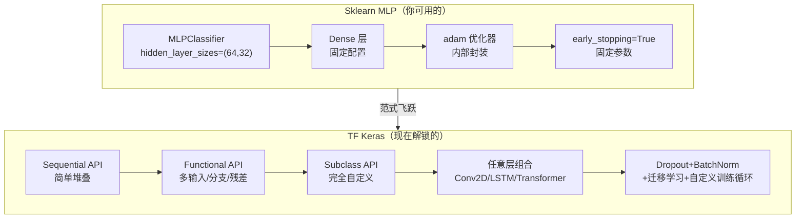
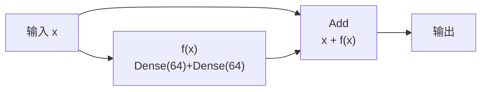

## 前置知识：从机器学习到深度学习的范式飞跃

你已经用过 `sklearn.neural_network.MLPClassifier`，它是 Sklearn 中唯一涉及神经网络的模块。TF Keras 是深度学习的主流框架，API 更灵活、生态更完整（GPU、TensorBoard、部署工具链）。本文以 `MLPClassifier` 为锚点，逐层映射到 Keras 等价实现，并扩展 Keras 独有的深度学习特性。



> [!important] Sklearn MLP 的局限
> `MLPClassifier` 虽然简单好用，但有严重局限：
> 1. **不支持 GPU**：大数据集训练慢
> 2. **网络结构固定**：不能加 Dropout/BatchNorm/残差连接
> 3. **无 TensorBoard**：训练过程不透明
> 4. **无法微调预训练模型**：不能做迁移学习
> 5. **不支持 CNN/RNN/Transformer**：非结构化数据无能为力
>
> TF Keras 解决了以上所有问题，并保持了类似的 API 风格（Sequential / fit / predict）。

---

## 一、MLPClassifier 完整参数映射

### 1.1 最简单的 MLP

```python
from sklearn.neural_network import MLPClassifier
import tensorflow as tf
import numpy as np
from sklearn.datasets import make_classification
from sklearn.model_selection import train_test_split

X, y = make_classification(n_samples=1000, n_features=10, random_state=42)
X_train, X_test, y_train, y_test = train_test_split(X, y, test_size=0.2, random_state=42)
X_train_f = X_train.astype(np.float32)
X_test_f = X_test.astype(np.float32)

# ============================================
# Sklearn MLPClassifier
# ============================================
sk_mlp = MLPClassifier(
    hidden_layer_sizes=(64, 32),
    activation='relu',
    solver='adam',
    alpha=0.0001,               # L2 正则化
    batch_size=200,
    max_iter=200,
    early_stopping=True,
    validation_fraction=0.1,
    random_state=42
)
sk_mlp.fit(X_train, y_train)
print(f"Sklearn MLP 准确率: {sk_mlp.score(X_test, y_test):.4f}")

# ============================================
# Keras 等价实现
# ============================================
tf.random.set_seed(42)
tf_mlp = tf.keras.Sequential([
    tf.keras.layers.Input(shape=(10,)),
    tf.keras.layers.Dense(64, activation='relu',
                          kernel_regularizer=tf.keras.regularizers.l2(0.0001)),
    tf.keras.layers.Dense(32, activation='relu',
                          kernel_regularizer=tf.keras.regularizers.l2(0.0001)),
    tf.keras.layers.Dense(1, activation='sigmoid')
])
tf_mlp.compile(optimizer='adam', loss='binary_crossentropy', metrics=['accuracy'])
history = tf_mlp.fit(
    X_train_f, y_train, epochs=200, batch_size=200, verbose=0,
    validation_split=0.1,
    callbacks=[tf.keras.callbacks.EarlyStopping(
        monitor='val_loss', patience=10, restore_best_weights=True)]
)
loss, acc = tf_mlp.evaluate(X_test_f, y_test, verbose=0)
print(f"Keras MLP 准确率: {acc:.4f}")
```

### 1.2 完整参数对照表

| MLPClassifier 参数 | Keras 等价 | 说明 |
|-------------------|-----------|------|
| `hidden_layer_sizes=(64,32)` | `Dense(64) + Dense(32)` | 每层一个 Dense |
| `activation='relu'` | `activation='relu'` | 完全一致 |
| `solver='adam'` | `optimizer='adam'` | 完全一致 |
| `solver='sgd'` | `optimizer='sgd'` | 完全一致 |
| `alpha=0.0001` | `kernel_regularizer=l2(0.0001)` | L2 正则化 |
| `learning_rate_init=0.001` | `Adam(learning_rate=0.001)` | 自定义学习率 |
| `batch_size=200` | `batch_size=200` | 完全一致 |
| `max_iter=200` | `epochs=200` | 概念一致 |
| `early_stopping=True` | `EarlyStopping()` callback | Keras 通过 callback 实现 |
| `validation_fraction=0.1` | `validation_split=0.1` | Keras 在 fit 参数中 |
| `n_iter_no_change=10` | `EarlyStopping(patience=10)` | 早停耐心值 |
| `random_state=42` | `tf.random.set_seed(42)` | 全局种子 |
| `nesterovs_momentum` | `SGD(momentum=0.9, nesterov=True)` | 需显式指定优化器 |

> [!tip] 迁移建议
> 1. 先用 `tf.random.set_seed()` 替代 `random_state`
> 2. Keras 默认用 Adam，和 Sklearn 一致
> 3. 用 `kernel_regularizer=l2(α)` 替代 Sklearn 的 `alpha` 参数
> 4. 用 `EarlyStopping` callback 替代 `early_stopping=True`

---

## 二、Keras 建模三剑客

### 2.1 Sequential：线性堆叠（最像 Sklearn）

```python
model = tf.keras.Sequential([
    tf.keras.layers.Dense(64, activation='relu', input_shape=(10,)),
    tf.keras.layers.Dropout(0.3),
    tf.keras.layers.BatchNormalization(),
    tf.keras.layers.Dense(32, activation='relu'),
    tf.keras.layers.Dense(1, activation='sigmoid')
])
model.summary()  # 打印模型结构
```

> [!tip] Sequential 的限制
> Sequential 只支持**线性堆叠**——一层接一层，不能有分支。如果需要多输入/多输出、残差连接、共享层，必须用 Functional API。

### 2.2 Functional API：灵活拓扑（推荐 90% 场景）

```python
# 多输入
input_a = tf.keras.Input(shape=(10,), name='features_a')
input_b = tf.keras.Input(shape=(5,), name='features_b')

# 分支
x1 = tf.keras.layers.Dense(32, activation='relu')(input_a)
x2 = tf.keras.layers.Dense(16, activation='relu')(input_b)

# 合并
merged = tf.keras.layers.Concatenate()([x1, x2])
shared = tf.keras.layers.Dense(64, activation='relu')(merged)

# 多输出
output_cls = tf.keras.layers.Dense(1, activation='sigmoid', name='classification')(shared)
output_reg = tf.keras.layers.Dense(1, activation='linear', name='regression')(shared)

model = tf.keras.Model(inputs=[input_a, input_b], outputs=[output_cls, output_reg])
model.compile(
    optimizer='adam',
    loss={'classification': 'binary_crossentropy', 'regression': 'mse'},
    loss_weights={'classification': 1.0, 'regression': 0.3},
    metrics={'classification': 'accuracy', 'regression': 'mae'}
)
model.summary()
```

### 2.3 Subclass：完全自定义（研究级）

```python
class MyCustomModel(tf.keras.Model):
    def __init__(self):
        super().__init__()
        self.dense1 = tf.keras.layers.Dense(64, activation='relu')
        self.dropout = tf.keras.layers.Dropout(0.3)
        self.dense2 = tf.keras.layers.Dense(32, activation='relu')
        self.out = tf.keras.layers.Dense(1, activation='sigmoid')

    def call(self, inputs, training=False):
        x = self.dense1(inputs)
        x = self.dropout(x, training=training)  # ← Dropout 需要 training 参数
        x = self.dense2(x)
        return self.out(x)

model = MyCustomModel()
model.compile(optimizer='adam', loss='binary_crossentropy', metrics=['accuracy'])
```

> [!important] Subclass 的 `training` 参数
> `BatchNorm` 和 `Dropout` 在训练和推理时行为不同：
> - 训练时：BatchNorm 用 batch 统计量；Dropout 随机失活
> - 推理时：BatchNorm 用累积统计量；Dropout 不失活
>
> 传入 `training=True/False` 切换模式。`model.fit()` 自动传 `training=True`，`model.predict()` 自动传 `training=False`。但在自定义 `call()` 中需要手动传。

### 2.4 三种 API 对比

| 特性 | Sequential | Functional | Subclass |
|------|:---:|:---:|:---:|
| 易用性 | ⭐⭐⭐ 最简单 | ⭐⭐ 中等 | ⭐ 复杂 |
| 灵活性 | 仅线性堆叠 | 任意拓扑 | 完全自定义 |
| 多输入/输出 | ❌ | ✅ | ✅ |
| 残差连接 | ❌ | ✅ | ✅ |
| 共享层 | ❌ | ✅ | ✅ |
| 模型保存 | ✅ | ✅ | ⚠️ 需 get_config |
| `model.summary()` | ✅ | ✅ | ❌ 不完整 |
| 适用场景 | 简单 MLP | **大多数场景** | 研究级自定义 |

> [!important] 选 API 的建议
> - **90% 场景用 Functional API**：够灵活，又支持多输入/残差/共享
> - Sequential 仅用于最简单的线性模型
> - Subclass 仅在需要完全自定义 `call()` 逻辑时使用（如 GAN、RL）

---

## 三、常用层与激活函数

### 3.1 层速查表

| 层类型 | 用途 | 何时用 | 对应 Sklearn |
|--------|------|-------|:---:|
| `Dense` | 全连接 | 通用特征提取 | `MLPClassifier` |
| `Dropout` | 正则化 | 防过拟合 | ❌ |
| `BatchNormalization` | 稳定训练 | 深层网络 | ❌ |
| `Flatten` | 展平 | 卷积层→全连接 | ❌ |
| `Concatenate` | 拼接 | 多分支融合 | `FeatureUnion` |
| `Add` | 逐元素加 | 残差连接 | ❌ |
| `Embedding` | 稠密表示 | 类别特征/NLP | ❌ |
| `GlobalAveragePooling1D/2D` | 全局池化 | 替代 Flatten | ❌ |

### 3.2 激活函数速查表

| 激活函数 | 用途 | 推荐场景 |
|----------|------|---------|
| `relu` | 默认首选 | 隐藏层 |
| `elu` | ReLU 改进版 | 深层网络 |
| `leaky_relu` | 解决"死神经元" | 需要负值激活 |
| `tanh` | 输出范围 [-1,1] | 需要中心化 |
| `sigmoid` | 输出范围 [0,1] | 二分类输出层 |
| `softmax` | 输出概率分布 | 多分类输出层 |
| `linear` | 不激活 | 回归输出层 |
| `gelu` | Gaussian Error Linear Unit | Transformer |

---

## 四、正则化技术：Dropout 与 BatchNorm

### 4.1 Dropout（随机失活，防止过拟合）

```python
model = tf.keras.Sequential([
    tf.keras.layers.Dense(256, activation='relu', input_shape=(10,)),
    tf.keras.layers.Dropout(0.5),     # 训练时随机失活 50% 神经元
    tf.keras.layers.Dense(128, activation='relu'),
    tf.keras.layers.Dropout(0.3),
    tf.keras.layers.Dense(1, activation='sigmoid')
])
```

> [!tip] Dropout 工作机制
> - **训练时**：每次前向传播随机禁用一部分神经元（按比例），等效于训练多个"子网络"
> - **推理时**：所有神经元都工作（但权重按 dropout rate 缩放）
> - **隐式集成**：Dropout 近似 Bagging，是深度学习中最重要的正则化手段之一

> [!tip] Dropout 率经验法则
> - 输入层：0.0-0.2（不要失活太多输入特征）
> - 隐藏层（大）：0.3-0.5
> - 隐藏层（小）：0.1-0.3
> - 输出层前：0.0-0.2

### 4.2 BatchNormalization（加速训练，稳定梯度）

```python
# BN 层放在激活函数之前（推荐顺序：Dense → BN → Activation）
model = tf.keras.Sequential([
    tf.keras.layers.Dense(128, input_shape=(10,)),
    tf.keras.layers.BatchNormalization(),
    tf.keras.layers.Activation('relu'),
    tf.keras.layers.Dense(64),
    tf.keras.layers.BatchNormalization(),
    tf.keras.layers.Activation('relu'),
    tf.keras.layers.Dense(1, activation='sigmoid')
])
```

> [!important] BatchNormalization 的作用
> - **稳定训练**：让每层的输入分布保持稳定，缓解"内部协变量偏移"
> - **加速收敛**：允许更大的学习率
> - **轻微正则化**：因 batch 统计量的随机性
> - **位置争议**：先 BN 再激活（推荐）vs 先激活再 BN（原版）都可以，现代实践倾向先 BN

### 4.3 Dropout vs BatchNorm

| 特性 | Dropout | BatchNormalization |
|------|---------|-------------------|
| 作用 | 随机禁用神经元，防过拟合 | 稳定训练，加速收敛 |
| 训练/推理行为 | 训练时随机失活，推理时关闭 | 训练时用 batch 统计，推理时用全局统计 |
| 对 batch_size 敏感 | 否 | 是（小 batch 效果差） |
| 可与其他正则化共用 | ✅ | ✅ 常与 Dropout 配合 |
| 推荐场景 | 全连接层 | 深层网络 / CNN |

---

## 五、残差连接（Sklearn 没有，深度学习核心）

残差连接（Residual Connection）是深度网络能训练的关键技术——让梯度能直接流过"跳跃连接"，解决深层网络梯度消失问题。



```python
# 残差连接（Functional API）
inputs = tf.keras.Input(shape=(64,))
x = tf.keras.layers.Dense(64, activation='relu')(inputs)
x = tf.keras.layers.Dense(64)(x)  # 线性变换（无激活）
x = tf.keras.layers.Add()([inputs, x])  # 残差连接：x + f(x)
x = tf.keras.layers.Activation('relu')(x)

# 维度不一致时用 projection
# x = tf.keras.layers.Dense(32)(x)         # 输出维度变了
# proj = tf.keras.layers.Dense(32)(inputs) # projection 对齐维度
# x = tf.keras.layers.Add()([proj, x])
```

> [!important] 残差连接的隐式 Boosting
> GBDT 中每棵树拟合前一轮残差。残差连接让每层学习"输入 → 输出"之间的残差 $f(x) = y - x$，近似 Boosting。这是 ResNet（深度残差网络）能训练 100+ 层的关键。

---

## 六、模型保存与加载

### 6.1 三种格式对比

```python
# 格式 1：.keras（推荐，Keras 原生，单文件）
model.save('model.keras')
loaded = tf.keras.models.load_model('model.keras')

# 格式 2：SavedModel（部署用，目录格式）
# ⚠️ 版本注：Keras 3（TF ≥ 2.16）中 model.save('目录') 已不可用——
# Keras 2（TF ≤ 2.15）可 save/load_model 目录往返；
# Keras 3 部署用 model.export('saved_model/') 导出（推理专用，不可 load_model 往返）
model.save('saved_model/')                    # 仅 Keras 2（TF ≤ 2.15）
loaded = tf.keras.models.load_model('saved_model/')  # 仅 Keras 2（TF ≤ 2.15）
# model.export('saved_model/')               # Keras 3（TF ≥ 2.16）的导出方式

# 格式 3：HDF5（旧格式，兼容性好）
# ⚠️ 版本注：Keras 3（TF ≥ 2.16）已移除 save_format 参数，按文件扩展名 .h5 自动识别
model.save('model.h5')
loaded = tf.keras.models.load_model('model.h5')
```

| 格式 | 用途 | 特点 |
|------|------|------|
| `.keras` | **推荐通用** | 单文件，包含全部（结构+权重+优化器状态） |
| `SavedModel/` | **部署** | 目录，含 `.pb` + assets + variables |
| `.h5` | 兼容 | 旧格式，仍可用 |

### 6.2 仅保存权重

```python
# 仅保存权重（用于热重载、checkpoint）
model.save_weights('weights.weights.h5')

# 加载权重（需要先构建相同结构的模型）
new_model = build_model()
new_model.load_weights('weights.weights.h5')
```

### 6.3 Checkpoint（训练中断恢复）

```python
checkpoint_cb = tf.keras.callbacks.ModelCheckpoint(
    'checkpoints/epoch_{epoch:02d}.keras',
    save_best_only=True,
    monitor='val_loss',
    mode='min',
    save_weights_only=False  # True 仅保存权重，False 保存完整模型
)
model.fit(X_train, y_train, epochs=100, callbacks=[checkpoint_cb],
          validation_data=(X_val, y_val))
```

> [!important] 保存格式选择建议
> - **日常开发**：用 `.keras` 格式（单文件，易管理）
> - **生产部署**：用 `SavedModel` 目录格式（TF Serving / TFLite 需要）
> - **训练中断恢复**：用 `ModelCheckpoint` 定期保存
> - **自定义层**：必须实现 `get_config()` 才能序列化

---

## 七、迁移学习：冻结与微调（Sklearn 没有）

迁移学习是深度学习的核心范式：用预训练模型的特征表示，在新数据上微调，极大降低数据需求。

```python
import tensorflow as tf

# ============================================
# 步骤 1：加载预训练模型（如 ResNet50）
# ============================================
base_model = tf.keras.applications.ResNet50(
    weights='imagenet',
    include_top=False,           # 不包含最后分类层
    input_shape=(224, 224, 3)
)

# ============================================
# 步骤 2：冻结基础层（不更新权重）
# ============================================
base_model.trainable = False

# ============================================
# 步骤 3：添加新分类头
# ============================================
model = tf.keras.Sequential([
    base_model,
    tf.keras.layers.GlobalAveragePooling2D(),
    tf.keras.layers.Dense(256, activation='relu'),
    tf.keras.layers.Dropout(0.5),
    tf.keras.layers.Dense(10, activation='softmax')  # 10 类分类
])

# ============================================
# 步骤 4：只训练新层（较大学习率）
# ============================================
model.compile(
    optimizer=tf.keras.optimizers.Adam(1e-3),
    loss='sparse_categorical_crossentropy',
    metrics=['accuracy']
)
model.fit(train_data, epochs=10, validation_data=val_data)

# ============================================
# 步骤 5：解冻基础层，微调（极小学习率）
# ============================================
base_model.trainable = True
# 或仅解冻最后 N 层
for layer in base_model.layers[:-20]:
    layer.trainable = False

model.compile(
    optimizer=tf.keras.optimizers.Adam(1e-5),  # ← 更小的学习率
    loss='sparse_categorical_crossentropy',
    metrics=['accuracy']
)
model.fit(train_data, epochs=5, validation_data=val_data)
```

### 7.1 关键原则

| 阶段 | 学习率 | 训练层 | 目的 |
|------|:---:|:---:|------|
| 特征提取 | 较大（1e-3） | 仅新层 | 快速训练分类头 |
| 微调 | **极小**（1e-5） | 全部或最后几层 | 微调预训练权重 |

> [!warning] 微调的常见错误
> 1. **微调学习率过大**：破坏预训练权重 → 用 1e-5 或更小
> 2. **BatchNorm 层忘记设 training=False**：微调时 BN 层应固定统计量 → `layer.trainable = False` 会自动处理
> 3. **不冻结直接训练**：小数据集上会严重过拟合

### 7.2 常用预训练模型

| 模型 | 用途 | 加载方式 |
|------|------|---------|
| ResNet50 | 图像分类 | `tf.keras.applications.ResNet50` |
| VGG16 | 图像分类 | `tf.keras.applications.VGG16` |
| MobileNet | 移动端图像 | `tf.keras.applications.MobileNetV2` |
| BERT | NLP 文本 | `tensorflow_hub` 或 HuggingFace |
| EfficientNet | 高精度图像 | `tf.keras.applications.EfficientNetB0` |

---

## 八、自定义层、损失函数与指标

### 8.1 自定义 Layer

```python
class DenseWithL2(tf.keras.layers.Layer):
    """带 L2 正则化的全连接层"""
    def __init__(self, units, activation='relu', l2_rate=0.01, **kwargs):
        super().__init__(**kwargs)
        self.units = units
        self.activation = tf.keras.activations.get(activation)
        self.l2_rate = l2_rate

    def build(self, input_shape):
        self.w = self.add_weight(
            shape=(input_shape[-1], self.units),
            initializer='glorot_uniform',
            regularizer=tf.keras.regularizers.l2(self.l2_rate),
            trainable=True
        )
        self.b = self.add_weight(
            shape=(self.units,),
            initializer='zeros',
            trainable=True
        )

    def call(self, inputs):
        return self.activation(tf.matmul(inputs, self.w) + self.b)

    def get_config(self):
        config = super().get_config()
        config.update({'units': self.units, 'activation': 'relu', 'l2_rate': self.l2_rate})
        return config

# 使用
model = tf.keras.Sequential([
    DenseWithL2(64, activation='relu', l2_rate=0.01, input_shape=(20,)),
    DenseWithL2(32, activation='relu', l2_rate=0.01),
    tf.keras.layers.Dense(1, activation='sigmoid')
])
```

> [!tip] 自定义层必须实现 `build()` + `call()` + `get_config()`
> - `build()`：创建权重（延迟初始化，知道输入形状后创建）
> - `call()`：前向传播逻辑
> - `get_config()`：序列化支持（`model.save()` 需要）

### 8.2 自定义损失函数（如 Focal Loss）

```python
def focal_loss(gamma=2.0, alpha=0.25):
    """处理类别不均衡的 Focal Loss"""
    def loss_fn(y_true, y_pred):
        bce = tf.keras.losses.binary_crossentropy(y_true, y_pred)
        p_t = (y_true * y_pred) + ((1 - y_true) * (1 - y_pred))
        alpha_t = y_true * alpha + (1 - y_true) * (1 - alpha)
        return tf.reduce_mean(alpha_t * tf.pow(1. - p_t, gamma) * bce)
    return loss_fn

model.compile(optimizer='adam', loss=focal_loss(gamma=2.0))
```

### 8.3 自定义指标

```python
class F1Score(tf.keras.metrics.Metric):
    def __init__(self, name='f1_score', **kwargs):
        super().__init__(name=name, **kwargs)
        self.precision = tf.keras.metrics.Precision()
        self.recall = tf.keras.metrics.Recall()

    def update_state(self, y_true, y_pred, sample_weight=None):
        self.precision.update_state(y_true, y_pred, sample_weight)
        self.recall.update_state(y_true, y_pred, sample_weight)

    def result(self):
        p = self.precision.result()
        r = self.recall.result()
        return 2 * (p * r) / (p + r + tf.keras.backend.epsilon())

    def reset_state(self):
        self.precision.reset_state()
        self.recall.reset_state()

model.compile(optimizer='adam', loss='binary_crossentropy', metrics=[F1Score()])
```

---

## 九、模型可视化与调试

```python
# 1. model.summary()：打印结构
model.summary()

# 2. plot_model：结构图（需 pip install pydot）
tf.keras.utils.plot_model(model, 'model.png', show_shapes=True, show_layer_names=True)

# 3. TensorBoard：训练可视化
tensorboard_cb = tf.keras.callbacks.TensorBoard(
    log_dir='./logs/run1', histogram_freq=1, write_graph=True
)
model.fit(X_train, y_train, epochs=50, validation_data=(X_val, y_val),
          callbacks=[tensorboard_cb])
```

```bash
# 启动 TensorBoard
tensorboard --logdir=./logs
# 浏览器打开 http://localhost:6006
```

---

## 十、常见错误与陷阱

> [!warning] **陷阱 1：忘记 compile 就 fit**
> `model.fit()` 前必须 `model.compile()`，否则报 `RuntimeError: You must compile a model before training/testing`

> [!warning] **陷阱 2：Dropout 在自定义 call() 中忘记传 training**
> 自定义 Subclass 模型中，`call(self, inputs, training=False)` 的 `training` 参数必须传给 Dropout 层：`self.dropout(x, training=training)`

> [!warning] **陷阱 3：BatchNorm 在 small batch 中效果差**
> BatchNorm 依赖 batch 统计量，batch_size < 16 时效果不佳。小 batch 用 `LayerNormalization` 替代。

> [!warning] **陷阱 4：混用激活函数和激活层**
> `Dense(64, activation='relu')` 和 `Dense(64) + Activation('relu')` 功能等价，但前者无法插入 BN 层。BN 需要放在激活之前：`Dense(64) → BN → Activation('relu')`。

> [!warning] **陷阱 5：在 Subclass 模型中直接调用 `model.summary()`**
> Subclass 模型在第一次调用前形状未知，`summary()` 可能报错。先 `model.build(input_shape)` 或先 `model.fit()` 一次再调用。

---

## 🧪 本章练习

---

### 🟢 练习 1：MLPClassifier 完整迁移（20 分钟）

**题目**：将以下 Sklearn MLPClassifier 完整迁移到 TF Keras，加入 EarlyStopping。

```python
sk_mlp = MLPClassifier(
    hidden_layer_sizes=(128, 64, 32),
    activation='relu', solver='adam', alpha=0.001,
    batch_size=64, max_iter=300,
    early_stopping=True, validation_fraction=0.15, random_state=42
)
```

<details>
<summary>💡 参考答案</summary>

```python
import tensorflow as tf
from tensorflow.keras import regularizers

tf.random.set_seed(42)
model = tf.keras.Sequential([
    tf.keras.layers.Input(shape=(10,)),
    tf.keras.layers.Dense(128, activation='relu', kernel_regularizer=regularizers.l2(0.001)),
    tf.keras.layers.Dense(64, activation='relu', kernel_regularizer=regularizers.l2(0.001)),
    tf.keras.layers.Dense(32, activation='relu', kernel_regularizer=regularizers.l2(0.001)),
    tf.keras.layers.Dense(1, activation='sigmoid')
])
model.compile(optimizer='adam', loss='binary_crossentropy', metrics=['accuracy'])
history = model.fit(
    X_train_f, y_train, epochs=300, batch_size=64, verbose=0,
    validation_split=0.15,
    callbacks=[tf.keras.callbacks.EarlyStopping(
        monitor='val_loss', patience=10, restore_best_weights=True)]
)
```
</details>

**验收标准**：
- [ ] 参数映射正确（hidden_layer_sizes → Dense、alpha → l2 等）
- [ ] EarlyStopping 正常工作

---

### 🟢 练习 2：Dropout + BatchNorm 正则化（15 分钟）

**题目**：构建一个包含 Dropout + BatchNorm 的 4 层 MLP，对比有无正则化的过拟合差异。

<details>
<summary>💡 参考答案</summary>

```python
model = tf.keras.Sequential([
    tf.keras.layers.Dense(128, input_shape=(20,)),
    tf.keras.layers.BatchNormalization(),
    tf.keras.layers.Activation('relu'),
    tf.keras.layers.Dropout(0.3),
    tf.keras.layers.Dense(64),
    tf.keras.layers.BatchNormalization(),
    tf.keras.layers.Activation('relu'),
    tf.keras.layers.Dropout(0.2),
    tf.keras.layers.Dense(32, activation='relu'),
    tf.keras.layers.Dense(1, activation='sigmoid')
])
model.compile(optimizer='adam', loss='binary_crossentropy', metrics=['accuracy'])
model.summary()
```
</details>

**验收标准**：
- [ ] BatchNorm 在激活前（推荐顺序）
- [ ] Dropout 比例合理（0.2-0.5）

---

### 🟡 练习 3：Functional API 多输入模型（25 分钟）

**题目**：用 Functional API 构建一个双输入模型（数值特征 + 类别 Embedding），输出为二分类。

<details>
<summary>💡 参考答案</summary>

```python
input_num = tf.keras.Input(shape=(10,), name='numeric')
x_num = tf.keras.layers.Dense(32, activation='relu')(input_num)

input_cat = tf.keras.Input(shape=(1,), dtype=tf.int32, name='category')
x_cat = tf.keras.layers.Embedding(100, 8)(input_cat)
x_cat = tf.keras.layers.Flatten()(x_cat)

merged = tf.keras.layers.Concatenate()([x_num, x_cat])
x = tf.keras.layers.Dense(64, activation='relu')(merged)
x = tf.keras.layers.Dropout(0.3)(x)
output = tf.keras.layers.Dense(1, activation='sigmoid')(x)

model = tf.keras.Model(inputs=[input_num, input_cat], outputs=output)
model.compile(optimizer='adam', loss='binary_crossentropy', metrics=['accuracy'])
model.summary()
```
</details>

**验收标准**：
- [ ] 多输入结构正确
- [ ] Embedding 输出经过 Flatten
- [ ] 模型能正常编译

---

### 🟡 练习 4：残差连接实现（20 分钟）

**题目**：用 Functional API 实现一个带残差连接的 4 层网络，验证梯度能正常流到浅层。

<details>
<summary>💡 参考答案</summary>

```python
inputs = tf.keras.Input(shape=(64,))
x = tf.keras.layers.Dense(64, activation='relu')(inputs)

# 残差块 1
residual = tf.keras.layers.Dense(64, activation='relu')(x)
residual = tf.keras.layers.Dense(64)(residual)  # 线性
x = tf.keras.layers.Add()([x, residual])
x = tf.keras.layers.Activation('relu')(x)

# 残差块 2
residual2 = tf.keras.layers.Dense(64, activation='relu')(x)
residual2 = tf.keras.layers.Dense(64)(residual2)
x = tf.keras.layers.Add()([x, residual2])
x = tf.keras.layers.Activation('relu')(x)

output = tf.keras.layers.Dense(1, activation='sigmoid')(x)
model = tf.keras.Model(inputs, output)
model.compile(optimizer='adam', loss='binary_crossentropy')
```
</details>

**验收标准**：
- [ ] 残差连接使用 `Add()` 层
- [ ] 维度匹配（需要 projection 时使用 Dense 对齐）
- [ ] 模型能正常训练

---

### 🔴 练习 5：迁移学习微调流程（30 分钟）

**题目**：用 ResNet50 预训练模型完成图像分类的迁移学习（特征提取 → 微调），要求测试集准确率 > 70%。

<details>
<summary>💡 参考答案</summary>

参见"七、迁移学习"章节完整代码。关键点：
1. 加载预训练模型 `include_top=False`
2. 冻结基础层 `base_model.trainable = False`
3. 添加新分类头
4. 特征提取阶段用较大学习率（1e-3）
5. 微调阶段解冻 + 极小学习率（1e-5）
</details>

**验收标准**：
- [ ] 特征提取阶段训练正常
- [ ] 微调阶段学习率 ≤ 1e-5
- [ ] 测试集准确率 > 70%（具体值取决于数据集）

---

## 🎯 本文学完自检

| 层次 | 检查项 |
|------|--------|
| 🟢 基础 | 能将 MLPClassifier 参数完整映射到 Keras；知道 Sequential/Functional/Subclass 的区别 |
| 🟡 进阶 | 能用 Dropout + BatchNorm 构建正则化模型；能用 Functional API 构建多输入模型和残差连接 |
| 🔴 挑战 | 能实现自定义层（含 get_config）；能完成预训练模型的迁移学习（特征提取 + 微调） |

---

## ⚡ 30 秒速记卡片

| # | 正面（问题） | 背面（答案） |
|---|-------------|-------------|
| F1 | `MLPClassifier` → Keras？ | `Sequential([Dense(64, relu), Dense(32, relu), Dense(1, sigmoid)])` |
| F2 | `hidden_layer_sizes` → Keras？ | 每个值一个 `Dense` 层 |
| F3 | `alpha` → Keras？ | `kernel_regularizer=l2(alpha)` |
| F4 | `early_stopping=True` → Keras？ | `EarlyStopping(monitor='val_loss', patience=10)` |
| F5 | Sklearn MLP 缺什么？ | GPU/Dropout/BatchNorm/TensorBoard/预训练模型 |
| F6 | 三种 API？ | Sequential（线性）/ Functional（任意）/ Subclass（完全自定义） |
| F7 | Dropout 作用？ | 训练时随机失活，近似 Bagging 集成 |
| F8 | BatchNorm 作用？ | 稳定每层输入分布，加速训练 |
| F9 | BatchNorm 放哪里？ | `Dense → BN → Activation`（激活前） |
| F10 | 残差连接作用？ | 解决深层网络梯度消失，让网络能训练更深 |
| F11 | 模型保存推荐？ | `.keras` 单文件（开发）/ `SavedModel` 目录（部署） |
| F12 | 迁移学习流程？ | 加载预训练 → 冻结 → 训练新层 → 解冻 → 小学习率微调 |
| F13 | 微调学习率多大？ | ≤ 1e-5（比特征提取小 10-100 倍） |
| F14 | 自定义层必须实现？ | `build()` + `call()` + `get_config()` |

---

## 相关笔记

- ⬅️ 前置：[[07-双向对比-Sklearn有TF无与TF有Sklearn无]]
- ➡️ 后续：[[09-CNN与RNN-TF独有领域]]
- 🔗 关联：[[03-传统ML模型迁移]]
- 🔗 关联：[[06-集成学习与模型融合对比]]
- 🔗 练习：[[v4-深度学习入门]] · [[v5-端到端ML项目]]

---
*创建时间：2026-07-25*