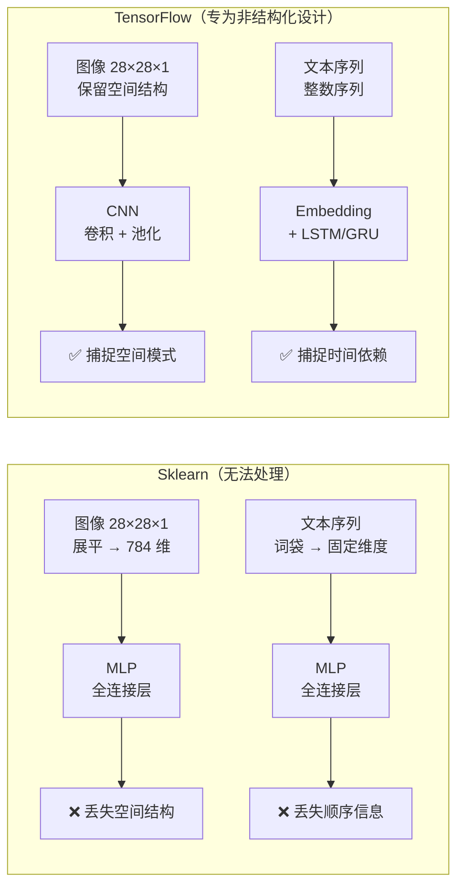
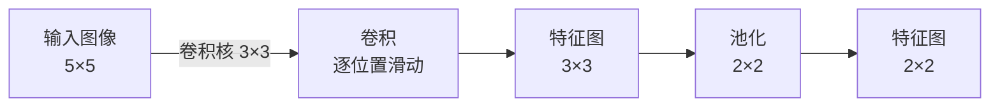
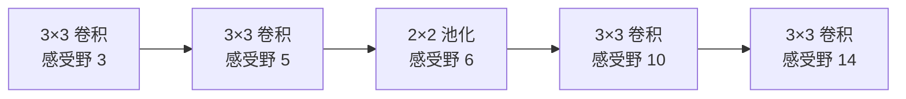
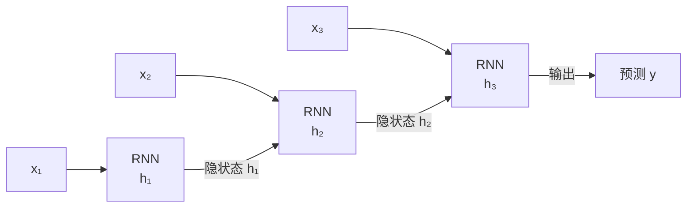
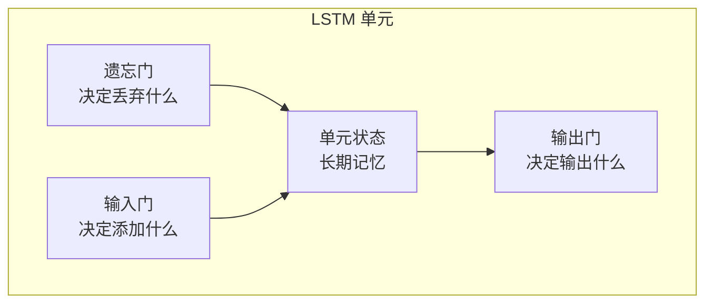
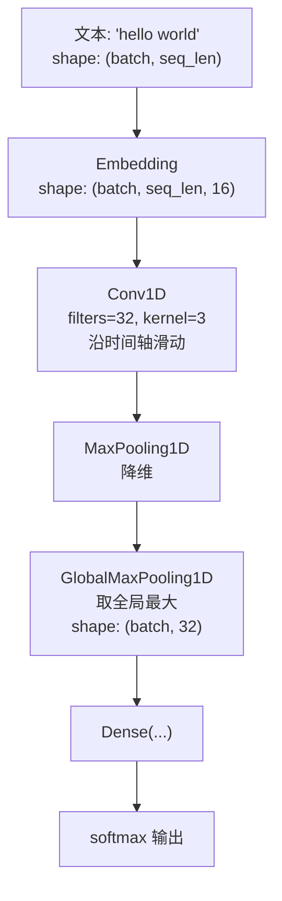
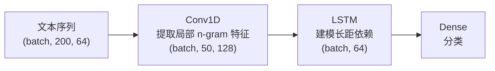

## 前置知识：Sklearn 无法触及的领域

CNN 和 RNN 是深度学习的两大支柱架构，专门处理 Sklearn 难以处理的**非结构化数据**——图像、文本、时间序列。Sklearn 的 `MLPClassifier` 用全连接层处理所有数据，对图像会丢失空间结构，对文本会丢失顺序信息。CNN 用**卷积核**捕捉空间局部模式，RNN 用**循环连接**捕捉时间依赖。



> [!important] 为什么 Sklearn 无法做 CNN/RNN？
> 1. **无 GPU 加速**：CNN 训练需要大量矩阵乘法，CPU 训练极慢
> 2. **无自动微分**：CNN/RNN 的反向传播需要自动微分链式求导
> 3. **无计算图**：复杂网络结构需要图优化（内存复用、算子融合）
> 4. **无预训练模型**：ImageNet/BERT 等预训练模型需要专门框架加载

---

## 一、CNN 原理：卷积核与特征图

### 1.1 卷积操作



```python
import tensorflow as tf
import numpy as np

# 输入图像（5×5 灰度图）
image = tf.constant([
    [1, 2, 0, 4, 1],
    [0, 3, 1, 2, 2],
    [2, 1, 4, 0, 3],
    [1, 0, 2, 3, 1],
    [3, 2, 1, 0, 2]
], dtype=tf.float32)
image = tf.reshape(image, [1, 5, 5, 1])  # [batch, height, width, channels]

# 卷积核（3×3 边缘检测）
kernel = tf.constant([
    [1, 0, -1],
    [1, 0, -1],
    [1, 0, -1]
], dtype=tf.float32)
kernel = tf.reshape(kernel, [3, 3, 1, 1])  # [k_h, k_w, in_ch, out_ch]

# 卷积操作
output = tf.nn.conv2d(image, kernel, strides=[1, 1, 1, 1], padding='VALID')
print(output.numpy().reshape(3, 3))
# 输出 3×3 特征图（5-3+1=3）
```

### 1.2 Conv2D 层

```python
conv_layer = tf.keras.layers.Conv2D(
    filters=32,           # 卷积核数量（输出通道数）
    kernel_size=(3, 3),   # 卷积核大小
    strides=(1, 1),       # 步长
    padding='same',       # 'same'（补零，输出尺寸不变）或 'valid'（不补零）
    activation='relu',
    input_shape=(28, 28, 1)
)
```

| 参数 | 说明 | 典型值 |
|------|------|--------|
| `filters` | 卷积核数量 | 32, 64, 128, 256 |
| `kernel_size` | 卷积核大小 | (3,3) 最常用, (5,5), (1,1) |
| `strides` | 步长 | (1,1) 默认, (2,2) 替代池化 |
| `padding` | 边界填充 | `'same'`（输出同尺寸）/ `'valid'`（不补） |
| `activation` | 激活函数 | `'relu'`（默认首选） |

### 1.3 池化层

```python
# 最大池化（保留显著特征）
max_pool = tf.keras.layers.MaxPooling2D(pool_size=(2, 2))

# 全局平均池化（替代 Flatten，减少参数量，防过拟合）
gap = tf.keras.layers.GlobalAveragePooling2D()
```

### 1.4 感受野（Receptive Field）



> [!important] 感受野是 CNN 的核心概念
> 感受野是输出特征图上一个点对应输入图像的区域大小。**深层网络 = 大感受野 = 能看更大范围**。堆叠多个 3×3 卷积比单个大卷积核更高效（参数少 + 感受野相同 + 非线性更强）。
> 递推公式：$r \leftarrow r + (k-1) \times jump$（k 为卷积核/池化核大小，jump 为当前跳跃间隔，初始 1）；池化后 jump 翻倍（2×2 池化 → jump=2）。上图中池化后：6 → 6+(3-1)×2=10 → 10+2×2=14。

---

## 二、经典 CNN 架构速查

| 架构 | 年份 | 核心创新 | 加载方式 |
|------|------|---------|---------|
| **LeNet** | 1998 | 第一个 CNN | 手写实现 |
| **AlexNet** | 2012 | ReLU + Dropout + GPU | 手写实现 |
| **VGG** | 2014 | 3×3 卷积堆叠 | `tf.keras.applications.VGG16` |
| **Inception/GoogLeNet** | 2014 | 多尺度并行卷积 | `tf.keras.applications.InceptionV3` |
| **ResNet** | 2015 | 残差连接（突破深度限制） | `tf.keras.applications.ResNet50` |
| **MobileNet** | 2017 | 深度可分离卷积（轻量） | `tf.keras.applications.MobileNetV2` |
| **EfficientNet** | 2019 | 复合缩放（精度+效率） | `tf.keras.applications.EfficientNetB0` |

---

## 三、CNN 实战：图像分类完整流程

```python
import tensorflow as tf
import numpy as np

# ============================================
# 1. 数据加载（CIFAR-10，10 类彩色图像）
# ============================================
(x_train, y_train), (x_test, y_test) = tf.keras.datasets.cifar10.load_data()
x_train = x_train.astype(np.float32) / 255.0  # 归一化到 [0, 1]
x_test = x_test.astype(np.float32) / 255.0
y_train = y_train.flatten()
y_test = y_test.flatten()

# ============================================
# 2. 数据增强（TF 独有，嵌入模型）
# ============================================
data_augmentation = tf.keras.Sequential([
    tf.keras.layers.RandomFlip('horizontal'),
    tf.keras.layers.RandomRotation(0.1),
    tf.keras.layers.RandomZoom(0.1),
])

# ============================================
# 3. 模型构建（Sequential CNN）
# ============================================
model = tf.keras.Sequential([
    tf.keras.Input(shape=(32, 32, 3)),
    data_augmentation,

    # 卷积块 1：Conv → BN → Conv → Pool
    tf.keras.layers.Conv2D(32, (3, 3), activation='relu', padding='same'),
    tf.keras.layers.BatchNormalization(),
    tf.keras.layers.Conv2D(32, (3, 3), activation='relu', padding='same'),
    tf.keras.layers.MaxPooling2D((2, 2)),
    tf.keras.layers.Dropout(0.25),

    # 卷积块 2：通道翻倍，尺寸减半
    tf.keras.layers.Conv2D(64, (3, 3), activation='relu', padding='same'),
    tf.keras.layers.BatchNormalization(),
    tf.keras.layers.Conv2D(64, (3, 3), activation='relu', padding='same'),
    tf.keras.layers.MaxPooling2D((2, 2)),
    tf.keras.layers.Dropout(0.25),

    # 卷积块 3
    tf.keras.layers.Conv2D(128, (3, 3), activation='relu', padding='same'),
    tf.keras.layers.BatchNormalization(),
    tf.keras.layers.Conv2D(128, (3, 3), activation='relu', padding='same'),
    tf.keras.layers.MaxPooling2D((2, 2)),
    tf.keras.layers.Dropout(0.25),

    # 分类头
    tf.keras.layers.GlobalAveragePooling2D(),
    tf.keras.layers.Dense(128, activation='relu'),
    tf.keras.layers.Dropout(0.5),
    tf.keras.layers.Dense(10, activation='softmax')
])

model.summary()

# ============================================
# 4. 编译与训练
# ============================================
model.compile(
    optimizer=tf.keras.optimizers.Adam(learning_rate=0.001),
    loss='sparse_categorical_crossentropy',
    metrics=['accuracy']
)

callbacks = [
    tf.keras.callbacks.EarlyStopping(
        monitor='val_loss', patience=10, restore_best_weights=True),
    tf.keras.callbacks.ReduceLROnPlateau(
        monitor='val_loss', factor=0.5, patience=3, min_lr=1e-6),
    tf.keras.callbacks.TensorBoard(log_dir='./logs/cifar10')
]

history = model.fit(
    x_train, y_train, batch_size=64, epochs=50,
    validation_split=0.1,  # 从训练集切验证集；用 x_test 当验证集会让 EarlyStopping 泄漏测试集
    callbacks=callbacks
)
loss, acc = model.evaluate(x_test, y_test, verbose=0)
print(f"测试集准确率: {acc:.4f}")
```

> [!important] CNN 设计原则
> 1. **深度递增**：浅层小卷积核少（32），深层大卷积核多（128/256）
> 2. **分辨率递减**：通过池化逐步缩小空间尺寸（32→16→8→4→2→1）
> 3. **正则化**：Dropout + BatchNorm + 数据增强三件套
> 4. **GlobalAveragePooling 替代 Flatten**：大幅减少参数量，防止过拟合

---

## 四、CNN 迁移学习：用预训练 ResNet50

```python
import tensorflow as tf

# 1. 加载预训练 ResNet50（不含分类头）
base_model = tf.keras.applications.ResNet50(
    weights='imagenet', include_top=False, input_shape=(224, 224, 3)
)
base_model.trainable = False  # 冻结基础层

# 2. 添加新分类头
model = tf.keras.Sequential([
    base_model,
    tf.keras.layers.GlobalAveragePooling2D(),
    tf.keras.layers.Dense(256, activation='relu'),
    tf.keras.layers.Dropout(0.5),
    tf.keras.layers.Dense(10, activation='softmax')
])

# 3. 特征提取阶段（较大学习率）
model.compile(
    optimizer=tf.keras.optimizers.Adam(1e-3),
    loss='sparse_categorical_crossentropy', metrics=['accuracy']
)
model.fit(train_ds, epochs=10, validation_data=val_ds)

# 4. 微调阶段（解冻 + 极小学习率）
base_model.trainable = True
for layer in base_model.layers[:-20]:
    layer.trainable = False  # 仅解冻最后 20 层

model.compile(
    optimizer=tf.keras.optimizers.Adam(1e-5),  # ← 极小学习率
    loss='sparse_categorical_crossentropy', metrics=['accuracy']
)
model.fit(train_ds, epochs=5, validation_data=val_ds)
```

> [!important] 迁移学习是 Sklearn 用户最陌生的能力
> Sklearn 没有预训练模型的概念。TF 的预训练模型在 ImageNet 上训练了数百万样本，学到的特征表示可以直接迁移到你的任务上。用 **1000 张图片**就能达到从头训练 **100 万张图片**的精度。

---

## 五、RNN 原理：循环连接与时间依赖

### 5.1 RNN 基本结构



```python
# 简单 RNN 层
rnn_layer = tf.keras.layers.SimpleRNN(
    units=64,                # 隐藏状态维度
    return_sequences=False,  # True 返回全部时间步，False 仅最后一步
    input_shape=(10, 5)     # (时间步数, 特征维度)
)

x = tf.random.normal((32, 10, 5))  # 32 个样本，每个 10 步，每步 5 特征
output = rnn_layer(x)
print(output.shape)  # (32, 64) → 每个样本最后一步的隐藏状态
```

### 5.2 LSTM 门机制



```python
# LSTM 层（解决长依赖问题）
lstm_layer = tf.keras.layers.LSTM(
    units=64,
    return_sequences=True,   # 返回全部时间步（堆叠多层时需要）
    dropout=0.2,             # 输入 dropout
    recurrent_dropout=0.2    # 循环 dropout
)
```

| 门 | 作用 | 公式 |
|----|------|------|
| 遗忘门 | 决定从单元状态丢弃什么 | $f_t = \sigma(W_f \cdot [h_{t-1}, x_t] + b_f)$ |
| 输入门 | 决定添加什么新信息 | $i_t = \sigma(W_i \cdot [h_{t-1}, x_t] + b_i)$ |
| 单元状态 | 长期记忆 | $C_t = f_t * C_{t-1} + i_t * \tilde{C}_t$ |
| 输出门 | 决定输出什么 | $o_t = \sigma(W_o \cdot [h_{t-1}, x_t] + b_o)$ |

> [!tip] LSTM vs GRU
> - **LSTM**：3 个门（遗忘、输入、输出），有单元状态 $C_t$ 和隐状态 $h_t$
> - **GRU**：2 个门（重置、更新），合并了单元状态和隐状态，**参数更少，训练更快**
> - **选择建议**：小数据集用 GRU（参数少），大数据集用 LSTM（表达力强）

### 5.3 Bidirectional（双向 RNN）

```python
model = tf.keras.Sequential([
    tf.keras.layers.Embedding(10000, 64, input_length=100),
    # 双向 LSTM：同时从前向后和从后向前读取
    tf.keras.layers.Bidirectional(tf.keras.layers.LSTM(64, return_sequences=True)),
    tf.keras.layers.Dropout(0.3),
    tf.keras.layers.Bidirectional(tf.keras.layers.LSTM(32)),
    tf.keras.layers.Dense(64, activation='relu'),
    tf.keras.layers.Dropout(0.3),
    tf.keras.layers.Dense(1, activation='sigmoid')
])
```

> [!tip] Bidirectional 的作用
> 普通 LSTM 只从前向后读，Bidirectional 同时从后向前再读一遍，拼接两个方向的隐状态。对于文本分类，双向 LSTM 通常比单向好——因为理解了上下文。

---

## 六、RNN 实战：文本分类

```python
import tensorflow as tf
import numpy as np

# 1. IMDB 影评二分类
vocab_size = 10000
max_len = 200
(x_train, y_train), (x_test, y_test) = tf.keras.datasets.imdb.load_data(num_words=vocab_size)
# 版本注：Keras 3（TF ≥ 2.16）中 pad_sequences 移至 tf.keras.utils.pad_sequences
x_train = tf.keras.preprocessing.sequence.pad_sequences(x_train, maxlen=max_len)
x_test = tf.keras.preprocessing.sequence.pad_sequences(x_test, maxlen=max_len)

# 2. 模型：Embedding → LSTM → Dense
model = tf.keras.Sequential([
    tf.keras.layers.Embedding(input_dim=vocab_size, output_dim=128, input_length=max_len),
    tf.keras.layers.LSTM(64, dropout=0.2, recurrent_dropout=0.2),
    tf.keras.layers.Dense(64, activation='relu'),
    tf.keras.layers.Dropout(0.5),
    tf.keras.layers.Dense(1, activation='sigmoid')
])
model.summary()
model.compile(optimizer='adam', loss='binary_crossentropy', metrics=['accuracy'])

history = model.fit(
    x_train, y_train, batch_size=128, epochs=5,
    validation_split=0.1,  # 从训练集切验证集；用 x_test 当验证集会让 EarlyStopping 泄漏测试集
    callbacks=[tf.keras.callbacks.EarlyStopping(
        monitor='val_loss', patience=2, restore_best_weights=True)]
)
loss, acc = model.evaluate(x_test, y_test, verbose=0)
print(f"IMDB 准确率: {acc:.4f}")
```

> [!important] 文本分类的核心数据流
> `TextVectorization`（字符串→整数序列）→ `Embedding`（整数→稠密向量）→ `LSTM/GRU`（捕捉序列依赖）→ `Dense`（分类）
>
> 这条管线是深度学习 NLP 的核心范式，Sklearn 完全无法做到。

---

## 七、RNN 实战：时间序列预测

```python
import tensorflow as tf
import numpy as np

# 1. 生成时间序列数据（正弦波 + 噪声）
t = np.linspace(0, 100, 1000)
series = np.sin(t) + np.random.randn(1000) * 0.1

def create_dataset(series, window_size=20):
    X, y = [], []
    for i in range(len(series) - window_size):
        X.append(series[i:i+window_size])
        y.append(series[i+window_size])
    return np.array(X), np.array(y)

X, y = create_dataset(series, window_size=20)
X = X[..., np.newaxis].astype(np.float32)  # (batch, timesteps, features)
y = y.astype(np.float32)

split = int(0.8 * len(X))
X_train, X_test = X[:split], X[split:]
y_train, y_test = y[:split], y[split:]

# 2. 模型：LSTM 回归
model = tf.keras.Sequential([
    tf.keras.layers.LSTM(32, input_shape=(20, 1)),
    tf.keras.layers.Dense(16, activation='relu'),
    tf.keras.layers.Dense(1)  # 回归，无激活
])
model.compile(optimizer='adam', loss='mse', metrics=['mae'])
model.fit(X_train, y_train, epochs=20, validation_data=(X_test, y_test),
          batch_size=32, verbose=0)
loss, mae = model.evaluate(X_test, y_test, verbose=0)
print(f"MAE: {mae:.4f}")
```

---

## 八、1D CNN：文本和时序分类

### 8.1 1D CNN 数据流



### 8.2 完整代码

```python
import tensorflow as tf
import numpy as np

texts = ["good movie", "bad film", "great story", "terrible acting"]
labels = np.array([1, 0, 1, 0])

vectorizer = tf.keras.layers.TextVectorization(max_tokens=100, output_sequence_length=10)
vectorizer.adapt(texts)

model = tf.keras.Sequential([
    tf.keras.Input(shape=(1,), dtype=tf.string),
    vectorizer,
    tf.keras.layers.Embedding(input_dim=100, output_dim=16),
    tf.keras.layers.Conv1D(32, 3, activation='relu'),
    tf.keras.layers.GlobalMaxPooling1D(),
    tf.keras.layers.Dense(16, activation='relu'),
    tf.keras.layers.Dense(1, activation='sigmoid')
])
model.compile(optimizer='adam', loss='binary_crossentropy', metrics=['accuracy'])

# Input(shape=(1,)) 要求数据形状为 (batch, 1)，故 reshape(-1, 1)
texts_arr = np.array(texts).reshape(-1, 1)
model.fit(texts_arr, labels, epochs=50, verbose=0)
print(f"1D CNN 准确率: {model.evaluate(texts_arr, labels, verbose=0)[1]:.4f}")
```

> [!tip] 1D CNN vs 2D CNN
> 1D CNN 的卷积核沿**时间轴**滑动（一维），适合文本和时序。2D CNN 沿**空间轴**滑动（二维），适合图像。原理相同，维度不同。

---

## 九、CNN + RNN 组合架构

```python
# CNN 提取局部特征 → RNN 建模时间依赖
model = tf.keras.Sequential([
    tf.keras.layers.Embedding(10000, 64, input_length=200),
    # CNN 提取局部 n-gram 特征
    tf.keras.layers.Conv1D(64, 3, activation='relu'),
    tf.keras.layers.MaxPooling1D(2),
    tf.keras.layers.Conv1D(128, 3, activation='relu'),
    tf.keras.layers.MaxPooling1D(2),
    # RNN 建模长距依赖
    tf.keras.layers.LSTM(64),
    tf.keras.layers.Dense(1, activation='sigmoid')
])
```



> [!tip] CNN + RNN 组合的优势
> CNN 擅长提取局部模式（n-gram），RNN 擅长建模长距离依赖。组合使用效果往往优于单独使用——CNN 先降维去噪，RNN 再建模顺序关系。

---

## 十、注意力机制入门（Sklearn 完全没有）

注意力机制（Attention）是 Transformer 的核心，比 RNN 更能捕捉长距离依赖。

```python
import tensorflow as tf

# 多头自注意力层
attention_layer = tf.keras.layers.MultiHeadAttention(
    num_heads=4,       # 注意力头数
    key_dim=32,        # 每个头的维度
    dropout=0.1
)

# 输入：(batch, seq_len, embedding_dim)
x = tf.random.normal((32, 10, 64))
output = attention_layer(x, x, x)  # self-attention: Q=K=V=x
print(output.shape)  # (32, 10, 64)

# 简单 Transformer Encoder Block
class TransformerBlock(tf.keras.layers.Layer):
    def __init__(self, embed_dim, num_heads, ff_dim, rate=0.1):
        super().__init__()
        self.att = tf.keras.layers.MultiHeadAttention(num_heads, embed_dim)
        self.ffn = tf.keras.Sequential([
            tf.keras.layers.Dense(ff_dim, activation='relu'),
            tf.keras.layers.Dense(embed_dim)
        ])
        self.layernorm1 = tf.keras.layers.LayerNormalization()
        self.layernorm2 = tf.keras.layers.LayerNormalization()
        self.dropout1 = tf.keras.layers.Dropout(rate)
        self.dropout2 = tf.keras.layers.Dropout(rate)

    def call(self, inputs, training=False):
        # Self-Attention + 残差 + LayerNorm
        attn_output = self.att(inputs, inputs, inputs)
        attn_output = self.dropout1(attn_output, training=training)
        out1 = self.layernorm1(inputs + attn_output)
        # FFN + 残差 + LayerNorm
        ffn_output = self.ffn(out1)
        ffn_output = self.dropout2(ffn_output, training=training)
        return self.layernorm2(out1 + ffn_output)
```

> [!tip] Attention vs RNN
> - **RNN**：序列逐步处理，长距离依赖靠隐状态传递，梯度易消失
> - **Attention**：直接计算任意两个位置的关系，长距离依赖一步到位
> - **选择建议**：2017 年后 NLP 主流转向 Attention（Transformer），但小数据集 LSTM 仍有效

---

## 十一、CNN vs RNN 选型指南

| 任务 | 推荐架构 | 理由 |
|------|---------|------|
| 图像分类 | CNN | 空间结构，卷积核天然适合 |
| 短文本分类 | 1D CNN | 快速，局部 n-gram 足够 |
| 长文本分类 | LSTM/GRU | 需要长距依赖 |
| 文本情感分析 | Bidirectional LSTM | 需要上下文理解 |
| 机器翻译 | Attention / Transformer | 全局对齐 |
| 时间序列预测 | LSTM/GRU | 序列建模 |
| 语音识别 | CNN + RNN | 局部特征 + 时序建模 |
| 视频分类 | 3D CNN 或 CNN + LSTM | 时空特征 |

---

## 🧪 本章练习

---

### 🟢 练习 1：Conv2D 基础（20 分钟）

**题目**：构建一个 3 层 CNN 模型，使用 MNIST 数据集（`tf.keras.datasets.mnist`），准确率 > 95%。

<details>
<summary>💡 参考答案</summary>

```python
import tensorflow as tf
import numpy as np

(x_train, y_train), (x_test, y_test) = tf.keras.datasets.mnist.load_data()
x_train = x_train.reshape(-1, 28, 28, 1).astype('float32') / 255.0
x_test = x_test.reshape(-1, 28, 28, 1).astype('float32') / 255.0

model = tf.keras.Sequential([
    tf.keras.layers.Conv2D(32, (3,3), activation='relu', input_shape=(28,28,1)),
    tf.keras.layers.MaxPooling2D((2,2)),
    tf.keras.layers.Conv2D(64, (3,3), activation='relu'),
    tf.keras.layers.MaxPooling2D((2,2)),
    tf.keras.layers.Conv2D(64, (3,3), activation='relu'),
    tf.keras.layers.Flatten(),
    tf.keras.layers.Dense(64, activation='relu'),
    tf.keras.layers.Dense(10, activation='softmax')
])
model.compile(optimizer='adam', loss='sparse_categorical_crossentropy', metrics=['accuracy'])
model.fit(x_train, y_train, epochs=5, validation_split=0.1)
_, acc = model.evaluate(x_test, y_test, verbose=0)
print(f"CNN 准确率: {acc:.4f}")
```
</details>

**验收标准**：
- [ ] 测试集准确率 > 95%
- [ ] 理解 Conv2D 参数含义和输入/输出 shape

---

### 🟡 练习 2：CNN 完整分类（25 分钟）

**题目**：用 3 个卷积块构建 CIFAR-10 分类模型，加 BatchNorm + Dropout + 数据增强。

<details>
<summary>💡 参考答案</summary>

参见"三、CNN 实战"章节完整代码。
</details>

**验收标准**：
- [ ] 准确率 > 70%
- [ ] BatchNorm 在激活前
- [ ] 数据增强层只在训练时激活

---

### 🟡 练习 3：LSTM 文本分类（25 分钟）

**题目**：用 Embedding + LSTM 完成 IMDB 影评分类，准确率 > 85%。

<details>
<summary>💡 参考答案</summary>

参见"六、RNN 实战"章节完整代码。
</details>

**验收标准**：
- [ ] 测试集准确率 > 85%
- [ ] 理解 `return_sequences=False` 的作用
- [ ] 理解 Embedding → LSTM → Dense 的数据流

---

### 🟡 练习 4：时间序列预测（20 分钟）

**题目**：用 LSTM 预测正弦波，滑动窗口 size=20。

<details>
<summary>💡 参考答案</summary>

参见"七、RNN 实战"章节完整代码。
</details>

**验收标准**：
- [ ] MAE < 0.1
- [ ] 理解输入 shape `(batch, timesteps, features)`

---

### 🔴 练习 5：迁移学习 + Attention（35 分钟）

**题目**：用 ResNet50 迁移学习完成图像分类（特征提取 + 微调）；然后用 Bidirectional LSTM + MultiHeadAttention 构建文本分类模型，对比纯 LSTM。

<details>
<summary>💡 参考答案</summary>

迁移学习参见"四、CNN 迁移学习"章节。Attention 模型：

```python
inputs = tf.keras.Input(shape=(200,))
x = tf.keras.layers.Embedding(10000, 32)(inputs)
x = tf.keras.layers.Bidirectional(tf.keras.layers.LSTM(64, return_sequences=True))(x)
x = tf.keras.layers.MultiHeadAttention(num_heads=4, key_dim=32)(x, x)
x = tf.keras.layers.GlobalAveragePooling1D()(x)
output = tf.keras.layers.Dense(1, activation='sigmoid')(x)
model = tf.keras.Model(inputs, output)
```
</details>

**验收标准**：
- [ ] 特征提取阶段正常训练
- [ ] 微调学习率 ≤ 1e-5
- [ ] Attention 模型准确率 ≥ 纯 LSTM

---

## 🎯 本文学完自检

| 层次 | 检查项 |
|------|--------|
| 🟢 基础 | 能写出 Conv2D + MaxPooling2D 的基本 CNN；能说出 LSTM 3 个门的作用 |
| 🟡 进阶 | 能构建完整的 CNN 分类模型（BatchNorm + Dropout + 数据增强）；能用 Embedding + LSTM 做文本分类和时间序列预测 |
| 🔴 挑战 | 能用预训练 ResNet50 做迁移学习（冻结 + 微调）；能用 Bidirectional + Attention 提升效果 |

---

## ⚡ 30 秒速记卡片

| # | 正面 | 背面 |
|---|------|------|
| F1 | CNN 核心操作？ | 卷积（局部特征提取）+ 池化（降维） |
| F2 | Conv2D filters 含义？ | 卷积核数量 = 输出通道数 |
| F3 | padding='same'？ | 补零，输出尺寸不变 |
| F4 | 感受野是什么？ | 输出特征图上一个点对应输入图像的区域大小 |
| F5 | 经典 CNN 架构？ | VGG / ResNet / Inception / MobileNet / EfficientNet |
| F6 | ResNet 核心创新？ | 残差连接（突破深度限制） |
| F7 | RNN 核心操作？ | 循环（序列依赖建模） |
| F8 | LSTM 3 个门？ | 遗忘门 / 输入门 / 输出门 |
| F9 | LSTM vs GRU？ | LSTM 3 门+单元状态，GRU 2 门，GRU 参数更少 |
| F10 | 文本分类数据流？ | TextVectorization → Embedding → LSTM → Dense |
| F11 | 迁移学习流程？ | 加载预训练 → 冻结 → 训练新层 → 解冻 → 小学习率微调 |
| F12 | 微调学习率？ | ≤ 1e-5（比特征提取小 10-100 倍） |
| F13 | 1D CNN 卷积沿什么轴？ | 时间轴（一维），适合文本/时序 |
| F14 | CNN+RNN 组合？ | CNN 提取局部特征 + RNN 建模长距依赖 |
| F15 | Attention 优势？ | 直接建模长距离依赖，不受序列长度限制 |

---

## 相关笔记

- ⬅️ 前置：[[08-深度学习入门-从MLP到Keras]]
- ➡️ 后续：[[01-学习/TensorflowLearningBySklearn/10-业务场景实战合集]]
- 🔗 关联：[[04-特征工程对比]]（Embedding 层详解）
- 🔗 关联：[[07-双向对比-Sklearn有TF无与TF有Sklearn无]]
- 🔗 练习：[[v4-深度学习入门]] · [[v5-端到端ML项目]]

---
*创建时间：2026-07-25*