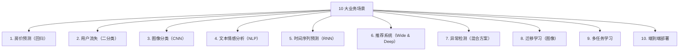

## 前置知识：场景实战是迁移的试金石

前面 9 篇笔记学了 TF 的概念、预处理、模型、特征工程、评估、集成、深度学习。本文通过 10 个真实生产场景，把这些知识串起来，让你能从"知道差异"升级到"能迁移系统"。



> [!important] 本文使用方法
> 每个场景包含：业务背景 → Sklearn 版本 → TensorFlow 版本 → 关键差异 → 生产注意事项。建议按顺序通读，重点场景动手实践。

---

## 场景 1：房价预测（回归）

### 业务背景

California Housing 数据集，预测房价中位数。连续数值特征 + 回归任务。

### Sklearn 版本

```python
import numpy as np
from sklearn.datasets import fetch_california_housing
from sklearn.model_selection import train_test_split
from sklearn.pipeline import Pipeline
from sklearn.preprocessing import StandardScaler
from sklearn.ensemble import GradientBoostingRegressor
from sklearn.metrics import mean_squared_error, r2_score

housing = fetch_california_housing()
X_train, X_test, y_train, y_test = train_test_split(
    housing.data, housing.target, test_size=0.2, random_state=42)

sk_pipe = Pipeline([
    ('scaler', StandardScaler()),
    ('model', GradientBoostingRegressor(n_estimators=100, max_depth=5, random_state=42))
])
sk_pipe.fit(X_train, y_train)
y_pred = sk_pipe.predict(X_test)
print(f"Sklearn GBT MSE: {mean_squared_error(y_test, y_pred):.4f}")
print(f"Sklearn GBT R²: {r2_score(y_test, y_pred):.4f}")
```

### TensorFlow 版本

```python
import tensorflow as tf

X_train_f = X_train.astype(np.float32)
X_test_f = X_test.astype(np.float32)
y_train_f = y_train.astype(np.float32).reshape(-1, 1)
y_test_f = y_test.astype(np.float32).reshape(-1, 1)

# 预处理层嵌入模型
normalizer = tf.keras.layers.Normalization()
normalizer.adapt(X_train_f)

model = tf.keras.Sequential([
    normalizer,
    tf.keras.layers.Dense(128, activation='relu'),
    tf.keras.layers.BatchNormalization(),
    tf.keras.layers.Dropout(0.2),
    tf.keras.layers.Dense(64, activation='relu'),
    tf.keras.layers.Dense(32, activation='relu'),
    tf.keras.layers.Dense(1)  # 回归，无激活
])
model.compile(optimizer=tf.keras.optimizers.Adam(1e-3),
              loss='mse', metrics=['mae'])
history = model.fit(X_train_f, y_train_f, epochs=100, batch_size=64,
                    validation_split=0.1, verbose=0,
                    callbacks=[tf.keras.callbacks.EarlyStopping(
                        monitor='val_loss', patience=15, restore_best_weights=True)])
loss, mae = model.evaluate(X_test_f, y_test_f, verbose=0)
y_pred_tf = model.predict(X_test_f, verbose=0).flatten()
r2 = 1 - np.var(y_test - y_pred_tf) / np.var(y_test)
print(f"TF MLP MSE: {loss:.4f}, MAE: {mae:.4f}, R²: {r2:.4f}")
```

> [!warning] 房价预测的生产坑
> 1. **特征泄漏**：不能用"售价"相关的后验特征（如成交日期后的均价）
> 2. **异常值处理**：房价数据常有极端值，用 `RobustScaler` 或 clip
> 3. **地域编码**：邮编作为类别特征用 Embedding（高基数不用 One-Hot）
> 4. **树模型通常更好**：表格数据 GBT 通常优于 MLP，小数据集尤其明显

---

## 场景 2：用户流失预测（二分类）

### Sklearn 版本

```python
from sklearn.ensemble import RandomForestClassifier
from sklearn.metrics import classification_report
from sklearn.utils.class_weight import compute_class_weight

np.random.seed(42)
n = 2000
X = np.random.randn(n, 10)
y = (X[:, 0] + X[:, 1] > 0).astype(int)
X_train, X_test, y_train, y_test = train_test_split(X, y, test_size=0.2, random_state=42)

weights = compute_class_weight('balanced', classes=np.unique(y_train), y=y_train)
class_weight = dict(enumerate(weights))

sk_clf = RandomForestClassifier(n_estimators=100, class_weight='balanced', random_state=42)
sk_clf.fit(X_train, y_train)
print(classification_report(y_test, sk_clf.predict(X_test)))
```

### TensorFlow 版本

```python
X_train_f = X_train.astype(np.float32)
X_test_f = X_test.astype(np.float32)

model = tf.keras.Sequential([
    tf.keras.layers.Dense(64, activation='relu', input_shape=(10,)),
    tf.keras.layers.Dropout(0.3),
    tf.keras.layers.Dense(32, activation='relu'),
    tf.keras.layers.Dropout(0.2),
    tf.keras.layers.Dense(1, activation='sigmoid')
])
model.compile(optimizer='adam', loss='binary_crossentropy',
              metrics=['accuracy', tf.keras.metrics.AUC(name='auc')])
model.fit(X_train_f, y_train, epochs=100, batch_size=32, verbose=0,
          validation_split=0.2, class_weight=class_weight,
          callbacks=[tf.keras.callbacks.EarlyStopping(
              monitor='val_auc', patience=10, mode='max', restore_best_weights=True)])
y_pred = (model.predict(X_test_f, verbose=0) > 0.5).astype(int).flatten()
print(classification_report(y_test, y_pred))
```

> [!warning] 流失预测的生产坑
> 1. **时间泄漏**：不能用未来的特征预测流失
> 2. **标签定义**：什么算"流失"（30 天不活跃？90 天？）
> 3. **概率校准**：输出概率需要校准（`CalibratedClassifierCV`）
> 4. **AUC > 准确率**：流失预测通常不平衡，AUC 更合适
> 5. **提前预警**：模型应预测未来 N 天的流失概率

---

## 场景 3：图像分类（CNN）

### TF 版本（Sklearn 无法做到）

```python
import tensorflow as tf
import numpy as np

(x_train, y_train), (x_test, y_test) = tf.keras.datasets.cifar10.load_data()
x_train = x_train.astype(np.float32) / 255.0
x_test = x_test.astype(np.float32) / 255.0
y_train = y_train.flatten()
y_test = y_test.flatten()

data_aug = tf.keras.Sequential([
    tf.keras.layers.RandomFlip('horizontal'),
    tf.keras.layers.RandomRotation(0.1),
])

model = tf.keras.Sequential([
    tf.keras.Input(shape=(32, 32, 3)),
    data_aug,
    tf.keras.layers.Conv2D(32, 3, padding='same', activation='relu'),
    tf.keras.layers.BatchNormalization(),
    tf.keras.layers.Conv2D(32, 3, padding='same', activation='relu'),
    tf.keras.layers.MaxPooling2D(),
    tf.keras.layers.Dropout(0.25),
    tf.keras.layers.Conv2D(64, 3, padding='same', activation='relu'),
    tf.keras.layers.BatchNormalization(),
    tf.keras.layers.Conv2D(64, 3, padding='same', activation='relu'),
    tf.keras.layers.MaxPooling2D(),
    tf.keras.layers.Dropout(0.25),
    tf.keras.layers.GlobalAveragePooling2D(),
    tf.keras.layers.Dense(128, activation='relu'),
    tf.keras.layers.Dropout(0.5),
    tf.keras.layers.Dense(10, activation='softmax')
])
model.compile(optimizer='adam', loss='sparse_categorical_crossentropy', metrics=['accuracy'])
model.fit(x_train, y_train, batch_size=64, epochs=30,
          validation_split=0.1, verbose=0,  # 从训练集切验证集；用 x_test 会因 EarlyStopping 泄漏测试集
          callbacks=[tf.keras.callbacks.EarlyStopping(patience=10, restore_best_weights=True)])
loss, acc = model.evaluate(x_test, y_test, verbose=0)
print(f"CIFAR-10 准确率: {acc:.4f}")
```

> [!important] 图像分类是 TF 的绝对优势领域
> Sklearn 无法做 CNN。图像数据需要保留空间结构，全连接层展平后丢失了局部模式信息。CNN 用卷积核直接在原始图像上提取空间特征。

---

## 场景 4：文本情感分析（NLP）

### TF 版本（Sklearn 只能用 TF-IDF + NB）

```python
import tensorflow as tf

vocab_size = 10000
max_len = 200
(x_train, y_train), (x_test, y_test) = tf.keras.datasets.imdb.load_data(num_words=vocab_size)
# 版本注：Keras 3（TF ≥ 2.16）中 pad_sequences 移至 tf.keras.utils.pad_sequences
x_train = tf.keras.preprocessing.sequence.pad_sequences(x_train, maxlen=max_len)
x_test = tf.keras.preprocessing.sequence.pad_sequences(x_test, maxlen=max_len)

model = tf.keras.Sequential([
    tf.keras.layers.Embedding(vocab_size, 128, input_length=max_len),
    tf.keras.layers.Bidirectional(tf.keras.layers.LSTM(64, dropout=0.2)),
    tf.keras.layers.Dense(64, activation='relu'),
    tf.keras.layers.Dropout(0.5),
    tf.keras.layers.Dense(1, activation='sigmoid')
])
model.compile(optimizer='adam', loss='binary_crossentropy', metrics=['accuracy'])
model.fit(x_train, y_train, batch_size=128, epochs=5,
          validation_split=0.1,  # 从训练集切验证集；用 x_test 会因 EarlyStopping 泄漏测试集
          callbacks=[tf.keras.callbacks.EarlyStopping(patience=2, restore_best_weights=True)])
loss, acc = model.evaluate(x_test, y_test, verbose=0)
print(f"IMDB 准确率: {acc:.4f}")
```

> [!tip] Sklearn 文本分类对比
> Sklearn 用 `TfidfVectorizer + LogisticRegression`，效果通常比 LSTM 低 3-5%，但训练快 100 倍。小数据集用 Sklearn，大数据集用 TF。

---

## 场景 5：时间序列预测（RNN）

### TF 版本（Sklearn 无 LSTM/GRU）

```python
import tensorflow as tf
import numpy as np

t = np.linspace(0, 100, 1000)
series = np.sin(t) + np.random.randn(1000) * 0.1

def create_dataset(series, window_size=20):
    X, y = [], []
    for i in range(len(series) - window_size):
        X.append(series[i:i+window_size])
        y.append(series[i+window_size])
    return np.array(X)[..., np.newaxis].astype(np.float32), np.array(y).astype(np.float32)

X, y = create_dataset(series)
split = int(0.8 * len(X))
X_train, X_test = X[:split], X[split:]
y_train, y_test = y[:split], y[split:]

model = tf.keras.Sequential([
    tf.keras.layers.LSTM(32, input_shape=(20, 1)),
    tf.keras.layers.Dense(16, activation='relu'),
    tf.keras.layers.Dense(1)
])
model.compile(optimizer='adam', loss='mse', metrics=['mae'])
model.fit(X_train, y_train, epochs=20, validation_data=(X_test, y_test),
          batch_size=32, verbose=0,
          callbacks=[tf.keras.callbacks.EarlyStopping(patience=10, restore_best_weights=True)])
loss, mae = model.evaluate(X_test, y_test, verbose=0)
print(f"TF LSTM MAE: {mae:.4f}")
```

> [!important] 时间序列是 RNN 的核心场景
> Sklearn 的替代方案是 `RandomForestRegressor` + 滞后特征工程，但不如 RNN 自然。RNN 保留时间维度 `(batch, timesteps, features)`，能建模历史窗口与未来值的关系。

---

## 场景 6：推荐系统（Wide & Deep）

### TF 版本（Sklearn 完全做不到）

```python
import tensorflow as tf
import numpy as np

n_users, n_movies = 1000, 5000
n_samples = 5000
user_ids = np.random.randint(0, n_users, n_samples)
movie_ids = np.random.randint(0, n_movies, n_samples)
ratings = np.random.randint(1, 6, n_samples).astype(np.float32) / 5.0

# Wide & Deep 模型
user_input = tf.keras.Input(shape=(1,), dtype=tf.int32, name='user')
movie_input = tf.keras.Input(shape=(1,), dtype=tf.int32, name='movie')

user_emb = tf.keras.layers.Embedding(n_users, 32)(user_input)
movie_emb = tf.keras.layers.Embedding(n_movies, 32)(movie_input)

# Wide 部分：点积（协同过滤记忆）
wide = tf.keras.layers.Dot(axes=2)([user_emb, movie_emb])
wide = tf.keras.layers.Flatten()(wide)

# Deep 部分：Embedding 拼接 + MLP（泛化）
deep = tf.keras.layers.Concatenate()([
    tf.keras.layers.Flatten()(user_emb),
    tf.keras.layers.Flatten()(movie_emb)
])
deep = tf.keras.layers.Dense(64, activation='relu')(deep)
deep = tf.keras.layers.Dropout(0.3)(deep)
deep = tf.keras.layers.Dense(32, activation='relu')(deep)

# Wide + Deep 融合
combined = tf.keras.layers.Concatenate()([wide, deep])
output = tf.keras.layers.Dense(1, activation='sigmoid')(combined)

model = tf.keras.Model(inputs=[user_input, movie_input], outputs=output)
model.compile(optimizer='adam', loss='mse', metrics=['mae'])
model.fit({'user': user_ids, 'movie': movie_ids}, ratings,
          epochs=10, batch_size=256, validation_split=0.2, verbose=0)
```

> [!important] Wide & Deep 是推荐系统的核心架构
> Wide 部分学习特征交叉（记忆能力），Deep 部分通过 Embedding 泛化到没见过的组合。两者联合训练，比 Sklearn 的独立模型集成更深入。这是 Google Play 和 Google App 推荐的核心架构。

---

## 场景 7：异常检测（混合方案）

### Sklearn IsolationForest（推荐主力）

```python
from sklearn.ensemble import IsolationForest
from sklearn.metrics import classification_report

np.random.seed(42)
X_normal = np.random.randn(9500, 10).astype(np.float32) * 0.5
X_fraud = np.random.randn(500, 10).astype(np.float32) * 3 + 5
X = np.vstack([X_normal, X_fraud])
y = np.array([0]*9500 + [1]*500)

iso = IsolationForest(contamination=0.05, random_state=42)
pred_sk = (iso.fit_predict(X) == -1).astype(int)
print("IsolationForest:")
print(classification_report(y, pred_sk))
```

### TF Autoencoder（深度学习方案）

```python
# 仅用正常样本训练
X_normal_f = X_normal.astype(np.float32)

autoencoder = tf.keras.Sequential([
    tf.keras.layers.Dense(8, activation='relu', input_shape=(10,)),
    tf.keras.layers.Dense(4, activation='relu'),  # 压缩层
    tf.keras.layers.Dense(8, activation='relu'),  # 解码
    tf.keras.layers.Dense(10, activation='linear')  # 重建
])
autoencoder.compile(optimizer='adam', loss='mse')
autoencoder.fit(X_normal_f, X_normal_f, epochs=50, batch_size=256, verbose=0)

# 重建误差大 → 异常
recon = autoencoder.predict(X, verbose=0)
errors = np.mean(np.square(X - recon), axis=1)
threshold = np.percentile(errors, 95)
pred_tf = (errors > threshold).astype(int)
print("Autoencoder:")
print(classification_report(y, pred_tf))
```

> [!tip] 异常检测推荐混合策略
> - **小数据集 / 表格数据**：Sklearn IsolationForest（快速、跨平台、无需标签）
> - **大数据集 / 复杂数据**：TF Autoencoder（能学习复杂模式）
> - **生产环境**：两者集成（投票）

---

## 场景 8：迁移学习（图像分类）

### TF 版本（Sklearn 无预训练模型）

```python
import tensorflow as tf

# 1. 加载预训练 ResNet50（不含分类头）
base_model = tf.keras.applications.ResNet50(
    weights='imagenet', include_top=False, input_shape=(224, 224, 3))
base_model.trainable = False  # 冻结

# 2. 添加新分类头
model = tf.keras.Sequential([
    base_model,
    tf.keras.layers.GlobalAveragePooling2D(),
    tf.keras.layers.Dense(256, activation='relu'),
    tf.keras.layers.Dropout(0.5),
    tf.keras.layers.Dense(10, activation='softmax')
])

# 3. 特征提取阶段（较大学习率）
model.compile(optimizer=tf.keras.optimizers.Adam(1e-3),
              loss='sparse_categorical_crossentropy', metrics=['accuracy'])
model.fit(train_ds, epochs=10, validation_data=val_ds)

# 4. 微调阶段（解冻 + 极小学习率）
base_model.trainable = True
for layer in base_model.layers[:-20]:
    layer.trainable = False  # 仅解冻最后 20 层
model.compile(optimizer=tf.keras.optimizers.Adam(1e-5),
              loss='sparse_categorical_crossentropy', metrics=['accuracy'])
model.fit(train_ds, epochs=5, validation_data=val_ds)
```

> [!important] 迁移学习是深度学习的核心范式
> 用 ImageNet 上训练的预训练模型，1000 张图片就能达到从头训练 100 万张图片的精度。Sklearn 没有预训练模型的概念。

---

## 场景 9：多任务学习

### TF 版本（Sklearn 无对应）

```python
import tensorflow as tf
import numpy as np

n = 1000
X = np.random.randn(n, 50).astype(np.float32)
y_age = np.random.randint(18, 70, n).astype(np.float32)
y_gender = np.random.randint(0, 2, n).astype(np.float32)

# 共享层 + 多输出
input_layer = tf.keras.Input(shape=(50,))
shared = tf.keras.layers.Dense(128, activation='relu')(input_layer)
shared = tf.keras.layers.Dense(64, activation='relu')(shared)
shared = tf.keras.layers.Dropout(0.3)(shared)

# 任务 1：年龄回归
age_out = tf.keras.layers.Dense(32, activation='relu')(shared)
age_out = tf.keras.layers.Dense(1, name='age')(age_out)

# 任务 2：性别分类
gender_out = tf.keras.layers.Dense(32, activation='relu')(shared)
gender_out = tf.keras.layers.Dense(1, activation='sigmoid', name='gender')(gender_out)

model = tf.keras.Model(inputs=input_layer, outputs=[age_out, gender_out])
model.compile(
    optimizer='adam',
    loss={'age': 'mse', 'gender': 'binary_crossentropy'},
    loss_weights={'age': 0.3, 'gender': 1.0},
    metrics={'age': 'mae', 'gender': 'accuracy'}
)
model.fit(X, {'age': y_age, 'gender': y_gender}, epochs=30,
          validation_split=0.2, verbose=0)
```

> [!tip] 多任务学习的价值
> 多个相关任务共享底层特征表示，提高泛化能力。例如同时预测用户流失（分类）和未来消费金额（回归），共享层互相增强。

---

## 场景 10：端到端部署（SavedModel + TF Serving）

### Sklearn 部署（Flask + pickle）

```python
import joblib
# 需分别保存 scaler + model
joblib.dump(sk_pipe, 'sk_model.pkl')

# Flask 部署（需手动管理 scaler）
from flask import Flask, request, jsonify
app = Flask(__name__)
model = joblib.load('sk_model.pkl')

@app.route('/predict', methods=['POST'])
def predict():
    data = np.array(request.json['data'])
    return jsonify({'prediction': model.predict(data).tolist()})
```

### TF 部署（TF Serving / TFLite / TF.js）

```python
# 1. 保存 SavedModel（预处理层已嵌入）
model.save('tf_saved_model/')

# 2. TF Serving 部署（Docker 一行启动）
# docker run -p 8501:8501 \
#   -v "$(pwd)/tf_saved_model:/models/my_model" \
#   -e MODEL_NAME=my_model \
#   tensorflow/serving

# 3. HTTP 推理
import requests, json
data = np.random.randn(10, 10).astype(np.float32).tolist()
payload = {"instances": data}
response = requests.post(
    "http://localhost:8501/v1/models/my_model:predict",
    data=json.dumps(payload),
    headers={'Content-Type': 'application/json'})
predictions = response.json()['predictions']
print(f"推理结果: {predictions}")

# 4. 移动端部署（TFLite）
converter = tf.lite.TFLiteConverter.from_saved_model('tf_saved_model/')
tflite_model = converter.convert()
with open('model.tflite', 'wb') as f:
    f.write(tflite_model)

# 5. 浏览器部署（TF.js）
# !tensorflowjs_converter --input_format=tf_saved_model tf_saved_model web_model
```

| 部署维度 | Sklearn | TensorFlow |
|----------|:---:|:---:|
| Python API 服务 | Flask/FastAPI | TF Serving / Flask |
| 跨语言推理 | ❌ | ✅ C++/Java/Go |
| 移动端 | ❌ | ✅ TFLite |
| 浏览器 | ❌ | ✅ TF.js |
| 预处理一致性 | ⚠️ 需分别保存 scaler | ✅ 预处理层随模型保存 |
| 批量推理 | 手动 | TF Serving 内置 |
| 模型量化 | ❌ | ✅ 减小体积 |
| 版本管理 | 手动 | TF Serving 内置 |

> [!important] 部署是 TF 的核心优势
> TF SavedModel 包含预处理层，部署时只需加载一个模型。TF Serving 提供 Docker 一行启动的生产级服务。TFLite 支持移动端。这些 Sklearn 都没有。

---

## 场景速查表

| # | 场景 | 任务类型 | Sklearn 方案 | TF 方案 | 核心差异 |
|---|------|---------|------------|---------|---------|
| 1 | 房价预测 | 回归 | GBT + StandardScaler | MLP + Normalization 层 | 预处理嵌入模型 |
| 2 | 用户流失 | 二分类 | RandomForest + class_weight | MLP + Dropout + AUC | 早停 + 学习率调度 |
| 3 | 图像分类 | 多分类 | ❌ 无法做 | CNN (Conv2D) | 保留空间结构 |
| 4 | 文本情感 | 二分类 | TF-IDF + LogisticRegression | Embedding + LSTM | 序列表示替代词袋 |
| 5 | 时间序列 | 回归 | RandomForestRegressor + 滞后特征 | LSTM | 保留时间依赖 |
| 6 | 推荐系统 | 回归/分类 | ❌ 无法做 | Wide & Deep | 联合训练 + Embedding |
| 7 | 异常检测 | 无监督 | IsolationForest | Autoencoder | 深度重构检测 |
| 8 | 迁移学习 | 多分类 | ❌ 无预训练模型 | ResNet50 冻结→微调 | 1000 张图片达到 100 万张效果 |
| 9 | 多任务 | 多输出 | ❌ 无对应 | 共享层 + 多输出 | 任务间互相增强 |
| 10 | 部署 | 推理服务 | Flask + pickle | TF Serving / TFLite / TF.js | 预处理层随模型 |

---

## 🧪 本章练习

---

### 🟢 练习 1：房价回归迁移（20 分钟）

**题目**：用 California Housing 数据集，分别用 Sklearn GBT 和 TF MLP 实现，对比 R²。

**验收标准**：
- [ ] 两种方法 R² 差距 < 0.1
- [ ] TF 模型预处理层嵌入

---

### 🟢 练习 2：用户流失分类（25 分钟）

**题目**：用不均衡数据集，分别用 Sklearn RandomForest 和 TF Keras 实现，对比 F1。

**验收标准**：
- [ ] 使用 `class_weight` 处理不均衡
- [ ] 报告 F1 分数

---

### 🟡 练习 3：CNN 图像分类（30 分钟）

**题目**：用 CIFAR-10 数据集训练 CNN，加数据增强 + BatchNorm，准确率 > 70%。

**验收标准**：
- [ ] 准确率 > 70%
- [ ] 使用数据增强层

---

### 🟡 练习 4：LSTM 文本分类（25 分钟）

**题目**：用 IMDB 数据集训练 Bidirectional LSTM 情感分析，准确率 > 85%。

**验收标准**：
- [ ] 准确率 > 85%
- [ ] 使用 Bidirectional LSTM

---

### 🔴 练习 5：Wide & Deep 推荐系统（40 分钟）

**题目**：模拟推荐系统数据，用 Wide & Deep 架构训练模型，验证 Wide 和 Deep 部分正确融合。

**验收标准**：
- [ ] Wide 和 Deep 部分正确融合
- [ ] 使用 Embedding 层

---

### 🔴 练习 6：端到端部署（40 分钟）

**题目**：训练一个 TF 模型（含预处理层），保存为 SavedModel，用 TF Serving Docker 部署，用 curl 测试推理。

**验收标准**：
- [ ] TF Serving 成功启动
- [ ] HTTP 推理请求返回正确结果
- [ ] 预处理层随模型保存

---

## 🎯 本文学完自检

| 层次 | 检查项 |
|------|--------|
| 🟢 基础 | 能用 TF 完成回归/分类场景的迁移 |
| 🟡 进阶 | 能用 CNN 做图像分类，用 Embedding+LSTM 做文本分类和时间序列 |
| 🔴 挑战 | 能用 Wide & Deep 做推荐系统，能用迁移学习微调预训练模型，能用 TF Serving 部署 |

---

## 相关笔记

- ⬅️ 前置：[[09-CNN与RNN-TF独有领域]]
- ➡️ 后续：[[11-面试高频20问-Sklearn背景版]]
- 🔗 关联：[[03-传统ML模型迁移]] · [[06-集成学习与模型融合对比]]
- 🔗 关联：[[07-双向对比-Sklearn有TF无与TF有Sklearn无]]
- 🔗 练习：[[v1-基础回归分类迁移]] · [[v5-端到端ML项目]]

---
*创建时间：2026-07-25*