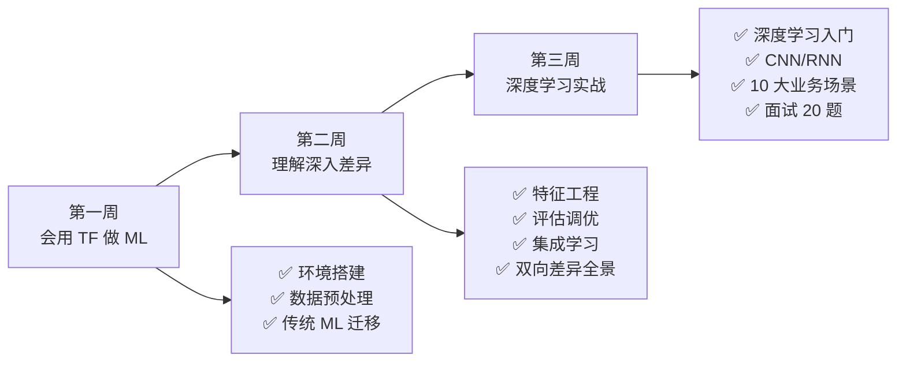

## 第三周回顾：实战应用

**目标**：能用 TF 做深度学习（MLP/CNN/RNN/迁移学习/Wide & Deep），应对生产场景和面试

**覆盖笔记**：[[08-深度学习入门-从MLP到Keras]] · [[09-CNN与RNN-TF独有领域]] · [[01-学习/TensorflowLearningBySklearn/10-业务场景实战合集]] · [[11-面试高频20问-Sklearn背景版]]

---

## 一、核心知识点检查清单

| # | 检查项 | 对应笔记 | 自评 |
|---|--------|---------|:---:|
| 1 | 能将 MLPClassifier 参数完整映射到 Keras Sequential | 08 | ⭐⭐⭐⭐⭐ |
| 2 | 知道 Sequential / Functional / Subclass 三种 API 的区别和适用场景 | 08 | ⭐⭐⭐⭐⭐ |
| 3 | 能用 Dropout + BatchNorm 构建正则化模型 | 08 | ⭐⭐⭐⭐⭐ |
| 4 | 能用 Functional API 实现残差连接 | 08 | ⭐⭐⭐⭐ |
| 5 | 能实现自定义 Layer（含 `get_config`） | 08 | ⭐⭐⭐⭐ |
| 6 | 能完成预训练 ResNet50 的迁移学习（冻结 + 微调） | 08 | ⭐⭐⭐⭐⭐ |
| 7 | 能说出 Conv2D 的 filters / kernel_size / strides / padding 含义 | 09 | ⭐⭐⭐⭐⭐ |
| 8 | 能构建完整的 CNN 分类模型（数据增强 + BN + Dropout） | 09 | ⭐⭐⭐⭐ |
| 9 | 能说出 LSTM 3 个门的作用 | 09 | ⭐⭐⭐⭐⭐ |
| 10 | 能用 Embedding + Bidirectional LSTM 做文本分类 | 09 | ⭐⭐⭐⭐⭐ |
| 11 | 能用 LSTM 做时间序列预测 | 09 | ⭐⭐⭐⭐ |
| 12 | 能用 CNN+RNN 组合架构 | 09 | ⭐⭐⭐⭐ |
| 13 | 能用 Wide & Deep 架构做推荐系统 | 10 | ⭐⭐⭐⭐ |
| 14 | 能用 TF Serving 部署模型（Docker） | 10 | ⭐⭐⭐⭐ |
| 15 | 能回答面试 20 题中的 15 题 | 11 | ⭐⭐⭐⭐⭐ |

> [!tip] 评估标准
> - **通过 12/15 项以上**（≥4 分）：三周学习目标达成，达到中级水平
> - **通过 10-12 项**：建议重做 09 篇的 CNN/RNN 练习
> - **通过 < 10 项**：建议重读 08-09 篇并完成所有 🟢 练习

---

## 二、概念自测题（10 题，答对 7 题达标）

**Q1**：Keras 的三种建模方式各适用于什么场景？

<details>
<summary>💡 答案</summary>

Sequential：简单线性模型（一键堆叠）。Functional：多输入/输出、残差连接、共享层（90% 场景推荐）。Subclass：完全自定义训练逻辑（研究级）。
</details>

**Q2**：Dropout 机制是什么？为什么能防过拟合？

<details>
<summary>💡 答案</summary>

训练时随机失活部分神经元（按 rate），推理时所有神经元工作。每次前向传播相当于训练不同的"子网络"，近似 Bagging 集成。在 Subclass 中需手动传 `training=True/False`。
</details>

**Q3**：BatchNorm 放在哪里？为什么？

<details>
<summary>💡 答案</summary>

推荐 `Dense → BN → Activation`（激活前）。BN 稳定线性输出的分布，再经过激活函数引入非线性。现代实践倾向先 BN。注意 BN 依赖 batch 统计量，`batch_size < 16` 时效果差，小 batch 用 `LayerNormalization` 替代。
</details>

**Q4**：残差连接解决了什么问题？

<details>
<summary>💡 答案</summary>

深层网络训练时梯度消失——梯度在反向传播中逐层衰减，浅层权重几乎不更新。残差连接让梯度通过跳跃连接直接流过，使训练 100+ 层网络成为可能。类比 GBDT 中每棵树拟合前一轮残差。
</details>

**Q5**：CNN 的卷积核、filters、感受野分别是什么？

<details>
<summary>💡 答案</summary>

卷积核：K×K 权重矩阵在输入上滑动做局部操作。filters：卷积核的数量 = 输出通道数。感受野：输出特征图上一个点对应输入图像的区域大小。深层网络 = 大感受野 = 能看更大范围。
</details>

**Q6**：LSTM 的三个门各自做什么？

<details>
<summary>💡 答案</summary>

遗忘门：决定丢弃什么旧信息。输入门：决定添加什么新信息。输出门：决定输出什么到隐状态。单元状态是"长期记忆 conveyor belt"。
</details>

**Q7**：迁移学习的两个阶段是什么？学习率怎么设？

<details>
<summary>💡 答案</summary>

特征提取阶段：冻结基础层，训练新分类头，学习率 1e-3（新层随机初始化，需快速收敛）。微调阶段：解冻部分层，极小学习率 1e-5（防止破坏预训练权重）。差 10-100 倍。
</details>

**Q8**：为什么 Embedding 比 One-Hot 更适合高基数类别特征？

<details>
<summary>💡 答案</summary>

1. 维度更低（可配置 vs = 类别数 N）2. 可学习语义相近性 3. 参数量少 4. 稠密表示计算高效。经验公式 $d = \min(50, \sqrt[4]{N})$。
</details>

**Q9**：Wide & Deep 的 Wide 和 Deep 部分各自做什么？

<details>
<summary>💡 答案</summary>

Wide：线性模型，学习频繁出现的特征交叉（记忆能力）。Deep：Embedding + MLP，泛化到没见过的特征组合（泛化能力）。两者联合训练，共享损失函数——这比 Sklearn 的 Voting/Stacking（独立训练后合并）更深入。
</details>

**Q10**：TF Serving 部署相比 Flask + pickle 有什么优势？

<details>
<summary>💡 答案</summary>

1. 预处理一致性（SavedModel 包含预处理层）2. 跨语言（C++/Java/Go）3. 版本管理内置 4. 请求批处理内置 5. Docker 一行启动。对比 Sklearn 需分别保存 scaler 和模型。
</details>

---

## 三、代码填空练习（15 分钟）

### 填空 1：CNN 模型

```python
model = tf.keras.Sequential([
    tf.keras.Input(shape=(32, 32, 3)),
    tf.keras.layers.____(32, (3, 3), activation='relu', padding='same'),
    tf.keras.layers.____(),
    tf.keras.layers.Conv2D(64, (3, 3), activation='relu'),
    tf.keras.layers.____((2, 2)),
    tf.keras.layers.____(),  # 替代 Flatten，减少参数量
    tf.keras.layers.Dense(128, activation='relu'),
    tf.keras.layers.____(0.5),
    tf.keras.layers.Dense(10, activation=____)
])
```

<details>
<summary>💡 答案</summary>

`Conv2D`, `BatchNormalization`, `MaxPooling2D`, `GlobalAveragePooling2D`, `Dropout`, `'softmax'`
</details>

### 填空 2：LSTM 文本分类

```python
model = tf.keras.Sequential([
    tf.keras.layers.____(10000, 128, input_length=200),
    tf.keras.layers.____(tf.keras.layers.LSTM(64, dropout=0.2)),
    tf.keras.layers.Dense(64, activation='relu'),
    tf.keras.layers.____(0.5),
    tf.keras.layers.Dense(1, activation=____)
])
```

<details>
<summary>💡 答案</summary>

`Embedding`, `Bidirectional`, `Dropout`, `'sigmoid'`
</details>

### 填空 3：迁移学习

```python
base_model = tf.keras.applications.____(weights='imagenet', include_top=____)
base_model.____ = False  # 冻结

model = tf.keras.Sequential([
    base_model,
    tf.keras.layers.____(),
    tf.keras.layers.Dense(256, activation='relu'),
    tf.keras.layers.Dense(10, activation='softmax')
])
# 特征提取
model.compile(optimizer=tf.keras.optimizers.Adam(____))  # 较大学习率
# 微调
base_model.____ = True  # 解冻
model.compile(optimizer=tf.keras.optimizers.Adam(____))  # 极小学习率
```

<details>
<summary>💡 答案</summary>

`ResNet50`, `False`, `trainable`, `GlobalAveragePooling2D`, `1e-3`, `trainable`, `1e-5`
</details>

---

## 四、错误诊断（15 分钟）

### 错误 1：Subclass 模型中 Dropout 忘记传 training

```python
class MyModel(tf.keras.Model):
    def call(self, inputs):  # ← 缺少 training 参数
        x = self.dropout(x)  # ← 忘记传 training
```

<details>
<summary>🔍 诊断</summary>

Dropout 在训练和推理时行为不同。自定义 `call()` 需要接收 `training` 参数并传给 Dropout/BatchNorm：`def call(self, inputs, training=False)`。
</details>

### 错误 2：微调学习率过大

```python
base_model.trainable = True
model.compile(optimizer=tf.keras.optimizers.Adam(1e-3))  # ← 学习率太大
```

<details>
<summary>🔍 诊断</summary>

微调阶段学习率应为 1e-5 或更小。1e-3 会破坏预训练权重。微调是在预训练基础上微调，不能大幅改变权重。
</details>

### 错误 3：CNN 输入数据未归一化

```python
(x_train, y_train), _ = tf.keras.datasets.cifar10.load_data()
model.fit(x_train, y_train)  # ← 像素值 0-255，未归一化
```

<details>
<summary>🔍 诊断</summary>

图像像素值 0-255 范围太大，导致梯度爆炸或训练不稳定。需要 `x_train = x_train.astype('float32') / 255.0`。
</details>

### 错误 4：堆叠多层 RNN 忘记 return_sequences

```python
tf.keras.layers.Bidirectional(tf.keras.layers.LSTM(64))  # ← 只返回最后一步
tf.keras.layers.Bidirectional(tf.keras.layers.LSTM(32))  # ← 期望输入是序列，报错
```

<details>
<summary>🔍 诊断</summary>

堆叠多层 RNN 时，中间层需要 `return_sequences=True` 返回完整序列。只有最后一层可以 `return_sequences=False`（默认）。
</details>

---

## 五、完整面试模拟（30 分钟）

> 模拟 5 个面试官高频问题，不看笔记回答，找朋友或 AI 模拟追问。

**面试官 1**："Sklearn 和 TensorFlow 的核心区别是什么？你什么时候用哪个？"

**面试官 2**："你如何把 Sklearn 的 Pipeline 迁移到 TensorFlow？预处理层嵌入模型有什么好处？"

**面试官 3**："解释一下 CNN 的卷积核是怎么工作的。Sklearn 为什么不能做 CNN？"

**面试官 4**："你做过迁移学习吗？冻结和微调的策略是什么？"

**面试官 5**："设计一个从数据到部署的端到端 ML 系统。你的技术选型是什么？"

**验收标准**：
- [ ] 5 题都能流畅回答，每道题能答出 2-3 个核心要点
- [ ] 能做到"先 Sklearn 视角 → 再 TF 视角 → 最后差异和选择建议"
- [ ] 被追问时不卡壳

---

## 六、三周总回顾

### 能力成长曲线



### 三周总览对照

| 能力维度 | 学习前（仅 Sklearn） | 学习后（Sklearn + TF） |
|---------|-------------------|---------------------|
| 传统 ML 建模 | ✅ 熟练 | ✅ 熟练（不变） |
| 深度学习建模 | ❌ 不会 | ✅ MLP/CNN/RNN/迁移学习 |
| 特征工程 | ✅ Pipeline | ✅ Keras 预处理层 + Functional API |
| 模型评估 | ✅ cross_val_score | ✅ KerasTuner + 手动 K-Fold |
| 模型集成 | ✅ Voting/Stacking | ✅ Wide & Deep + 知识蒸馏 |
| GPU 训练 | ❌ 不会 | ✅ 原生 GPU 加速 |
| 图像分类 | ❌ 无法做 | ✅ CNN + 迁移学习 |
| 文本分类 | ❌ 仅 TF-IDF | ✅ Embedding + LSTM/GRU |
| 时间序列 | ❌ 滞后特征 | ✅ LSTM 序列建模 |
| 推荐系统 | ❌ 无法做 | ✅ Wide & Deep |
| 生产部署 | ✅ Flask | ✅ TF Serving / TFLite / TF.js |
| 面试准备 | ✅ Sklearn | ✅ Sklearn + TF 双视角 |

---

## 七、三周总迁移速查表

| 操作 | Sklearn | TensorFlow |
|------|---------|-----------|
| **安装** | `pip install scikit-learn` | `pip install tensorflow` |
| **数据类型** | `numpy.ndarray` | `tf.Tensor` / `tf.Variable` |
| **标准化** | `StandardScaler` | `Normalization` 层 + `adapt()` |
| **One-Hot** | `OneHotEncoder` | `StringLookup(one_hot)` |
| **Embedding** | ❌ | `Embedding` 层（可学习） |
| **Pipeline** | `Pipeline` | `tf.data` + Keras 预处理层 |
| **线性回归** | `LinearRegression` | `Dense(1)` |
| **逻辑回归** | `LogisticRegression` | `Dense(1, sigmoid)` |
| **L2 正则** | `Ridge(alpha)` | `kernel_regularizer=l2(λ)` |
| **MLP** | `MLPClassifier` | `Sequential([Dense...])` |
| **CNN** | ❌ | `Conv2D + MaxPooling2D` |
| **RNN** | ❌ | `LSTM / GRU / Bidirectional` |
| **交叉验证** | `cross_val_score` | 手动 K-Fold |
| **超参搜索** | `GridSearchCV` | `KerasTuner` |
| **学习率调度** | ❌ | `ReduceLROnPlateau` |
| **早停** | `MLPClassifier(early_stopping=True)` | `EarlyStopping` callback |
| **训练可视化** | ❌ | `TensorBoard` |
| **RandomForest** | `RandomForestClassifier` | `tfdf.keras.RandomForestModel` |
| **Wide & Deep** | ❌ | Functional API |
| **迁移学习** | ❌ | ResNet50 冻结→微调 |
| **保存模型** | `joblib.dump` | `model.save()` |
| **部署** | Flask + pickle | TF Serving / TFLite / TF.js |

---

## 八、完成毕业项目指南

毕业项目 v1→v5 是递进式版本，从"能跑通"到"可部署"：

| 版本 | 目标 | 对应笔记 | 预计时间 |
|------|------|---------|:---:|
| [[v1-基础回归分类迁移]] | 替代 Sklearn 的 LinearRegression/LogisticRegression | 03 | 1.5h |
| [[v2-数据管道与特征工程]] | 替代 Pipeline + ColumnTransformer | 02/04 | 2h |
| [[v3-模型评估与超参调优]] | 替代 GridSearchCV + cross_val_score | 05 | 2h |
| [[v4-深度学习入门]] | 替代 MLPClassifier，入门 CNN | 08/09 | 2.5h |
| [[v5-端到端ML项目]] | 完整 ML 系统（数据→部署） | 09/10/11 | 3h |

**能力评估**：
- 完成 **v1+v2+v3** = **中级**（能用 TF 独立完成 ML 任务）
- 完成 **v4** = **高级**（能处理深度学习任务）
- 完成 **v5** = **专家级**（能设计端到端 ML 系统并部署）

---

## 九、后续迭代建议

> [!tip] 迭代路线图
> 1. **短期**（1-2 周）：完成 v1→v5 毕业项目，巩固三周学习成果
> 2. **中期**（1-3 个月）：用 TF 重写一个实际的 Sklearn 项目，遇到问题回查笔记
> 3. **长期**（3-6 个月）：学习 Transformer（BERT/GPT）、RL（强化学习）、GAN（生成式模型）
> 4. **进阶**：研究 TFX（端到端 ML 流水线）、分布式训练（MultiWorkerMirroredStrategy）
> 5. **交叉**：结合 [[GoLearningByPython/00-Go 总览索引（Python 迁移版）|Go]]、[[TypeScriptLearningByPython/00-TypeScript 总览索引（Python 迁移版）|TypeScript]] 等路径，构建全栈 ML 工程能力

> [!important] 最重要的事
> **用 TF 做项目**。找一个小项目（如 Kaggle 竞赛、个人项目），用 TF 完整实现一遍。遇到问题回查笔记，这是最高效的学习方式。

---

## 相关笔记

- ⬅️ 前置：[[08-深度学习入门-从MLP到Keras]] · [[09-CNN与RNN-TF独有领域]] · [[01-学习/TensorflowLearningBySklearn/10-业务场景实战合集]] · [[11-面试高频20问-Sklearn背景版]]
- 🔗 关联：[[00-TensorFlow 总览索引（Sklearn 迁移版）]]
- 🔗 关联：[[01-学习/TensorflowLearningBySklearn/99-第一周复习检查点|99-第一周复习检查点]] · [[01-学习/TensorflowLearningBySklearn/99-第二周复习检查点|99-第二周复习检查点]]
- 🔗 毕业项目：[[v1-基础回归分类迁移]] · [[v2-数据管道与特征工程]] · [[v3-模型评估与超参调优]] · [[v4-深度学习入门]] · [[v5-端到端ML项目]]

---
*创建时间：2026-07-25*