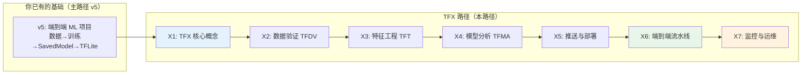
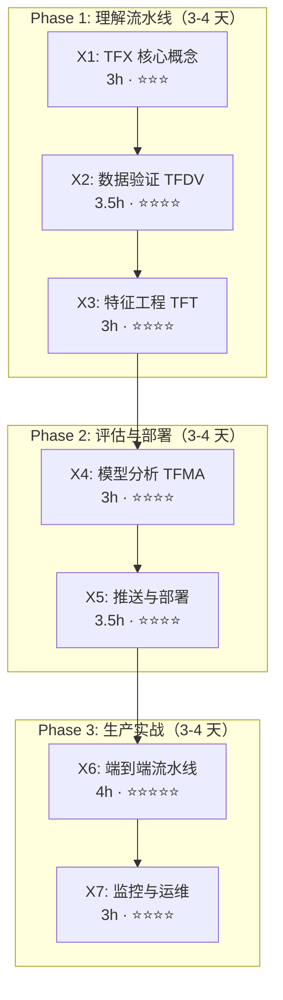
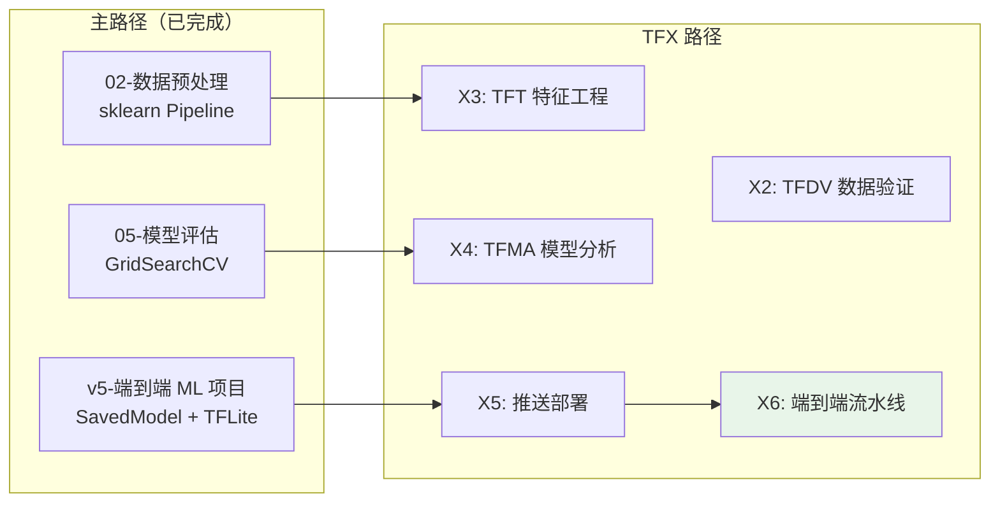

> [!info] 版本基线
> TFX 1.15.x + TensorFlow 2.15（tf.keras，Keras 2 语义；Keras 3 与 TFX 尚未完全兼容）。示例使用 /data、/pipeline 等 Linux 路径，Windows 用户请在 WSL2/Docker 中运行（与主路径 01 篇的环境说明一致）。
>
> 🔄 **2026-09 版本口径**：TFX 当前已到 **1.21**（2026-06，官方兼容矩阵配 TensorFlow 2.21、**Python 3.10–3.13**）。本路径基线 1.15 + TF 2.15 定位为 **Legacy 教学线**：流水线组件、Artifact 血缘、编排与推送概念在 1.21 上仍然成立、可直接迁移。⚠️ 请勿在主 Python 环境（如 3.14）安装——用 uv/venv/Docker 单独隔离一个 Python 3.12/3.13 环境。

## 前置知识：为什么需要 TFX

你已经完成了主路径，能用 `model.save('model')` 导出 SavedModel，用 TFLite 做推理。但生产环境不是"导出模型 → 加载模型"这么简单：

- 数据分布漂移了怎么办？
- 模型效果下降怎么自动检测？
- 如何做到每次代码提交自动训练 + 评估 + 部署？
- 多个模型版本怎么管理？

**TFX（TensorFlow Extended）是 Google 开源的生产级 ML 流水线框架**，把"训练→评估→部署"变成可复现、可监控的自动化流水线。

> [!important] TFX 路径与主路径的关系
> - **主路径 v5**：让你能把单个模型从训练到导出跑通
> - **本路径**：让你能构建自动化、可复现、可监控的生产级 ML 流水线
> - **Transformer 路径**：TFX 流水线可以部署 Transformer 模型
> - **分布式训练路径**：TFX 流水线可以在多机上分布式训练

---

## 一、课程清单

| # | 笔记 | 核心内容 | 差异等级 | 建议学时 |
|---|------|---------|---------|---------|
| X0 | [[X0-TFX 路径总览]] | 本文件：课程清单 + 路线图 | — | 0.5h |
| X1 | [[X1-TFX 核心概念与架构]] | TFX 是什么 / 组件化设计 / DAG 流水线 / 与 Kubeflow 对比 / 安装 | ⭐⭐⭐ 高 | 3h |
| X2 | [[X2-数据验证 TFDV]] | 数据分布 / Schema 生成 / 漂移检测 / 异常值 / 训练-服务偏差 | ⭐⭐⭐⭐ 高 | 3.5h |
| X3 | [[X3-特征工程 TFT]] | Transform 组件 / Vocabulary / 全局统计 / 与 sklearn Pipeline 对比 | ⭐⭐⭐⭐ 高 | 3h |
| X4 | [[X4-模型分析 TFMA]] | 多指标评估 / 切片分析 / 公平性 / 模型对比 / 版本对比 | ⭐⭐⭐⭐ 高 | 3h |
| X5 | [[X5-推送与部署]] | Evaluator 组件 / Pusher / TF Serving / TFLite 转换 / 版本管理 | ⭐⭐⭐⭐ 高 | 3.5h |
| X6 | [[X6-端到端流水线实战]] | 完整 TFX Pipeline / 本地运行 / Docker / Kubeflow / Airflow 编排 | ⭐⭐⭐⭐⭐ 高 | 4h |
| X7 | [[X7-监控与运维]] | 数据漂移监控 / 模型衰减 / 再训练触发 / 日志与告警 | ⭐⭐⭐⭐ 高 | 3h |
| 99 | [[99-TFX 复习检查点]] | 全路径复习：概念自测 10 题 / 组件速查表 / 实操检查清单 | — | 0.5h |

**总预计学时：~23.5h**

---

## 二、三阶段学习路线

| 阶段 | 目标 | 检验标准 |
|------|------|---------|
| **Phase 1** | 理解 TFX 组件化设计，能用 TFDV 验证数据 | 用 TFDV 生成 Schema + 检测训练-服务偏差 |
| **Phase 2** | 能用 TFMA 评估模型并部署 | 用 TFMA 做切片分析 + 用 Pusher 部署到 TF Serving |
| **Phase 3** | 能构建完整流水线并监控 | 端到端 Pipeline 跑通 + 漂移告警 |

---

## 三、与主路径的衔接关系

> [!tip] 迁移锚点
> - `sklearn Pipeline` → `TFX Transform` 组件（X3）
> - `cross_val_score` → `TFMA` 多指标评估（X4）
> - `model.save()` → `TFX Pusher` + `TF Serving`（X5）

---

## 四、核心概念速查表

| 概念 | 一句话解释 | 主路径锚点 | 首次出现 |
|------|----------|-----------|---------|
| TFX 组件 | 流水线的一个步骤（数据/训练/评估/推送） | sklearn Pipeline step | X1 |
| DAG 流水线 | 有向无环图，定义组件执行顺序 | — | X1 |
| TFDV | TensorFlow Data Validation，数据分布与 Schema 验证 | — | X2 |
| Schema | 数据的"合同"：类型、范围、缺失率约束 | — | X2 |
| 数据漂移 | 训练数据分布与服务数据分布不一致 | — | X2 |
| 训练-服务偏差 | 训练时的预处理与线上不一致 | sklearn Pipeline 内联 | X2 |
| TFT | TensorFlow Transform，全局统计的特征工程 | StandardScaler fit | X3 |
| TFMA | TensorFlow Model Analysis，多指标切片评估 | cross_val_score | X4 |
| 切片分析 | 按用户群体拆分评估模型表现 | — | X4 |
| Evaluator | 自动判断新模型是否优于线上模型 | — | X5 |
| Pusher | 通过评估后自动推送到部署目标 | model.save() | X5 |
| TF Serving | 模型推理服务，支持 REST + gRPC | TFLite | X5 |
| 流水线编排 | Airflow / Kubeflow 定时触发流水线 | — | X6 |
| 模型衰减 | 上线后效果随时间下降 | — | X7 |

---

## 五、常见易错点

| # | 易错点 | 正确理解 |
|---|--------|---------|
| 1 | TFX 就是 model.save() | TFX 是**流水线框架**，model.save 只是其中 Pusher 的一步 |
| 2 | 训练和部署用一样的预处理代码 | 训练用 Python，部署用 TF graph，要用 TFT 统一 |
| 3 | 有了模型就够了 | 生产需要数据验证 + 特征一致性 + 模型评估 + 版本管理 + 监控 |
| 4 | TFMA = model.evaluate() | TFMA 支持切片分析（按群体）、多模型对比、公平性检查 |
| 5 | TFX 必须用 Kubernetes | 本地也能跑（LocalDagRunner），生产才上 Kubeflow |
| 6 | 流水线 = Shell 脚本 | TFX 用 DAG 保证组件依赖、缓存、可复现 |
| 7 | 模型上线后不用管了 | 必须监控数据漂移，定期再训练 |

---

## 六、后续可选迭代

1. **短期**：完成 X1→X3，用 TFDV 验证已有项目数据
2. **中期**：用 X6 构建端到端流水线，从数据到部署全自动
3. **长期**：学习 Kubeflow Pipelines、MLflow、Weights & Biases 等 MLOps 生态

---

*创建时间：2026-07-25*
*前置路径：[[v5-端到端ML项目]]*
*并行路径：[[T0-Transformer 路径总览]] / [[D0-分布式训练 路径总览]]*