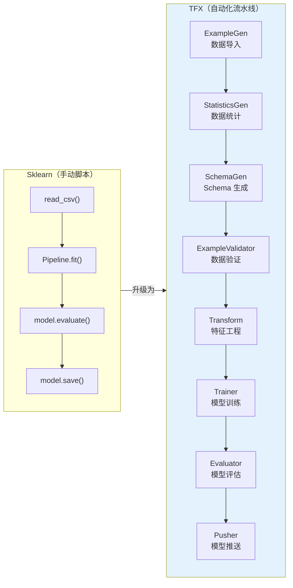
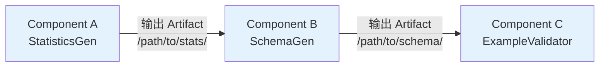
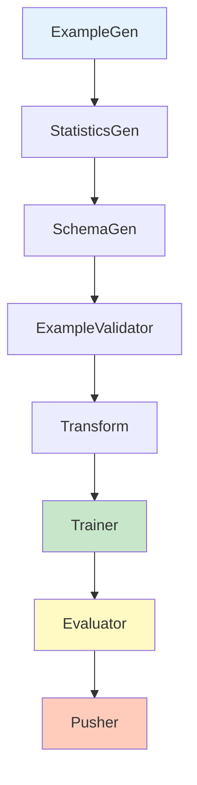
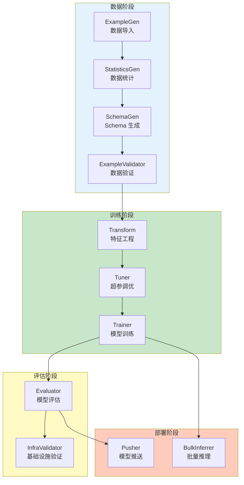

## 前置知识：从手动训练到自动化流水线

你已经能用 `model.save()` 导出模型，能用 `cross_val_score` 做交叉验证。但在生产环境中，这些操作需要**自动化、可复现、可监控**：

- 每次有新数据来了，自动触发训练
- 每次训练后，自动对比新旧模型
- 通过评估后，自动推送到线上
- 数据质量有问题时，自动告警

**TFX 就是把这些步骤串成一条 DAG（有向无环图）流水线**。



> [!important] 核心转变
> - **Sklearn**：你写脚本，手动执行每一步
> - **TFX**：你定义组件，框架自动按 DAG 顺序执行、缓存、监控
> - **本质区别**：TFX 是**流水线框架**，Sklearn Pipeline 只是**单模型内的特征工程链**

---

## 一、TFX 的三大核心概念

### 1.1 组件（Component）

TFX 的每个步骤都是一个**组件**，接收输入、执行处理、产生输出。

```python
from tfx.components import (
    CsvExampleGen,      # 数据导入
    StatisticsGen,      # 数据统计
    SchemaGen,          # Schema 生成
    ExampleValidator,   # 数据验证
    Transform,          # 特征工程
    Trainer,            # 模型训练
    Evaluator,          # 模型评估
    Pusher,             # 模型推送
)
```

> [!tip] 与 sklearn Pipeline 的对比
> | sklearn Pipeline | TFX Component |
> |-----------------|--------------|
> | `StandardScaler()` | `Transform` |
> | `LogisticRegression()` | `Trainer` |
> | `pipeline.fit(X, y)` | `Trainer.run()` |
> | `pipeline.score(X, y)` | `Evaluator.Evaluate()` |
> | `joblib.dump(model)` | `Pusher` |
> | 所有步骤在一个进程内 | 每个组件独立执行，可分布式 |

### 1.2 Artifact（数据载体）

组件之间通过 **Artifact** 传递数据——不是直接传 Python 对象，而是传**文件路径引用**。



```python
# Artifact 是文件路径引用，不是内存对象
# 组件 A 输出到 /pipeline/StatisticsGen/output/
# 组件 B 从 /pipeline/StatisticsGen/output/ 读取

# 好处：
# 1. 组件可以独立重试（缓存机制）
# 2. 可以分布式执行（跨机器共享文件）
# 3. 可审计（每个 Artifact 有版本）
```

> [!warning] 常见误解
> - ❌ "组件之间传 DataFrame" → 不是，传的是 Artifact（文件路径）
> - ❌ "Artifact 就是文件" → 是文件 + 元数据（类型、URI、生成时间）
> - ✅ 正确理解：Artifact 是**可版本化的数据引用**

### 1.3 Pipeline（DAG 流水线）

组件通过 Artifact 依赖关系组成 **DAG（有向无环图）**，框架按拓扑序自动执行。

```python
from tfx.orchestration import pipeline

# 定义 Pipeline
tfx_pipeline = pipeline.Pipeline(
    pipeline_name='my_first_pipeline',
    pipeline_root='/pipeline/root',      # Artifact 存储根目录
    components=[                         # 组件列表（顺序由 Artifact 依赖决定）
        example_gen,                     # CsvExampleGen
        statistics_gen,                  # StatisticsGen（依赖 example_gen.outputs['examples']）
        schema_gen,                      # SchemaGen（依赖 statistics_gen.outputs['statistics']）
        example_validator,               # ExampleValidator
        transform,                       # Transform
        trainer,                         # Trainer
        evaluator,                       # Evaluator
        pusher,                          # Pusher
    ],
    metadata_connection_config=sqlite_metadata_connection_config(
        '/pipeline/metadata.db'          # 元数据存储（记录 Artifact 版本）
    ),
)
```



> [!important] DAG 的关键特性
> 1. **拓扑排序**：框架自动计算执行顺序（不需要你手动排序）
> 2. **并行执行**：没有依赖的组件可以并行（注意：SchemaGen 消费 StatisticsGen 的 `statistics` 输出，二者**有依赖、不能并行**；可并行的是相互无依赖的分支，如 ExampleGen 之后各自独立的组件）
> 3. **缓存机制**：如果输入没变，跳过已执行的组件（节省时间）
> 4. **重试机制**：某个组件失败可以单独重试，不影响其他组件

---

## 二、TFX 标准组件全景



| 组件 | 功能 | 输入 Artifact | 输出 Artifact | 对应 Sklearn |
|------|------|--------------|--------------|-------------|
| **ExampleGen** | 从 CSV/TFRecord/BigQuery 导入数据 | 原始文件路径 | `examples`（TFRecord） | `pd.read_csv()` |
| **StatisticsGen** | 计算数据统计（均值、分布、缺失率） | `examples` | `statistics` | `df.describe()` |
| **SchemaGen** | 从统计自动生成 Schema | `statistics` | `schema` | 手动写验证逻辑 |
| **ExampleValidator** | 检测数据异常和漂移 | `statistics` + `schema` | `anomalies` | `assert` 语句 |
| **Transform** | 特征工程（全局统计，可部署） | `examples` + `schema` | `transform_graph` + `transformed_examples` | `Pipeline.fit_transform()` |
| **Trainer** | 模型训练 | `examples` + `transform_graph` + `hyperparameters` | `model` + `model_run` | `model.fit()` |
| **Tuner** | 超参调优 | `examples` + `schema` | `best_hyperparameters` | `GridSearchCV` |
| **Evaluator** | 模型评估 + 对比 | `model` + `examples` | `evaluation` + `blessing` | `cross_val_score` |
| **InfraValidator** | 验证模型能否在目标环境运行 | `model` | `blessing` | 无对应 |
| **Pusher** | 通过评估后推送到部署 | `model` + `blessing` | `pushed_model` | `model.save()` |
| **BulkInferrer** | 批量推理 | `model` + `examples` | `inference_result` | `model.predict()` |

---

## 三、流水线编排器

TFX 的 Pipeline 定义是**编排无关**的——同一份定义可以在不同环境运行。

### 3.1 三种编排器对比

| 编排器 | 适用场景 | 部署方式 | 分布式 | 缓存 |
|--------|---------|---------|--------|------|
| **LocalDagRunner** | 本地开发、小规模测试 | 单机进程 | ❌ | ✅ |
| **Kubeflow Pipelines** | 生产环境 | K8S 集群 | ✅ | ✅ |
| **Apache Airflow** | 已有 Airflow 基础设施 | Airflow Worker | ✅ | ✅ |

```python
# ========== LocalDagRunner（本地开发）==========
from tfx.orchestration.local.local_dag_runner import LocalDagRunner

runner = LocalDagRunner()
runner.run(tfx_pipeline)

# ========== Kubeflow Pipelines（生产环境）==========
from tfx.orchestration.kubeflow import KubeflowDagRunner

kubeflow_config = KubeflowDagRunnerConfig(
    kubeflow_metadata_config=metadata_config,
    tfx_image='my-tfx-image:latest',
)
KubeflowDagRunner(config=kubeflow_config).run(tfx_pipeline)

# ========== Apache Airflow ==========
from datetime import datetime
from tfx.orchestration.airflow.airflow_runner import AirflowDAGRunner

# AirflowDAGRunner 接收一个 dict：键就是 airflow.DAG 的构造参数
# （没有 dag_id / pipeline_name 这类参数，流水线名由 TFX Pipeline 自身携带）
DAG = AirflowDAGRunner({
    'schedule_interval': '@daily',
    'start_date': datetime(2026, 1, 1),
}).run(tfx_pipeline)
```

> [!tip] 选择建议
> - **学习阶段**：用 `LocalDagRunner`，零配置，本地直接跑
> - **团队项目**：用 `Kubeflow Pipelines`，有 Web UI、可视化、版本管理
> - **已有 Airflow**：用 `AirflowDAGRunner`，复用现有基础设施

### 3.2 TFX 与其他 MLOps 框架对比

| 框架 | 定位 | 与 TFX 关系 |
|------|------|------------|
| **TFX** | 端到端 ML 流水线 | 本路径主角 |
| **Kubeflow** | K8S 上的 ML 平台 | TFX 可以跑在 Kubeflow 上 |
| **MLflow** | 实验追踪 + 模型注册 | TFX 可以与 MLflow 集成 |
| **Weights & Biases** | 实验追踪 + 可视化 | TFX Trainer 可以集成 W&B |
| **Airflow** | 通用任务编排 | TFX 可以用 Airflow 编排 |
| **Prefect** | 现代任务编排 | TFX 可以用 Prefect 编排 |
| **Flyte** | 云原生 ML 编排 | TFX 替代方案 |

---

## 四、安装与环境搭建

### 4.1 安装 TFX

```bash
# 基础安装
pip install tfx

# 验证安装
python -c "import tfx; print(tfx.__version__)"

# 可选：安装可视化工具
pip install tensorflow-model-analysis    # TFMA
pip install tensorflow-data-validation   # TFDV
pip install tensorflow-transform         # TFT
```

> [!warning] 版本兼容性
> TFX 对 TensorFlow 版本有严格要求：
> - TFX 1.13 → TensorFlow 2.12
> - TFX 1.14 → TensorFlow 2.13
> - TFX 1.15 → TensorFlow 2.15
>
> 上表更新于笔记撰写时，最新对应关系以 tfx / tfx-bsl 的 RELEASE.md 为准。
>
> 安装前查阅 https://www.tensorflow.org/tfx/guide/versions

### 4.2 推荐开发环境：Docker

```bash
# 使用官方 Docker 镜像（推荐，避免版本冲突）
docker run -it --rm \
  -p 8888:8888 \
  -v $(pwd)/pipeline:/pipeline \
  tensorflow/tfx:latest \
  bash

# 启动 Jupyter Notebook
jupyter notebook --ip=0.0.0.0 --allow-root
```

### 4.3 InteractiveContext（交互式开发）

```python
# 在 Jupyter Notebook 中交互式开发
from tfx.orchestration.experimental.interactive.interactive_context import InteractiveContext

context = InteractiveContext(
    pipeline_root='/tmp/tfx_interactive',
    metadata_connection_config=None,  # 使用 SQLite
)

# 逐组件运行，实时查看输出
context.run(example_gen)
context.run(statistics_gen)
# ... 可以逐个测试每个组件
```

> [!tip] InteractiveContext vs Pipeline
> - **InteractiveContext**：在 Jupyter 中逐个运行组件，适合开发调试
> - **Pipeline**：一次性运行所有组件，适合生产部署
> - 开发时先用 InteractiveContext 调试每个组件，调试通过后组装成 Pipeline

---

## 五、第一个 TFX Pipeline（Hello World）

### 5.1 完整代码

```python
# ============================================
# 最小 TFX Pipeline：CSV → 统计 → Schema → 验证
# ============================================
import os
import tfx
from tfx.components import (
    CsvExampleGen,
    StatisticsGen,
    SchemaGen,
    ExampleValidator,
)
from tfx.orchestration import pipeline as tfx_pipeline
from tfx.orchestration.local.local_dag_runner import LocalDagRunner
# 官方写法：ml_metadata 的 SQLite 连接配置由 tfx.orchestration.metadata 提供
from tfx.orchestration.metadata import sqlite_metadata_connection_config

# 1. 数据路径
DATA_ROOT = '/data/iris'
PIPELINE_NAME = 'iris_validation'
PIPELINE_ROOT = f'/pipeline/{PIPELINE_NAME}'
METADATA_PATH = f'/pipeline/{PIPELINE_NAME}/metadata.db'

# 2. 定义组件
example_gen = CsvExampleGen(input_base=DATA_ROOT)

statistics_gen = StatisticsGen(
    examples=example_gen.outputs['examples']
)

schema_gen = SchemaGen(
    statistics=statistics_gen.outputs['statistics'],
    infer_feature_shape=True,
)

example_validator = ExampleValidator(
    statistics=statistics_gen.outputs['statistics'],
    schema=schema_gen.outputs['schema'],
)

# 3. 定义 Pipeline
my_pipeline = tfx_pipeline.Pipeline(
    pipeline_name=PIPELINE_NAME,
    pipeline_root=PIPELINE_ROOT,
    components=[example_gen, statistics_gen, schema_gen, example_validator],
    metadata_connection_config=sqlite_metadata_connection_config(METADATA_PATH),
)

# 4. 运行
LocalDagRunner().run(my_pipeline)

# 5. 查看输出
# /pipeline/iris_validation/StatisticsGen/statistics/
# /pipeline/iris_validation/SchemaGen/schema/
# /pipeline/iris_validation/ExampleValidator/anomalies/
```

### 5.2 查看输出（TFDV 可视化）

```python
import os
import tensorflow_data_validation as tfdv

# TFX 1.x 实际输出布局：StatisticsGen 按 split 输出 FeatureStats.pb（没有 latest/stats_tfrecord）
# 推荐通过组件输出的 artifact.uri 定位（InteractiveContext 下直接取，Pipeline 下可查 metadata store）
stats_path = os.path.join(
    statistics_gen.outputs['statistics'][0].uri, 'Split-train', 'FeatureStats.pb')
stats = tfdv.load_statistics(stats_path)

# 可视化
tfdv.visualize_statistics(stats)

# 加载 Schema（SchemaGen 输出 schema.pbtxt，用 tfdv.load_schema_text 读取）
schema_path = os.path.join(
    schema_gen.outputs['schema'][0].uri, 'schema.pbtxt')
schema = tfdv.load_schema_text(schema_path)
tfdv.display_schema(schema)

# 查看异常（ExampleValidator 同样按 split 输出 anomalies.pbtxt）
anomalies_path = os.path.join(
    example_validator.outputs['anomalies'][0].uri, 'Split-train', 'anomalies.pbtxt')
anomalies = tfdv.load_anomalies_text(anomalies_path)
tfdv.display_anomalies(anomalies)
```

> [!important] TFDV 可视化效果
> - **StatisticsGen** 输出：每个特征的均值、分布、缺失率、唯一值数
> - **SchemaGen** 输出：每个特征的类型、范围、缺失率约束
> - **ExampleValidator** 输出：异常列表（如"age 超出 Schema 范围"）
>
> 这比 `df.describe()` 强在：**可以持久化、可以版本对比、可以自动告警**

---

## 六、练习

> [!exercise] 🟢 基础：安装 TFX + 运行 Hello World
> **目标**：安装 TFX，运行上面的最小 Pipeline，查看 TFDV 可视化输出。
>
> ```bash
> # 1. 安装
> pip install tfx tensorflow-data-validation
>
> # 2. 准备数据（Iris CSV）
> # 3. 运行上面的代码
> # 4. 用 TFDV 可视化统计数据
> ```
>
> <details>
> <summary>🔑 参考答案</summary>
>
> ```python
> import os
> import tensorflow_data_validation as tfdv
> # 通过 artifact.uri 定位（TFX 1.x 按 split 输出 FeatureStats.pb）
> stats = tfdv.load_statistics(os.path.join(
>     statistics_gen.outputs['statistics'][0].uri, 'Split-train', 'FeatureStats.pb'))
> tfdv.visualize_statistics(stats)
> # 会显示交互式图表：每个特征的分布、缺失率、统计量
> ```
>
> </details>
>
> **验收标准**：
> - [ ] `import tfx` 成功
> - [ ] Pipeline 运行无报错
> - [ ] TFDV 可视化显示 Iris 特征分布

> [!exercise] 🟡 进阶：添加 Trainer 组件
> **目标**：在 Hello World 基础上添加 Transform + Trainer + Evaluator，训练一个 Iris 分类模型。
>
> <details>
> <summary>🔑 参考答案</summary>
>
> ```python
> from tfx.components import Transform, Trainer, Evaluator
> from tfx.proto import trainer_pb2
>
> # Transform 组件
> transform = Transform(
>     examples=example_gen.outputs['examples'],
>     schema=schema_gen.outputs['schema'],
>     module_file='transform_module.py',  # 需要自己写
> )
>
> # Trainer 组件
> trainer = Trainer(
>     module_file='trainer_module.py',    # 需要自己写
>     examples=transform.outputs['transformed_examples'],
>     transform_graph=transform.outputs['transform_graph'],
>     train_args=trainer_pb2.TrainArgs(num_steps=1000),
>     eval_args=trainer_pb2.EvalArgs(num_steps=500),
> )
>
> # Evaluator 组件
> evaluator = Evaluator(
>     examples=example_gen.outputs['examples'],
>     model=trainer.outputs['model'],
> )
> ```
>
> </details>

> [!exercise] 🔴 挑战：用 Kubeflow 运行 Pipeline
> **目标**：把本地 Pipeline 迁移到 Kubeflow，体验 Web UI 可视化。
>
> <details>
> <summary>🔑 参考答案</summary>
>
> ```bash
> # 1. 安装 Kubeflow Pipelines（本地单节点）
> kubectl apply -k "github.com/kubeflow/pipelines/manifests/kustomize/cluster-scoped-resources"
> kubectl wait --for=condition=ready pod -l app=ml-pipeline -n kubeflow --timeout=300s
>
> # 2. 访问 Web UI
> kubectl port-forward -n kubeflow svc/ml-pipeline-ui 8080:80
> # 打开 http://localhost:8080
> ```
>
> ```python
> from tfx.orchestration.kubeflow import KubeflowDagRunner, KubeflowDagRunnerConfig
>
> config = KubeflowDagRunnerConfig(
>     kubeflow_metadata_config=metadata_config,
>     tfx_image='tensorflow/tfx:latest',
> )
> KubeflowDagRunner(config=config).run(my_pipeline)
> ```
>
> </details>

---

## 七、常见陷阱

| # | 陷阱 | 正确做法 |
|---|------|---------|
| 1 | 直接在生产环境用 InteractiveContext | InteractiveContext 只用于开发调试，生产用 Pipeline |
| 2 | 忽略 Artifact 版本 | 每个 Artifact 有版本，Pipeline 缓存机制依赖版本对比 |
| 3 | 组件顺序手动指定 | DAG 顺序由 Artifact 依赖自动决定，不需要手动排序 |
| 4 | 所有组件放在一个 Python 文件 | 每个组件用独立 `module_file`（transform_module.py、trainer_module.py） |
| 5 | 忽略 metadata_connection_config | 必须配置元数据存储（SQLite / MySQL），否则无法追踪 Artifact |

---

*前置：[[v5-端到端ML项目]]*
*后续：[[X2-数据验证 TFDV]]*
*并行：[[T0-Transformer 路径总览]] / [[D0-分布式训练 路径总览]]*
