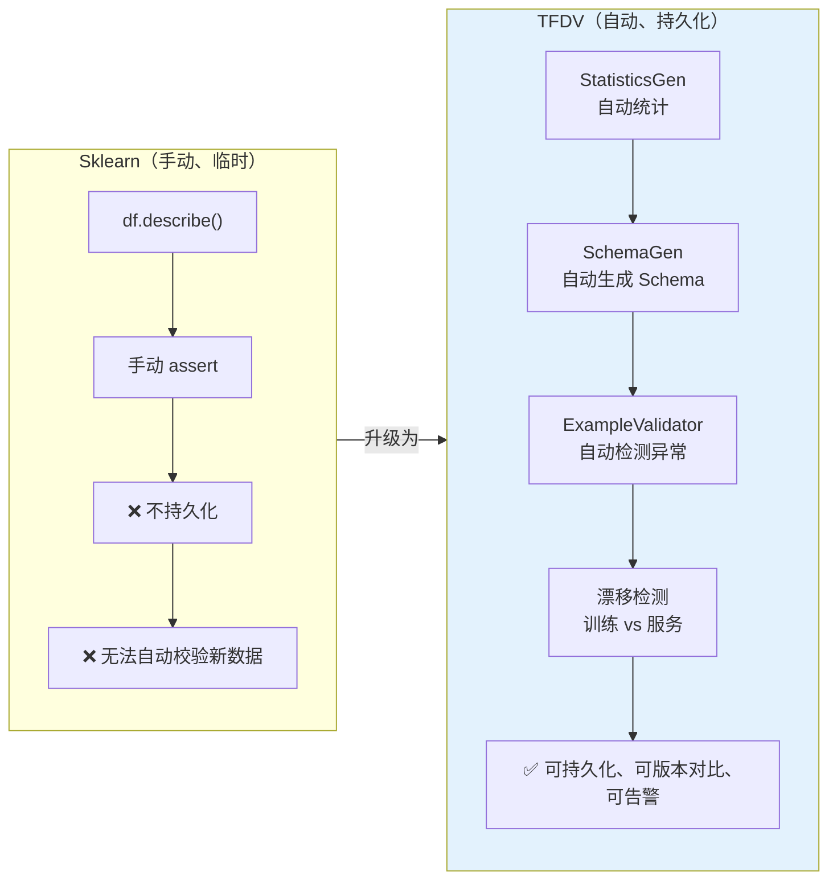
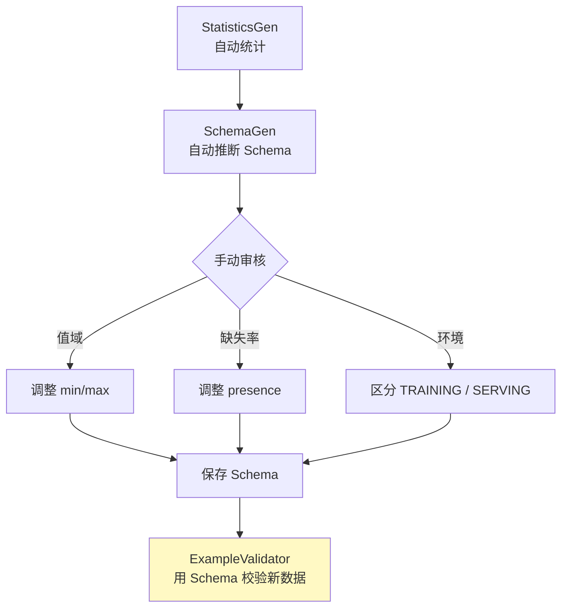
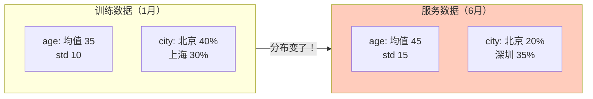
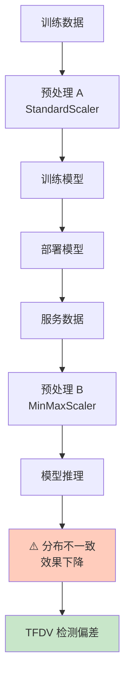
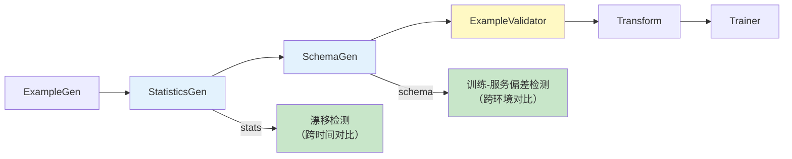

## 前置知识：从 df.describe() 到生产数据验证

在 Sklearn 工作流中，你用 `df.describe()` 和 `df.info()` 做数据探索，用 `assert df.isnull().sum() == 0` 做数据检查。这够用吗？

```python
# ===== 你熟悉的 Sklearn 方式 =====
import pandas as pd

df = pd.read_csv('train.csv')
print(df.describe())       # 看统计
print(df.isnull().sum())   # 查缺失
assert df['age'].min() > 0 # 手动校验

# 问题：
# 1. 统计结果不持久化——下次运行忘了
# 2. 没有 Schema——新数据来了无法自动校验
# 3. 没有漂移检测——不知道数据分布变了
# 4. 没有训练-服务偏差检测——训练和线上数据不一致
```

**TFDV 解决的就是这四个问题**。



> [!important] TFDV 的核心价值
> 1. **持久化统计**：每次统计结果保存为 Artifact，可版本对比
> 2. **Schema 合同**：数据结构有"合同"，新数据自动校验
> 3. **漂移检测**：对比不同时间段数据分布，发现数据漂移
> 4. **训练-服务偏差**：对比训练数据和服务数据的分布差异

---

## 一、TFDV 基础：统计与可视化

### 1.1 StatisticsGen：自动统计

```python
# ============================================
# TFX 组件方式（流水线内）
# ============================================
from tfx.components import StatisticsGen

statistics_gen = StatisticsGen(
    examples=example_gen.outputs['examples']  # 输入：TFRecord 数据
)
# 输出：statistics（Artifact，包含 train + eval 的统计）

# ============================================
# 独立 TFDV 方式（Notebook 调试）
# ============================================
import tensorflow_data_validation as tfdv

# 从 CSV 直接生成统计
stats = tfdv.generate_statistics_from_csv(
    data_location='/data/train.csv',
    delimiter=','
)

# 从 TFRecord 生成统计
stats = tfdv.generate_statistics_from_tfrecord(
    data_location='/data/train.tfrecord'
)
```

> [!tip] TFDV 统计 vs df.describe()
> | 维度 | `df.describe()` | TFDV Statistics |
> |------|-----------------|-----------------|
> | 数值型统计 | 均值、标准差、min/max、分位数 | ✅ 全部包含 |
> | 类别型统计 | ❌ 只能 `value_counts()` | ✅ 自动统计 Top 频率值 |
> | 缺失率 | 需手动 `isnull().sum()` | ✅ 自动统计 |
> | 持久化 | ❌ | ✅ 保存为 TFRecord |
> | 可视化 | 需 matplotlib 手动画 | ✅ 内置交互式可视化 |
> | 版本对比 | ❌ | ✅ 可对比不同版本统计 |

### 1.2 可视化统计结果

```python
import tensorflow_data_validation as tfdv

# 基础可视化：显示所有特征的分布
tfdv.visualize_statistics(stats)

# 对比可视化：训练集 vs 评估集
tfdv.visualize_statistics(
    lhs_statistics=train_stats,   # 左侧：训练集
    rhs_statistics=eval_stats,    # 右侧：评估集
    lhs_name='Training',
    rhs_name='Evaluation',
)
```

> [!important] 可视化效果
> TFDV 的 `visualize_statistics` 会生成交互式图表：
> - **数值型特征**：直方图 + 分位数 + 均值/标准差
> - **类别型特征**：频率分布 + Top 值
> - **缺失率**：每个特征的缺失比例
> - **对比模式**：左右并排显示两个数据集的分布差异

---

## 二、Schema：数据合同

### 2.1 SchemaGen：自动生成 Schema

```python
# ============================================
# TFX 组件方式
# ============================================
from tfx.components import SchemaGen

schema_gen = SchemaGen(
    statistics=statistics_gen.outputs['statistics'],
    infer_feature_shape=True,   # 是否推断特征形状
)
# 输出：schema（Artifact，proto 格式）

# ============================================
# 独立 TFDV 方式
# ============================================
schema = tfdv.infer_schema(stats)

# 查看生成的 Schema
tfdv.display_schema(schema)
```

### 2.2 Schema 的结构

```python
# Schema 是一个 protobuf 对象，描述数据的"合同"
# 包含：特征名、类型、存在性、值域、形状

# 示例 Schema 内容（概念性）：
# 特征名       类型      存在性      值域
# ─────────────────────────────────────────
# age          INT    REQUIRED   [0, 120]
# income       FLOAT    OPTIONAL    -
# city         STRING   REQUIRED    -
# label        INT      REQUIRED    [0, 1]
```

### 2.3 手动修改 Schema

```python
# ============================================
# Schema 是可编辑的——自动生成后可以手动调整
# ============================================

# 1. 设置 age 的值域为 [0, 120]
age = tfdv.get_feature(schema, 'age')
age.int_domain.min = 0
age.int_domain.max = 120

# 2. 设置 city 为必填（不允许缺失）
# presence 是 FeaturePresence 消息，不能直接赋浮点数，
# 用 min_fraction 表示"至少多少比例的样本存在该特征"
city = tfdv.get_feature(schema, 'city')
city.presence.min_fraction = 1.0    # 必须存在 100%
city.valency = 1                    # 只能有一个值

# 3. 设置 income 允许缺失但缺失率不超过 20%
income = tfdv.get_feature(schema, 'income')
income.presence.min_fraction = 0.8  # 至少 80% 存在

# 4. 添加特征间约束：如果 city == "beijing"，income > 5000
tfdv.set_domain(schema, 'income', [5000, 1000000])

# 5. 设置环境（区分训练/服务 Schema）
# 训练环境有 label，服务环境没有 label
tfdv.get_feature(schema, 'label').not_in_environment.append('SERVING')
tfdv.get_feature(schema, 'label').in_environment.append('TRAINING')

# 保存修改后的 Schema
tfdv.write_schema_text(schema, '/data/schema.pbtxt')
```



> [!important] Schema 的两个环境
> 生产环境通常需要两个 Schema：
> - **TRAINING 环境**：包含 label（训练标签）
> - **SERVING 环境**：不包含 label（线上推理时没有标签）
>
> 用 `in_environment` / `not_in_environment` 区分，避免线上数据因缺 label 被报异常。

---

## 三、ExampleValidator：异常检测

### 3.1 自动检测异常

```python
# ============================================
# TFX 组件方式
# ============================================
from tfx.components import ExampleValidator

example_validator = ExampleValidator(
    statistics=statistics_gen.outputs['statistics'],  # 新数据统计
    schema=schema_gen.outputs['schema'],               # Schema 合同
)
# 输出：anomalies（异常列表）

# ============================================
# 独立 TFDV 方式
# ============================================

# 用 Schema 校验新数据
new_stats = tfdv.generate_statistics_from_csv('/data/new_batch.csv')
anomalies = tfdv.validate_statistics(new_stats, schema=schema)

# 查看异常
tfdv.display_anomalies(anomalies)
```

### 3.2 异常类型

```python
# TFDV 检测的异常类型（anomalies.proto 中的真实枚举名）：
# ──────────────────────────────────────────────────────────────────────
# 异常类型                                     说明                      严重程度
# ──────────────────────────────────────────────────────────────────────
# SCHEMA_MISSING_COLUMN                        Schema 中没有该特征        WARNING
# SCHEMA_NEW_COLUMN                            新数据有 Schema 没有的特征 WARNING
# FEATURE_TYPE_LOW_FRACTION_PRESENT            存在比例低于 Schema 要求   ERROR
# 类型不匹配族                                 类型与 Schema 不符         ERROR
#   FLOAT_TYPE_NOT_FLOAT / INT_TYPE_INT_EXPECTED
#   / STRING_TYPE_NOW_FLOAT 等
# INT_TYPE_BIG_INT / FLOAT_TYPE_BIG_FLOAT      值超出域的上界             ERROR
# INT_TYPE_SMALL_INT / FLOAT_TYPE_SMALL_FLOAT  值低于域的下界             ERROR
# ENUM_TYPE_UNEXPECTED_STRING_VALUES           出现枚举域之外的字符串值    ERROR
# COMPARATOR_CONTROL_DATA_MISSING              对比时缺基准数据           ERROR
# COMPARATOR_TREATMENT_DATA_MISSING            对比时缺对照数据           ERROR
# COMPARATOR_HIGH_NUM_EXAMPLES                 对比时样本数偏高           WARNING
# COMPARATOR_LOW_NUM_EXAMPLES                  对比时样本数偏低           WARNING
# COMPARATOR_L_INFTY_HIGH                      漂移：L-infinity 距离超阈值（类别型） WARNING
# COMPARATOR_JENSEN_SHANNON_DIVERGENCE_HIGH    漂移：JS 散度超阈值（数值型） WARNING
# ──────────────────────────────────────────────────────────────────────
```

> [!warning] 常见异常场景
> | 场景 | 异常类型 | 原因 |
> |------|---------|------|
> | 新数据多了字段 | `SCHEMA_NEW_COLUMN` | 上游系统加了一个新字段 |
> | 新数据少了字段 | `SCHEMA_MISSING_COLUMN` | 上游系统删除了一个字段 |
> | age 出现 -1 | `INT_TYPE_SMALL_INT`（int 域）/ `FLOAT_TYPE_SMALL_FLOAT`（float 域） | 数据采集 bug |
> | income 缺失率从 5% 涨到 30% | `FEATURE_TYPE_LOW_FRACTION_PRESENT`（低于 presence.min_fraction） | 上游数据源故障 |
> | city 出现 Schema 枚举外的值 | `ENUM_TYPE_UNEXPECTED_STRING_VALUES` | 上游系统改了编码方式 |

---

## 四、数据漂移检测

### 4.1 什么是数据漂移



```python
# ============================================
# 漂移检测：对比不同时间段的数据统计
# ============================================

# 1. 生成训练数据统计
train_stats = tfdv.generate_statistics_from_csv('/data/train_jan.csv')

# 2. 生成服务数据统计（当前线上数据）
serving_stats = tfdv.generate_statistics_from_csv('/data/serving_jun.csv')

# 3. 对比检测漂移
tfdv.visualize_statistics(
    lhs_statistics=train_stats,
    rhs_statistics=serving_stats,
    lhs_name='Train (Jan)',
    rhs_name='Serving (Jun)',
)

# 4. 用 Schema 校验服务数据 + 检测漂移
# 注意：只传 schema + environment 只做 Schema 校验；
# 漂移检测必须传 previous_statistics 作为对比基准
serving_anomalies = tfdv.validate_statistics(
    serving_stats,
    schema=schema,                    # 与训练同一个 Schema（§2.3 已配置 SERVING 环境）
    environment='SERVING',
    previous_statistics=train_stats,  # 漂移对比基准：训练数据统计
)
tfdv.display_anomalies(serving_anomalies)
```

### 4.2 配置漂移阈值

```python
# ============================================
# 自定义漂移检测阈值（真实写法：配置在 Schema 的 proto 结构上）
# ============================================

# 漂移阈值不是配在 StatsOptions 上的，
# 而是配在 Schema 中每个 feature 的 drift_comparator（FeatureComparator proto）上。
# 距离度量按特征类型区分（官方文档明确说明）：
# - 类别型特征：L-infinity 距离（infinity_norm，分布的最大绝对差）
# - 数值型特征：Jensen-Shannon 散度（jensen_shannon_divergence）
# 阈值越小越敏感

from tensorflow_metadata.proto.v0 import schema_pb2  # noqa: F401（proto 结构所在模块）

# 类别型特征 city：L-infinity 阈值 0.05（更敏感）
city = tfdv.get_feature(schema, 'city')
city.drift_comparator.infinity_norm.threshold = 0.05

# 数值型特征 income：Jensen-Shannon 散度阈值 0.1
income = tfdv.get_feature(schema, 'income')
income.drift_comparator.jensen_shannon_divergence.threshold = 0.1

# 检测漂移：阈值随 Schema 生效，validate_statistics
# 必须传 previous_statistics 才会做漂移对比
anomalies = tfdv.validate_statistics(
    serving_stats,
    schema=schema,
    previous_statistics=train_stats,  # 对比基准（如上一时间段/训练数据）
)
tfdv.display_anomalies(anomalies)
```

> [!important] 漂移检测 vs 异常检测
> | 维度 | 异常检测 | 漂移检测 |
> |------|---------|---------|
> | 检查什么 | 数据是否符合 Schema | 数据分布是否变了 |
> | 严重程度 | ERROR（硬错误） | WARNING（软警告） |
> | 触发条件 | 类型错误、值域越界 | 分布距离超过阈值 |
> | 后果 | 数据有 bug，应该修复 | 数据变了，模型可能需要再训练 |

---

## 五、训练-服务偏差检测

### 5.1 什么是训练-服务偏差

```python
# ============================================
# 训练-服务偏差（Training-Serving Skew）
# ============================================

# 场景：
# 训练时：age 用 StandardScaler 归一化
# 服务时：age 用了 MinMaxScaler 归一化
# 结果：模型输入分布不一致，效果下降

# TFDV 可以检测这种偏差：
train_stats = tfdv.generate_statistics_from_csv('/data/train.csv')
serving_stats = tfdv.generate_statistics_from_csv('/data/serving.csv')

# 对比分布
tfdv.visualize_statistics(
    lhs_statistics=train_stats,
    rhs_statistics=serving_stats,
    lhs_name='Training',
    rhs_name='Serving',
)

# 如果 age 的分布明显不同，说明训练和服务预处理不一致
```



### 5.2 完整偏差检测流程

```python
# ============================================
# 完整的训练-服务偏差检测
# ============================================

# 1. 定义训练 Schema（有 label）
train_schema = tfdv.infer_schema(train_stats)
tfdv.get_feature(train_schema, 'label').in_environment.append('TRAINING')
tfdv.get_feature(train_schema, 'label').not_in_environment.append('SERVING')

# 2. 验证训练数据
train_anomalies = tfdv.validate_statistics(
    train_stats,
    schema=train_schema,
    environment='TRAINING',
)
print("训练数据异常：")
tfdv.display_anomalies(train_anomalies)

# 3. 验证服务数据
serving_anomalies = tfdv.validate_statistics(
    serving_stats,
    schema=train_schema,     # 用同一个 Schema
    environment='SERVING',   # 但环境不同（SERVING 不检查 label）
)
print("服务数据异常：")
tfdv.display_anomalies(serving_anomalies)

# 4. 对比训练和服务分布
tfdv.visualize_statistics(
    lhs_statistics=train_stats,
    rhs_statistics=serving_stats,
    lhs_name='Training Data',
    rhs_name='Serving Data',
)
```

---

## 六、TFDV 在 TFX 流水线中的位置



> [!important] TFDV 三个组件的分工
> - **StatisticsGen**：计算统计 → 输出 statistics Artifact
> - **SchemaGen**：推断 Schema → 输出 schema Artifact
> - **ExampleValidator**：校验数据 → 输出 anomalies Artifact
>
> 漂移检测和偏差检测是**跨次运行**的——需要保存不同时间的 statistics 做版本对比。

---

## 七、练习

> [!exercise] 🟢 基础：生成统计 + Schema + 可视化
> **目标**：用 TFDV 对 Iris 数据集生成统计、推断 Schema、可视化。
>
> ```python
> import tensorflow_data_validation as tfdv
>
> # 1. 生成统计
> stats = tfdv.generate_statistics_from_csv('/data/iris.csv')
> tfdv.visualize_statistics(stats)
>
> # 2. 推断 Schema
> schema = tfdv.infer_schema(stats)
> tfdv.display_schema(schema)
> ```
>
> <details>
> <summary>🔑 参考答案</summary>
>
> ```python
> # Iris 有 4 个数值特征 + 1 个类别标签
> # SchemaGen 会自动推断为 FLOAT domain + STRING domain
> # 可视化会显示每个特征的直方图
> ```
>
> </details>
>
> **验收标准**：
> - [ ] 统计图表显示 4 个特征的分布
> - [ ] Schema 包含 5 个特征
> - [ ] 能解释每个特征的统计量含义

> [!exercise] 🟡 进阶：手动修改 Schema + 检测异常
> **目标**：生成 Schema 后手动修改 age 的值域，然后注入异常数据检测。
>
> ```python
> # 1. 修改 age 值域为 [0, 120]
> age = tfdv.get_feature(schema, 'age')
> age.int_domain.min = 0
> age.int_domain.max = 120
>
> # 2. 造一份有异常的数据（age=-5）
> # 3. 生成统计
> # 4. 用修改后的 Schema 校验
> # 5. 查看异常报告
> ```
>
> <details>
> <summary>🔑 参考答案</summary>
>
> ```python
> # 注入异常
> df_bad = df.copy()
> df_bad.loc[0, 'age'] = -5  # 负数，超出 [0, 120]
> df_bad.to_csv('/data/bad.csv', index=False)
>
> bad_stats = tfdv.generate_statistics_from_csv('/data/bad.csv')
> anomalies = tfdv.validate_statistics(bad_stats, schema=schema)
> tfdv.display_anomalies(anomalies)
> # 会显示：age - INT_TYPE_SMALL_INT（int 域低于下界 0）
> ```
>
> </details>

> [!exercise] 🔴 挑战：检测训练-服务偏差
> **目标**：生成训练数据和服务数据的统计，对比分布差异，配置漂移阈值。
>
> <details>
> <summary>🔑 参考答案</summary>
>
> ```python
> # 训练数据
> train_stats = tfdv.generate_statistics_from_csv('/data/train.csv')
> # 服务数据（分布有变化）
> serving_stats = tfdv.generate_statistics_from_csv('/data/serving.csv')
>
> # 对比可视化
> tfdv.visualize_statistics(
>     lhs_statistics=train_stats,
>     rhs_statistics=serving_stats,
>     lhs_name='Training',
>     rhs_name='Serving',
> )
>
> # 配置漂移阈值（真实写法：配在 Schema 的 feature 上）
> # 类别型（city）用 L-infinity 距离，数值型（income）用 Jensen-Shannon 散度
> tfdv.get_feature(schema, 'city').drift_comparator.infinity_norm.threshold = 0.05
> tfdv.get_feature(schema, 'income').drift_comparator.jensen_shannon_divergence.threshold = 0.1
>
> # 检测漂移：必须传 previous_statistics 作为对比基准，
> # 只传 schema + environment 只做 schema 校验，不会做漂移对比
> drift_anomalies = tfdv.validate_statistics(
>     serving_stats,
>     schema=schema,                     # 与训练同一个 Schema
>     environment='SERVING',
>     previous_statistics=train_stats,   # 漂移对比基准
> )
> tfdv.display_anomalies(drift_anomalies)
> ```
>
> </details>

---

## 八、常见陷阱

| # | 陷阱 | 正确做法 |
|---|------|---------|
| 1 | 只用自动 Schema，不手动审核 | 自动推断的值域可能过宽，应手动收紧 |
| 2 | 忽略训练/服务环境区分 | label 在训练有、服务无，必须设 `in_environment` |
| 3 | 漂移阈值太严 | 太严会误报，应先用历史数据校准阈值 |
| 4 | 只看异常不看漂移 | 异常是硬错误，漂移是软警告——两者都要监控 |
| 5 | 忽视 Schema 版本 | 数据源变更时 Schema 需要更新，保留历史版本对比 |

---

*前置：[[X1-TFX 核心概念与架构]]*
*后续：[[X3-特征工程 TFT]]*
*关联：[[02-数据预处理与Pipeline对比]]（Sklearn Pipeline 锚点）*
