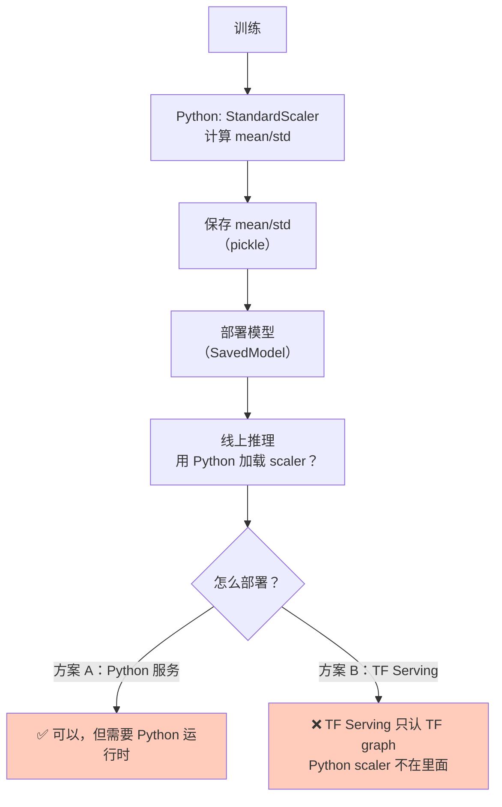
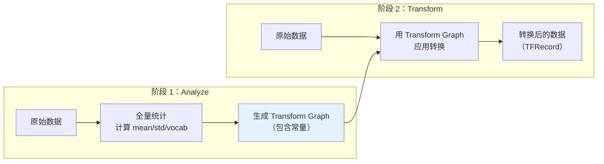
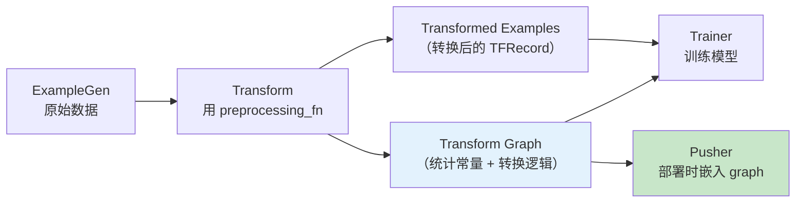

## 前置知识：sklearn Pipeline 的致命问题

你熟悉 sklearn 的 Pipeline：

```python
from sklearn.pipeline import Pipeline
from sklearn.preprocessing import StandardScaler

# fit 阶段：计算训练集的均值和标准差
pipeline = Pipeline([
    ('scaler', StandardScaler()),
    ('model', LogisticRegression())
])
pipeline.fit(X_train, y_train)

# transform 阶段：用训练集的均值/标准差归一化
X_test_scaled = pipeline.named_steps['scaler'].transform(X_test)
```

看起来没问题——训练和测试用同一个 scaler。但**生产环境**呢？



> [!warning] 训练-服务偏差的根源
> - **训练时**：用 Python sklearn 做 `StandardScaler.fit_transform()`
> - **服务时**：用 TF Serving / TFLite 做推理——**不跑 Python 代码**
> - **结果**：线上数据没有经过 StandardScaler，模型输入分布完全不同
>
> **TFT 就是为了解决这个问题。**

---

## 一、TFT 的核心思想：全量统计 + Transform Graph

### 1.1 两阶段设计

```python
# ============================================
# TFT 的两阶段设计
# ============================================

# 阶段 1：Analyze（全量统计）
# 遍历整个数据集，计算全局统计量（均值、标准差、词汇表等）
# 输出：transform_graph（包含全局统计常量）

# 阶段 2：Transform（转换）
# 用阶段 1 计算的常量，把原始特征转换为模型输入
# 输出：transformed_examples（TFRecord）
```



### 1.2 与 sklearn Pipeline 的对比

| 维度 | sklearn Pipeline | TFT Transform |
|------|-----------------|---------------|
| 统计方式 | `fit()` 计算统计量 | `Analyze` 全量统计 |
| 转换方式 | `transform()` 应用 | `Transform` 应用 |
| 统计存储 | pickle / joblib | Transform Graph（TF graph） |
| 部署方式 | 需要 Python 运行时 | 嵌入 TF graph，TF Serving 可直接用 |
| 训练-服务一致性 | ❌ 训练用 Python，服务可能不一致 | ✅ 训练和服务用同一个 graph |
| 分布式 | ❌ 单机 | ✅ 可以在 Beam/Spark 上跑 |

> [!important] 核心区别
> - sklearn 的 `StandardScaler.fit()` 输出的是 Python 对象（mean_、scale_ 属性）
> - TFT 的 Analyze 输出的是 **TF graph 常量**——可以直接嵌入 SavedModel
> - 这意味着：**训练时怎么预处理，服务时就怎么预处理，100% 一致**

---

## 二、TFT 实战：编写 Transform 模块

### 2.1 Transform 模块文件

```python
# ============================================
# transform_module.py
# TFT 的核心：preprocessing_fn
# ============================================
import tensorflow as tf
import tensorflow_transform as tft

# TFT 的入口函数：定义预处理逻辑
# 类比 sklearn 的 transform() 方法
def preprocessing_fn(inputs):
    """把原始特征转换为模型输入。

    Args:
        inputs: 字典 {feature_name: tf.Tensor}

    Returns:
        字典 {transformed_feature_name: tf.Tensor}
    """
    outputs = {}

    # 1. 数值型：标准化（等价于 StandardScaler）
    # tft.scale_to_z_score 会先全量计算 mean/std（Analyze 阶段），
    # 然后在 graph 里用常量做标准化（Transform 阶段）
    outputs['age_scaled'] = tft.scale_to_z_score(inputs['age'])

    # 2. 数值型：归一化到 [0, 1]（等价于 MinMaxScaler）
    outputs['income_normalized'] = tft.scale_to_0_1(inputs['income'])

    # 3. 类别型：词汇表编码（等价于 LabelEncoder + OneHotEncoder）
    # tft.compute_and_apply_vocabulary 先全量统计所有城市（Analyze），
    # 然后把每个城市映射为整数 ID（Transform）
    outputs['city_id'] = tft.compute_and_apply_vocabulary(inputs['city'])

    # 4. 文本型：分词 + ngram
    outputs['description_tokens'] = tft.ngrams(
        tft.string_split(inputs['description']),
        ngram_size=2,
    )

    # 5. 缺失值填充
    outputs['age_filled'] = tft.fill_missing(inputs['age'], fill_value=0)

    # 6. 桶化（等价于 KBinsDiscretizer）
    # 推荐：一步完成——tft.bucketize 内部先全量计算分位数边界（Analyze），
    # 再按边界桶化（Transform）
    outputs['age_bucketized'] = tft.bucketize(inputs['age'], num_buckets=5)
    # 若要自定义边界计算，可拆成两步：
    # bucket_boundaries = tft.quantiles(inputs['age'], num_buckets=5, epsilon=0.01)
    # outputs['age_bucketized'] = tft.apply_buckets(inputs['age'], bucket_boundaries)

    # 7. label 直接透传
    outputs['label'] = inputs['label']

    return outputs
```

### 2.2 在 TFX Pipeline 中使用 Transform

```python
from tfx.components import Transform

transform = Transform(
    examples=example_gen.outputs['examples'],        # 原始数据
    schema=schema_gen.outputs['schema'],              # Schema（可选）
    module_file='transform_module.py',               # preprocessing_fn 所在文件
)
# 输出：
# - transform_graph：TF graph（包含全局统计常量）
# - transformed_examples：转换后的 TFRecord
```



> [!important] Transform Graph 的关键作用
> - **训练时**：Trainer 用 `transformed_examples` 训练模型
> - **服务时**：Pusher 把 `transform_graph` 和 `model` 合并导出为 SavedModel
> - **结果**：线上推理时，原始数据进入 SavedModel → 先经过 transform_graph → 再进入模型 → 输出预测
> - **一致性**：训练和服务用**同一个 transform_graph**，100% 一致

---

## 三、TFT 内置函数速查

```python
# ============================================
# TFT 内置转换函数（类比 sklearn preprocessing）
# ============================================

# === 数值型 ===
tft.scale_to_z_score(x)          # StandardScaler
tft.scale_to_0_1(x)              # MinMaxScaler
tft.scale_to_mean_per_key(x, key) # 按 key 分组标准化
tft.fill_missing(x, fill_value)   # SimpleImputer
tft.clip(x, min_val, max_val)    # 手动裁剪

# === 类别型 ===
tft.compute_and_apply_vocabulary(x)  # LabelEncoder + 映射
tft.vocabulary(x)                     # 只计算词汇表，不映射
tft.hash_strings(x, hash_buckets)     # FeatureHasher（hashing trick）

# === 文本型 ===
tft.string_split(x)              # 分词
tft.ngrams(tokens, ngram_size)   # n-gram
tft.compute_and_apply_vocabulary(tokens)  # 词表编码

# === 桶化 ===
tft.bucketize(x, num_buckets)                # KBinsDiscretizer
tft.apply_buckets(x, bucket_boundaries)     # 用指定边界桶化

# === 高基数类别型 ===
tft.pca(x, output_dim)           # PCA 降维（对 one-hot 后的特征）
tft.hash_strings(x, hash_buckets) # Hashing trick（不需要词汇表）
```

> [!tip] TFT 函数 vs sklearn 对应
> | TFT 函数 | sklearn 对应 | 说明 |
> |---------|-------------|------|
> | `scale_to_z_score` | `StandardScaler` | 零均值单位方差 |
> | `scale_to_0_1` | `MinMaxScaler` | 归一化到 [0,1] |
> | `fill_missing` | `SimpleImputer` | 填充缺失值 |
> | `compute_and_apply_vocabulary` | `LabelEncoder` | 类别→整数 |
> | `bucketize` | `KBinsDiscretizer` | 连续→离散桶 |
> | `hash_strings` | `FeatureHasher` | Hash 编码 |
> | `pca` | `PCA` | 主成分分析 |

---

## 四、TFT 与 Keras 预处理层对比

```python
# ============================================
# Keras 预处理层（主路径 04 篇学过）
# ============================================
# 优点：简单，不需要额外文件
# 缺点：统计需要显式 adapt() 一次，统计与训练耦合在同一套代码里

# 统计量在显式调用 adapt() 时对全量数据一次性精确计算，与 model.fit 无关
normalizer = tf.keras.layers.Normalization(axis=-1)
normalizer.adapt(train_data)  # ← 不调用 adapt 则 mean=0/var=1，等于没归一化

model = tf.keras.Sequential([
    normalizer,  # adapt 后统计量固化为常量，fit 时不再变化
    tf.keras.layers.Dense(10, activation='relu'),
    tf.keras.layers.Dense(1, activation='sigmoid'),
])
model.fit(train_data, train_labels, epochs=10)

# ============================================
# TFT（生产级）
# ============================================
# 优点：全量统计、Transform Graph 可部署、训练-服务一致
# 缺点：需要写 transform_module.py，复杂度更高

# 选型建议：
# - 快速原型 → Keras 预处理层
# - 生产部署 → TFT
```

| 维度 | Keras 预处理层 | TFT |
|------|---------------|-----|
| 统计时机 | 显式调用 `adapt()`（训练前，与 fit 无关） | `Analyze` 阶段（全量） |
| 统计精度 | 精确（对传入数据一次性计算） | 精确（全量计算） |
| 部署一致性 | ✅ 嵌入 SavedModel | ✅ Transform Graph 嵌入 |
| 复杂度 | 低 | 高（需写 module_file） |
| 适用场景 | 原型开发 | 生产环境 |

---

## 五、练习

> [!exercise] 🟢 基础：编写 preprocessing_fn
> **目标**：写一个 `preprocessing_fn`，对 age 做 StandardScaler，对 city 做 vocabulary 编码。
>
> <details>
> <summary>🔑 参考答案</summary>
>
> ```python
> def preprocessing_fn(inputs):
>     outputs = {}
>     outputs['age_scaled'] = tft.scale_to_z_score(inputs['age'])
>     outputs['city_id'] = tft.compute_and_apply_vocabulary(inputs['city'])
>     outputs['label'] = inputs['label']
>     return outputs
> ```
>
> </details>
>
> **验收标准**：
> - [ ] `preprocessing_fn` 能被 TFX Transform 组件加载
> - [ ] 输出包含 `age_scaled` 和 `city_id`

> [!exercise] 🟡 进阶：完整 Transform 组件
> **目标**：在 TFX Pipeline 中添加 Transform 组件，验证训练-服务一致性。
>
> <details>
> <summary>🔑 参考答案</summary>
>
> ```python
> from tfx.components import Transform
>
> transform = Transform(
>     examples=example_gen.outputs['examples'],
>     schema=schema_gen.outputs['schema'],
>     module_file='transform_module.py',
> )
> context.run(transform)
>
> # 查看 Transform Graph
> import tensorflow_transform as tft
> tf_output = transform.outputs['transform_graph'].get()[0].uri
> print(f"Transform Graph: {tf_output}")
> ```
>
> </details>

> [!exercise] 🔴 挑战：对比 TFT 与 Keras 预处理层
> **目标**：对同一数据集分别用 TFT 和 Keras Normalization 做标准化，对比结果差异。
>
> <details>
> <summary>🔑 参考答案</summary>
>
> ```python
> # TFT 方式
> def preprocessing_fn(inputs):
>     outputs = {}
>     outputs['age_scaled'] = tft.scale_to_z_score(inputs['age'])
>     return outputs
>
> # Keras 方式
> normalizer = tf.keras.layers.Normalization(axis=-1)
> normalizer.adapt(train_dataset.map(lambda x, y: x))
> # adapt 同样是对全量数据一次性精确计算（不是逐 batch 更新），
> # 两者统计结果一致；真正差异在工程侧——TFT 的统计固化在
> # Transform Graph 里，可直接随 SavedModel 部署到 TF Serving
> ```
>
> </details>

---

## 六、常见陷阱

| # | 陷阱 | 正确做法 |
|---|------|---------|
| 1 | 在 `preprocessing_fn` 里用 `tf.random` | TFT 要求确定性（同一输入同一输出） |
| 2 | 忘记在 `preprocessing_fn` 里传 label | label 需要显式 `outputs['label'] = inputs['label']` |
| 3 | 用 Keras 预处理层代替 TFT | 生产部署时建议用 TFT 保证一致性 |
| 4 | Transform Graph 不嵌入模型 | 确认 Pusher 把 graph 和 model 合并导出 |
| 5 | 忽视 TFT 的 Beam/Spark 依赖 | 大数据集需要 Beam 做分布式统计 |

---

*前置：[[X2-数据验证 TFDV]]*
*后续：[[X4-模型分析 TFMA]]*
*关联：[[04-特征工程对比]]（Keras 预处理层）*
*关联：[[02-数据预处理与Pipeline对比]]（sklearn Pipeline）*
