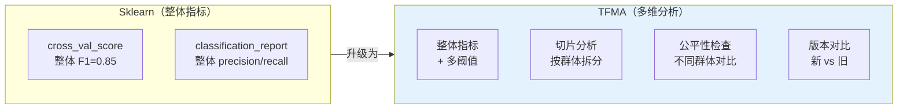
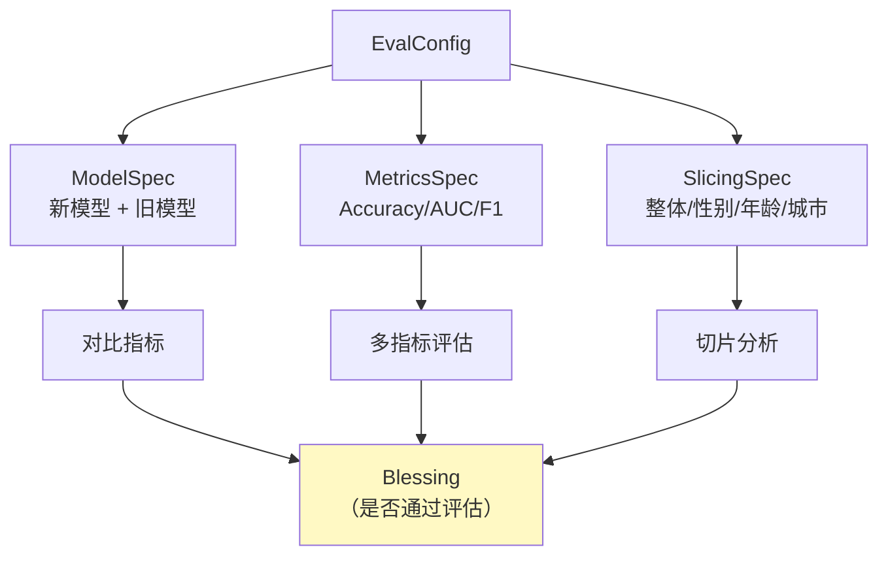
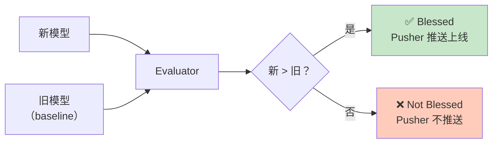

## 前置知识：从 cross_val_score 到生产评估

```python
# ===== 你熟悉的 Sklearn 评估 =====
from sklearn.model_selection import cross_val_score
from sklearn.metrics import classification_report

scores = cross_val_score(model, X, y, cv=5, scoring='f1')
print(f"F1: {scores.mean():.4f} ± {scores.std():.4f}")
print(classification_report(y_test, y_pred))
```

够用吗？生产环境需要更多：

- 模型对不同用户群体（年龄段/地区/性别）效果一样吗？→ **切片分析**
- 新模型比旧模型好吗？好在哪？→ **版本对比**
- 模型对男性/女性有偏见吗？→ **公平性检查**
- 在不同阈值下表现如何？→ **多阈值评估**



> [!important] TFMA 的核心价值
> - **cross_val_score** 告诉你"整体好不好"
> - **TFMA** 告诉你"对每个群体好不好"、"比旧模型好不好"、"有没有偏见"

---

## 一、TFMA 基础：Evaluator 组件

### 1.1 在 TFX Pipeline 中使用

```python
from tfx.components import Evaluator
from tfx.proto import evaluator_pb2

evaluator = Evaluator(
    examples=example_gen.outputs['examples'],   # 评估数据
    model=trainer.outputs['model'],             # 新模型
    baseline_model=None,                         # 基线模型（旧版本）
    eval_config=eval_config,                     # 评估配置
)
```

### 1.2 评估配置（EvalConfig）

```python
import tensorflow_model_analysis as tfma
from tensorflow_model_analysis.proto import config_pb2

# 阈值用 tfma 提供的包装类构造（proto 中没有 TriggerValue/TriggerDiff 消息）
accuracy_threshold = tfma.MetricThreshold(
    # 绝对阈值：最低准确率 80%
    value_threshold=tfma.GenericValueThreshold(
        lower_bound={'value': 0.8},
    ),
    # 变化阈值：新模型比旧模型好（最多允许下降 1%）
    change_threshold=tfma.GenericChangeThreshold(
        direction=tfma.MetricDirection.HIGHER_IS_BETTER,
        absolute={'value': -0.01},
    ),
)

eval_config = config_pb2.EvalConfig(
    # 模型规格
    model_specs=[
        config_pb2.ModelSpec(
            name='candidate',   # 新模型
            signature_name='serving_default',
        ),
        config_pb2.ModelSpec(
            name='baseline',    # 旧模型（对比用）
            signature_name='serving_default',
            is_baseline=True,
        ),
    ],
    # 指标规格
    metrics_specs=[
        config_pb2.MetricsSpec(
            metrics=[
                config_pb2.MetricConfig(
                    name='binary_accuracy',
                    threshold=accuracy_threshold,
                ),
                config_pb2.MetricConfig(name='auc'),
                config_pb2.MetricConfig(name='precision'),
                config_pb2.MetricConfig(name='recall'),
                config_pb2.MetricConfig(name='f1_score'),
            ],
        ),
    ],
    # 切片规格
    slicing_specs=[
        config_pb2.SlicingSpec(),                           # 整体
        config_pb2.SlicingSpec(feature_keys=['gender']),    # 按性别
        config_pb2.SlicingSpec(feature_keys=['age_group']), # 按年龄段
        config_pb2.SlicingSpec(feature_keys=['city']),      # 按城市
        config_pb2.SlicingSpec(
            feature_keys=['gender', 'age_group']            # 交叉切片
        ),
    ],
)
```



> [!important] Blessing 机制
> - Evaluator 输出 `blessing` Artifact：**新模型是否比旧模型好**
> - 如果通过（blessed=True），Pusher 会推送
> - 如果不通过（blessed=False），Pusher **不会推送**——模型不会上线

---

## 二、切片分析

### 2.1 什么是切片分析

```python
# 整体准确率 = 85%
# 但拆分后可能发现：
# ─────────────────────────────
# 群体           准确率   样本数
# ─────────────────────────────
# 男性           90%      5000
# 女性           78%      3000    ← 偏低
# 18-25 岁      72%      2000    ← 偏低
# 26-35 岁      88%      4000
# 北京           91%      3000
# 三线城市       65%      1000    ← 偏低
# ─────────────────────────────
```

> [!warning] 为什么切片分析重要
> - **整体 85% 可能掩盖群体差异**：女性只有 78%，三线城市只有 65%
> - **模型上线后**：对某些群体效果差会导致用户投诉、合规风险
> - **Sklearn 的 cross_val_score**：只给整体指标，不做群体拆分

### 2.2 使用 TFMA 做切片分析

```python
import tensorflow_model_analysis as tfma

# 独立使用 TFMA（不在 TFX Pipeline 中）
eval_result = tfma.run_eval(
    eval_shared_model=tfma.default_eval_shared_model(
        model_path='/model/saved_model',
        model_name='my_model',
    ),
    data_location='/data/eval.tfrecord',
    eval_config=eval_config,
)

# 查看切片结果
tfma.view.render_slicing_metrics(
    eval_result,
    slicing_column='gender',
)
# 会显示交互式表格：每个性别切片的 accuracy/precision/recall
```

```python
# 多维交叉切片
tfma.view.render_slicing_metrics(
    eval_result,
    slicing_spec=config_pb2.SlicingSpec(
        feature_keys=['gender', 'age_group']
    ),
)
# 显示：男性+18-25 / 男性+26-35 / 女性+18-25 / ... 每个组合的指标
```

---

## 三、公平性检查

### 3.1 什么是公平性

```python
# 公平性指标示例：
# ──────────────────────────────────────────
# 指标               男性    女性    差异
# ──────────────────────────────────────────
# 准确率             90%    78%    -12%  ← 差异大
# 假正率(FPR)        5%     15%    +10%  ← 女性被误判更多
# 假负率(FNR)        5%     7%     +2%
# ──────────────────────────────────────────
# 结论：模型对女性有偏见（FPR 差异超过 10%）
```

### 3.2 TFMA 公平性检查

```python
# 公平性指标由独立的 fairness-indicators 包提供，需要单独安装：
# pip install fairness-indicators

# 注册公平性指标（导入模块即完成注册）
import tensorflow_model_analysis.addons.fairness.post_export_metrics.fairness_post_export_metrics  # noqa: F401

# 在 EvalConfig 的 metrics 中启用 FairnessIndicators 指标，
# 并在 slicing_specs 中声明关注的维度（没有 per_slice / FairnessThreshold 这类参数）
fairness_eval_config = config_pb2.EvalConfig(
    metrics_specs=[
        config_pb2.MetricsSpec(
            metrics=[
                config_pb2.MetricConfig(
                    class_name='FairnessIndicators',
                    config='{"thresholds": [0.25, 0.5, 0.75]}',
                ),
            ],
        ),
    ],
    slicing_specs=[
        config_pb2.SlicingSpec(),                         # 整体
        config_pb2.SlicingSpec(feature_keys=['gender']),  # 公平性关注的维度
    ],
)

# 可视化公平性（Fairness Indicators 交互式面板）
from tensorflow_model_analysis.addons.fairness.view import widget_view
widget_view.render_fairness_indicator(eval_result=eval_result)
```

> [!important] 公平性指标
> | 指标 | 含义 | 公平标准 |
> |------|------|---------|
> | 均等机会 | 不同群体的 TPR 相同 | 群体间 TPR 差 < 10% |
> | 人口均等 | 不同群体的预测正例率相同 | 群体间 P(ŷ=1) 差 < 10% |
> | 预测一致性 | 误差率群体间一致 | 群体间 FPR/FNR 差 < 10% |

---

## 四、模型版本对比

```python
# ============================================
# TFMA 版本对比：新模型 vs 旧模型
# ============================================

# 在 EvalConfig 中配置 baseline
# 阈值同样用 tfma 包装类构造（没有 TriggerValue/TriggerDiff）
auc_threshold = tfma.MetricThreshold(
    # 绝对阈值：AUC 必须大于 0.8
    value_threshold=tfma.GenericValueThreshold(
        lower_bound={'value': 0.8},
    ),
    # 变化阈值：新模型 AUC 不能比旧模型低 1%
    change_threshold=tfma.GenericChangeThreshold(
        direction=tfma.MetricDirection.HIGHER_IS_BETTER,
        absolute={'value': -0.01},
    ),
)

eval_config = config_pb2.EvalConfig(
    model_specs=[
        config_pb2.ModelSpec(name='candidate'),
        config_pb2.ModelSpec(name='baseline', is_baseline=True),
    ],
    metrics_specs=[
        config_pb2.MetricsSpec(
            metrics=[
                config_pb2.MetricConfig(
                    name='auc',
                    threshold=auc_threshold,
                ),
            ],
        ),
    ],
)

# 运行对比评估
eval_result = tfma.run_eval(
    eval_shared_model=tfma.default_eval_shared_model(
        model_path='/model/new',
        model_name='candidate',
    ),
    # ... 还需要 baseline model
)

# 可视化对比
tfma.view.render_plot(eval_result, slicing_column='gender')
```



---

## 五、TFMA vs Sklearn 评估对比

| 维度 | Sklearn | TFMA |
|------|---------|------|
| 整体指标 | ✅ `classification_report` | ✅ 多指标 |
| 交叉验证 | ✅ `cross_val_score` | ✅ 多次运行 |
| 切片分析 | ❌ 需手动拆分 | ✅ 内置多维切片 |
| 公平性 | ❌ | ✅ 内置公平性指标 |
| 版本对比 | ❌ | ✅ 新旧模型自动对比 |
| 阈值控制 | ❌ | ✅ 自动判断是否通过 |
| 可视化 | matplotlib 手动画 | 交互式仪表盘 |
| 部署集成 | ❌ | ✅ 与 Pusher 联动 |

---

## 六、练习

> [!exercise] 🟢 基础：配置 EvalConfig
> **目标**：写一个 EvalConfig，包含 AUC + F1 指标 + gender 切片。
>
> <details>
> <summary>🔑 参考答案</summary>
>
> ```python
> eval_config = config_pb2.EvalConfig(
>     model_specs=[config_pb2.ModelSpec(name='candidate')],
>     metrics_specs=[
>         config_pb2.MetricsSpec(
>             metrics=[
>                 config_pb2.MetricConfig(name='auc'),
>                 config_pb2.MetricConfig(name='f1_score'),
>             ],
>         ),
>     ],
>     slicing_specs=[
>         config_pb2.SlicingSpec(),
>         config_pb2.SlicingSpec(feature_keys=['gender']),
>     ],
> )
> ```
>
> </details>

> [!exercise] 🟡 进阶：切片分析 + 可视化
> **目标**：用 TFMA 对已训练模型做切片分析，可视化不同群体的指标差异。
>
> <details>
> <summary>🔑 参考答案</summary>
>
> ```python
> import tensorflow_model_analysis as tfma
>
> eval_result = tfma.run_eval(
>     eval_shared_model=tfma.default_eval_shared_model(
>         model_path='/model/saved_model',
>     ),
>     data_location='/data/eval.tfrecord',
>     eval_config=eval_config,
> )
> tfma.view.render_slicing_metrics(eval_result, slicing_column='gender')
> ```
>
> </details>

> [!exercise] 🔴 挑战：配置新旧模型对比
> **目标**：配置 baseline 模型对比，设置阈值（AUC 新模型不能低于旧模型）。
>
> <details>
> <summary>🔑 参考答案</summary>
>
> ```python
> import tensorflow_model_analysis as tfma
>
> eval_config = config_pb2.EvalConfig(
>     model_specs=[
>         config_pb2.ModelSpec(name='candidate'),
>         config_pb2.ModelSpec(name='baseline', is_baseline=True),
>     ],
>     metrics_specs=[
>         config_pb2.MetricsSpec(
>             metrics=[
>                 config_pb2.MetricConfig(
>                     name='auc',
>                     threshold=tfma.MetricThreshold(
>                         # 新模型 AUC 不能比旧模型低 1%
>                         change_threshold=tfma.GenericChangeThreshold(
>                             direction=tfma.MetricDirection.HIGHER_IS_BETTER,
>                             absolute={'value': -0.01},
>                         ),
>                     ),
>                 ),
>             ],
>         ),
>     ],
>     slicing_specs=[config_pb2.SlicingSpec()],
> )
> ```
>
> </details>

---

## 七、常见陷阱

| # | 陷阱 | 正确做法 |
|---|------|---------|
| 1 | 只看整体指标 | 必须做切片分析，关注弱势群体表现 |
| 2 | 忘记设 baseline | 版本对比需要 `is_baseline=True` |
| 3 | 阈值设太严 | 新模型不比旧模型好就不上线，可能导致永远不更新 |
| 4 | 忽视公平性 | 合规风险，某些行业（金融/招聘）必须检查 |
| 5 | 不看 blessing 结果 | Pusher 依赖 blessing，未通过不会部署 |

---

*前置：[[X3-特征工程 TFT]]*
*后续：[[X5-推送与部署]]*
*关联：[[05-模型评估与调优对比]]（cross_val_score 锚点）*
