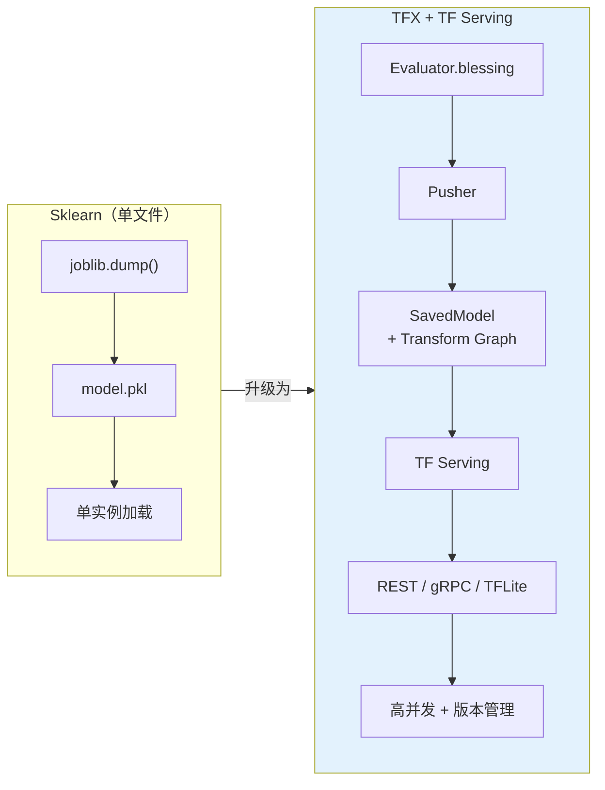
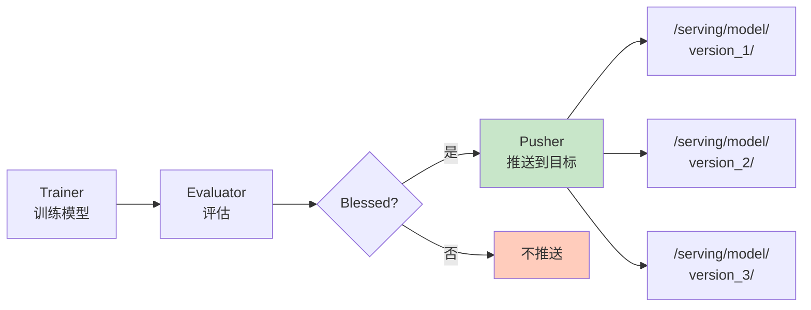

## 前置知识：从 model.save() 到生产部署

```python
# ===== 你熟悉的方式（主路径 v5）=====
model.save('/model/saved_model')
# 手动复制到服务器
# 手写 Flask API 做推理
# 没有版本管理
# 没有自动回滚
```

够用吗？生产环境需要更多：

- 模型需要**高并发**（每秒 10000 请求）
- 模型需要**版本管理**（回滚到上一版本）
- 模型需要**多格式**（REST / gRPC / TFLite）
- 模型需要**热更新**（新版本上线不重启服务）
- 模型需要**A/B 测试**（同时跑多个版本对比）



> [!important] 核心转变
> - **Sklearn**：单文件 pickle，手动加载，单实例
> - **TFX + TF Serving**：SavedModel 目录，自动版本管理，高并发服务

---

## 一、SavedModel 格式

### 1.1 SavedModel 是什么

```python
# ============================================
# SavedModel 是 TF 的标准部署格式
# ============================================
# 保存模型（包含签名 + 变量 + graph）
model.save('saved_model_dir', save_format='tf')

# 目录结构：
# saved_model_dir/
# ├── saved_model.pb        # 模型图 + 签名
# ├── variables/            # 权重
# │   ├── variables.data-00000-of-00001
# │   └── variables.index
# └── assets/               # 词汇表等附加资源
#     └── vocab.txt
```

### 1.2 Signature（签名）

```python
# ============================================
# Signature 定义模型的输入/输出接口
# ============================================

# 自定义签名
@tf.function(input_signature=[
    tf.TensorSpec(shape=[None, 4], dtype=tf.float32, name='input_features')
])
def serving_fn(input_features):
    output = model(input_features, training=False)
    return {'predictions': output}

# 保存时指定签名
model.save(
    'saved_model_dir',
    signatures={'serving_default': serving_fn}
)
```

> [!important] 为什么需要 Signature
> - **输入/输出明确**：TF Serving 知道模型需要什么格式的数据
> - **多签名**：同一个模型可以有多个签名（如 `predict` 和 `classify`）
> - **与 Transform Graph 合并**：TFX 把 Transform Graph 和模型签名合并为一个 serving 签名

---

## 二、Pusher 组件

### 2.1 Pusher 的作用

```python
from tfx.components import Pusher
from tfx.proto import pusher_pb2

pusher = Pusher(
    model=trainer.outputs['model'],              # 训练好的模型
    model_blessing=evaluator.outputs['blessing'], # 评估结果（必须通过）
    push_destination=pusher_pb2.PushDestination(
        filesystem=pusher_pb2.PushDestination.Filesystem(
            base_directory='/serving/model/iris'  # 推送目标目录
        )
    ),
)
# 输出：pushed_model（推送后的模型目录）
```



> [!important] Pusher 的前置条件
> - **必须**有 `model_blessing`（Evaluator 输出）
> - 如果 blessing = False，Pusher **不会推送**
> - 这保证了"不达标的模型不上线"

### 2.2 多种推送目标

```python
# 1. 文件系统（本地 / GCS / S3）
pusher_pb2.PushDestination(
    filesystem=pusher_pb2.PushDestination.Filesystem(
        base_directory='gs://my-bucket/models/iris'
    )
)

# 2. TFLite（移动端）——在 Trainer 的 run_fn 中额外导出
def run_fn(fn_args):
    model = build_model()
    model.save(fn_args.serving_model_dir)

    # 额外导出 TFLite
    converter = tf.lite.TFLiteConverter.from_saved_model(fn_args.serving_model_dir)
    converter.optimizations = [tf.lite.Optimize.DEFAULT]  # 量化
    tflite_model = converter.convert()
    with open(fn_args.serving_model_dir + '/model.tflite', 'wb') as f:
        f.write(tflite_model)

# 3. TF.js（浏览器用）
import tensorflowjs as tfjs
tfjs.converters.convert_tf_saved_model('/serving/saved_model', '/serving/tfjs_model')
```

| 格式 | 适用场景 | 文件大小 | 推理速度 |
|------|---------|---------|---------|
| SavedModel | TF Serving / Python | 大 | 快（GPU） |
| TFLite | 移动端 / IoT | 小（INT8 ~25%） | 中（CPU/GPU Delegate） |
| TF.js | 浏览器 | 中 | 慢（WebGL） |

---

## 三、InfraValidator 组件

```python
from tfx.components import InfraValidator
from tfx.proto import infra_validator_pb2

infra_validator = InfraValidator(
    model=trainer.outputs['model'],
    serving_spec=infra_validator_pb2.ServingSpec(
        tensorflow_serving=infra_validator_pb2.TensorFlowServing(
            tags=['latest']  # 测试最新 TF Serving 镜像
        ),
    ),
    validation_spec=infra_validator_pb2.ValidationSpec(
        max_loading_time_seconds=60,  # 模型必须在 60 秒内加载完成
        num_tries=3,                   # 重试 3 次
    ),
)
# 输出：blessing（模型是否能在目标环境运行）
```

> [!important] 两种 Blessing 的分工
> - **Evaluator**：模型效果好（AUC > 0.8）
> - **InfraValidator**：模型能跑（内存够、加载快、GPU 可用）
> - 两者都通过，Pusher 才推送

---

## 四、TF Serving

### 4.1 安装与启动

```bash
# Docker 方式（推荐）
docker run -d --name tf-serving \
  -p 8501:8501 \
  -p 8500:8500 \
  -v /serving/model:/models \
  -e MODEL_NAME=iris \
  tensorflow/serving

# 配置文件方式（多模型）
# /models/models.config
model_config_list {
  config {
    name: 'iris'
    base_path: '/models/iris'
    model_platform: 'tensorflow'
  }
}
```

### 4.2 REST API 推理（端口 8501）

```python
import requests
import json

# REST 推理（易用，适合原型/中低并发）
data = json.dumps({
    "instances": [
        {"features": [5.1, 3.5, 1.4, 0.2]},
        {"features": [6.2, 3.4, 5.4, 2.3]},
    ]
})

response = requests.post(
    'http://localhost:8501/v1/models/iris:predict',
    data=data,
    headers={'content-type': 'application/json'}
)

predictions = response.json()['predictions']
print(predictions)  # [[0.9, 0.05, 0.05], [0.01, 0.02, 0.97]]
```

### 4.3 gRPC 推理（端口 8500）

```python
# gRPC 推理（高性能，适合高并发生产）
import grpc
import tensorflow as tf
from tensorflow_serving.apis import predict_pb2, prediction_service_pb2_grpc

channel = grpc.insecure_channel('localhost:8500')
stub = prediction_service_pb2_grpc.PredictionServiceStub(channel)

request = predict_pb2.PredictRequest()
request.model_spec.name = 'iris'
request.model_spec.signature_name = 'serving_default'
request.inputs['features'].CopyFrom(
    tf.make_tensor_proto([[5.1, 3.5, 1.4, 0.2]], shape=[1, 4])
)

response = stub.Predict(request, timeout=10.0)
output = tf.make_ndarray(response.outputs['predictions'])
print(output)
```

> [!tip] REST vs gRPC
> | 维度 | REST (8501) | gRPC (8500) |
> |------|-------------|-------------|
> | 易用性 | ✅ curl/requests 直接用 | 需 protobuf 编译 |
> | 性能 | 中（HTTP 开销） | ✅ 快 2-5x（HTTP/2 + 二进制） |
> | 跨语言 | ✅ | ✅ |
> | 适用场景 | 原型/少量请求 | 高并发生产环境 |

---

## 五、版本管理与 A/B 测试

### 5.1 多版本并存

```bash
# TF Serving 自动加载目录下的所有版本
/serving/model/iris/
├── 1/     # 版本 1
│   ├── saved_model.pb
│   └── variables/
├── 2/     # 版本 2
│   ├── saved_model.pb
│   └── variables/
└── 3/     # 版本 3（当前版本，数字最大）

# TF Serving 自动加载最新版本
# 可以指定版本：
# curl http://localhost:8501/v1/models/iris/versions/2:predict
```

### 5.2 A/B 测试

```python
# ============================================
# A/B 测试：同时跑多个版本对比
# ============================================
import random

def predict(features, version=None):
    if version is None:
        # 随机分流（A/B 测试）
        version = random.choice(['2', '3'])
    url = f'http://localhost:8501/v1/models/iris/versions/{version}:predict'
    response = requests.post(url, json={'instances': [features]})
    return response.json()['predictions'][0]
```

### 5.3 TFLite 量化选项

| 量化方式 | 模型大小 | 精度损失 | 适用场景 |
|---------|---------|---------|---------|
| 无量化 | 100% | 0% | 高精度要求 |
| INT8 | ~25% | < 1% | 移动端推荐 |
| FP16 | ~50% | 极小 | GPU 加速 |

---

## 六、练习

> [!exercise] 🟢 基础：导出 SavedModel + 启动 TF Serving
> **目标**：训练一个 Iris 分类模型，导出 SavedModel，用 Docker 启动 TF Serving，REST 推理。
>
> ```bash
> # 1. 导出模型
> model.save('/serving/model/iris/1', save_format='tf')
>
> # 2. 启动 TF Serving
> docker run -d -p 8501:8501 -v /serving/model:/models -e MODEL_NAME=iris tensorflow/serving
>
> # 3. REST 推理
> curl -d '{"instances": [{"features": [5.1, 3.5, 1.4, 0.2]}]}' \
>   http://localhost:8501/v1/models/iris:predict
> ```
>
> **验收标准**：
> - [ ] SavedModel 目录包含 `saved_model.pb`
> - [ ] TF Serving 返回预测结果

> [!exercise] 🟡 进阶：配置 Pusher + InfraValidator 联动
> **目标**：在 TFX Pipeline 中添加 Pusher 和 InfraValidator，验证 blessing 机制。
>
> <details>
> <summary>🔑 参考答案</summary>
>
> ```python
> from tfx.components import Pusher, InfraValidator
> from tfx.proto import pusher_pb2, infra_validator_pb2
>
> infra_validator = InfraValidator(
>     model=trainer.outputs['model'],
>     serving_spec=infra_validator_pb2.ServingSpec(
>         tensorflow_serving=infra_validator_pb2.TensorFlowServing(tags=['latest']),
>     ),
>     validation_spec=infra_validator_pb2.ValidationSpec(
>         max_loading_time_seconds=60, num_tries=3),
> )
>
> pusher = Pusher(
>     model=trainer.outputs['model'],
>     model_blessing=evaluator.outputs['blessing'],
>     infra_blessing=infra_validator.outputs['blessing'],
>     push_destination=pusher_pb2.PushDestination(
>         filesystem=pusher_pb2.PushDestination.Filesystem(
>             base_directory='/serving/model/iris'
>         )
>     ),
> )
> ```
>
> </details>

> [!exercise] 🔴 挑战：TFLite 导出 + 移动端推理
> **目标**：把 SavedModel 转 TFLite（INT8 量化），用 Python 模拟移动端推理。
>
> <details>
> <summary>🔑 参考答案</summary>
>
> ```python
> converter = tf.lite.TFLiteConverter.from_saved_model('/model/saved_model')
> converter.optimizations = [tf.lite.Optimize.DEFAULT]  # INT8 量化
> tflite_model = converter.convert()
> with open('model.tflite', 'wb') as f:
>     f.write(tflite_model)
>
> interpreter = tf.lite.Interpreter(model_path='model.tflite')
> interpreter.allocate_tensors()
> input_details = interpreter.get_input_details()
> output_details = interpreter.get_output_details()
> interpreter.set_tensor(input_details[0]['index'], [[5.1, 3.5, 1.4, 0.2]])
> interpreter.invoke()
> output = interpreter.get_tensor(output_details[0]['index'])
> print(output)
> ```
>
> </details>

---

## 七、常见陷阱

| # | 陷阱 | 正确做法 |
|---|------|---------|
| 1 | 忽略 Signature | SavedModel 必须有 `serving_default` 签名 |
| 2 | 忘记 InfraValidator | 模型效果好但加载慢，上线会失败 |
| 3 | 版本目录命名错误 | TF Serving 要求目录名为数字（1, 2, 3） |
| 4 | 忽视 Transform Graph | Pusher 必须把 Transform Graph 和模型合并导出 |
| 5 | TFLite 转换失败 | 某些 TF 算子 TFLite 不支持，需检查兼容性 |

---

*前置：[[X4-模型分析 TFMA]]*
*后续：[[X6-端到端流水线实战]]*
*关联：[[v5-端到端ML项目]]（SavedModel 基础）*
