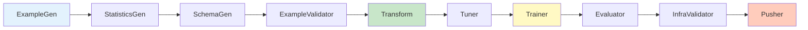
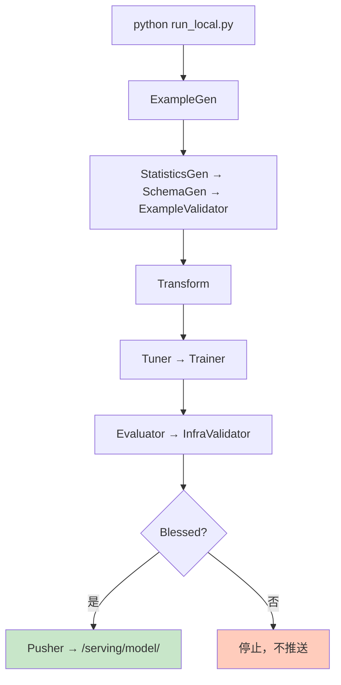
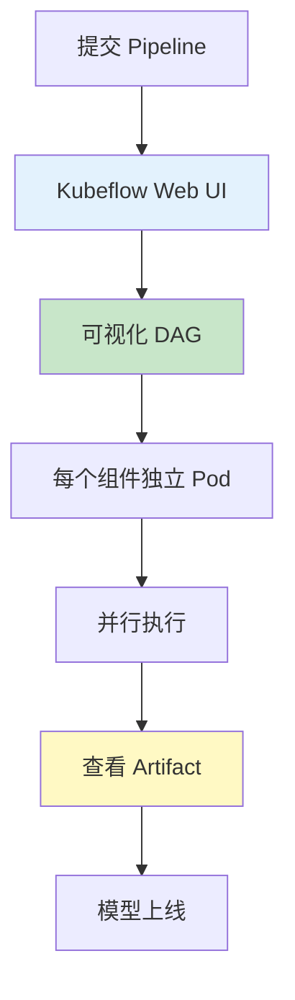

## 前置知识：串联所有组件

你已经学完了 TFX 的所有组件：X1 核心概念、X2 数据验证、X3 特征工程、X4 模型分析、X5 推送部署。现在把它们**串成一条流水线**。



> [!important] Pipeline 的缓存机制
> - 如果 `ExampleGen` 的输入数据没变，下次运行会跳过它
> - 如果 `Transform` 的 module_file 没变，也会跳过
> - `Trainer` 同样走缓存：输入数据与训练代码都没变时也会被跳过，只有依赖变了才会重跑（见 5.2 节）
> - 这大幅减少了开发迭代时间

---

## 一、完整 Pipeline 代码

### 1.1 Pipeline 定义文件

```python
# ============================================
# pipeline.py — 完整的 TFX Pipeline 定义
# ============================================
import os
from tfx.components import (
    CsvExampleGen,
    StatisticsGen,
    SchemaGen,
    ExampleValidator,
    Transform,
    Tuner,
    Trainer,
    Evaluator,
    InfraValidator,
    Pusher,
)
from tfx.proto import trainer_pb2, pusher_pb2, tuner_pb2, infra_validator_pb2
from tfx.orchestration import pipeline as tfx_pipeline
from tensorflow_model_analysis.proto import config_pb2
# 官方写法：ml_metadata 的 SQLite 连接配置由 tfx.orchestration.metadata 提供
# 用法：sqlite_metadata_connection_config(METADATA_PATH)，见下方 Pipeline 组装处
from tfx.orchestration.metadata import sqlite_metadata_connection_config

# ========== 路径配置 ==========
DATA_ROOT = '/data/iris'
PIPELINE_NAME = 'iris_pipeline'
PIPELINE_ROOT = f'/pipeline/{PIPELINE_NAME}'
METADATA_PATH = f'/pipeline/{PIPELINE_NAME}/metadata.db'
SERVING_ROOT = f'/serving/model/{PIPELINE_NAME}'

# ========== 1. 数据导入 ==========
example_gen = CsvExampleGen(input_base=DATA_ROOT)

# ========== 2. 数据统计 ==========
statistics_gen = StatisticsGen(
    examples=example_gen.outputs['examples']
)

# ========== 3. Schema 生成 ==========
schema_gen = SchemaGen(
    statistics=statistics_gen.outputs['statistics'],
    infer_feature_shape=True,
)

# ========== 4. 数据验证 ==========
example_validator = ExampleValidator(
    statistics=statistics_gen.outputs['statistics'],
    schema=schema_gen.outputs['schema'],
)

# ========== 5. 特征工程 ==========
transform = Transform(
    examples=example_gen.outputs['examples'],
    schema=schema_gen.outputs['schema'],
    module_file='transform_module.py',
)

# ========== 6. 超参调优 ==========
tuner = Tuner(
    module_file='trainer_module.py',
    examples=transform.outputs['transformed_examples'],
    transform_graph=transform.outputs['transform_graph'],  # tuner_fn 解析转换后数据需要它
    train_args=tuner_pb2.TrainArgs(num_steps=1000),
    eval_args=tuner_pb2.EvalArgs(num_steps=500),
    tune_args=tuner_pb2.TuneArgs(num_trials=10),
)

# ========== 7. 模型训练 ==========
trainer = Trainer(
    module_file='trainer_module.py',
    examples=transform.outputs['transformed_examples'],
    transform_graph=transform.outputs['transform_graph'],
    hyperparameters=tuner.outputs['best_hyperparameters'],
    train_args=trainer_pb2.TrainArgs(num_steps=5000),
    eval_args=trainer_pb2.EvalArgs(num_steps=2000),
)

# ========== 8. 模型评估 ==========
eval_config = config_pb2.EvalConfig(
    model_specs=[config_pb2.ModelSpec(name='candidate')],
    metrics_specs=[
        config_pb2.MetricsSpec(
            metrics=[
                config_pb2.MetricConfig(name='binary_accuracy'),
                config_pb2.MetricConfig(name='auc'),
            ],
        ),
    ],
    slicing_specs=[config_pb2.SlicingSpec()],
)

evaluator = Evaluator(
    examples=example_gen.outputs['examples'],
    model=trainer.outputs['model'],
    eval_config=eval_config,
)

# ========== 9. 基础设施验证 ==========
infra_validator = InfraValidator(
    model=trainer.outputs['model'],
    serving_spec=infra_validator_pb2.ServingSpec(
        tensorflow_serving=infra_validator_pb2.TensorFlowServing(
            tags=['latest']
        ),
    ),
    validation_spec=infra_validator_pb2.ValidationSpec(
        max_loading_time_seconds=60,
        num_tries=3,
    ),
)

# ========== 10. 推送部署 ==========
pusher = Pusher(
    model=trainer.outputs['model'],
    model_blessing=evaluator.outputs['blessing'],
    infra_blessing=infra_validator.outputs['blessing'],
    push_destination=pusher_pb2.PushDestination(
        filesystem=pusher_pb2.PushDestination.Filesystem(
            base_directory=SERVING_ROOT
        )
    ),
)

# ========== 组装 Pipeline ==========
components = [
    example_gen,
    statistics_gen,
    schema_gen,
    example_validator,
    transform,
    tuner,
    trainer,
    evaluator,
    infra_validator,
    pusher,
]

my_pipeline = tfx_pipeline.Pipeline(
    pipeline_name=PIPELINE_NAME,
    pipeline_root=PIPELINE_ROOT,
    components=components,
    metadata_connection_config=sqlite_metadata_connection_config(METADATA_PATH),
    enable_cache=True,  # 启用缓存（输入没变时跳过组件）
)
```

### 1.2 Transform 模块文件

```python
# ============================================
# transform_module.py — TFT 预处理函数
# ============================================
import tensorflow as tf
import tensorflow_transform as tft

def preprocessing_fn(inputs):
    """把原始特征转换为模型输入"""
    outputs = {}

    # 标准化数值特征（等价于 StandardScaler）
    outputs['sepal_length_scaled'] = tft.scale_to_z_score(inputs['sepal_length'])
    outputs['sepal_width_scaled'] = tft.scale_to_z_score(inputs['sepal_width'])
    outputs['petal_length_scaled'] = tft.scale_to_z_score(inputs['petal_length'])
    outputs['petal_width_scaled'] = tft.scale_to_z_score(inputs['petal_width'])

    # label 透传
    outputs['label'] = inputs['label']

    return outputs
```

### 1.3 Trainer 模块文件

```python
# ============================================
# trainer_module.py — 模型构建 + 训练 + 超参调优
# （参考 TFX 官方 penguin 模板：tfx/examples/penguin）
# ============================================
import tensorflow as tf
import tensorflow_transform as tft
import keras_tuner
from tensorflow import keras
from tfx.components import TunerFnResult

# 与 transform_module.py 中 preprocessing_fn 的输出键一一对应
TRANSFORMED_FEATURES = [
    'sepal_length_scaled',
    'sepal_width_scaled',
    'petal_length_scaled',
    'petal_width_scaled',
]
LABEL_KEY = 'label'

_TRAIN_BATCH_SIZE = 64
_EVAL_BATCH_SIZE = 64

def _build_model(hp):
    """构建模型。同时充当 KerasTuner 的 build 函数——搜索空间在函数内用 hp 声明：
    调优时由 Tuner 采样取值，直接训练时取声明的 default 默认值。"""
    hidden_units = hp.Int('hidden_units', min_value=32, max_value=128, step=32, default=64)
    learning_rate = hp.Float('learning_rate', min_value=1e-4, max_value=1e-2,
                             sampling='log', default=1e-3)

    # 输入是 Transform 输出的特征字典 → 用 Functional API 逐特征建 Input 再拼接
    inputs = [keras.layers.Input(shape=(1,), name=f) for f in TRANSFORMED_FEATURES]
    d = keras.layers.concatenate(inputs)
    d = keras.layers.Dense(hidden_units, activation='relu')(d)
    outputs = keras.layers.Dense(3, activation='softmax')(d)  # Iris 3 分类
    model = keras.Model(inputs=inputs, outputs=outputs)
    model.compile(
        optimizer=keras.optimizers.Adam(learning_rate),
        loss='sparse_categorical_crossentropy',
        metrics=['accuracy'],
    )
    return model

def _input_fn(file_pattern, tft_output, batch_size):
    """读取 Transform 输出的 TFRecord（序列化 tf.Example），解析后返回 (features, label)"""
    # Transform 输出的是序列化 tf.Example：先从 transform graph 拿 transformed
    # metadata/schema 构造 feature_spec，再逐条解析，然后 batch
    feature_spec = dict(tft_output.transformed_feature_spec())
    dataset = tf.data.TFRecordDataset(
        file_pattern, num_parallel_reads=tf.data.AUTOTUNE
    ).map(
        lambda x: tf.io.parse_single_example(x, feature_spec),
        num_parallel_calls=tf.data.AUTOTUNE,
    ).batch(batch_size)  # batch size 用固定值（32/64），绝不能用 fn_args.train_steps
    # 把 label 从特征字典中拆出来作为 y
    return dataset.map(lambda features: (features, features.pop(LABEL_KEY))).repeat()

# Tuner 入口（超参搜索空间）
def tuner_fn(fn_args):
    """TFX Tuner 入口：返回 keras_tuner 调优器 + fit 参数"""
    # 与 Trainer 相同：Transform 的输出也要先解析（同样需要 transform graph）
    tft_output = tft.TFTransformOutput(fn_args.transform_graph_path)

    train_dataset = _input_fn(fn_args.train_files, tft_output, _TRAIN_BATCH_SIZE)
    eval_dataset = _input_fn(fn_args.eval_files, tft_output, _EVAL_BATCH_SIZE)

    tuner = keras_tuner.RandomSearch(
        _build_model,  # 搜索空间在 _build_model 内用 hp.Int / hp.Float 声明
        max_trials=fn_args.tune_args.num_trials,
        objective=keras_tuner.Objective('val_accuracy', 'max'),
        directory=fn_args.working_dir,
        project_name='iris_tuning',
    )
    return TunerFnResult(
        tuner=tuner,
        fit_kwargs={
            'x': train_dataset,
            'validation_data': eval_dataset,
            'steps_per_epoch': fn_args.train_steps,
            'validation_steps': fn_args.eval_steps,
        },
    )

def _get_serve_tf_examples_fn(model, tft_output):
    """构造 serving signature：解析原始 tf.Example → 应用 Transform → 模型推理"""
    # 把 TFT 的 transform layer 挂到 model 上，确保 SavedModel 能追踪保存它
    model.tft_layer = tft_output.transform_features_layer()

    @tf.function(input_signature=[
        tf.TensorSpec(shape=[None], dtype=tf.string, name='examples')
    ])
    def serve_tf_examples_fn(serialized_tf_example):
        # serving 时收到的是原始（未转换）特征，用 raw_feature_spec 解析
        raw_feature_spec = tft_output.raw_feature_spec()
        raw_feature_spec.pop(LABEL_KEY)  # 线上没有 label
        raw_features = tf.io.parse_example(serialized_tf_example, raw_feature_spec)
        # 在线应用与训练完全一致的 Transform 转换（消除训练-服务偏差）
        transformed_features = model.tft_layer(raw_features)
        outputs = model(transformed_features)
        return {'outputs': outputs}

    return serve_tf_examples_fn

# Trainer 入口
def run_fn(fn_args):
    """TFX Trainer 入口函数（参考 TFX 官方 penguin 模板的 run_fn 结构）"""
    # 1. 读取 transform graph：训练侧用它解析转换后的数据，serving 侧用它导出签名
    tft_output = tft.TFTransformOutput(fn_args.transform_graph_path)

    # 2. 训练/评估数据集：解析 Transform 输出的序列化 tf.Example
    train_dataset = _input_fn(fn_args.train_files, tft_output, _TRAIN_BATCH_SIZE)
    eval_dataset = _input_fn(fn_args.eval_files, tft_output, _EVAL_BATCH_SIZE)

    # 3. 超参数：fn_args.hyperparameters 携带 Tuner 选出的最优配置，
    #    用 keras_tuner.HyperParameters.from_config 还原，再以 .get() 取值
    if fn_args.hyperparameters:
        hparams = keras_tuner.HyperParameters.from_config(fn_args.hyperparameters)
    else:
        hparams = keras_tuner.HyperParameters()  # 无 Tuner 时用搜索空间声明的 default
    model = _build_model(hparams)

    # 4. 训练（步数对应 pipeline.py 中 train_args/eval_args 的 num_steps）
    model.fit(
        train_dataset,
        validation_data=eval_dataset,
        steps_per_epoch=fn_args.train_steps,
        validation_steps=fn_args.eval_steps,
    )

    # 5. 导出 serving 模型：把 Transform 融进 serving signature，
    #    线上收到原始的序列化 tf.Example 即可直接推理
    signatures = {'serving_default': _get_serve_tf_examples_fn(model, tft_output)}
    model.save(fn_args.serving_model_dir, save_format='tf', signatures=signatures)
```

---

## 二、本地运行（LocalDagRunner）

```python
# ============================================
# run_local.py — 本地运行 Pipeline
# ============================================
from tfx.orchestration.local.local_dag_runner import LocalDagRunner
from pipeline import my_pipeline  # 导入上面定义的 Pipeline

runner = LocalDagRunner()
runner.run(my_pipeline)

# 运行完成后查看输出：
# /pipeline/iris_pipeline/
# ├── ExampleGen/
# ├── StatisticsGen/
# ├── SchemaGen/
# ├── ExampleValidator/
# ├── Transform/
# ├── Tuner/
# ├── Trainer/
# ├── Evaluator/
# ├── InfraValidator/
# └── Pusher/
```

```bash
# 运行
python run_local.py

# 查看输出
ls /pipeline/iris_pipeline/

# 查看部署的模型
ls /serving/model/iris_pipeline/
# 1/  （如果 Pusher 成功推送，版本 1）
```



---

## 三、Kubeflow 部署

### 3.1 安装 Kubeflow Pipelines

```bash
# 安装 kubectl
curl -LO "https://dl.k8s.io/release/$(curl -L -s https://dl.k8s.io/release/stable.txt)/bin/linux/amd64/kubectl"
chmod +x kubectl
sudo mv kubectl /usr/local/bin/

# 安装 Kubeflow Pipelines（单节点）
kubectl apply -k "github.com/kubeflow/pipelines/manifests/kustomize/cluster-scoped-resources?ref=2.0.0"
kubectl wait --for=condition=ready pod -l app=ml-pipeline -n kubeflow --timeout=300s

# 访问 Web UI
kubectl port-forward -n kubeflow svc/ml-pipeline-ui 8080:80
# 打开 http://localhost:8080
```

### 3.2 在 Kubeflow 上运行 Pipeline

```python
from tfx.orchestration.kubeflow import KubeflowDagRunner, KubeflowDagRunnerConfig

kubeflow_config = KubeflowDagRunnerConfig(
    kubeflow_metadata_config=metadata_config,
    tfx_image='tensorflow/tfx:1.15.0',  # TFX 镜像版本
    pipeline_operator_args={
        'namespace': 'kubeflow',
    },
)

runner = KubeflowDagRunner(config=kubeflow_config)
runner.run(my_pipeline)
# 生成 .tar.gz 文件，上传到 Kubeflow Pipelines Web UI
```



---

## 四、Airflow 定时触发

```python
# ============================================
# run_airflow.py — Airflow 定时触发
# ============================================
from tfx.orchestration.airflow.airflow_runner import AirflowDAGRunner
from datetime import datetime

# AirflowDAGRunner 接收一个 dict：键就是 airflow.DAG 的构造参数
# （没有 dag_id / pipeline_name 这类参数，流水线名由 TFX Pipeline 自身携带）
DAG = AirflowDAGRunner({
    'schedule_interval': '0 2 * * *',  # 每天凌晨 2 点运行
    'start_date': datetime(2026, 1, 1),
    'catchup': False,                   # 不补跑历史
}).run(my_pipeline)

# Airflow 会生成 DAG 文件，放在 ~/airflow/dags/ 目录下
```

> [!tip] 三种编排器选择
> | 编排器 | 适用场景 | 部署方式 | 分布式 |
> |--------|---------|---------|--------|
> | **LocalDagRunner** | 本地开发、测试 | 单机进程 | ❌ |
> | **Kubeflow Pipelines** | 生产环境 | K8S 集群 | ✅ |
> | **Apache Airflow** | 已有 Airflow 基础设施 | Airflow Worker | ✅ |

---

## 五、缓存机制详解

### 5.1 缓存逻辑

```python
# TFX 的缓存逻辑：
# 1. 检查组件的输入 Artifact 是否有变化
# 2. 如果没变化，跳过该组件，直接使用上次输出
# 3. 如果有变化，重新运行该组件

# 默认启用缓存
my_pipeline = tfx_pipeline.Pipeline(
    ...
    enable_cache=True,
)
```

### 5.2 修改触发缓存失效

```python
# 方法 1：修改 module_file（文件内容变了，缓存失效）
# 方法 2：设置 enable_cache=False（全局禁用缓存）
# 方法 3：手动删除 Artifact（删除对应组件的输出目录）

# 示例：修改 transform_module.py 添加新特征
# outputs['feature_product'] = inputs['sepal_length'] * inputs['sepal_width']
# 重跑 Pipeline 后：
# - ExampleGen 不会重跑（输入数据没变）
# - StatisticsGen/SchemaGen 不会重跑
# - Transform 会重跑（module_file 变了）
# - Trainer 会重跑（依赖 Transform 的输出）
# - Evaluator/Pusher 会重跑（依赖 Trainer 的输出）
```

---

## 六、练习

> [!exercise] 🟢 基础：运行完整 Pipeline
> **目标**：把上面的完整代码跑通，查看每个组件的输出 Artifact。
>
> ```bash
> python run_local.py
> ls /pipeline/iris_pipeline/
> ls /serving/model/iris_pipeline/
> ```
>
> **验收标准**：
> - [ ] 所有 10 个组件成功运行
> - [ ] Pusher 成功推送模型到 /serving/model/
> - [ ] Evaluator 输出 blessing=True

> [!exercise] 🟡 进阶：修改 Transform 触发缓存失效
> **目标**：修改 `transform_module.py` 添加新特征（`sepal_length * sepal_width`），重跑 Pipeline，观察哪些组件重跑。
>
> <details>
> <summary>🔑 参考答案</summary>
>
> ```python
> # 在 transform_module.py 的 preprocessing_fn 中添加：
> outputs['feature_product'] = inputs['sepal_length'] * inputs['sepal_width']
>
> # 重跑 Pipeline 后观察：
> # - ExampleGen 不重跑（输入没变）
> # - Transform 重跑（module_file 变了）
> # - Trainer 重跑（依赖 Transform 输出）
> # - Evaluator/Pusher 重跑
> ```
>
> </details>

> [!exercise] 🔴 挑战：部署到 Kubeflow
> **目标**：把 Pipeline 部署到 Kubeflow，体验 Web UI 可视化。
>
> <details>
> <summary>🔑 参考答案</summary>
>
> ```bash
> # 1. 安装 Kubeflow Pipelines（见第三节）
> # 2. 生成 Pipeline 包
> python run_kubeflow.py
> # 3. 上传 .tar.gz 到 Kubeflow Web UI
> # 4. 在 http://localhost:8080 查看 DAG 图
> ```
>
> </details>

---

## 七、常见陷阱

| # | 陷阱 | 正确做法 |
|---|------|---------|
| 1 | 忘记 enable_cache | 默认启用，大幅节省迭代时间 |
| 2 | 模块文件路径错误 | module_file 必须是可访问的路径 |
| 3 | 忽视 metadata_connection_config | 必须配置元数据存储 |
| 4 | Kubeflow 版本不兼容 | TFX 和 Kubeflow 版本要匹配 |
| 5 | Airflow Worker 不够 | 大数据集需要更多 Worker |

---

*前置：[[X5-推送与部署]]*
*后续：[[X7-监控与运维]]*
*关联：[[v5-端到端ML项目]]（端到端概念）*
