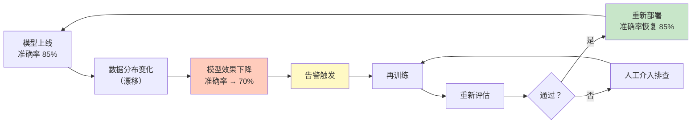
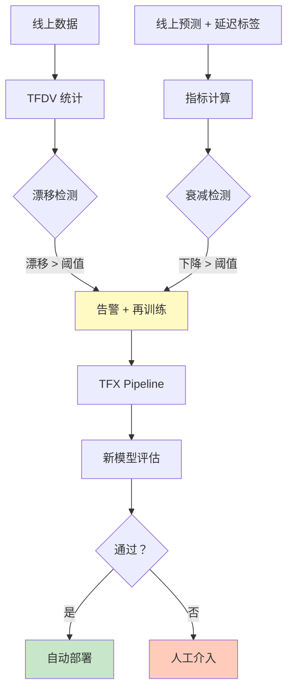
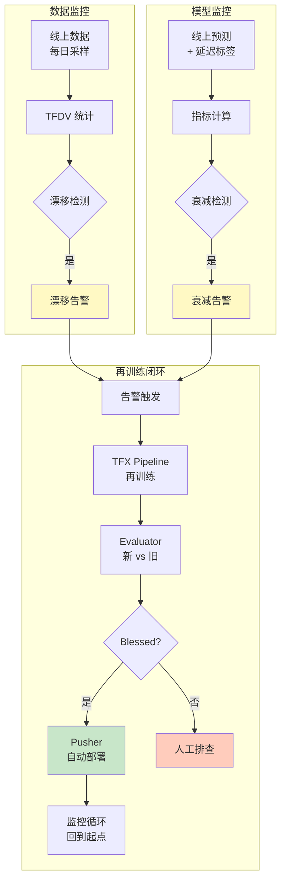

## 前置知识：模型上线后会发生什么

模型上线第一天准确率 85%，一个月后可能降到 70%——为什么？

- **数据漂移**：用户群体变了（年轻人多了 / 新城市上线）
- **概念漂移**：特征和标签的关系变了（经济环境变化影响消费行为）
- **上游系统变更**：数据采集逻辑改了 / 新字段加了



> [!important] MLOps 的运维闭环
> - **传统开发**：代码上线 → 修 bug → 再上线
> - **MLOps**：模型上线 → 监控漂移 → 再训练 → 重新评估 → 重新部署
> - 模型会"衰减"——这是 ML 独有的运维问题

---

## 一、数据漂移监控

### 1.1 漂移类型

| 漂移类型 | 定义 | 示例 |
|---------|------|------|
| **数据漂移**（Covariate Shift） | 特征分布变了，但 P(y\|x) 没变 | 用户年龄均值从 35 变到 45 |
| **概念漂移**（Concept Drift） | P(y\|x) 变了 | 之前 30 岁买保险概率 10%，现在 50% |
| **标签漂移** | 标签分布变了 | 正负样本比例从 1:1 变成 1:9 |

### 1.2 用 TFDV 监控漂移

```python
import tensorflow_data_validation as tfdv

# 1. 保存基线统计（训练时）
baseline_stats = tfdv.generate_statistics_from_csv('/data/train.csv')
tfdv.write_stats_text(baseline_stats, '/monitor/baseline_stats.tfrecord')

# 2. 定期生成当前统计（每天/每周）
current_stats = tfdv.generate_statistics_from_csv('/data/serving_today.csv')

# 3. 对比检测漂移
tfdv.visualize_statistics(
    lhs_statistics=baseline_stats,
    rhs_statistics=current_stats,
    lhs_name='Baseline (Train)',
    rhs_name='Current (Serving)',
)

# 4. 自动检测异常 + 漂移
# 注意：只传 schema + environment 只做 Schema 校验；
# 漂移检测必须传 previous_statistics 作为对比基准
anomalies = tfdv.validate_statistics(
    current_stats,
    schema=schema,
    environment='SERVING',
    previous_statistics=baseline_stats,  # 漂移对比基准：训练时保存的统计
)

if anomalies.anomaly_info:
    # 触发告警
    send_alert(f"数据漂移检测到！{len(anomalies.anomaly_info)} 个异常")
```

### 1.3 配置漂移阈值

```python
# 漂移阈值的真实写法：配置在 Schema 中每个 feature 的
# drift_comparator（FeatureComparator proto）上，而非 StatsOptions。
# 类别型特征（city）用 L-infinity 距离，数值型特征（income）用 Jensen-Shannon 散度
from tensorflow_metadata.proto.v0 import schema_pb2  # noqa: F401（proto 结构所在模块）

# city 更敏感：L-infinity 阈值 0.05
tfdv.get_feature(schema, 'city').drift_comparator.infinity_norm.threshold = 0.05

# income：Jensen-Shannon 散度阈值 0.1
tfdv.get_feature(schema, 'income').drift_comparator.jensen_shannon_divergence.threshold = 0.1

# 阈值随 Schema 生效；检测时必须传 previous_statistics 才会做漂移对比
anomalies = tfdv.validate_statistics(
    current_stats,
    schema=schema,
    previous_statistics=baseline_stats,
)
```

> [!important] 漂移检测 vs 异常检测
> | 维度 | 异常检测 | 漂移检测 |
> |------|---------|---------|
> | 检查什么 | 数据是否符合 Schema | 数据分布是否变了 |
> | 严重程度 | ERROR（硬错误） | WARNING（软警告） |
> | 触发条件 | 类型错误、值域越界 | 分布距离超过阈值 |
> | 后果 | 数据有 bug | 模型可能需要再训练 |

---

## 二、模型衰减检测

### 2.1 收集线上表现

```python
# ============================================
# 监控模型线上表现
# ============================================

# 1. 收集线上预测 + 真实标签（延迟获取）
#    场景：用户今天申请贷款，模型预测"通过"
#    一个月后才知道是否违约 → 延迟标签

# 2. 定期计算指标
from sklearn.metrics import accuracy_score, f1_score

# 假设每天收集一批预测结果
y_true = [...]  # 延迟获取的真实标签
y_pred = [...]  # 模型预测

current_accuracy = accuracy_score(y_true, y_pred)
current_f1 = f1_score(y_true, y_pred)

# 3. 对比基线
baseline_accuracy = 0.85  # 上线时的准确率
threshold = 0.05           # 允许下降 5%

if current_accuracy < baseline_accuracy - threshold:
    send_alert(
        f"模型衰减！准确率从 {baseline_accuracy} 降到 {current_accuracy:.4f}"
    )
    # 触发再训练
```

### 2.2 衰减趋势可视化

```python
import matplotlib.pyplot as plt

# 记录每日指标
dates = ['7/1', '7/5', '7/10', '7/15', '7/20', '7/25']
accuracies = [0.85, 0.84, 0.82, 0.79, 0.76, 0.73]
thresholds = [0.80] * len(dates)  # 告警线

fig, ax = plt.subplots(figsize=(10, 4))
ax.plot(dates, accuracies, 'b-o', label='准确率')
ax.axhline(y=0.80, color='r', linestyle='--', label='告警线 (80%)')
ax.fill_between(dates, accuracies, 0.80,
                where=[a < 0.80 for a in accuracies],
                color='red', alpha=0.3, label='衰减区域')
ax.set_xlabel('日期')
ax.set_ylabel('准确率')
ax.legend()
ax.set_title('模型衰减趋势')
plt.tight_layout()
plt.savefig('/monitor/decay_trend.png')
```

---

## 三、再训练触发

### 3.1 触发逻辑

```python
def should_retrain(monitoring_metrics):
    """判断是否需要再训练"""
    reasons = []

    # 条件 1：准确率下降超过阈值
    if monitoring_metrics['accuracy_drop'] > 0.05:
        reasons.append("准确率下降超过 5%")

    # 条件 2：数据漂移严重
    if monitoring_metrics['drift_score'] > 0.1:
        reasons.append("数据漂移超过阈值")

    # 条件 3：定期再训练（如每月）
    if monitoring_metrics['days_since_last_train'] > 30:
        reasons.append("距上次训练超过 30 天")

    return reasons

# 触发再训练
reasons = should_retrain(monitoring_metrics)
if reasons:
    # 调用 TFX Pipeline
    trigger_pipeline('iris_pipeline')
    send_alert(f"触发再训练。原因：{'; '.join(reasons)}")
```



---

## 四、监控架构全景



---

## 五、日志与告警

### 5.1 日志记录

```python
import logging
import json
from datetime import datetime

# 配置日志
logging.basicConfig(
    level=logging.INFO,
    format='%(asctime)s - %(name)s - %(levelname)s - %(message)s',
    handlers=[
        logging.FileHandler('/monitor/pipeline.log'),
        logging.StreamHandler(),
    ]
)

logger = logging.getLogger('model_monitor')

def log_monitoring_event(event_type, data):
    logger.info(json.dumps({
        'event': event_type,
        'timestamp': datetime.now().isoformat(),
        'data': data,
    }))
```

### 5.2 告警通知

```python
def send_alert(message):
    """多渠道告警"""
    # 1. 日志
    log_monitoring_event('ALERT', {'message': message})

    # 2. 邮件
    # send_email(subject='模型监控告警', body=message)

    # 3. Slack / 钉钉 / 飞书
    # send_slack(message)

    # 4. PagerDuty（紧急）
    # trigger_pagerduty(message)
    print(f"🚨 ALERT: {message}")
```

---

## 六、练习

> [!exercise] 🟢 基础：漂移检测脚本
> **目标**：写一个脚本，对比基线统计和当前统计，输出漂移报告。
>
> ```python
> import tensorflow_data_validation as tfdv
>
> baseline = tfdv.load_stats_text('/monitor/baseline_stats.tfrecord')
> current = tfdv.generate_statistics_from_csv('/data/serving_today.csv')
> tfdv.visualize_statistics(lhs_statistics=baseline, rhs_statistics=current,
>                            lhs_name='Baseline', rhs_name='Current')
> ```
>
> **验收标准**：
> - [ ] 能生成对比可视化
> - [ ] 能识别漂移特征

> [!exercise] 🟡 进阶：衰减检测 + 告警
> **目标**：实现模型衰减检测逻辑，当准确率下降超过 5% 时输出告警。
>
> <details>
> <summary>🔑 参考答案</summary>
>
> ```python
> baseline_accuracy = 0.85
> threshold = 0.05
>
> current_accuracy = accuracy_score(y_true, y_pred)
>
> if current_accuracy < baseline_accuracy - threshold:
>     send_alert(f"模型衰减！{baseline_accuracy} → {current_accuracy:.4f}")
> ```
>
> </details>

> [!exercise] 🔴 挑战：完整监控闭环
> **目标**：搭建漂移 + 衰减 + 再训练的完整监控闭环，用定时任务每日执行。
>
> <details>
> <summary>🔑 参考答案</summary>
>
> ```python
> # daily_monitor.py — 每日定时执行
> def daily_monitor():
>     # 1. 漂移检测
>     drift = check_drift()
>     # 2. 衰减检测
>     decay = check_decay()
>     # 3. 判断是否再训练
>     if drift or decay:
>         trigger_pipeline('iris_pipeline')
>         send_alert("触发再训练")
>
> # 用 cron 或 Airflow 每日触发
> # crontab: 0 8 * * * python daily_monitor.py
> ```
>
> </details>

---

## 七、常见陷阱

| # | 陷阱 | 正确做法 |
|---|------|---------|
| 1 | 上线后不监控 | 必须定期检测漂移和衰减 |
| 2 | 真实标签延迟获取 | 设计反馈机制，收集延迟标签 |
| 3 | 再训练不用新数据 | 再训练应包含最新数据 |
| 4 | 告警阈值不合理 | 用历史数据校准阈值，避免误报/漏报 |
| 5 | 只监控不告警 | 告警必须有人响应，否则等于没监控 |
| 6 | 没有回滚机制 | 新模型效果差时要能快速回滚到旧版本 |

---

## 八、后续迭代建议

1. **短期**：对已有项目搭建漂移检测脚本，每日运行
2. **中期**：用 Airflow/cron 实现自动化监控 + 再训练触发
3. **长期**：集成 MLflow（实验追踪）+ W&B（可视化）+ Grafana（指标看板）
4. **进阶**：学习 Kubeflow Pipelines 的定时触发 + Web UI 监控

---

*前置：[[X6-端到端流水线实战]]*
*关联：[[X2-数据验证 TFDV]]（漂移检测基础）*
*回主路径：[[00-TensorFlow 总览索引（Sklearn 迁移版）]]*
