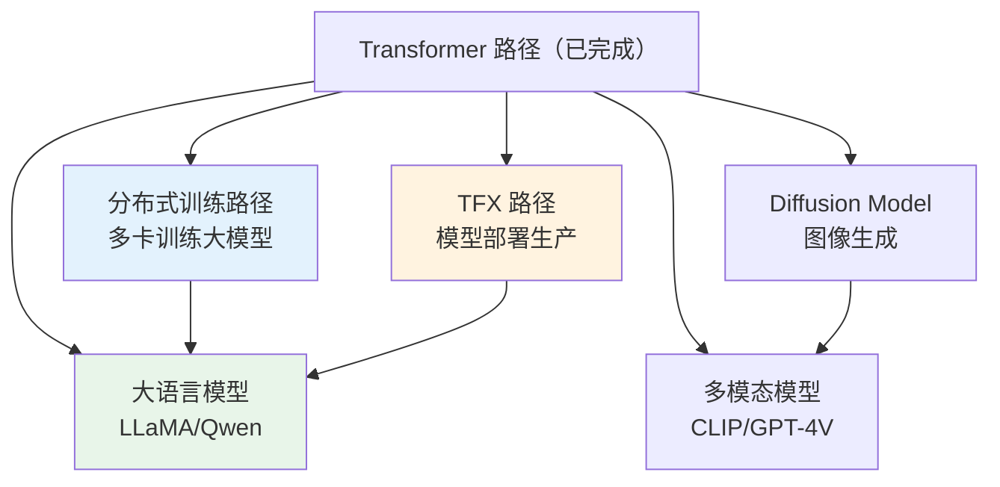

## 🎯 Transformer 路径完成度自检

### Phase 2：掌握模型（T5-T7）

| # | 检查项 | 状态 |
|---|--------|:---:|
| 1 | 知道 BERT 的两个预训练任务（MLM + NSP） | ☐ |
| 2 | 知道 MLM 的 80/10/10 遮盖策略 | ☐ |
| 3 | 能用 HuggingFace 加载 BERT 并微调 | ☐ |
| 4 | 知道微调学习率为什么必须很小（2e-5~5e-5） | ☐ |
| 5 | 知道 BERT 三大微调场景（分类/NER/QA） | ☐ |
| 6 | 知道 GPT 是 Decoder-only + 因果注意力 | ☐ |
| 7 | 能解释自回归生成原理 | ☐ |
| 8 | 知道 Temperature/Top-k/Top-p 的区别 | ☐ |
| 9 | 能用 HuggingFace pipeline 一行代码做推理 | ☐ |
| 10 | 知道 TFAutoModel vs TFAutoModelForXxx 的区别 | ☐ |
| 11 | 能实现微调五步法 | ☐ |
| 12 | 知道 LoRA 的原理和优势（参数减少 98%+） | ☐ |

### Phase 3：拓展应用（T8-T9）

| # | 检查项 | 状态 |
|---|--------|:---:|
| 13 | 知道 ViT 把图像切成 Patch 当序列处理 | ☐ |
| 14 | 知道 ViT 在小数据上不如 CNN 的原因（无归纳偏置） | ☐ |
| 15 | 能对比 ViT vs CNN vs Swin | ☐ |
| 16 | 能完成至少一个 T9 项目实战 | ☐ |
| 17 | 知道 T5 vs GPT 做摘要的区别 | ☐ |

**通过标准**：至少 14/17 ☑。少于 10 个，建议重读薄弱章节。

---

## 📝 快速自测（15 题）

### Q1：BERT 的 MLM 遮盖策略是什么？

答案

随机选 15% token：80% 替换为 `[MASK]`，10% 替换为随机 token，10% 保持不变。让模型不只依赖 `[MASK]` 标记，微调时效果更好。（`##` 是 WordPiece 子词前缀，与遮盖无关）

### Q2：BERT vs GPT 的核心架构区别？

答案

BERT 用 Encoder（双向 Attention，无 causal mask，适合理解任务）；GPT 用 Decoder（因果 Attention，有 causal mask，适合生成任务）。BERT 一次编码全文，GPT 逐 token 生成。

### Q3：微调 BERT 的学习率为什么必须很小？

答案

预训练权重已接近最优，大学习率会"灾难性遗忘"已学到的表示。微调学习率 2e-5~5e-5 比预训练 1e-4~5e-4 小 10-20 倍。

### Q4：LoRA 的核心思想是什么？

答案

冻结原始权重 W，只训练低秩适配矩阵 ΔW = A×B（A: d×r, B: r×d, r<<d）。总参数减少 98%+，效果接近全参数微调。训练后可合并 W'=W+AB，推理无延迟。

### Q5：GPT 的 Temperature 参数控制什么？

答案

控制生成的随机性。temperature<1 更确定（趋近贪心），temperature>1 更随机。推荐值 0.7~0.9，太高会生成无意义文本。

### Q6：Top-k 和 Top-p 采样的区别？

答案

Top-k 固定截断到 k 个 token；Top-p 自适应截断，选择累积概率≥p 的最小集合。Top-p 更灵活，是推荐方案（配合 Temperature=0.8, Top-p=0.9）。

### Q7：T5 是什么架构？和 GPT 有什么区别？

答案

T5 是 Encoder-Decoder 架构（完整 Transformer），GPT 是 Decoder-Only。T5 适合翻译/摘要（需要理解再表达），GPT 适合对话/创意生成。

### Q8：HuggingFace 的 TFAutoModel 和 TFAutoModelForSequenceClassification 有什么区别？

答案

`TFAutoModel` 只返回基础模型（输出 hidden states），没有任务头。`TFAutoModelForSequenceClassification` 在基础模型上加了分类头，输出 logits，可以直接 compile + fit。

### Q9：ViT 的 Patch Embedding 怎么做？

答案

用 Conv2D(kernel_size=stride=patch_size) 一步完成切 Patch + 线性嵌入。224×224 图像 + patch_size=16 → 14×14=196 个 Patch，每个 768 维。

### Q10：ViT 为什么需要大数据？

答案

ViT 没有归纳偏置（locality、translation invariance），像一张白纸需要大量数据学习这些规律。CNN 有归纳偏置，小数据上效果更好。

### Q11：Swin Transformer 解决了什么问题？

答案

ViT 的 Attention 复杂度 O(n²) 在大图像上不可接受。Swin 用窗口注意力（只在 7×7 窗口内 Attention）+ 移位窗口（跨窗口信息传递），复杂度降到 O(n)。

### Q12：什么时候选 ViT vs CNN？

答案

小数据（<10K 图）→CNN；大数据（>100K 图）→ViT；检测/分割→Swin；移动端→CNN(MobileNet)。有 ImageNet 预训练时两者效果接近。

### Q13：文本分类用 BERT 还是 GPT？

答案

BERT。BERT 是双向理解，[CLS] 表示直接接分类头即可。GPT 是单向生成，做分类需要额外设计（如提示词格式）。

### Q14：文本摘要用 T5 还是 GPT？

答案

T5。T5 是 Encoder-Decoder，双向编码输入再解码摘要，训练效率更高。GPT 适合创意写作而非摘要。

### Q15：KV Cache 是什么？为什么重要？

答案

自回归生成时，缓存已计算的 K/V，每生成新 token 只计算新 token 的 Q 与缓存 K/V 的 Attention。复杂度从 O(n³) 降到 O(n²)，加速 10-30 倍。ChatGPT 等大模型推理必须用 KV Cache。

---

## 🚨 常见错误诊断

### 错误 1：`ValueError: The model did not return a loss`

原因与修复

HuggingFace 模型需要用 `from_logits=True` 的损失函数。修复：`SparseCategoricalCrossentropy(from_logits=True)`。

### 错误 2：`CUDA out of memory` / OOM

排查步骤

1. 减小 batch_size
2. 用梯度累积（等效大 batch）
3. 用 LoRA 替代全参数微调
4. 用 `mixed_float16` 混合精度
5. 用 `tf.config.experimental.set_memory_growth(gpu, True)`

### 错误 3：微调 3 epoch 后验证准确率不升反降

排查步骤

1. 学习率是否太大（> 5e-4？→ 降到 2e-5）
2. 是否忘记 shuffle 数据
3. 是否用了 EarlyStopping
4. 数据量是否太少（< 1000 条？→ 加数据增强）

### 错误 4：模型输出全是同一个标签

排查步骤

1. 检查数据是否均衡（类别不平衡）
2. 检查学习率（太大会灾难遗忘）
3. 检查 loss 是否在下降
4. 打印中间层输出看是否有梯度流

### 错误 5：`Tokenizer doesn't have padding token`

原因与修复

GPT 等模型没有默认 padding token。修复：`tokenizer.pad_token = tokenizer.eos_token`。

---

## 🎯 项目实战清单

完成以下项目，验证你能端到端使用 Transformer：

| # | 项目 | 模型 | 难度 | 状态 |
|---|------|------|:---:|:---:|
| 1 | 英文情感分类 | DistilBERT | ⭐⭐⭐ | ☐ |
| 2 | 中文情感分类 | RoBERTa-wwm-ext | ⭐⭐⭐ | ☐ |
| 3 | 花卉图像分类 | ViT-base | ⭐⭐⭐⭐ | ☐ |
| 4 | 新闻文本摘要 | T5-small | ⭐⭐⭐⭐⭐ | ☐ |
| 5 | 零样本摘要对比 | GPT-2-medium | ⭐⭐⭐⭐ | ☐ |
| 6 | 命名实体识别 | BERT Token Classification | ⭐⭐⭐ | ☐ |
| 7 | 问答系统 | BERT QA | ⭐⭐⭐⭐ | ☐ |

---

## 📝 30 秒速查表

| 概念 | 关键点 |
|------|--------|
| BERT | Encoder-Only，双向，MLM+NSP，理解任务 |
| GPT | Decoder-Only，因果，自回归 LM，生成任务 |
| T5 | Encoder-Decoder，文本到文本，翻译/摘要 |
| MLM | 80% `[MASK]` + 10% 随机 + 10% 不变 |
| 微调 LR | 2e-5 ~ 5e-5 |
| LoRA | 低秩适配，参数减少 98%+，可插拔 |
| Temperature | <1 确定，>1 随机，0.7~0.9 最佳 |
| Top-p | 自适应截断，推荐 0.9 |
| KV Cache | 缓存 K/V，推理加速 10-30× |
| ViT | 图像→Patch→Transformer，大数据好 |
| Swin | 窗口注意力，分层架构，密集预测 |
| HuggingFace | 统一 API + 30 万+ 模型 + TF 原生 |

---

## 🚀 后续学习路线图

| 方向 | 路径 | 难度 | 前置条件 |
|------|------|:---:|---------|
| 分布式训练 | [[分布式训练/D0-分布式训练 路径总览]] | ⭐⭐⭐ | TF 主路径 08/09 |
| TFX MLOps | [[TFX/X0-TFX 路径总览]] | ⭐⭐⭐ | TF 主路径 v5 |
| Diffusion Model | 待创建 | ⭐⭐⭐⭐ | Transformer + CNN |
| 多模态 | 待创建 | ⭐⭐⭐⭐ | ViT + GPT |
| 大语言模型 | 待创建 | ⭐⭐⭐⭐⭐ | 分布式训练 |

---

## 🎓 Transformer 路径毕业总结

| 阶段 | 内容 | 核心能力 |
|------|------|---------|
| Phase 1 | T1-T4 架构理解 | 能从零搭建 Transformer |
| Phase 2 | T5-T7 掌握模型 | 能用 BERT/GPT/HuggingFace 做 NLP 任务 |
| Phase 3 | T8-T9 拓展应用 | 能用 ViT 做图像分类，完成端到端项目 |

**下一步**：选择一个后续方向深入，或做一个实际项目巩固所学。

---

*Transformer 路径完结 🎉*
*2026-07-25*