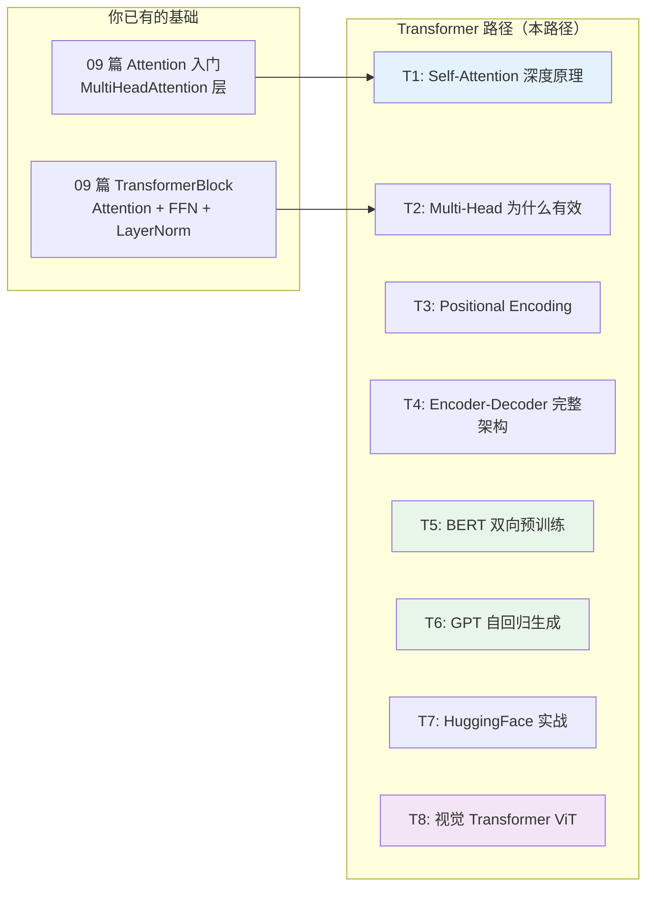
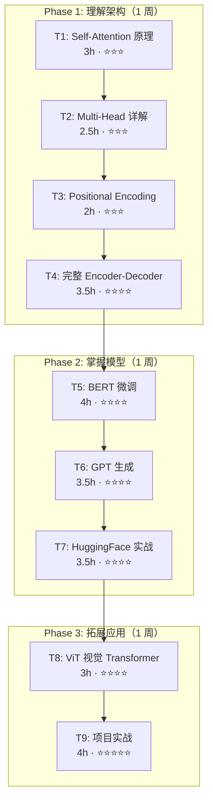
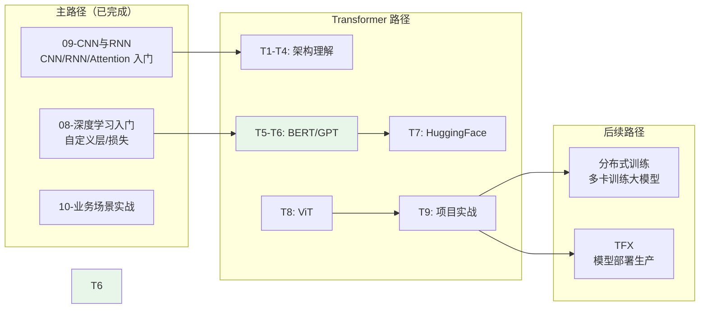

> [!warning] 版本基线（本路径全部笔记基于此）
> - **Keras 2.x**（TF 2.15 语境）；Keras 3 的 API 有变化
> - **transformers 必须 < 5.0**：v5 已移除全部 TF 模型（`TFAutoModel` 等类不存在），安装用 `pip install "transformers<5"`
> - **peft 不支持 TF**（纯 PyTorch 实现）：TF 下做 LoRA 用 [[T5-BERT 双向预训练与微调]] 的自研 `LoRADense`

## 前置知识：为什么 Transformer 是最重要的下一步

你已经完成了 TensorflowLearningBySklearn 三周路径，掌握了 CNN/RNN/Attention 基础。09 篇的"十、注意力机制入门"展示了 `MultiHeadAttention` 比 LSTM 更能捕捉长距离依赖——但只触及了表面。

**Transformer 是 2017 年以来 AI 领域最重要的架构突破**，BERT、GPT、ChatGPT、LLaMA、ViT、DALL-E 全部基于它。

> [!important] Transformer 路径与主路径的关系
> - **09 篇**：让你知道 Attention 存在、能写出 TransformerBlock
> - **本路径**：让你理解 *为什么* 这样设计、能微调 BERT/GPT 做实际任务
> - **分布式训练路径**：让你能在多卡/多机上训练大模型
> - **TFX 路径**：让你能把 Transformer 模型部署到生产环境

---

## 一、课程清单

| # | 笔记 | 核心内容 | 差异等级 | 建议学时 |
|---|------|---------|---------|---------|
| T0 | [[T0-Transformer 路径总览]] | 本文件：课程清单 + 路线图 | — | 0.5h |
| T1 | [[T1-Self-Attention 深度原理]] | Q/K/V 矩阵 / 缩放点积 / 注意力权重可视化 / 与 RNN 的本质区别 | ⭐⭐⭐ 高 | 3h |
| T2 | [[T2-Multi-Head Attention]] | 为什么多头 / 头数选择 / 拼接与投影 / 因果注意力（Causal Mask） | ⭐⭐⭐ 高 | 2.5h |
| T3 | [[T3-Positional Encoding]] | 正弦余弦编码 / 可学习位置编码 / 旋转位置编码（RoPE） / 相对位置 | ⭐⭐⭐ 高 | 2h |
| T4 | [[T4-Encoder-Decoder 完整架构]] | Transformer 论文原始架构 / Encoder 堆叠 / Decoder 交叉注意力 / 翻译任务 | ⭐⭐⭐⭐ 高 | 3.5h |
| T5 | [[T5-BERT 双向预训练与微调]] | MLM/NSP 预训练任务 / 文本分类微调 / 命名实体识别 / 问答 / TF-Hub 加载 | ⭐⭐⭐⭐ 高 | 4h |
| T6 | [[T6-GPT 自回归生成]] | 自回归语言模型 / Transformer-XL / GPT-2 架构 / 文本生成策略 / Temperature/Top-p/Top-k | ⭐⭐⭐⭐ 高 | 3.5h |
| T7 | [[T7-HuggingFace + TensorFlow 实战]] | transformers 库 / pipeline / AutoModel / Tokenizer / 微调全流程 / LoRA | ⭐⭐⭐⭐ 高 | 3.5h |
| T8 | [[T8-视觉 Transformer ViT]] | 图像 Patch 化 / ViT 架构 / DeiT / Swin Transformer / 图像分类实战 | ⭐⭐⭐⭐ 高 | 3h |
| T9 | [[T9-Transformer 项目实战]] | 情感分析 + 文本摘要 + 图像分类三大场景完整代码 | ⭐⭐⭐⭐⭐ 高 | 4h |
| 99-1 | [[99-Transformer-Phase1 复习检查点]] | Phase 1（T1-T4）复习检查清单 + 自测题 | — | 1h |
| 99-2 | [[99-Transformer-Phase2+3 复习检查点]] | Phase 2+3（T5-T9）复习检查清单 + 自测题 + 速查表 | — | 1h |

**总预计学时：~30h**

---

## 二、三阶段学习路线

| 阶段 | 目标 | 检验标准 |
|------|------|---------|
| **Phase 1** | 能画出 Transformer 完整架构 | 解释 Q/K/V 计算过程 + 写出 Encoder Block |
| **Phase 2** | 能微调 BERT/GPT 做实际任务 | 用 BERT 做情感分析 + 用 GPT 生成文本 |
| **Phase 3** | 能完成端到端 Transformer 项目 | 完成 T9 项目实战 |

---

## 三、与主路径的衔接关系

---

## 四、核心概念速查表

| 概念 | 一句话解释 | 首次出现 |
|------|----------|---------|
| Self-Attention | 序列中每个位置关注所有其他位置 | T1 |
| Q/K/V | Query/Key/Value 三个线性变换，计算注意力权重 | T1 |
| Scaled Dot-Product | `softmax(QK^T / √d_k) × V`，缩放防止梯度消失 | T1 |
| Multi-Head | 多个注意力头并行，捕捉不同子空间的关系 | T2 |
| Causal Mask | 上三角遮罩，防止 Decoder 看到未来 token | T2 |
| Positional Encoding | 给没有顺序信息的 Attention 注入位置信息 | T3 |
| RoPE | 旋转位置编码，通过旋转矩阵编码相对位置 | T3 |
| Encoder | 双向注意力，适合理解任务（BERT） | T4 |
| Decoder | 因果注意力，适合生成任务（GPT） | T4 |
| MLM | Masked Language Model，随机遮盖词预测 | T5 |
| NSP | Next Sentence Prediction，句子对关系预测 | T5 |
| Fine-tuning | 在预训练模型上针对下游任务微调 | T5 |
| Autoregressive | 自回归，逐 token 生成 | T6 |
| Temperature | 控制生成文本的随机性 | T6 |
| LoRA | Low-Rank Adaptation，参数高效微调 | T7 |
| ViT | Vision Transformer，把图像切成 Patch 当序列处理 | T8 |
| Swin | 分层视觉 Transformer，引入窗口注意力 | T8 |

---

## 五、常见易错点

| # | 易错点 | 正确理解 |
|---|--------|---------|
| 1 | Attention 就是加权平均 | 不只是加权平均——缩放点积 + 多头 + 残差连接才是完整方案 |
| 2 | BERT 和 GPT 一样 | BERT 是双向 Encoder（理解），GPT 是单向 Decoder（生成） |
| 3 | 位置编码可以省略 | 没有位置编码 = 不知道词序，模型退化为词袋模型 |
| 4 | 头数越多越好 | 头数 × head_dim = embed_dim，头太多每头维度太小 |
| 5 | 微调就是改最后一层 | 微调是全参数更新（LoRA 除外），不只是换分类头 |
| 6 | ViT 比 CNN 好 | ViT 需要大数据集（ImageNet 级别），小数据集 CNN 更好 |
| 7 | HuggingFace 和 TF 不兼容 | transformers 库原生支持 TF，用 `TFAutoModel` 即可 |

---

## 六、后续可选迭代

1. **短期**：完成 T1→T4 架构理解，能画出 Transformer 全貌
2. **中期**：用 HuggingFace + BERT 做一个实际 NLP 项目（情感分析/文本分类）
3. **长期**：学习 Diffusion Model（Stable Diffusion）、多模态模型（CLIP/LLaVA）

---

*创建时间：2026-07-25*
*前置路径：[[09-CNN与RNN-TF独有领域]]*
*后续路径：分布式训练 / TFX*