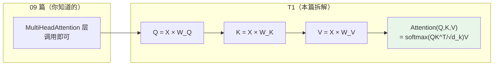
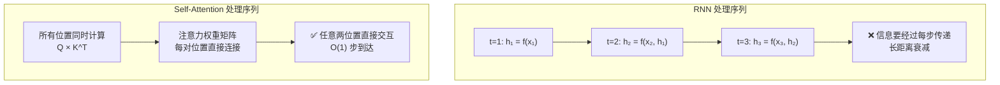
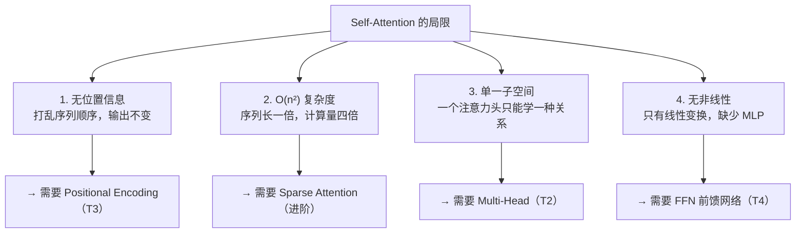

## 前置知识：从 09 篇的 Attention 层到数学本质

09 篇你写了 `tf.keras.layers.MultiHeadAttention(num_heads=4, key_dim=32)`，知道它能"关注序列中所有位置"。但你可能不清楚：**为什么是 Q/K/V 三个矩阵？为什么要除以 √d_k？注意力权重怎么算出来的？**

本篇从数学原理拆解 Self-Attention，让你不只"会调用"，而是"能解释"。



> [!important] 核心公式（记住这一个）
> $$\text{Attention}(Q, K, V) = \text{softmax}\left(\frac{QK^T}{\sqrt{d_k}}\right)V$$
>
> - **Q**（Query）：当前位置在"问"什么
> - **K**（Key）：每个位置能"回答"什么
> - **V**（Value）：每个位置实际"提供"的内容
> - **√d_k**：缩放因子，防止点积过大导致 softmax 饱和

---

## 一、Q/K/V：三个线性变换的本质

### 1.1 用 Sklearn 思维理解

在 Sklearn 中，你习惯用 `LinearRegression` 做线性变换 `y = Xw + b`。Q/K/V 本质上就是三个不同的线性变换：

```python
import tensorflow as tf

# ============================================
# 输入序列：3 个 token，每个 4 维 embedding
# shape: (seq_len, embed_dim)
# ============================================
x = tf.constant([
    [1.0, 0.0, 2.0, 1.0],   # token 1: "The"
    [0.0, 1.0, 1.0, 0.0],   # token 2: "cat"
    [2.0, 1.0, 0.0, 1.0],   # token 3: "sat"
])  # (3, 4)

# ============================================
# Q/K/V 三个线性变换（可学习参数）
# 类比 sklearn 的 coef_：W_Q, W_K, W_V
# ============================================
embed_dim = 4   # 输入维度
d_k = 8         # Q/K 的输出维度

W_Q = tf.Variable(tf.random.normal([embed_dim, d_k], stddev=0.1))
W_K = tf.Variable(tf.random.normal([embed_dim, d_k], stddev=0.1))
W_V = tf.Variable(tf.random.normal([embed_dim, d_k], stddev=0.1))

# 三个变换：X 乘不同权重矩阵 → Q/K/V
Q = tf.matmul(x, W_Q)   # (3, 8) — 每个 token 的"查询向量"
K = tf.matmul(x, W_K)   # (3, 8) — 每个 token 的"键向量"
V = tf.matmul(x, W_V)   # (3, 8) — 每个 token 的"值向量"

print(f"Q shape: {Q.shape}")  # (3, 8)
print(f"K shape: {K.shape}")  # (3, 8)
print(f"V shape: {V.shape}")  # (3, 8)
```

> [!tip] 为什么是三个矩阵而不是一个？
> 类比图书馆检索：
> - **Q**（Query）= 你的搜索词 → "我想找关于猫的书"
> - **K**（Key）= 每本书的标签 → "动物/小说/科学"
> - **V**（Value）= 书的内容 → 实际拿到的知识
> - **注意力权重** = Q 和 K 的匹配度 → 搜索词和标签越相关，权重越高
>
> 三个矩阵把"查询"和"被查询"**解耦**——Q 决定"我要找什么"，K 决定"我能提供什么"，模型能学习更复杂的注意力模式。

### 1.2 Self vs Cross vs Encoder-Decoder Attention

| 注意力类型 | Query 来源 | Key/Value 来源 | 典型应用 |
|-----------|-----------|---------------|---------|
| **Self-Attention** | 序列 A | 序列 A（同一个） | BERT Encoder |
| **Cross-Attention** | 序列 A | 序列 B（不同的） | Transformer Decoder |
| **Encoder-Decoder** | Decoder 当前位置 | Encoder 输出 | 机器翻译 |

> [!tip] Self-Attention 的直觉
> 想象你在读一篇文章，读到"learning"时，大脑会自动回溯关注"machine"（因为 machine learning 是固定搭配），较少关注"I"。Self-Attention 就是模拟这个过程——**每个位置动态决定关注哪些位置**。

### 1.3 与 RNN 的本质区别



| 特性 | RNN | Self-Attention |
|------|-----|----------------|
| 长距离依赖 | 逐步传递，衰减 | 直接连接，无衰减 |
| 并行化 | ❌ 必须按顺序 | ✅ 所有位置同时算 |
| 复杂度 | O(n) 时间 | O(n²) 时间 |
| 适合场景 | 短序列、小数据 | 长序列、大数据 |

> [!tip] 选择建议
> - **短序列（< 100）**：RNN 和 Self-Attention 效果接近，RNN 更省内存
> - **长序列（> 100）**：Self-Attention 明显更好
> - **2017 年后 NLP 主流**：Transformer，RNN 逐渐边缘化

---

## 二、缩放点积注意力：完整计算流程

### 2.1 逐行拆解公式

```python
import tensorflow as tf

def scaled_dot_product_attention(Q, K, V, mask=None):
    """
    缩放点积注意力（Transformer 的核心运算）

    参数:
        Q: (seq_len, d_k) — 查询矩阵
        K: (seq_len, d_k) — 键矩阵
        V: (seq_len, d_v) — 值矩阵
        mask: 可选遮罩
    返回:
        output: 注意力输出
        weights: 注意力权重（用于可视化）
    """
    # ============================================
    # Step 1: Q × K^T → 注意力分数
    # Q 和每个 K 的点积 = 相似度
    # ============================================
    scores = tf.matmul(Q, K, transpose_b=True)  # (seq_len, seq_len)
    print(f"Scores shape: {scores.shape}")

    # ============================================
    # Step 2: 缩放（除以 √d_k）
    # 点积随维度增大而变大，softmax 会饱和
    # → 梯度趋零 → 训练停滞
    # √d_k 把分数拉回合理范围
    # ============================================
    d_k = tf.cast(tf.shape(K)[-1], tf.float32)
    scaled_scores = scores / tf.sqrt(d_k)

    # ============================================
    # Step 3: 可选 mask（用于 Decoder，见 T2）
    # 将需要遮蔽的位置设为 -∞
    # softmax 后这些位置权重 → 0
    # ============================================
    if mask is not None:
        scaled_scores += (mask * -1e9)

    # ============================================
    # Step 4: softmax → 注意力权重
    # 每行求 softmax = 每个位置对其他位置的注意力分配
    # 权重和 = 1（概率分布）
    # ============================================
    weights = tf.nn.softmax(scaled_scores, axis=-1)  # (seq_len, seq_len)

    # ============================================
    # Step 5: 权重 × V → 输出
    # 按注意力比例混合所有位置的 Value
    # ============================================
    output = tf.matmul(weights, V)  # (seq_len, d_v)

    return output, weights

# 测试
Q = tf.random.normal((3, 8))
K = tf.random.normal((3, 8))
V = tf.random.normal((3, 8))

output, weights = scaled_dot_product_attention(Q, K, V)
print(f"Output: {output.shape}")    # (3, 8)
print(f"Weights: {weights.shape}")  # (3, 3)
print(f"Row sums: {tf.reduce_sum(weights, axis=-1).numpy()}")  # [1.0, 1.0, 1.0]
```

> [!warning] 为什么要除以 √d_k？
> 如果 d_k = 512，两个 512 维向量的点积期望值 ≈ 0，方差 ≈ 512（标准差 ≈ 22.6）。这么大的值送入 softmax 会导致：
> - 最大值 softmax ≈ 1，其余 ≈ 0 → **梯度消失**
> - 模型只关注一个位置，失去多位置综合能力
> - 除以 √512 ≈ 22.6 后，方差回到 1，softmax 分布合理
>
> **不缩放的后果**：训练初期注意力权重接近 one-hot，梯度极小，参数难以更新，训练不稳定。

### 2.2 注意力权重可视化

```python
import matplotlib.pyplot as plt
import numpy as np

# ============================================
# 可视化注意力权重矩阵
# 每行 = 一个 token 对所有 token 的注意力
# ============================================
tokens = ["The", "cat", "sat", "on", "the", "mat"]

np.random.seed(42)
weights = np.random.dirichlet(np.ones(6), size=6)  # (6, 6)，每行和=1

fig, ax = plt.subplots(figsize=(8, 6))
im = ax.imshow(weights, cmap='Blues')

ax.set_xticks(range(6))
ax.set_yticks(range(6))
ax.set_xticklabels(tokens)
ax.set_yticklabels(tokens)

# 在格子中标注数值
for i in range(6):
    for j in range(6):
        ax.text(j, i, f"{weights[i, j]:.2f}",
                ha="center", va="center", fontsize=10)

ax.set_title("Attention Weights Matrix")
ax.set_xlabel("Key (attended to)")
ax.set_ylabel("Query (attending)")
plt.colorbar(im)
plt.tight_layout()
plt.savefig("attention_weights.png", dpi=150)
plt.show()
```

> [!tip] 阅读注意力矩阵
> - **第 i 行**：token i 对所有 token 的注意力分配
> - **第 i 行第 j 列**：token i 关注 token j 的程度
> - 对角线通常较大（自己关注自己）
> - 语义相关的 token 之间权重较大（"cat" 关注 "sat"）

---

## 三、从零实现 Self-Attention 层

### 3.1 用 Keras 自定义层

```python
import tensorflow as tf

class SelfAttention(tf.keras.layers.Layer):
    """
    单头 Self-Attention 层（从零实现）
    对比 tf.keras.layers.MultiHeadAttention(num_heads=1)
    """
    def __init__(self, embed_dim, **kwargs):
        super().__init__(**kwargs)
        self.embed_dim = embed_dim
        # Q/K/V 三个线性变换
        self.wq = tf.keras.layers.Dense(embed_dim, name="query")
        self.wk = tf.keras.layers.Dense(embed_dim, name="key")
        self.wv = tf.keras.layers.Dense(embed_dim, name="value")
        # 输出投影
        self.wo = tf.keras.layers.Dense(embed_dim, name="output")

    def call(self, x, mask=None):
        # x: (batch, seq_len, embed_dim)
        Q = self.wq(x)  # (batch, seq_len, embed_dim)
        K = self.wk(x)
        V = self.wv(x)

        # 缩放点积注意力
        scores = tf.matmul(Q, K, transpose_b=True)  # (batch, seq_len, seq_len)
        d_k = tf.cast(self.embed_dim, tf.float32)
        scaled_scores = scores / tf.sqrt(d_k)

        if mask is not None:
            scaled_scores += (mask * -1e9)

        weights = tf.nn.softmax(scaled_scores, axis=-1)
        attended = tf.matmul(weights, V)  # (batch, seq_len, embed_dim)

        return self.wo(attended), weights

# ============================================
# 对比：自定义实现 vs Keras 内置
# ============================================
seq_len, embed_dim = 10, 64
x = tf.random.normal((2, seq_len, embed_dim))  # batch=2, 10 tokens, 64 维

# 自定义
custom_attn = SelfAttention(embed_dim)
out1, w1 = custom_attn(x)
print(f"自定义: output={out1.shape}, weights={w1.shape}")
# (2, 10, 64), (2, 10, 10)

# Keras 内置（单头对比）
keras_attn = tf.keras.layers.MultiHeadAttention(num_heads=1, key_dim=embed_dim)
out2 = keras_attn(x, x, x)  # Self-Attention: query=value=key=x
print(f"Keras:  output={out2.shape}")
# (2, 10, 64)
```

> [!tip] 为什么要手写？
> - **理解原理**：手写一遍才能理解 Q/K/V、缩放、softmax 的每一步
> - **调试工具**：出问题时可以在任意位置打印中间值
> - **面试准备**：面试官可能让你手写 Self-Attention

### 3.2 Self-Attention 的根本局限



> [!important] Self-Attention 的置换不变性
> Self-Attention 对输入序列是**位置无关的**（permutation equivariant）——打乱 token 顺序，每个位置的输出不变（只是顺序换了）。这意味着 **Attention 本身不知道词序**，必须靠 Positional Encoding 补充。

---

## 四、与 Sklearn 的认知桥梁

### 4.1 矩阵乘法 = 加权平均（Sklearn 视角）

```python
# Sklearn 中的加权平均（你熟悉的）
# StandardScaler = 对每个特征做加权变换
# 类比：Q/K/V 也是线性变换（Dense 层 ≈ sklearn LinearRegression）

# 传统加权平均：固定权重
# output = average(data, weights=fixed)

# Attention：权重由 Q×K^T 动态计算，不同输入 → 不同权重
# 这是 Attention 比 RNN 强大的根本原因：上下文自适应权重
```

### 4.2 Self-Attention vs Sklearn MLP

| 特性 | Sklearn MLPClassifier | Self-Attention |
|------|----------------------|-----------------|
| 输入处理 | 展平后全连接 | 保留序列结构 |
| 位置感知 | ❌ 无 | ❌ 无（需 PE 补充） |
| 上下文交互 | ❌ 每个样本独立 | ✅ 序列内 token 交互 |
| 参数量 | O(d × h) | O(4 × d²)（Q/K/V/O） |
| 适合场景 | 结构化表格数据 | 序列数据（文本/时间序列） |

---

## 五、Self-Attention 的变体

### 5.1 Causal Self-Attention（因果自注意力）

用于 GPT 等自回归生成模型，防止看到未来 token：

```python
import tensorflow as tf

def causal_self_attention(Q, K, V):
    """
    因果自注意力：每个位置只能看到自己和之前的位置
    用于 GPT 等 Decoder 模型
    """
    d_k = tf.cast(tf.shape(K)[-1], tf.float32)
    scores = tf.matmul(Q, K, transpose_b=True) / tf.sqrt(d_k)

    # 生成下三角 mask（1 = 遮蔽，0 = 可见）
    seq_len = tf.shape(Q)[0]
    mask = 1 - tf.linalg.band_part(tf.ones((seq_len, seq_len)), -1, 0)
    # 上三角为 1，下三角和对角线为 0

    # 遮蔽：mask=1 的位置加 -1e9
    scores += (mask * -1e9)

    weights = tf.nn.softmax(scores, axis=-1)
    output = tf.matmul(weights, V)
    return output, weights

# 测试
Q = tf.random.normal((4, 8))
K = tf.random.normal((4, 8))
V = tf.random.normal((4, 8))

output, weights = causal_self_attention(Q, K, V)
print(f"Output: {output.shape}")  # (4, 8)
print(f"Weights:\n{weights.numpy().round(3)}")
# 第 0 行：只有第 0 列 > 0（只能看自己）
# 第 1 行：第 0-1 列 > 0（看自己和前一个）
# 第 3 行：第 0-3 列 > 0（看所有）
```

### 5.2 Cross-Attention（交叉注意力）

用于 Transformer Decoder 中，Query 来自 Decoder，Key/Value 来自 Encoder：

```python
# Cross-Attention 示例
decoder_query = tf.random.normal([1, 5, 16])    # Decoder 当前位置
encoder_output = tf.random.normal([1, 10, 16])  # Encoder 全部输出

cross_attn = tf.keras.layers.MultiHeadAttention(num_heads=4, key_dim=16)
output = cross_attn(query=decoder_query, key=encoder_output, value=encoder_output)

# 直觉：Decoder 在生成第 3 个词时，可以"查询"Encoder 的所有词
# 例如翻译 "I love ML" → "我爱机器学习"
# 生成"爱"时，Cross-Attention 会关注 Encoder 的"love"
```

---

## 六、常见误区

| # | 误区 | 正确理解 |
|---|------|---------|
| 1 | Self-Attention 就是加权平均 | 不只是加权平均——缩放点积 + Q/K/V 解耦 + 可学习参数才是完整方案 |
| 2 | 注意力权重越大越好 | 权重是 softmax 归一化的，总和为 1，大不代表绝对重要 |
| 3 | Self-Attention 比 RNN 快 | 计算复杂度 O(n²) > RNN 的 O(n)，但可并行，GPU 上更快 |
| 4 | 不需要缩放 | 不缩放会导致大维度下梯度消失，训练不稳定 |
| 5 | Q/K/V 必须同维度 | 可以不同维度，但通常相同（简化实现） |

---

## 七、练习

### 🟢 练习 1：手算注意力权重（15 分钟）

**题目**：给定 2 个 token，每个 2 维 embedding：

```
x = [[1, 0],   # token 1
     [0, 1]]   # token 2
```

W_Q = W_K = W_V = [[1, 0], [0, 1]]（单位矩阵），d_k = 2，计算：
1. Q, K, V 矩阵
2. QK^T 分数矩阵
3. 缩放后分数（÷ √2）
4. softmax 权重矩阵
5. 最终输出

<details>
<summary>📝 参考答案</summary>

```
Q = K = V = [[1, 0], [0, 1]]

QK^T = [[1*1+0*0, 1*0+0*1],    [[1, 0],
         [0*1+1*0, 0*0+1*1]]  =  [0, 1]]

缩放：÷ √2 ≈ 1.414
[[0.707, 0], [0, 0.707]]

softmax（每行）:
[[0.67, 0.33], [0.33, 0.67]]

输出 = weights × V:
[[0.67*1 + 0.33*0, 0.67*0 + 0.33*1],    [[0.67, 0.33],
 [0.33*1 + 0.67*0, 0.33*0 + 0.67*1]]  =  [0.33, 0.67]]
```

</details>

**验收标准**：输出每行 = 注意力权重每行 × V 的加权和。

---

### 🟡 练习 2：实现带 mask 的注意力（25 分钟）

**题目**：实现一个带因果遮罩（causal mask）的注意力函数，用于 Decoder。要求：上三角部分设为 -∞，使每个位置只能看到自己及之前的位置。

<details>
<summary>📝 参考答案</summary>

```python
import tensorflow as tf

def causal_self_attention(Q, K, V):
    """因果自注意力：每个位置只能关注自己和之前的位置"""
    seq_len = tf.shape(Q)[0]

    # 下三角 mask（1 = 遮蔽，0 = 可见）
    mask = 1 - tf.linalg.band_part(tf.ones((seq_len, seq_len)), -1, 0)

    scores = tf.matmul(Q, K, transpose_b=True)
    d_k = tf.cast(tf.shape(K)[-1], tf.float32)
    scaled_scores = scores / tf.sqrt(d_k)

    scaled_scores += (mask * -1e9)

    weights = tf.nn.softmax(scaled_scores, axis=-1)
    output = tf.matmul(weights, V)
    return output, weights

# 测试
Q = tf.random.normal((4, 8))
K = tf.random.normal((4, 8))
V = tf.random.normal((4, 8))

output, weights = causal_self_attention(Q, K, V)
print(f"Output: {output.shape}")  # (4, 8)
print(f"Weights:\n{weights.numpy().round(3)}")
# 第 0 行：只有第 0 列 > 0
# 第 1 行：第 0-1 列 > 0
# 第 3 行：第 0-3 列 > 0
```

</details>

**验收标准**：第 i 行的前 i+1 列有权重，其余为 0。

---

### 🔴 练习 3：对比 Self-Attention vs RNN（35 分钟）

**题目**：
1. 用 `tf.keras.layers.SimpleRNN` 和自定义 `SelfAttention` 分别处理长度 20 的序列
2. 对比：参数量、训练速度、长距离依赖能力
3. 打乱输入序列顺序，观察两种模型的输出变化

<details>
<summary>📝 参考答案</summary>

```python
import tensorflow as tf
import numpy as np
import time

seq_len, embed_dim, batch_size = 20, 32, 16
x = tf.random.normal((batch_size, seq_len, embed_dim))

# ============================================
# 模型 1: SimpleRNN
# ============================================
rnn_model = tf.keras.Sequential([
    tf.keras.layers.Input((seq_len, embed_dim)),
    tf.keras.layers.SimpleRNN(32, return_sequences=True),
    tf.keras.layers.Dense(1)
])
rnn_model.compile(optimizer='adam', loss='mse')

# ============================================
# 模型 2: Self-Attention
# 注意：SelfAttention.call 返回 (output, weights) 元组，
# Sequential 里下一层只能接收单个张量，需包一层只取 output
# ============================================
class SelfAttentionOnly(tf.keras.layers.Layer):
    def __init__(self, embed_dim, **kwargs):
        super().__init__(**kwargs)
        self.attn = SelfAttention(embed_dim)
    def call(self, x):
        output, _ = self.attn(x)  # 只用 output，丢弃 weights
        return output

attn_model = tf.keras.Sequential([
    tf.keras.layers.Input((seq_len, embed_dim)),
    SelfAttentionOnly(embed_dim),
    tf.keras.layers.Dense(1)
])
attn_model.compile(optimizer='adam', loss='mse')

# 参数量对比
print(f"RNN 参数量:        {rnn_model.count_params()}")
print(f"Self-Attn 参数量:  {attn_model.count_params()}")

# 训练速度对比
y = tf.random.normal((batch_size, seq_len, 1))

start = time.time()
rnn_model.fit(x, y, epochs=10, verbose=0)
rnn_time = time.time() - start

start = time.time()
attn_model.fit(x, y, epochs=10, verbose=0)
attn_time = time.time() - start

print(f"RNN 训练 10 epoch:        {rnn_time:.2f}s")
print(f"Self-Attn 训练 10 epoch:  {attn_time:.2f}s")

# 打乱顺序对比（打乱的是 token 顺序即 seq 维，不是 batch 维）
perm = tf.random.shuffle(tf.range(seq_len))
x_shuffled = tf.gather(x, perm, axis=1)  # 沿 seq 维重排 token

rnn_out_original = rnn_model.predict(x[:1], verbose=0)
rnn_out_shuffled = rnn_model.predict(x_shuffled[:1], verbose=0)
print(f"RNN 打乱后输出变化: {not np.allclose(rnn_out_original, rnn_out_shuffled, atol=1e-4)}")
# True — RNN 输出变了（顺序敏感）

attn_out_original = attn_model.predict(x[:1], verbose=0)
attn_out_shuffled = attn_model.predict(x_shuffled[:1], verbose=0)
print(f"Self-Attn 打乱后输出变化: {not np.allclose(attn_out_original, attn_out_shuffled, atol=1e-4)}")
# False — Self-Attention 输出基本不变（位置无关）
# 证明 Self-Attention 需要位置编码！
```

</details>

**验收标准**：
- RNN 输出随顺序变化（位置敏感）
- Self-Attention 输出基本不随顺序变化（位置无关）→ 证明需要 PE

---

## 八、本章小结

| 概念 | 关键点 |
|------|--------|
| Q/K/V | 三个线性变换，分别代表查询/键/值，解耦查询与被查询 |
| 缩放点积 | `softmax(QK^T/√d_k)V` |
| √d_k | 防止 softmax 饱和导致梯度消失 |
| 权重矩阵 | (seq_len × seq_len)，每行和为 1 |
| 置换不变性 | Attention 本身无位置感知 → 需要 PE |
| vs RNN | 并行 + 长距离直接连接 + O(n²) 复杂度 |
| Causal Mask | 上三角遮罩，用于 Decoder 防止看到未来 |
| Cross-Attention | Q 来自 Decoder，K/V 来自 Encoder |

**下一篇**：[[T2-Multi-Head Attention]] — 为什么需要多个注意力头，以及因果遮罩（Causal Mask）的实现。

---

*前置：[[09-CNN与RNN-TF独有领域]] 第十节 Attention 入门*
*后续：[[T2-Multi-Head Attention]]*