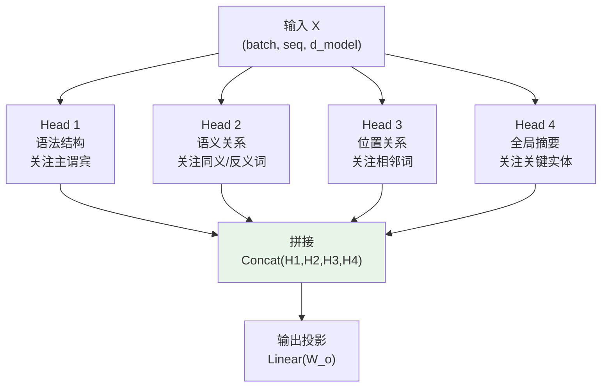
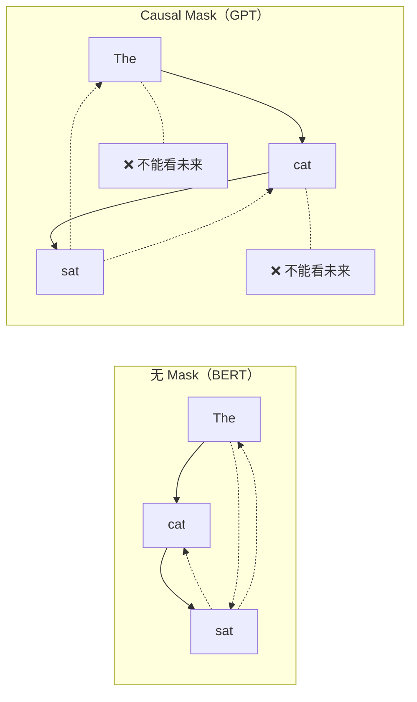
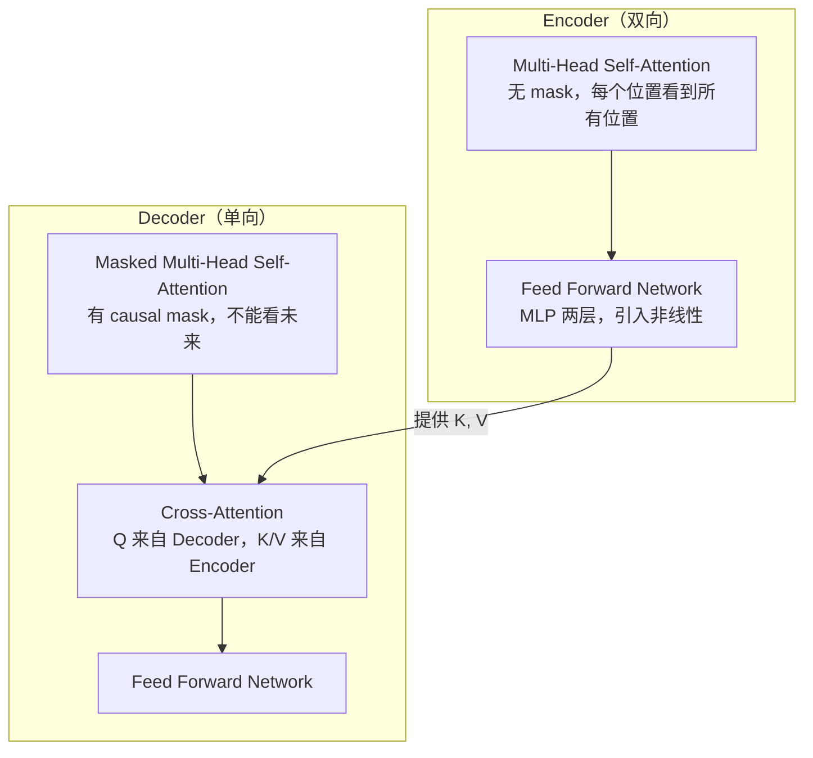

## 前置知识：从单头到多头的直觉

T1 你学了单头 Self-Attention——Q/K/V 各一个线性变换，一次计算得到一个注意力权重矩阵。但一个注意力头只能学**一种**关注模式。

想象读文章"我爱机器学习，因为机器学习改变世界"：
- 你可能同时关注**语法结构**（"我爱"后面的宾语）和**语义关系**（"机器学习"作为主题）
- 单头注意力只能关注一种，无法两全

**Multi-Head = 并行跑多个单头注意力，每个头关注不同子空间**。



> [!important] 核心公式
> $$\text{MultiHead}(Q,K,V) = \text{Concat}(\text{head}_1, ..., \text{head}_h) \cdot W^O$$
> 其中 $\text{head}_i = \text{Attention}(QW_i^Q, KW_i^K, VW_i^V)$
>
> 关键约束：**h × d_k = d_model**（头数 × 每头维度 = 模型维度）

---

## 一、Multi-Head 的本质：子空间分解

### 1.1 类比理解：多角度看一幅画

```python
# ============================================
# 类比：一幅画的多个角度
# ============================================
# 单头注意力 = 一个摄影师从正面拍照
# 多头注意力 = 多个摄影师从不同角度拍照，最后合并

# 数学上：把高维空间分解为多个低维子空间
# d_model = 64, num_heads = 8
# 每头：d_k = 64 / 8 = 8
# → 8 个头各关注 8 维的子空间

# 为什么不直接用一个大头？
# 1. 单头 = 只能学一种注意力模式
# 2. 多头 = 并行学多种模式（语法/语义/位置/...）
# 3. 参数量几乎相同（都是 d_model²）
```

### 1.2 头数选择的直觉

| num_heads | d_model | d_k | 特点 |
|-----------|---------|-----|------|
| 1 | 512 | 512 | 单头，只能学一种模式 |
| 8 | 512 | 64 | 原始 Transformer 论文，平衡 |
| 12 | 768 | 64 | BERT-base 12 层各 12 头 |
| 16 | 1024 | 64 | BERT-large |
| 32 | 1024 | 32 | 头太多，每头维度太小 |

> [!tip] 经验法则
> - **d_k 不应低于 32**：太小导致注意力分布不稳定
> - **头数 × d_k = d_model**：这是硬约束
> - **常见配置**：h=8, d_k=64（原始论文）；h=12, d_k=64（BERT）

---

## 二、从零实现 Multi-Head Attention

### 2.1 完整实现

```python
import tensorflow as tf
import numpy as np

class MultiHeadSelfAttention(tf.keras.layers.Layer):
    """
    从零实现 Multi-Head Self-Attention
    对比 tf.keras.layers.MultiHeadAttention
    """
    def __init__(self, d_model, num_heads, **kwargs):
        super().__init__(**kwargs)
        self.d_model = d_model
        self.num_heads = num_heads

        # 约束检查
        assert d_model % num_heads == 0, "d_model 必须被 num_heads 整除"
        self.d_k = d_model // num_heads

        # Q/K/V/O 四个线性变换
        self.wq = tf.keras.layers.Dense(d_model, name="query")
        self.wk = tf.keras.layers.Dense(d_model, name="key")
        self.wv = tf.keras.layers.Dense(d_model, name="value")
        self.wo = tf.keras.layers.Dense(d_model, name="output")

    def split_heads(self, x, batch_size):
        """
        把最后一维拆成 (num_heads, d_k)，再转置为 (batch, heads, seq, d_k)
        目的：让每个头独立计算注意力
        """
        x = tf.reshape(x, (batch_size, -1, self.num_heads, self.d_k))
        return tf.transpose(x, perm=[0, 2, 1, 3])  # (batch, heads, seq, d_k)

    def call(self, x, mask=None):
        batch_size = tf.shape(x)[0]

        # Step 1: Q/K/V 线性变换
        Q = self.wq(x)  # (batch, seq, d_model)
        K = self.wk(x)
        V = self.wv(x)

        # Step 2: 拆成多头
        Q = self.split_heads(Q, batch_size)  # (batch, heads, seq, d_k)
        K = self.split_heads(K, batch_size)
        V = self.split_heads(V, batch_size)

        # Step 3: 缩放点积注意力（每个头独立）
        scores = tf.matmul(Q, K, transpose_b=True)  # (batch, heads, seq, seq)
        scaled_scores = scores / tf.sqrt(tf.cast(self.d_k, tf.float32))

        if mask is not None:
            # mask: (batch, 1, 1, seq) → 广播到 (batch, heads, seq, seq)
            scaled_scores += (mask * -1e9)

        weights = tf.nn.softmax(scaled_scores, axis=-1)
        attended = tf.matmul(weights, V)  # (batch, heads, seq, d_k)

        # Step 4: 合并多头
        attended = tf.transpose(attended, perm=[0, 2, 1, 3])  # (batch, seq, heads, d_k)
        attended = tf.reshape(attended, (batch_size, -1, self.d_model))  # (batch, seq, d_model)

        # Step 5: 输出投影
        output = self.wo(attended)  # (batch, seq, d_model)

        return output, weights

# ============================================
# 测试
# ============================================
batch_size, seq_len, d_model, num_heads = 2, 10, 64, 8
x = tf.random.normal((batch_size, seq_len, d_model))

mha = MultiHeadSelfAttention(d_model, num_heads)
output, weights = mha(x)

print(f"Output:  {output.shape}")   # (2, 10, 64)
print(f"Weights: {weights.shape}") # (2, 8, 10, 10)
# 8 个头，每个头一个 10×10 的注意力矩阵
```

> [!tip] split_heads 的作用
> `reshape + transpose` 把 `(batch, seq, d_model)` 变成 `(batch, heads, seq, d_k)`：
> - 让每个头**独立**计算注意力
> - 不同头可以学到不同的 Q/K/V 变换
> - 类似 CNN 中多个卷积核捕捉不同特征

### 2.2 对比 Keras 内置实现

```python
# 自定义
custom_mha = MultiHeadSelfAttention(d_model=64, num_heads=8)
out1, w1 = custom_mha(x)

# Keras 内置
keras_mha = tf.keras.layers.MultiHeadAttention(
    num_heads=8, key_dim=8,   # key_dim = 每头维度
    dropout=0.1               # 内置 dropout，防止过拟合
)
out2 = keras_mha(x, x, x)  # Self-Attention

print(f"自定义: {out1.shape}")  # (2, 10, 64)
print(f"Keras:  {out2.shape}")  # (2, 10, 64)

# 参数量对比
print(f"自定义参数量: {custom_mha.count_params()}")  # 4 × 64² = 16384
print(f"Keras 参数量: {keras_mha.count_params()}")    # 类似
```

| 特性 | 手写实现 | Keras 内置 |
|------|---------|-----------|
| 学习目的 | ✅ 理解原理 | 生产用 |
| Dropout | ❌ 需手加 | ✅ 内置 |
| 掩码支持 | 需手写 | ✅ `attention_mask` 参数 |
| 性能 | 一般 | ✅ XLA 优化 |
| 调试 | ✅ 可看中间值 | 黑盒 |

> [!warning] mask 语义相反，极易踩坑
> 内置 `tf.keras.layers.MultiHeadAttention` 的 `attention_mask` 是 **1=可见、0=遮蔽**（源码：`(1.0 - mask) * -1e9`）；而本系列自定义 MHA 的约定是 **1=遮蔽、0=可见**（`scaled_scores += mask * -1e9`）。两者**正好相反**——把本篇构造的 mask 直接传给内置层会静默反向（只注意"不该看"的位置），混用时必须先取反（`1 - mask`）或改构造 keep-mask。

> [!important] 为什么参数量一样？
> 多头不是把 d_model 复制 h 倍，而是把 Q/K/V 的维度从 d_model 切分成 d_model/h。
> - 单头：W_Q, W_K, W_V 各 d_model×d_model
> - 多头：每个头 W_Q_i 是 d_model×(d_model/h)，h 个头加起来 = d_model×d_model
>
> **总参数量不变，只是分配方式不同。**

---

## 三、头专业化：不同头学到不同模式

研究表明，Multi-Head 中的不同头会**自发学习不同的语言关系**：

| 头类型 | 学到的模式 | 发现方式 |
|--------|----------|---------|
| 句法头 | 关注主谓、动宾关系 | 注意力矩阵对角线模式 |
| 指代头 | 关注代词与先行词 | 代词和先行词之间高权重 |
| 位置头 | 关注相邻位置 | 对角线附近高权重 |
| 罕见词头 | 关注特殊 token | 特定 token 列高权重 |

```python
import matplotlib.pyplot as plt
import numpy as np

def visualize_attention_heads(weights, tokens, num_heads=8):
    """
    可视化多头注意力权重
    weights: (batch, heads, seq, seq)
    """
    fig, axes = plt.subplots(2, 4, figsize=(20, 10))
    for i, ax in enumerate(axes.flat):
        if i < num_heads:
            im = ax.imshow(weights[0, i].numpy(), cmap='Blues')
            ax.set_title(f"Head {i}")
            ax.set_xticks(range(len(tokens)))
            ax.set_yticks(range(len(tokens)))
            ax.set_xticklabels(tokens, rotation=45, ha='right')
            ax.set_yticklabels(tokens)
            plt.colorbar(im, ax=ax)
    plt.tight_layout()
    plt.savefig("multi_head_patterns.png", dpi=150)
    plt.show()

# 示例
tokens = ["The", "cat", "sat", "on", "the", "mat", "because", "it"]
# 实际使用时传入训练后的 weights
```

> [!tip] BERTology 发现
> 实际 BERT 的 12 个头会自发学到不同关注模式：
> - **头 1**：关注句首词 [CLS] → 句子级表示
> - **头 2**：关注相邻词 → 局部语法
> - **头 3**：关注相同词 → 共指消解（"它"指代谁）
> - **头 4**：关注介词后的名词 → 短语结构
>
> 这种**自发分工**是多头机制最迷人的地方。

---

## 四、因果遮罩（Causal Mask）

### 4.1 为什么需要因果遮罩

在 GPT 等自回归生成模型中，生成第 t 个 token 时**不能看到第 t+1 及以后的 token**（否则就是作弊）。因果遮罩把上三角部分设为 -∞，softmax 后权重为 0。



### 4.2 实现

```python
import tensorflow as tf

def create_causal_mask(seq_len):
    """
    创建因果遮罩矩阵
    返回: (1, 1, seq_len, seq_len) mask
    1 = 遮蔽（不能看），0 = 可见
    """
    # band_part(input, num_lower, num_upper)
    # num_lower=-1 保留全部下三角
    # num_upper=0 只保留对角线
    lower_triangular = tf.linalg.band_part(
        tf.ones((seq_len, seq_len)), -1, 0
    )  # 下三角为 1，上三角为 0

    # 反转：上三角为 1（遮蔽），下三角为 0（可见）
    mask = 1 - lower_triangular

    # 扩展维度，适配多头注意力 (1, 1, seq, seq)
    return tf.reshape(mask, (1, 1, seq_len, seq_len))

# 测试
mask = create_causal_mask(5)
print(f"Mask shape: {mask.shape}")  # (1, 1, 5, 5)
print(mask[0, 0].numpy())
# [[0, 1, 1, 1, 1],    ← 位置 0：只能看自己
#  [0, 0, 1, 1, 1],    ← 位置 1：看自己和前一个
#  [0, 0, 0, 1, 1],    ← 位置 2：看自己和前两个
#  [0, 0, 0, 0, 1],    ← 位置 3：看自己和前三个
#  [0, 0, 0, 0, 0]]    ← 位置 4：看所有位置
```

### 4.3 Padding Mask（填充遮罩）

除了因果遮罩，还有一个常见的 mask：变长序列用 0 填充到等长后，注意力不应关注 padding 位置。

```python
def create_padding_mask(seq):
    """
    创建 padding mask
    seq: (batch, seq_len) 整数序列
    返回: (batch, 1, 1, seq_len) mask
    1 = 遮蔽（padding 位置），0 = 可见
    """
    mask = tf.cast(tf.math.equal(seq, 0), tf.float32)  # 0 → 1, 非0 → 0
    return mask[:, tf.newaxis, tf.newaxis, :]  # (batch, 1, 1, seq_len)

# 示例
seq = tf.constant([[1, 2, 3, 4, 0, 0]])  # 后两个是 padding
mask = create_padding_mask(seq)
print(mask.numpy())  # [[[[0, 0, 0, 0, 1, 1]]]]
```

> [!tip] 因果 + Padding 组合
> 实际使用中，GPT Decoder 会同时用两种 mask：
> - 因果遮罩：不看未来
> - Padding 遮罩：不看填充
> - 两者用 `tf.maximum` 合并（OR 语义）：任一为 1 就遮蔽

```python
def create_combined_mask(seq):
    """组合 causal mask + padding mask"""
    seq_len = tf.shape(seq)[1]

    # Padding mask: (batch, 1, 1, seq_len)
    padding_mask = create_padding_mask(seq)

    # Causal mask: (1, 1, seq_len, seq_len)
    causal_mask = create_causal_mask(seq_len)

    # 合并：任一为 1 就遮蔽
    combined = tf.maximum(padding_mask, causal_mask)
    return combined

# 测试
seq = tf.constant([[1, 2, 3, 0, 0]])  # 后两个是 padding
mask = create_combined_mask(seq)
print(f"Combined mask shape: {mask.shape}")  # (1, 1, 5, 5)
# padding 行（第 3、4 行）全为 1
# 因果上三角为 1
```

### 4.4 带因果遮罩的多头注意力

```python
class CausalMultiHeadSelfAttention(MultiHeadSelfAttention):
    """因果多头自注意力（用于 Decoder）"""
    def call(self, x, mask=None):
        seq_len = tf.shape(x)[1]

        # 创建因果遮罩
        causal_mask = create_causal_mask(seq_len)  # (1, 1, seq, seq)

        # 合并外部 mask（如果有）
        if mask is not None:
            causal_mask = tf.maximum(causal_mask, mask)

        return super().call(x, mask=causal_mask)

# 测试
cmha = CausalMultiHeadSelfAttention(d_model=64, num_heads=8)
x = tf.random.normal((2, 10, 64))
output, weights = cmha(x)

print(f"Output: {output.shape}")    # (2, 10, 64)
print(f"Weights: {weights.shape}")  # (2, 8, 10, 10)

# 验证因果性：每个位置不能看到未来的 token
w = weights[0, 0].numpy()
print(f"位置 2 的上三角权重最大值: {np.max(np.triu(w[2:, 2:], k=1)):.6f}")  # ≈ 0
```

> [!important] Causal Mask 在 GPT 中的作用
> GPT 是 Decoder-only 架构（T6），每一层都用 Causal Mask：
> - 训练时：Teacher Forcing，一次输入整句话，但用 Mask 防止看到未来
> - 推理时：逐 token 生成，天然没有未来 token，Mask 仍保留以防万一
>
> **BERT 不用 Causal Mask**：BERT 是双向的，每个位置能看到所有其他位置。

---

## 五、Encoder vs Decoder 中的 MHA



| 组件 | Q 来源 | K/V 来源 | Mask | 用途 |
|------|--------|----------|------|------|
| Encoder Self-Attn | 当前层输入 | 当前层输入 | 无 | 双向编码 |
| Decoder Self-Attn | 当前层输入 | 当前层输入 | Causal | 单向解码 |
| Cross-Attn | Decoder 当前层 | Encoder 输出 | 无 | 查询编码信息 |

---

## 六、Grouped-Query Attention（GQA）

GPT-4 和 LLaMA 2 使用的优化：多个 Q 头共享一组 K/V 头，节省显存。

```python
class GroupedQueryAttention(tf.keras.layers.Layer):
    """
    Grouped-Query Attention (GQA)
    多个 Q 头共享一组 K/V 头，减少 K/V 计算和显存

    参数:
        d_model: 模型维度
        num_q_heads: Q 头数（通常 8/16/32）
        num_kv_heads: K/V 头数（通常 4/8，比 Q 少）
    """
    def __init__(self, d_model, num_q_heads, num_kv_heads, **kwargs):
        super().__init__(**kwargs)
        assert d_model % num_q_heads == 0
        assert num_q_heads % num_kv_heads == 0

        self.num_q_heads = num_q_heads
        self.num_kv_heads = num_kv_heads
        self.num_groups = num_q_heads // num_kv_heads  # 每组几个 Q 头
        self.d_k = d_model // num_q_heads

        self.wq = tf.keras.layers.Dense(d_model)
        # K/V 维度比 Q 小：只有 num_kv_heads 个头
        self.wk = tf.keras.layers.Dense(num_kv_heads * self.d_k)
        self.wv = tf.keras.layers.Dense(num_kv_heads * self.d_k)
        self.wo = tf.keras.layers.Dense(d_model)

    def call(self, x, mask=None):
        batch_size = tf.shape(x)[0]
        seq_len = tf.shape(x)[1]

        # Q: 全量头
        Q = self.wq(x)
        Q = tf.reshape(Q, (batch_size, seq_len, self.num_q_heads, self.d_k))
        Q = tf.transpose(Q, perm=[0, 2, 1, 3])  # (B, q_heads, S, d_k)

        # K/V: 少量头
        K = self.wk(x)
        K = tf.reshape(K, (batch_size, seq_len, self.num_kv_heads, self.d_k))
        K = tf.transpose(K, perm=[0, 2, 1, 3])  # (B, kv_heads, S, d_k)

        V = self.wv(x)
        V = tf.reshape(V, (batch_size, seq_len, self.num_kv_heads, self.d_k))
        V = tf.transpose(V, perm=[0, 2, 1, 3])

        # 扩展 K/V：每个 K/V 头重复 num_groups 次
        K = tf.repeat(K, self.num_groups, axis=1)  # (B, q_heads, S, d_k)
        V = tf.repeat(V, self.num_groups, axis=1)

        # 标准缩放点积注意力
        scores = tf.matmul(Q, K, transpose_b=True) / tf.sqrt(tf.cast(self.d_k, tf.float32))
        if mask is not None:
            scores += (mask * -1e9)
        weights = tf.nn.softmax(scores, axis=-1)
        attended = tf.matmul(weights, V)

        # 合并
        attended = tf.transpose(attended, perm=[0, 2, 1, 3])
        attended = tf.reshape(attended, (batch_size, seq_len, -1))
        return self.wo(attended)

# 测试
gqa = GroupedQueryAttention(d_model=64, num_q_heads=8, num_kv_heads=2)
x = tf.random.normal((2, 10, 64))
out = gqa(x)
print(f"GQA output: {out.shape}")  # (2, 10, 64)
```

> [!tip] GQA 的动机
> - **MHA**：每个 Q 头有独立的 K/V 头 → K/V 缓存大
> - **GQA**：多个 Q 头共享 K/V → K/V 缓存减小 num_groups 倍
> - **推理加速**：自回归生成时，K/V 缓存占显存大头，GQA 大幅降低显存
> - LLaMA 2 70B 使用 GQA（8 组 Q 共享 1 组 K/V）

| 方案 | Q 头数 | K/V 头数 | 显存 | 速度 | 使用者 |
|------|--------|----------|------|------|--------|
| MHA | h | h | 大 | 基准 | 原始 Transformer |
| GQA | h | h/n | 小 | 快 | LLaMA 2 / GPT-4 |
| MQA | h | 1 | 最小 | 最快 | 极致优化 |

---

## 七、常见误区

| # | 误区 | 正确理解 |
|---|------|---------|
| 1 | 头数越多效果越好 | 头太多 → 每头 d_k 太小 → 注意力分布不稳定 |
| 2 | Multi-Head 参数比 Single-Head 多 | 参数量几乎相同（都是 O(d_model²)） |
| 3 | 每个头关注不同位置 | 不一定——有些头学到的模式很相似，可以剪枝 |
| 4 | Causal Mask 让训练变慢 | 不慢，只是遮罩了部分注意力，计算量相同 |
| 5 | Decoder 不需要 Cross-Attention | Decoder 需要两层 MHA：Self-Attn（因果）+ Cross-Attn |
| 6 | 所有头同等重要 | 研究表明部分头可剪枝而不影响效果 |

---

## 八、练习

### 🟢 练习 1：验证参数量（10 分钟）

**题目**：计算 d_model=512, num_heads=8 时 Multi-Head Attention 的参数量。

<details>
<summary>📝 参考答案</summary>

```
Q 投影：512 × 512 + 512 = 262656
K 投影：512 × 512 + 512 = 262656
V 投影：512 × 512 + 512 = 262656
O 投影：512 × 512 + 512 = 262656

总计：4 × 262656 = 1,050,624 参数

对比 Single-Head（d_model=512, num_heads=1）：
同样是 4 个线性变换，参数量相同！

结论：Multi-Head 不增加参数量，但能获得多种注意力模式。
```

</details>

**验收标准**：理解 Multi-Head 不增加参数量的原因。

---

### 🟡 练习 2：实现因果 + Padding 组合 mask（25 分钟）

**题目**：实现一个函数，同时生成因果遮罩和 padding 遮罩，用于 GPT Decoder。

<details>
<summary>📝 参考答案</summary>

```python
import tensorflow as tf

def create_masks(seq, causal=True):
    """
    生成注意力 mask
    seq: (batch, seq_len) 整数序列
    返回: (batch, 1, seq_len, seq_len) mask
    """
    # Padding mask: (batch, 1, 1, seq_len)
    padding_mask = tf.cast(tf.math.equal(seq, 0), tf.float32)
    padding_mask = padding_mask[:, tf.newaxis, tf.newaxis, :]

    if causal:
        # Causal mask: (1, 1, seq_len, seq_len)
        seq_len = tf.shape(seq)[1]
        causal_mask = 1 - tf.linalg.band_part(
            tf.ones((seq_len, seq_len)), -1, 0
        )
        causal_mask = causal_mask[tf.newaxis, tf.newaxis, :, :]

        # 合并：任一为 1 就遮蔽（OR）
        mask = tf.maximum(padding_mask, causal_mask)
    else:
        mask = padding_mask

    return mask

# 测试
seq = tf.constant([[1, 2, 3, 0, 0]])  # 后两个是 padding
mask = create_masks(seq, causal=True)
print(f"Mask shape: {mask.shape}")  # (1, 1, 5, 5)
print(mask[0, 0].numpy())
# [[0, 1, 1, 1, 1],    ← token 1: 只看自己
#  [0, 0, 1, 1, 1],    ← token 2: 看自己和前一个
#  [0, 0, 0, 1, 1],    ← token 3: 看自己和前两个
#  [1, 1, 1, 1, 1],    ← padding: 全遮蔽
#  [1, 1, 1, 1, 1]]    ← padding: 全遮蔽
```

</details>

**验收标准**：padding 行全为 1，因果上三角为 1。

---

### 🔴 练习 3：实现 Decoder Block 并验证因果性（40 分钟）

**题目**：实现一个完整的 Transformer Decoder 层（Masked Self-Attn + Cross-Attn + FFN + 残差 + LayerNorm），用因果遮罩验证位置 3 无法看到位置 4 的信息。

<details>
<summary>📝 参考答案</summary>

```python
import tensorflow as tf

class TransformerDecoderBlock(tf.keras.layers.Layer):
    def __init__(self, d_model, num_heads, dff, **kwargs):
        super().__init__(**kwargs)
        # Masked Self-Attention
        self.mha1 = CausalMultiHeadSelfAttention(d_model, num_heads)
        # Cross-Attention
        self.mha2 = tf.keras.layers.MultiHeadAttention(
            num_heads=num_heads, key_dim=d_model // num_heads)
        # Feed Forward Network
        self.ffn = tf.keras.Sequential([
            tf.keras.layers.Dense(dff, activation='relu'),
            tf.keras.layers.Dense(d_model)
        ])
        # LayerNorm
        self.ln1 = tf.keras.layers.LayerNormalization()
        self.ln2 = tf.keras.layers.LayerNormalization()
        self.ln3 = tf.keras.layers.LayerNormalization()

    def call(self, x, enc_output):
        # 1. Masked Self-Attention + 残差 + LayerNorm
        attn1, _ = self.mha1(x)
        x = self.ln1(x + attn1)

        # 2. Cross-Attention + 残差 + LayerNorm
        attn2 = self.mha2(x, enc_output, enc_output)
        x = self.ln2(x + attn2)

        # 3. FFN + 残差 + LayerNorm
        ffn_output = self.ffn(x)
        x = self.ln3(x + ffn_output)

        return x

# 测试因果性
d_model, num_heads, dff = 64, 8, 256
decoder = TransformerDecoderBlock(d_model, num_heads, dff)

# Encoder 输出（5 个 token）
enc_output = tf.random.normal((1, 5, d_model))
# Decoder 输入（4 个 token）
dec_input = tf.random.normal((1, 4, d_model))

out = decoder(dec_input, enc_output)
print(f"Decoder 输出: {out.shape}")  # (1, 4, 64)

# 验证因果性：修改位置 3 的输入，位置 0-2 的输出不应变化
dec_input2 = dec_input.numpy().copy()
dec_input2[0, 3, :] += 100  # 大幅修改位置 3

out2 = decoder(tf.constant(dec_input2), enc_output)
diff = tf.abs(out - out2).numpy()

print(f"位置 0 差异: {diff[0, 0].max():.6f}")  # ≈ 0（不受影响）
print(f"位置 1 差异: {diff[0, 1].max():.6f}")  # ≈ 0（不受影响）
print(f"位置 2 差异: {diff[0, 2].max():.6f}")  # ≈ 0（不受影响）
print(f"位置 3 差异: {diff[0, 3].max():.6f}")  # > 0（受影响）
```

</details>

**验收标准**：
- 位置 0-2 的输出差异 ≈ 0（不受位置 3 影响）
- 位置 3 的输出差异 > 0（受自身修改影响）

---

## 九、本章小结

| 概念 | 关键点 |
|------|--------|
| Multi-Head 动机 | 多个头关注不同子空间，捕捉多种关系 |
| 参数量 | h × d_k = d_model，总参数量 ≈ 4 × d_model² |
| split_heads | reshape + transpose，让每个头独立计算 |
| 头专业化 | 不同头自发学习语法/语义/共指等不同模式 |
| 因果遮罩 | 上三角 mask，防止 Decoder 看到未来 token |
| Padding Mask | 遮蔽填充位置 |
| 组合 Mask | 因果 + Padding 用 `tf.maximum` 合并 |
| Encoder MHA | 双向，无 mask |
| Decoder MHA | 单向，有 causal mask |
| Cross-Attention | Q 来自 Decoder，K/V 来自 Encoder |
| GQA | 多 Q 头共享 K/V 头，省显存（LLaMA 2 用） |

**下一篇**：[[T3-Positional Encoding]] — Attention 没有 Positional Encoding 就退化为词袋模型。

---

*前置：[[T1-Self-Attention 深度原理]]*
*后续：[[T3-Positional Encoding]]*