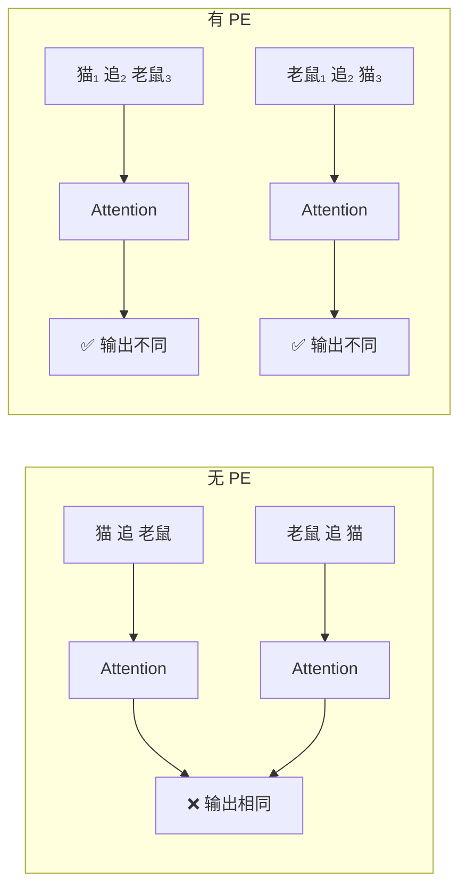
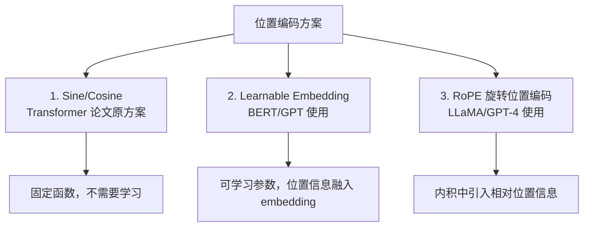
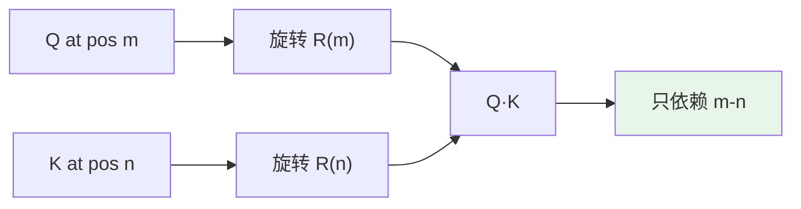
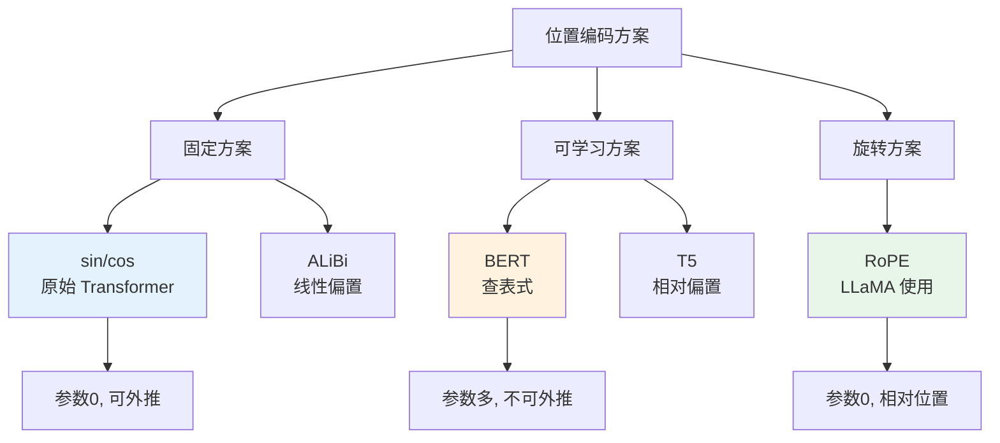

## 前置知识：Attention 的致命缺陷

T1 证明了 Self-Attention 是**置换不变的**（permutation equivariant）：打乱 token 顺序，每个位置的输出不变。这意味着：

> "猫 追 老鼠" 和 "老鼠 追 猫" 在 Attention 看来是完全相同的输入。

这显然不对。语言有顺序，时间序列有方向。**位置编码（Positional Encoding, PE）的作用就是把"位置"信息注入 Attention**。



> [!important] 位置编码的本质
> PE 不是"告诉模型第几个位置"，而是**给每个位置加一个独特的信号**，让模型能区分"同一个词在不同位置"。
>
> 类比：在 Sklearn 中你用 `ColumnTransformer` 给不同列赋予不同语义——PE 给不同位置赋予不同位置语义。

---

## 一、三种主流位置编码方案



---

## 二、正弦余弦位置编码（Transformer 原论文）

### 2.1 公式

对于位置 `pos`、维度 `i`：

$$PE_{(pos, 2i)} = \sin\left(\frac{pos}{10000^{\frac{2i}{d_{model}}}}\right)$$

$$PE_{(pos, 2i+1)} = \cos\left(\frac{pos}{10000^{\frac{2i}{d_{model}}}}\right)$$

### 2.2 实现

```python
import tensorflow as tf
import numpy as np
import matplotlib.pyplot as plt

def get_positional_encoding(seq_len, embed_dim):
    """
    正弦余弦位置编码（原始 Transformer）

    参数:
        seq_len: 序列长度
        embed_dim: 嵌入维度
    返回:
        pe: (1, seq_len, embed_dim)
    """
    position = np.arange(seq_len)[:, np.newaxis]      # (seq_len, 1)
    div_term = np.exp(
        np.arange(0, embed_dim, 2) * (-np.log(10000.0) / embed_dim)
    )  # (embed_dim // 2,)

    pe = np.zeros((seq_len, embed_dim))
    pe[:, 0::2] = np.sin(position * div_term)  # 偶数维：sin
    pe[:, 1::2] = np.cos(position * div_term)  # 奇数维：cos

    return tf.cast(pe[np.newaxis, ...], dtype=tf.float32)  # (1, seq_len, embed_dim)

# 测试
seq_len, embed_dim = 50, 64
pe = get_positional_encoding(seq_len, embed_dim)
print(f"PE shape: {pe.shape}")  # (1, 50, 64)
```

### 2.3 可视化

```python
# 热力图
fig, ax = plt.subplots(figsize=(12, 6))
im = ax.imshow(pe[0].numpy().T, cmap='RdBu', aspect='auto')
ax.set_xlabel("Position")
ax.set_ylabel("Embedding Dimension")
ax.set_title("Sinusoidal Positional Encoding Heatmap")
plt.colorbar(im)
plt.tight_layout()
plt.savefig("pe_heatmap.png", dpi=150)
plt.show()

# 前 8 个维度
fig, axes = plt.subplots(2, 4, figsize=(16, 6))
for i, ax in enumerate(axes.flat):
    ax.plot(pe[0, :, i].numpy(), label=f"dim {i}")
    ax.set_title(f"Dimension {i}")
    ax.set_xlabel("Position")
    ax.set_ylabel("Value")
plt.tight_layout()
plt.savefig("pe_dimensions.png", dpi=150)
plt.show()
```

### 2.4 为什么用 sin/cos？

> [!tip] sin/cos 的三个优点
> 1. **有界性**：值在 [-1, 1] 之间，不会和 embedding 竞争
> 2. **周期性**：不同维度有不同周期，模型能学习相对位置
> 3. **可外推**：对未见过的更长序列也能生成合理的 PE

**相对位置特性**：对于固定的偏移量 `k`，`PE(pos+k)` 可以表示为 `PE(pos)` 的线性变换：

$$\begin{pmatrix} \sin(\omega(pos+k)) \\ \cos(\omega(pos+k)) \end{pmatrix} = \begin{pmatrix} \cos(\omega k) & \sin(\omega k) \\ -\sin(\omega k) & \cos(\omega k) \end{pmatrix} \begin{pmatrix} \sin(\omega pos) \\ \cos(\omega pos) \end{pmatrix}$$

这意味着模型可以通过学习一个线性变换来关注**相对位置**，而非绝对位置。

### 2.5 注入方式

```python
class PositionalEncoding(tf.keras.layers.Layer):
    """
    位置编码层：在 embedding 上加位置信息
    """
    def __init__(self, seq_len, embed_dim, **kwargs):
        super().__init__(**kwargs)
        self.seq_len = seq_len
        self.embed_dim = embed_dim

    def build(self, input_shape):
        # 生成固定的位置编码（不可学习）
        pe = get_positional_encoding(self.seq_len, self.embed_dim)
        self.pe = self.add_weight(
            name="positional_encoding",
            shape=(self.seq_len, self.embed_dim),
            initializer=tf.keras.initializers.Constant(pe[0]),
            trainable=False  # 固定位置编码
        )
        super().build(input_shape)

    def call(self, x):
        # x: (batch, seq_len, embed_dim)
        seq_len = tf.shape(x)[1]
        return x + self.pe[:seq_len, :]

# 使用
embed_dim, seq_len = 64, 50
embedding_layer = tf.keras.layers.Embedding(1000, embed_dim)
pe_layer = PositionalEncoding(seq_len, embed_dim)

token_ids = tf.constant([[1, 2, 3, 4, 5]])  # batch=1, seq=5
x = embedding_layer(token_ids)  # (1, 5, 64)
x_with_pe = pe_layer(x)         # (1, 5, 64) + 位置信息

print(f"Without PE: {x[0, 0, :4].numpy()}")
print(f"With PE:    {x_with_pe[0, 0, :4].numpy()}")
```

> [!warning] 加法 vs 拼接
> 原始论文用**加法**（`x + PE`），不是拼接。因为：
> - 加法不改变维度
> - Attention 的 Q/K/V 线性变换会自动"提取"位置与语义的混合信号

---

## 三、可学习位置编码（BERT/GPT 使用）

### 3.1 实现

```python
class LearnablePositionalEncoding(tf.keras.layers.Layer):
    """
    可学习位置编码（BERT/GPT 使用）
    与 sin/cos 不同，位置编码是可训练参数
    """
    def __init__(self, max_seq_len, embed_dim, **kwargs):
        super().__init__(**kwargs)
        self.max_seq_len = max_seq_len
        self.embed_dim = embed_dim

    def build(self, input_shape):
        # 可学习的位置嵌入矩阵
        self.pe = self.add_weight(
            name="learnable_pe",
            shape=(self.max_seq_len, self.embed_dim),
            initializer="glorot_uniform",
            trainable=True  # 可学习！
        )
        super().build(input_shape)

    def call(self, x):
        seq_len = tf.shape(x)[1]
        return x + self.pe[:seq_len, :]

# 使用
learnable_pe = LearnablePositionalEncoding(max_seq_len=512, embed_dim=64)
x_with_pe = learnable_pe(x)

print(f"Learnable PE params: {learnable_pe.count_params()}")  # 512 × 64 = 32768
```

### 3.2 sin/cos vs 可学习

| 特性 | sin/cos | 可学习 |
|------|---------|-------|
| 参数 | 0 | max_seq_len × embed_dim |
| 外推性 | ✅ 可处理更长序列 | ❌ 受 max_seq_len 限制 |
| 效果 | 相当 | 略好（大数据时） |
| 使用者 | 原始 Transformer | BERT/GPT |
| 适合场景 | 需要外推 | 固定长度任务 |

> [!tip] BERT 为什么用可学习？
> BERT 的最大序列长度固定为 512，不需要外推。可学习 PE 有更多自由度，在大数据上效果略好。

---

## 四、旋转位置编码（RoPE）

### 4.1 为什么需要 RoPE

RoPE（Rotary Position Embedding, 2021）是 LLaMA/GPT-NeoX 使用的新一代位置编码，优点是**直接编码相对位置**，且支持长序列外推。

### 4.2 核心思想

RoPE 不在 embedding 上加位置，而是**在 Q/K 上做旋转变换**：

$$q'_m = R_m q_m, \quad k'_n = R_n k_n$$

其中 $R_m$ 是位置 $m$ 的旋转矩阵。注意力分数 $q_m \cdot k_n$ 只依赖**相对位置** $m - n$。



### 4.3 TensorFlow 实现

```python
import tensorflow as tf

def get_rotary_embedding(seq_len, dim, base=10000.0):
    """
    生成 RoPE 的旋转角度 theta

    参数:
        seq_len: 序列长度
        dim: 每头的维度
        base: 旋转基准
    返回:
        theta: (seq_len, dim // 2)
    """
    # 位置
    pos = tf.range(seq_len, dtype=tf.float32)[:, tf.newaxis]  # (seq_len, 1)

    # 频率
    freq = 1.0 / (base ** (tf.range(0, dim, 2, dtype=tf.float32) / dim))

    # theta = pos * freq
    theta = pos * freq  # (seq_len, dim // 2)
    return theta

def apply_rope(x, theta):
    """
    对 x 应用 RoPE

    参数:
        x: (batch, seq_len, num_heads, dim)
        theta: (seq_len, dim // 2)
    返回:
        rotated: (batch, seq_len, num_heads, dim)
    """
    # 将 dim 切分为两两一组
    x1, x2 = x[..., ::2], x[..., 1::2]  # (..., dim/2)

    # 计算 cos 和 sin
    cos_theta = tf.cos(theta)  # (seq_len, dim/2)
    sin_theta = tf.sin(theta)

    # 广播到 x 的维度
    cos_theta = cos_theta[tf.newaxis, :, tf.newaxis, :]  # (1, seq_len, 1, dim/2)
    sin_theta = sin_theta[tf.newaxis, :, tf.newaxis, :]

    # 旋转
    x1_rot = x1 * cos_theta - x2 * sin_theta
    x2_rot = x1 * sin_theta + x2 * cos_theta

    # 合并
    rotated = tf.stack([x1_rot, x2_rot], axis=-1)  # (..., dim/2, 2)
    rotated = tf.reshape(rotated, tf.shape(x))

    return rotated

# 测试
batch, seq_len, num_heads, dim = 2, 8, 4, 32
x = tf.random.normal((batch, seq_len, num_heads, dim))
theta = get_rotary_embedding(seq_len, dim)
x_rope = apply_rope(x, theta)
print(f"RoPE output shape: {x_rope.shape}")  # (2, 8, 4, 32)
```

> [!tip] RoPE 的优势
> 1. **相对位置**：注意力只依赖 $m - n$，不需要显式 PE
> 2. **外推性好**：长序列上效果比 sin/cos 好
> 3. **不增加参数**：旋转矩阵是固定的
> 4. **与 FlashAttention 兼容**

---

## 五、位置编码对比总览

| 方案 | 公式形式 | 参数量 | 外推性 | 使用者 |
|------|---------|:------:|:------:|--------|
| sin/cos | 固定三角函数 | 0 | ✅ | 原始 Transformer |
| 可学习 | 查表 | seq×dim | ❌ | BERT/GPT-2 |
| 相对位置 | 学习偏置 | 少量 | ✅ | T5 |
| RoPE | 旋转矩阵 | 0 | ✅ | LLaMA/GPT-NeoX |
| ALiBi | 线性偏置 | 0 | ✅ | BLOOM |



### 选择决策

| 场景 | 推荐方案 |
|------|---------|
| 理解 Transformer 原论文 | Sine/Cosine |
| 微调 BERT/GPT-2 | 用内置的 Learnable PE |
| 训练大语言模型 | RoPE |
| 处理超长序列 | RoPE + 长度外推技术 |

---

## 六、常见误区

| # | 误区 | 正确理解 |
|---|------|---------|
| 1 | PE 就是给每个位置一个编号 | 不是编号——是高维连续向量 |
| 2 | sin/cos 必须固定 | 可以可学习，也可以固定 |
| 3 | 没有 PE 也能训练 | 能训练，但模型退化为词袋 |
| 4 | RoPE 比 sin/cos 效果好很多 | 效果接近，RoPE 优势在长序列外推 |
| 5 | 位置编码和 Embedding 拼接 | 用加法不拼接，保持维度不变 |

---

## 七、练习

### 🟢 练习 1：验证无 PE = 词袋模型（15 分钟）

**题目**：用 T1 的 SelfAttention 层处理两段顺序不同的序列，验证输出相同（证明无位置信息）。

<details>
<summary>📝 参考答案</summary>

```python
import tensorflow as tf
import numpy as np

# T1 的 SelfAttention 层
class SelfAttention(tf.keras.layers.Layer):
    def __init__(self, embed_dim, **kwargs):
        super().__init__(**kwargs)
        self.wq = tf.keras.layers.Dense(embed_dim)
        self.wk = tf.keras.layers.Dense(embed_dim)
        self.wv = tf.keras.layers.Dense(embed_dim)
        self.wo = tf.keras.layers.Dense(embed_dim)

    def call(self, x):
        Q, K, V = self.wq(x), self.wk(x), self.wv(x)
        scores = tf.matmul(Q, K, transpose_b=True)
        d_k = tf.cast(tf.shape(K)[-1], tf.float32)
        weights = tf.nn.softmax(scores / tf.sqrt(d_k), axis=-1)
        return self.wo(tf.matmul(weights, V))

# 固定权重
tf.random.set_seed(42)
attn = SelfAttention(8)

# 原始序列
x = tf.random.normal((1, 4, 8))
out_original = attn(x)

# 反转序列
x_shuffled = tf.reverse(x, [1])
out_shuffled = attn(x_shuffled)

# 对比：输出应该对应位置反转（因为 Attention 位置无关）
print(f"原始输出[0,0]:  {out_original[0, 0].numpy().round(4)}")
print(f"反转输出[0,3]:  {out_shuffled[0, 3].numpy().round(4)}")
# 两者应该相等——证明 Attention 对位置无关
```

</details>

**验收标准**：反转序列后，对应位置的输出不变。

---

### 🟡 练习 2：实现可学习位置编码并对比（25 分钟）

**题目**：实现 sin/cos 和可学习两种位置编码，在 IMDB 情感分类任务上对比效果。

<details>
<summary>📝 参考答案</summary>

```python
import tensorflow as tf
import numpy as np

def build_model(pe_type, max_len=100, vocab_size=10000, d_model=128):
    """构建带不同位置编码的 Transformer 分类器"""
    inputs = tf.keras.layers.Input(shape=(max_len,))
    x = tf.keras.layers.Embedding(vocab_size, d_model)(inputs)

    if pe_type == 'learnable':
        # 可学习位置编码
        pos = tf.keras.layers.Embedding(max_len, d_model)(tf.range(max_len))
        x = x + pos
    elif pe_type == 'sine':
        # sin/cos 位置编码
        pe = get_positional_encoding(max_len, d_model)
        x = x + pe

    # Transformer Block
    attn = tf.keras.layers.MultiHeadAttention(num_heads=4, key_dim=32)(x, x)
    x = tf.keras.layers.LayerNormalization(epsilon=1e-6)(x + attn)
    x = tf.keras.layers.GlobalAveragePooling1D()(x)
    out = tf.keras.layers.Dense(1, activation='sigmoid')(x)
    return tf.keras.Model(inputs, out)

# 就地定义（此前只作为 build_model 的默认参数存在，模块级未定义会 NameError）
vocab_size, max_len = 10000, 200

# 加载 IMDB
(x_train, y_train), (x_test, y_test) = tf.keras.datasets.imdb.load_data(num_words=vocab_size)
x_train = tf.keras.preprocessing.sequence.pad_sequences(x_train, maxlen=max_len)
x_test = tf.keras.preprocessing.sequence.pad_sequences(x_test, maxlen=max_len)

# 对比
for pe_type in ['sine', 'learnable']:
    model = build_model(pe_type)
    model.compile(optimizer='adam', loss='binary_crossentropy', metrics=['accuracy'])
    history = model.fit(x_train, y_train, validation_split=0.1,
                        epochs=3, batch_size=128, verbose=0)
    loss, acc = model.evaluate(x_test, y_test, verbose=0)
    print(f"{pe_type:10s}: val_acc={max(history.history['val_accuracy']):.4f}, test_acc={acc:.4f}")
```

</details>

**验收标准**：两种位置编码都能跑通，验证准确率差异 < 3%。

---

### 🔴 练习 3：实现 RoPE 并验证相对位置特性（35 分钟）

**题目**：
1. 用上面的 `apply_rope` 实现 RoPE
2. 验证：对 Q 和 K 施加 RoPE 后，注意力分数只依赖相对位置
3. 对比：有 RoPE vs 无 RoPE 在打乱序列后的输出变化

<details>
<summary>📝 参考答案</summary>

```python
import tensorflow as tf
import numpy as np

# 验证 RoPE 的相对位置特性
seq_len, dim = 8, 16
theta = get_rotary_embedding(seq_len, dim)

# 随机 Q/K
Q = tf.random.normal((1, seq_len, 1, dim))
K = tf.random.normal((1, seq_len, 1, dim))

# 无 RoPE 的注意力分数
scores_no_rope = tf.matmul(Q, K, transpose_b=True)[0, 0].numpy()

# 有 RoPE 的注意力分数
Q_rope = apply_rope(Q, theta)
K_rope = apply_rope(K, theta)
scores_rope = tf.matmul(Q_rope, K_rope, transpose_b=True)[0, 0].numpy()

# 验证：scores_rope[m, n] 应该只依赖 m-n
# 检查 scores_rope[1, 3] vs scores_rope[2, 4]（相对距离都是 -2）
print(f"score(pos=1, pos=3) = {scores_rope[1, 3]:.4f}")
print(f"score(pos=2, pos=4) = {scores_rope[2, 4]:.4f}")
print(f"score(pos=3, pos=5) = {scores_rope[3, 5]:.4f}")
# 相对距离相同的对，分数应接近（不完全相等因为数值精度）

# 对比：打乱序列后输出变化
x = tf.random.normal((1, seq_len, dim))
x_shuffled = tf.reverse(x, [1])

# 无 RoPE：打乱后对应位置输出不变（位置无关）
# 有 RoPE：打乱后输出变化（位置相关）
print("\n无 RoPE 时，打乱序列输出变化（应≈0）:")
attn_no_rope = tf.nn.softmax(tf.matmul(x, x, transpose_b=True), axis=-1)
attn_shuffled = tf.nn.softmax(tf.matmul(x_shuffled, x_shuffled, transpose_b=True), axis=-1)
print(f"  差异: {tf.reduce_max(tf.abs(attn_no_rope - tf.reverse(attn_shuffled, [1]))).numpy():.6f}")

print("有 RoPE 时，打乱序列输出变化（应>0）:")
x_pe = tf.expand_dims(x, axis=2)  # (1, seq, 1, dim)
x_pe_shuffled = tf.expand_dims(x_shuffled, axis=2)
x_rope = apply_rope(x_pe, theta)
x_rope_shuffled = apply_rope(x_pe_shuffled, theta)
x_rope = tf.squeeze(x_rope, axis=2)
x_rope_shuffled = tf.squeeze(x_rope_shuffled, axis=2)
attn_rope = tf.nn.softmax(tf.matmul(x_rope, x_rope, transpose_b=True), axis=-1)
attn_rope_shuffled = tf.nn.softmax(tf.matmul(x_rope_shuffled, x_rope_shuffled, transpose_b=True), axis=-1)
print(f"  差异: {tf.reduce_max(tf.abs(attn_rope - tf.reverse(attn_rope_shuffled, [1]))).numpy():.6f}")
```

</details>

**验收标准**：
- 无 RoPE：打乱序列后输出差异 ≈ 0（位置无关）
- 有 RoPE：打乱序列后输出差异 > 0（位置相关）

---

## 八、本章小结

| 概念 | 关键点 |
|------|--------|
| PE 的必要性 | Attention 置换不变 → 无 PE 退化为词袋模型 |
| sin/cos | 固定函数，可外推，原始 Transformer 使用 |
| 可学习 | BERT/GPT 使用，效果略好但不可外推 |
| RoPE | 旋转 Q/K，编码相对位置，LLaMA 使用 |
| 注入方式 | 加法（x + PE），不是拼接 |
| 相对位置 | sin/cos 通过三角恒等式，RoPE 通过旋转 |

**下一篇**：[[T4-Encoder-Decoder 完整架构]] — 把 Attention + PE + FFN + 残差 + LayerNorm 组装成完整 Transformer。

---

*前置：[[T2-Multi-Head Attention]]*
*后续：[[T4-Encoder-Decoder 完整架构]]*