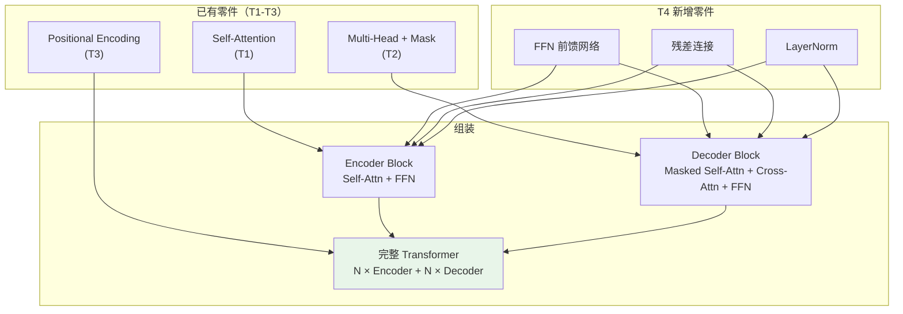
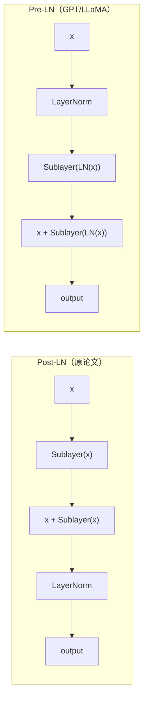
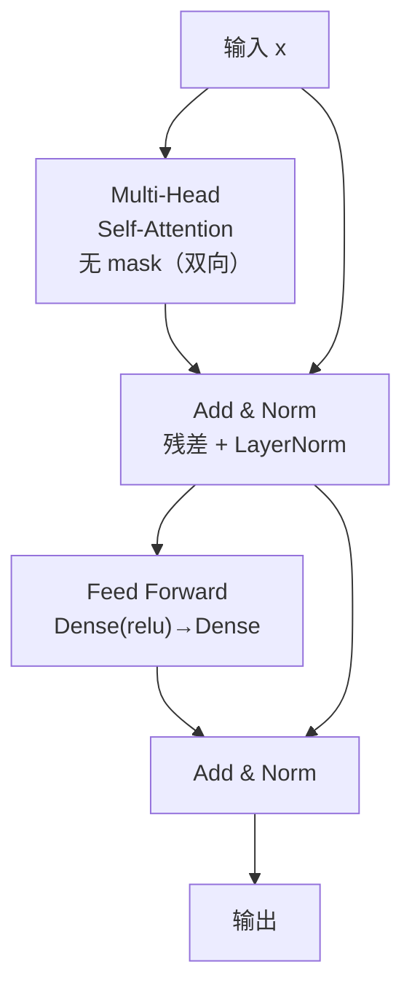
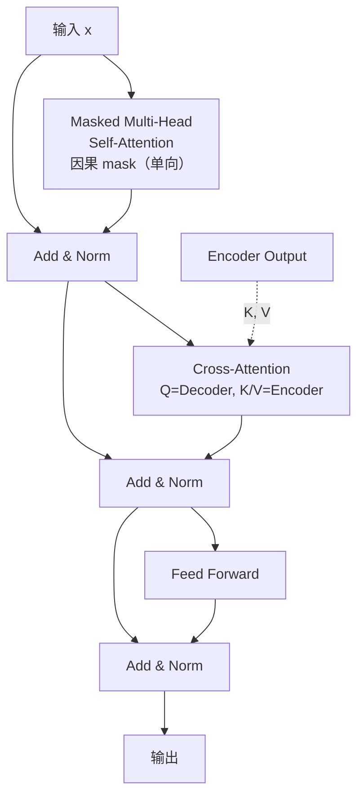
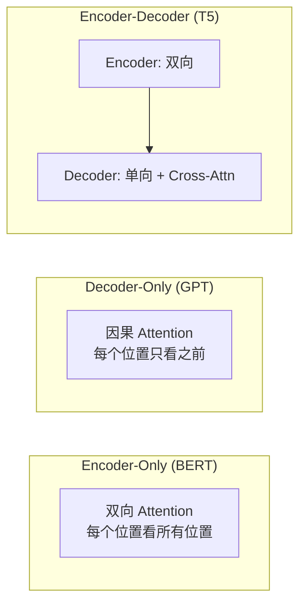

## 前置知识：从零件到整机

T1-T3 你已掌握 Transformer 的三个核心零件：
- **T1**: Self-Attention 的 Q/K/V 和缩放点积
- **T2**: Multi-Head + 因果遮罩 + Cross-Attention
- **T3**: Positional Encoding（sin/cos / learnable / RoPE）

本篇新增三个零件并组装成完整 Transformer：



> [!important] 为什么 Encoder-Decoder 重要？
> - **BERT** 只用 Encoder（双向理解）→ T5
> - **GPT** 只用 Decoder（单向生成）→ T6
> - **T5/机器翻译** 用完整 Encoder-Decoder
>
> 理解完整架构后，BERT/GPT 只是"取一半用"，学习成本大幅降低。

---

## 一、FFN：前馈网络

### 1.1 为什么 Attention 后面还要 FFN

Attention 的输出是**线性变换的加权平均**（softmax 是唯一非线性），缺少逐位置的非线性变换能力。FFN 给每个位置独立做一次 MLP 变换，引入非线性。

### 1.2 公式与实现

$$\text{FFN}(x) = \max(0, xW_1 + b_1)W_2 + b_2$$

```python
import tensorflow as tf

def point_wise_feed_forward_network(d_model, dff):
    """
    FFN: 两层 Dense，中间维度 dff（通常 4×d_model）
    逐位置（position-wise）应用：每个 token 独立过同一组参数

    参数:
        d_model: 输入/输出维度
        dff: 中间层维度（通常 4 × d_model）
    """
    return tf.keras.Sequential([
        tf.keras.layers.Dense(dff, activation='relu'),  # 升维: d_model → dff
        tf.keras.layers.Dense(d_model)                    # 降维: dff → d_model
    ])

# 测试
d_model, dff = 64, 256
ffn = point_wise_feed_forward_network(d_model, dff)

x = tf.random.normal((2, 10, d_model))
out = ffn(x)
print(f"FFN: {x.shape} → {out.shape}")  # (2, 10, 64) → (2, 10, 64)
```

> [!tip] 为什么 dff = 4 × d_model
> 升维到 4 倍让模型在高维空间中做非线性变换，再降回来。这是原始论文的默认配置。后续模型有变化：GPT-2 用 4×，LLaMA 用约 3×。
>
> **Sklearn 类比**：`Pipeline` 中加 `MLPClassifier`（非线性）——FFN 就是 Transformer 的"非线性增强器"。

---

## 二、残差连接与 LayerNorm

### 2.1 残差连接

```python
# 残差连接：x + Sublayer(x)，而非 Sublayer(x)
x = tf.random.normal((2, 10, 64))
sublayer_output = ffn(x)
x_with_residual = x + sublayer_output  # 残差
```

> [!important] 为什么 Transformer 需要残差
> - Transformer 有 N 层（BERT-base=12，GPT-2 最多 48 层（XL）；96 层是 GPT-3 175B），深层网络梯度消失
> - 残差连接让梯度可以"跳过"某些层直接传播
> - 类比 Sklearn 的 `GradientBoostingClassifier`：每层在残差上学习修正项

### 2.2 LayerNorm vs BatchNorm

| 特性 | BatchNorm | LayerNorm |
|------|-----------|-----------|
| 归一化维度 | batch 维度 | feature 维度 |
| 依赖 batch size | ✅ | ❌ |
| 训练/推理一致 | ❌（需 moving avg） | ✅ |
| 适合 NLP | ❌（序列长度可变） | ✅（每个样本独立） |
| 适合 CNN | ✅ | 一般 |

> [!important] 为什么 Transformer 用 LayerNorm？
> 1. 序列长度可变，batch 内统计不稳定
> 2. 推理时不需要 batch 统计量
> 3. 每个 token 独立归一化，更稳定

### 2.3 Pre-LN vs Post-LN



> [!tip] Pre-LN 更稳定
> - **Post-LN**（原论文）：`LN(x + Sublayer(x))`，训练不稳定，需要 warmup
> - **Pre-LN**（GPT/LLaMA）：`x + Sublayer(LN(x))`，训练更稳定，不需要 warmup
> - 现代模型基本用 Pre-LN

---

## 三、Encoder Block：双向编码

### 3.1 结构



### 3.2 实现

```python
import tensorflow as tf

class EncoderBlock(tf.keras.layers.Layer):
    """
    Transformer Encoder Block（Pre-LN 版本）
    结构: x → LN → MHA → 残差 → LN → FFN → 残差
    """
    def __init__(self, d_model, num_heads, dff, dropout_rate=0.1, **kwargs):
        super().__init__(**kwargs)
        self.d_model = d_model

        # Multi-Head Self-Attention（双向，无 mask）
        self.mha = tf.keras.layers.MultiHeadAttention(
            num_heads=num_heads,
            key_dim=d_model // num_heads,
            dropout=dropout_rate
        )

        # Feed Forward Network
        self.ffn = point_wise_feed_forward_network(d_model, dff)

        # LayerNorm × 2
        self.ln1 = tf.keras.layers.LayerNormalization(epsilon=1e-6)
        self.ln2 = tf.keras.layers.LayerNormalization(epsilon=1e-6)

        # Dropout × 2
        self.dropout1 = tf.keras.layers.Dropout(dropout_rate)
        self.dropout2 = tf.keras.layers.Dropout(dropout_rate)

    def call(self, x, training=False, mask=None):
        # ============================================
        # Step 1: Pre-LN Self-Attention + 残差
        # Encoder 用双向注意力，每个位置看到所有位置
        # ============================================
        ln_x = self.ln1(x)
        attn_output = self.mha(ln_x, ln_x, ln_x, attention_mask=mask)
        attn_output = self.dropout1(attn_output, training=training)
        x = x + attn_output  # 残差连接

        # ============================================
        # Step 2: Pre-LN FFN + 残差
        # 两层 MLP 引入非线性
        # ============================================
        ln_x = self.ln2(x)
        ffn_output = self.ffn(ln_x)
        ffn_output = self.dropout2(ffn_output, training=training)
        x = x + ffn_output  # 残差连接

        return x

# 测试
d_model, num_heads, dff = 128, 8, 512
encoder_block = EncoderBlock(d_model, num_heads, dff)
x = tf.random.normal((2, 10, d_model))
out = encoder_block(x, training=True)
print(f"Encoder block: {x.shape} → {out.shape}")  # (2, 10, 128) → (2, 10, 128)
```

### 3.3 完整 Encoder

```python
class Encoder(tf.keras.layers.Layer):
    """
    完整 Encoder: Embedding + PE + N 个 EncoderBlock 堆叠
    """
    def __init__(self, num_layers, d_model, num_heads, dff,
                 vocab_size, max_seq_len, dropout_rate=0.1, **kwargs):
        super().__init__(**kwargs)
        self.num_layers = num_layers
        self.d_model = d_model

        # Token embedding
        self.embedding = tf.keras.layers.Embedding(vocab_size, d_model)
        # 可学习位置编码
        self.pos_encoding = self.add_weight(
            name="pos_encoding",
            shape=(max_seq_len, d_model),
            initializer="glorot_uniform",
            trainable=True
        )
        # N 个 Encoder Block
        self.enc_blocks = [
            EncoderBlock(d_model, num_heads, dff, dropout_rate)
            for _ in range(num_layers)
        ]
        self.dropout = tf.keras.layers.Dropout(dropout_rate)

    def call(self, x, training=False, mask=None):
        seq_len = tf.shape(x)[1]

        # Token → embedding + 缩放 + 位置编码
        x = self.embedding(x)  # (batch, seq, d_model)
        x *= tf.math.sqrt(tf.cast(self.d_model, tf.float32))  # 缩放 embedding
        x += self.pos_encoding[:seq_len, :]  # 加位置编码
        x = self.dropout(x, training=training)

        # N 个 Encoder Block
        for block in self.enc_blocks:
            x = block(x, training=training, mask=mask)

        return x

# 测试
encoder = Encoder(num_layers=4, d_model=128, num_heads=8, dff=512,
                  vocab_size=10000, max_seq_len=100)
x = tf.random.uniform((2, 20), maxval=10000, dtype=tf.int32)
out = encoder(x, training=False)
print(f"Encoder: {x.shape} → {out.shape}")  # (2, 20) → (2, 20, 128)
```

> [!tip] 为什么 embedding 要乘以 √d_model？
> Embedding 初始值很小（随机初始化），PE 在 [-1, 1] 之间。乘以 √d_model 让 embedding 和 PE 的量级匹配，避免 PE 信号被 embedding 淹没。

---

## 四、Decoder Block：单向 + Cross-Attention

### 4.1 结构



### 4.2 实现

```python
class DecoderBlock(tf.keras.layers.Layer):
    """
    Transformer Decoder Block（Pre-LN 版本）
    结构: x → LN → Masked MHA → 残差 → LN → Cross-Attn → 残差 → LN → FFN → 残差
    """
    def __init__(self, d_model, num_heads, dff, dropout_rate=0.1, **kwargs):
        super().__init__(**kwargs)

        # 1. Masked Self-Attention（因果 mask，单向）
        self.mha1 = tf.keras.layers.MultiHeadAttention(
            num_heads=num_heads, key_dim=d_model // num_heads,
            dropout=dropout_rate
        )

        # 2. Cross-Attention（Q来自Decoder, K/V来自Encoder）
        self.mha2 = tf.keras.layers.MultiHeadAttention(
            num_heads=num_heads, key_dim=d_model // num_heads,
            dropout=dropout_rate
        )

        # 3. FFN
        self.ffn = point_wise_feed_forward_network(d_model, dff)

        # LayerNorm × 3
        self.ln1 = tf.keras.layers.LayerNormalization(epsilon=1e-6)
        self.ln2 = tf.keras.layers.LayerNormalization(epsilon=1e-6)
        self.ln3 = tf.keras.layers.LayerNormalization(epsilon=1e-6)

        # Dropout × 3
        self.dropout1 = tf.keras.layers.Dropout(dropout_rate)
        self.dropout2 = tf.keras.layers.Dropout(dropout_rate)
        self.dropout3 = tf.keras.layers.Dropout(dropout_rate)

    def call(self, x, enc_output, training=False,
             look_ahead_mask=None, padding_mask=None):
        # ============================================
        # Step 1: Masked Self-Attention + 残差
        # 每个位置只能看到自己和之前的位置（因果 mask）
        # ============================================
        ln_x = self.ln1(x)
        # 注意: Keras MultiHeadAttention 的 attention_mask 是 1=可见/0=遮蔽（源码 (1-mask)*-1e9），
        # 与 T2 自定义 MHA（1=遮蔽）约定相反，故这里传入 keep-mask
        attn1 = self.mha1(ln_x, ln_x, ln_x,
                         attention_mask=look_ahead_mask)
        attn1 = self.dropout1(attn1, training=training)
        x = x + attn1

        # ============================================
        # Step 2: Cross-Attention + 残差
        # Q 来自 Decoder，K/V 来自 Encoder
        # 作用：让 Decoder 查询 Encoder 编码的信息
        # ============================================
        ln_x = self.ln2(x)
        attn2 = self.mha2(ln_x, enc_output, enc_output,
                         attention_mask=padding_mask)
        attn2 = self.dropout2(attn2, training=training)
        x = x + attn2

        # ============================================
        # Step 3: FFN + 残差
        # ============================================
        ln_x = self.ln3(x)
        ffn_output = self.ffn(ln_x)
        ffn_output = self.dropout3(ffn_output, training=training)
        x = x + ffn_output

        return x

# 测试
decoder_block = DecoderBlock(d_model=128, num_heads=8, dff=512)
x = tf.random.normal((2, 8, 128))        # Decoder 输入
enc_output = tf.random.normal((2, 10, 128))  # Encoder 输出
out = decoder_block(x, enc_output)
print(f"Decoder block: {x.shape} → {out.shape}")  # (2, 8, 128) → (2, 8, 128)
```

### 4.3 Self-Attn vs Cross-Attn 对比

| 特性 | Self-Attention（Encoder/Decoder） | Cross-Attention（Decoder） |
|------|-----------------------------------|---------------------------|
| **Q 来源** | 当前层输入 | Decoder 当前层 |
| **K/V 来源** | 当前层输入 | **Encoder 输出** |
| **Mask** | 因果（Decoder）/ 无（Encoder） | 无 |
| **作用** | 建模序列内部关系 | 连接 Encoder 和 Decoder |

> [!tip] Cross-Attention 的直觉
> 翻译 "I love ML" → "我爱机器学习"：
> - **Encoder** 编码了 "I love ML" 的全部信息
> - **Decoder** 生成"我"时，Cross-Attention 查询 Encoder，关注 "I"
> - **Decoder** 生成"爱"时，Cross-Attention 关注 "love"
>
> Cross-Attention 就是"翻译时的对齐机制"。

### 4.4 完整 Decoder

```python
class Decoder(tf.keras.layers.Layer):
    """
    完整 Decoder: Embedding + PE + N 个 DecoderBlock 堆叠
    """
    def __init__(self, num_layers, d_model, num_heads, dff,
                 vocab_size, max_seq_len, dropout_rate=0.1, **kwargs):
        super().__init__(**kwargs)
        self.num_layers = num_layers
        self.d_model = d_model

        self.embedding = tf.keras.layers.Embedding(vocab_size, d_model)
        self.pos_encoding = self.add_weight(
            name="pos_encoding",
            shape=(max_seq_len, d_model),
            initializer="glorot_uniform",
            trainable=True
        )
        self.dec_blocks = [
            DecoderBlock(d_model, num_heads, dff, dropout_rate)
            for _ in range(num_layers)
        ]
        self.dropout = tf.keras.layers.Dropout(dropout_rate)

    def call(self, x, enc_output, training=False,
             look_ahead_mask=None, padding_mask=None):
        seq_len = tf.shape(x)[1]
        x = self.embedding(x)
        x *= tf.math.sqrt(tf.cast(self.d_model, tf.float32))
        x += self.pos_encoding[:seq_len, :]
        x = self.dropout(x, training=training)

        for block in self.dec_blocks:
            x = block(x, enc_output, training=training,
                     look_ahead_mask=look_ahead_mask,
                     padding_mask=padding_mask)
        return x
```

---

## 五、完整 Transformer

### 5.1 组装

```python
class Transformer(tf.keras.Model):
    """
    完整 Transformer（Encoder-Decoder 架构）

    参数:
        num_layers: Encoder/Decoder 层数（原始论文 = 6）
        d_model: 模型维度（原始 = 512）
        num_heads: 注意力头数（原始 = 8）
        dff: FFN 中间层维度（原始 = 2048）
        input_vocab_size: 源语言词汇表大小
        target_vocab_size: 目标语言词汇表大小
        max_seq_len: 最大序列长度
    """
    def __init__(self, num_layers, d_model, num_heads, dff,
                 input_vocab_size, target_vocab_size,
                 max_seq_len=512, dropout_rate=0.1, **kwargs):
        super().__init__(**kwargs)

        self.encoder = Encoder(num_layers, d_model, num_heads, dff,
                              input_vocab_size, max_seq_len, dropout_rate)
        self.decoder = Decoder(num_layers, d_model, num_heads, dff,
                              target_vocab_size, max_seq_len, dropout_rate)
        self.final_layer = tf.keras.layers.Dense(target_vocab_size)

    def call(self, inputs, training=False):
        # inputs = (encoder_input, decoder_input)
        enc_input, dec_input = inputs

        # 创建 mask
        look_ahead_mask = self.create_look_ahead_mask(tf.shape(dec_input)[1])
        padding_mask = self.create_padding_mask(enc_input)

        # Encoder
        enc_output = self.encoder(enc_input, training=training)

        # Decoder
        dec_output = self.decoder(
            dec_input, enc_output, training=training,
            look_ahead_mask=look_ahead_mask, padding_mask=padding_mask
        )

        # 最终线性层 → logits
        return self.final_layer(dec_output)

    def create_padding_mask(self, seq):
        """创建 padding mask（keep-mask）: 非填充=1（可见）, padding=0（遮蔽）
        Keras MultiHeadAttention 的 attention_mask 语义是 1=可见/0=遮蔽"""
        mask = tf.cast(tf.math.not_equal(seq, 0), tf.float32)
        return mask[:, tf.newaxis, tf.newaxis, :]  # (batch, 1, 1, seq_len)

    def create_look_ahead_mask(self, size):
        """创建因果 mask（keep-mask）: 下三角含对角线=1（可见）, 上三角=0（遮蔽）
        Keras MultiHeadAttention 的 attention_mask 语义是 1=可见/0=遮蔽"""
        mask = tf.linalg.band_part(tf.ones((size, size)), -1, 0)
        return mask  # (size, size)

# 测试：小规模 Transformer
transformer = Transformer(
    num_layers=2, d_model=128, num_heads=8, dff=512,
    input_vocab_size=1000, target_vocab_size=1000,
    max_seq_len=100
)

enc_input = tf.constant([[1, 2, 3, 4, 5, 0, 0]])      # 源语言（后两个 padding）
dec_input = tf.constant([[101, 201, 301, 0, 0, 0]])   # 目标语言
output = transformer((enc_input, dec_input), training=True)

print(f"Transformer output: {output.shape}")  # (1, 6, 1000)
print(f"参数量: {transformer.count_params():,}")
```

> [!tip] 参数量估算
> 原始 Transformer base（6 层, d_model=512, dff=2048, vocab=37000）：
> - Embedding: 512 × 37000 × 2 ≈ 37.8M
> - Encoder × 6: 每层 ~3.1M, 共 ~18.9M
> - Decoder × 6: 每层 ~4.2M, 共 ~25.2M
> - **总计 ≈ 80M 参数**
>
> 为什么 Decoder 参数更多？Decoder 比 Encoder 多一个 Cross-Attention 层。

### 5.2 核心参数对照表

| 参数 | 原始论文 | BERT-base | GPT-2 |
|------|---------|-----------|-------|
| N（层数） | 6 | 12 | 12 |
| d_model | 512 | 768 | 768 |
| h（头数） | 8 | 12 | 12 |
| d_k（每头维度） | 64 | 64 | 64 |
| d_ff（FFN 隐藏层） | 2048 | 3072 | 3072 |

---

## 六、训练：Teacher Forcing + 损失函数

### 6.1 损失函数与学习率

```python
import tensorflow as tf

# 损失函数：mask 掉 padding 位置
loss_fn = tf.keras.losses.SparseCategoricalCrossentropy(
    from_logits=True, reduction='none'
)

def masked_loss(y_true, y_pred):
    """只计算非 padding 位置的损失"""
    mask = tf.math.logical_not(tf.math.equal(y_true, 0))  # padding=0 → mask
    loss = loss_fn(y_true, y_pred)
    mask = tf.cast(mask, dtype=loss.dtype)
    loss *= mask
    return tf.reduce_sum(loss) / tf.reduce_sum(mask)

# 准确率：同样 mask padding
def masked_accuracy(y_true, y_pred):
    mask = tf.math.logical_not(tf.math.equal(y_true, 0))
    accuracy = tf.equal(y_true, tf.argmax(y_pred, axis=-1))
    accuracy = tf.math.logical_and(mask, accuracy)
    accuracy = tf.cast(accuracy, dtype=tf.float32)
    mask = tf.cast(mask, dtype=tf.float32)
    return tf.reduce_sum(accuracy) / tf.reduce_sum(mask)

# 学习率调度（Transformer 特有的 warmup）
class CustomSchedule(tf.keras.optimizers.schedules.LearningRateSchedule):
    """warmup + 衰减：训练初期线性增长，之后按 √d_model 衰减"""
    def __init__(self, d_model, warmup_steps=4000):
        super().__init__()
        self.d_model = tf.cast(d_model, tf.float32)
        self.warmup_steps = warmup_steps

    def __call__(self, step):
        step = tf.cast(step, tf.float32)
        arg1 = tf.math.rsqrt(step)
        arg2 = step * (self.warmup_steps ** -1.5)
        return tf.math.rsqrt(self.d_model) * tf.math.minimum(arg1, arg2)

optimizer = tf.keras.optimizers.Adam(
    CustomSchedule(d_model),
    beta_1=0.9, beta_2=0.98, epsilon=1e-9
)
```

> [!tip] Warmup 的作用
> Post-LN Transformer 训练初期不稳定，warmup 让学习率从 0 线性增长到峰值，再衰减。Pre-LN 不需要 warmup。

### 6.2 Teacher Forcing

```python
# ============================================
# Teacher Forcing：训练时 decoder 输入是真实目标序列
# 而不是模型自己生成的 token
# ============================================
# 翻译 "I love ML" → "我爱机器学习"
# 训练时：
#   encoder_input: [1, 2, 3]           # "I love ML"
#   decoder_input: [101, 201, 301]     # "<start> 我爱机器学习"（去掉最后一个词）
#   target:        [201, 301, 102]     # "我爱机器学习 <end>"（去掉第一个词）
# 推理时：
#   encoder_input: [1, 2, 3]
#   decoder_input: [101]               # "<start>"
#   → 生成 "我" → decoder_input: [101, 201] → 生成 "爱" → ...

@tf.function
def train_step(enc_input, dec_input, target):
    with tf.GradientTape() as tape:
        logits = transformer((enc_input, dec_input), training=True)
        loss = masked_loss(target, logits)

    gradients = tape.gradient(loss, transformer.trainable_variables)
    optimizer.apply_gradients(zip(gradients, transformer.trainable_variables))
    return loss
```

> [!important] Teacher Forcing
> 训练时，Decoder 的输入是**真实的目标序列**（右移一位），不是模型自己的预测。这避免了生成错误累积，让训练更快收敛。

---

## 七、推理：自回归生成

```python
class Translator(tf.Module):
    """基于训练好的 Transformer 做翻译推理"""
    def __init__(self, transformer, start_token, end_token, max_length=50):
        self.transformer = transformer
        self.start_token = start_token
        self.end_token = end_token
        self.max_length = max_length

    def __call__(self, enc_input):
        # Encoder 一次计算
        enc_output = self.transformer.encoder(enc_input, training=False)

        # Decoder 从 <start> 开始，逐 token 生成
        dec_input = tf.constant([[self.start_token]])

        for _ in range(self.max_length):
            look_ahead_mask = self.transformer.create_look_ahead_mask(
                tf.shape(dec_input)[1]
            )
            dec_output = self.transformer.decoder(
                dec_input, enc_output, training=False,
                look_ahead_mask=look_ahead_mask
            )
            predictions = self.transformer.final_layer(dec_output[:, -1:, :])

            predicted_id = tf.argmax(predictions, axis=-1)

            if predicted_id == self.end_token:
                break

            dec_input = tf.concat([dec_input, predicted_id], axis=-1)

        return dec_input
```

> [!warning] 推理效率问题
> 自回归生成每次都要重新计算整个 Decoder（因为因果 mask），序列越长越慢。这是 Transformer 推理的固有限制。实际生产用 **KV Cache**（缓存 K/V，增量更新），可加速 10-100 倍。

---

## 八、Encoder-Only vs Decoder-Only vs Encoder-Decoder



| 架构 | 代表模型 | Attention | 适合任务 |
|------|---------|-----------|---------|
| Encoder-Only | BERT | 双向 Self-Attn | 理解（分类、NER、QA） |
| Decoder-Only | GPT | 因果 Self-Attn | 生成（对话、翻译、摘要） |
| Encoder-Decoder | T5, BART | Encoder双向 + Decoder单向 + Cross-Attn | 翻译、摘要 |

---

## 九、与 Sklearn 的认知桥梁

| Sklearn 概念 | Transformer 对应 |
|-------------|-----------------|
| `Pipeline` | Encoder → Decoder 的数据流 |
| `ColumnTransformer` | Encoder/Decoder 处理不同输入 |
| `LinearRegression` | Encoder/Decoder 中的 Dense 层 |
| `StandardScaler` | LayerNorm |
| `GradientBoostingClassifier` | 残差连接（每层在残差上学习） |
| `GridSearchCV` | 超参数搜索（num_layers, d_model, num_heads） |

---

## 十、常见误区

| # | 误区 | 正确理解 |
|---|------|---------|
| 1 | Encoder 和 Decoder 结构相同 | Decoder 多一个 Cross-Attention 和因果遮罩 |
| 2 | BERT 是 Encoder-Decoder 架构 | BERT 只用 Encoder（双向理解） |
| 3 | GPT 是 Encoder-Decoder 架构 | GPT 只用 Decoder（单向生成） |
| 4 | 层数越多越好 | 超过 12 层后收益递减，且训练成本高 |
| 5 | 推理时不需要因果遮罩 | 推理时仍需要，防止看到未来 |
| 6 | Cross-Attention 的 K/V 来自 Decoder | 来自 Encoder，连接两个模块 |
| 7 | Teacher Forcing 在推理时也用 | 只在训练时，推理时自回归生成 |

---

## 十一、练习

### 🟢 练习 1：实现 FFN 并验证维度（10 分钟）

**题目**：实现 `point_wise_feed_forward_network(d_model=512, dff=2048)`，验证输入输出维度不变，计算参数量。

<details>
<summary>📝 参考答案</summary>

```python
import tensorflow as tf

def point_wise_feed_forward_network(d_model, dff):
    return tf.keras.Sequential([
        tf.keras.layers.Dense(dff, activation='relu'),
        tf.keras.layers.Dense(d_model)
    ])

ffn = point_wise_feed_forward_network(512, 2048)
x = tf.random.normal((2, 10, 512))
out = ffn(x)
print(f"FFN: {x.shape} → {out.shape}")  # (2, 10, 512) → (2, 10, 512)
# 参数量: 512×2048 + 2048 + 2048×512 + 512 = 2,098,176
print(f"参数量: {ffn.count_params()}")
```

</details>

**验收标准**：输入输出维度不变，理解升维→降维的作用。

---

### 🟡 练习 2：实现无残差的 Encoder Block 并对比（25 分钟）

**题目**：实现一个**无残差连接**的 Encoder Block，对比有残差 vs 无残差在深层网络（6 层）上的训练效果。

<details>
<summary>📝 参考答案</summary>

```python
import tensorflow as tf

class EncoderBlockNoResidual(tf.keras.layers.Layer):
    """无残差连接的 Encoder Block"""
    def __init__(self, d_model, num_heads, dff, dropout_rate=0.1, **kwargs):
        super().__init__(**kwargs)
        self.mha = tf.keras.layers.MultiHeadAttention(
            num_heads=num_heads, key_dim=d_model // num_heads)
        self.ffn = tf.keras.Sequential([
            tf.keras.layers.Dense(dff, activation='relu'),
            tf.keras.layers.Dense(d_model)
        ])
        self.ln1 = tf.keras.layers.LayerNormalization(epsilon=1e-6)
        self.ln2 = tf.keras.layers.LayerNormalization(epsilon=1e-6)

    def call(self, x, training=False):
        # 注意：没有残差连接！
        attn_output = self.mha(x, x, x)
        x = self.ln1(attn_output)  # 无残差
        ffn_output = self.ffn(x)
        x = self.ln2(ffn_output)   # 无残差
        return x

# 对比：有残差 vs 无残差，堆叠 6 层
d_model, num_heads, dff = 64, 8, 256
x = tf.random.normal((4, 10, d_model))

# 有残差（正常）
encoder_residual = tf.keras.Sequential(
    [EncoderBlock(d_model, num_heads, dff) for _ in range(6)]
)
out_r = encoder_residual(x)
print(f"有残差输出: mean={out_r.numpy().mean():.4f}, std={out_r.numpy().std():.4f}")

# 无残差
encoder_no_residual = tf.keras.Sequential(
    [EncoderBlockNoResidual(d_model, num_heads, dff) for _ in range(6)]
)
out_nr = encoder_no_residual(x)
print(f"无残差输出: mean={out_nr.numpy().mean():.4f}, std={out_nr.numpy().std():.4f}")
# 无残差输出方差可能更小 → 信息丢失
```

</details>

**验收标准**：理解 `x + f(x)` 的残差形式及其对深层网络的重要性。

---

### 🔴 练习 3：训练一个微型翻译模型（40 分钟）

**题目**：用简单数据集（如数字翻译 "1 2 3" → "一 二 三"），训练一个 2 层 Transformer，验证翻译能力。

<details>
<summary>📝 参考答案</summary>

```python
import tensorflow as tf
import numpy as np

# 简单数据：数字翻译
en_vocab = ['<PAD>', '<SOS>', '<EOS>', '1', '2', '3', '4', '5']
zh_vocab = ['<PAD>', '<SOS>', '<EOS>', '一', '二', '三', '四', '五']
en2idx = {w: i for i, w in enumerate(en_vocab)}
zh2idx = {w: i for i, w in enumerate(zh_vocab)}

data = [
    ([1,2,3], ['一','二','三']),
    ([4,5,1], ['四','五','一']),
    ([2,3,4], ['二','三','四']),
]

def encode(en_seq, zh_seq):
    enc_in = [en2idx[str(x)] for x in en_seq]
    dec_in = [zh2idx['<SOS>']] + [zh2idx[x] for x in zh_seq]
    target = [zh2idx[x] for x in zh_seq] + [zh2idx['<EOS>']]
    return enc_in, dec_in, target

enc_inputs, dec_inputs, targets = zip(*[encode(e, z) for e, z in data])
enc_inputs = tf.constant(enc_inputs)
dec_inputs = tf.constant(dec_inputs)
targets = tf.constant(targets)

# 微型 Transformer
model = Transformer(
    num_layers=2, d_model=32, num_heads=4, dff=64,
    input_vocab_size=len(en_vocab), target_vocab_size=len(zh_vocab),
    max_seq_len=10
)
model.compile(optimizer='adam', loss=masked_loss, metrics=[masked_accuracy])
model.fit((enc_inputs, dec_inputs), targets, epochs=50, verbose=1)

# 测试推理
test_enc = tf.constant([[en2idx['1'], en2idx['2'], en2idx['3']]])
test_dec = tf.constant([[zh2idx['<SOS>']]])
for _ in range(5):
    logits = model((test_enc, test_dec), training=False)
    next_id = tf.argmax(logits[:, -1, :], axis=-1).numpy()[0]
    if next_id == zh2idx['<EOS>']:
        break
    test_dec = tf.concat([test_dec, [[next_id]]], axis=-1)

result = [zh_vocab[i] for i in test_dec.numpy()[0][1:]]
print(f"1 2 3 → {' '.join(result)}")  # 应输出 "一 二 三"
```

</details>

**验收标准**：模型能把 "1 2 3" 翻译成 "一 二 三"。

---

## 十二、本章小结

| 组件 | 作用 | 关键点 |
|------|------|--------|
| FFN | 逐位置非线性变换 | 两层 Dense，中间升维 4× |
| 残差连接 | 缓解梯度消失 | `x + Sublayer(x)` |
| LayerNorm | 稳定训练 | Pre-LN 比 Post-LN 稳定，现代模型用 Pre-LN |
| Encoder Block | 双向编码 | Self-Attn + FFN + 残差 + LN |
| Decoder Block | 单向解码 | Masked Self-Attn + Cross-Attn + FFN |
| Cross-Attention | Decoder 查 Encoder | Q来自Decoder, K/V来自Encoder |
| Teacher Forcing | 训练加速 | 训练时用真实目标，推理时自回归 |
| 自回归生成 | 推理方式 | 逐 token 生成，每次重新计算 |
| Warmup | 训练初期稳定 | Post-LN 必需，Pre-LN 可省 |

**Phase 1 完结！** 你现在能从零搭建完整 Transformer。

**下一篇**：[[T5-BERT 双向预训练与微调]] — 进入 Phase 2，学习 BERT 的预训练与微调。

---

*前置：[[T1-Self-Attention 深度原理]] / [[T2-Multi-Head Attention]] / [[T3-Positional Encoding]]*
*后续：[[T5-BERT 双向预训练与微调]]*