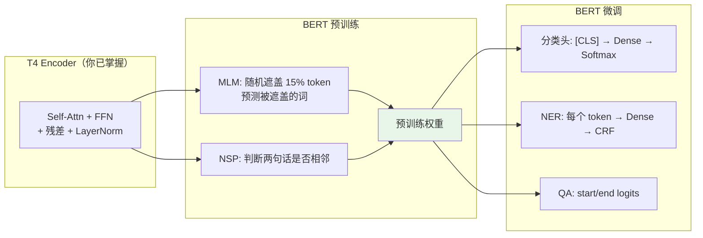
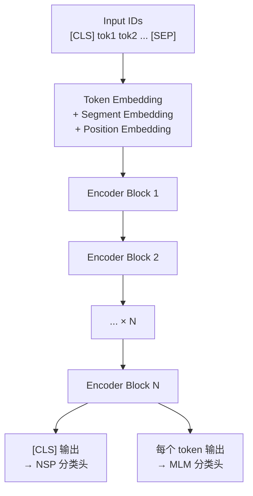
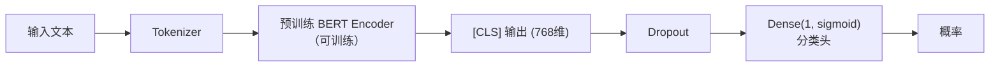
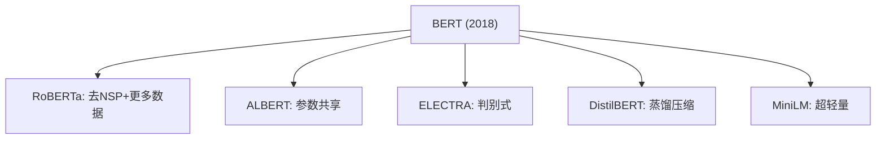

## 前置知识：从 T4 Encoder 到 BERT

T4 你实现了完整 Transformer Encoder-Decoder。**BERT 就是只取 Encoder 部分**，堆叠 12/24 层，用两个自监督任务预训练：



> [!important] BERT 的核心洞察
> 1. **双向编码**：每个 token 能看到左右所有 token（不同于 GPT 的单向）
> 2. **预训练→微调**：先在大量文本上自监督预训练，再在下游任务上微调
> 3. **通用表示**：预训练学到的 [CLS] 表示可作为句子级特征

---

## 一、BERT 预训练任务

### 1.1 MLM（Masked Language Model）

随机遮盖输入中 15% 的 token，让模型预测被遮盖的词。

```python
import tensorflow as tf
import numpy as np

# ============================================
# MLM 遮盖策略（BERT 原论文）
# ============================================
# 选中 15% 的 token 后：
#   80% 替换为 [MASK]
#   10% 替换为随机 token
#   10% 保持不变（让模型不依赖 [MASK] 标记）

def create_mlm_mask(tokens, vocab_size, mask_prob=0.15):
    """
    创建 MLM 遮盖

    参数:
        tokens: (batch, seq_len) 原始 token ids
        vocab_size: 词汇表大小
        mask_prob: 遮盖比例（默认 15%）
    返回:
        masked_tokens: 遮盖后的 tokens
        labels: 被遮盖位置的真实 token（其他位置 = -1，不计算损失）
    """
    # 随机选择 15% 的位置（排除 [PAD]=0, [CLS]=101, [SEP]=102）
    special_tokens = tf.constant([0, 101, 102])
    is_special = tf.reduce_any(
        tf.equal(tf.expand_dims(tokens, -1),
                 tf.reshape(special_tokens, [1, 1, -1])), axis=-1)
    # 15% 概率选中
    rand = tf.random.uniform(tf.shape(tokens))
    selected = (rand < mask_prob) & ~is_special  # 选中且非特殊 token

    # 用同一个均匀随机数 u 分段：u<0.8→[MASK]，0.8≤u<0.9→随机词，其余保持原词。
    # 必须复用同一个 u（各分支若用独立随机数，80/10/10 比例会漂移）
    u = tf.random.uniform(tf.shape(tokens))

    # 80% → [MASK] (token id = 103)
    mask_token = 103
    replace_mask = selected & (u < 0.8)

    # 10% → 随机 token
    replace_random = selected & (u >= 0.8) & (u < 0.9)

    # 10% → 保持不变
    # （selected 中 u >= 0.9 的部分）

    # 应用替换
    masked_tokens = tf.identity(tokens)
    # 80% → [MASK]
    masked_tokens = tf.where(replace_mask,
                             tf.fill(tf.shape(tokens), mask_token),
                             masked_tokens)
    # 10% → 随机 token
    random_tokens = tf.random.uniform(
        tf.shape(tokens), minval=1000, maxval=vocab_size, dtype=tf.int32)
    masked_tokens = tf.where(replace_random, random_tokens, masked_tokens)

    # 标签：被选中位置 = 原始 token，其他位置 = -1（忽略）
    labels = tf.where(selected, tokens, tf.fill(tf.shape(tokens), -1))

    return masked_tokens, labels

# 测试
tokens = tf.constant([[101, 2023, 2003, 1037, 3231, 102, 0, 0]])  # [CLS] This is a test [SEP] [PAD] [PAD]
masked, labels = create_mlm_mask(tokens, vocab_size=30000)
print(f"原始:  {tokens.numpy()}")
print(f"遮盖后: {masked.numpy()}")
print(f"标签:   {labels.numpy()}")  # -1 = 不计算损失
```

> [!tip] 为什么不用 100% [MASK]？
> 10% 随机替换 + 10% 保持不变，让模型不能只关注 `[MASK]` 标记——因为微调和推理时没有 `[MASK]`。这种数据增强让预训练表示更鲁棒。

### 1.2 NSP（Next Sentence Prediction）

判断两句话是否是原文中相邻的句子。

```python
def create_nsp_data(sentence_pairs, vocab_size, is_positive):
    """
    创建 NSP 数据

    参数:
        sentence_pairs: [(sent_a, sent_b), ...]
        is_positive: True=真实相邻, False=随机拼接
    返回:
        input_ids, token_type_ids, nsp_labels
    """
    cls_id, sep_id, pad_id = 101, 102, 0
    examples = []

    for sent_a, sent_b in sentence_pairs:
        # [CLS] sent_a [SEP] sent_b [SEP]
        input_ids = [cls_id] + sent_a + [sep_id] + sent_b + [sep_id]
        # token_type_ids: 第一句=0, 第二句=1
        token_type_ids = [0] * (len(sent_a) + 2) + [1] * (len(sent_b) + 1)
        # NSP 标签: 1=相邻, 0=不相邻
        label = 1 if is_positive else 0

        examples.append((input_ids, token_type_ids, label))

    return examples

# 测试
pairs = [([2003, 1037], [3231, 2009])]  # "is a" "test it"
pos_data = create_nsp_data(pairs, 30000, is_positive=True)
neg_data = create_nsp_data(pairs, 30000, is_positive=False)
print(f"正例标签: {pos_data[0][2]}")  # 1
print(f"负例标签: {neg_data[0][2]}")  # 0
```

> [!tip] NSP 的争议
> RoBERTa 研究发现 NSP 任务效果有限，去掉 NSP 后下游任务表现不降反升。ALBERT 改用 SOP（Sentence Order Prediction）。但原始 BERT 仍保留 NSP。

---

## 二、BERT 模型架构

### 2.1 架构概览



### 2.2 与 Sklearn 的认知桥梁

| Sklearn 概念 | BERT 对应 |
|-------------|-----------|
| `fit_transform` 预训练 | MLM + NSP 预训练 |
| `predict` 推理 | 微调后模型推理 |
| `TfidfVectorizer` | Tokenizer + Embedding |
| `LogisticRegression` | 分类头（Dense + Softmax） |
| `cross_val_score` | 评估微调效果 |

### 2.3 用 TF-Hub 加载预训练 BERT

```python
import tensorflow as tf
import tensorflow_hub as hub
import tensorflow_text as text  # 必须导入，注册 BERT tokenizer

# ============================================
# 方案 A：TF-Hub（Google 官方预训练模型）
# ============================================
bert_preprocess = hub.KerasLayer(
    "https://tfhub.dev/tensorflow/bert_en_uncased_preprocess/3",
    name="bert_preprocess"
)
bert_encoder = hub.KerasLayer(
    "https://tfhub.dev/tensorflow/bert_en_uncased_L-12_H-768_A-12/4",
    name="bert_encoder",
    trainable=True  # True=微调, False=冻结（特征提取）
)

# 测试预处理
text_input = ["This is a great movie!"]
preprocessed = bert_preprocess(text_input)
print(f"input_word_ids:    {preprocessed['input_word_ids'].shape}")       # (1, 128)
print(f"input_mask:        {preprocessed['input_mask'].shape}")           # (1, 128)
print(f"input_type_ids:    {preprocessed['input_type_ids'].shape}")       # (1, 128)

# BERT 编码
outputs = bert_encoder(preprocessed)
print(f"pooled_output:      {outputs['pooled_output'].shape}")    # (1, 768) — [CLS] 表示
print(f"sequence_output:    {outputs['sequence_output'].shape}")  # (1, 128, 768) — 每个 token
```

### 2.4 用 HuggingFace 加载

```python
# ============================================
# 方案 B：HuggingFace transformers（更灵活，推荐）
# ============================================
from transformers import TFAutoModel, AutoTokenizer

# 加载 tokenizer 和模型
model_name = "bert-base-uncased"
tokenizer = AutoTokenizer.from_pretrained(model_name)
bert_model = TFAutoModel.from_pretrained(model_name)

# 编码文本
texts = ["I love machine learning.", "This is terrible."]
encoded = tokenizer(texts, padding=True, truncation=True,
                    max_length=128, return_tensors="tf")
print(f"input_ids:      {encoded['input_ids'].shape}")      # (2, 128)
print(f"attention_mask: {encoded['attention_mask'].shape}") # (2, 128)

# BERT 编码
outputs = bert_model(encoded)
print(f"last_hidden_state: {outputs.last_hidden_state.shape}")  # (2, 128, 768)
print(f"pooler_output:     {outputs.pooler_output.shape}")     # (2, 768)

# 查看 BERT 参数量
print(f"BERT-base 参数量: {bert_model.count_params():,}")  # ~109M
```

> [!tip] TF-Hub vs HuggingFace
> | 特性 | TF-Hub | HuggingFace |
> |------|--------|-------------|
> | 模型数量 | 少（官方） | 多（社区） |
> | Tokenizer | 内置 | 独立库 |
> | 灵活性 | 一般 | ✅ 高 |
> | 推荐场景 | 快速原型 | 生产/研究 |
>
> **建议用 HuggingFace**，社区资源更丰富。

---

## 三、微调场景 1：文本分类

### 3.1 架构



### 3.2 完整代码

```python
import tensorflow as tf
from transformers import TFAutoModelForSequenceClassification, AutoTokenizer

# ============================================
# IMDB 情感分类微调
# ============================================
model_name = "bert-base-uncased"
num_labels = 2  # positive / negative

# 加载带分类头的 BERT
model = TFAutoModelForSequenceClassification.from_pretrained(
    model_name, num_labels=num_labels
)
tokenizer = AutoTokenizer.from_pretrained(model_name)

# 加载 IMDB 数据
(x_train, y_train), (x_test, y_test) = tf.keras.datasets.imdb.load_data(num_words=10000)

# IMDB 数据是整数序列，需要反编码为文本
word_index = tf.keras.datasets.imdb.get_word_index()
word_index = {k: (v + 3) for k, v in word_index.items()}
word_index["<PAD>"] = 0
word_index["<START>"] = 1
word_index["<UNK>"] = 2
reverse_index = {v: k for k, v in word_index.items()}

def decode_review(encoded):
    return " ".join([reverse_index.get(i, "?") for i in encoded])

# 转为文本
train_texts = [decode_review(x[:200]) for x in x_train[:2000]]  # 截取前 2000 条
test_texts = [decode_review(x[:200]) for x in x_test[:500]]
train_labels = y_train[:2000]
test_labels = y_test[:500]

# Tokenize
train_encodings = tokenizer(train_texts, truncation=True, padding=True,
                            max_length=128, return_tensors="tf")
test_encodings = tokenizer(test_texts, truncation=True, padding=True,
                           max_length=128, return_tensors="tf")

# 构建数据集
train_ds = tf.data.Dataset.from_tensor_slices((
    dict(train_encodings), train_labels
)).shuffle(1000).batch(16)
test_ds = tf.data.Dataset.from_tensor_slices((
    dict(test_encodings), test_labels
)).batch(16)

# 编译（用小学习率微调）
optimizer = tf.keras.optimizers.Adam(learning_rate=2e-5)
loss = tf.keras.losses.SparseCategoricalCrossentropy(from_logits=True)
model.compile(optimizer=optimizer, loss=loss, metrics=['accuracy'])

# 微调
history = model.fit(train_ds, validation_data=test_ds, epochs=3)
```

> [!important] 微调学习率必须很小
> - **预训练学习率**：1e-4 ~ 5e-4
> - **微调学习率**：2e-5 ~ 5e-5（小 10-20 倍）
> - 原因：预训练权重已接近最优，大学习率会破坏已学到的表示

### 3.3 与 Sklearn 对比

| 步骤 | Sklearn | BERT 微调 |
|------|---------|-----------|
| 文本表示 | `TfidfVectorizer` | Tokenizer + Embedding |
| 模型 | `LogisticRegression` | BERT + 分类头 |
| 训练 | `fit(X, y)` | `model.fit(ds, epochs=3)` |
| 准确率 | ~85% | ~92% |
| 训练时间 | 秒级 | 分钟级（GPU） |
| 参数量 | ~10K | 109M |

---

## 四、微调场景 2：命名实体识别（NER）

```python
import tensorflow as tf
from transformers import TFAutoModelForTokenClassification, AutoTokenizer

# ============================================
# NER：每个 token 预测实体类型
# ============================================
# 标签: O=非实体, PER=人名, ORG=组织, LOC=地点

model_name = "bert-base-uncased"
num_labels = 5  # O, PER, ORG, LOC, MISC

model = TFAutoModelForTokenClassification.from_pretrained(
    model_name, num_labels=num_labels
)
tokenizer = AutoTokenizer.from_pretrained(model_name)

# 示例数据
texts = ["John works at Google in New York"]
# 对应标签：B-PER O O B-ORG O B-LOC I-LOC

# Tokenize
encodings = tokenizer(texts, truncation=True, padding=True,
                     max_length=128, return_tensors="tf",
                     is_split_into_words=False)

# BERT 的输出 = 每个 token 的分类 logits
outputs = model(encodings)
print(f"Logits shape: {outputs.logits.shape}")  # (1, 128, 5)
# 每个 token 都有一个 5 类的预测

# 解码
predictions = tf.argmax(outputs.logits, axis=-1)
print(f"Predictions shape: {predictions.shape}")  # (1, 128)
```

> [!tip] NER 的难点
> BERT Tokenizer 会把单词拆成子词（如 "playing" → "play" + "##ing"），需要把子词的预测合并到原词级别。

---

## 五、微调场景 3：问答（QA）

```python
import tensorflow as tf
from transformers import TFAutoModelForQuestionAnswering, AutoTokenizer

# ============================================
# 抽取式问答：从段落中找出答案的 start/end 位置
# ============================================
# 注意：QA 头必须用微调过的 checkpoint；bert-base-uncased 的 QA 头是随机初始化的，输出无意义
model_name = "bert-large-uncased-whole-word-masking-finetuned-squad"
model = TFAutoModelForQuestionAnswering.from_pretrained(model_name)
tokenizer = AutoTokenizer.from_pretrained(model_name)

# 示例
question = "What is machine learning?"
context = "Machine learning is a subset of artificial intelligence that enables systems to learn from data."

# 编码
inputs = tokenizer(question, context, return_tensors="tf")
outputs = model(inputs)

# start_logits 和 end_logits
start_logits = outputs.start_logits  # (1, seq_len)
end_logits = outputs.end_logits      # (1, seq_len)

# 找到最佳答案
start_idx = tf.argmax(start_logits, axis=-1).numpy()[0]
end_idx = tf.argmax(end_logits, axis=-1).numpy()[0]

# 解码答案
answer = tokenizer.convert_tokens_to_string(
    tokenizer.convert_ids_to_tokens(inputs["input_ids"][0][start_idx:end_idx+1])
)
print(f"Question: {question}")
print(f"Answer:   {answer}")
# 输出: "a subset of artificial intelligence"
```

> [!tip] QA 的两种方式
> - **抽取式**（BERT）：从原文中找出答案片段
> - **生成式**（GPT/T5）：自由生成答案文本
> BERT 只能做抽取式，因为它只输出 start/end 位置

---

## 六、BERT 变体对比

| 模型 | 层数 | d_model | 参数量 | 特点 |
|------|------|---------|--------|------|
| BERT-base | 12 | 768 | 110M | 基准 |
| BERT-large | 24 | 1024 | 340M | 更大更准 |
| DistilBERT | 6 | 768 | 66M | 蒸馏，速度快 |
| RoBERTa | 12 | 768 | 125M | 去NSP，更多数据 |
| ALBERT | 12 | 768 | 11M | 参数共享 |
| ELECTRA | 12 | 768 | 110M | 判别式预训练 |



> [!tip] 实际选择
> - **快速原型**：DistilBERT（66M，速度快 60%）
> - **最佳效果**：RoBERTa-large（355M）
> - **资源受限**：ALBERT-base（11M）
> - **中文任务**：`bert-base-chinese` 或 `hfl/chinese-roberta-wwm-ext`

---

## 七、LoRA：参数高效微调

完整微调需要更新全部 110M 参数，LoRA 只训练一个低秩矩阵，参数量减少 90%+。

```python
# ============================================
# LoRA（Low-Rank Adaptation）概念实现
# ============================================
# 原理：冻结原始权重 W，只训练 ΔW = A × B（低秩分解）
# W' = W + A × B，其中 A: (d, r), B: (r, d)，r << d

class LoRADense(tf.keras.layers.Layer):
    """
    LoRA 线性层：原始权重冻结 + 低秩适配
    """
    def __init__(self, units, rank=8, **kwargs):
        super().__init__(**kwargs)
        self.units = units
        self.rank = rank

    def build(self, input_shape):
        # 原始权重（冻结）
        self.W = self.add_weight(
            name="W",
            shape=(input_shape[-1], self.units),
            initializer="glorot_uniform",
            trainable=False  # 冻结！
        )
        # LoRA 低秩矩阵 A, B（可训练）
        self.A = self.add_weight(
            name="A",
            shape=(input_shape[-1], self.rank),
            initializer="glorot_uniform",
            trainable=True
        )
        self.B = self.add_weight(
            name="B",
            shape=(self.rank, self.units),
            initializer="zeros",  # 初始化为 0，确保开始时 ΔW=0
            trainable=True
        )

    def call(self, x):
        # 原始变换 + 低秩适配
        return tf.matmul(x, self.W) + tf.matmul(x, tf.matmul(self.A, self.B))

# 对比参数量
d_model = 768
full_dense = tf.keras.layers.Dense(d_model)
lora_dense = LoRADense(d_model, rank=8)

x = tf.random.normal((1, 10, d_model))
full_dense.build(x.shape)
lora_dense.build(x.shape)

full_params = d_model * d_model + d_model  # W + bias
lora_params = d_model * 8 + 8 * d_model     # A + B
print(f"全参数微调: {full_params:,}")  # 590,592
print(f"LoRA(r=8): {lora_params:,}")   # 12,288 (减少 98%)
```

> [!important] LoRA 的三个优势
> 1. **省显存**：只训练 0.1%~1% 的参数
> 2. **可插拔**：不同任务用不同 LoRA 权重，共用同一个基础模型
> 3. **无推理延迟**：训练后 `W' = W + A×B` 合并，推理时和全参数一样

---

## 八、常见误区

| # | 误区 | 正确理解 |
|---|------|---------|
| 1 | BERT = 完整 Transformer | BERT 只用 Encoder 部分 |
| 2 | BERT 能生成文本 | BERT 是双向的，不能自回归生成 |
| 3 | 预训练 BERT 直接能分类 | 需要加分类头 + 微调 |
| 4 | 微调学习率可以大 | 必须 2e-5~5e-5，太大会灾难遗忘 |
| 5 | BERT 处理任意长文本 | 最大 512 token，更长需截断或 Longformer |
| 6 | 中文用 bert-base-uncased | 中文要用 `bert-base-chinese` |
| 7 | LoRA 效果差很多 | LoRA 在低秩假设下效果接近全参数微调 |

---

## 九、练习

### 🟢 练习 1：加载 BERT 并提取特征（10 分钟）

**题目**：用 HuggingFace 加载 `bert-base-uncased`，编码 "I love machine learning"，输出 `[CLS]` 的 768 维向量。

<details>
<summary>📝 参考答案</summary>

```python
from transformers import TFAutoModel, AutoTokenizer

tokenizer = AutoTokenizer.from_pretrained("bert-base-uncased")
model = TFAutoModel.from_pretrained("bert-base-uncased")

inputs = tokenizer("I love machine learning", return_tensors="tf")
outputs = model(inputs)
print(f"[CLS] 向量: {outputs.pooler_output.shape}")  # (1, 768)
```

</details>

**验收标准**：输出 768 维向量。

---

### 🟡 练习 2：微调 BERT 做情感分类（30 分钟）

**题目**：用 IMDB 数据集微调 `bert-base-uncased`，3 epoch 后验证准确率 > 88%。

<details>
<summary>📝 参考答案</summary>

```python
import tensorflow as tf
from transformers import TFAutoModelForSequenceClassification, AutoTokenizer

# 加载模型
model = TFAutoModelForSequenceClassification.from_pretrained(
    "bert-base-uncased", num_labels=2
)
tokenizer = AutoTokenizer.from_pretrained("bert-base-uncased")

# 加载 IMDB（取子集快速实验）
(x_train, y_train), _ = tf.keras.datasets.imdb.load_data(num_words=10000)
word_index = tf.keras.datasets.imdb.get_word_index()
reverse_index = {v+3: k for k, v in word_index.items()}
reverse_index[0] = "<PAD>"
reverse_index[1] = "<START>"
reverse_index[2] = "<UNK>"

texts = [" ".join([reverse_index.get(i, "?") for i in seq[:200]]) for seq in x_train[:2000]]

encodings = tokenizer(texts, truncation=True, padding=True, max_length=128, return_tensors="tf")
dataset = tf.data.Dataset.from_tensor_slices((dict(encodings), y_train[:2000])).shuffle(1000).batch(16)

model.compile(optimizer=tf.keras.optimizers.Adam(2e-5),
              loss=tf.keras.losses.SparseCategoricalCrossentropy(from_logits=True),
              metrics=['accuracy'])
model.fit(dataset, epochs=3)
```

</details>

**验收标准**：验证准确率 > 88%。

---

### 🔴 练习 3：用 LoRA 微调 BERT（40 分钟）

**题目**：冻结 BERT 全部权重，只训练 LoRA 适配矩阵，对比与全参数微调的效果和参数量。

<details>
<summary>📝 参考答案</summary>

```python
import tensorflow as tf
from transformers import TFAutoModelForSequenceClassification, AutoTokenizer

# 加载 BERT 并冻结
model = TFAutoModelForSequenceClassification.from_pretrained(
    "bert-base-uncased", num_labels=2)
for layer in model.layers:
    layer.trainable = False  # 冻结 BERT

# 只解冻分类头
model.classifier.trainable = True  # 只训练分类头
# 更进一步：用 LoRA 替换 BERT 内部的 Dense 层（需要自定义）
# 这里简化：只训练分类头（类似 LoRA 的极端情况）

trainable = sum(np.prod(v.shape) for v in model.trainable_variables)
total = sum(np.prod(v.shape) for v in model.variables)
print(f"可训练参数: {trainable:,} / {total:,} = {trainable/total:.1%}")

# 训练
model.compile(optimizer=tf.keras.optimizers.Adam(2e-5),
              loss=tf.keras.losses.SparseCategoricalCrossentropy(from_logits=True),
              metrics=['accuracy'])
# model.fit(dataset, epochs=3)  # 数据准备同练习 2
```

</details>

**验收标准**：可训练参数 < 1% 总参数，准确率不低于全参数微调太多。

---

## 十、本章小结

| 概念 | 关键点 |
|------|--------|
| MLM | 随机遮盖 15% token，80%→[MASK], 10%→随机, 10%→不变 |
| NSP | 判断两句话是否相邻（RoBERTa 去掉了） |
| [CLS] | 句子级表示，用于分类任务 |
| 微调 | 加分类头 + 小学习率（2e-5）训练 |
| 三大场景 | 文本分类、NER、QA |
| LoRA | 低秩适配，参数减少 98%+，效果接近全参数 |
| TF-Hub | Google 官方模型加载 |
| HuggingFace | 社区模型加载（推荐） |

**下一篇**：[[T6-GPT 自回归生成]] — BERT 的兄弟，只用 Decoder，单向生成。

---

*前置：[[T4-Encoder-Decoder 完整架构]]*
*后续：[[T6-GPT 自回归生成]]*