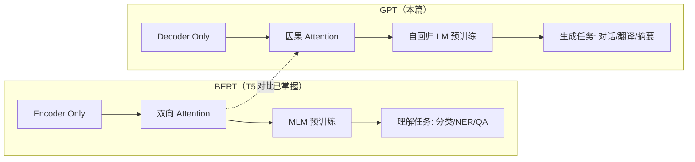
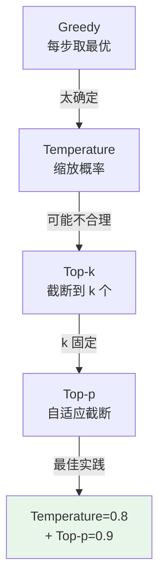

## 前置知识：从 BERT 到 GPT

T5 你学了 BERT（Encoder-Only，双向，理解任务）。**GPT 是它的镜像**：只用 Decoder，因果注意力，自回归生成。



> [!important] BERT vs GPT 一句话总结
> - **BERT**：看完整句话再理解（像考试阅读理解）
> - **GPT**：逐字生成，不能看后面（像写作文）

---

## 一、自回归语言模型

### 1.1 原理

给定前面的 token，预测下一个 token：

$$P(w_1, ..., w_n) = \prod_{t=1}^{n} P(w_t | w_1, ..., w_{t-1})$$

```python
import tensorflow as tf
import numpy as np

# ============================================
# 自回归生成示例
# ============================================
# 输入: "The cat sat on"
# 模型预测下一个 token: "the"
# 新输入: "The cat sat on the"
# 预测: "mat"
# 重复直到结束

# GPT 的训练目标：
# 输入:  [The, cat, sat, on, the, mat]
# 目标:  [cat, sat, on, the, mat, <EOS>]
#       （输入右移一位）
```

### 1.2 与 BERT MLM 的对比

| 特性 | BERT MLM | GPT 自回归 |
|------|----------|------------|
| Attention | 双向 | 因果（单向） |
| 预训练 | 随机遮盖 → 预测 | 下一个 token → 预测 |
| 训练效率 | 15% token 有监督 | 100% token 有监督 |
| 推理 | 一次编码 | 逐 token 生成 |
| 任务 | 理解 | 生成 |

> [!tip] GPT 的训练效率更高
> BERT 只有 15% 的 token 参与损失计算，GPT 每个 token 都参与。但这不代表 GPT 效果更好——双向 vs 单向各有优势。

---

## 二、GPT 架构实现

### 2.1 GPT Block

```python
import tensorflow as tf

class GPTBlock(tf.keras.layers.Layer):
    """
    GPT Decoder Block（Pre-LN 版本）
    结构: x → LN → Causal MHA → 残差 → LN → FFN → 残差

    与 T4 的 DecoderBlock 区别：
    - 只有 Self-Attention（无 Cross-Attention）
    - 因果遮罩（Causal Mask）
    """
    def __init__(self, d_model, num_heads, dff, dropout_rate=0.1, **kwargs):
        super().__init__(**kwargs)

        # 因果 Self-Attention（单向）
        self.mha = tf.keras.layers.MultiHeadAttention(
            num_heads=num_heads,
            key_dim=d_model // num_heads,
            dropout=dropout_rate
        )

        # FFN
        self.ffn = tf.keras.Sequential([
            tf.keras.layers.Dense(dff, activation='gelu'),  # GPT 用 GELU 不是 ReLU
            tf.keras.layers.Dense(d_model)
        ])

        # LayerNorm × 2（Pre-LN）
        self.ln1 = tf.keras.layers.LayerNormalization(epsilon=1e-5)
        self.ln2 = tf.keras.layers.LayerNormalization(epsilon=1e-5)

        # Dropout × 2
        self.dropout1 = tf.keras.layers.Dropout(dropout_rate)
        self.dropout2 = tf.keras.layers.Dropout(dropout_rate)

    def call(self, x, training=False, causal_mask=None):
        # Step 1: Pre-LN Causal Self-Attention + 残差
        ln_x = self.ln1(x)
        attn_output = self.mha(ln_x, ln_x, ln_x, attention_mask=causal_mask)
        attn_output = self.dropout1(attn_output, training=training)
        x = x + attn_output

        # Step 2: Pre-LN FFN + 残差
        ln_x = self.ln2(x)
        ffn_output = self.ffn(ln_x)
        ffn_output = self.dropout2(ffn_output, training=training)
        x = x + ffn_output

        return x

# 测试
block = GPTBlock(d_model=128, num_heads=8, dff=512)
x = tf.random.normal((2, 10, 128))
out = block(x)
print(f"GPT Block: {x.shape} → {out.shape}")  # (2, 10, 128) → (2, 10, 128)
```

> [!tip] GPT vs T4 DecoderBlock 的区别
> 1. **无 Cross-Attention**：GPT 没有 Encoder，不需要 Cross-Attention
> 2. **GELU 替代 ReLU**：GPT 用 GELU 激活函数（更平滑的 ReLU）
> 3. **因果遮罩**：所有 Self-Attention 都带 causal mask

### 2.2 完整 GPT 模型

```python
class GPTModel(tf.keras.Model):
    """
    GPT 模型（Decoder-Only）

    参数:
        num_layers: 层数（GPT-2 small=12, medium=24, large=36）
        d_model: 模型维度（GPT-2 small=768）
        num_heads: 头数（GPT-2 small=12）
        dff: FFN 中间层（GPT-2 small=3072）
        vocab_size: 词汇表大小
        max_seq_len: 最大序列长度
    """
    def __init__(self, num_layers, d_model, num_heads, dff,
                 vocab_size, max_seq_len, dropout_rate=0.1, **kwargs):
        super().__init__(**kwargs)

        # Token Embedding
        self.token_emb = tf.keras.layers.Embedding(vocab_size, d_model)
        # 可学习位置编码
        self.pos_emb = tf.keras.layers.Embedding(max_seq_len, d_model)

        # N 个 GPT Block
        self.blocks = [
            GPTBlock(d_model, num_heads, dff, dropout_rate)
            for _ in range(num_layers)
        ]

        # 最终 LayerNorm
        self.ln_f = tf.keras.layers.LayerNormalization(epsilon=1e-5)
        # 输出投影到 vocab
        self.lm_head = tf.keras.layers.Dense(vocab_size, use_bias=False)

        self.dropout = tf.keras.layers.Dropout(dropout_rate)

    def call(self, x, training=False):
        seq_len = tf.shape(x)[1]

        # Token + Position Embedding
        token_embeddings = self.token_emb(x)  # (batch, seq, d_model)
        position_ids = tf.range(seq_len)
        position_embeddings = self.pos_emb(position_ids)  # (seq, d_model)
        x = token_embeddings + position_embeddings
        x = self.dropout(x, training=training)

        # 创建因果遮罩（keep-mask: 下三角含对角线=1=可见, 上三角=0=遮蔽）
        # Keras MultiHeadAttention 的 attention_mask 语义是 1=可见/0=遮蔽（与 T2 自定义 MHA 相反）
        causal_mask = tf.linalg.band_part(
            tf.ones((seq_len, seq_len)), -1, 0
        )  # (seq, seq), 下三角含对角线=1
        causal_mask = causal_mask[tf.newaxis, tf.newaxis, :, :]  # (1, 1, seq, seq)

        # N 个 GPT Block
        for block in self.blocks:
            x = block(x, training=training, causal_mask=causal_mask)

        # 最终 LayerNorm + LM Head
        x = self.ln_f(x)
        logits = self.lm_head(x)  # (batch, seq, vocab_size)

        return logits

# 测试：微型 GPT
gpt = GPTModel(
    num_layers=2, d_model=128, num_heads=8, dff=512,
    vocab_size=1000, max_seq_len=100
)
x = tf.random.uniform((2, 10), maxval=1000, dtype=tf.int32)
logits = gpt(x, training=False)
print(f"GPT output: {logits.shape}")  # (2, 10, 1000)
print(f"参数量: {gpt.count_params():,}")
```

> [!tip] GPT-2 规模参考
> | 模型 | 层数 | d_model | 参数量 |
> |------|------|---------|--------|
> | GPT-2 small | 12 | 768 | 124M |
> | GPT-2 medium | 24 | 1024 | 355M |
> | GPT-2 large | 36 | 1280 | 774M |
> | GPT-2 XL | 48 | 1600 | 1.5B |

---

## 三、训练：自回归语言模型

### 3.1 损失函数

```python
def gpt_loss(y_true, y_pred):
    """
    GPT 损失：每个位置的 cross-entropy

    y_true: (batch, seq) — 输入右移一位
    y_pred: (batch, seq, vocab) — logits
    """
    loss = tf.keras.losses.sparse_categorical_crossentropy(
        y_true, y_pred, from_logits=True
    )
    return tf.reduce_mean(loss)

# 训练数据构造
# 输入:  [The, cat, sat, on, the, mat]
# 目标:  [cat, sat, on, the, mat, <EOS>]
# 就是输入右移一位

def prepare_lm_data(token_ids):
    """准备 LM 训练数据"""
    x = token_ids[:-1]   # 去掉最后一个
    y = token_ids[1:]    # 去掉第一个
    return x, y
```

### 3.2 训练代码

```python
# 编译
gpt.compile(
    optimizer=tf.keras.optimizers.Adam(learning_rate=1e-4),
    loss=gpt_loss
)

# 模拟训练数据
texts = tf.random.uniform((32, 50), maxval=1000, dtype=tf.int32)
x_train = texts[:, :-1]  # (32, 49)
y_train = texts[:, 1:]   # (32, 49)

gpt.fit(x_train, y_train, epochs=5, batch_size=8)
```

---

## 四、推理：文本生成策略

### 4.1 Greedy Search（贪心搜索）

```python
def generate_greedy(model, start_tokens, max_length=50, end_token=None):
    """
    贪心生成：每步选概率最大的 token
    """
    tokens = list(start_tokens)

    for _ in range(max_length):
        # 当前序列作为输入
        input_ids = tf.constant([tokens])
        logits = model(input_ids, training=False)

        # 取最后一个位置的预测
        next_token = tf.argmax(logits[0, -1, :]).numpy()

        if end_token is not None and next_token == end_token:
            break

        tokens.append(next_token)

    return tokens

# 测试
start = [101, 2023, 2003]  # [CLS] "This is"
generated = generate_greedy(gpt, start, max_length=20)
print(f"Generated: {generated}")
```

> [!warning] Greedy 的问题
> 贪心搜索每步选最优，但局部最优不等于全局最优。容易生成重复文本（"I love love love love..."）。

### 4.2 Temperature 采样

```python
def generate_with_temperature(model, start_tokens, temperature=1.0,
                               max_length=50, end_token=None):
    """
    Temperature 采样：控制生成随机性
    - temperature < 1: 更确定（趋近贪心）
    - temperature = 1: 原始分布
    - temperature > 1: 更随机
    """
    tokens = list(start_tokens)

    for _ in range(max_length):
        input_ids = tf.constant([tokens])
        logits = model(input_ids, training=False)

        # 取最后一个位置
        next_logits = logits[0, -1, :]  # (vocab,)

        # Temperature 缩放
        next_logits = next_logits / temperature

        # 采样
        next_token = tf.random.categorical(
            tf.expand_dims(next_logits, 0), 1
        )[0, 0].numpy()

        if end_token is not None and next_token == end_token:
            break

        tokens.append(next_token)

    return tokens
```

| Temperature | 效果 | 适合场景 |
|-------------|------|---------|
| 0.1~0.3 | 几乎贪心，确定性高 | 事实性文本、代码 |
| 0.7~0.9 | **平衡**（推荐） | 通用对话、摘要 |
| 1.0 | 原始分布 | 创意写作 |
| 1.5~2.0 | 高度随机 | 头脑风暴、创意 |

### 4.3 Top-k 采样

```python
def generate_top_k(model, start_tokens, k=50, temperature=0.8,
                   max_length=50, end_token=None):
    """
    Top-k 采样：只从概率最高的 k 个 token 中采样
    截断长尾分布，避免采样到不合理的 token
    """
    tokens = list(start_tokens)

    for _ in range(max_length):
        input_ids = tf.constant([tokens])
        logits = model(input_ids, training=False)
        next_logits = logits[0, -1, :] / temperature

        # 只保留 Top-k 个 token 的 logits，其余设为 -∞
        top_k_values, top_k_indices = tf.math.top_k(next_logits, k=k)
        mask = tf.fill(tf.shape(next_logits), -1e9)
        mask = tf.tensor_scatter_nd_update(
            mask, tf.expand_dims(top_k_indices, -1), top_k_values
        )

        # 从 Top-k 中采样
        next_token = tf.random.categorical(
            tf.expand_dims(mask, 0), 1
        )[0, 0].numpy()

        if end_token is not None and next_token == end_token:
            break

        tokens.append(next_token)

    return tokens
```

### 4.4 Top-p（Nucleus）采样

```python
def generate_top_p(model, start_tokens, p=0.9, temperature=0.8,
                   max_length=50, end_token=None):
    """
    Top-p（Nucleus）采样：选择累积概率 ≥ p 的最小 token 集合
    自适应截断：高概率时少选，低概率时多选
    """
    tokens = list(start_tokens)

    for _ in range(max_length):
        input_ids = tf.constant([tokens])
        logits = model(input_ids, training=False)
        next_logits = logits[0, -1, :] / temperature

        # 计算 softmax 概率
        probs = tf.nn.softmax(next_logits)

        # 按概率降序排列
        sorted_indices = tf.argsort(probs, direction='DESCENDING')
        sorted_probs = tf.sort(probs, direction='DESCENDING')

        # 计算累积概率
        cumulative_probs = tf.math.cumsum(sorted_probs)

        # 找到累积概率超过 p 的位置
        # 保留累积概率 ≤ p 的 token + 刚好超过 p 的那个
        cutoff = tf.searchsorted(cumulative_probs, p)
        cutoff = tf.cast(cutoff, tf.int32) + 1  # +1 包含超过 p 的那个

        # 保留前 cutoff 个 token
        kept_indices = sorted_indices[:cutoff]
        kept_probs = sorted_probs[:cutoff]

        # 重新归一化
        kept_probs = kept_probs / tf.reduce_sum(kept_probs)

        # 采样
        next_idx = tf.random.categorical(
            tf.math.log(tf.expand_dims(kept_probs, 0)), 1
        )[0, 0].numpy()
        next_token = kept_indices[next_idx].numpy()

        if end_token is not None and next_token == end_token:
            break

        tokens.append(next_token)

    return tokens
```

### 4.5 生成策略对比

| 策略 | 原理 | 优点 | 缺点 | 推荐参数 |
|------|------|------|------|---------|
| Greedy | 每步取 argmax | 确定性强 | 重复、无创意 | — |
| Temperature | 缩放 logits | 简单有效 | 可能采样不合理 | 0.7~0.9 |
| Top-k | 截断到 k 个 | 避免长尾 | k 固定不自适应 | k=40~50 |
| Top-p | 累积概率截断 | **自适应** | 计算稍复杂 | p=0.9~0.95 |
| Beam Search | 保留 N 条路径 | 全局最优 | 速度慢、可能重复 | beam=5 |



> [!important] 实际推荐
> **Temperature=0.8 + Top-p=0.9** 是大多数场景的最佳组合。GPT-3/ChatGPT 默认类似配置。

---

## 五、GPT 的进化历程


| 模型 | 参数量 | 核心创新 |
|------|--------|---------|
| GPT-1 | 117M | 预训练 + 微调范式 |
| GPT-2 | 1.5B | 零样本（Zero-shot） |
| GPT-3 | 175B | 少样本（Few-shot）、In-context Learning |
| ChatGPT | ~175B | RLHF（人类反馈强化学习） |
| GPT-4 | 未公开 | 多模态、更强推理 |

> [!tip] GPT 的核心洞察
> - **GPT-2**：足够大的模型可以零样本完成多种任务
> - **GPT-3**：大模型涌现出 In-context Learning（不用微调，给几个例子就能学）
> - **ChatGPT**：RLHF 让模型对齐人类偏好

---

## 六、KV Cache：推理加速

```python
# ============================================
# KV Cache 概念（GPT 推理加速的关键）
# ============================================
# 问题：自回归生成时，每生成一个 token 都要重新计算
#       整个序列的 Attention。但前 N-1 个 token 的 K/V
#       没变，可以缓存。

# 无 Cache: 每步计算 O(n²) → 总复杂度 O(n³)
# 有 Cache: 每步只算新 token 的 Q 与缓存的 K/V → 总复杂度 O(n²)

# Keras 内置 MultiHeadAttention 没有增量缓存 API（不存在 use_caching/cache 参数）。
# TF 下做增量解码需自己缓存并拼接每层的 K/V：
#   K_new = concat([K_cache, k_of_new_token], axis=seq 维)，V 同理，再对新 token 的 Q 做注意力
# 或者用 KerasHub 的 CachedMultiHeadAttention（注意其调用位置参数顺序是 (query, value, key)）
# 实际生产中使用 optimized 实现（如 vLLM、TensorRT-LLM）
```

> [!important] KV Cache 的意义
> | 序列长度 | 无 Cache | 有 Cache | 加速比 |
> |----------|---------|---------|--------|
> | 100 | 100 次完整计算 | 100 次增量计算 | ~10× |
> | 1000 | 1000 次完整计算 | 1000 次增量计算 | ~30× |
>
> ChatGPT 等大模型推理必须用 KV Cache，否则速度不可接受。

---

## 七、常见误区

| # | 误区 | 正确理解 |
|---|------|---------|
| 1 | GPT 比 BERT 好 | 理解任务 BERT 更好，生成任务 GPT 更好 |
| 2 | Temperature 越高越好 | 过高会生成无意义文本 |
| 3 | Top-k 和 Top-p 一样 | Top-k 固定截断，Top-p 自适应截断 |
| 4 | GPT 可以做分类 | 可以，但需要用"提示词"或微调 |
| 5 | 自回归 = 贪心搜索 | 自回归是逐 token 生成，采样策略可选 |
| 6 | Greedy 最快 | 是最快但效果最差，容易重复 |
| 7 | GPT 的 Attention 是双向的 | GPT 是因果（单向）的 |

---

## 八、练习

### 🟢 练习 1：实现贪心生成（10 分钟）

**题目**：用微型 GPT 模型，从 `[101, 2023]` 开始贪心生成 20 个 token。

<details>
<summary>📝 参考答案</summary>

```python
# 使用上面定义的 GPTModel 和 generate_greedy
gpt = GPTModel(num_layers=2, d_model=128, num_heads=8, dff=512,
               vocab_size=1000, max_seq_len=100)

start_tokens = [101, 2023]  # [CLS] "This"
generated = generate_greedy(gpt, start_tokens, max_length=20)
print(f"Generated tokens: {generated}")
```

</details>

**验收标准**：生成 20 个 token，无报错。

---

### 🟡 练习 2：对比 Temperature 值（25 分钟）

**题目**：用同一个 start_tokens，分别用 temperature=0.1, 0.8, 1.5 各生成 3 次，观察输出差异。

<details>
<summary>📝 参考答案</summary>

```python
gpt = GPTModel(num_layers=2, d_model=128, num_heads=8, dff=512,
               vocab_size=1000, max_seq_len=100)

start_tokens = [101, 2023]

for temp in [0.1, 0.8, 1.5]:
    print(f"\n--- Temperature = {temp} ---")
    for i in range(3):
        gen = generate_with_temperature(
            gpt, start_tokens, temperature=temp, max_length=20
        )
        print(f"  Run {i+1}: {gen}")
    # temp=0.1: 三次输出几乎相同（高确定性）
    # temp=0.8: 三次输出不同但合理
    # temp=1.5: 三次输出差异很大，可能不合理
```

</details>

**验收标准**：temperature=0.1 时输出高度一致，1.5 时差异大。

---

### 🔴 练习 3：实现 Top-p 采样并对比 Top-k（40 分钟）

**题目**：实现 Top-p 采样，对比 Top-k 在不同概率分布下的截断行为。

<details>
<summary>📝 参考答案</summary>

```python
import tensorflow as tf
import numpy as np

# 模拟两种分布
# 分布 1: 尖锐分布（一个 token 概率很大）
sharp_logits = tf.constant([10.0, 1.0, 0.5, 0.1, -1.0, -2.0, -3.0, -5.0])
sharp_probs = tf.nn.softmax(sharp_logits).numpy()
print(f"尖锐分布: {sharp_probs.round(3)}")
# [0.999, 0.000, 0.000, ...]

# 分布 2: 平坦分布（多个 token 概率接近）
flat_logits = tf.constant([1.0, 0.9, 0.8, 0.7, 0.6, 0.5, 0.4, 0.3])
flat_probs = tf.nn.softmax(flat_logits).numpy()
print(f"平坦分布: {flat_probs.round(3)}")
# [0.15, 0.14, 0.13, ...]

# Top-k=3: 固定截断 3 个
# 尖锐分布: 保留 [0.999, 0.000, 0.000] → 浪费 2 个位置
# 平坦分布: 保留 [0.15, 0.14, 0.13] → 可能太少

# Top-p=0.9: 自适应截断
# 尖锐分布: 保留 1 个（0.999 > 0.9）→ 高效
# 平坦分布: 保留 ~7 个（累积 0.15+0.14+...+0.12 > 0.9）→ 合理

print("\n--- Top-k=3 ---")
print(f"尖锐分布保留: {np.sort(sharp_probs)[-3:].round(3)}")  # 3 个
print(f"平坦分布保留: {np.sort(flat_probs)[-3:].round(3)}")  # 3 个

print("\n--- Top-p=0.9 ---")
for name, probs in [("尖锐", sharp_probs), ("平坦", flat_probs)]:
    sorted_p = np.sort(probs)[::-1]
    cumsum = np.cumsum(sorted_p)
    cutoff = np.searchsorted(cumsum, 0.9) + 1
    print(f"{name}分布保留 {cutoff} 个: {sorted_p[:cutoff].round(3)}")
```

</details>

**验收标准**：理解 Top-p 自适应截断的优势。

---

## 九、本章小结

| 概念 | 关键点 |
|------|--------|
| 自回归 | 逐 token 生成，P(w_t \| w_1...w_{t-1}) |
| 因果遮罩 | 上三角 mask，防止看到未来 |
| GPT Block | Causal Self-Attn + FFN + 残差 + LayerNorm |
| GELU | GPT 用 GELU 替代 ReLU |
| Greedy | 每步取 argmax，容易重复 |
| Temperature | 控制随机性，0.7~0.9 最佳 |
| Top-k | 固定截断 k 个 token |
| Top-p | 自适应截断，累积概率 ≥ p |
| KV Cache | 缓存 K/V，推理加速 10-30× |
| GPT 进化 | GPT-1→2→3→ChatGPT→4 |

**下一篇**：[[T7-HuggingFace + TensorFlow 实战]] — 统一用 HuggingFace 加载 BERT/GPT/T5 等所有模型。

---

*前置：[[T5-BERT 双向预训练与微调]]*
*后续：[[T7-HuggingFace + TensorFlow 实战]]*