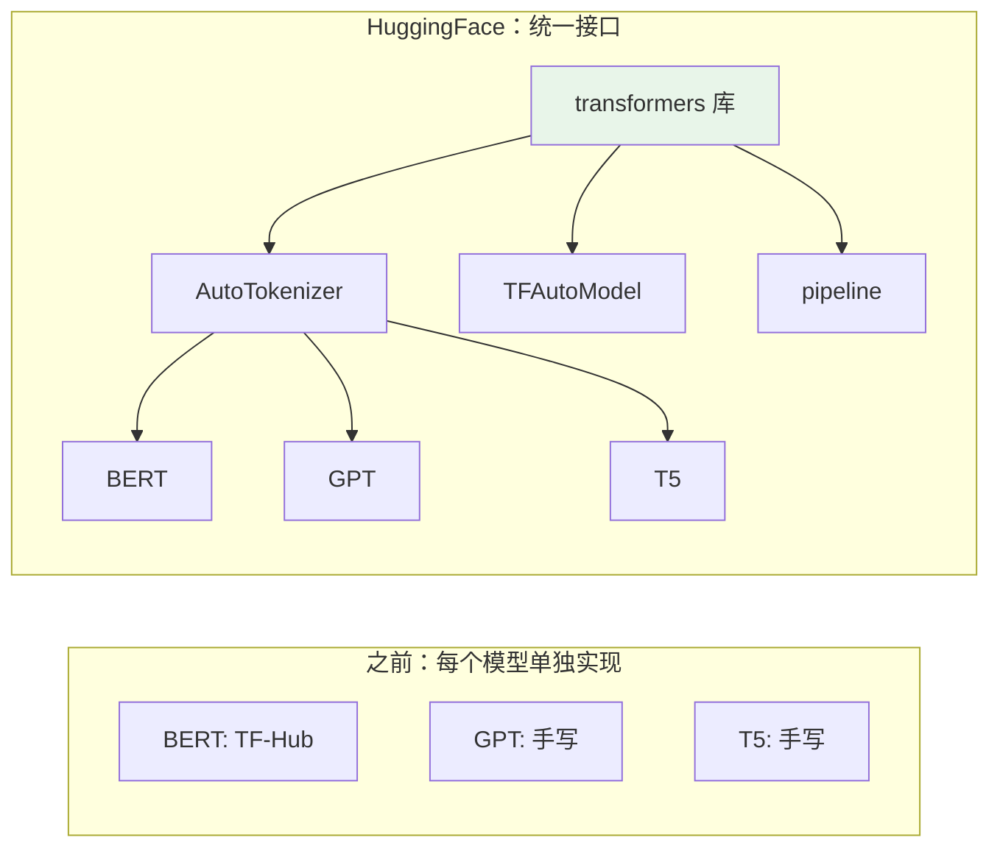
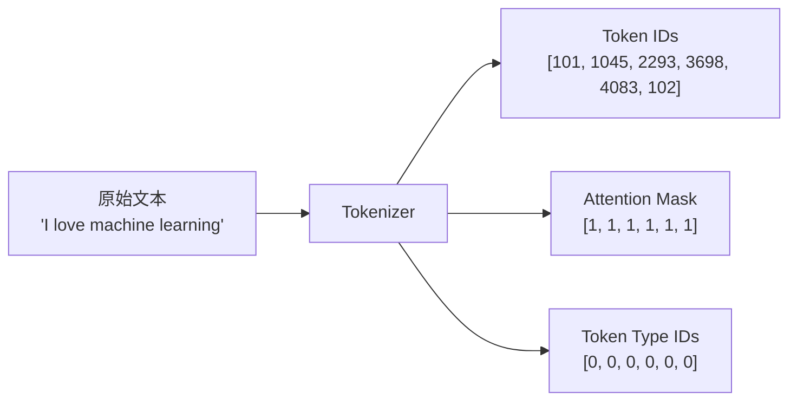

## 前置知识：为什么需要 HuggingFace

T5 你学了用 TF-Hub 加载 BERT，T6 你学了 GPT 架构。但实际工作中，你需要快速切换不同模型（BERT/GPT/T5/LLaMA），而不想每次重写加载代码。

**HuggingFace transformers 库**提供统一的 API：
- `AutoTokenizer`：统一的 Tokenizer 接口
- `TFAutoModel`：统一的模型加载接口
- `pipeline`：一行代码做推理



> [!important] HuggingFace 的核心价值
> 1. **统一 API**：换模型只改一行代码（`model_name`）
> 2. **社区生态**：30 万+ 预训练模型，覆盖 NLP/CV/音频
> 3. **开箱即用**：Tokenizer + Model + Pipeline 一站式
> 4. **TF 原生支持**：`TFAutoModel` 返回 Keras 模型

---

## 一、安装与基础

### 1.1 安装

> [!warning] 版本前提：transformers 必须 < 5.0
> transformers v5 已移除**全部** TF 模型（`TFAutoModel` 等类不存在），本篇代码必须用 `pip install "transformers<5"`（如 4.x 系列）。另注意：`peft` 是纯 PyTorch 实现、不支持 TF，TF 下做 LoRA 参见 [[T5-BERT 双向预训练与微调]] 的自研 `LoRADense`。

```bash
pip install "transformers<5" tensorflow tensorflow-text
```

> [!tip] tensorflow-text 的作用
> 部分 BERT 模型依赖 `tensorflow-text` 提供的 Tokenizer。不安装可能报错。

### 1.2 快速体验 Pipeline

```python
from transformers import pipeline

# ============================================
# Pipeline：一行代码做推理（最简单的用法）
# ============================================

# 情感分类
classifier = pipeline("sentiment-analysis")
result = classifier("I love machine learning!")
print(result)  # [{'label': 'POSITIVE', 'score': 0.9998}]

# 文本生成
generator = pipeline("text-generation")
text = generator("Once upon a time", max_length=50)
print(text[0]['generated_text'])

# 问答
qa = pipeline("question-answering")
answer = qa(question="What is TensorFlow?",
            context="TensorFlow is a machine learning framework.")
print(answer)  # {'answer': 'a machine learning framework', 'score': 0.95}

# 命名实体识别
ner = pipeline("ner", model="dslim/bert-base-NER")
for e in ner("John works at Google in New York."):
    print(f"{e['word']:15s} {e['entity']:10s} {e['score']:.4f}")

# 翻译
translator = pipeline("translation_en_to_zh",
                       model="Helsinki-NLP/opus-mt-en-zh")
print(translator("Machine learning is fascinating."))
```

> [!warning] Pipeline 的局限
> - **黑盒**：看不到中间层输出
> - **灵活性差**：不能自定义模型结构
> - **性能**：每次调用重新加载模型（生产环境应缓存）
>
> Pipeline 适合快速原型，生产环境用 `AutoModel` + 自定义训练循环。

---

## 二、Tokenizer 详解

### 2.1 Tokenizer 的作用



### 2.2 常用 Tokenizer 操作

```python
from transformers import AutoTokenizer

# 加载 BERT Tokenizer
tokenizer = AutoTokenizer.from_pretrained("bert-base-uncased")

# 编码单条文本
text = "I love machine learning!"
encoded = tokenizer(text)
print(f"input_ids: {encoded['input_ids']}")  # [101, 1045, 2293, 3698, 4083, 999, 102]

# 解码回文本
decoded = tokenizer.decode(encoded['input_ids'])
print(f"decoded: {decoded}")  # "[CLS] i love machine learning! [SEP]"

# 查看每个 token
tokens = tokenizer.tokenize(text)
print(f"tokens: {tokens}")  # ['i', 'love', 'machine', 'learning', '!']

# 查看 token → ID 映射
ids = tokenizer.convert_tokens_to_ids(tokens)
print(f"token IDs: {ids}")  # [1045, 2293, 3698, 4083, 999]
```

### 2.3 批量编码与填充

```python
texts = [
    "This is short.",
    "This is a much longer sentence with more words."
]

# 批量编码 + 填充到等长
encoded = tokenizer(texts, padding=True, truncation=True,
                    max_length=128, return_tensors="tf")

print(f"input_ids: {encoded['input_ids'].shape}")           # (2, 128)
print(f"attention_mask: {encoded['attention_mask'].shape}")  # (2, 128)
# 第一条短文本填充了很多 0（padding）
# attention_mask: 1=有效 token, 0=padding
```

### 2.4 分词方式对比

| 方式 | 示例 | 代表模型 |
|------|------|---------|
| Word-level | `machine` / `learning` | 早期模型 |
| BPE | `mach` / `ine` | GPT-2 |
| WordPiece | `mach` / `##ine` | BERT |
| SentencePiece | 子词单元 | T5/LLaMA |

### 2.5 特殊 Token

| Token | ID | 用途 |
|-------|-----|------|
| `[PAD]` | 0 | 填充到等长 |
| `[UNK]` | 100 | 未知词（词汇表外） |
| `[CLS]` | 101 | 句首标记（句子级表示） |
| `[SEP]` | 102 | 句尾/句子分隔 |
| `[MASK]` | 103 | MLM 遮盖（BERT 预训练） |

---

## 三、TFAutoModel 系列

### 3.1 基础模型加载

```python
from transformers import TFAutoModel, AutoTokenizer

model_name = "bert-base-uncased"
tokenizer = AutoTokenizer.from_pretrained(model_name)
model = TFAutoModel.from_pretrained(model_name)

text = "I love machine learning."
encoded = tokenizer(text, return_tensors="tf")
outputs = model(encoded)

print(f"last_hidden_state: {outputs.last_hidden_state.shape}")  # (1, seq, 768)
print(f"pooler_output:     {outputs.pooler_output.shape}")     # (1, 768)
# last_hidden_state: 每个 token 的表示
# pooler_output: [CLS] 的表示（BERT 特有，GPT 没有）
```

### 3.2 任务特定模型对照表

| 类 | 用途 | 输出 |
|---|------|------|
| `TFAutoModel` | 基础模型 | hidden_states |
| `TFAutoModelForSequenceClassification` | 文本分类 | logits |
| `TFAutoModelForTokenClassification` | NER | token logits |
| `TFAutoModelForQuestionAnswering` | 问答 | start/end logits |
| `TFAutoModelForCausalLM` | 文本生成（GPT） | next token logits |
| `TFAutoModelForSeq2SeqLM` | 翻译/摘要（T5/BART） | 目标序列 logits |

```python
from transformers import TFAutoModelForSequenceClassification

model = TFAutoModelForSequenceClassification.from_pretrained(
    "bert-base-uncased", num_labels=2
)

# 编译
model.compile(optimizer=tf.keras.optimizers.Adam(2e-5),
              loss=tf.keras.losses.SparseCategoricalCrossentropy(from_logits=True),
              metrics=['accuracy'])

encoded = tokenizer(["Positive text", "Negative text"],
                    padding=True, truncation=True, return_tensors="tf")
outputs = model(encoded)
print(f"logits: {outputs.logits.shape}")  # (2, 2)
```

> [!tip] 为什么用 from_logits=True？
> HuggingFace 模型输出的是 logits（未经 softmax），损失函数需要 `from_logits=True` 才能正确计算交叉熵。

### 3.3 常用模型速查

```python
# 英文 BERT
"bert-base-uncased"           # 12层, 768维, 110M
"bert-large-uncased"          # 24层, 1024维, 340M
"distilbert-base-uncased"     # 6层, 768维, 66M (蒸馏)

# 中文 BERT
"bert-base-chinese"           # 中文版
"hfl/chinese-roberta-wwm-ext" # 中文 RoBERTa (推荐)

# GPT
"gpt2"                        # 12层, 768维, 124M
"gpt2-medium"                 # 24层, 1024维, 355M

# T5（Encoder-Decoder）
"t5-small"                    # 60M
"t5-base"                     # 220M

# 其他
"facebook/bart-large"         # BART (Encoder-Decoder)
"google/electra-base-discriminator"  # ELECTRA
```

> [!important] TF vs PyTorch 模型
> 有些模型只有 PyTorch 版，需要 `from_pt=True` 转换：
> ```python
> model = TFAutoModel.from_pretrained("some-pytorch-model", from_pt=True)
> ```

---

## 四、微调完整流程

### 4.1 文本分类微调（IMDB）

```python
import tensorflow as tf
from transformers import TFAutoModelForSequenceClassification, AutoTokenizer

# ============================================
# 步骤 1：加载模型和 Tokenizer
# ============================================
model_name = "distilbert-base-uncased"  # 用 DistilBERT 更快
num_labels = 2

tokenizer = AutoTokenizer.from_pretrained(model_name)
model = TFAutoModelForSequenceClassification.from_pretrained(
    model_name, num_labels=num_labels
)

# ============================================
# 步骤 2：加载并预处理数据
# ============================================
(x_train, y_train), (x_test, y_test) = tf.keras.datasets.imdb.load_data(num_words=10000)

# IMDB 数据是整数序列，需要反编码
word_index = tf.keras.datasets.imdb.get_word_index()
reverse_index = {v+3: k for k, v in word_index.items()}
reverse_index[0] = "<PAD>"
reverse_index[1] = "<START>"
reverse_index[2] = "<UNK>"

def decode_review(encoded):
    return " ".join([reverse_index.get(i, "?") for i in encoded])

# 转为文本（取子集快速实验）
train_texts = [decode_review(x[:200]) for x in x_train[:2000]]
test_texts = [decode_review(x[:200]) for x in x_test[:500]]
train_labels = y_train[:2000]
test_labels = y_test[:500]

# Tokenize
train_encodings = tokenizer(train_texts, truncation=True, padding=True,
                            max_length=128, return_tensors="tf")
test_encodings = tokenizer(test_texts, truncation=True, padding=True,
                           max_length=128, return_tensors="tf")

# ============================================
# 步骤 3：构建 tf.data.Dataset
# ============================================
train_ds = tf.data.Dataset.from_tensor_slices((
    dict(train_encodings), train_labels
)).shuffle(1000).batch(16).prefetch(tf.data.AUTOTUNE)

test_ds = tf.data.Dataset.from_tensor_slices((
    dict(test_encodings), test_labels
)).batch(16).prefetch(tf.data.AUTOTUNE)

# ============================================
# 步骤 4：编译模型
# ============================================
optimizer = tf.keras.optimizers.Adam(learning_rate=2e-5)
loss = tf.keras.losses.SparseCategoricalCrossentropy(from_logits=True)
model.compile(optimizer=optimizer, loss=loss, metrics=['accuracy'])

# ============================================
# 步骤 5：训练
# ============================================
history = model.fit(
    train_ds,
    validation_data=test_ds,
    epochs=3,
    callbacks=[tf.keras.callbacks.EarlyStopping(patience=1, restore_best_weights=True)]
)

# ============================================
# 步骤 6：评估与保存
# ============================================
loss_val, acc = model.evaluate(test_ds)
print(f"Test accuracy: {acc:.4f}")  # 应该 > 0.90

model.save_pretrained("my_bert_classifier")
tokenizer.save_pretrained("my_bert_classifier")
```

> [!important] 微调五步法
> 1. 加载 `AutoTokenizer` + `TFAutoModel`
> 2. Tokenize 数据（padding + truncation）
> 3. 构建 `tf.data.Dataset`
> 4. 编译（学习率 2e-5~5e-5）
> 5. 训练（3~5 epoch，EarlyStopping）

### 4.2 微调注意事项

| 项目 | 建议 |
|------|------|
| 学习率 | 2e-5 ~ 5e-5（太大会灾难遗忘） |
| Epochs | 3~5（太多会过拟合） |
| Batch size | 8~32（取决于 GPU 显存） |
| Warmup | 可选（小数据集不需要） |
| 权重衰减 | 0.01（防止过拟合） |
| 模型选择 | DistilBERT（快速原型）/ RoBERTa（最佳效果） |

---

## 五、LoRA：参数高效微调

```python
# ============================================
# 重要：peft（LoraConfig / get_peft_model）是纯 PyTorch 实现，不支持 TF——
# 对 TFAutoModel 模型调用 get_peft_model 会直接报错。
# TF 下需自研 LoRA 层：参见 [[T5-BERT 双向预训练与微调]] §七 的 LoRADense——
# 冻结原始权重 W，旁路训练低秩 ΔW = A×B，输出 x·W + x·A·B
# ============================================

from transformers import TFAutoModelForSequenceClassification

# TF 下的等效做法：冻结主干，只训练分类头（LoRA 旁路按 T5 的 LoRADense 自行挂载）
model = TFAutoModelForSequenceClassification.from_pretrained(
    "bert-base-uncased", num_labels=2
)
model.trainable = False            # 冻结 BERT 主干
model.classifier.trainable = True  # 只训练分类头
# 更进一步：按 T5 的 LoRADense 把主干中的投影 Dense 替换为
# "冻结 W + 低秩 A×B 旁路"（r=8 时每层只新增 2×d×r 参数）
```

> [!important] LoRA 的三大优势
> 1. **省显存**：只训练 0.1%~1% 的参数
> 2. **可插拔**：不同任务用不同 LoRA 权重，共用一个基础模型
> 3. **无推理延迟**：训练后 `W' = W + A×B` 合并，推理时和全参数一样

| 方法 | 参数量 | 显存 | 训练时间 | 效果 |
|------|--------|------|---------|------|
| 全参数微调 | 110M | 16GB+ | 慢 | 最佳 |
| LoRA (r=8) | ~1M | 8GB | 快 | 接近全参数 |
| 冻结+分类头 | <1% | 低 | 最快 | 一般 |

---

## 六、自定义训练循环

### 6.1 为什么需要自定义训练循环

`model.fit()` 是高层 API，但有时你需要：
- 自定义损失函数（如 Focal Loss）
- 梯度累积（小显存训练大 batch）
- 混合精度训练
- 复杂的学习率调度

### 6.2 实现

```python
import tensorflow as tf

optimizer = tf.keras.optimizers.Adam(learning_rate=2e-5)
loss_fn = tf.keras.losses.SparseCategoricalCrossentropy(from_logits=True)

@tf.function
def train_step(batch):
    """单步训练"""
    inputs, labels = batch
    with tf.GradientTape() as tape:
        outputs = model(inputs, training=True)
        loss = loss_fn(labels, outputs.logits)
    gradients = tape.gradient(loss, model.trainable_variables)
    optimizer.apply_gradients(zip(gradients, model.trainable_variables))
    return loss

# 训练循环
for epoch in range(3):
    for batch in train_ds:
        loss = train_step(batch)
    print(f"Epoch {epoch+1}, Loss: {loss.numpy():.4f}")
```

> [!tip] 梯度累积
> 显存不够时，可以累积多个小 batch 的梯度，等效大 batch 训练：
> ```python
> accumulation_steps = 4
> for i, batch in enumerate(train_ds):
>     with tf.GradientTape() as tape:
>         outputs = model(batch[0], training=True)
>         loss = loss_fn(batch[1], outputs.logits) / accumulation_steps
>     gradients = tape.gradient(loss, model.trainable_variables)
>     # 累积梯度，每 accumulation_steps 步才 apply
> ```
> 详见分布式训练路径 D5。

---

## 七、模型保存与部署

### 7.1 HuggingFace 格式

```python
# 保存
model.save_pretrained("./my_model")
tokenizer.save_pretrained("./my_model")

# 加载
loaded_model = TFAutoModelForSequenceClassification.from_pretrained("./my_model")
loaded_tokenizer = AutoTokenizer.from_pretrained("./my_model")
```

### 7.2 转换为 SavedModel（用于 TF Serving）

```python
model.save("saved_model")
loaded = tf.keras.models.load_model("saved_model")
```

### 7.3 上传到 HuggingFace Hub

```python
# 需要先登录：huggingface-cli login
model.push_to_hub("my-model-name")
tokenizer.push_to_hub("my-model-name")
# 其他人可以加载：
# model = TFAutoModel.from_pretrained("username/my-model-name")
```

---

## 八、datasets 库：数据集加载

```python
from datasets import load_dataset

# 加载 IMDB
dataset = load_dataset("imdb", split="train[:1000]")
print(f"数据集大小: {len(dataset)}")

# Tokenize
def tokenize_fn(examples):
    return tokenizer(examples["text"], truncation=True, padding=True, max_length=128)

tokenized = dataset.map(tokenize_fn, batched=True)

# 转为 TF Dataset
tf_dataset = tokenized.to_tf_dataset(
    columns=["input_ids", "attention_mask"],
    label_cols=["label"],
    batch_size=16,
    shuffle=True
)
```

---

## 九、常见误区

| # | 误区 | 正确理解 |
|---|------|---------|
| 1 | HuggingFace 只能用 PyTorch | TF 原生支持，`TFAutoModel` 返回 Keras 模型 |
| 2 | Pipeline 适合生产 | Pipeline 适合原型，生产用 `AutoModel` + 自定义循环 |
| 3 | Tokenizer 可以混用 | 每个模型有专用 Tokenizer，混用会报错 |
| 4 | 微调学习率可以大 | 必须 2e-5~5e-5，太大会灾难遗忘 |
| 5 | LoRA 效果差很多 | LoRA 在低秩假设下效果接近全参数微调 |
| 6 | 保存模型只需 model.save() | 还需 `tokenizer.save_pretrained()`，否则无法加载 |
| 7 | 所有模型都有 TF 版 | 部分模型只有 PyTorch 版，需 `from_pt=True` |

---

## 十、练习

### 🟢 练习 1：Pipeline 快速体验（10 分钟）

**题目**：用 `pipeline("sentiment-analysis")` 分类 5 条不同情感的文本。

<details>
<summary>📝 参考答案</summary>

```python
from transformers import pipeline

classifier = pipeline("sentiment-analysis")
texts = [
    "I love this product!",
    "This is terrible.",
    "It's okay, not great.",
    "Amazing experience!",
    "Worst thing ever."
]
results = classifier(texts)
for text, result in zip(texts, results):
    print(f"{text[:30]:30s} → {result['label']} ({result['score']:.4f})")
```

</details>

**验收标准**：5 条文本都正确分类。

---

### 🟡 练习 2：用 DistilBERT 微调 IMDB（30 分钟）

**题目**：用 `distilbert-base-uncased` 微调 IMDB 情感分类，3 epoch 后验证准确率 > 90%。

<details>
<summary>📝 参考答案</summary>

参考第四节"微调完整流程"的代码，`model_name` 用 `"distilbert-base-uncased"`。DistilBERT 只有 66M 参数，训练更快。

</details>

**验收标准**：验证准确率 > 90%。

---

### 🔴 练习 3：用 LoRA 微调并对比（40 分钟）

**题目**：冻结 BERT 全部权重，只训练 LoRA 适配矩阵，对比与全参数微调的可训练参数量。

<details>
<summary>📝 参考答案</summary>

```python
# 注意：peft 不支持 TF（纯 PyTorch 实现），不能用 LoraConfig/get_peft_model
# TF 做法：冻结主干 + 分类头可训练，再按 T5 的 LoRADense 挂低秩旁路
import tensorflow as tf
from transformers import TFAutoModelForSequenceClassification

model = TFAutoModelForSequenceClassification.from_pretrained(
    "bert-base-uncased", num_labels=2)
model.trainable = False
model.classifier.trainable = True

trainable = sum(int(tf.reduce_prod(v.shape)) for v in model.trainable_variables)
total = sum(int(tf.reduce_prod(v.shape)) for v in model.variables)
print(f"可训练参数: {trainable:,} / {total:,} = {trainable/total:.1%}")
# 冻结主干 + 分类头 ≈ 0.002%；按 T5 的 LoRADense 挂 r=8 旁路也仅 ~1%
```

</details>

**验收标准**：可训练参数 < 1% 总参数。

---

## 十一、本章小结

| 概念 | 关键点 |
|------|--------|
| HuggingFace 价值 | 统一 API + 社区生态 + TF 原生支持 |
| Tokenizer | 文本 → Token IDs + Attention Mask |
| TFAutoModel | 加载基础模型（无任务头） |
| TFAutoModelForXxx | 加载任务特定模型（分类/NER/QA/生成） |
| Pipeline | 一行代码做推理（适合原型） |
| 微调五步法 | 加载 → Tokenize → Dataset → Compile → Fit |
| 学习率 | 2e-5~5e-5（太大会灾难遗忘） |
| LoRA | 低秩适配，参数减少 98%+ |
| 保存 | `save_pretrained()` 保存模型 + Tokenizer |

**Phase 2 完结！** 你现在能用 HuggingFace 加载和微调任何预训练模型。

**下一篇**：[[T8-视觉 Transformer ViT]] — Transformer 不只能处理文本，还能处理图像。

---

*前置：[[T5-BERT 双向预训练与微调]] / [[T6-GPT 自回归生成]]*
*后续：[[T8-视觉 Transformer ViT]]*