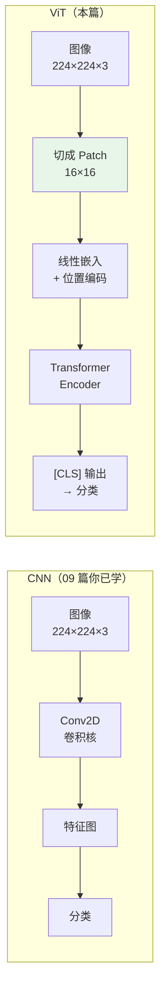
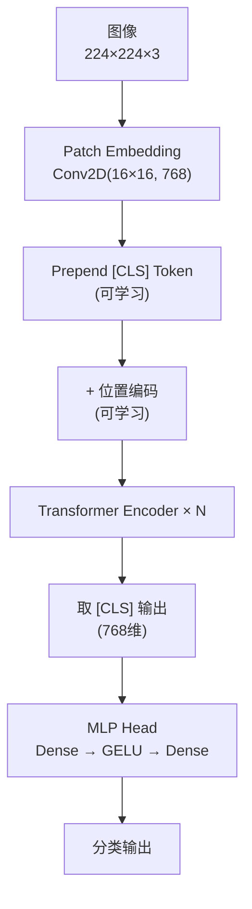
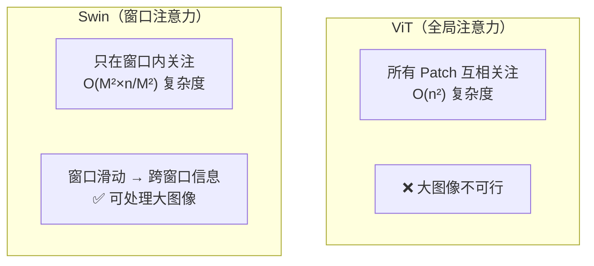
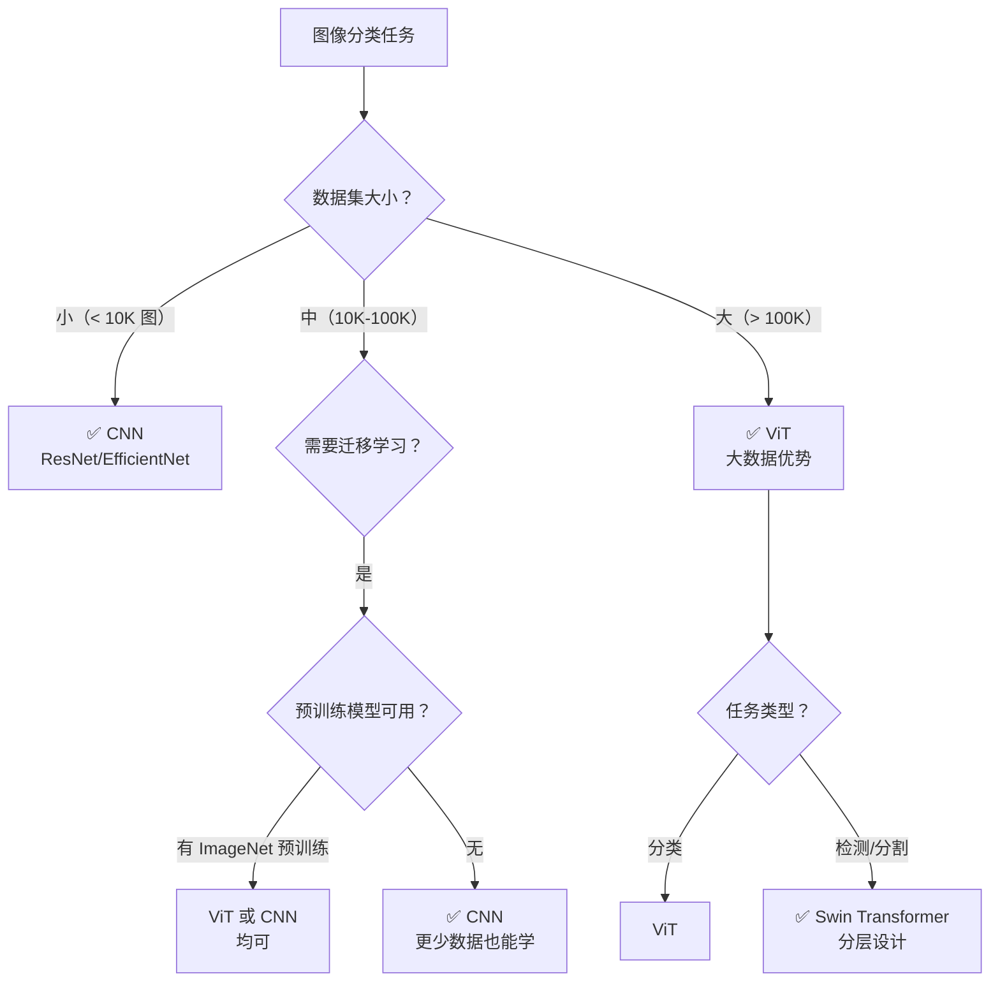

## 前置知识：Transformer 从 NLP 到 CV

T1-T7 你学了 Transformer 处理文本。**ViT（Vision Transformer, 2020）把这个架构搬到图像**——不再用卷积，而是把图像切成 Patch，当序列用 Transformer 处理。



> [!important] ViT 的核心洞察
> 图像可以像文本一样用序列模型处理。关键步骤：**把 224×224 图像切成 14×14=196 个 Patch，每个 Patch 16×16×3=768 维**——正好是 BERT 的标准维度。

---

## 一、Patch Embedding：图像变序列

### 1.1 切 Patch

```python
import tensorflow as tf
import numpy as np

class PatchEmbedding(tf.keras.layers.Layer):
    """
    把图像切成 Patch 并线性嵌入

    用 Conv2D 一步完成切 Patch + 线性嵌入：
    kernel_size = stride = patch_size → 不重叠的 Patch
    """
    def __init__(self, patch_size=16, embed_dim=768, **kwargs):
        super().__init__(**kwargs)
        self.patch_size = patch_size
        self.embed_dim = embed_dim
        self.proj = tf.keras.layers.Conv2D(
            filters=embed_dim,
            kernel_size=patch_size,
            strides=patch_size,
            padding="valid",
            name="patch_projection"
        )

    def call(self, images):
        # images: (batch, H, W, C) → (batch, num_patches, embed_dim)
        x = self.proj(images)  # (batch, H/patch, W/patch, embed_dim)
        x = tf.reshape(x, [tf.shape(x)[0], -1, self.embed_dim])
        return x

# 测试
patch_embed = PatchEmbedding(patch_size=16, embed_dim=768)
images = tf.random.normal((2, 224, 224, 3))
patches = patch_embed(images)
print(f"图像: {images.shape} → Patches: {patches.shape}")
# (2, 224, 224, 3) → (2, 196, 768)
# 224/16 = 14, 14×14 = 196 个 Patch
```

> [!tip] 为什么用 Conv2D 做 Patch?
> 1. **效率**：一步完成切 Patch + 线性变换
> 2. **可学习**：Conv2D 的权重可训练
> 3. **等价**：16×16×3=768 维 Patch 投影到 768 维嵌入

### 1.2 与 CNN 的认知桥梁

| 概念 | CNN | ViT |
|------|-----|-----|
| 输入处理 | 卷积核逐位置滑动 | 切成不重叠的 Patch |
| 特征提取 | 多层 Conv2D + Pooling | Transformer Encoder |
| 局部 vs 全局 | 局部（卷积核小） | 全局（Attention 全连接） |
| 小数据效果 | ✅ 好 | ❌ 差（需 ImageNet 级别） |
| 大数据效果 | 遇到瓶颈 | ✅ 超越 CNN |

---

## 二、ViT 完整架构

### 2.1 结构



### 2.2 实现

```python
import tensorflow as tf

class ViTBlock(tf.keras.layers.Layer):
    """ViT 用的 Transformer Encoder Block（Pre-LN）"""
    def __init__(self, embed_dim, num_heads, mlp_dim, dropout_rate=0.1, **kwargs):
        super().__init__(**kwargs)
        self.ln1 = tf.keras.layers.LayerNormalization(epsilon=1e-6)
        self.mha = tf.keras.layers.MultiHeadAttention(
            num_heads=num_heads, key_dim=embed_dim // num_heads,
            dropout=dropout_rate
        )
        self.ln2 = tf.keras.layers.LayerNormalization(epsilon=1e-6)
        self.mlp = tf.keras.Sequential([
            tf.keras.layers.Dense(mlp_dim, activation='gelu'),
            tf.keras.layers.Dropout(dropout_rate),
            tf.keras.layers.Dense(embed_dim),
            tf.keras.layers.Dropout(dropout_rate)
        ])

    def call(self, x, training=False):
        # Pre-LN Self-Attention + 残差
        ln_x = self.ln1(x)
        x = x + self.mha(ln_x, ln_x, ln_x, training=training)
        # Pre-LN MLP + 残差
        ln_x = self.ln2(x)
        x = x + self.mlp(ln_x, training=training)
        return x


class VisionTransformer(tf.keras.Model):
    """
    完整 ViT 模型

    参数:
        image_size: 图像尺寸（默认 224）
        patch_size: Patch 大小（默认 16）
        num_layers: Transformer 层数
        embed_dim: 嵌入维度
        num_heads: 注意力头数
        mlp_dim: MLP 隐藏层
        num_classes: 分类数
    """
    def __init__(self, image_size=224, patch_size=16, num_layers=12,
                 embed_dim=768, num_heads=12, mlp_dim=3072,
                 num_classes=1000, dropout_rate=0.1, **kwargs):
        super().__init__(**kwargs)
        self.num_patches = (image_size // patch_size) ** 2  # 196
        self.embed_dim = embed_dim

        # Patch Embedding
        self.patch_embed = PatchEmbedding(patch_size, embed_dim)

        # [CLS] Token（可学习）
        self.cls_token = self.add_weight(
            name="cls_token",
            shape=(1, 1, embed_dim),
            initializer="glorot_uniform",
            trainable=True
        )

        # 位置编码（可学习）
        self.pos_embed = self.add_weight(
            name="pos_embed",
            shape=(1, self.num_patches + 1, embed_dim),  # +1 for [CLS]
            initializer="glorot_uniform",
            trainable=True
        )

        # N 个 Transformer Block
        self.blocks = [
            ViTBlock(embed_dim, num_heads, mlp_dim, dropout_rate)
            for _ in range(num_layers)
        ]

        self.ln = tf.keras.layers.LayerNormalization(epsilon=1e-6)
        self.head = tf.keras.layers.Dense(num_classes)
        self.dropout = tf.keras.layers.Dropout(dropout_rate)

    def call(self, x, training=False):
        batch_size = tf.shape(x)[0]

        # 1. Patch Embedding
        x = self.patch_embed(x)  # (batch, 196, 768)

        # 2. Prepend [CLS] Token
        cls_tokens = tf.broadcast_to(
            self.cls_token, [batch_size, 1, self.embed_dim]
        )
        x = tf.concat([cls_tokens, x], axis=1)  # (batch, 197, 768)

        # 3. 加位置编码
        x = x + self.pos_embed
        x = self.dropout(x, training=training)

        # 4. N 个 Transformer Block
        for block in self.blocks:
            x = block(x, training=training)

        # 5. 取 [CLS] 输出 → 分类
        x = self.ln(x)
        cls_output = x[:, 0, :]  # (batch, 768)
        return self.head(cls_output)

# 测试：微型 ViT
vit = VisionTransformer(
    image_size=224, patch_size=16,
    num_layers=4, embed_dim=128, num_heads=4, mlp_dim=256,
    num_classes=10
)
x = tf.random.normal((2, 224, 224, 3))
out = vit(x, training=False)
print(f"ViT output: {out.shape}")  # (2, 10)
print(f"参数量: {vit.count_params():,}")
```

### 2.3 ViT 规格参考

| 模型 | 层数 | d_model | 头数 | MLP | 参数量 |
|------|------|---------|------|-----|--------|
| ViT-S | 12 | 384 | 6 | 1536 | 22M |
| ViT-B | 12 | 768 | 12 | 3072 | 86M |
| ViT-L | 24 | 1024 | 16 | 4096 | 307M |
| ViT-H | 32 | 1280 | 16 | 5120 | 632M |

> [!tip] ViT 需要 ImageNet 级别的大数据
> ViT 在小数据集（< 1000 类）上效果不如 CNN。原始论文先在 JFT-300M（3 亿张图）上预训练再迁移。在 ImageNet 上从零训练效果不如 ResNet。

---

## 三、Swin Transformer：分层视觉 Transformer

### 3.1 ViT 的问题

ViT 的 Attention 复杂度是 O(n²)，n = patch 数量：
- 224×224 图像，patch_size=16 → 196 个 patch → 可接受
- 384×384 图像 → 576 个 patch → O(576²) ≈ 33 万次计算
- 更大图像 → 不可接受

### 3.2 Swin 的解决方案：窗口注意力



```python
class WindowAttention(tf.keras.layers.Layer):
    """
    Swin 的窗口注意力：只在局部窗口内做 Attention
    大幅降低计算复杂度
    """
    def __init__(self, embed_dim, num_heads, window_size=7, **kwargs):
        super().__init__(**kwargs)
        self.window_size = window_size
        self.mha = tf.keras.layers.MultiHeadAttention(
            num_heads=num_heads, key_dim=embed_dim // num_heads
        )

    def call(self, x):
        # x: (batch, H, W, C)
        batch, H, W, C = x.shape
        # 把图像切成 window_size×window_size 的窗口
        # 在每个窗口内做 Self-Attention
        x_windows = tf.reshape(x, [
            batch, H // self.window_size, self.window_size,
            W // self.window_size, self.window_size, C
        ])
        # 合并窗口维度到 batch 维度
        x_windows = tf.transpose(x_windows, [0, 1, 3, 2, 4, 5])
        x_windows = tf.reshape(x_windows, [-1, self.window_size**2, C])
        # 窗口内 Attention
        attn_out = self.mha(x_windows, x_windows, x_windows)
        # 恢复原始形状
        attn_out = tf.reshape(attn_out, [
            batch, H // self.window_size, W // self.window_size,
            self.window_size, self.window_size, C
        ])
        attn_out = tf.transpose(attn_out, [0, 1, 3, 2, 4, 5])
        return tf.reshape(attn_out, [batch, H, W, C])
```

> [!tip] Swin 的两个关键设计
> 1. **窗口注意力**：只在 7×7 窗口内做 Attention，复杂度从 O(n²) 降到 O(n)
> 2. **移位窗口**：交替层把窗口偏移半个窗口，实现跨窗口信息传递
>
> Swin 是分层架构（像 CNN 一样有多个 stage，逐步降分辨率），适合检测/分割等密集预测任务。

---

## 四、用 HuggingFace 加载预训练 ViT

```python
from transformers import TFViTForImageClassification, ViTFeatureExtractor
import tensorflow as tf

# ============================================
# 加载预训练 ViT（ImageNet-21k 预训练）
# ============================================
model_name = "google/vit-base-patch16-224"
feature_extractor = ViTFeatureExtractor.from_pretrained(model_name)
model = TFViTForImageClassification.from_pretrained(model_name)

# 推理
from PIL import Image
import numpy as np

# 创建一个测试图像
image = Image.fromarray(
    (np.random.rand(224, 224, 3) * 255).astype(np.uint8)
)

# 预处理
inputs = feature_extractor(images=image, return_tensors="tf")
print(f"pixel_values: {inputs['pixel_values'].shape}")  # (1, 3, 224, 224)

# 推理
outputs = model(inputs)
print(f"logits: {outputs.logits.shape}")  # (1, 1000)

# Top-5 预测
predicted_classes = tf.nn.softmax(outputs.logits, axis=-1)
top5 = tf.argsort(predicted_classes[0], direction='DESCENDING')[:5]
for idx in top5:
    print(f"  {model.config.id2label[idx.numpy()]}: {predicted_classes[0][idx]:.4f}")
```

> [!tip] ViT 与 CNN 迁移学习对比
> | 步骤 | CNN（09 篇） | ViT |
> |------|-------------|-----|
> | 输入预处理 | resize + normalize | resize + normalize（相同） |
> | 冻结骨干 | `base_model.trainable = False` | 同 |
> | 分类头 | `Dense(num_classes)` | 同 |
> | 微调 | 解冻最后几层 | 同 |
>
> 你在 09 篇学的 ResNet50 迁移学习流程，换骨干为 ViT 即可。

---

## 五、ViT vs CNN 选型决策



| 场景 | 推荐 | 原因 |
|------|------|------|
| 小数据集分类 | CNN | ViT 缺少归纳偏置，小数据过拟合 |
| 大数据集分类 | ViT | 大数据上 ViT 超越 CNN |
| 目标检测/分割 | Swin | 分层设计 + 窗口注意力，适合密集预测 |
| 移动端部署 | CNN (MobileNet) | ViT 计算量大，不适合移动端 |
| 有预训练模型 | 两者均可 | 迁移学习弥合差距 |

> [!important] 关键区别
> CNN 有**归纳偏置**（局部性 + 平移不变性），所以小数据也能学。ViT 没有归纳偏置，像一张白纸，需要大数据来学习这些规律。这是 ViT 在小数据上不如 CNN 的根本原因。

---

## 六、常见误区

| # | 误区 | 正确理解 |
|---|------|---------|
| 1 | ViT 比 CNN 好 | ViT 需要大数据，小数据上 CNN 更好 |
| 2 | ViT 用卷积就不是 Transformer | Patch Embedding 用 Conv2D 只是高效实现，模型核心仍是 Attention |
| 3 | ViT 适合所有 CV 任务 | 分类适合，检测/分割用 Swin 更好 |
| 4 | Patch 越小越好 | Patch 越小序列越长，Attention O(n²) 越大 |
| 5 | ViT 不需要数据增强 | ViT 没有归纳偏置，比 CNN 更需要数据增强 |
| 6 | Swin 就是 ViT 加窗口 | Swin 是分层架构（多 stage），ViT 是单尺度 |
| 7 | 图像分类只能用 CNN | ViT 在 ImageNet 上已超越 CNN |

---

## 七、练习

### 🟢 练习 1：实现 Patch Embedding（10 分钟）

**题目**：实现 `PatchEmbedding`，把 224×224×3 图像变成 196 个 768 维 patch。

<details>
<summary>📝 参考答案</summary>

```python
patch_embed = PatchEmbedding(patch_size=16, embed_dim=768)
images = tf.random.normal((2, 224, 224, 3))
patches = patch_embed(images)
print(f"Patches: {patches.shape}")  # (2, 196, 768)
# 224/16=14, 14×14=196
```

</details>

**验收标准**：输出 (2, 196, 768)。

---

### 🟡 练习 2：构建微型 ViT 做分类（25 分钟）

**题目**：用上面的 `VisionTransformer` 类构建一个 4 层微型 ViT（d_model=128），在 CIFAR-10 上训练。

<details>
<summary>📝 参考答案</summary>

```python
import tensorflow as tf

# 加载 CIFAR-10
(x_train, y_train), (x_test, y_test) = tf.keras.datasets.cifar10.load_data()

# 归一化
x_train = tf.image.resize(x_train, (64, 64)) / 255.0  # 缩小到 64×64 加速
x_test = tf.image.resize(x_test, (64, 64)) / 255.0

# 微型 ViT（64×64 图像, patch=8 → 64 个 patch）
vit = VisionTransformer(
    image_size=64, patch_size=8,
    num_layers=4, embed_dim=128, num_heads=4, mlp_dim=256,
    num_classes=10
)
vit.compile(optimizer='adam', loss='sparse_categorical_crossentropy',
            metrics=['accuracy'])
vit.fit(x_train, y_train, validation_data=(x_test, y_test),
        epochs=10, batch_size=32)
```

</details>

**验收标准**：模型能训练，验证准确率 > 50%。

---

### 🔴 练习 3：加载预训练 ViT 做推理（40 分钟）

**题目**：用 HuggingFace 加载 `google/vit-base-patch16-224`，对真实图片做 ImageNet 分类，并对比 ResNet50（09 篇）的结果。

<details>
<summary>📝 参考答案</summary>

```python
from transformers import TFViTForImageClassification, ViTFeatureExtractor
from PIL import Image
import numpy as np

# 加载 ViT
feature_extractor = ViTFeatureExtractor.from_pretrained("google/vit-base-patch16-224")
vit_model = TFViTForImageClassification.from_pretrained("google/vit-base-patch16-224")

# 加载图片
image = Image.open("test_image.jpg").resize((224, 224))
inputs = feature_extractor(images=image, return_tensors="tf")
outputs = vit_model(inputs)
top5 = tf.argsort(tf.nn.softmax(outputs.logits, axis=-1)[0], direction='DESCENDING')[:5]
print("ViT Top-5:")
for idx in top5:
    print(f"  {vit_model.config.id2label[idx.numpy()]}")

# 对比：ResNet50（09 篇的方法）
resnet = tf.keras.applications.ResNet50(weights='imagenet')
x = tf.keras.applications.resnet.preprocess_input(
    np.expand_dims(np.array(image.resize((224, 224))), 0)
)
resnet_pred = resnet.predict(x)
print("\nResNet50 Top-5:")
# decode_predictions 直接返回 [(class_id, name, score), ...]，遍历即可
# （不要用 logits 的类别下标去索引这个列表，会越界）
for class_id, name, score in tf.keras.applications.resnet.decode_predictions(resnet_pred, top=5)[0]:
    print(f"  {name}: {score:.4f}")
```

</details>

**验收标准**：两个模型都能给出合理的 ImageNet 分类。

---

## 八、本章小结

| 概念 | 关键点 |
|------|--------|
| Patch Embedding | Conv2D(kernel=stride=patch_size) 一步切 Patch + 嵌入 |
| [CLS] Token | 可学习的额外 token，用于分类 |
| 位置编码 | 可学习，shape=(num_patches+1, embed_dim) |
| ViT Block | Pre-LN Self-Attention + Pre-LN MLP + 残差 |
| GELU | ViT 用 GELU（比 ReLU 更平滑） |
| 归纳偏置 | CNN 有（局部性+平移不变性），ViT 无 → 小数据 ViT 差 |
| Swin | 窗口注意力 + 移位窗口，分层架构，适合密集预测 |
| 选型决策 | 小数据→CNN，大数据→ViT，检测/分割→Swin |

**下一篇**：[[T9-Transformer 项目实战]] — 把 T1-T8 串起来，做端到端项目。

---

*前置：[[T7-HuggingFace + TensorFlow 实战]]*
*后续：[[T9-Transformer 项目实战]]*