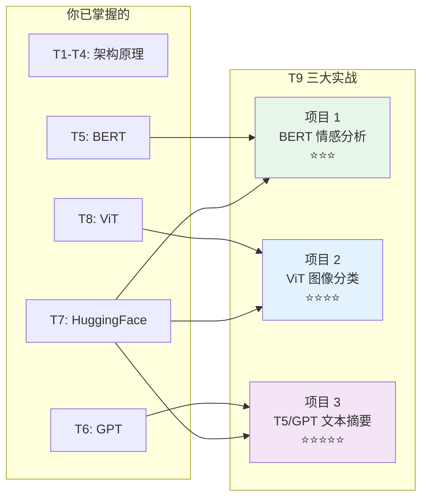
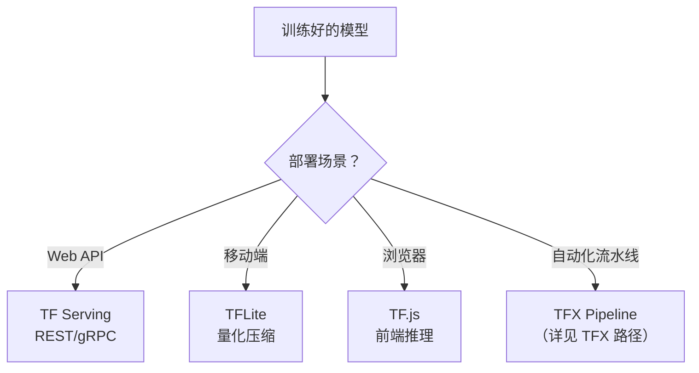

## 前置知识：把零件组装成产品

T1-T8 你学了 Transformer 的全部理论和工具：



> [!important] 三个项目的递进
> - **项目 1（⭐⭐⭐）**：微调 BERT 做理解任务——最基础
> - **项目 2（⭐⭐⭐⭐）**：ViT 迁移学习做图像分类——跨模态
> - **项目 3（⭐⭐⭐⭐⭐）**：T5 微调 + GPT 零样本做生成——最复杂

---

## 项目 1：BERT 情感分析（⭐⭐⭐）

### 业务背景

对 IMDB 电影评论做情感分析（正面/负面），用 DistilBERT 微调。

### 所用知识

- T5（BERT 预训练与微调）
- T7（HuggingFace + TF 实战微调五步法）

### 完整代码

```python
"""
项目 1: BERT 情感分析
目标: IMDB 评论二分类（准确率 > 90%）
模型: distilbert-base-uncased（66M 参数，训练快）
"""
import tensorflow as tf
from transformers import TFAutoModelForSequenceClassification, AutoTokenizer
from datasets import load_dataset

# ============================================
# Step 1: 加载数据
# ============================================
dataset = load_dataset("imdb", split="train[:3000]")
dataset = dataset.train_test_split(test_size=0.2, seed=42)

# ============================================
# Step 2: 加载模型和 Tokenizer（微调五步法 Step 1-2）
# ============================================
model_name = "distilbert-base-uncased"
tokenizer = AutoTokenizer.from_pretrained(model_name)
model = TFAutoModelForSequenceClassification.from_pretrained(
    model_name, num_labels=2
)

# ============================================
# Step 3: Tokenize（Step 3）
# ============================================
def tokenize_fn(examples):
    return tokenizer(
        examples["text"], truncation=True,
        padding="max_length", max_length=256
    )

train_tokenized = dataset["train"].map(tokenize_fn, batched=True)
test_tokenized = dataset["test"].map(tokenize_fn, batched=True)

# 转为 TF Dataset
train_ds = train_tokenized.to_tf_dataset(
    columns=["input_ids", "attention_mask"],
    label_cols=["label"],
    batch_size=16, shuffle=True
)
test_ds = test_tokenized.to_tf_dataset(
    columns=["input_ids", "attention_mask"],
    label_cols=["label"],
    batch_size=16, shuffle=False
)

# ============================================
# Step 4: 编译与训练（Step 4-5）
# ============================================
model.compile(
    optimizer=tf.keras.optimizers.Adam(2e-5),
    loss=tf.keras.losses.SparseCategoricalCrossentropy(from_logits=True),
    metrics=["accuracy"]
)

history = model.fit(
    train_ds,
    validation_data=test_ds,
    epochs=3,
    callbacks=[
        tf.keras.callbacks.EarlyStopping(
            patience=1, restore_best_weights=True
        )
    ]
)

# ============================================
# Step 5: 评估与保存
# ============================================
loss, acc = model.evaluate(test_ds)
print(f"\n✅ Test accuracy: {acc:.4f}")

model.save_pretrained("./imdb_bert")
tokenizer.save_pretrained("./imdb_bert")

# ============================================
# Step 6: 推理示例
# ============================================
def predict_sentiment(text):
    """预测单条文本的情感"""
    encoded = tokenizer(text, truncation=True, padding=True,
                        max_length=256, return_tensors="tf")
    logits = model(encoded).logits
    probs = tf.nn.softmax(logits, axis=-1).numpy()[0]
    label = "positive" if tf.argmax(logits, axis=-1).numpy()[0] == 1 else "negative"
    return label, probs[1]

# 测试
test_texts = [
    "This movie was absolutely fantastic!",
    "Terrible film, waste of time.",
    "It was okay, nothing special."
]
for text in test_texts:
    label, score = predict_sentiment(text)
    print(f"{text[:40]:40s} → {label:8s} (score: {score:.4f})")
```

### 与 Sklearn 对比

| 方法 | 准确率 | 训练时间 | 参数量 |
|------|--------|---------|--------|
| Sklearn LogisticRegression + TF-IDF | ~85% | 秒级 | ~10K |
| Sklearn MLPClassifier | ~82% | 分钟级 | ~10K |
| **DistilBERT 微调** | **~92%** | 10 分钟 (GPU) | 66M |

> [!tip] 中文场景
> 中文情感分类用 `hfl/chinese-roberta-wwm-ext`（中文 RoBERTa，效果优于 `bert-base-chinese`），代码完全一样，只改 `model_name`。

### 验收标准

| 指标 | 目标 |
|------|:---:|
| 测试准确率 | > 90% |
| 训练时间 | < 30 分钟（GPU） |
| 单条推理时间 | < 100ms |

### 扩展方向

- 用 `roberta-base` 替代 DistilBERT，对比效果
- 用 LoRA 微调替代全参数微调（T7 第五节）
- 添加多标签分类支持

---

## 项目 2：ViT 图像分类（⭐⭐⭐⭐）

### 业务背景

对 Flowers 数据集（5 类花卉）做图像分类，用 ViT 预训练模型迁移学习。

### 所用知识

- 09 篇（CNN 迁移学习 → 类比到 ViT）
- T8（ViT 架构）
- 冻结骨干 + 微调分类头 → 解冻微调

### 完整代码

```python
"""
项目 2: ViT 图像分类
目标: Flowers 5 类花卉分类
模型: google/vit-base-patch16-224-in21k
方法: 迁移学习（冻结骨干 → 训练分类头 → 解冻微调）
"""
import tensorflow as tf
import tensorflow_datasets as tfds
from transformers import TFViTModel, ViTFeatureExtractor
import numpy as np

# ============================================
# Step 1: 加载数据
# ============================================
(train_ds, test_ds), info = tfds.load(
    "tf_flowers", split=["train[:80%]", "train[80%:]"],
    with_info=True, as_supervised=True
)
num_classes = info.features["label"].num_classes  # 5

# 预处理
def preprocess(image, label):
    image = tf.image.resize(image, (224, 224))
    return image, label

train_ds = train_ds.map(preprocess).batch(32).prefetch(tf.data.AUTOTUNE)
test_ds = test_ds.map(preprocess).batch(32).prefetch(tf.data.AUTOTUNE)

# ============================================
# Step 2: 加载 ViT 骨干（冻结）
# ============================================
base_model = TFViTModel.from_pretrained("google/vit-base-patch16-224-in21k")
base_model.trainable = False  # 先冻结骨干

# ============================================
# Step 3: 构建分类模型
# ============================================
inputs = tf.keras.Input((224, 224, 3))
# ViT 内部会做 Patch Embedding + Transformer Encoder
x = base_model(inputs).pooler_output  # [CLS] 输出 (768维)
x = tf.keras.layers.Dropout(0.3)(x)
outputs = tf.keras.layers.Dense(num_classes, activation="softmax")(x)
model = tf.keras.Model(inputs, outputs)

# ============================================
# Step 4: 训练分类头（阶段 1）
# ============================================
model.compile(
    optimizer=tf.keras.optimizers.Adam(1e-3),
    loss="sparse_categorical_crossentropy",
    metrics=["accuracy"]
)
model.fit(train_ds, validation_data=test_ds, epochs=5)

# ============================================
# Step 5: 解冻骨干微调（阶段 2）
# ============================================
base_model.trainable = True  # 解冻
model.compile(
    optimizer=tf.keras.optimizers.Adam(2e-5),  # 小学习率
    loss="sparse_categorical_crossentropy",
    metrics=["accuracy"]
)
model.fit(train_ds, validation_data=test_ds, epochs=3)

# ============================================
# Step 6: 评估与推理
# ============================================
loss, acc = model.evaluate(test_ds)
print(f"\n✅ ViT Test accuracy: {acc:.4f}")

# 单张推理
def predict_image(image_array):
    """预测单张图片"""
    img = tf.image.resize(image_array, (224, 224))
    img = tf.expand_dims(img, 0)
    preds = model.predict(img, verbose=0)[0]
    class_name = info.features["label"].int2str(np.argmax(preds))
    return class_name, preds[np.argmax(preds)]
```

### 与 CNN 迁移学习对比

| 步骤 | CNN（09 篇 ResNet50） | ViT |
|------|---------------------|-----|
| 加载骨干 | `ResNet50(weights='imagenet')` | `TFViTModel.from_pretrained()` |
| 冻结 | `base_model.trainable = False` | 同 |
| 分类头 | `Dense(num_classes)` | 同 |
| 输入大小 | 224×224 | 224×224（相同） |
| 小数据效果 | ✅ 好 | 一般（无归纳偏置） |
| 大数据效果 | 遇到瓶颈 | ✅ 更好 |

### 验收标准

| 指标 | 目标 |
|------|:---:|
| 测试准确率（冻结） | > 70% |
| 测试准确率（微调） | > 85% |
| 训练时间 | < 1 小时（GPU） |

### 扩展方向

- 对比 ResNet50 迁移学习（09 篇）效果
- 用 Swin Transformer 替代 ViT
- 尝试数据增强（随机裁剪、翻转、MixUp）

---

## 项目 3：文本摘要（T5 微调 + GPT 零样本对比）

### 业务背景

用 T5（Encoder-Decoder 架构）做新闻文本摘要，并对比 GPT-2 零样本生成。

### 所用知识

- T4（Encoder-Decoder 架构）
- T6（GPT 自回归生成 + Temperature/Top-p）
- T7（HuggingFace 微调五步法）

### 完整代码（T5 微调版）

```python
"""
项目 3: 文本摘要
目标: 新闻文章 → 简短摘要
模型: t5-small（60M 参数）
"""
import tensorflow as tf
from transformers import TFAutoModelForSeq2SeqLM, AutoTokenizer
from datasets import load_dataset

# ============================================
# Step 1: 加载数据（XSum 摘要数据集，取子集）
# ============================================
dataset = load_dataset("xsum", split="train[:2000]")
dataset = dataset.train_test_split(test_size=0.2, seed=42)

# ============================================
# Step 2: 加载模型和 Tokenizer
# ============================================
model_name = "t5-small"
tokenizer = AutoTokenizer.from_pretrained(model_name)
model = TFAutoModelForSeq2SeqLM.from_pretrained(model_name)

# ============================================
# Step 3: 预处理（T5 要求加 "summarize:" 前缀）
# ============================================
max_input_length = 512
max_target_length = 64

def preprocess_fn(examples):
    # 输入：加 "summarize: " 前缀
    inputs = ["summarize: " + doc for doc in examples["document"]]
    model_inputs = tokenizer(
        inputs, max_length=max_input_length,
        truncation=True, padding="max_length"
    )
    # 目标：摘要（padding 位置置 -100，模型内部 loss 会忽略这些位置）
    with tokenizer.as_target_tokenizer():
        labels = tokenizer(
            examples["summary"], max_length=max_target_length,
            truncation=True, padding="max_length"
        )
    model_inputs["labels"] = [
        [(tok if tok != tokenizer.pad_token_id else -100) for tok in seq]
        for seq in labels["input_ids"]
    ]
    return model_inputs

train_tokenized = dataset["train"].map(preprocess_fn, batched=True)
test_tokenized = dataset["test"].map(preprocess_fn, batched=True)

# 注意：Seq2Seq 模型必须有 decoder 输入——把 labels 放进 columns，
# 模型内部会用 labels 右移生成 decoder_input_ids 并计算 loss。
# （若只写 label_cols=["labels"] 且用外部 loss，模型拿不到 labels，
#   也就没有 decoder_input_ids，会直接报错；替代方案是自己显式构造
#   decoder_input_ids=labels[:, :-1] 再配外部 loss）
train_ds = train_tokenized.to_tf_dataset(
    columns=["input_ids", "attention_mask", "labels"],
    batch_size=8, shuffle=True
)
test_ds = test_tokenized.to_tf_dataset(
    columns=["input_ids", "attention_mask", "labels"],
    batch_size=8, shuffle=False
)

# ============================================
# Step 4: 编译与训练（labels 已在输入里，用模型内部 loss）
# ============================================
model.compile(optimizer=tf.keras.optimizers.Adam(3e-5))
model.fit(train_ds, validation_data=test_ds, epochs=3)

# ============================================
# Step 5: 生成摘要
# ============================================
def generate_summary(text, max_length=50):
    """生成摘要（Beam Search）"""
    input_text = "summarize: " + text
    encoded = tokenizer(input_text, return_tensors="tf",
                        truncation=True, max_length=512)

    output_ids = model.generate(
        encoded["input_ids"],
        max_length=max_length,
        num_beams=4,              # Beam Search（比贪心更好）
        no_repeat_ngram_size=2,   # 避免重复
        early_stopping=True
    )

    return tokenizer.decode(output_ids[0], skip_special_tokens=True)

# 测试
test_text = (
    "The United Nations has warned that climate change is accelerating "
    "at an unprecedented rate, with global temperatures rising faster "
    "than expected. The report highlights the urgent need for countries "
    "to reduce carbon emissions and invest in renewable energy sources."
)
summary = generate_summary(test_text)
print(f"原文: {test_text[:100]}...")
print(f"摘要: {summary}")
```

### GPT-2 零样本对比

```python
"""
对比方案: GPT-2 零样本摘要（不需要微调）
"""
from transformers import TFAutoModelForCausalLM, AutoTokenizer

gpt_model_name = "gpt2-medium"  # 355M 参数
gpt_tokenizer = AutoTokenizer.from_pretrained(gpt_model_name)
gpt_model = TFAutoModelForCausalLM.from_pretrained(gpt_model_name)

# 构造提示词
prompt = f"""Article: {test_text}

Summary:"""

inputs = gpt_tokenizer(prompt, return_tensors="tf")

# 用 Top-p 采样生成
output_ids = gpt_model.generate(
    inputs["input_ids"],
    max_new_tokens=50,
    do_sample=True,
    top_p=0.9,
    temperature=0.7,
    pad_token_id=gpt_tokenizer.eos_token_id
)

generated_text = gpt_tokenizer.decode(
    output_ids[0][inputs["input_ids"].shape[1]:],
    skip_special_tokens=True
)
print(f"GPT-2 零样本摘要: {generated_text}")
```

### T5 vs GPT 做摘要

| 方面 | T5（Encoder-Decoder） | GPT-2（Decoder-Only） |
|------|----------------------|----------------------|
| 原理 | 双向编码 → 自回归解码 | 续写提示词 |
| 提示工程 | `summarize: {text}` | 需要精心设计 prompt |
| 训练效率 | ✅ 高（双向编码） | 较低（单向） |
| 效果 | ✅ 更好（专门训练过） | 一般 |
| 推荐场景 | 翻译、摘要 | 对话、创意 |

### 验收标准

| 指标 | 目标 |
|------|:---:|
| 训练损失 | 持续下降 |
| 生成摘要 | 语言通顺，保留关键信息 |
| 推理时间 | < 5 秒/条 |

### 扩展方向

- 用 `t5-base` 替代 `t5-small`，对比效果
- 用 BART 替代 T5
- 实现 ROUGE 评分评估生成质量

<details>
<summary>📝 ROUGE 评分参考</summary>

```python
# 安装: pip install rouge-score
from rouge_score import rouge_scorer

scorer = rouge_scorer.RougeScorer(["rouge1", "rouge2", "rougeL"], use_stemmer=True)

def evaluate_rouge(generated, reference):
    scores = scorer.score(generated, reference)
    return {
        "rouge1": scores["rouge1"].fmeasure,
        "rouge2": scores["rouge2"].fmeasure,
        "rougeL": scores["rougeL"].fmeasure
    }

scores = evaluate_rouge(summary, "UN warns climate change accelerating")
print(f"ROUGE-1: {scores['rouge1']:.4f}")
print(f"ROUGE-L: {scores['rougeL']:.4f}")
```

</details>

---

## 项目交叉知识矩阵

| 知识 | 项目 1 (BERT) | 项目 2 (ViT) | 项目 3 (T5/GPT) |
|------|:---:|:---:|:---:|
| HuggingFace 加载 | ✅ | ✅ | ✅ |
| Tokenize 预处理 | ✅ | — | ✅ |
| 冻结骨干 | — | ✅ | — |
| 微调 | ✅ | ✅ | ✅ |
| 迁移学习 | ✅ | ✅ | — |
| Self-Attention | ✅ | ✅ | ✅ |
| Encoder-Decoder | — | — | ✅ |
| 序列生成 | — | — | ✅ |
| Beam Search | — | — | ✅ |
| Top-p 采样 | — | — | ✅ |
| TF Dataset | ✅ | ✅ | ✅ |

---

## 通用最佳实践

### 模型选择速查

| 任务 | 推荐模型 | 参数量 | 显存需求 |
|------|---------|--------|---------|
| 文本分类（英文） | `distilbert-base-uncased` | 66M | 4GB |
| 文本分类（中文） | `hfl/chinese-roberta-wwm-ext` | 110M | 8GB |
| 文本摘要 | `t5-small` / `t5-base` | 60M / 220M | 4-8GB |
| 文本生成 | `gpt2` / `gpt2-medium` | 124M / 355M | 6-12GB |
| 图像分类 | `google/vit-base-patch16-224` | 86M | 6GB |

### 训练监控

```python
callbacks = [
    tf.keras.callbacks.EarlyStopping(patience=2, restore_best_weights=True),
    tf.keras.callbacks.ReduceLROnPlateau(factor=0.5, patience=1),
    tf.keras.callbacks.TensorBoard(log_dir="./logs")
]
model.fit(train_ds, validation_data=test_ds, epochs=10, callbacks=callbacks)
```

### 常见错误

| 错误 | 原因 | 解决 |
|------|------|------|
| OOM | batch 太大 | 减小 batch_size，或用梯度累积 |
| 训练不收敛 | 学习率太大 | 减小到 2e-5 |
| 验证过拟合 | 数据少，epoch 多 | 加 dropout，EarlyStopping |
| Tokenizer 不匹配 | 用了错误 tokenizer | 每个模型用专属 tokenizer |
| `from_logits` 报错 | HuggingFace 输出是 logits | `SparseCategoricalCrossentropy(from_logits=True)` |

### 部署路线



---

## 练习

### 🟢 练习 1：项目 1 扩展（15 分钟）

**题目**：把项目 1 的 DistilBERT 换成 `roberta-base`，对比准确率和训练时间。

### 🟡 练习 2：项目 2 扩展（25 分钟）

**题目**：在项目 2 中，解冻 ViT 最后 2 层（而非全部），对比与全部冻结/全部微调的效果。

### 🔴 练习 3：项目 3 扩展（40 分钟）

**题目**：在项目 3 中实现 ROUGE 评分，评估 T5 vs GPT-2 生成的摘要质量差异。

---

## 后续方向

| 已完成 | 下一步 |
|--------|--------|
| 单模型微调 | 多模型集成 |
| 基础分类/生成 | 多任务学习 |
| 单卡训练 | 分布式训练（多卡）→ [[D0-分布式训练 路径总览]] |
| HuggingFace 模型 | 从零训练 Transformer |
| 离线推理 | TF Serving 部署 → [[X0-TFX 路径总览]] |

---

## 本章小结

| 项目 | 模型 | 任务类型 | 难度 | 关键技术 |
|------|------|---------|:---:|---------|
| 1 | DistilBERT | 情感分类 | ⭐⭐⭐ | 微调五步法、学习率 2e-5 |
| 2 | ViT | 图像分类 | ⭐⭐⭐⭐ | Patch Embedding、冻结→解冻 |
| 3 | T5/GPT-2 | 文本摘要 | ⭐⭐⭐⭐⭐ | Seq2Seq、Beam Search、Top-p |

**Transformer 路径完结！** 🎉

你已从 Self-Attention 原理学到项目实战，掌握了 BERT/GPT/ViT/T5 四大模型，能用 HuggingFace 做微调和推理。

---

*前置：[[T7-HuggingFace + TensorFlow 实战]] / [[T8-视觉 Transformer ViT]]*
*总体索引：[[T0-Transformer 路径总览]]*
*后续路径：[[分布式训练/D0-分布式训练 路径总览]] · [[TFX/X0-TFX 路径总览]]*