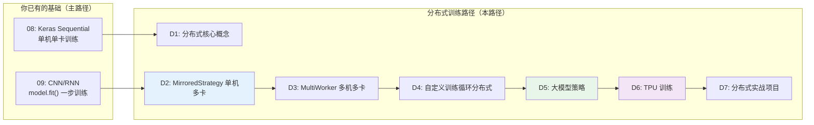
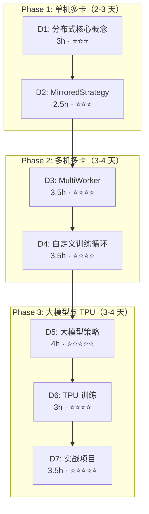
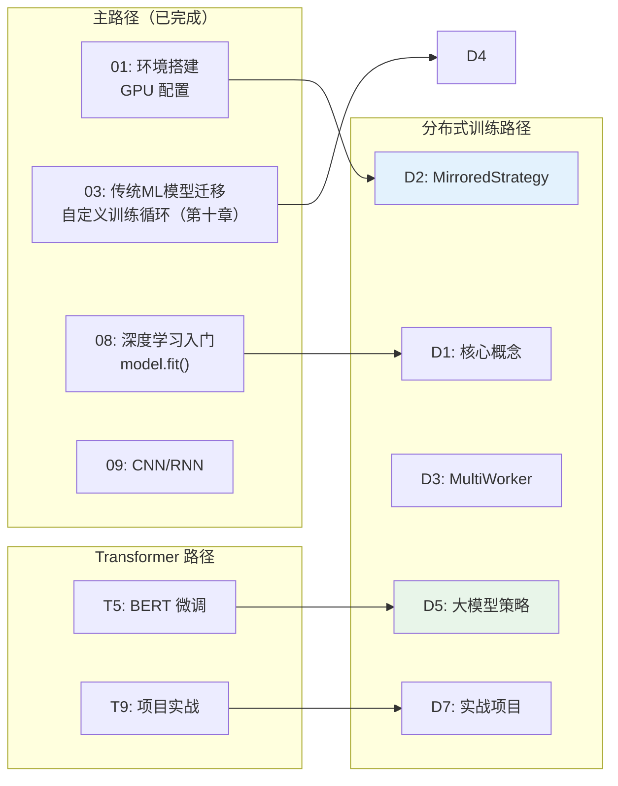

> [!info] 版本基线
> - 本路径代码基于 **TF 2.15+ / Keras 2（tf.keras）** 语境
> - **Windows 原生无 GPU 支持**（TF ≥ 2.11 起），多卡/多机训练请在 **WSL2/Linux** 下运行
> - HuggingFace TF 模型（TFBert/TFAlbert 等）需 **transformers<5**（v5 已移除 TF 模型）

## 前置知识：为什么需要分布式训练

你已经完成了主路径，能在单机上训练 CNN/RNN 模型。但当你遇到以下情况时，单机就不够了：

- BERT-base 有 110M 参数，微调需要 4+ GB 显存，大模型更大
- ImageNet 级别数据集单机训练需要数周
- GPT-2 训练需要 8×V100 跑数天

**分布式训练是把训练扩展到多 GPU、多机器、甚至 TPU 集群的技术**，让你能在可接受的时间内训练更大的模型、更大的数据集。

> [!important] 分布式训练路径与主路径的关系
> - **08 篇**：让你能用 `model.fit()` 在单机上训练 Keras 模型
> - **本路径**：让你能在多卡/多机上训练，把训练时间从"天"缩短到"小时"
> - **Transformer 路径**：BERT/GPT 训练需要分布式
> - **TFX 路径**：TFX 流水线可以调度分布式训练任务

---

## 一、课程清单

| # | 笔记 | 核心内容 | 差异等级 | 建议学时 |
|---|------|---------|---------|---------|
| D0 | [[D0-分布式训练 路径总览]] | 本文件：课程清单 + 路线图 | — | 0.5h |
| D1 | [[D1-分布式训练核心概念]] | 数据并行 vs 模型并行 / 同步 vs 异步 / AllReduce / 通信开销 / 扩展性 | ⭐⭐⭐ 高 | 3h |
| D2 | [[D2-MirroredStrategy 单机多卡]] | 一台机器多 GPU / NCCL 通信 / 最简迁移路径 / GPU 配置 | ⭐⭐⭐ 高 | 2.5h |
| D3 | [[D3-MultiWorker 多机多卡]] | 多机多 GPU / 环境变量 / gRPC 通信 / 容错 / Kubernetes 部署 | ⭐⭐⭐⭐ 高 | 3.5h |
| D4 | [[D4-自定义训练循环分布式]] | Strategy.scope / Datasets 分布 / 自定义 loop 分布式改造 / 梯度同步 | ⭐⭐⭐⭐ 高 | 3.5h |
| D5 | [[D5-大模型策略]] | 模型并行 / Pipeline Parallelism / ZeRO / 混合精度训练 / 梯度累积 | ⭐⭐⭐⭐⭐ 高 | 4h |
| D6 | [[D6-TPU 训练]] | TPU 架构 / TPU Pod / tf.distribute.TPUStrategy / Colab TPU 实战 | ⭐⭐⭐⭐ 高 | 3h |
| D7 | [[D7-分布式训练实战项目]] | 多卡训练 BERT / 多机训练 ResNet / 性能基准测试 | ⭐⭐⭐⭐⭐ 高 | 3.5h |
| 99 | [[99-分布式训练复习检查点]] | 复习检查点：概念自测 / 策略速查表 / 实操清单 | — | 1h |

**总预计学时：~24.5h**

---

## 二、三阶段学习路线

| 阶段 | 目标 | 检验标准 |
|------|------|---------|
| **Phase 1** | 能在一台多 GPU 机器上分布式训练 | 用 MirroredStrategy 训练 CNN + 对比单卡加速比 |
| **Phase 2** | 能在多机上分布式训练 + 改造自定义训练循环 | 用 MultiWorker 跑通 + 自定义 loop 分布式 |
| **Phase 3** | 能训练大模型 + 使用 TPU | 混合精度 + 梯度累积训练大模型 + TPU 实战 |

---

## 三、与主路径的衔接关系

> [!tip] 迁移锚点
> - `model.fit()` 单机训练 → `strategy.scope()` 内的 `model.fit()` 分布式训练（D2）
> - `@tf.function` 自定义训练循环 → `strategy.run(step_fn)` 分布式改造（D4）
> - 01 篇的 GPU 配置 → D2 的多 GPU 策略（D2）

---

## 四、核心概念速查表

| 概念 | 一句话解释 | 主路径锚点 | 首次出现 |
|------|----------|-----------|---------|
| 数据并行 | 每张卡跑完整模型的不同 batch | — | D1 |
| 模型并行 | 模型不同部分分布在不同卡上 | — | D1 |
| 同步训练 | 所有卡计算完梯度后 AllReduce 求平均 | — | D1 |
| AllReduce | 多卡梯度聚合通信原语 | — | D1 |
| MirroredStrategy | 单机多 GPU 数据并行（最常用） | model.fit() | D2 |
| NCCL | NVIDIA 集体通信库，GPU 间高速通信 | — | D2 |
| MultiWorker | 多机多 GPU 分布式训练 | — | D3 |
| Chief Worker | 负责 checkpoint 和模型保存的节点 | — | D3 |
| 容错 | Worker 故障后流水线恢复训练 | — | D3 |
| strategy.scope() | 在策略上下文中创建模型，自动分布变量 | — | D2/D4 |
| strategy.run() | 分布式执行单步训练函数 | @tf.function | D4 |
| 混合精度 | FP16 计算 + FP32 存储，省显存加速 | — | D5 |
| 梯度累积 | 多步小 batch 累积梯度，等效大 batch | — | D5 |
| Pipeline Parallelism | 模型分层在不同卡上流水线执行 | — | D5 |
| TPU | Google 专用 AI 加速芯片 | — | D6 |
| TPU Pod | TPU 集群，高速互联 | — | D6 |

---

## 五、常见易错点

| # | 易错点 | 正确理解 |
|---|--------|---------|
| 1 | 分布式 = 装多张显卡 | 需要策略（Strategy）协调通信，不是自动的 |
| 2 | N 张卡 = N 倍加速 | 受通信开销限制，通常 N 卡 = 0.7N~0.9N 倍 |
| 3 | model.fit() 自动分布式 | 需要 `strategy.scope()` 包裹模型创建 |
| 4 | batch_size 不用改 | 分布式时每卡 batch_size 之和 = 有效 batch_size，需调学习率 |
| 5 | 模型并行和数据并行一样 | 数据并行：每卡完整模型；模型并行：每卡模型的一部分 |
| 6 | TPU 和 GPU 一样用 | TPU 需要特殊数据加载（tf.data + drop_remainder） |
| 7 | 混合精度不影响精度 | 通常影响极小，但需 loss scaling 防止梯度下溢 |
| 8 | Windows 支持多机分布式 | MultiWorker 建议 Linux，Windows 仅支持 MirroredStrategy |

---

## 六、后续可选迭代

1. **短期**：完成 D1→D2，在单机多卡（或 Colab）上跑通 MirroredStrategy
2. **中期**：结合 Transformer 路径，多卡微调 BERT
3. **长期**：学习 DeepSpeed（PyTorch 生态的 ZeRO 优化）、Ray Train、Kubeflow 分布式训练

---

*创建时间：2026-07-25*
*前置路径：[[08-深度学习入门-从MLP到Keras]] / [[09-CNN与RNN-TF独有领域]]*
*并行路径：[[T0-Transformer 路径总览]] / [[X0-TFX 路径总览]]*