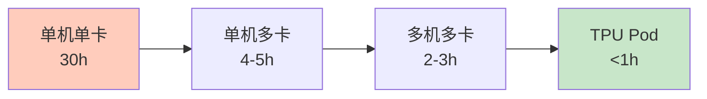
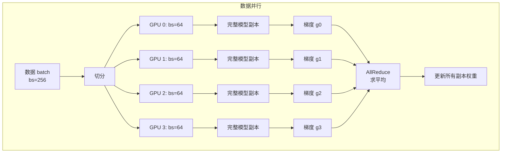
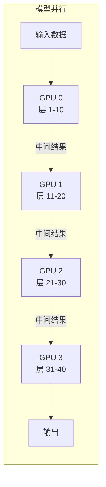
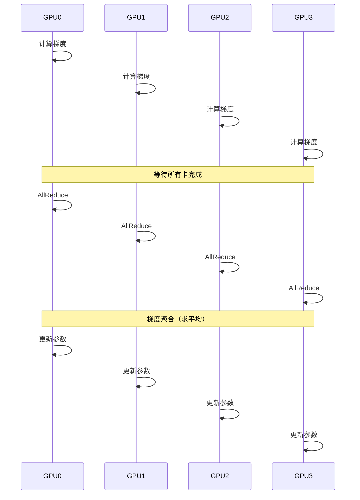
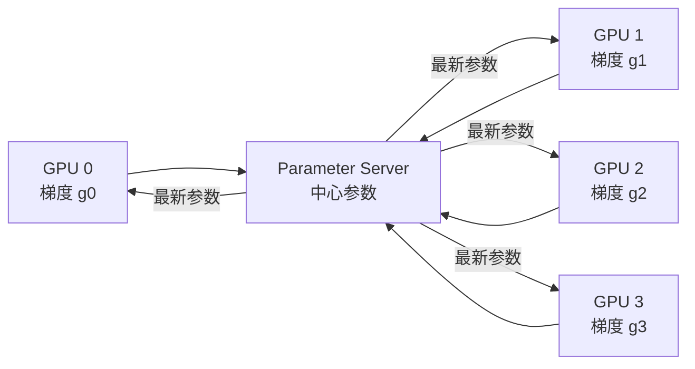
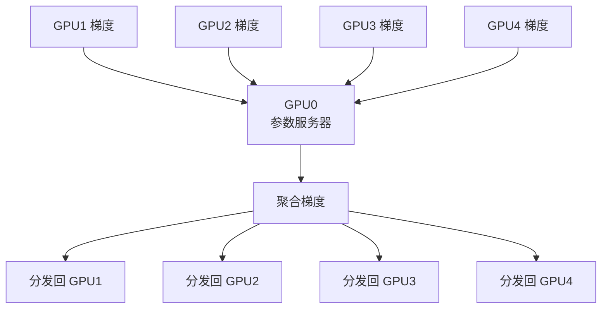
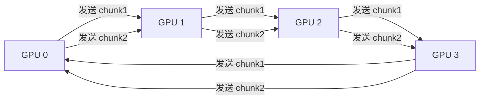
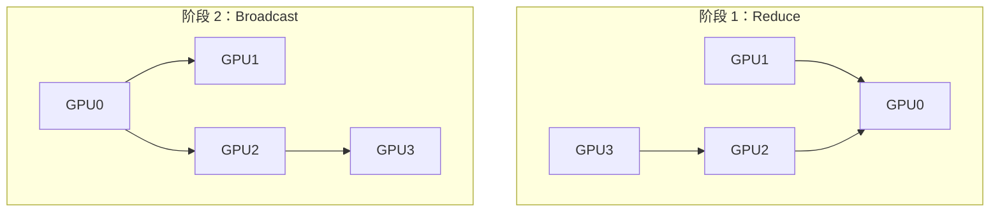

## 前置知识：为什么单机不够了

```python
# ===== 你熟悉的单机训练（主路径 08/09）=====
model.fit(train_dataset, epochs=10)
# 单 GPU，batch_size=32，训练 ResNet50 on ImageNet
# 预计时间：单卡 V100 约 30 小时
# 8 卡 V100 约 4 小时 → 需要 7.5 倍加速
```



> [!important] 分布式训练的两个动机
> 1. **模型太大**：单卡放不下 → 模型并行
> 2. **数据太多**：单卡训练慢 → 数据并行

---

## 一、数据并行 vs 模型并行

### 1.1 数据并行（最常用）



**核心思想**：每张卡有**完整模型副本**，处理**不同数据**，梯度做 AllReduce 求平均。

```python
# 数据并行伪代码
# 4 张 GPU，每张处理 64 个样本（总 batch_size = 256）
for batch in dataset:
    # 1. 数据切分
    per_gpu_batch = split_batch(batch, 4)  # 每份 64

    # 2. 每张卡前向 + 反向
    gradients = []
    for gpu_id in range(4):
        with device(f'/gpu:{gpu_id}'):
            logits = model(per_gpu_batch[gpu_id])
            loss = loss_fn(logits, labels[gpu_id])
            grad = gradient(loss, model.variables)
            gradients.append(grad)

    # 3. AllReduce：梯度求平均
    avg_grad = all_reduce_mean(gradients)

    # 4. 更新所有副本权重（同步）
    optimizer.apply_gradients(zip(avg_grad, model.variables))
```

### 1.2 模型并行（大模型用）



**核心思想**：模型太大放不下一张卡，把模型**不同层放不同卡**，数据顺序流过。

### 1.3 流水线并行（Pipeline Parallelism）

- 模型分层在不同 GPU 上，但不同层同时处理不同 micro-batch
- 平衡模型并行中的 GPU 空闲时间
- 代表：GPipe、PipeDream

### 1.4 混合并行

现代大模型训练常用**数据并行 + 流水线并行 + 张量并行**：
- 同一节点内：张量并行
- 节点之间：流水线并行
- 不同组之间：数据并行

> [!important] 数据并行 vs 模型并行
> | 维度 | 数据并行 | 模型并行 |
> |------|---------|---------|
> | 模型放置 | 每卡完整副本 | 每卡一部分 |
> | 数据处理 | 每卡不同数据 | 所有卡同一数据 |
> | 通信 | 梯度 AllReduce | 中间结果传递 |
> | 适用场景 | 模型放得下单卡 | 模型放不下（如 GPT-3 175B） |
> | TF 支持 | ✅ MirroredStrategy | ⚠️ 需手动实现 |
> | 常见度 | 90% 场景 | 大模型专用 |

---

## 二、同步 vs 异步训练

### 2.1 同步训练



- ✅ 梯度准确（无噪声）
- ✅ 收敛稳定
- ✅ TensorFlow 默认方式
- ❌ 最慢的卡拖累整体（短板效应）

### 2.2 异步训练



- ✅ 没有短板效应（快的卡不等待）
- ❌ 梯度有延迟（用了旧参数算的梯度）
- ❌ 收敛可能不稳定

> [!tip] 选型建议
> | 场景 | 推荐 |
> |------|------|
> | GPU 性能一致（同型号） | **同步** |
> | GPU 性能不一致（混合） | **异步** |
> | 需要稳定收敛 | **同步** |
> | 大规模集群（100+ GPU） | **异步** |
> | TF 默认 | **同步**（MirroredStrategy） |

---

## 三、AllReduce 通信原语

### 3.1 什么是 AllReduce

```python
# 4 张 GPU 各有梯度：
# GPU 0: grad = [1, 2, 3]
# GPU 1: grad = [2, 3, 4]
# GPU 2: grad = [3, 4, 5]
# GPU 3: grad = [4, 5, 6]

# AllReduce 后每张 GPU 得到平均梯度：
# grad_avg = [2.5, 3.5, 4.5]
```

### 3.2 朴素 AllReduce（中心化）



- ❌ GPU0 通信瓶颈（所有卡都发给它）
- ❌ 通信量 = O(N × 模型大小)

### 3.3 Ring AllReduce（最常用）



分两步：
1. **Scatter-Reduce**：每个 GPU 收到并累加一部分数据
2. **AllGather**：把累加后的结果广播给所有 GPU

- ✅ 通信量：O(2 × 模型大小)（与卡数无关）
- ✅ 带宽利用率高
- ✅ NCCL 库默认使用 Ring AllReduce

### 3.4 Tree AllReduce（树形）



- ✅ 延迟低（log N 步骤）
- ✅ 适合小模型

> [!important] 通信库
> - **NCCL**：NVIDIA 的 GPU 集体通信库，单机多卡/多机多卡都可用
> - **Horovod**：Uber 开源的分布式训练框架，底层也用 NCCL
> - **gRPC**：多机之间传输数据

---

## 四、通信开销与扩展性

### 4.1 通信时间计算

```python
# 通信时间 = 传输延迟 + 传输时间
t_comm = t_latency + t_transfer

# 传输延迟：建立连接的时间（通常 ~10μs）
# 传输时间 = 数据量 / 带宽

# 示例：AllReduce 通信时间
# 模型大小：100MB
# GPU 数量：8
# 带宽：100GB/s（NVLink）
# 算法：Ring AllReduce

t_transfer = 2 × 100MB / 100GB/s = 2ms
t_latency = 8 × 10μs = 80μs
t_total = 2.08ms
```

### 4.2 理想 vs 实际加速比

```python
# 理想：N 张卡 = N 倍加速
# 实际：N 张卡 ≈ 0.7N ~ 0.9N 倍加速

# 经验值（V100 NVLink）：
# ─────────────────────────────
# 卡数   理想    实际
# ─────────────────────────────
#  1     1x      1x
#  2     2x      1.8-1.9x
#  4     4x      3.2-3.5x
#  8     8x      5.5-6.5x
# 16     16x     8-10x
# ─────────────────────────────
# 通信开销随卡数增加而增大
```

### 4.3 影响扩展性的因素

| 因素 | 说明 | 优化方向 |
|------|------|---------|
| 通信带宽 | NVLink > PCIe > 以太网 | 用 NVLink/InfiniBand |
| 模型大小 | 大模型通信量大 | 梯度压缩（INT8） |
| batch_size | 小 batch 计算时间短，通信占比大 | 增大 per-GPU batch |
| 梯度分桶 | 分桶异步通信，与计算重叠 | `tf.distribute` 自动优化 |
| 混合精度 | FP16 梯度通信量减半 | D5 详讲 |

> [!important] 通信瓶颈
> - **单机多卡**：NVLink 带宽 600GB/s，通信快
> - **多机多卡**：网络带宽 25-100Gbps，通信慢 100 倍
> - **TPU Pod**：高速互联，通信快

---

## 五、有效 batch_size 与学习率缩放

```python
# ============================================
# 分布式训练的关键概念：有效 batch_size
# ============================================

# 单卡训练：batch_size = 32
# 4 卡数据并行：每卡 batch_size = 32 → 有效 batch_size = 128

# 有效 batch_size = per_gpu_batch_size × num_gpus

per_gpu_bs = 32
num_gpus = 4
effective_bs = per_gpu_bs * num_gpus  # 128

# 学习率调整策略：
# 策略 1：线性缩放（Linear Scaling）
# batch 扩大 N 倍 → 学习率 × N
new_lr = 0.001 * 4  # = 0.004

# 策略 2：平方根缩放（Sqrt Scaling）
# batch 扩大 N 倍 → 学习率 × √N
new_lr = 0.001 * (4 ** 0.5)  # = 0.002

# 策略 3：Warmup
# 前几个 epoch 用小学习率，然后线性增加到目标
```

> [!warning] 常见错误
> - ❌ 分布式训练不调学习率 → 收敛慢或不收敛
> - ❌ per_gpu_batch_size 设太大 → 显存溢出（OOM）
> - ❌ 有效 batch_size 太大 → 最终精度下降

---

## 六、练习

> [!exercise] 🟢 基础：计算 AllReduce 结果
> 4 张 GPU 的梯度分别是 [1,2,3], [2,3,4], [3,4,5], [4,5,6]。AllReduce（求平均）后每张 GPU 的梯度是多少？
>
> <details>
> <summary>🔑 答案</summary>
>
> ```
> avg = [(1+2+3+4)/4, (2+3+4+5)/4, (3+4+5+6)/4]
>   = [2.5, 3.5, 4.5]
> ```
>
> </details>

> [!exercise] 🟡 进阶：计算扩展效率
> 单卡训练 100 小时，4 卡 30 小时，8 卡 16 小时。计算加速比和效率。
>
> <details>
> <summary>🔑 答案</summary>
>
> ```python
> # 4 卡
> speedup_4 = 100 / 30  # 3.33x
> efficiency_4 = 3.33 / 4  # 83%
>
> # 8 卡
> speedup_8 = 100 / 16  # 6.25x
> efficiency_8 = 6.25 / 8  # 78%
>
> # 8 卡效率比 4 卡低：通信开销增大
> ```
>
> </details>

> [!exercise] 🔴 挑战：计算通信时间
> 模型 50MB，4 卡，NVLink 带宽 50GB/s，Ring AllReduce。计算总通信时间。
>
> <details>
> <summary>🔑 答案</summary>
>
> ```python
> model_size = 50 * 1024 * 1024  # bytes
> bandwidth = 50 * 1024**3  # bytes/s
> num_gpus = 4
>
> # Ring AllReduce 通信量 = 2 × 模型大小
> data_transferred = 2 * model_size
>
> t_transfer = data_transferred / bandwidth  # ~2ms
> t_latency = num_gpus * 10e-6  # 40μs
> t_total = t_transfer + t_latency  # ~2.04ms
> ```
>
> </details>

---

## 七、常见陷阱

| # | 陷阱 | 正确理解 |
|---|------|---------|
| 1 | 分布式 = 装多张显卡 | 需要策略（Strategy）协调通信，不是自动的 |
| 2 | N 卡 = N 倍加速 | 受通信开销限制，通常 70-90% 效率 |
| 3 | model.fit() 自动分布式 | 需要 `strategy.scope()` 包裹模型创建 |
| 4 | 数据并行和模型并行一样 | 数据并行：每卡完整模型；模型并行：每卡部分模型 |
| 5 | 忽视学习率缩放 | batch_size 增大时需要调整学习率 |
| 6 | 忽视通信开销 | 单机 NVLink 快，多机网络慢 100 倍 |

---

*前置：[[08-深度学习入门-从MLP到Keras]] / [[09-CNN与RNN-TF独有领域]]*
*后续：[[D2-MirroredStrategy 单机多卡]]*
*回总览：[[D0-分布式训练 路径总览]]*
