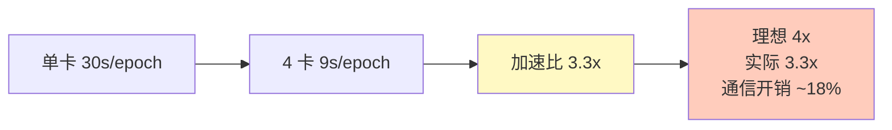

## 前置知识：从 model.fit() 到分布式 model.fit()

```python
# ===== 单卡训练（你已会）=====
model = build_model()
model.fit(train_dataset, epochs=10)

# ===== 单机多卡（3 行代码改动）=====
strategy = tf.distribute.MirroredStrategy()
with strategy.scope():
    model = build_model()          # 在 scope 内创建模型
    model.compile(...)             # 在 scope 内编译
model.fit(train_dataset, epochs=10)  # fit 自动分布式
```


> [!important] MirroredStrategy 的核心
> - **单机多 GPU**：所有 GPU 在同一台机器上
> - **数据并行**：每张卡有完整模型副本
> - **同步训练**：AllReduce 梯度求平均
> - **NCCL 通信**：NVIDIA 集体通信库
> - **对用户透明**：只需要 `scope()` 包裹模型创建

---

## 一、GPU 环境检查

```python
import tensorflow as tf

# 1. 检查 GPU 数量
gpus = tf.config.list_physical_devices('GPU')
print(f"检测到 {len(gpus)} 张 GPU")
for gpu in gpus:
    print(f"  - {gpu.name}")

# 2. 设置 GPU 内存增长（避免一次性占满）
for gpu in gpus:
    tf.config.experimental.set_memory_growth(gpu, True)

# 3. 限制只使用特定 GPU
tf.config.set_visible_devices(gpus[:4], 'GPU')  # 只用前 4 张
```

> [!warning] Windows 用户注意
> - Windows 支持 MirroredStrategy（单机多卡）
> - Windows **不支持** MultiWorkerMirroredStrategy（多机）
> - 多机分布式建议用 Linux

---

## 二、MirroredStrategy 完整代码

### 2.1 最简迁移（Keras model.fit）

```python
import tensorflow as tf

# 1. 创建策略
strategy = tf.distribute.MirroredStrategy()
print(f"训练使用 {strategy.num_replicas_in_sync} 张 GPU")

# 2. 在 scope 内创建和编译模型
with strategy.scope():
    model = tf.keras.Sequential([
        tf.keras.layers.Conv2D(32, (3, 3), activation='relu', input_shape=(28, 28, 1)),
        tf.keras.layers.MaxPooling2D((2, 2)),
        tf.keras.layers.Flatten(),
        tf.keras.layers.Dense(128, activation='relu'),
        tf.keras.layers.Dense(10, activation='softmax'),
    ])
    model.compile(
        optimizer='adam',
        loss='sparse_categorical_crossentropy',
        metrics=['accuracy'],
    )

# 3. 数据加载（batch_size 要设为 per_gpu_bs × num_gpus 的倍数）
per_gpu_bs = 64
global_bs = per_gpu_bs * strategy.num_replicas_in_sync  # 64 × 4 = 256

train_dataset = tf.data.Dataset.from_tensor_slices((x_train, y_train))
train_dataset = train_dataset.shuffle(10000).batch(global_bs).prefetch(tf.data.AUTOTUNE)

# 4. 训练（自动分布式）
model.fit(train_dataset, epochs=10, validation_data=val_dataset)
```

> [!important] 代码改动只有 3 处
> 1. 创建 `strategy = tf.distribute.MirroredStrategy()`
> 2. `with strategy.scope():` 包裹模型创建和编译
> 3. `batch_size` 改为 `per_gpu_bs × num_gpus`
>
> `model.fit()` 内部自动做数据切分、前向、反向、AllReduce——对用户完全透明。

### 2.2 通信配置

```python
# 自定义通信方式（默认 NCCL）
strategy = tf.distribute.MirroredStrategy(
    cross_device_ops=tf.distribute.NcclAllReduce(),  # 默认，最快
    # 其他选项：
    # cross_device_ops=tf.distribute.HierarchicalAllReduce(),  # 大规模优化
    # cross_device_ops=tf.distribute.ReductionToOneDevice(),   # 通过 CPU 中转（慢）
)
```

> [!tip] NCCL vs HierarchicalAllReduce
> | 通信方式 | 适用场景 | 速度 |
> |---------|---------|------|
> | NCCL AllReduce | ≤8 卡 | ✅ 最快 |
> | HierarchicalAllReduce | >8 卡 | ✅ 分层通信更优 |
> | ReductionToOneDevice | 无 NCCL 环境 | ❌ 慢（CPU 中转） |

---

## 三、batch_size 和学习率调整

### 3.1 有效 batch_size

```python
# 单机单卡：batch_size = 32
# 单机 4 卡，每卡 batch_size = 32 → 有效 batch_size = 128

# 通常做法：每卡 batch_size 不变，总 batch 扩大 N 倍
strategy = tf.distribute.MirroredStrategy()
n_replicas = strategy.num_replicas_in_sync

batch_size = 32 * n_replicas  # 总 batch size
learning_rate = 0.001 * n_replicas  # 学习率同步放大
```

### 3.2 学习率线性缩放规则

```python
# 线性缩放：batch_size 扩大 N 倍 → 学习率也扩大 N 倍
# 原因：梯度是 N 个 batch 的平均，总梯度更稳定，可以承受更大的学习率

# 例如：
# 单卡 batch=32, lr=0.001
# 4 卡 batch=128, lr=0.004

# 但注意：batch 不能无限扩大，否则收敛困难
# 通常 batch 扩大 N 倍后，warmup 几个 epoch 更稳

# 或用学习率调度器自动调整
lr_schedule = tf.keras.optimizers.schedules.CosineDecay(
    initial_learning_rate=0.001 * n_replicas,
    decay_steps=1000,
)
```

---

## 四、混合精度训练

### 4.1 为什么用混合精度

- **省显存**：FP16 占 FP32 一半
- **加速**：现代 GPU（RTX 20 系+、V100/A100）FP16 更快
- **通常不影响精度**：loss scaling 防止梯度下溢

### 4.2 启用混合精度

```python
from tensorflow.keras import mixed_precision

strategy = tf.distribute.MirroredStrategy()

with strategy.scope():
    # 设置全局策略为 mixed_float16
    policy = mixed_precision.Policy('mixed_float16')
    mixed_precision.set_global_policy(policy)

    # 创建模型
    model = keras.Sequential([...])
    model.compile(...)

# 注意：输出最后一层必须是 float32（保证数值稳定）
# 通常在最后一层显式指定 dtype='float32'
```

### 4.3 显存优化效果

| 模式 | 显存占用 | 训练速度 | 精度损失 |
|------|---------|---------|---------|
| FP32 | 100% | 基准 | 0% |
| Mixed FP16 | ~50% | 快 1.5~3 倍 | < 0.5% |
| FP16 | ~50% | 快 | 可能有精度损失 |

---

## 五、性能对比

```python
import time

# 单卡
model_single = build_model()
model_single.compile(...)

start = time.time()
model_single.fit(train_ds_single, epochs=5)
single_time = time.time() - start

# 4 卡
strategy = tf.distribute.MirroredStrategy()
with strategy.scope():
    model_multi = build_model()
    model_multi.compile(...)

start = time.time()
model_multi.fit(train_ds_multi, epochs=5)
multi_time = time.time() - start

print(f"单卡: {single_time:.1f}s")
print(f"4 卡: {multi_time:.1f}s")
print(f"加速比: {single_time / multi_time:.2f}x")
# 典型结果：3.2~3.5x（不是理想 4x，因为通信开销）
```



---

## 六、练习

> [!exercise] 🟢 基础：单机多卡训练 MNIST
> **目标**：用 MirroredStrategy 在多 GPU 上训练 MNIST 分类器。
>
> ```python
> strategy = tf.distribute.MirroredStrategy()
> with strategy.scope():
>     model = tf.keras.Sequential([
>         tf.keras.layers.Flatten(input_shape=(28, 28)),
>         tf.keras.layers.Dense(128, activation='relu'),
>         tf.keras.layers.Dense(10, activation='softmax'),
>     ])
>     model.compile(optimizer='adam', loss='sparse_categorical_crossentropy', metrics=['accuracy'])
> model.fit(train_dataset, epochs=5)
> ```
>
> **验收标准**：
> - [ ] `strategy.num_replicas_in_sync` 显示正确 GPU 数
> - [ ] 训练正常收敛
> - [ ] 无 OOM 错误

> [!exercise] 🟡 进阶：测量加速比
> **目标**：对比单卡和 4 卡训练时间，计算实际加速比。
>
> <details>
> <summary>🔑 参考答案</summary>
>
> ```python
> import time
> # 单卡
> start = time.time(); model_single.fit(...); t1 = time.time() - start
> # 4 卡
> start = time.time(); model_multi.fit(...); t2 = time.time() - start
> print(f"加速比: {t1/t2:.2f}x")  # 预期 3.0~3.5x
> ```
>
> </details>

> [!exercise] 🔴 挑战：混合精度 + 学习率缩放
> **目标**：在 MirroredStrategy 下启用混合精度，并按 batch 缩放学习率。
>
> <details>
> <summary>🔑 参考答案</summary>
>
> ```python
> import tensorflow as tf
> from tensorflow.keras import mixed_precision
>
> strategy = tf.distribute.MirroredStrategy()
> n = strategy.num_replicas_in_sync
>
> with strategy.scope():
>     mixed_precision.set_global_policy('mixed_float16')
>     model = tf.keras.Sequential([...])
>     model.compile(
>         optimizer=tf.keras.optimizers.Adam(learning_rate=0.001 * n),
>         loss='sparse_categorical_crossentropy',
>         metrics=['accuracy'],
>     )
> model.fit(dataset, epochs=10)
> ```
>
> </details>

---

## 七、常见陷阱

| # | 陷阱 | 正确做法 |
|---|------|---------|
| 1 | 在 scope 外创建模型 | 模型必须在 `strategy.scope()` 内创建 |
| 2 | batch_size 没放大 | 每卡 batch 不变，总 batch 应扩大 N 倍 |
| 3 | 不调学习率 | 有效 batch 变大，学习率需缩放 |
| 4 | 在 scope 内做数据预处理 | 数据预处理在 scope 外，只模型在 scope 内 |
| 5 | 忘记 set_memory_growth | GPU 内存一次性占满，其他进程无法用 |
| 6 | Windows 用 MultiWorker | Windows 只支持 MirroredStrategy |
| 7 | 混合精度最后一层不是 fp32 | 输出层必须 cast 到 fp32 |

---

*前置：[[D1-分布式训练核心概念]]*
*后续：[[D3-MultiWorker 多机多卡]]*
*关联：[[01-环境搭建与基础概念对比]]（GPU 配置）*
*回总览：[[D0-分布式训练 路径总览]]*
