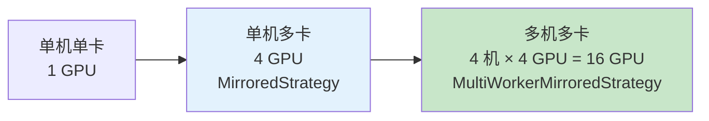
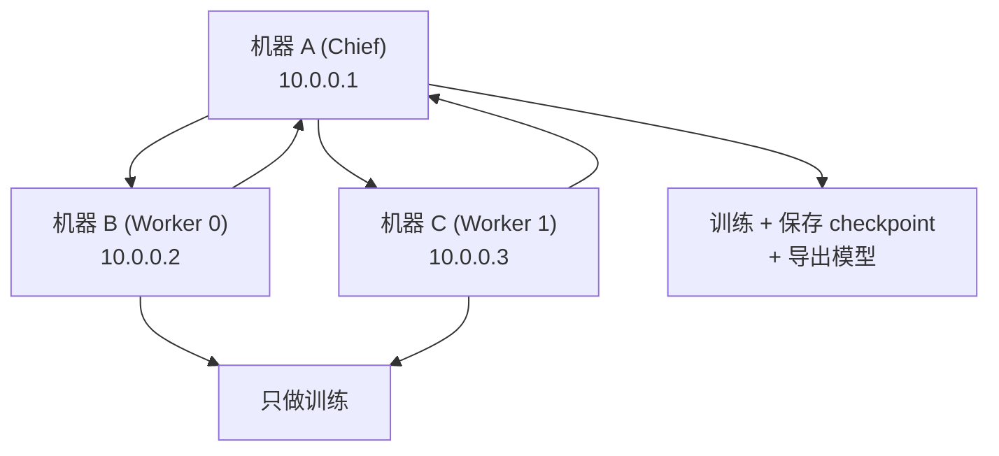
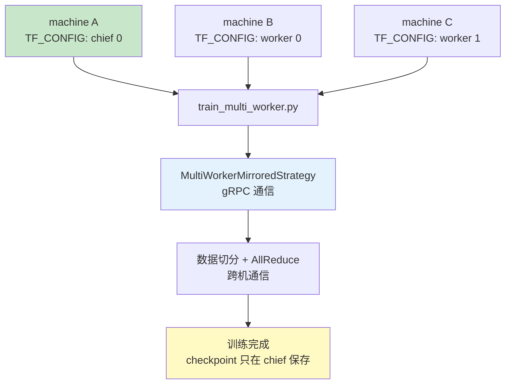
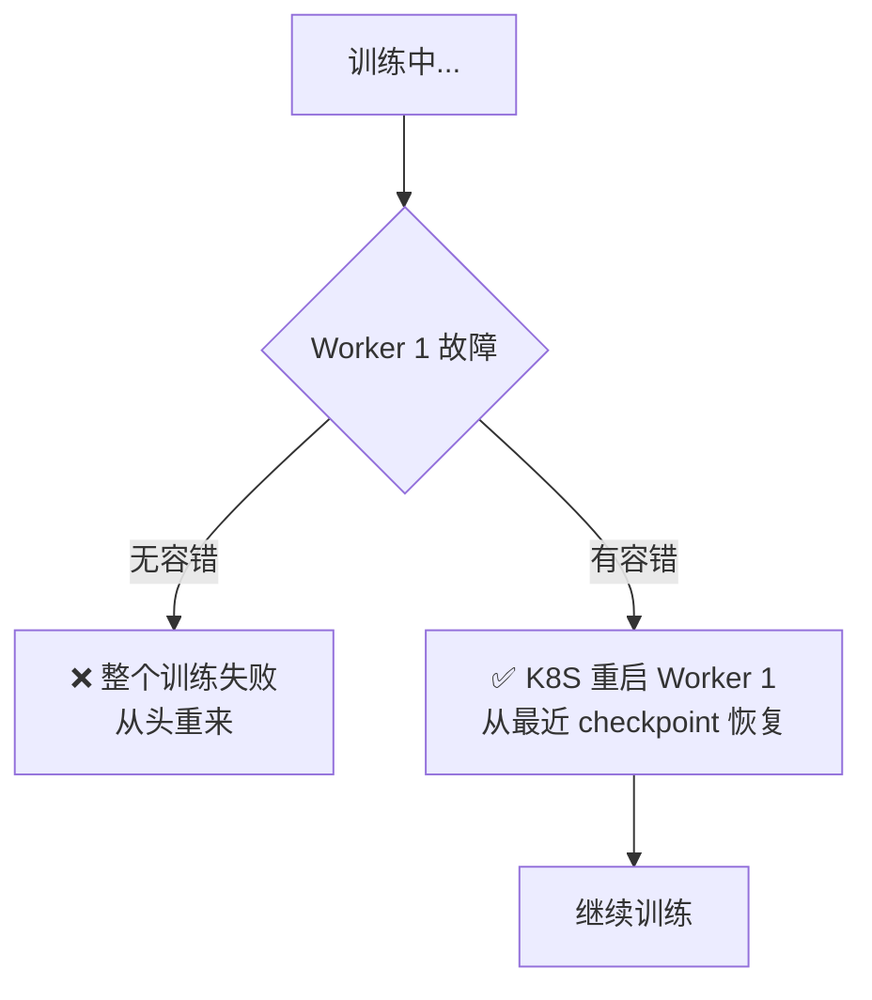

## 前置知识：从单机到多机

```python
# ===== 单机多卡（D2，你已会）=====
strategy = tf.distribute.MirroredStrategy()
with strategy.scope():
    model = build_model()
model.fit(...)

# ===== 多机多卡（本篇）=====
strategy = tf.distribute.MultiWorkerMirroredStrategy()
with strategy.scope():
    model = build_model()
model.fit(...)
# 代码几乎一样！关键差异在环境配置
```



> [!important] 单机 vs 多机的核心差异
> | 维度 | MirroredStrategy | MultiWorkerMirroredStrategy |
> |------|-------------------|----------------------------|
> | 机器数 | 1 台 | N 台 |
> | 通信 | NCCL（NVLink 600GB/s） | gRPC（网络 25-100Gbps） |
> | 配置 | 自动检测 GPU | 需要 TF_CONFIG 环境变量 |
> | 角色 | 无（所有 GPU 平等） | Chief / Worker |
> | 容错 | 无 | 支持故障恢复 |
> | OS | Windows/Linux | 仅 Linux |

---

## 一、TF_CONFIG 环境变量

### 1.1 什么是 TF_CONFIG

`TF_CONFIG` 是 JSON 字符串，告诉每个进程：你是谁？集群里有哪些机器？你的角色是什么？

```json
{
    "cluster": {
        "chief": ["10.0.0.1:12345"],
        "worker": ["10.0.0.2:12345", "10.0.0.3:12345"]
    },
    "task": {
        "type": "chief",
        "index": 0
    }
}
```

| 字段 | 含义 | 示例 |
|------|------|------|
| `cluster` | 集群拓扑，列出所有节点地址 | chief + worker 列表 |
| `task.type` | 当前节点类型 | `"chief"` 或 `"worker"` |
| `task.index` | 当前节点在列表中的索引 | 0, 1, 2, 3 |

### 1.2 三种角色

| 角色 | 职责 | 数量 |
|------|------|------|
| **chief** | 训练 + checkpoint 保存 + 模型导出 + TensorBoard | 1 |
| **worker** | 只做训练（计算梯度） | N |
| **evaluator** | 只做评估（可选） | 0-1 |

### 1.3 多机配置示例

```bash
# 机器 A（chief）
export TF_CONFIG='{
    "cluster": {
        "chief": ["10.0.0.1:12345"],
        "worker": ["10.0.0.2:12345", "10.0.0.3:12345"]
    },
    "task": {"type": "chief", "index": 0}
}'

# 机器 B（worker 0）
export TF_CONFIG='{
    "cluster": {
        "chief": ["10.0.0.1:12345"],
        "worker": ["10.0.0.2:12345", "10.0.0.3:12345"]
    },
    "task": {"type": "worker", "index": 0}
}'

# 机器 C（worker 1）
export TF_CONFIG='{
    "cluster": {
        "chief": ["10.0.0.1:12345"],
        "worker": ["10.0.0.2:12345", "10.0.0.3:12345"]
    },
    "task": {"type": "worker", "index": 1}
}'
```



> [!warning] 常见错误
> - ❌ `cluster` 中漏掉某个 worker 地址 → 通信失败
> - ❌ `task.index` 超出 worker 列表长度 → 启动失败
> - ❌ 端口被占用 → 通信失败
> - ✅ 正确做法：每台机器 `cluster` 相同，`task` 不同

---

## 二、MultiWorkerMirroredStrategy 完整代码

### 2.1 训练脚本（所有机器相同）

```python
# ============================================
# train_multi_worker.py — 每台机器都运行这个脚本
# ============================================
import os
import json
import tensorflow as tf
from tensorflow import keras

# 1. 自动读取 TF_CONFIG（由环境变量注入）
strategy = tf.distribute.MultiWorkerMirroredStrategy()
print(f"Task: {strategy.cluster_resolver.task_type}"
      f" - {strategy.cluster_resolver.task_id}")
print(f"Replicas（GPU 总数）: {strategy.num_replicas_in_sync}")

# 2. 在 scope 内创建模型
with strategy.scope():
    model = keras.Sequential([
        keras.layers.Flatten(input_shape=(28, 28)),
        keras.layers.Dense(128, activation='relu'),
        keras.layers.Dense(10, activation='softmax'),
    ])
    model.compile(
        optimizer='adam',
        loss='sparse_categorical_crossentropy',
        metrics=['accuracy'],
    )

# 3. 数据加载
# MultiWorkerMirroredStrategy 默认自带 AutoShardPolicy（AUTO）自动分片：
# model.fit / distribute_dataset 会把全局 batch 切给每个 replica，各 worker 处理不同数据。
# 下面演示"手动分片"（想自己控制每台机器读哪部分数据时使用）：
def make_dataset():
    (x_train, y_train), _ = keras.datasets.mnist.load_data()
    x_train = x_train / 255.0
    dataset = tf.data.Dataset.from_tensor_slices((x_train, y_train))

    # 手动 shard：num_shards 用 worker 进程数（本例 chief 1 + worker 2 = 3）
    # ❌ 不是 strategy.num_replicas_in_sync（那是 GPU 总数；task_id 只有 0~2，
    #    用 num_shards=GPU 数会丢弃大部分数据）
    num_workers = 3  # TF_CONFIG 中的进程总数（chief + workers）
    dataset = dataset.shard(
        num_shards=num_workers,
        index=strategy.cluster_resolver.task_id  # 当前进程在集群中的 ID
    )
    # 手动分片后建议关闭自动分片，避免二次切分：
    options = tf.data.Options()
    options.experimental_distribute.auto_shard_policy = (
        tf.data.experimental.AutoShardPolicy.OFF)
    dataset = dataset.with_options(options)

    # 全局 batch_size 要覆盖所有机器的所有 GPU
    per_worker_batch = 64
    global_batch = per_worker_batch * strategy.num_replicas_in_sync
    dataset = dataset.shuffle(10000).batch(global_batch).prefetch(tf.data.AUTOTUNE)
    return dataset

# 4. 训练
dataset = make_dataset()
model.fit(dataset, epochs=10)

# 5. 只有 chief 保存模型
if strategy.cluster_resolver.task_type == 'chief':
    model.save('/shared/model/multi_worker_model')
    print("模型已保存")
```

> [!important] 数据分片机制
> - MultiWorkerMirroredStrategy **默认自动分片数据**：`tf.data.experimental.AutoShardPolicy.AUTO`（默认）会把全局 batch 切给每个 replica，各 worker 处理**不同数据**，不会出现"所有机器处理相同数据"
> - 可选调优：`AutoShardPolicy.FILE`（多文件 TFRecord 场景按文件分片）或保持 `AUTO`（按样本分片）；手动 `dataset.shard()` 时应设为 `OFF`，避免二次切分
> - TF 的 MultiWorker 同时自动处理梯度 AllReduce
> - 只有 chief 保存模型，避免多个 worker 同时写文件冲突

### 2.2 启动多机训练

```bash
# 在三台机器上分别执行
# 机器 A (Chief)
TF_CONFIG='{"cluster":{"chief":["10.0.0.1:12345"],"worker":["10.0.0.2:12345","10.0.0.3:12345"]},"task":{"type":"chief","index":0}}' python train_multi_worker.py

# 机器 B (Worker 0)
TF_CONFIG='{"cluster":{"chief":["10.0.0.1:12345"],"worker":["10.0.0.2:12345","10.0.0.3:12345"]},"task":{"type":"worker","index":0}}' python train_multi_worker.py

# 机器 C (Worker 1)
TF_CONFIG='{"cluster":{"chief":["10.0.0.1:12345"],"worker":["10.0.0.2:12345","10.0.0.3:12345"]},"task":{"type":"worker","index":1}}' python train_multi_worker.py
```



---

## 三、容错与恢复

### 3.1 故障场景



### 3.2 配置 BackupAndRestore

```python
import tensorflow as tf

# 配置 BackupAndRestore（TF 2.9+，容错回调）
backup_callback = tf.keras.callbacks.BackupAndRestore(
    backup_dir='/shared/backup'  # Worker 故障后从此目录恢复
)

# 定期保存 checkpoint
checkpoint_callback = tf.keras.callbacks.ModelCheckpoint(
    filepath='/shared/checkpoints/ckpt-{epoch:02d}',
    save_weights_only=True,
    save_freq='epoch',
)

model.fit(
    dataset,
    epochs=100,
    callbacks=[backup_callback, checkpoint_callback],
)

# 手动恢复
latest = tf.train.latest_checkpoint('/shared/checkpoints')
if latest:
    print(f"从 checkpoint 恢复: {latest}")
    model.load_weights(latest)
```

> [!important] 容错流程
> 1. 定期保存 checkpoint 到共享存储（NFS/GCS/S3）
> 2. Worker 故障 → K8S 自动重启 Pod
> 3. 从最近 checkpoint 恢复训练
> 4. 训练从断点继续，不从头开始

---

## 四、Kubernetes 部署

### 4.1 用 K8S + TFJob 管理多机训练

```yaml
# tf-worker-job.yaml
apiVersion: kubeflow.org/v1
kind: TFJob
metadata:
  name: mnist-multiworker
spec:
  tfReplicaSpecs:
    Chief:
      replicas: 1
      template:
        spec:
          containers:
          - name: tensorflow
            image: tensorflow/tensorflow:2.14.0-gpu
            command: ["python", "train_multi_worker.py"]
            resources:
              limits:
                nvidia.com/gpu: 4
    Worker:
      replicas: 2
      template:
        spec:
          containers:
          - name: tensorflow
            image: tensorflow/tensorflow:2.14.0-gpu
            command: ["python", "train_multi_worker.py"]
            resources:
              limits:
                nvidia.com/gpu: 4
          restartPolicy: OnFailure
```

```bash
# 部署
kubectl apply -f tf-worker-job.yaml

# 查看状态
kubectl get tfjobs
kubectl logs -f mnist-multiworker-chief-0
```

> [!tip] 用 K8S + TFJob 的好处
> - **自动配置 TF_CONFIG**：不用手动设环境变量
> - **自动管理 Pod 生命周期**：Worker 故障自动重启
> - **支持 GPU 资源调度**：自动分配 GPU
> - **统一日志**：`kubectl logs` 查看所有 Worker

---

## 五、网络通信优化

### 5.1 通信方式选择

```python
# 默认用 NCCL 跨机通信（需要 RDMA 或高速网络）
strategy = tf.distribute.MultiWorkerMirroredStrategy(
    communication_options=tf.distribute.experimental.CommunicationOptions(
        implementation=tf.distribute.experimental.CommunicationImplementation.NCCL,
    )
)

# 如果网络较慢，可以改用 ring collectives
strategy = tf.distribute.MultiWorkerMirroredStrategy(
    communication_options=tf.distribute.experimental.CommunicationOptions(
        implementation=tf.distribute.experimental.CommunicationImplementation.RING,
    )
)
```

> [!tip] 通信方式对比
> | 方式 | 适用场景 | 速度 |
> |------|---------|------|
> | **NCCL** | 高速网络（RDMA/InfiniBand） | ✅ 最快 |
> | **RING** | 普通以太网 | 中等 |
> | **AUTO** | 默认自动选择 | 通常选 NCCL |

### 5.2 网络带宽瓶颈

```python
# 多机通信带宽对比：
# 单机 NVLink：600 GB/s
# 多机 InfiniBand：100 Gbps = 12.5 GB/s
# 多机 10GbE：10 Gbps = 1.25 GB/s
# 通信比单机慢 48~480 倍！

# 优化策略：
# 1. 用 InfiniBand（贵但快）
# 2. 梯度压缩（FP16 量化，通信量减半）
# 3. 增大 batch_size（计算时间占比增加，通信占比降低）
# 4. 通信与计算重叠（分桶异步通信）
# 5. steps_per_execution 降低每步 host 开销（注意：每个训练步仍做 AllReduce）
```

### 5.3 steps_per_execution

```python
# steps_per_execution 是 compile 的参数（传给 fit 会 TypeError）
model.compile(
    optimizer='adam',
    loss='sparse_categorical_crossentropy',
    metrics=['accuracy'],
    steps_per_execution=10,  # 单次 tf.function 调用跑 10 步，降低每步 host 开销
                             # （每个训练步仍做 AllReduce，不是"每 10 步同步一次"）
)
model.fit(train_dataset, epochs=10, validation_data=val_dataset)
```

---

## 六、MirroredStrategy vs MultiWorker 对比

| 维度 | MirroredStrategy | MultiWorkerMirroredStrategy |
|------|-----------------|---------------------------|
| 机器数 | 1 | N |
| GPU 通信 | NVLink/NCCL | NVLink + 网络 |
| 角色 | 无（所有 GPU 平等） | Chief + Worker |
| 代码改动 | 在 scope 内创建模型 | 同 + TF_CONFIG + shard |
| 部署 | 直接运行 | 需要协调多机启动 |
| 容错 | 无 | BackupAndRestore |
| 通信带宽 | 600GB/s | 25-100Gbps |
| 适用场景 | 单机多卡 | 多机多卡 |
| 数据分片 | 自动 | 自动（AutoShardPolicy，可手动 shard） |

---

## 七、练习

> [!exercise] 🟢 基础：配置 TF_CONFIG
> 写出 2 台机器（1 chief + 1 worker）的 TF_CONFIG。
>
> <details>
> <summary>🔑 答案</summary>
>
> ```json
> // 机器 A (Chief)
> {"cluster":{"chief":["10.0.0.1:12345"],"worker":["10.0.0.2:12345"]},"task":{"type":"chief","index":0}}
> // 机器 B (Worker 0)
> {"cluster":{"chief":["10.0.0.1:12345"],"worker":["10.0.0.2:12345"]},"task":{"type":"worker","index":0}}
> ```
>
> </details>
>
> **验收标准**：
> - [ ] 能在两台机器上分别设置不同的 `task.index`
> - [ ] 能解释 `cluster` 和 `task` 的区别

> [!exercise] 🟡 进阶：本地模拟 2 机
> **目标**：在同一台机器上用不同端口模拟 2 个 worker。
>
> <details>
> <summary>🔑 参考答案</summary>
>
> ```bash
> # Terminal 1
> export TF_CONFIG='{"cluster":{"worker":["localhost:12345","localhost:12346"]},"task":{"type":"worker","index":0}}'
> python train_multi_worker.py
>
> # Terminal 2
> export TF_CONFIG='{"cluster":{"worker":["localhost:12345","localhost:12346"]},"task":{"type":"worker","index":1}}'
> python train_multi_worker.py
> ```
>
> </details>

> [!exercise] 🔴 挑战：K8S + TFJob 部署
> **目标**：用 Kubernetes TFJob 部署 4 worker × 4 GPU 的多机训练任务。
>
> <details>
> <summary>🔑 参考答案</summary>
>
> ```bash
> kubectl apply -f tf-worker-job.yaml
> kubectl get tfjobs
> kubectl logs -f mnist-multiworker-chief-0
> ```
>
> </details>

---

## 八、常见陷阱

| # | 陷阱 | 正确做法 |
|---|------|---------|
| 1 | 手动 shard 用错 `num_shards`（如误用 GPU 总数） | 手动分片按 worker 进程数；或直接依赖默认 AutoShardPolicy 自动分片 |
| 2 | 所有机器都保存模型 | 只有 chief 保存，用 `task_type == 'chief'` 判断 |
| 3 | Windows 做多机 | MultiWorker 仅支持 Linux |
| 4 | TF_CONFIG 格式错误 | JSON 必须正确，cluster/task 不能少 |
| 5 | 端口不通 | 确保所有机器端口互相可达 |
| 6 | 无容错机制 | 配置 BackupAndRestore 回调 |
| 7 | steps_per_execution 传给 fit（应传给 compile） | 在 compile 中设 10-50：单次 tf.function 调用跑多步，降低每步 host 开销 |
| 8 | 多机用错 IP | 确保用内网 IP，不用 localhost |

---

*前置：[[D2-MirroredStrategy 单机多卡]]*
*后续：[[D4-自定义训练循环分布式]]*
*回总览：[[D0-分布式训练 路径总览]]*
