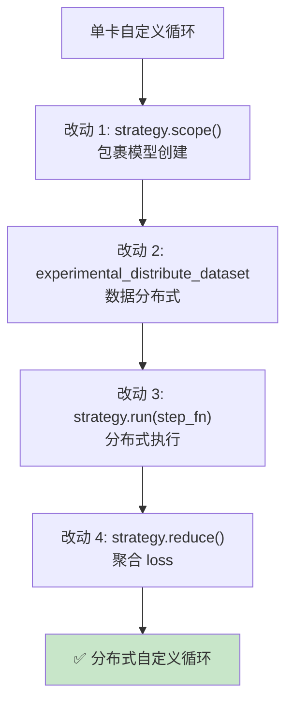
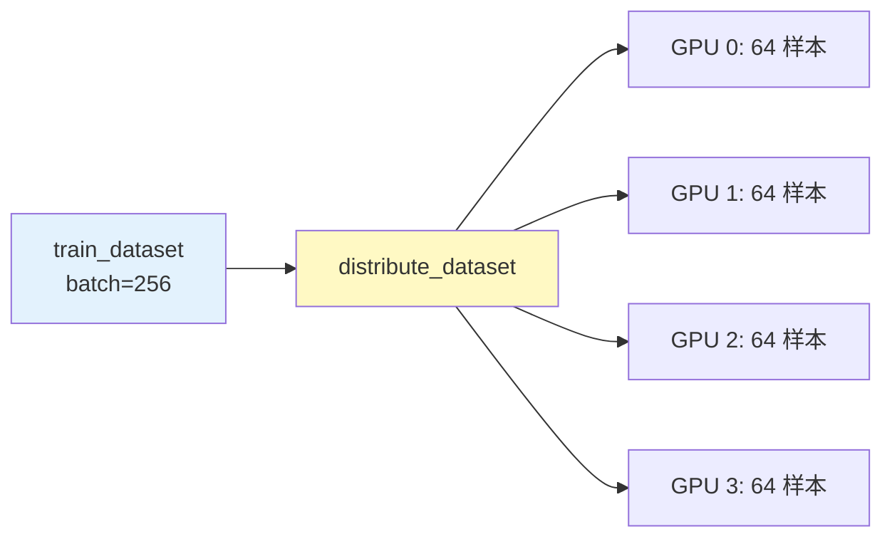
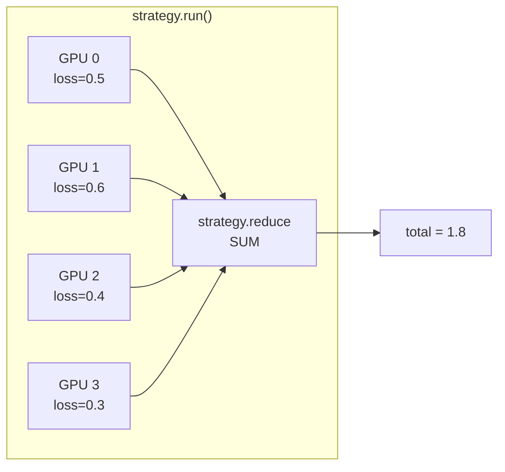
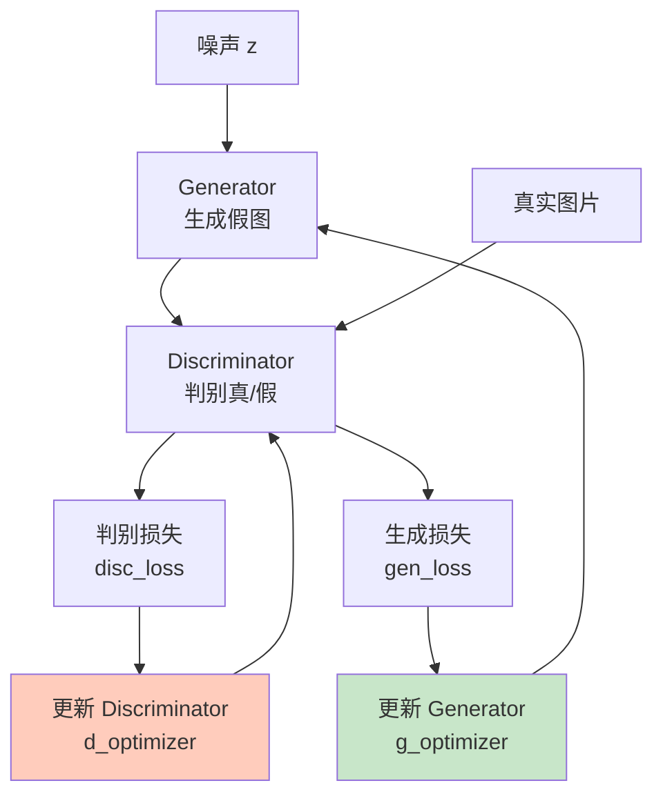

## 前置知识：从 model.fit() 到自定义循环

```python
# ===== model.fit() 自动分布式（D2/D3）=====
with strategy.scope():
    model = build_model()
    model.compile(...)
model.fit(train_dataset, epochs=10)  # 自动数据切分、梯度同步

# ===== 自定义训练循环（需要手动处理）=====
with strategy.scope():
    model = build_model()
    optimizer = tf.keras.optimizers.Adam()

train_dist_dataset = strategy.experimental_distribute_dataset(train_dataset)

for epoch in range(10):
    for batch in train_dist_dataset:
        strategy.run(train_step, args=(batch,))  # 分布式执行
```

> [!important] 为什么需要自定义训练循环
> - `model.fit()` 足够日常使用
> - 自定义循环让你：自定义损失函数、动态调整学习率、多任务学习、**GAN 训练**（两个模型交替更新）、**对比学习**

---

## 一、分布式自定义循环的 4 个关键改动



### 1.1 单卡 vs 分布式代码对比

```python
# ============================================
# 单卡自定义训练循环（主路径 03 学过）
# ============================================
model = build_model()
optimizer = tf.keras.optimizers.Adam()
loss_fn = tf.keras.losses.SparseCategoricalCrossentropy()

@tf.function
def train_step(x, y):
    with tf.GradientTape() as tape:
        predictions = model(x, training=True)
        loss = loss_fn(y, predictions)
    gradients = tape.gradient(loss, model.trainable_variables)
    optimizer.apply_gradients(zip(gradients, model.trainable_variables))
    return loss

for epoch in range(10):
    for x, y in train_dataset:
        loss = train_step(x, y)
```

```python
# ============================================
# 分布式自定义训练循环（4 处改动）
# ============================================
import tensorflow as tf

# 改动 0：创建策略
strategy = tf.distribute.MirroredStrategy()
n = strategy.num_replicas_in_sync
global_batch_size = 64 * n  # 全局 batch_size

# 改动 1：在 scope 内创建模型和优化器
with strategy.scope():
    model = build_model()
    optimizer = tf.keras.optimizers.Adam(0.001 * n)  # 学习率缩放
    # 关键：reduction 必须设为 NONE
    loss_fn = tf.keras.losses.SparseCategoricalCrossentropy(
        reduction=tf.keras.losses.Reduction.NONE
    )

# 改动 2：分布式数据
train_dataset = tf.data.Dataset.from_tensor_slices((x_train, y_train))
train_dataset = train_dataset.shuffle(10000).batch(global_batch_size, drop_remainder=True)
train_dist_dataset = strategy.experimental_distribute_dataset(train_dataset)

# 定义单步训练函数
@tf.function
def train_step(inputs):
    x, y = inputs
    with tf.GradientTape() as tape:
        predictions = model(x, training=True)
        per_example_loss = loss_fn(y, predictions)
        # 用 global_batch_size 计算平均 loss
        loss = tf.nn.compute_average_loss(
            per_example_loss,
            global_batch_size=global_batch_size
        )
    gradients = tape.gradient(loss, model.trainable_variables)
    # 梯度自动 AllReduce（strategy.run 内部处理）
    optimizer.apply_gradients(zip(gradients, model.trainable_variables))
    return loss

# 改动 3+4：分布式执行 + 聚合
@tf.function
def distributed_train_step(dist_inputs):
    per_replica_losses = strategy.run(train_step, args=(dist_inputs,))
    return strategy.reduce(
        tf.distribute.ReduceOp.SUM,
        per_replica_losses,
        axis=None
    )

# 训练循环
for epoch in range(10):
    total_loss = 0.0
    num_batches = 0
    for dist_inputs in train_dist_dataset:
        loss = distributed_train_step(dist_inputs)
        total_loss += loss
        num_batches += 1
    print(f"Epoch {epoch+1}, Loss: {total_loss / num_batches:.4f}")
```

---

## 二、关键概念详解

### 2.1 DistributedDataset

```python
# 原始数据：batch_size = 256
dataset = tf.data.Dataset.from_tensor_slices((x, y)).batch(256)

# 分布式数据：自动切分给每个 replica
# 4 卡 → 每卡 64 个样本
dist_dataset = strategy.experimental_distribute_dataset(dataset)

for dist_inputs in dist_dataset:
    # dist_inputs 是 PerReplica 对象
    # strategy.run 内部把每份数据分发到对应 GPU
    distributed_train_step(dist_inputs)
```



> [!warning] batch_size 不能被整除时
> - `global_bs = 256, n = 4` → 每卡 64 ✅
> - `global_bs = 250, n = 4` → 最后一卡不完整 ❌
> - 用 `drop_remainder=True` 避免错误

### 2.2 strategy.run()

```python
# step_fn 在每张卡上独立执行
per_replica_losses = strategy.run(train_step, args=(dist_inputs,))

# per_replica_losses 是 PerReplica 对象：
# PerReplica{
#     replica:0: loss_0,   # GPU 0 的 loss
#     replica:1: loss_1,   # GPU 1 的 loss
#     replica:2: loss_2,   # GPU 2 的 loss
#     replica:3: loss_3,   # GPU 3 的 loss
# }
```

### 2.3 strategy.reduce()

```python
# reduce 把多个 replica 的值聚合
# ReduceOp.SUM: 求和
# ReduceOp.MEAN: 求平均

total_loss = strategy.reduce(
    tf.distribute.ReduceOp.SUM,
    per_replica_losses,
    axis=None
)
# total_loss = loss_0 + loss_1 + loss_2 + loss_3
```



### 2.4 梯度同步是自动的

```python
# strategy.run 内部自动做 AllReduce：
# 1. 每张卡计算梯度
# 2. AllReduce 梯度求平均
# 3. 每张卡用平均梯度更新参数
# 用户不需要手动同步！
```

> [!important] 关键细节
> - `loss_fn` 的 `reduction` 必须设为 `NONE`（分布式下不自动平均）
> - 用 `tf.nn.compute_average_loss(per_example_loss, global_batch_size=...)` 手动加权
> - **不要**用 `per_gpu_batch_size`，否则 loss 会被放大 N 倍

---

## 三、分布式指标聚合

```python
with strategy.scope():
    model = build_model()
    optimizer = tf.keras.optimizers.Adam()
    loss_fn = tf.keras.losses.SparseCategoricalCrossentropy(reduction='none')
    # 指标也必须在 scope 内创建
    train_accuracy = tf.keras.metrics.SparseCategoricalAccuracy(name='train_acc')

@tf.function
def train_step(inputs):
    x, y = inputs
    with tf.GradientTape() as tape:
        predictions = model(x, training=True)
        per_example_loss = loss_fn(y, predictions)
        loss = tf.nn.compute_average_loss(per_example_loss, global_batch_size=global_bs)
    gradients = tape.gradient(loss, model.trainable_variables)
    optimizer.apply_gradients(zip(gradients, model.trainable_variables))
    # 更新指标（自动跨 replica 聚合）
    train_accuracy.update_state(y, predictions)
    return loss

@tf.function
def distributed_train_step(dist_inputs):
    per_replica_losses = strategy.run(train_step, args=(dist_inputs,))
    return strategy.reduce(tf.distribute.ReduceOp.SUM, per_replica_losses, axis=None)

# 训练循环
for epoch in range(10):
    train_accuracy.reset_state()  # 每个 epoch 重置（Keras 2 旧版 API 为 reset_states()）
    for dist_inputs in train_dist_dataset:
        loss = distributed_train_step(dist_inputs)
    print(f"Epoch {epoch+1}, Loss: {loss:.4f}, Acc: {train_accuracy.result():.4f}")
```

> [!important] 指标聚合
> - `tf.keras.metrics` 的指标**自动跨 replica 聚合**
> - `update_state()` 在每张卡上调用，内部自动求和
> - `result()` 返回聚合后的结果
> - 每个 epoch 开始前要 `reset_state()`（Keras 2 旧版为 `reset_states()`）

---

## 四、model.fit() vs 自定义训练循环

| 维度 | model.fit() | 自定义训练循环 |
|------|-------------|---------------|
| 分布式 | 自动 | 手动 `strategy.run()` |
| 梯度聚合 | 自动 | 自动（strategy.run 内部） |
| Loss 聚合 | 自动 | 手动 `strategy.reduce()` |
| 指标 | 自动 | 手动 `update_state()` + `result()` |
| 回调 | 支持 | 需手动实现 |
| 灵活性 | 低 | 高 |
| 代码量 | 少 | 多 |
| 适用场景 | 90% 日常训练 | 研究/特殊需求（GAN/对比学习） |

---

## 五、GAN 分布式训练实战

```python
# ============================================
# GAN 分布式训练（两个模型交替更新）
# 这是自定义循环最能发挥优势的场景
# ============================================
import tensorflow as tf

strategy = tf.distribute.MirroredStrategy()
n = strategy.num_replicas_in_sync

with strategy.scope():
    generator = build_generator()       # 生成器
    discriminator = build_discriminator()  # 判别器
    g_optimizer = tf.keras.optimizers.Adam(0.0002)
    d_optimizer = tf.keras.optimizers.Adam(0.0002)
    cross_entropy = tf.keras.losses.BinaryCrossentropy(
        from_logits=True, reduction=tf.keras.losses.Reduction.NONE
    )

def generator_loss(fake_output):
    """生成器希望判别器把假图判为真"""
    return cross_entropy(tf.ones_like(fake_output), fake_output)

def discriminator_loss(real_output, fake_output):
    """判别器希望真图判真、假图判假"""
    real_loss = cross_entropy(tf.ones_like(real_output), real_output)
    fake_loss = cross_entropy(tf.zeros_like(fake_output), fake_output)
    return real_loss + fake_loss

@tf.function
def train_step(images):
    def step_fn(images):
        noise = tf.random.normal([tf.shape(images)[0], 100])

        with tf.GradientTape() as gen_tape, tf.GradientTape() as disc_tape:
            generated_images = generator(noise, training=True)

            real_output = discriminator(images, training=True)
            fake_output = discriminator(generated_images, training=True)

            gen_loss = generator_loss(fake_output)
            disc_loss = discriminator_loss(real_output, fake_output)

        gen_grads = gen_tape.gradient(gen_loss, generator.trainable_variables)
        disc_grads = disc_tape.gradient(disc_loss, discriminator.trainable_variables)

        g_optimizer.apply_gradients(zip(gen_grads, generator.trainable_variables))
        d_optimizer.apply_gradients(zip(disc_grads, discriminator.trainable_variables))

        return gen_loss, disc_loss

    # 分布式执行
    per_replica = strategy.run(step_fn, args=(images,))
    # 返回 PerReplica(gen_loss, disc_loss)
    gen_loss = strategy.reduce(tf.distribute.ReduceOp.SUM, per_replica[0], axis=None)
    disc_loss = strategy.reduce(tf.distribute.ReduceOp.SUM, per_replica[1], axis=None)
    return gen_loss, disc_loss

# 训练
train_dist_dataset = strategy.experimental_distribute_dataset(train_dataset)
for epoch in range(100):
    for images in train_dist_dataset:
        gen_loss, disc_loss = train_step(images)
    print(f"Epoch {epoch+1}, G Loss: {gen_loss:.4f}, D Loss: {disc_loss:.4f}")
```



> [!important] 为什么 GAN 必须用自定义循环
> - 两个模型交替更新，`model.fit()` 无法表达
> - 生成器和判别器的梯度分别计算、分别更新
> - 需要两个 GradientTape 同时记录

---

## 六、练习

> [!exercise] 🟢 基础：把自定义循环迁移到 MirroredStrategy
> **目标**：用 strategy.scope + strategy.run 改造单卡 MNIST 自定义循环。
>
> ```python
> strategy = tf.distribute.MirroredStrategy()
> with strategy.scope():
>     model = build_model()
>     optimizer = tf.keras.optimizers.Adam()
>     loss_fn = tf.keras.losses.SparseCategoricalCrossentropy(reduction='none')
>
> dist_dataset = strategy.experimental_distribute_dataset(dataset)
>
> @tf.function
> def distributed_train_step(dist_inputs):
>     per_replica_losses = strategy.run(train_step, args=(dist_inputs,))
>     return strategy.reduce(tf.distribute.ReduceOp.SUM, per_replica_losses, axis=None)
> ```
>
> **验收标准**：
> - [ ] 模型和优化器在 scope 内创建
> - [ ] 用 strategy.run 执行 train_step
> - [ ] 用 strategy.reduce 聚合 loss

> [!exercise] 🟡 进阶：添加评估循环
> **目标**：添加分布式评估循环，计算验证集准确率。
>
> <details>
> <summary>🔑 参考答案</summary>
>
> ```python
> @tf.function
> def test_step(inputs):
>     x, y = inputs
>     predictions = model(x, training=False)
>     loss = loss_fn(y, predictions)
>     acc = tf.keras.metrics.sparse_categorical_accuracy(y, predictions)
>     return loss, acc
>
> @tf.function
> def distributed_test_step(dist_inputs):
>     per_replica = strategy.run(test_step, args=(dist_inputs,))
>     loss = strategy.reduce(tf.distribute.ReduceOp.SUM, per_replica[0], axis=None)
>     acc = strategy.reduce(tf.distribute.ReduceOp.MEAN, per_replica[1], axis=None)
>     return loss, acc
> ```
>
> </details>

> [!exercise] 🔴 挑战：分布式梯度累积
> **目标**：在分布式自定义循环中实现梯度累积（等效大 batch）。
>
> <details>
> <summary>🔑 参考答案</summary>
>
> ```python
> accum_steps = 4
> # ② global_batch_size = per_gpu_bs × num_replicas（不含 accum_steps！）
> global_batch_size = 64 * strategy.num_replicas_in_sync
>
> # 累积器（每步跨副本累加梯度；在 strategy.scope() 内创建，trainable=False）
> with strategy.scope():
>     accum_vars = [tf.Variable(tf.zeros_like(v), trainable=False)
>                   for v in model.trainable_variables]
>     step_count = tf.Variable(0, trainable=False, dtype=tf.int64)
>
> @tf.function
> def train_step_accum(dist_inputs):
>     def apply_and_reset():
>         # ③ 仅每 accum_steps 步执行：用累积梯度更新参数，然后清零累积器
>         optimizer.apply_gradients(zip(accum_vars, model.trainable_variables))
>         for a in accum_vars:
>             a.assign(tf.zeros_like(a))
>
>     def no_op():
>         pass
>
>     def step_fn(inputs):
>         x, y = inputs
>         with tf.GradientTape() as tape:
>             predictions = model(x, training=True)
>             per_example_loss = loss_fn(y, predictions)
>             # ① 每样本损失 ÷ global_batch_size（compute_average_loss）→ 全局平均 loss
>             loss = tf.nn.compute_average_loss(
>                 per_example_loss, global_batch_size=global_batch_size)
>         grads = tape.gradient(loss, model.trainable_variables)
>         # 梯度先跨副本 AllReduce 求平均（SUM；①的归一使各副本之和=全局平均），
>         # 再 ÷ accum_steps 累加（各副本累加相同的值 → 累积器镜像自动同步）
>         grads = tf.distribute.get_replica_context().all_reduce(
>             tf.distribute.ReduceOp.SUM, grads)
>         for a, g in zip(accum_vars, grads):
>             a.assign_add(g / accum_steps)
>         step_count.assign_add(1)
>         # ④ 每 accum_steps 步才 apply_gradients 并清零：等效大 batch、更新频率 ÷ N
>         tf.cond(tf.equal(step_count % accum_steps, 0), apply_and_reset, no_op)
>         return loss
>
>     per_replica_losses = strategy.run(step_fn, args=(dist_inputs,))
>     return strategy.reduce(tf.distribute.ReduceOp.SUM, per_replica_losses, axis=None)
>
> # 训练循环：持续读新 batch（不要对同一批数据 for 循环 N 次重复训练！）
> for dist_inputs in train_dist_dataset:
>     train_step_accum(dist_inputs)
> ```
>
> </details>

---

## 七、常见陷阱

| # | 陷阱 | 正确做法 |
|---|------|---------|
| 1 | 优化器在 scope 外创建 | 优化器也必须在 `strategy.scope()` 内 |
| 2 | loss_fn reduction 设 auto | 分布式必须用 `Reduction.NONE` + 手动加权 |
| 3 | 忘记 strategy.reduce | per_replica_loss 是多卡各自的 loss，需聚合 |
| 4 | batch_size 不能被整除 | 用 `drop_remainder=True` |
| 5 | 在 train_step 里用 Python 逻辑 | train_step 必须是纯 TF 操作（@tf.function） |
| 6 | 用 per_gpu_batch_size 算 loss | 必须用 global_batch_size（否则 loss 放大 N 倍） |
| 7 | 忘记 reset_state() | 每个 epoch 开始前重置指标 |

---

*前置：[[D3-MultiWorker 多机多卡]]*
*后续：[[D5-大模型策略]]*
*关联：[[03-传统ML模型迁移]]（自定义训练循环）*
*回总览：[[D0-分布式训练 路径总览]]*
