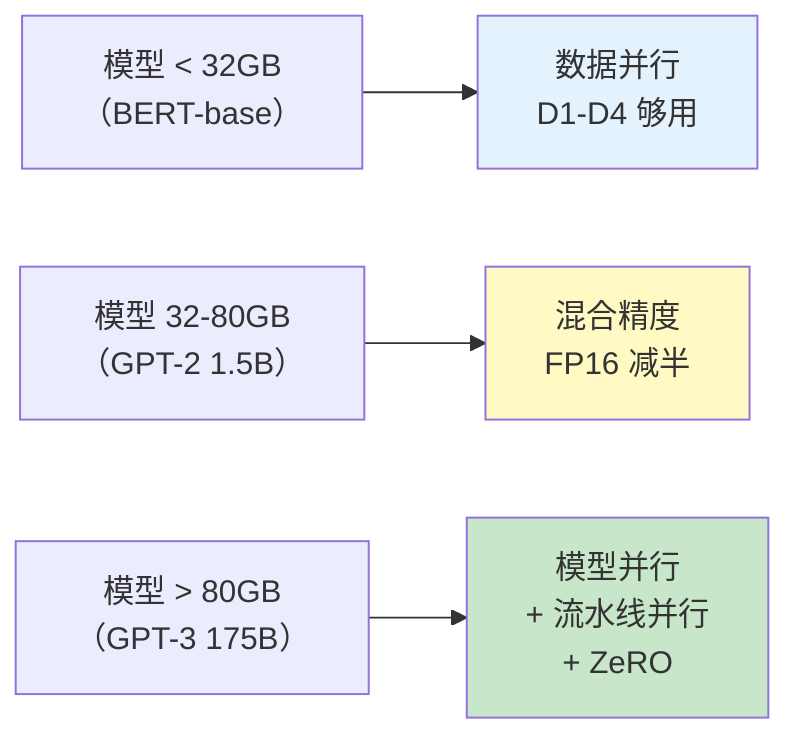
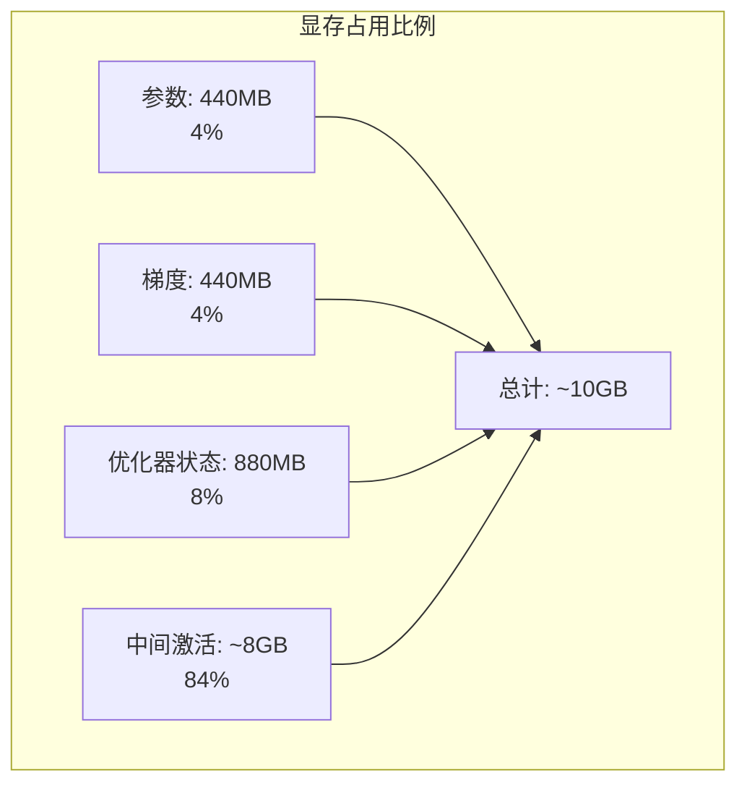
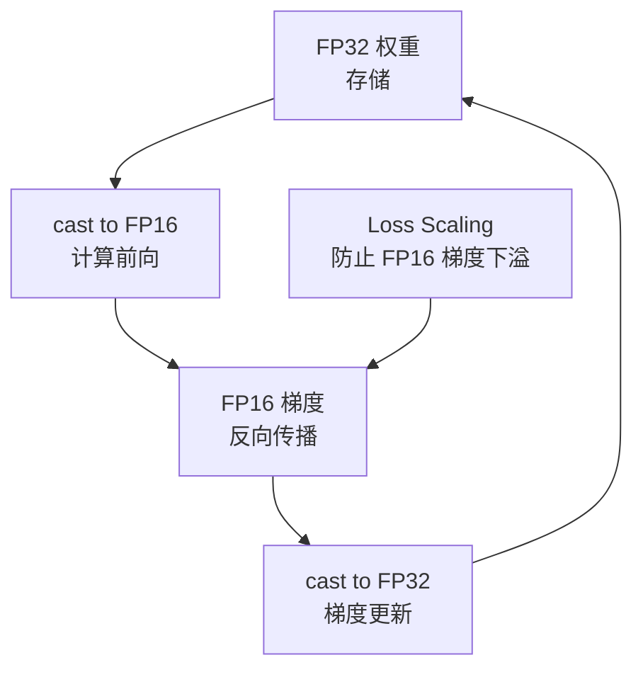
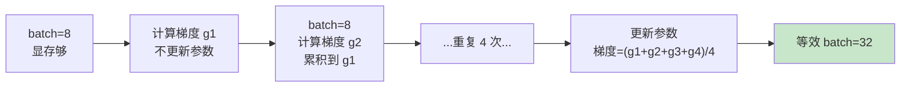
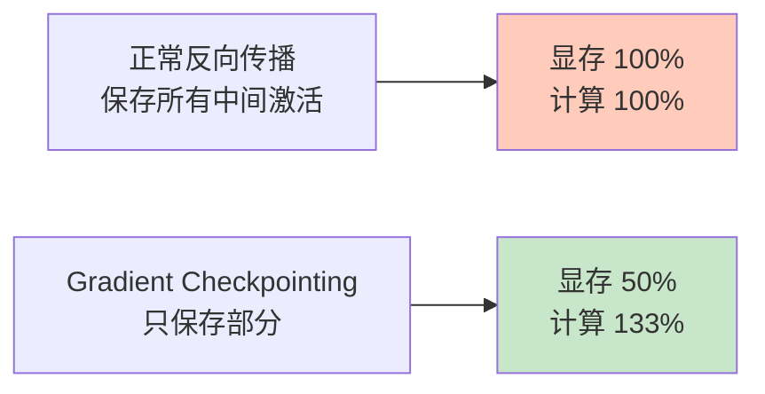
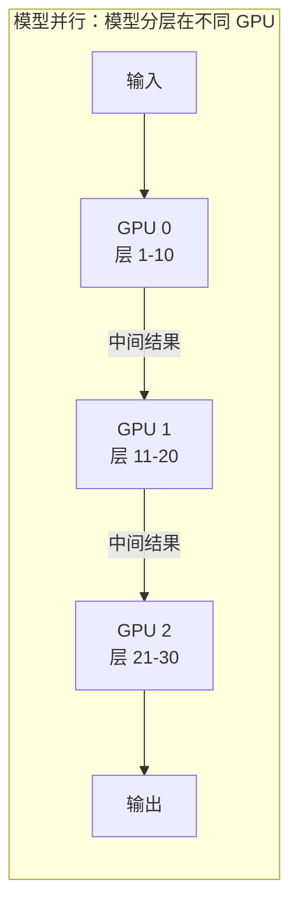
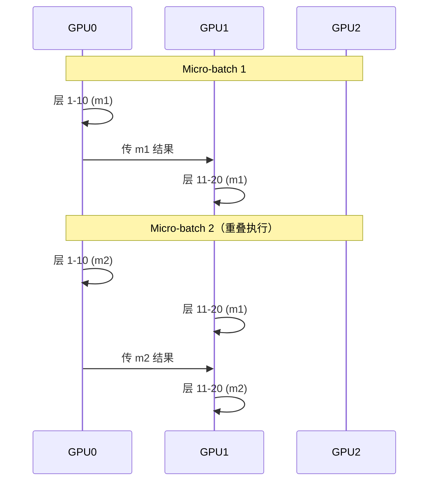
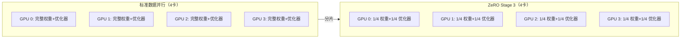
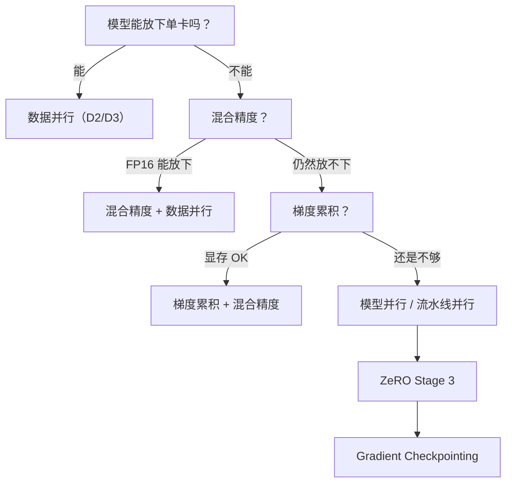

## 前置知识：为什么数据并行不够了

```python
# BERT-base: 110M 参数 → ~2.2GB（FP32 训练状态口径；权重本身仅 ~0.44GB）→ 单卡可训练
# BERT-large: 340M 参数 → ~5.4GB（训练状态口径）→ 单卡可训练
# GPT-2 1.5B: ~24GB（FP32 + Adam 训练状态，≈16 bytes/param）→ V100 32GB 勉强
# GPT-3 175B: 权重 ~700GB（FP32）、训练状态 ~2.8TB → 8×A100(80GB) 连权重都放不下，
#             需要数百卡 + 模型并行/流水线并行/ZeRO
```



> [!important] 大模型训练的六大策略
> 1. **混合精度**：FP16 计算 + FP32 存储 → 显存减半 + 加速
> 2. **梯度累积**：多次小 batch 累积 → 等效大 batch → 省显存
> 3. **梯度检查点**：不保存中间激活，反向时重算 → 用计算换显存
> 4. **模型并行**：模型不同层放不同卡
> 5. **流水线并行**：模型分层 + micro-batch 流水线
> 6. **ZeRO**：优化器状态/梯度/参数分片

---

## 一、显存占用分析

```python
# 模型训练显存 = 参数 + 梯度 + 优化器状态 + 中间激活
# 以 BERT-base（110M 参数，FP32）为例：
# 参数：110M × 4 bytes = 440MB
# 梯度：110M × 4 bytes = 440MB
# 优化器状态（Adam）：110M × 8 bytes = 880MB（mean + variance）
# 中间激活（batch=16, seq_len=512）：约 8GB
# 总显存：约 10GB

# 显存口径（训练状态，不含激活；按每参数计）：
# FP32 + Adam ≈ 16 bytes/param：参数 4 + 梯度 4 + Adam m/v 共 8
#   （上面算例 440 + 440 + 880 MB = 110M × 16 bytes，正是这个口径）
# mixed FP16 + Adam ≈ 16 bytes/param：fp16 参数 2 + fp16 梯度 2 + FP32 master 权重 4 + Adam 8
#   → 混合精度省下的主要是激活值（约减半），训练状态本身几乎不省
```



> [!important] 显存瓶颈
> - **中间激活占 80%+**：前向传播的中间结果（用于反向传播）
> - 优化方向：减少中间激活 → 梯度检查点
> - 优化方向：减少参数精度 → 混合精度

---

## 二、混合精度训练

### 2.1 原理



### 2.2 代码

```python
from tensorflow.keras import mixed_precision

# 全局策略
policy = mixed_precision.Policy('mixed_float16')
mixed_precision.set_global_policy(policy)

model = keras.Sequential([
    keras.layers.Dense(512, activation='relu'),
    keras.layers.Dense(256, activation='relu'),
    # 最后一层必须 float32（保证数值稳定）
    keras.layers.Dense(10, activation='softmax', dtype='float32'),
])
model.compile(optimizer='adam', loss='sparse_categorical_crossentropy', metrics=['accuracy'])
model.fit(train_dataset, epochs=10)
```

| 模式 | 前向/反向 | 权重存储 | 显存 | 速度 |
|------|----------|---------|------|------|
| FP32 | FP32 | FP32 | 100% | 1x |
| **Mixed FP16** | FP16 | FP32 | ~50% | ~2x |
| FP16 | FP16 | FP16 | ~50% | ~2x（可能不稳定） |
| BF16 | BF16 | BF16 | ~50% | ~2x（A100 推荐） |

> [!important] BF16 vs FP16
> | 维度 | FP16 | BF16 |
> |------|------|------|
> | 指数位 | 5 | 8 |
> | 尾数位 | 10 | 7 |
> | 动态范围 | 中 | 极大（同 float32） |
> | 下溢风险 | 有（需要 loss scaling） | 无 |
> | 支持硬件 | RTX 20+/V100/A100 | A100/TPU |
> | 推荐 | V100 | A100/TPU |

> [!warning] Loss Scaling
> - FP16 最小正数：6e-8（小于此值会变 0）
> - 小梯度在 FP16 中可能下溢为 0 → 梯度消失
> - **Loss Scaling**：把 loss 乘以大数（如 2^15），梯度也放大，反向传播后再除回去
> - TF 的 mixed_float16 策略在 **model.fit() 中自动处理** loss scaling（自动包 `LossScaleOptimizer`）
> - **自定义训练循环必须手动设置**：`optimizer = tf.keras.mixed_precision.LossScaleOptimizer(optimizer)`（见下方陷阱 5）

---

## 三、梯度累积

### 3.1 原理



### 3.2 代码

```python
accum_steps = 4  # 累积 4 步 → 等效 batch = 实际 batch × 4，参数更新频率 ÷ 4

# 累积器：跨 step 存放累加的梯度（trainable=False，本身不参与优化）
accum_vars = [tf.Variable(tf.zeros_like(v), trainable=False)
              for v in model.trainable_variables]
step_count = tf.Variable(0, trainable=False, dtype=tf.int64)

@tf.function
def train_step_accum(x, y):
    def apply_and_reset():
        # ③ 仅每 accum_steps 步执行：用累积梯度更新参数，然后清零累积器
        optimizer.apply_gradients(zip(accum_vars, model.trainable_variables))
        for a in accum_vars:
            a.assign(tf.zeros_like(a))

    def no_op():
        pass

    with tf.GradientTape() as tape:
        predictions = model(x, training=True)
        # ① loss 已对 batch 求平均（等效"每样本损失 ÷ global_batch_size"）
        loss = loss_fn(y, predictions)
    gradients = tape.gradient(loss, model.trainable_variables)
    # 关键：不调用 apply_gradients！只把"梯度 ÷ accum_steps"累加进累积器
    for a, g in zip(accum_vars, gradients):
        a.assign_add(g / accum_steps)
    step_count.assign_add(1)
    # ④ 每 accum_steps 步才 apply_gradients 并清零：等效大 batch、更新频率 ÷ N
    tf.cond(tf.equal(step_count % accum_steps, 0), apply_and_reset, no_op)
    return loss

# 训练循环：持续读新 batch（不是对同一批数据重复训练 N 次）
for epoch in range(10):
    for step, (x, y) in enumerate(train_dataset):
        loss = train_step_accum(x, y)
        if (step + 1) % accum_steps == 0:
            print(f"Step {step+1}, Loss: {loss:.4f}")
```

> [!warning] 假梯度累积 ≠ 梯度累积
> - ❌ 每步都 `apply_gradients` 且 `loss / accum_steps`：等效于"学习率 ÷ N、更新 N 次"，并不是大 batch
> - ✅ 真梯度累积：梯度累加进累积器 → 仅每 accum_steps 步 `optimizer.apply_gradients(zip(accum_vars, vars))` 并清零
> - 效果：等效大 batch（batch × N），参数更新频率 ÷ N

| 实际 batch | 累积步数 | 等效 batch | 显存需求 |
|-----------|---------|-----------|---------|
| 8 | 4 | 32 | 省 75% |
| 8 | 8 | 64 | 省 87% |
| 4 | 16 | 64 | 省 87% |

> [!important] 梯度累积的数学等价性
> - 4 次 batch=8 梯度平均 = 1 次 batch=32 梯度
> - 梯度累积在数学上等价于增大 batch_size
> - 但每次只用 batch=8 的显存 → 省显存

---

## 四、梯度检查点（Gradient Checkpointing）

```python
# 原理：
# 前向传播：不保存中间激活 → 省显存
# 反向传播：需要时重新计算前向传播 → 多用计算时间
# 显存节省：~70%（中间激活从 8GB → 2GB）
# 时间增加：~20%

# TF 中使用 tf.recompute_grad
@tf.recompute_grad
def forward(x):
    return dense1(relu(dense2(x)))

# 反向传播时会自动重新计算 forward 的中间结果
```



> [!tip] 显存优化策略排序
> | 策略 | 显存节省 | 速度影响 | 适用范围 |
> |------|---------|---------|---------|
> | 混合精度 | 50% | 快 1.5x | 所有模型 |
> | 梯度检查点 | 70% | 慢 20% | 深层模型 |
> | 梯度累积 | 随步数增加 | 慢（有效步数少） | 所有模型 |
> | 减少 batch | 随 batch 减小 | 收敛变慢 | 所有模型 |

---

## 五、模型并行与流水线并行

### 5.1 模型并行



```python
# TF 手动模型并行
with tf.device('/GPU:0'):
    layer1 = tf.keras.layers.Dense(1024)
    layer2 = tf.keras.layers.Dense(1024)

with tf.device('/GPU:1'):
    layer3 = tf.keras.layers.Dense(1024)
    layer4 = tf.keras.layers.Dense(1024)

# 前向传播
x = layer1(inputs)
x = layer2(x)  # 中间结果从 GPU 0 传到 GPU 1
x = layer3(x)
x = layer4(x)
```

> [!warning] 模型并行的问题
> - **GPU 空闲**：GPU 1 等 GPU 0 算完才开始 → 利用率只有 50%
> - **解决方案**：Pipeline Parallelism（流水线并行）

### 5.2 流水线并行（Pipeline Parallelism）

把数据分成多个 micro-batch，模型分层在不同 GPU，不同层同时处理不同 micro-batch。



> [!important] 流水线并行的效率
> - 理想情况：GPU 利用率接近 100%
> - 实际：存在 "bubble"（流水线气泡）— 第一批/最后一批 GPU 空闲
> - 优化：增大 micro-batch 数量，减少气泡占比

> [!warning] TF 原生不支持 Pipeline Parallelism
> - TF 的 `tf.distribute` 主要支持**数据并行**
> - Pipeline Parallelism 需要手动实现或用 Mesh TensorFlow
> - PyTorch 生态的 DeepSpeed 提供更完善的支持

---

## 六、ZeRO 优化器



| ZeRO 阶段 | 切分内容 | 显存节省 | 通信开销 |
|----------|---------|---------|---------|
| 标准数据并行 | 无 | 0 | AllReduce 梯度 |
| ZeRO-1 | 优化器状态 | ~4x | + AllGather 参数 |
| ZeRO-2 | + 梯度 | ~8x | + AllGather 参数 |
| ZeRO-3 | + 参数 | ~Nx | + AllGather 参数（最大） |

> [!important] TF 中的 ZeRO
> - TF 原生不直接支持 ZeRO
> - 替代方案：`tf.distribute.experimental.CentralStorageStrategy`（部分分片）
> - 更成熟方案：DeepSpeed（PyTorch 生态），Mesh TensorFlow

---

## 七、技术选型决策树



| 模型规模 | 显存需求 | 推荐策略 | 工具 |
|---------|---------|---------|------|
| 100M-500M | 2-10 GB | 混合精度 + 数据并行 | TF MirroredStrategy |
| 500M-2B | 10-40 GB | 混合精度 + 梯度累积 | TF + 8×A100 |
| 2B-10B | 40-200 GB | 流水线并行 | Mesh TF / DeepSpeed |
| 10B+ | 200GB+ | ZeRO + 张量并行 + 流水线 | DeepSpeed / Megatron |

---

## 八、练习

> [!exercise] 🟢 基础：启用混合精度
> **目标**：在 MirroredStrategy 下启用 mixed_float16，训练 MNIST，对比显存。
>
> ```python
> from tensorflow.keras import mixed_precision
> mixed_precision.set_global_policy('mixed_float16')
> # 最后一层 dtype='float32'
> ```
>
> **验收标准**：
> - [ ] 训练正常，精度接近 FP32 版本
> - [ ] 显存占用明显降低

> [!exercise] 🟡 进阶：实现梯度累积
> **目标**：在自定义训练循环中实现 4 步梯度累积（accum_steps=4）。
>
> <details>
> <summary>🔑 参考答案</summary>
>
> ```python
> accum_steps = 4
> # 真累积：梯度累加进累积器，每 N 步才 apply_gradients 一次并清零
> accum_vars = [tf.Variable(tf.zeros_like(v), trainable=False)
>               for v in model.trainable_variables]
> step_count = tf.Variable(0, trainable=False, dtype=tf.int64)
>
> @tf.function
> def train_step(x, y):
>     def apply_and_reset():
>         optimizer.apply_gradients(zip(accum_vars, model.trainable_variables))
>         for a in accum_vars:
>             a.assign(tf.zeros_like(a))
>     def no_op():
>         pass
>     with tf.GradientTape() as tape:
>         loss = loss_fn(y, model(x, training=True))  # 已对 batch 平均
>     grads = tape.gradient(loss, model.trainable_variables)
>     for a, g in zip(accum_vars, grads):
>         a.assign_add(g / accum_steps)   # 只累加，不 apply_gradients
>     step_count.assign_add(1)
>     tf.cond(tf.equal(step_count % accum_steps, 0), apply_and_reset, no_op)
>     return loss
> ```
>
> </details>

> [!exercise] 🔴 挑战：设计大模型训练方案
> **目标**：设计训练 GPT-2 1.5B 的分布式方案（8×V100 32GB）。
>
> <details>
> <summary>🔑 参考答案</summary>
>
> ```
> GPT-2 1.5B（按"训练状态 ≈ 16 bytes/param"口径重算）：
> FP32 + Adam：参数 6 + 梯度 6 + Adam m/v 12 = 24GB
> mixed FP16 + Adam：fp16 参数 3 + fp16 梯度 3 + FP32 master 权重 6 + Adam 12 ≈ 24GB
>   （混合精度省的主要是激活值；训练状态两种口径都 ≈ 16 bytes/param）
> 单卡 V100 32GB：训练状态就占 24GB，激活值空间极小 → 非常勉强
> 方案：混合精度 + 8 卡 MirroredStrategy + 梯度累积 + 梯度检查点（压激活）
> 有效 batch = 8 卡 × 每卡 micro-batch × 累积步数（如 1 × 8 × 8 = 64）
> ```
>
> </details>

---

## 九、常见陷阱

| # | 陷阱 | 正确做法 |
|---|------|---------|
| 1 | 混合精度最后一层不是 fp32 | 输出层必须 `dtype='float32'` |
| 2 | 梯度累积忘记除以步数 | `loss = loss / accumulation_steps` |
| 3 | 只优化参数不优化中间激活 | 梯度检查点专门优化中间激活 |
| 4 | 大模型用数据并行 | 模型放不下用模型并行/ZeRO |
| 5 | 混合精度不缩 loss | 用 `LossScaleOptimizer` 防止下溢 |
| 6 | 期望 N 卡线性加速 | 通信开销限制在 70-90% |
| 7 | 以为 TF 原生支持 ZeRO | TF 不支持，需 DeepSpeed |

---

*前置：[[D4-自定义训练循环分布式]]*
*后续：[[D6-TPU 训练]]*
*关联：[[T5-BERT 双向预训练与微调]]（BERT 训练）*
*回总览：[[D0-分布式训练 路径总览]]*
