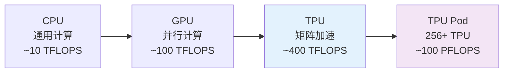
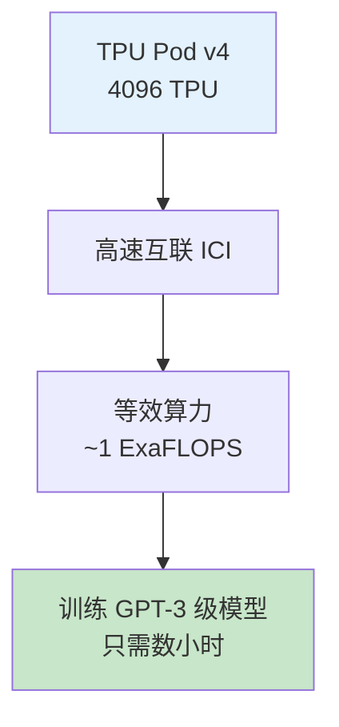
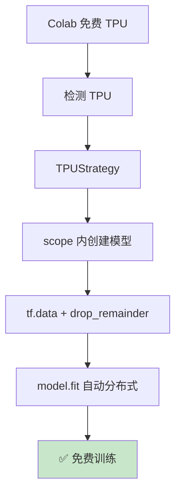

## 前置知识：TPU 是什么



> [!important] TPU 的三个特点
> 1. **专为矩阵乘法设计**：深度学习的核心运算
> 2. **bfloat16**：比 FP16 动态范围更大，训练更稳定
> 3. **高速互联**：TPU Pod 内 TPU 间带宽极高

---

## 一、TPU 架构

### 1.1 TPU vs GPU

| 维度 | GPU（V100） | TPU（v3 单芯片） | TPU（v4 单芯片） |
|------|------------|-----------|-----------|
| 设计目标 | 通用并行计算 | 深度学习矩阵乘法 | 最新一代 |
| BF16/FP16 TFLOPS（峰值） | 125 | 123 | 275 |
| 显存 | 32GB HBM | 16GB HBM | 32GB HBM |
| 互联 | NVLink (600GB/s) | ICI (极高带宽) | 更高 |
| 编程 | CUDA | XLA + TF | XLA + TF |
| 可用性 | 购买/云 | Google Cloud / Colab | GCP |

### 1.2 TPU 版本

| 版本 | 年份 | 算力 | 显存 | 特点 |
|------|------|------|------|------|
| TPU v2 | 2017 | 45 TFLOPS | 8GB | 第一代 |
| TPU v3 | 2018 | 123 TFLOPS | 16GB | 液冷 |
| TPU v4 | 2021 | 275 TFLOPS | 32GB | 互联大幅提升 |
| TPU v5p | 2023 | 456 TFLOPS | 48GB | 训练大模型 |

> [!note] 口径说明
> - 上表两张规格表均为**单芯片**口径（v3 单芯 16GB / 123 TFLOPS BF16 峰值）
> - v3-8 **整机**：8 核、显存 8×16GB = 128GB、BF16 峰值约 420 TFLOPS
> - 与 GPU 对比时注意口径一致（单芯 vs 整机 vs 单卡）

### 1.3 TPU Pod



---

## 二、TPUStrategy 实战

### 2.1 Colab 免费 TPU 初始化

```python
import tensorflow as tf

# 1. 检测 TPU
try:
    resolver = tf.distribute.cluster_resolver.TPUClusterResolver()
    print(f"Connected to TPU at {resolver.master()}")
    tf.config.experimental_connect_to_cluster(resolver)
    tf.tpu.experimental.initialize_tpu_system(resolver)
    strategy = tf.distribute.TPUStrategy(resolver)
    print(f"TPU cores: {strategy.num_replicas_in_sync}")  # 8
except ValueError:
    print("TPU not found, using default strategy")
    strategy = tf.distribute.get_strategy()
```

> [!warning] Colab TPU 使用注意
> 1. 在 Colab 中选择 Runtime → Change runtime type → TPU
> 2. TPU 初始化代码**必须在程序最开头**
> 3. TPU 不能流式读本地磁盘文件，流式数据需放 GCS（小数据用 from_tensor_slices 嵌入计算图也可以）

### 2.2 完整训练代码

```python
# 2. 在 scope 内创建模型
with strategy.scope():
    model = tf.keras.Sequential([
        tf.keras.layers.Conv2D(32, 3, activation='relu', input_shape=(28, 28, 1)),
        tf.keras.layers.MaxPooling2D(),
        tf.keras.layers.Flatten(),
        tf.keras.layers.Dense(128, activation='relu'),
        tf.keras.layers.Dense(10, activation='softmax'),
    ])
    model.compile(
        optimizer='adam',
        loss='sparse_categorical_crossentropy',
        metrics=['accuracy'],
    )

# 3. 数据加载（TPU 特殊要求！）
batch_size = 128 * strategy.num_replicas_in_sync  # 128 × 8 = 1024

train_ds = (
    tf.data.Dataset.from_tensor_slices((x_train, y_train))
    .shuffle(10000)
    .batch(batch_size, drop_remainder=True)  # 关键！
    .prefetch(tf.data.AUTOTUNE)
)

# 4. 训练
model.fit(train_ds, epochs=10)
```



> [!important] TPU 数据加载的三个特殊要求
> 1. **drop_remainder=True**：TPU 要求固定形状（静态图）
> 2. **batch_size 是核心数的倍数**：8 核 TPU → batch 是 8 的倍数
> 3. **流式数据在 GCS**：TPU 无法直接访问本地文件系统（流式读文件需放 GCS）；小数据经 `from_tensor_slices`（嵌入计算图）也可

### 2.3 bfloat16

```python
# TPU 原生支持 bfloat16（比 float16 动态范围更大）
policy = tf.keras.mixed_precision.Policy('mixed_bfloat16')
tf.keras.mixed_precision.set_global_policy(policy)

with strategy.scope():
    model = tf.keras.Sequential([
        tf.keras.layers.Dense(512, activation='relu'),
        tf.keras.layers.Dense(10, activation='softmax', dtype='float32'),
    ])
```

> [!tip] bfloat16 vs float16
> | 格式 | 指数位 | 尾数位 | 动态范围 | 精度 |
> |------|--------|--------|---------|------|
> | float32 | 8 | 23 | 极大 | 极高 |
> | float16 | 5 | 10 | 中 | 中 |
> | bfloat16 | 8 | 7 | 极大（同 float32） | 低 |
>
> bfloat16 的好处：**不需要 loss scaling**（动态范围足够大）

---

## 三、TPU 数据管道

```python
# 推荐的 TPU 数据加载方式（从 GCS 读取 TFRecord）
AUTO = tf.data.AUTOTUNE
batch_size = 128 * strategy.num_replicas_in_sync  # 1024

dataset = (
    tf.data.TFRecordDataset(
        tf.io.gfile.glob('gs://bucket/train/*.tfrecord'),
        num_parallel_reads=AUTO,
    )
    .map(parse_fn, num_parallel_calls=AUTO)
    .cache()
    .shuffle(10000)
    .batch(batch_size, drop_remainder=True)
    .prefetch(AUTO)
)
```


| 维度 | GPU | TPU |
|------|-----|-----|
| 数据格式 | NumPy/TFRecord 均可 | tf.data 管道；流式读文件需 GCS 上的 TFRecord，内存数组 from_tensor_slices 也可 |
| drop_remainder | 可选 | 必须 True |
| 数据来源 | 本地磁盘 | GCS（推荐） |
| 并行读取 | 可选 | 必须 |
| prefetch | 推荐 | 必须 |

---

## 四、TPU vs GPU 选型

| 场景 | 推荐 | 原因 |
|------|------|------|
| 小模型 + 小数据 | GPU | TPU 启动开销大 |
| 大模型 + 大数据 | TPU | 矩阵乘法快 |
| NLP（BERT/GPT 训练） | TPU | Google 用 TPU 训练 BERT |
| CV（ResNet） | TPU | 卷积计算密集 |
| 原型开发 | GPU | 灵活，易调试 |
| Colab 免费训练 | TPU | 免费 TPU v2 |
| 本地/私有云 | GPU | TPU 只在 Google Cloud |
| 强化学习 | GPU | 环境交互频繁 |

---

## 五、练习

> [!exercise] 🟢 基础：Colab TPU 训练 MNIST
> **目标**：在 Google Colab 上用免费 TPU 训练 MNIST 分类器。
>
> ```python
> # 1. 打开 Colab → 运行时 → 更改运行时类型 → TPU
> # 2. 运行上面的完整代码
> # 3. 对比 GPU 和 TPU 的训练时间
> ```
>
> **验收标准**：
> - [ ] `strategy.num_replicas_in_sync` = 8
> - [ ] 训练正常收敛
> - [ ] TPU 比 GPU 快

> [!exercise] 🟡 进阶：bfloat16 + TPU
> **目标**：在 TPU 上启用 bfloat16 训练。
>
> <details>
> <summary>🔑 参考答案</summary>
> ```python
> tf.keras.mixed_precision.set_global_policy('mixed_bfloat16')
> with strategy.scope():
>     model = build_model()
> # 最后一层 dtype='float32'
> ```
> </details>

> [!exercise] 🔴 挑战：TPU 训练 BERT
> **目标**：在 TPU v3-8 上微调 BERT-base（使用 HuggingFace transformers）。
>
> <details>
> <summary>🔑 参考答案</summary>
> ```python
> from transformers import TFAutoModelForSequenceClassification  # 需 transformers<5（v5 已移除 TF 模型）
> with strategy.scope():
>     model = TFAutoModelForSequenceClassification.from_pretrained(
>         'bert-base-uncased', num_labels=2
>     )
>     model.compile(
>         optimizer=tf.keras.optimizers.Adam(2e-5),
>         loss='sparse_categorical_crossentropy',
>         metrics=['accuracy'],
>     )
> model.fit(train_dataset, epochs=3)
> ```
> </details>

---

## 六、常见陷阱

| # | 陷阱 | 正确做法 |
|---|------|---------|
| 1 | 忘记 `drop_remainder=True` | TPU 必须，否则编译失败 |
| 2 | batch_size 太小 | 全局 batch 至少 128（8 核 × 16） |
| 3 | 用 `model.fit(x, y)` 直接传 numpy | 必须用 `tf.data` 管道 |
| 4 | 模型有动态 shape | TPU 编译时 shape 必须静态 |
| 5 | 本地文件传给 TPU | 数据必须放在 GCS |
| 6 | 用 float16 而非 bfloat16 | TPU 原生支持 bfloat16 |
| 7 | 忘记 initialize_tpu_system | 每次启动必须初始化 TPU |

---

*前置：[[D5-大模型策略]]*
*后续：[[D7-分布式训练实战项目]]*
*关联：[[T5-BERT 双向预训练与微调]]（BERT + TPU）*
*回总览：[[D0-分布式训练 路径总览]]*
