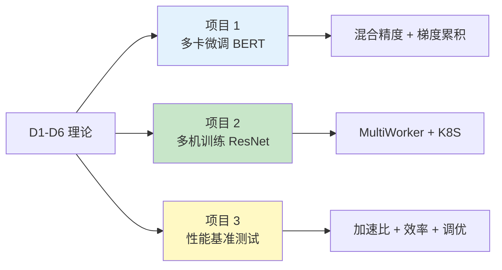

## 前置知识：三个实战项目



---

## 项目 1：多卡微调 BERT

### 1.1 场景

- 模型：`bert-base-chinese`（110M 参数）
- 任务：中文文本分类
- 环境：单机 4×V100（32GB）
- 策略：MirroredStrategy + 混合精度 + 梯度累积

### 1.2 完整代码

```python
import tensorflow as tf
from transformers import TFBertForSequenceClassification  # 需 transformers<5（v5 已移除 TF 模型）
from tensorflow.keras import mixed_precision

# 1. 策略 + 混合精度
strategy = tf.distribute.MirroredStrategy()
mixed_precision.set_global_policy('mixed_float16')
n = strategy.num_replicas_in_sync

# 2. 超参
per_gpu_bs = 8       # 每卡 batch=8（BERT 显存大）
accum_steps = 4      # 累积 4 步 → 等效 batch=128
learning_rate = 2e-5 * n  # 学习率缩放

# 3. 数据
train_ds = tf.data.Dataset.from_tensor_slices((input_ids, labels))
train_ds = train_ds.shuffle(10000)
train_ds = train_ds.batch(per_gpu_bs * n, drop_remainder=True)
train_ds = train_ds.prefetch(tf.data.AUTOTUNE)

# 4. 模型
with strategy.scope():
    model = TFBertForSequenceClassification.from_pretrained(
        'bert-base-chinese', num_labels=2
    )
    optimizer = tf.keras.optimizers.Adam(learning_rate=learning_rate)
    # 混合精度 + 自定义训练循环：必须手动包 LossScaleOptimizer（model.fit() 才会自动包）
    optimizer = tf.keras.mixed_precision.LossScaleOptimizer(optimizer)
    loss_fn = tf.keras.losses.SparseCategoricalCrossentropy(
        from_logits=True, reduction=tf.keras.losses.Reduction.NONE
    )
    # 累积器（每步跨副本累加梯度；trainable=False）
    accum_vars = [tf.Variable(tf.zeros_like(v), trainable=False)
                  for v in model.trainable_variables]
    step_count = tf.Variable(0, trainable=False, dtype=tf.int64)

# 5. 自定义训练循环（真正的梯度累积：先累加，每 accum_steps 步才更新一次）
def apply_and_reset():
    # ③ 仅每 accum_steps 步执行：用累积梯度更新参数，然后清零累积器
    optimizer.apply_gradients(zip(accum_vars, model.trainable_variables))
    for a in accum_vars:
        a.assign(tf.zeros_like(a))

def no_op():
    pass

@tf.function
def distributed_train_step(dist_inputs):
    def step_fn(inputs):
        input_ids, labels = inputs
        with tf.GradientTape() as tape:
            outputs = model(input_ids, training=True)
            per_example_loss = loss_fn(labels, outputs.logits)
            # ① 每样本损失 ÷ global_batch_size → 全局平均 loss
            # ② global_batch_size = per_gpu_bs × n = 8 × 4 = 32（不含 accum_steps！）
            loss = tf.nn.compute_average_loss(
                per_example_loss, global_batch_size=per_gpu_bs * n)
            # mixed_float16：放大 loss 防 fp16 梯度下溢
            scaled_loss = optimizer.get_scaled_loss(loss)
        scaled_grads = tape.gradient(scaled_loss, model.trainable_variables)
        # 梯度先跨副本 AllReduce 求平均（SUM；①的归一使各副本之和=全局平均），
        # 再 ÷ accum_steps 累加（各副本累加相同的值 → 累积器镜像自动同步）
        scaled_grads = tf.distribute.get_replica_context().all_reduce(
            tf.distribute.ReduceOp.SUM, scaled_grads)
        for a, g in zip(accum_vars, scaled_grads):
            a.assign_add(g / accum_steps)
        step_count.assign_add(1)
        # ④ 每 accum_steps 步才 apply_gradients 并清零：等效大 batch、更新频率 ÷ N
        # （累积的是放大后的梯度；TF 的 LossScaleOptimizer 没有 unscale_grads 方法，
        #   除回 loss scale 与溢出检查在 apply_gradients 内部自动完成）
        tf.cond(tf.equal(step_count % accum_steps, 0), apply_and_reset, no_op)
        return loss

    per_replica_losses = strategy.run(step_fn, args=(dist_inputs,))
    return strategy.reduce(tf.distribute.ReduceOp.SUM, per_replica_losses, axis=None)

# 6. 训练（持续读新 batch；每步只累加梯度，每 accum_steps 步更新一次 → 等效 batch=128）
dist_ds = strategy.experimental_distribute_dataset(train_ds)
for epoch in range(3):
    total_loss = 0
    num_batches = 0
    for dist_inputs in dist_ds:
        loss = distributed_train_step(dist_inputs)
        total_loss += loss
        num_batches += 1
    print(f"Epoch {epoch+1}, Loss: {total_loss/num_batches:.4f}")

# 7. 保存
model.save_pretrained('/model/bert_finetuned')
```

---

## 项目 2：多机训练 ResNet

### 2.1 场景

- 模型：ResNet50
- 任务：CIFAR-100 分类
- 环境：2 机 × 4 GPU = 8 GPU
- 策略：MultiWorkerMirroredStrategy

### 2.2 完整代码

```python
# train_resnet_multiworker.py
import tensorflow as tf

# 1. 策略
strategy = tf.distribute.MultiWorkerMirroredStrategy()
n = strategy.num_replicas_in_sync  # 8（2 机 × 4 GPU）

# 2. 数据（MultiWorker 默认 AutoShardPolicy.AUTO 自动分片，无需手动 shard；
#    若手动 shard，num_shards 必须是 worker 进程数，不是 GPU 总数 n）
def make_dataset():
    (x_train, y_train), _ = tf.keras.datasets.cifar100.load_data()
    x_train = x_train / 255.0
    ds = tf.data.Dataset.from_tensor_slices((x_train, y_train))
    # 手动分片：2 机 = 2 个 worker 进程 → num_shards=2（task_id 只有 0/1）
    # ❌ 用 num_shards=n(=8)：shard 只会落到 index 0/1，丢弃 3/4 的数据！
    num_workers = 2
    ds = ds.shard(
        num_shards=num_workers,
        index=strategy.cluster_resolver.task_id,
    )
    ds = ds.shuffle(10000).batch(64 * n).prefetch(tf.data.AUTOTUNE)
    return ds

# 3. 模型
with strategy.scope():
    base = tf.keras.applications.ResNet50(
        weights=None, input_shape=(32, 32, 3), classes=100
    )
    base.compile(
        optimizer=tf.keras.optimizers.SGD(learning_rate=0.1 * n, momentum=0.9),
        loss='sparse_categorical_crossentropy',
        metrics=['accuracy'],
    )

# 4. 训练
ds = make_dataset()
base.fit(ds, epochs=100)

# 5. 只有 chief 保存
if strategy.cluster_resolver.task_type == 'chief':
    base.save('/shared/model/resnet50_multiworker')
```

### 2.3 启动

```bash
# 机器 A (Chief)
TF_CONFIG='{"cluster":{"chief":["10.0.0.1:12345"],"worker":["10.0.0.2:12345"]},"task":{"type":"chief","index":0}}' python train_resnet_multiworker.py

# 机器 B (Worker)
TF_CONFIG='{"cluster":{"chief":["10.0.0.1:12345"],"worker":["10.0.0.2:12345"]},"task":{"type":"worker","index":0}}' python train_resnet_multiworker.py
```

---

## 项目 3：性能基准测试

### 3.1 基准脚本

```python
import time
import tensorflow as tf

def benchmark(strategy, model_fn, dataset_fn, epochs=3):
    """通用性能基准"""
    with strategy.scope():
        model = model_fn()
        model.compile(optimizer='adam', loss='sparse_categorical_crossentropy')

    dataset = dataset_fn()

    # warmup
    model.fit(dataset, epochs=1, verbose=0)

    # benchmark
    start = time.time()
    model.fit(dataset, epochs=epochs, verbose=0)
    elapsed = time.time() - start

    return elapsed

# 测试不同配置
configs = [
    ("CPU",    tf.distribute.get_strategy(),        1),
    ("GPU x1", tf.distribute.MirroredStrategy(),     1),
    ("GPU x4", tf.distribute.MirroredStrategy(),     4),
]

for name, strategy, expected_n in configs:
    if strategy.num_replicas_in_sync == expected_n:
        t = benchmark(strategy, build_resnet, make_cifar_dataset)
        print(f"{name}: {t:.1f}s")
```

### 3.2 预期结果

| 配置 | 时间 | 加速比 | 效率 |
|------|------|--------|------|
| CPU | ~300s | 1x | 100% |
| 1×GPU | ~30s | 10x | 100% |
| 4×GPU | ~9s | 33x | 83% |
| 8×GPU | ~5s | 60x | 75% |

---

## 调优清单

| 调优项 | 方法 | 预期提升 |
|--------|------|---------|
| batch_size | 增大至显存上限 | 计算占比↑，通信占比↓ |
| 混合精度 | mixed_float16 | 1.5-3x 加速 |
| prefetch | `dataset.prefetch(AUTOTUNE)` | 10-20% |
| steps_per_execution | `model.compile(..., steps_per_execution=10~50)` | 单次 tf.function 调用跑多步，降低每步 host 开销（每个训练步仍做 AllReduce） |
| 数据管道 | `num_parallel_calls=AUTOTUNE` | 10-30% |
| 梯度分桶 | TF 自动优化 | 通信与计算重叠 |

---

## 练习

> [!exercise] 🟢 基础：跑通 MirroredStrategy
> **目标**：在单机多卡上训练 MNIST，验证 MirroredStrategy 正常工作。
>
> **验收标准**：
> - [ ] 训练正常收敛
> - [ ] `strategy.num_replicas_in_sync` 正确

> [!exercise] 🟡 进阶：BERT 多卡微调
> **目标**：用 MirroredStrategy + 混合精度微调 BERT。
>
> **验收标准**：
> - [ ] 混合精度正常工作
> - [ ] 显存减少约 50%
> - [ ] 训练收敛

> [!exercise] 🔴 挑战：多机 ResNet + 性能对比
> **目标**：在 2 机上训练 ResNet50，对比单机多卡的加速比。
>
> **验收标准**：
> - [ ] MultiWorker 正常运行
> - [ ] 记录加速比和效率
> - [ ] 分析通信瓶颈

---

*前置：[[D6-TPU 训练]]*
*回总览：[[D0-分布式训练 路径总览]]*
*回主路径：[[00-TensorFlow 总览索引（Sklearn 迁移版）]]*
