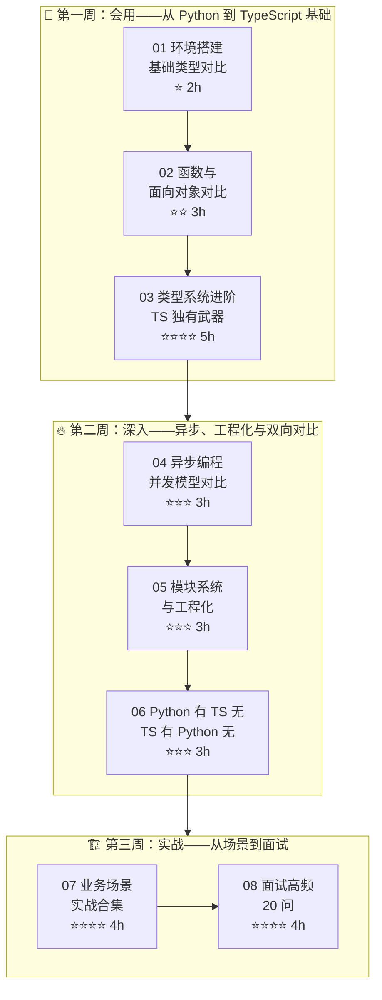

> 📌 **本学习路径基于 [[../../03-AI工具/AI协作方法论/技术学习路径创建方法论]] 的方法论构建**，专为**有 Python 经验的开发者**设计。以 Python 为锚点，逐篇映射 Python 概念到 TypeScript 等价物，辅以 Python 有 TS 无 / TS 有 Python 无的双向对比，由浅入深完成迁移。

> [!info] 版本基线
> TypeScript 5.x（4.4 起 strict 模式的 catch 变量为 unknown；Stage 3 标准装饰器 TS 5.0 已落地，默认无需 experimentalDecorators）；Python 3.12+（注意：TypeVar 默认值 PEP 696 落地于 **Python 3.13**；`asyncio.gather` 默认 fail-fast，宽松模式需显式 `return_exceptions=True`）。
>
> 🔄 **2026-09 口径**：TypeScript 当前为 **6.0**（`strict` 默认开启、为 native 编译器 7.0 过渡）；本路径的类型对照知识全部仍有效，版本细节见姐妹路径的版本口径注记。
>
> 🔗 **姐妹路径**：[[../TypeScript学习路径/00-TypeScript学习路径总索引|TypeScript 学习路径]]——彼路径为**系统学习**视角，本路径为 **Python 对照**视角，主题互补。

---

## 📖 学习路径概览

---

## 🧭 角色导航

| 角色 | 背景 | 推荐路线 | 预计学时 |
|------|------|---------|---------|
| 🐍 **Python 后端** | 熟悉 Flask/FastAPI，有类型注解经验 | 01→02→03→04→05→06→07→08（全部） | 27h |
| 🔄 **Python 全栈** | 用过 Django/Flask 全栈，有 JS 基础 | 01 速览→02 速览→03 重点→04→05→06 速览→07→08 | 20-24h |
| 🚀 **Python 数据科学** | 主要是 NumPy/Pandas/PyTorch | 全部学习路径，重点 03 类型系统和 05 工程化 | 27h |

### 🚀 背景速查：Python 经验可跳过的内容

| 可快速浏览的内容 | 原因 | 何时需要深读 |
|-------------|------|-------------|
| 01 基本类型（string/number/boolean） | 概念与 Python 高度一致 | 遇到 `any`/`unknown`/`never` 区别时 |
| 02 函数基础（参数、返回值） | 与 Python 函数概念一致 | 遇到函数重载、`this` 参数类型时 |
| 02 类基础（class/property） | 与 Python class 概念一致 | 遇到 `interface` vs `type`、抽象类时 |
| 04 async/await 语法 | 与 Python async/await 语法一致 | 遇到 Promise 链、事件循环差异时 |
| 05 npm 基础操作 | 与 pip 逻辑一致 | 遇到 monorepo、workspaces 时 |

---

## 📊 阶段总览

| 阶段 | 笔记数 | 预计学时 | 难度 | 核心目标 |
|------|--------|---------|------|---------|
| 第一周 | 3 篇 | 10h | ⭐→⭐⭐⭐⭐ | 建立 Python→TS 概念映射，掌握 TS 独有的类型系统 |
| 第二周 | 3 篇 | 9h | ⭐⭐⭐ | 理解异步模型差异，掌握工程化体系，建立双向对比认知 |
| 第三周 | 2 篇 | 8h | ⭐⭐⭐⭐ | 10 大场景实战，面试对答如流 |

> **总学时**：约 27h（Python 开发者）

---

## 📋 笔记索引

### 第一周：会用

| 序号 | 笔记 | 难度 | 学时 | Python 锚点 |
|------|------|------|------|------------|
| 01 | [[01-环境搭建与基础类型对比]] | ⭐ | 2h | pip→npm, Python 类型→TS 类型 |
| 02 | [[02-函数与面向对象对比]] | ⭐⭐ | 3h | Python 函数/类→TS 函数/接口/类 |
| 03 | [[03-类型系统进阶-TS独有武器]] | ⭐⭐⭐⭐ | 5h | TypeVar→泛型，TS 独有的条件类型/映射类型 |

### 第二周：深入

| 序号 | 笔记 | 难度 | 学时 | Python 锚点 |
|------|------|------|------|------------|
| 04 | [[04-异步编程与并发模型对比]] | ⭐⭐⭐ | 3h | asyncio→Promise, GIL→事件循环 |
| 05 | [[05-模块系统与工程化]] | ⭐⭐⭐ | 3h | pip/poetry→npm, pyproject.toml→tsconfig |
| 06 | [[06-Python有TS无与TS有Python无]] | ⭐⭐⭐ | 3h | 双向特性全景对比 |

### 第三周：实战

| 序号 | 笔记 | 难度 | 学时 | Python 锚点 |
|------|------|------|------|------------|
| 07 | [[01-学习/TypeScriptLearningByPython/07-业务场景实战合集|07-业务场景实战合集]] | ⭐⭐⭐⭐ | 4h | 10 大场景 Python→TS 迁移 |
| 08 | [[01-学习/TypeScriptLearningByPython/08-面试高频20问-Python背景版|08-面试高频20问-Python背景版]] | ⭐⭐⭐⭐ | 4h | 每问带 Python 对比视角 |

---

## 🗺️ Python → TypeScript 核心概念映射速查

| Python 概念 | TypeScript 等价 | 差异说明 |
|------------|----------------|---------|
| `str` | `string` | 基本一致，TS 有模板字面量类型 |
| `int` / `float` | `number` | TS 统一为 number（64 位浮点） |
| `bool` | `boolean` | 一致 |
| `None` | `null` / `undefined` | TS 区分两种空值 |
| `list` | `Array<T>` / `T[]` | TS 可标注元素类型 |
| `tuple` | `[T1, T2, ...]` | TS 元组固定长度和类型 |
| `dict` | `Record<K, V>` / `{ [key: K]: V }` | TS 有多种映射类型 |
| `set` | `Set<T>` | 一致 |
| `Optional[T]` | `T \| null` / `T \| undefined` | TS 用联合类型表达 |
| `Union[T1, T2]` | `T1 \| T2` | TS 联合类型是语言级核心特性 |
| `Callable` | `(...args: A) => R` | TS 函数类型更灵活 |
| `TypeVar` | 泛型 `<T>` | TS 泛型更强大，支持约束和条件 |
| `Protocol` | `interface` | TS 接口是核心，支持声明合并 |
| `ABC` / `abstractmethod` | `abstract class` | TS 有 abstract 关键字 |
| `@dataclass` | `interface` + 对象字面量 | TS 无 dataclass，用 interface 替代 |
| `Enum` | `enum` / `as const` | TS 推荐 `as const` + 联合类型替代 enum |
| `async def` | `async function` | 语法一致，运行时模型不同 |
| `await` | `await` | 语法一致 |
| `__init__` | `constructor` | TS 用 constructor 关键字 |
| `self` | `this` | TS 的 this 更复杂，需关注上下文 |
| `@property` | `get` / `set` | TS 有 getter/setter 语法 |
| `@staticmethod` | `static` | 一致 |
| `@classmethod` | 无直接等价 | TS 无类方法概念 |
| `try/except` | `try/catch` | 错误处理模型不同 |
| `with` 上下文管理器 | `try/finally` 或 `using` (TS 5.2+) | TS 5.2+ 引入 using 声明 |
| `yield` / 生成器 | `function*` / `yield` | JS/TS 有 Generator，但用法不同 |
| `pip install` | `npm install` | 包管理哲学不同 |
| `venv` | `node_modules` | 本地目录 vs 全局安装 |
| `pyproject.toml` | `tsconfig.json` + `package.json` | 两个文件分工 |
| `pytest` | `vitest` / `jest` | 测试框架生态不同 |
| `FastAPI` | `Express` / `NestJS` / `Hono` | Web 框架生态不同 |
| `pandas` | `lodash` / 原生方法 | 数据处理能力差异大 |
| `NumPy` | 无直接等价 | 需 WebAssembly 或调用 Python |
| 多重继承 | 无 | TS 用接口 + 组合替代 |
| 元类（metaclass） | 无 | TS 无运行时元编程能力 |
| 装饰器（无限制） | 装饰器（Stage 3 TC39） | TS 装饰器有限制 |
| 上下文变量 `ContextVar` | `AsyncLocalStorage` | Node.js 等价物 |

---

## 📋 复习检查点索引

| 检查点 | 覆盖篇 | 难度 | 学时 | 核心练习 |
|--------|--------|------|------|----------|
| [[01-学习/TypeScriptLearningByPython/99-第一周复习检查点|99-第一周复习检查点]] | 01-03 | ⭐⭐ | 2h | dataclass 迁移、类型守卫、穷尽性检查 |
| [[01-学习/TypeScriptLearningByPython/99-第二周复习检查点|99-第二周复习检查点]] | 04-06 | ⭐⭐⭐ | 2h | asyncio 迁移、错误处理系统、双向对比选择题 |
| [[01-学习/TypeScriptLearningByPython/99-第三周复习检查点|99-第三周复习检查点]] | 07-08 | ⭐⭐⭐⭐ | 2h | Flask→Express 迁移、模拟面试、完整项目实战 |

---

## 🚀 毕业项目：Python 任务管理器 v1→v5

| 版本 | 名称 | 难度 | 学时 | 核心改造 | Python 锚点 |
|------|------|------|------|----------|------------|
| v1 | [[毕业项目-Python任务管理器/v1-类型标注版]] | ⭐⭐ | 2h | 纯类型标注，不改逻辑 | Python 动态类型→TS 静态类型 |
| v2 | [[毕业项目-Python任务管理器/v2-接口与泛型版]] | ⭐⭐⭐ | 3h | interface + 泛型抽象 | Python @dataclass→TS interface |
| v3 | [[毕业项目-Python任务管理器/v3-异步与错误处理版]] | ⭐⭐⭐ | 3h | Promise + 自定义错误类型 | Python try/except→TS 可辨识联合 |
| v4 | [[毕业项目-Python任务管理器/v4-模块化与工程化版]] | ⭐⭐⭐⭐ | 3h | 模块拆分 + tsconfig + 构建 | Python 包结构→TS ESM 模块 |
| v5 | [[毕业项目-Python任务管理器/v5-测试与发布版]] | ⭐⭐⭐⭐ | 4h | vitest + CI + npm 发布 | pytest→vitest, PyPI→npm |

> **毕业项目总学时**：约 15h | **版本递进哲学**：每个版本只改一个维度，逐步从"能编译"到"可发布"

---

## 📐 质量审查报告

本学习路径的三维审查报告存放于 `reviews/` 目录：

| 报告 | 审查维度 | 文件 |
|------|----------|------|
| 结构审查 | 完整性、顺序、递进、引用、冗余 | [[reviews/01-结构审查报告]] |
| 技术校验 | API 一致性、代码可运行性、概念对齐 | [[reviews/02-技术校验报告]] |
| 体验优化 | 练习设计、巩固机制、差异化路径 | [[reviews/03-体验优化报告]] |

---

## 🛠️ 环境准备

| 工具 | 用途 | 安装命令 |
|------|------|---------|
| Node.js >= 20 LTS | 运行时 | `nvm install 20` 或 [nodejs.org](https://nodejs.org/) |
| TypeScript >= 5.5 | 类型检查 | `npm i -g typescript` |
| tsx | 快速运行 TS（替代 ts-node） | `npm i -g tsx` |
| VS Code | 编辑器 | https://code.visualstudio.com/ |
| pnpm（推荐） | 包管理器 | `npm i -g pnpm` |

> [!tip] 为什么推荐 tsx 而不是 ts-node
> tsx 基于 esbuild，启动快 10-20 倍，且原生支持 ESM 和 TypeScript。对于习惯了 `python script.py` 的 Python 开发者，`tsx script.ts` 是最接近的体验。

---

## 🔗 相关笔记

- [[../../03-AI工具/AI协作方法论/技术学习路径创建方法论]] — 本学习路径的方法论来源
- [[../../03-AI工具/AI协作方法论/技术学习路径审查与优化方法论]] — 配套审查方法论
- [[../跨技术栈学习路径总览]] — 跨技术栈学习全景
- [[../TypeScript学习路径/00-TypeScript学习路径总索引]] — 原有 JS 背景版 TS 路径（可对比参考）
- [[../GoLearningByPython/00-Go 总览索引（Python 迁移版）]] — 姐妹路径（Python→Go），可对比 Go 与 TS 在并发、类型、部署上的差异

---

*最后更新：2026-07-24*