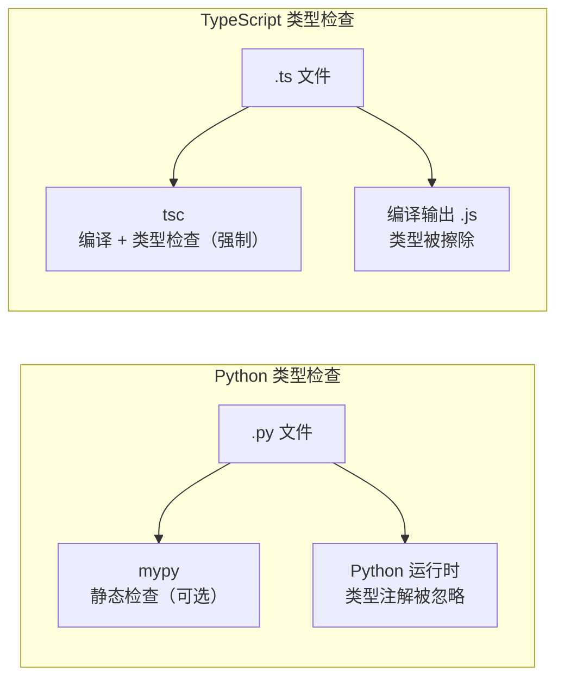
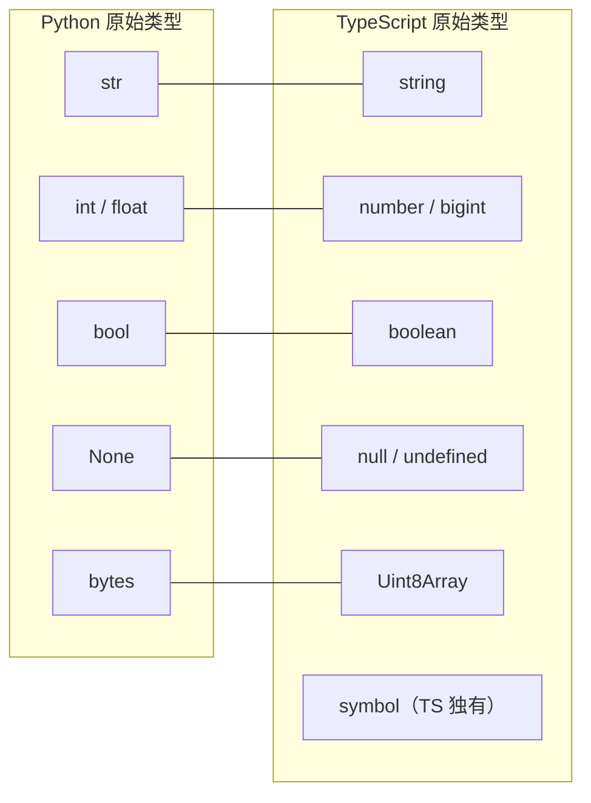
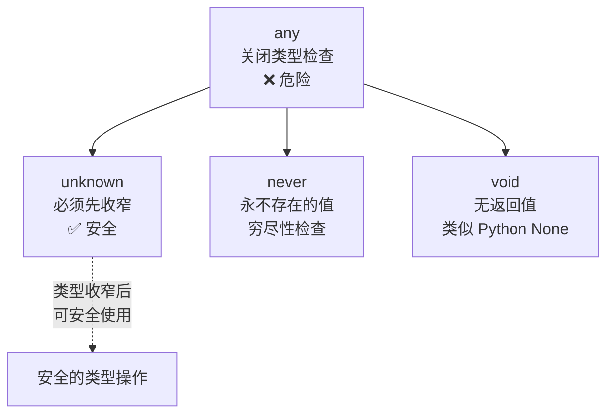

## 前置知识：为什么 Python 开发者学 TypeScript 有优势

Python 在 3.5+ 引入类型注解（`typing` 模块），你已经有**类型思维**。TypeScript 做的事情本质上和 `mypy` 一样——**给动态语言加静态类型检查**。区别在于：TS 的类型是编译时擦除的，Python 的类型注解是运行时保留的。



> [!important] 核心认知
> • Python 的类型注解是**可选的、非强制的**，mypy 是外挂工具
> • TypeScript 的类型检查是**内置的、强制的**，`tsc` 编译时如果不通过会报错
> • 学 TS 不需要重新学编程——你已经会了，只需要学**类型标注的差异**

---

## 1. 环境搭建：从 Python 生态映射到 Node 生态

### 1.1 工具链对比

| Python 工具 | TypeScript / Node 等价 | 差异说明 |
|------------|----------------------|---------|
| `python` / `python3` | `node` | Python 解释器 vs Node.js 运行时 |
| `pip` | `npm` / `pnpm` | pnpm 更省磁盘空间，推荐新项目用 |
| `venv` / `virtualenv` | `node_modules`（自动本地化） | **无需显式创建虚拟环境** |
| `pyproject.toml` | `package.json` | 项目元信息 + 脚本入口 |
| `pyproject.toml` [tool.mypy] | `tsconfig.json` | 类型检查配置 |
| `requirements.txt` | `package.json` dependencies | npm 自动生成 lock 文件 |
| `poetry.lock` | `package-lock.json` / `pnpm-lock.yaml` | 依赖锁定文件 |
| `pytest` | `vitest` / `jest` | 测试框架 |
| `flake8` / `ruff` | `eslint` + `prettier` | lint + 格式化 |
| `black` | `prettier` | 代码格式化 |
| `mypy --strict` | `tsc --strict` | 严格类型检查 |

### 1.2 初始化项目（对比 Python）

```bash
# ===== Python 做法 =====
mkdir my-project && cd my-project
python -m venv .venv
source .venv/bin/activate    # Linux/Mac
# .venv\Scripts\activate     # Windows
pip install mypy black pytest
# 创建 pyproject.toml

# ===== TypeScript 做法 =====
mkdir my-ts-project && cd my-ts-project
npm init -y                    # 生成 package.json（等价 pyproject.toml）
npm install -D typescript tsx  # 安装类型检查器 + 运行器
npx tsc --init                 # 生成 tsconfig.json（等价 mypy 配置）
# 无需虚拟环境！node_modules 自动隔离
```

> [!tip] node_modules 不需要手动创建虚拟环境
> npm 会把依赖安装在项目本地的 `node_modules/` 目录下，天然隔离。这和 Python 的 venv 效果一样，但不需要你手动 `source activate`。

### 1.3 tsconfig.json 最小配置（对比 mypy）

```jsonc
{
  "compilerOptions": {
    "target": "ES2022",              // 编译目标 JS 版本
    "module": "ESNext",              // 模块系统（推荐 ES Modules）
    "moduleResolution": "bundler",  // 模块解析策略（TS 5.0+ 推荐）
    "strict": true,                  // ★ 开启所有严格检查（类似 mypy --strict）
    "esModuleInterop": true,         // 兼容 CommonJS 导入
    "outDir": "./dist",              // 编译输出目录
    "rootDir": "./src",              // 源码根目录
    "skipLibCheck": true,            // 跳过 .d.ts 检查加速编译
    "noImplicitReturns": true,       // 函数分支必须都返回
    "noUnusedLocals": true,          // 不允许未使用变量
    "noUnusedParameters": true       // 不允许未使用参数
  },
  "include": ["src/**/*"]
}
```

mypy.ini 对比参考：

```ini
[mypy]
strict = True
disallow_untyped_defs = True
warn_return_any = True
```

### 1.4 运行 TypeScript（对比 Python）

```bash
# ===== Python =====
python script.py              # 直接运行
python -m pytest              # 运行测试

# ===== TypeScript =====
npx tsx src/script.ts         # 直接运行（无需编译，最接近 python 体验）
npx tsc && node dist/script.js  # 先编译再运行
npx vitest                    # 运行测试
```

> [!tip] Python 开发者的肌肉记忆映射
> - `python script.py` → `tsx script.ts`
> - `python -c "print('hi')"` → `tsx eval "console.log('hi')"`
> - `mypy script.py` → `tsc --noEmit`
> - `pip install pkg` → `pnpm add pkg`

### 1.5 第一个 TypeScript 程序

```typescript
// src/hello.ts
function greet(name: string): string {
  return `Hello, ${name}!`;  // 模板字符串，与 Python f-string 类似
}

console.log(greet("TypeScript"));
```

### 1.6 项目结构对比

```text
# Python 项目                    TypeScript 项目
my-project/                      my-ts-project/
├── pyproject.toml               ├── package.json
├── .venv/                       ├── node_modules/  （自动生成）
├── src/                         ├── src/
│   ├── __init__.py              │   ├── index.ts
│   ├── main.py                  │   ├── main.ts
│   └── utils.py                 │   └── utils.ts
├── tests/                       ├── tests/
│   └── test_main.py             │   └── main.test.ts
└── mypy.ini                     └── tsconfig.json
```

---

## 2. 基础类型：Python → TypeScript 逐项映射

### 2.1 原始类型对照表



| Python | TypeScript | 差异说明 |
|--------|-----------|---------|
| `str` | `string` | 基本一致。TS 有模板字面量类型（`` `on${string}` ``） |
| `int` + `float` | `number` | **TS 统一为 number**（IEEE 754 双精度浮点） |
| `bool` | `boolean` | 一致 |
| `None` | `null` \| `undefined` | **TS 有两种空值**，见下文详解 |
| `complex` | 无原生 | 需 `{ re: number; im: number }` |
| `bytes` | `Uint8Array` 等 | TS 用 TypedArray |
| — | `symbol` | TS 独有，用于唯一标识符 |
| — | `bigint` | TS 独有，表示大整数 `9007199254740991n` |

```typescript
// ====== 基础类型标注 ======

// string — 与 Python str 一致
const name: string = "Alice";
const template: string = `Hello, ${name}`;  // 类似 f-string

// number — Python 的 int 和 float 统一为 number
const age: number = 25;          // Python: age: int = 25
const pi: number = 3.14;        // Python: pi: float = 3.14

// boolean — 与 Python bool 一致
const isActive: boolean = true;

// null 和 undefined — Python 只有 None
const empty: null = null;            // 有意为之的空值
const notSet: undefined = undefined;  // 未赋值

// symbol — TS 独有
const id: symbol = Symbol("id");

// bigint — TS 独有，表示大整数
const big: bigint = 9007199254740991n;
```

> [!important] null vs undefined：Python 开发者最大的困惑
> Python 只有 `None` 表示空值。TypeScript 有两个：
> - **`undefined`**：变量声明了但未赋值（类似 Python 变量未初始化）
> - **`null`**：显式赋值为空（类似 Python `x = None`）
>
> 经验法则：**函数参数和对象属性默认用 `undefined`**，**显式表达"这里没有值"时用 `null`**。

### 2.2 数组与元组

```typescript
// ====== 数组 ======

// Python: nums: list[int] = [1, 2, 3]
const nums: number[] = [1, 2, 3];           // 推荐写法
const strs: Array<string> = ["a", "b"];      // 等价写法

// Python: matrix: list[list[int]] = [[1,2],[3,4]]
const matrix: number[][] = [[1, 2], [3, 4]];

// ====== 元组（Tuple） ======

// Python: pair: tuple[str, int] = ("age", 25)
const pair: [string, number] = ["age", 25];
const [label, value] = pair;  // 解构赋值，与 Python 解包一致

// Python 没有的：可选元组元素
const flexible: [string, number?] = ["age", 25];
const minOnly: [string, number?] = ["name"];
```

| Python | TypeScript | 差异 |
|--------|-----------|------|
| `list[int]` | `number[]` / `Array<number>` | TS 有两种等价写法 |
| `tuple[str, int]` | `[string, number]` | 一致 |
| `tuple[str, ...]`（可变元组） | `[string, ...number[]]` | TS 用展开语法 |

### 2.3 字典与 Record

```typescript
// Python: config: dict[str, int] = {"port": 8080}
// TS 有多种等价写法：

// 方式一：Record（推荐，最简洁）
const config: Record<string, number> = { port: 8080 };

// 方式二：索引签名
const config2: { [key: string]: number } = { port: 8080 };

// 方式三：精确接口（最安全，key 必须匹配）
interface Config { port: number; host: string; }
const config3: Config = { port: 8080, host: "localhost" };

// 方式四：Map（key 可以是任意类型，不仅仅是 string）
const map = new Map<string, number>();
map.set("port", 8080);
```

> [!important] Python 的 dict 在 TS 中有多种等价形式
> • `Record<K, V>` —— 最简洁，推荐日常使用
> • `{ [key: K]: V }` —— 索引签名，更灵活
> • `Map<K, V>` —— JS 原生 Map，key 可以是任意类型
> • 普通对象 `{}` —— key 只能是 string 或 symbol

---

## 3. 特殊类型：any / unknown / never / void

这四个类型是 Python 开发者最需要理解的 TS 独有概念：



| TypeScript 类型 | 含义 | Python 对应 | 安全性 |
|----------------|------|------------|--------|
| `any` | 关闭类型检查 | `Any`（typing.Any） | ❌ 不安全 |
| `unknown` | 安全的 any，必须先收窄 | 无直接对应 | ✅ 安全 |
| `never` | 永不存在的值 | `NoReturn` | ✅ 安全 |
| `void` | 无返回值 | `None`（返回注解） | ✅ 安全 |

```typescript
// ===== any — 危险的逃生舱 =====
let a: any = "hello";
a.foo();        // 编译通过！运行时崩溃
a.bar.baz();    // 编译通过！运行时崩溃
// Python 等价：typing.Any —— mypy 也会放行

// ===== unknown — 安全的 any =====
let u: unknown = "hello";
// u.toUpperCase();  // ❌ 不允许直接调用

// 必须先收窄类型（类型守卫）
if (typeof u === "string") {
  u.toUpperCase();  // ✅ 这里 u 被收窄为 string
}
// Python 最接近：用 isinstance 收窄

// ===== never — 永不存在的值 =====
function throwError(msg: string): never {
  throw new Error(msg);
}
function infiniteLoop(): never {
  while (true) {}
}

// never 的经典用法：穷尽性检查（TS 独有！）
type Shape = "circle" | "square";
function area(s: Shape): number {
  switch (s) {
    case "circle": return Math.PI * 10 ** 2;
    case "square": return 10 ** 2;
    default:
      const _exhaustive: never = s;  // 如果漏了 case，这里会报错！
      return _exhaustive;
  }
}

// ===== void — 无返回值 =====
// Python: def log(msg: str) -> None:
function log(msg: string): void {
  console.log(msg);
}
```

> [!warning] unknown vs any：Python 开发者必读
> Python 没有 `unknown` 的直接等价。当你处理**不确定类型的数据**（如 JSON 解析、API 响应）时：
> - 用 `any` = 完全放弃类型检查（危险）
> - 用 `unknown` = 要求先做类型收窄再使用（安全）
>
> **经验法则：永远用 `unknown` 代替 `any`**。

---

## 4. 类型推断：let vs const 的区别

Python 没有这个概念——Python 的变量类型不随赋值方式变化。

```python
# Python：变量类型不随赋值方式变化
x = 10       # int
name = "hi"  # str
# 类型由值决定，与"是否可变"无关
```

```typescript
// TypeScript：let 和 const 推断结果不同！
let x = 10;        // 推断为 number（宽泛类型，因为 let 可变）
const y = 10;      // 推断为 10（字面量类型！因为 const 不可变）

let s = "hello";   // 推断为 string
const s2 = "hello"; // 推断为 "hello"（字面量类型）

// 实际影响：
type Method = "GET" | "POST";
const method = "GET";     // 类型是 "GET"，可以赋给 Method ✅
let method2 = "GET";      // 类型是 string，不能赋给 Method ❌
```

> [!tip] 推断规则记忆法
> • `const` → 推断为**最精确的字面量类型**（因为值不会变）
> • `let` → 推断为**宽泛的基础类型**（因为值可能会变）
> • 能推断就别手动标注（函数参数和返回值除外）

---

## 5. 枚举与字面量类型

```typescript
// ===== 方式一：enum（TS 传统方式） =====
// Python: from enum import Enum; class Direction(Enum): Up = "UP"
enum Direction {
  Up = "UP",
  Down = "DOWN",
  Left = "LEFT",
  Right = "RIGHT",
}
let d: Direction = Direction.Up;

// ===== 方式二：as const + 联合类型（★ 推荐） =====
const Direction2 = {
  Up: "UP",
  Down: "DOWN",
  Left: "LEFT",
  Right: "RIGHT",
} as const;  // ★ as const 锁定字面量类型

type Direction2 = typeof Direction2[keyof typeof Direction2];
// 类型: "UP" | "DOWN" | "LEFT" | "RIGHT"

let d2: Direction2 = "UP";  // 直接用字符串字面量
```

| 特性 | Python Enum | TS enum | TS `as const` + 联合 |
|------|------------|---------|---------------------|
| 运行时开销 | 有 | 有（生成对象） | 无（编译时擦除） |
| 类型安全 | 弱 | 中 | 强 |
| tree-shaking | 不适用 | 不支持 | 支持 |
| 推荐度 | — | ⚠️ 不推荐新项目 | ✅ 推荐 |

> [!important] 2026 年 TS 社区趋势
> 新项目**优先用 `as const` + 联合类型**，而非 `enum`。原因：enum 有运行时开销、不支持 tree-shaking、类型推断不如联合类型精确。TypeScript 6.0 计划将 `--erasableSyntaxOnly` 作为默认，enum 会被限制。

---

## 6. 类型断言

```typescript
// ===== as 语法（推荐） =====
// Python 无直接等价，最接近的是 cast()
const el = document.getElementById("app") as HTMLDivElement;

// ===== const 断言 ======
// 锁定为最精确的字面量类型 + readonly
const point = [1, 2] as const;  // readonly [1, 2]
// point[0] = 10;  // ❌ 不可变

// ===== 非空断言（!） =====
// Python 无直接等价
let value: string | null = getValue();
const len = value!.length;  // 告诉编译器"我确定这里不是 null"
// ★ 但如果运行时是 null，会崩溃！尽量少用
```

> [!warning] 断言不会在运行时做检查
> 类型断言只影响编译时，运行时不做任何验证。这和 Python 的 `cast()` 一样——它不做实际转换。滥用断言会破坏类型安全。

---

## 常见易错点

> [!warning] **坑 1：null 和 undefined 是不同的类型**
> ```typescript
> // Python 只有 None，TS 有两种空值！
> let a: string | null = null;        // 显式空值
> let b: string | undefined = undefined; // 未赋值
> // 在 strictNullChecks 下，两者不能互相赋值
> // x = null;      // 如果 x: undefined → ❌
> // y = undefined;  // 如果 y: null → ❌
> ```
> **为什么错**：JS 历史遗留，`null` 和 `undefined` 语义不同
> **解决方案**：项目统一用 `null` 表示"显式无值"，`undefined` 表示"未赋值"

> [!warning] **坑 2：number 没有真正的整数类型**
> ```typescript
> // Python 的 int 是任意精度，TS 的 number 是 64 位浮点
> const big: number = 9007199254740993;  // 超过 Number.MAX_SAFE_INTEGER
> console.log(big);  // 9007199254740992（精度丢失！）
> // 用 bigint 替代：
> const safe: bigint = 9007199254740993n;
> ```
> **为什么错**：JS 没有整数类型，所有 number 都是浮点
> **解决方案**：大整数用 `bigint`，但注意不能和 `number` 混算

> [!warning] **坑 3：any 会"传染"**
> ```typescript
> const data: any = fetchData();
> const name = data.user.name;  // name 的类型也是 any！
> // 整个表达式链都失去了类型安全
> ```
> **为什么错**：`any` 让整个类型系统失效，等于退化为 JavaScript
> **解决方案**：用 `unknown` + 类型守卫代替 `any`

> [!warning] **坑 4：== vs === 的区别**
> ```typescript
> // Python: == 比较值，is 比较身份
> // TS: === 严格相等（推荐），== 宽松相等（有类型转换）
> 0 == "";        // true（宽松相等，有隐式转换）
> 0 === "";       // false（严格相等，无转换）
> null == undefined;   // true
> null === undefined;  // false
> ```
> **为什么错**：`==` 有复杂的隐式类型转换规则
> **解决方案**：**永远用 `===`**。ESLint 配置 `eqeqeq: "error"` 强制

> [!warning] **坑 5：var 的函数作用域**
> ```typescript
> // ❌ var 有变量提升，且是函数作用域
> for (var i = 0; i < 3; i++) { setTimeout(() => console.log(i), 0); }  // 3,3,3
> // ✅ let 是块级作用域
> for (let i = 0; i < 3; i++) { setTimeout(() => console.log(i), 0); }  // 0,1,2
> ```
> **为什么错**：`var` 有变量提升和函数作用域，导致闭包陷阱
> **解决方案**：**永远不用 `var`**，只用 `let` 和 `const`

> [!warning] **坑 6：const 对象的属性仍可修改**
> ```typescript
> const user = { name: "Alice", age: 25 };
> user.age = 26;  // ✅ 合法！const 只保证引用不变
>
> // 如需完全不可变，用 as const
> const user2 = { name: "Alice", age: 25 } as const;
> // user2.age = 26;  // ❌ 只读属性不可修改
> ```
> **为什么错**：`const` 只保证引用不变，不保证对象内容不变（与 Python 一致）
> **解决方案**：用 `as const` 或 `Readonly<T>` 实现深度只读

> [!warning] **坑 7：空数组 `[]` 的类型推断**
> ```typescript
> let arr = [];   // 不是 never[]！是"演化数组"（evolving array）
> arr.push(1);    // ✅ 合法：push 后元素类型演化为 number
>
> // 但如果不 push 就直接使用/返回，strict 下报隐式 any[]：
> function bad() {
>   const a = [];
>   return a;     // ❌ TS7034/TS7005：implicitly has type 'any[]'
> }
>
> // 真正常见的 never[] 陷阱：reduce 的初始值 []
> // [1,2,3].reduce((acc, x) => [...acc, x], []);  // ❌ acc 被推断为 never[]
>
> // ✅ 正确：显式标注元素类型
> let nums: number[] = [];
> nums.push(1);
> ```
> **为什么错**：空数组字面量本身没有元素类型信息；演化数组依赖后续写入来定型，而 `reduce` 初始值这类位置无法演化，会落到 `never[]`
> **解决方案**：声明数组时显式标注元素类型（`let arr: number[] = []`），`reduce` 初始值标注类型或用 `[] as number[]`

---

## 🎯 本文学完自检

| 层次 | 检查项 |
|------|--------|
| 🟢 基础 | 能独立搭建 TS 开发环境，用 `tsx` 运行第一个 .ts 文件 |
| 🟢 基础 | 能列出 Python 基础类型（str/int/float/bool/list/dict）到 TS 的映射 |
| 🟡 进阶 | 能解释 `null` vs `undefined` 的区别，说明 Python 只有 `None` |
| 🟡 进阶 | 能解释 `any` vs `unknown` vs `never` vs `void` 的区别和各自适用场景 |
| 🔴 挑战 | 能用 `as const` + 联合类型替代 `enum`，并说出三个优势 |

---

## 相关笔记

- ⬅️ 前置：[[00-TypeScript 总览索引（Python 迁移版）]]
- ➡️ 后续：[[02-函数与面向对象对比]] — 从 Python 函数/类到 TS 函数/接口/类
- ➡️ 后续：[[03-类型系统进阶-TS独有武器]] — 泛型、条件类型、映射类型
- 🔗 关联：[[06-Python有TS无与TS有Python无]] — 双向特性全景对比

---

*最后更新：2026-07-22*